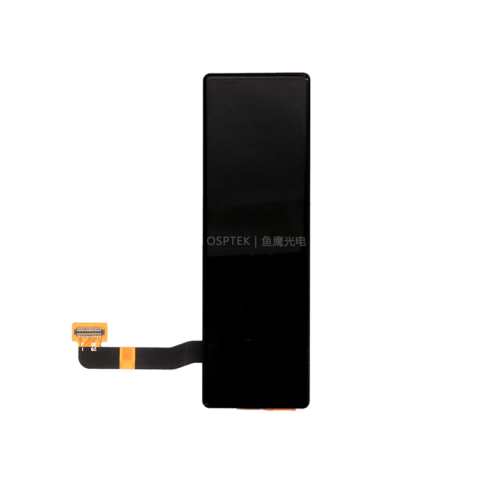

<h1 align="center">OSPTEK 3.19″ AMOLED 262×928 (CO6300 · MIPI)</h1>

<b>Bar AMOLED module · MIPI DSI · CO6300 · Multi-Version Index</b>

English | <a href="./README.md">简体中文</a>

  
  
  
  

## Contents

- [About](#about)
- [Versions](#versions)
- [AM319M262928ZS](#am319m262928zs)
- [Where to Buy](#where-to-buy)
- [Support](#support)

---

## About

This repository holds materials for the **3.19″ 262×928 AMOLED (MIPI · CO6300)** module family.

The **root README is the navigation page**. Use the table below for a quick scan; open **Full docs** to enter that **part-number folder** under `versions/` (product page, datasheets, and examples live there).

Repo id: `3.19-amoled-262x928-mipi-co6300`

---

## Versions

| Version | Image | Summary | Full docs |
| ------- | ----- | ------- | --------- |
| AM319M262928ZS |  | [Summary](#am319m262928zs) | [Full docs](./versions/AM319M262928ZS/) |

---

## AM319M262928ZS

**Notes:** With touch (CST3530).

Full product page, datasheets, and examples: [versions/AM319M262928ZS/](./versions/AM319M262928ZS/)

---

## Where to Buy

  
  &nbsp;&nbsp;
  

**International (AliExpress)**

- Store: [OSPTEK Official Store](https://www.aliexpress.com/store/1105701619)

**China (Taobao)**

- Store: [鱼鹰光电工厂店](https://shop110742373.taobao.com/)

---

## Support

- Technical Support / Sales: <luyu@osptek.com>
- QQ Technical Group: **985881096**
- Website: <https://osptek.com/>
- Feel free to open an Issue in this repository if you have any questions

---

© 2026 OSPTEK · Licensed under CC BY 4.0

