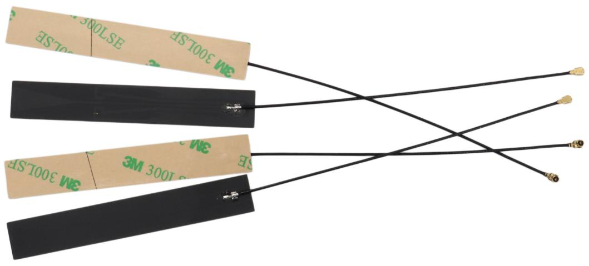
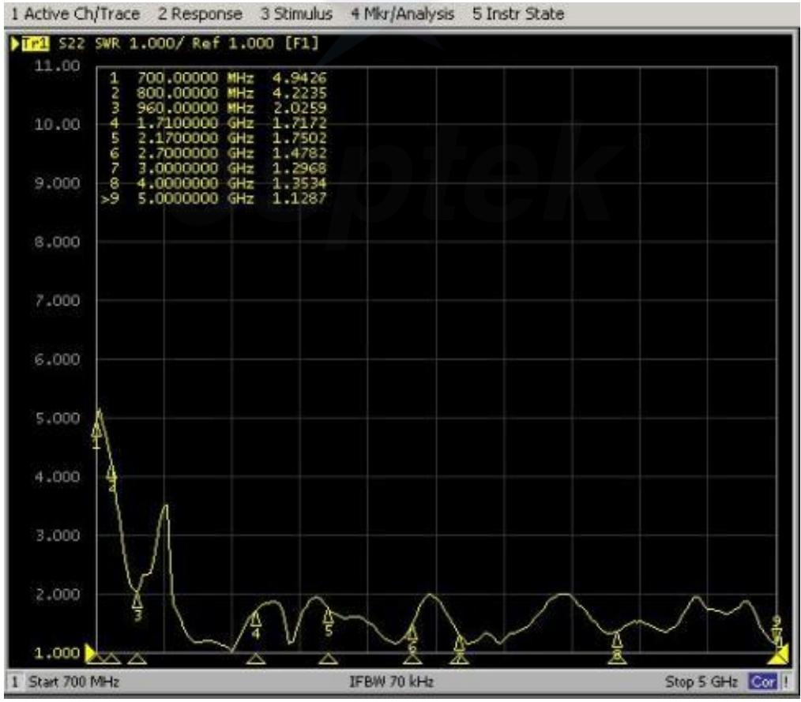

# C5双频天线

5G黑色长条PCB/1.13线L=120MM(1代端子)

text_image

osptek®

# 1. 产品图片：

text_image

3M 300LSF
SE100C
3M
3M 300LSF
SE100C WE
3M

# 2. 电气性能测试报告:

VSWR:  

line

| Frequency (MHz) | SWR |
| --- | --- |
| 700.00000 | 4.9426 |
| 800.00000 | 4.2235 |
| 960.00000 | 2.0259 |
| 1.7100000 | 1.7172 |
| 2.1700000 | 1.7502 |
| 2.7000000 | 1.4782 |
| 3.0000000 | 1.2968 |
| 4.0000000 | 1.3534 |
| >5.0000000 | 1.1287 |

# 3. 产品性能参数:

<table><tr><td colspan="2">电性能指标Electrical Specifications</td></tr><tr><td>频率范围Frequency Range (MHz)</td><td>700-960/ 1710-2700/3000-5000</td></tr><tr><td>输入阻抗Input Impedence (Ω)</td><td>50</td></tr><tr><td>电压驻波比V.S.W.R</td><td>≤2.0(未匹配设备,仅供参考)</td></tr><tr><td>增益Gain (dBi)</td><td>3.0±0.5(未匹配设备,仅供参考)</td></tr><tr><td>极化形式Polarization Type</td><td>垂直Vertical</td></tr><tr><td>最大功率Maximum power(W)</td><td>10W</td></tr><tr><td>垂直面波瓣角度Vertical lobe Angle (E)</td><td>45~60°</td></tr><tr><td>水平面波瓣角度Water plane lobe Angle (H)</td><td>360°</td></tr><tr><td colspan="2">机械指标Mechanical Specifications</td></tr><tr><td>天线材质Material</td><td>FPC</td></tr><tr><td>连接器型号Connect Type</td><td>IPEX(1代)</td></tr><tr><td>天线尺寸Size</td><td>20*99.5*1MM</td></tr><tr><td>工作温度Operating Temp</td><td>-20~+65 oC</td></tr><tr><td>储存温度Storage Temp</td><td>-30~+75oC</td></tr></table>