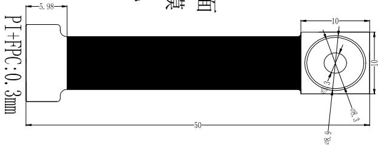
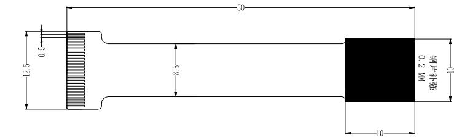
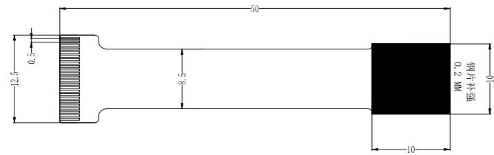
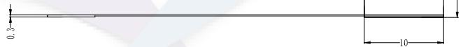
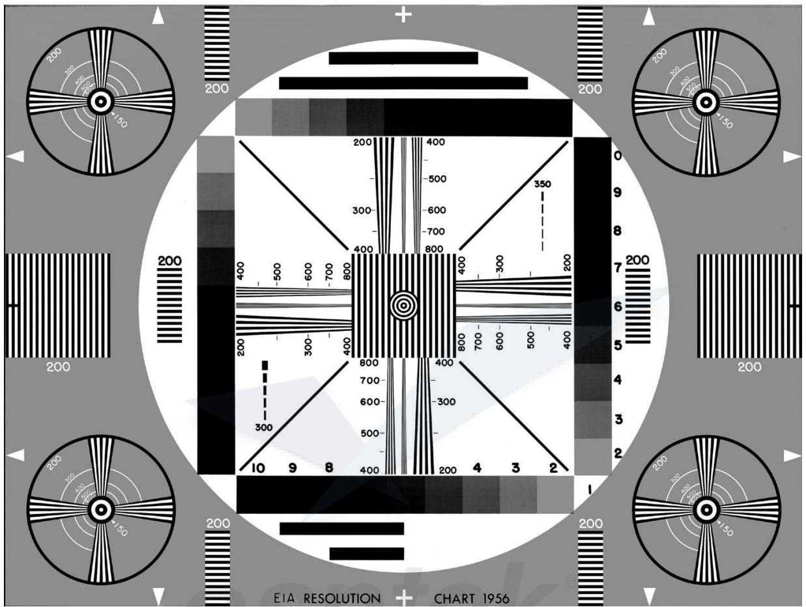
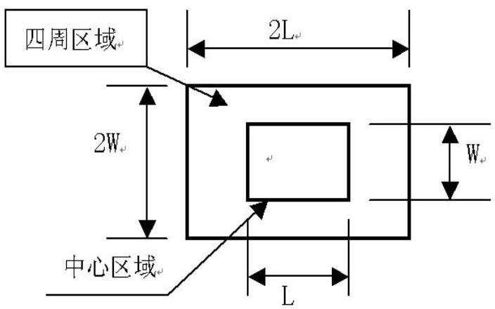
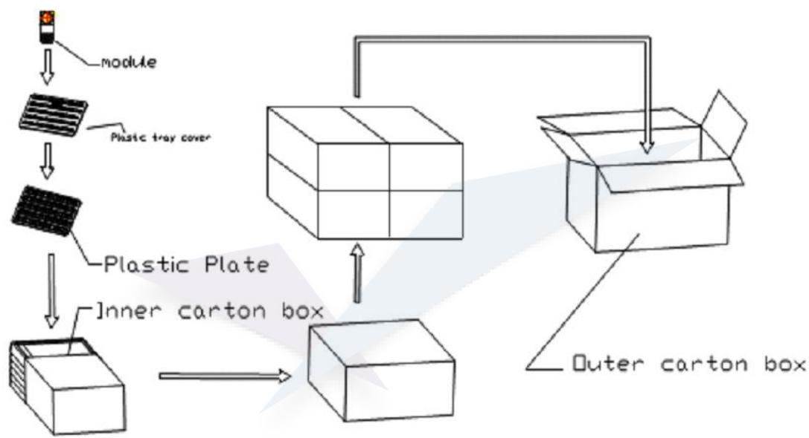
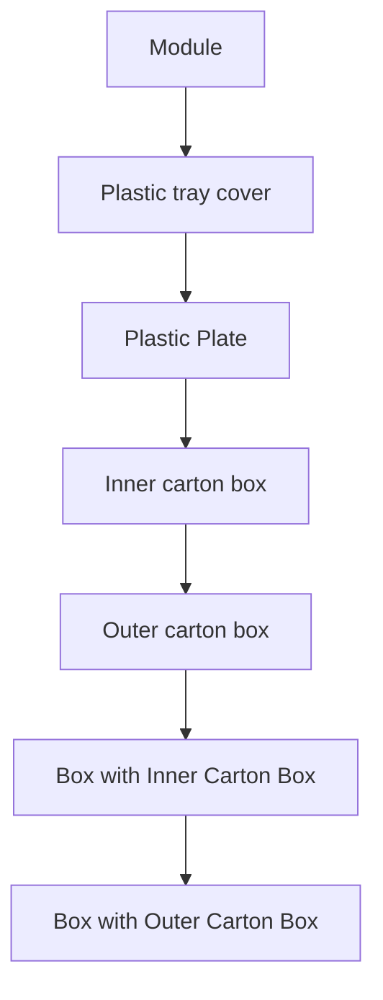

# Osptek Display

# 2MP CAMERA SPECIFICATION

Model No:

ESP32-P4-Camera

# 第一章：前言

本公司推出的 CMOS 摄像模块是高精度相机的内置式组件，实现了优质的 CMOS 影像传感器与高度集成的影像处理器、嵌入式电源和高质量的非球面透镜组结合在一起，支持 YUV/RGB data 等数据格式。

其小巧的体积、高度集成的特点，降低了设计中对体积的要求，可以大大缩短了手机、PDA 和 MP4 等产品面市周期。

第二章 总体性能指标

<table><tr><td>项目</td><td>性能</td><td>备注</td></tr><tr><td>象素数</td><td>200万</td><td></td></tr><tr><td>Pixel Size</td><td>1/2.8 inch</td><td></td></tr><tr><td>拍摄图像分辨率</td><td>1920x 1080</td><td></td></tr><tr><td>能耗</td><td>30fps@ full size</td><td></td></tr><tr><td>镜头结构</td><td>4P+IR</td><td></td></tr><tr><td>EFL焦距</td><td>4.2+/-5%MM</td><td></td></tr><tr><td>F/NO光圈数</td><td>2.0+/-5%MM</td><td></td></tr><tr><td>最佳拍摄距离</td><td>80CM</td><td></td></tr><tr><td>视场</td><td>D:75° H:56° V:42°</td><td></td></tr><tr><td>畸变</td><td>V:-1% H:-1%</td><td></td></tr><tr><td>输出引脚</td><td>24PIN</td><td></td></tr><tr><td>图像传输速率</td><td>30fps, QVGA</td><td></td></tr><tr><td>白平衡(AWB)</td><td>自动</td><td></td></tr><tr><td>曝光控制(AEC)</td><td>自动</td><td></td></tr><tr><td>输出信号</td><td>YCbCr4:2:2, RGB565, Raw Bayer</td><td></td></tr><tr><td>工作电压</td><td>AVDD:2.8 DOVDD1.8 DVDD1.5V</td><td></td></tr><tr><td>外形尺寸</td><td>见结构图</td><td></td></tr><tr><td>FPC 可靠性</td><td>IPC-TM-650 OK</td><td></td></tr><tr><td>FPC 焊锡性</td><td>IPC-TM-650 METHOD2.4.13(SOLDER FLOAT) OK</td><td></td></tr><tr><td>FPC 剥离强度</td><td>0.97KG/cm(覆盖膜≥0.85KG/cm)</td><td></td></tr><tr><td>FPC 耐热冲击</td><td>IPC-TM-650 METHOD2.6.8无分层、无起泡</td><td></td></tr><tr><td>ROHS 标准</td><td>依客户要求</td><td></td></tr><tr><td>Sensor 型号</td><td>SC2336</td><td></td></tr></table>

# 第三章：机械结构及 PIN 定义

<table><tr><td colspan="18">深圳市金鹰光电科技有限公司</td></tr><tr><td>Lens parameter</td><td>4P+65018</td><td>镜头类型(Lens Size)</td><td>1/2.8</td><td></td><td colspan="13">镜头记录</td></tr><tr><td>图像传感器 (Sensor)</td><td>SC2336</td><td>焦距 (Erl.)</td><td>4.2</td><td></td><td>修改内容</td><td>修改时间</td><td rowspan="5" colspan="11"></td></tr><tr><td>像素 (Array Size)</td><td>200W</td><td>光圈 (P/N0.)</td><td>2.0±5%</td><td></td><td>初始版本</td><td>2025-6-16</td></tr><tr><td>数字电压 (DVDD)</td><td>NC</td><td>陶瓷 (Distratlon)</td><td>&lt;1%</td><td></td><td></td><td></td></tr><tr><td>模拟电压 (AMD)</td><td>2.8V</td><td></td><td></td><td></td><td></td><td></td></tr><tr><td>10电压 (DVDD)</td><td>18V</td><td></td><td></td><td></td><td></td><td></td></tr><tr><td rowspan="5" colspan="18"></td></tr><tr></tr><tr></tr><tr></tr><tr></tr></table>

4.样品尺寸公差为±0.2mm  
3. 未标注的尺寸公差为±0.1mm  
2.FPC柔软可180度弯折  
1. 圆角处要光滑不能有棱角，断裂

$\mathrm{PI + FPc:0.3mm}$  
PI+FPc:0.3mm  

text_image

P1+FPc:0.3mm
50
Ø8.9
Ø8.3
10
Ø2
10
真

text_image

12.5
0.5
8.5
10
钢片补强
0.2 mm
10

SIDE VIEW  
BOTTOM VIEW  
TOP VIEW

<table><tr><td>P/N</td><td>NAM E</td></tr><tr><td>1</td><td>NC</td></tr><tr><td>2</td><td>NC</td></tr><tr><td>3</td><td>MIPI_RDN1</td></tr><tr><td>4</td><td>MIPI_RDP1</td></tr><tr><td>5</td><td>GND</td></tr><tr><td>6</td><td>MIPI_RCN</td></tr><tr><td>7</td><td>MIPI_RCP</td></tr><tr><td>8</td><td>GND</td></tr><tr><td>9</td><td>MIPI_RDN0</td></tr><tr><td>10</td><td>MIPI_RDP0</td></tr><tr><td>11</td><td>NC</td></tr><tr><td>12</td><td>NC</td></tr><tr><td>13</td><td>GND</td></tr><tr><td>14</td><td>MCLK</td></tr><tr><td>15</td><td>GND</td></tr><tr><td>16</td><td>DOVDOL.8V</td></tr><tr><td>17</td><td>RST</td></tr><tr><td>18</td><td>NC</td></tr><tr><td>19</td><td>GND</td></tr><tr><td>20</td><td>SDA</td></tr><tr><td>21</td><td>SCL</td></tr><tr><td>22</td><td>GND</td></tr><tr><td>23</td><td>AVDD 2.8V</td></tr><tr><td>24</td><td>AVDD 2.8V</td></tr></table>

text_image

12.5
0.5
8.5
50
10
钢片补强
0.2 MN
01

text_image

0.3
0.1

+接地  
电概膜  
刷双面

R0HS

# 第四章：检验标准

# 4.1 抽样

采用 MIL-STD-105E II 级正常一次抽样水平，允收水准：主缺 AQL=0.65, 次缺 AQL=1.5。

# 4.2 检验项目

# 4.2.1 外观

<table><tr><td>检查事项</td><td>判定标准</td><td>测试方法</td><td>缺陷级别</td></tr><tr><td rowspan="13">外观检查</td><td>保护膜应遮盖镜头光孔或无缺失</td><td>目测</td><td>MI</td></tr><tr><td>镜头入光孔处不能有污痕和刮伤(图像明显)</td><td>目测</td><td>MA</td></tr><tr><td>点胶面不可溢出超过LENS宽度</td><td>目测</td><td>MI</td></tr><tr><td>LENS HOLDER有固定,无脱落及翘起现象</td><td>目测</td><td>MI</td></tr><tr><td>支架不能有损伤、边缘棱角不能有撞伤</td><td>目测</td><td>MI</td></tr><tr><td>镜头与支架粘胶溢出不超过该边50%</td><td>目测</td><td>MI</td></tr><tr><td>FPC不可有有感划伤(明显划伤,露出底铜者,尖痕)、残胶及断裂现象</td><td>目测</td><td>MA</td></tr><tr><td>FPC的标识能正确识别,字符无错误</td><td>目测</td><td>MI</td></tr><tr><td>连接器爬锡高度不超过连接长度50%,不可有脏污破损</td><td>20X显微镜目测</td><td>MI</td></tr><tr><td>连接器所有PIN脚没有凹陷低于塑胶本体的现象</td><td>目测</td><td>MI</td></tr><tr><td>补强板或钢片不能有明显刮手现象</td><td>裸手触摸</td><td>MI</td></tr><tr><td>补强板或钢片贴合不可有开裂现象</td><td>目测</td><td>MI</td></tr><tr><td>镜头与支架须平滑旋入,不能倾斜,与支架间配合不能有松动</td><td>目测</td><td>MA</td></tr></table>

# 4.2.2 机械结构

<table><tr><td>检查事项</td><td>标准</td><td>测试方法</td><td>缺陷级别</td></tr><tr><td>模组高度H</td><td>见结构图</td><td>游标卡尺</td><td>MA</td></tr><tr><td>模组本体长度L</td><td>见结构图</td><td>游标卡尺</td><td>MI</td></tr><tr><td>模组本体宽度W</td><td>见结构图</td><td>游标卡尺</td><td>MI</td></tr></table>

# 4.2.4 图像及性能

# 4.2.4.1 分辨率测试:

使被测分辨率板表面照度是 $500LUX \pm 50$ LUX，分辨率板与镜头距离 0.4m，使镜头光轴对准分辨率板中心，并保持分辨率板面垂直镜头光轴，对分辨率板进行拍照，拍照时设置电脑显示屏分辨率为：1616x 1232，中心可分辨 300TV\_LINE，边缘可看 200TV\_LINE 4#线。分辨率板如下图：

text_image

200
150
200
200
200
200
200
200
200
200
200
200
200
200
200
200
200
200
200
200
200
200
200
200
200
200
200
2
350
400
350
400
350
400
350
400
350
400
350
400
350
400
350
400
350
400
350
400
350
400
350
400
350
400
35<nl>400
350
400
350
400
350
400
350
400
350
400
35<nl>400
35<nl>400
35<nl>400
35<nl>400
35<nl>400
35<nl>400
35<nl>400
35<nl>400
35<nl>400
35<nl>400
35<nl>400
35<nl>400
35<nl>400
35<nl>400
35<nl>48.75
48.75
48.75
48.75
48.75
48.75
48.75

# 4.2.4.2 噪点测试

测试方法：测试板：A4 白纸（Level11500），表面照度：250LUX±5LUX，测试板与被测模组距离：15CM±2CM。

区域定义如下:

text_image

四周区域
2L
2W
中心区域
L
W

接收标准

<table><tr><td>检验事项</td><td>中心区域 (PIX)</td><td>四周区域 (PIX)</td></tr><tr><td>死点</td><td>2</td><td>6</td></tr><tr><td>色点</td><td>2</td><td>6</td></tr></table>

4.2.4.3 其他性能

<table><tr><td>检验事项</td><td>标准</td><td>检验方法</td><td>缺陷级别</td></tr><tr><td rowspan="3">图像显示</td><td>无分屏、丝条,颜色正常</td><td>目视</td><td>MA</td></tr><tr><td>图像显示无灰尘或油污,见下图</td><td>目视</td><td>MA</td></tr><tr><td>对日光灯管,无光晕,见下图</td><td>目视</td><td>MA</td></tr></table>

第五章：环境测试标准

<table><tr><td>检查事项</td><td>标准</td><td>实验方法</td></tr><tr><td>高温、高湿保存</td><td>按外观、机械结构、电气性能、图像及性能方法测试,无异常</td><td>温度65°C,相对湿度80%H。保存时间24小时后,在室温放置2小时后测试,无异常</td></tr><tr><td>低温保存</td><td>按外观、机械结构、电气性能、图像及性能方法测试,无异常</td><td>温度-15°C,保存时间24小时后,在室温放置2小时后测试(最小包装测试)</td></tr><tr><td>高温工作</td><td>图像无异常</td><td>温度40°C±2°C,湿度80±10%,2小时放置,2小时工作</td></tr><tr><td>低温工作</td><td>图像无异常</td><td>温度-15°C±2°C,2小时放置,2小时工作</td></tr><tr><td>温度冲击</td><td>图像无异常</td><td>-10°C(30 min)-→60°C(30 min),Total:10 cycles</td></tr><tr><td>随机振动</td><td>按外观、机械结构、电气性能、图像及性能方法测试</td><td>5~200~500Hz, PSD=0.02g2/Hz, Grms=2.51G</td></tr><tr><td>跌落试验</td><td>按外观、机械结构、电气性能、图像及性能方法测试</td><td>1角3棱6面棱,角高度:50cm面高度:100cm</td></tr></table>

# 第六章：包装方式：

单体放于吸塑内。

吸塑加入防潮珠。用真空袋封口后放于纸箱中。

纸箱外标明内装数量。

Packing Standards:

flowchart

# 第七章：注意事项：

此摄像模组为光学与电子精密器件。使用与周转过程中请注意以下防护措施。

7.1 ESD 防护(过大的静电冲击会使内部的光学传感器 Sensor 永久性损坏)  
7.2 防尘（较大的灰尘颗粒附着在光学镜头上。会导致摄影图像缺陷）  
7.3 防潮（受潮后会使电路工作不稳定。如发生毒变。会使光学镜头效果变差或永久性损坏）  
7.4 FPC 可弯折。但如进行 180 度之弯折。仍有断线之可能。应避免进行 180 度之死折。  
7.5 防压（镜头受力过大会导制 LENS 与 IC 焦距的改变而使图像模糊）