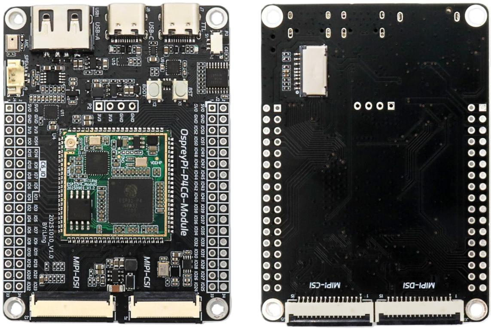

# ESP32-P4-Module

# 支持 Wi-Fi 6 和蓝牙模块

ESP32-P4-Module 是一款高性能、多功能的嵌入式核心系统模块。其设计核心为 ESP32P4C6/ESP32P4C5 核心板。

本模块提供了极其丰富的外设接口与功能单元，包括摄像头、显示屏、音频、USB以及多种电源保护电路，专为需要复杂人机交互、多媒体处理、多协议无线连接和高速数据通信的先进物联网应用而设计。它极大地简化了产品开发流程，为AIoT（人工智能物联网）、多媒体处理、工业控制及复杂人机交互应用提供了一个高度集成、稳定可靠的开发平台。

# 功能特性

搭载 RISC-V 32 位双核与单核处理器的高性能 MCU

· 128 KB HP ROM,16 KB LP ROM, 768 KB HP L2MEM, 32 KB LP SRAM, 8 KB TCM  
· 强大的图像与语音处理能力，图像与语音处理接口包括 JPEG 编解码器、像素处理加速器(PPA)、图像信号处理器(ISP)、H264 视频编码器。  
· 芯片封装内叠封 32 MB PSRAM，封装外集成 16MB 串行 Flash  
· 板上引出 2\*2\*17 个引脚, 引出 ESP32-P4 的 55 个剩余可编程 GPIO, 并引出 ESP32-C6/ESP32-C5 的 9 个 GPIO  
- 安全机制：安全启动、Flash加密、硬件加密加速器和硬件随机数生成器。同时还支持硬件访问保护，可实现访问权限管理(APM)和权限分离。

# 组件介绍

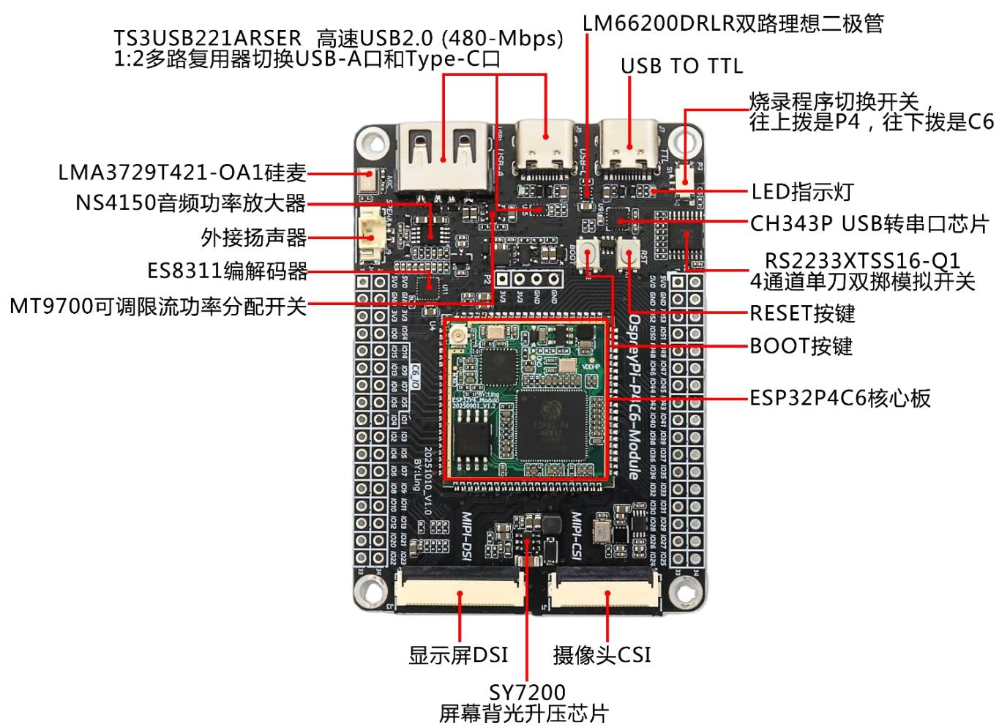

text_image

TS3USB221ARSER 高速USB2.0 (480-Mbps)
1:2多路复用器切换USB-A口和Type-C口
LM66200DRLR双路理想二极管
USB TO TTL
烧录程序切换开关，
往上拨是P4，往下拨是C6
LED指示灯
CH343P USB转串口芯片
RS2233XTSS16-Q1
4通道单刀双掷模拟开关
RESET按键
BOOT按键
ESP32P4C6核心板
显示屏DSI
摄像头CSI
SY7200
屏幕背光升压芯片

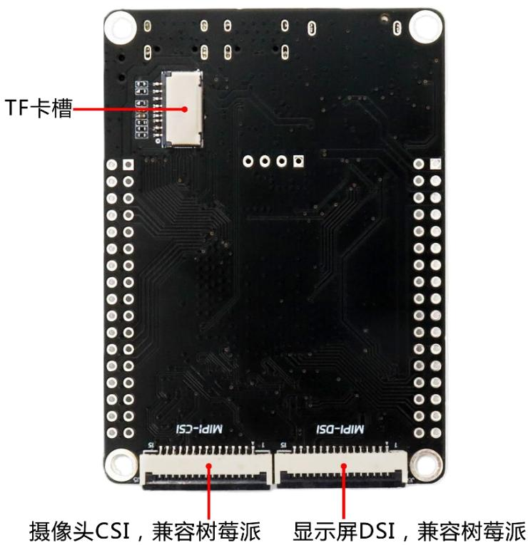

text_image

TF卡槽
摄像头CSI，兼容树莓派
显示屏DSI，兼容树莓派
MIPI-CSI
MIPI-DSI

核心配置

<table><tr><td>类别</td><td>组件</td><td>功能描述</td></tr><tr><td rowspan="2">主控制器</td><td>ESP32P4C6 核心板</td><td>ESP32-P4:高性能 Xtensa®或 RISC-V 应用处理器,主频高达 400 MHz,集成丰富外设。ESP32-C6:支持 2.4GHZ Wi-Fi 6、Bluetooth 5.0 (LE)和 802.15.4 (Zigbee/Thread)的无线协处理器。</td></tr><tr><td>ESP32P4C5 核心板</td><td>ESP32-P4:高性能 Xtensa®或 RISC-V 应用处理器,主频高达 400 MHz,集成丰富外设。ESP32-C5:支持 2.4&amp;5 GHz 双频 Wi-Fi 6、Bluetooth 5 (LE)和 IEEE 802.15.4 (Zigbee, Thread)的无线协处理器。</td></tr><tr><td>USB 系统</td><td>TS3USB221ARSER</td><td>高速 USB 2.0 (480 Mbps) 1:2 多路复用器,用于在 Type-C 和 USB-A 接口之间切换。</td></tr><tr><td>音频系统</td><td>ES8311、NS4150 LMA3729T421-OA1</td><td>ES8311:低功耗、高性能单声道音频编解码器。NS4150:3W 单声道 D 类音频功率放大器,驱动扬声器。LMA3729T421-OA1:硅基麦克风,用于高精度音频采集。</td></tr><tr><td>显示系统</td><td>SY7200</td><td>高效率屏幕背光升压芯片,为 DSI 显示屏提供恒流驱动。</td></tr><tr><td>电源管理</td><td>LM66200DRLR、MT9700</td><td>LM66200DRLR:双路理想二极管,实现 ORing 逻辑,防止不同电源输入间的电流倒灌。MT9700:可调限流功率分配开关,为 USB-A 输出口提供过流和短路保护。</td></tr><tr><td>接口</td><td></td><td>正面:CSI 摄像头接口(24P 0.5MM 上下接),DSI 显示屏接口(30P 0.5MM 上下接)支持 YDP400BT001-V4 屏幕背面:MIPI-CSI(15P 1.0MM 上下接,兼容树莓派接口),MIPI-DSI(15P 1.0MM 上下接,兼容树莓派接口)</td></tr></table>

# 产品尺寸

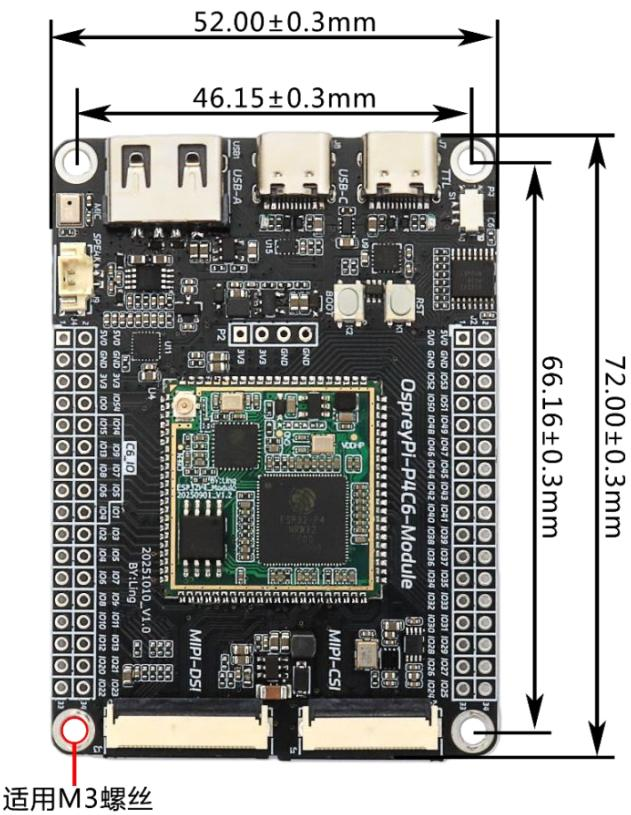

text_image

52.00±0.3mm
46.15±0.3mm
66.16±0.3mm
72.00±0.3mm
适用M3螺丝
OspreyPi-P4C6-Module
MIP-D5I
MIP-C5I
MIP-R5I
MIP-A
USB-A
USB-E
USB-C
USB-Q
USB-S
USB-H
USB-I
USB-J
USB-K
USB-L
USB-M
USB-N
USB-O
USB-P
USB-Q
USB-R
USB-S
USB-H
USB-I
USB-J
USB-K
USB-L
USB-M
USB-N
USB-O
USB-P
USB-Q
USB-R
USB-S
USB-H
USB-I
USB-J
USB-K
USB-L
USB-M
USB-N
USB-O
USB-P
USB-Q
USB-R
USB-S
USB-H
USB-I
USB-J
USB-K
USB-L
USB-M
USB-N
USB-O

# 必备硬件

1 x ESP32-P4-module  
1 x USB 2.0 数据线（标准 A 型转 Micro-B 型）  
1 x 电脑 (Windows、Linux 或 macOS)

注意：请确保使用适当的USB数据线。部分数据线仅可用于充电，无法用于数据传输和编程。

# 开发与调试

软件设置：使用 Visual Studio Code，ESP-IDF 进行设置，固件下载可使用 flash\_download\_tool

串口调试：通过板载的 USB TO TTL 接口（CH343）连接电脑，在设备管理器中识别到串行端口即可进行日志打印和调试。

固件下载：通过RS2233模拟开关，可分别选择对ESP32-P4或ESP32-C6核心进行固件烧录

软件开发：支持 ESP-IDF 开发框架，可开发 P4 核心的应用程序。

硬件版本

<table><tr><td>日期</td><td>版本</td><td>更改内容</td></tr><tr><td>20251023</td><td>V1.1</td><td>1. 初始发布</td></tr><tr><td>20251024</td><td>V1.2</td><td>2. 优化 PCB,增加电源输入 TVS</td></tr><tr><td>20260228</td><td>V1.3</td><td>3. MIPI_CSI 接口复位上拉改为 1.8V,IO 建议使用开漏输出4. 底板兼容 P4C6 模组与 P4C5 模组</td></tr><tr><td></td><td></td><td></td></tr></table>

# 原理图

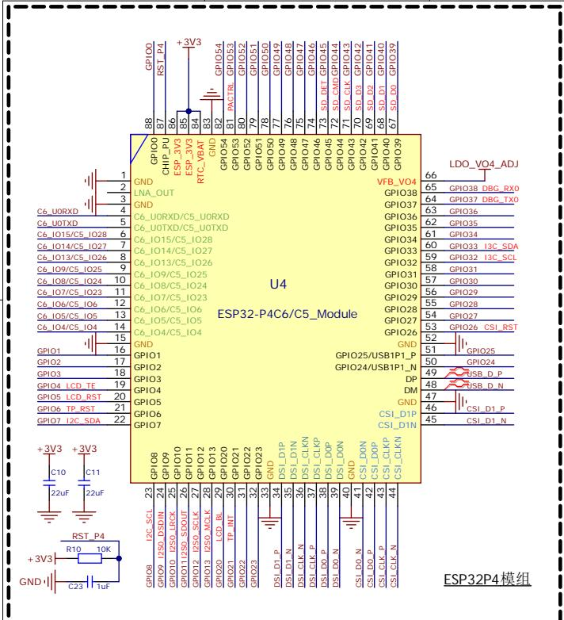

text_image

88
GPIO00
RST_P4
+3V3
GPIO00
CHIP_PU
ESP_3V3
ESP_3V3
RTC_VBAT
GND
GPIO54
GPIO53
GPIO52
GPIO51
GPIO50
GPIO49
GPIO48
GPIO47
GPIO46
GPIO45
GPIO44
GPIO43
GPIO42
GPIO41
GPIO40
GPIO39
LDO_VO4_ADJ
66
GPIO38
DRG_RXO
65
GPIO37
DRG_TXO
64
GPIO36
GPIO35
63
GPIO35
62
GPIO34
61
GPIO33
60
GPIO32
13C_SDA
59
GPIO31
58
GPIO30
57
GPIO29
56
GPIO28
55
GPIO27
54
GPIO26
CSI_RST
53
GPIO25
GPIO24
GPIO24/USB1P1_P
52
GPIO25
GPIO24/USB1P1_N
51
GPIO24
DP
49
USB_D_P
48
USB_D_N
DM
47
CSI_D1_P
46
CSI_D1_N
RSST_P4
+3V3
C10
C11
22uF
C10/12C_SCL 23
C10/12C_SCL 24
C10/12C_SCL 25
C10/12C_SCL 26
C10/12C_SCL 27
C10/12C_SCL 28
C10/12C_SCL 29
C10/12C_SCL 30
C10/12C_SCL 31
C10/12C_SCL 32
C10/12C_SCL 33
C10/12C_SCL 34
C10/12C_SCL 35
C10/12C_SCL 36
C10/12C_SCL 37
C10/12C_SCL 38
C10/12C_SCL 39
C10/12C_SCL 40
C10/12C_SCL 41
C10/12C_SCL 42
C10/12C_SCL 43
C10/12C_SCL 44

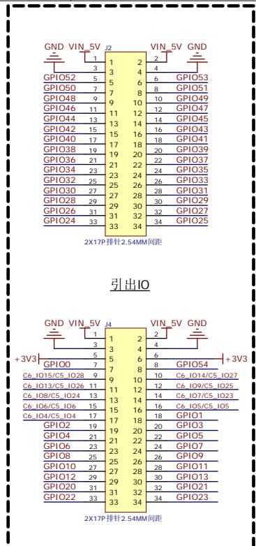

text_image

GND VIN_5V J2
VIN_5V GND
1 2
3 4
GPIO52 5 6 6 GPIO53
GPIO50 7 8 8 GPIO51
GPIO48 9 10 10 GPIO49
GPIO46 11 12 12 GPIO47
GPIO44 13 14 14 GPIO45
GPIO42 15 16 16 GPIO43
GPIO40 17 18 18 GPIO41
GPIO38 19 20 20 GPIO39
GPIO36 21 21 22 22 GPIO37
GPIO34 23 23 24 24 GPIO35
GPIO32 25 25 26 26 GPIO33
GPIO30 27 27 28 28 GPIO31
GPIO28 29 29 30 30 GPIO29
GPIO26 31 31 32 32 GPIO27
GPIO24 33 33 34 34 GPIO25
2X17P排针:2.54MM间距
引出IO
GND VIN_5V J4
VIN_5V GND
1 2
3 4
5 6
6
GPIO0 7 8 8 GPIO54
C6_IO15/C5_IO28 9 10 10 C6_IO14/C5_IO27
C6_IO13/C5_IO26 11 12 12 C6_IO9/C5_IO25
C6_IO8/C5_IO24 13 14 14 C6_IO7/C5_IO23
C6_IO6/C5_IO6 15 15 16 C6_IO5/C5_IO5
C6_IO4/C5_IO4 17 17 18 18 GPIO1
GPIO2 19 19 20 20 GPIO3
GPIO4 21 21 22 22 GPIO5
GPIO6 23 23 24 24 GPIO7
GPIO8 25 25 26 26 GPIO9
GPIO10 27 27 28 28 GPIO11
GPIO12 29 29 30 30 GPIO13
GPIO20 31 31 32 32 GPIO21
GPIO22 33 33 34 34 GPIO23
+3V3
GND VIN_5V J4
1 2
3 4
5 6
6
GPIO0
C6_IO15/C5_IO28
C6_IO13/C5_IO26
C6_IO8/C5_IO24
C6_IO6/C5_IO6
C6_IO4/C5_IO4
GND VIN_5V GND
1
2
4
6
GPIO0
C6_IO15/C5_IO28
C6_IO13/C5_IO26
C6_IO8/C5_IO24
C6_IO6/C5_IO6
C6_IO4/C5_IO4
GND VIN_5V GND
1
2
4
6
GPIO0
C6_IO15/C5_IO28
C6_IO13/C5_IO26
C7_000_000_000_000_000_000_000_000_000_000_000_000_000_000_000_000_000_000_000_000_000_000_000_000_000_00

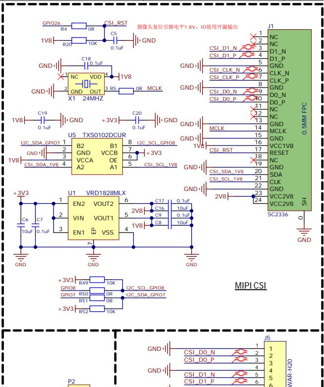

text_image

摄像头复位引脚电平1.8V，IO使用开漏输出
J1
NC
NC
D1_N
D1_P
GND
CLK_N
CLK_P
GND
DO_N
DO_P
NC
NC
GND
MCLK
GND
1V8
1V8
+3V3
C19
0.1uF
C20
0.1uF
GND
I2C_SDA_GPIO7 1
2
3
4
U5 TXS0102DCUR
B2 B1
GND VCCB
VCCA OE
A2 A1
+3V3
C6 C7 1
10uF 0.1uF
EN2 VOUT2 6
VIN VOUT1 5
EN1 VSS 4
+3V3
C17 0.1uF
C16 10uF
C9 0.1uF
C8 10uF
+3V3 VRD1828MLX
EN2 VOUT2 6
VIN VOUT1 5
EN1 VSS 4
+3V3
R49 10K
GPIO8 10K
GPIO7 R50 OR 12C_SCL_GPIO8
R51 OR 12C_SDA_GPIO7
+3V3 R52 10K
MIPI CSI
SC2336 SH
O
GND
P2
J5
1 CSIDON 2 CSIDON 3 CSIDON 4 CSIDON 5 CSIDON 6 WAR-H2O

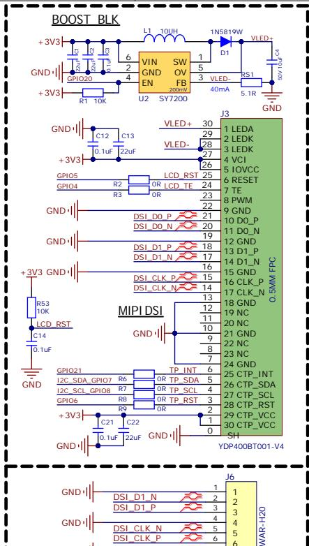

text_image

BOOST BLK
+3V3
GND-
+3V3
R1 10K
GND-
C12 C13
+3V3
GPIO5
GPIO4
R2
R3
LCD_RST
OR
LCD_TE
VLED+
VLED-
VLED+
0.1uF
22uF
L1 10UH
VIN SW
GND OV
EN FB
SY7200
U2
1N5819W
D1
VLED+
D1
RS1
5.1R
5.1R
GND
+3V3 GND-
C12 C13
+3V3
R2
R3
LCD_RST
OR
LCD_TE
VLED+
VLED-
29
28
27
26
25
24
23
22
21
20
19
18
17
16
15
14
13
12
11
10
9
8
7
6
5
4
3
2
1
GND
+3V3 GND-
R53
10K
LCD_RST
C14
0.1uF
GND-
MIPI DSI
GND-
C14
GPIO21
I2C_SDA_GPIO7 R6 OR TP_SDA 5
I2C_SCL_GPIO8 R7 OR TP_SCL 4
GPIO6 R8 OR TP_RST 3
+3V3 C21 C22 C21 2
0.1uF 22uF GND-
YDP400BT001-V4
J6
DSI_D1_N 1 1
DSI_D1_P 2 2
DSI_CLK_N 3 3
DSI_CLK_P 4 4
WAR-H2O 5 5

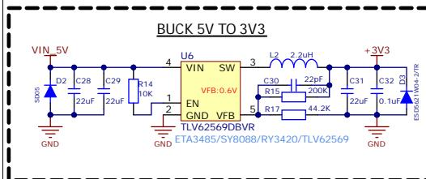

text_image

BUCK 5V TO 3V3
VIN 5V
SDOS
GND
D2
C28
22uF
C29
22uF
R14
10K
1
2
U6
VIN SW
EN VFB:0.6V
GND VFB
TLV62569DBVR
ETA3485/SY8088/RY3420/TLV62569
L2 2.2uH
C30
22pF
200K
R15
44.2K
C31
22uF
C32 D3
0.1uF
+3V3
GND
ES0567-VM4-2TR

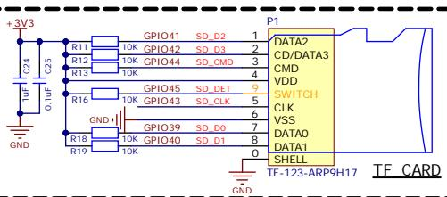

text_image

+3V3
C24
0.1uF
C25
GND
R11
10K
GPIO41
SD_D2
1
DATA2
CD/DATA3
CMD
VDD
SWITCH
CLK
VSS
DATA0
DATA1
SHELL
TF-123-ARP9H17
TF CARD

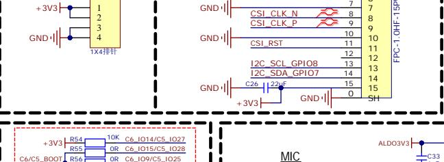

text_image

+3V3
1
2
3
4
GND
1X4排针
GND
7
CSI_CLK_N
8
CSI_CLK_P
9
10
11
12
13
14
15
16
FPC-1_OHF-15P
CSI_RST
11
12
13
14
15
SH
C26_22e
+3V3
GND
+
33
C6_C5_BOOT
R54 10K C6_I014/C5_I027
R55 OR C6_I015/C5_I028
R56 OR C6_I09/C5_I025
MIC
ALDO3V3
C33

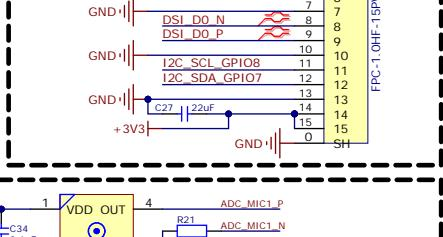

text_image

GND
DSI_D0_N
DSI_D0_P
GND
12C_SCL_GPIO8
12C_SDA_GPIO7
GND
+3V3
C27 22uF
GND
7
8
9
10
11
12
13
14
15
15
0 SH
FPC-1 OHF-1SP
VDD_OUT
1
4
C34
R21
ADC_MIC1_P
ADC_MIC1_N

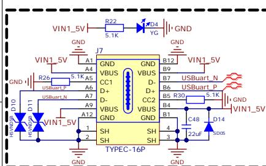

text_image

VIN1_5V
R22
5.1K
J7
GND
VIN1_5V
A1
A4
GND
B12
VIN1_5V
B9
USBuart_N
B7
USBuart_P
CC1
D+
D-
CC2
VBUS
B5 R30
B4
B1
C48
D14
D10
D11
VIN1_5V
A9
A7
A12
SH
SH
SH
GND
GND
TYPEC-16P
1
2
3
4
3
22uF
GND
GND
J7
A4
A5
A6
A7
A9
GND

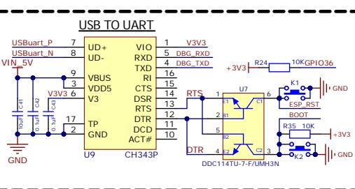

text_image

USB TO UART
USBuart_P 7
USBuart_N 8
VIN_5V
0.41 0.1U7 0.1U6 0.1U5 0.1U4 0.1U3 0.1U2 0.1U1 0.1U0 0.1U-3 0.1U-2 0.1U-1 0.1U-0 0.1U-3 0.1U-2 0.1U-1 0.1U-0 0.1U-3 0.1U-2 0.1U-1 0.1U-0 0.1U-3 0.1U-2 0.1U-1 0.1U-0 0.1U-3 0.1U-2
V3V3 6
VOD5 V3
TP TP
GND GND
UD+ VIO 1 V3V3
UD- RXD 5 DBG_RXD
TXD 4 DBG_TXD
RI 16
CTS 15
DSR 14
RTS 13
DTR 12
DCD ACT#
GND U9 CH343P
+3V3 R24 10KGPIO36
RTS 1 U7 6
2 J1
5 DTR 4 DDC114TU-7-F/UMH3N
+3V3 K1 ESP_RST BOOT +3V3 GND
R35 10K
+3V3 GND

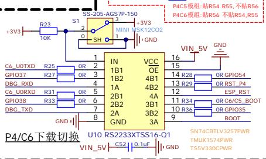

text_image

+3V3
R23
10K
S1
2
3
MINI
MSK12C02
SH
1
GND
+3V3
SS-205-AGS7P-150
C6_U0TXD R25 OR 2
GPIO37 R27 OR 3
DBG_RXD 4
C6_U0RXD R31 OR 5
GPIO38 R33 OR 6
DBG_TXD 7
GND 8
IN VCC
1B1 OE
1B2 4B1
1A 4B2
2B1 4A
2B2 3B1
2A 3B2
GND 3A
VIN_5V GND
16
15
14 R28 OR GPIO54
13 R29 OR RST_P4
12 ESP_RST
11 R34 OR C6/C5_BOOT
10 R36 OR GPIO35
9 BOOT
SN74CBTLV3257PWR
TMUX1574PWR
TSSV330CPWR
P4/C6下载切换 U10 RS223XTSS16-Q1
VIN_5V CS2 0.1uF GND

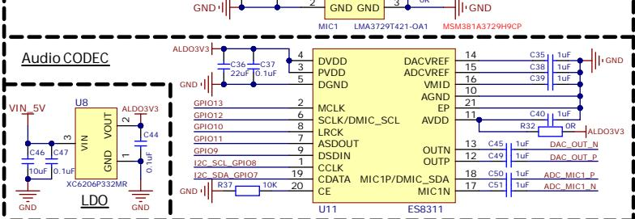

text_image

Audio CODEC
VIN_5V
C46
10uF
C47
0.1uF
U8
VIN
XC6206P332MR
GND
GND
GND
GND
LMA3729T421-OA1
MSM381A3729H9CP
ALDO3V3
C36
22uF
C37
0.1uF
ALDO3V3
C44
0.1uF
GND
GND
DVDD
DVDD
DGND
C37
C37
22uF
C37
0.1uF
C44
0.1uF
GND
GND
C36
22uF
C37
0.1uF
GND
GND
C36
22uF
C37
0.1uF
GND
GND
C36
22uF
C37
0.1uF
GND
GND
C36
22uF
C37
0.1uF
GND
GND
C36
22uF
C36
0.1uF
GND
GND
C36
22uF
C37
0.1uF
GND
GND
C36
22uF
C37
0.1uF
GND
GND
C36
22uF
C37
0.1uF
GND
GND
C36
22uF
C38
1uF
C38
1uF
GND
GND
C36
22uF
C38
1uF
GND
GND
C36
22uF
C38
1uF
GND
GND
C36
22uF
C38
1uF
GND

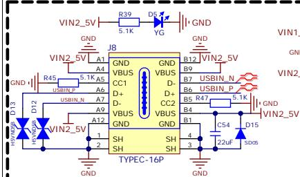

text_image

VIN2_5V
R39
D5
YG
GND
VIN2_5V
A1
A4
J8
GND
VBUS
CC1
D+
D-
VBUS
A6
A7
A9
A12
D+
D-
CC2
VBUS
GND
B12
B7
B6
B5 R47
B4
B1
C54
22uF
D15
SDOS
VIN2_5V
VIN1_
GND
VIN2_
A1
A4
A6
A7
A9
A12
D+
D-
VBUS
GND
SH
SH
TYPEC-16P

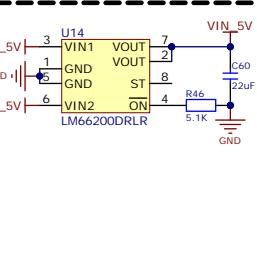

text_image

U14
3 VIN1 VOUT
1 VOUT
GND GND ST
5 VIN2 ON
LM66200DRLR
7 VIN 5V
2 C60
8 2.2uF
4 R46
5.1K
GND

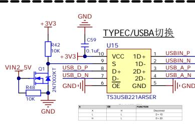

text_image

TYPEC/USBA切换
U15
VCC 1D+
S 1D-
D+ 2D+
D- 2D-
OE GND
T3USB221ARSER
VIN2_5V Q1 USB_D_P 9 USB_D_P
R48 10K 7 USB_D_N 6 USB_D_N 5 USB_A_P
GND C59 D1uF10
+3V3 R42
10K
+3V3
2N7002KT
GND
X CH FOR FUNCTION
Y H L (Decoded)
Z=0
H L
L=0
H L
GND

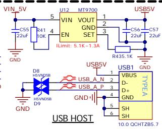

text_image

VIN 5V
C55
22uF
GND
R41
10K
5
4
U12
MT9700
VIN VOUT
EN GND SET
3
2
USB5V
C56
22uF
C57
22uF
R435.1K
USB5V
USB1 GND
D8
H5VNP5B
H5VND5B
D9
USB A N 2
USB A P 3
USB I 4
USBA TYPEA
D-
D+
GND
SH
SH
10.0 QCHTZBS.7

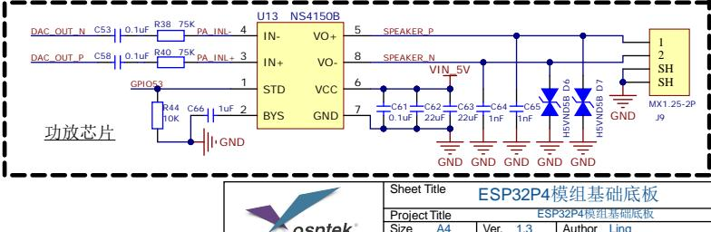

text_image

U13 NS4150B
IN- VO+
IN+ VO-
STD VCC
BYS GND
GPIO3 1
R44 10K C66 1uF 2
GND
功放芯片
SPEAKER_P
SPEAKER_N
VIN 5V
C61 C62 C63 C64 C65
GND GND GND GND GND GND
MX1.25-2P J9
Sheet Title ESP32P4模组基础底板
Project Title ESP32P4模组基础底板
Size A4 Ver. 1.3 Author Ling

<table><tr><td rowspan="4"></td><td colspan="5">Sheet Title ESP32P4模组基础底板</td></tr><tr><td colspan="5">Project Title ESP32P4模组基础底板</td></tr><tr><td>Size A4</td><td colspan="2">Ver. 1.3</td><td colspan="2">Author Ling</td></tr><tr><td colspan="3">Sheet 1 / 1</td><td colspan="2">Data 2026/02/28</td></tr></table>