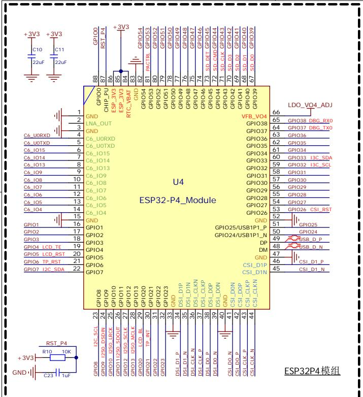

text_image

+3V3
C10
22uF
+3V3
C11
22uF
GND
C6_U0RXD
C6_U0TXD
C6_I015
C6_I014
C6_I013
C6_I09
C6_I08
C6_I07
C6_I06
C6_I05
C6_I04
GND
LNA_OUT
GND
C6_U0RXD
C6_U0TXD
C6_I015
C6_I014
C6_I013
C6_I09
C6_I08
C6_I07
C6_I06
C6_I05
C6_I04
GND
GND
GND
GND
GND
GND
GND
GND
GND
GND
GND
GND
GND
GND
GND
GND
GND
GND
GND
GND
GND
GND
GND
GND
GND
GND
GND
GND
GND
GND
GND
GND
GND
GND

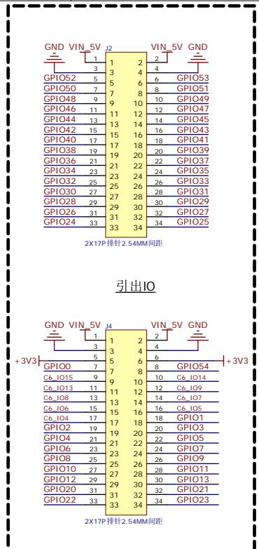

text_image

GND VIN_5V J2
VIN_5V GND
1 2
3 4
GPIO52 5 6 6 GPIO53
GPIO50 7 8 8 GPIO51
GPIO48 9 10 10 GPIO49
GPIO46 11 12 12 GPIO47
GPIO44 13 14 14 GPIO45
GPIO42 15 16 16 GPIO43
GPIO40 17 18 18 GPIO41
GPIO38 19 20 20 GPIO39
GPIO36 21 22 22 GPIO37
GPIO34 23 24 24 GPIO35
GPIO32 25 26 26 GPIO33
GPIO30 27 28 28 GPIO31
GPIO28 29 30 30 GPIO29
GPIO26 31 32 32 GPIO27
GPIO24 33 34 34 GPIO25
2X17P排针2.54MM间距
引出IO
GND VIN_5V J4
VIN_5V GND
1 2
3 4
5 6 6
GPIO0 7 8 8 GPIO54
C6_IO15 9 9 10 C6_IO14
C6_IO13 11 11 12 C6_IO9
C6_IO8 13 13 14 C6_IO7
C6_IO6 15 15 16 C6_IO5
C6_IO4 17 17 18 C6_IO1
GPIO2 19 19 20 C6_IO3
GPIO4 21 21 22 C6_IO5
GPIO6 23 23 24 C6_IO7
GPIO8 25 25 26 C6_IO9
GPIO10 27 27 28 C6_IO11
GPIO12 29 29 30 C6_IO13
GPIO20 31 31 32 C6_IO21
GPIO22 33 33 34 C6_IO23
+3V3
GND VIN_5V J4
+3V3
GND VIN_5V GND
1 2
3 4
5 6
7 8
9 9
11 12
13 14
15 16
17 18
19 20
21 22
23 24
25 26
27 28
30
31
32
33
34

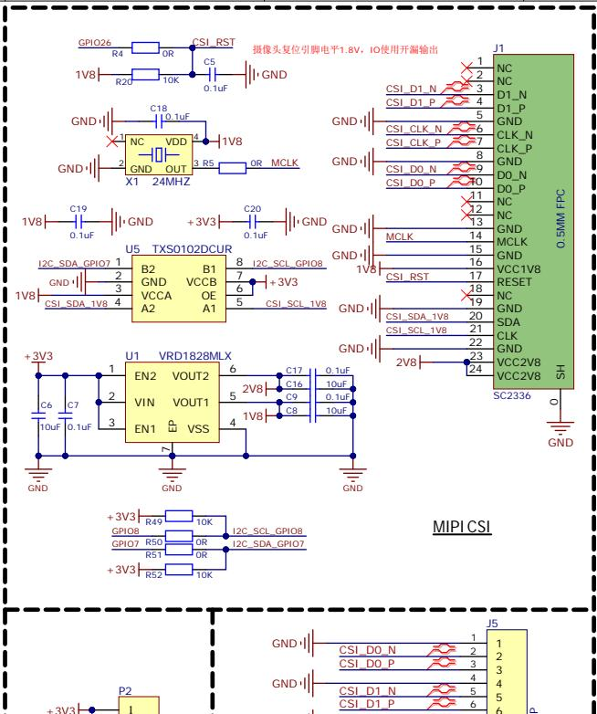

text_image

摄像头复位引脚电平1.8V，IO使用开漏输出
J1
NC
NC
D1_N
D1_P
GND
CLK_N
CLK_P
GND
DO_N
DO_P
NC
NC
GND
MCLK
GND
VCC1V8
RESET
NC
GND
SDA
CLK
GND
VCC2V8
SH
SC2336
O
GND
MIPI CSI
GPIO26
R4
OR
CSI_RST
C5
0.1uF
GND
1V8
R20
10K
C18
0.1uF
NC
VDD
4
GND
OUT
3.85
X1 24MHZ
OR MCLK
1V8
C19
0.1uF
+3V3
C20
0.1uF
GND
U5 TXS0102DCUR
B2 B1 8 I2C_SCL_GPIO8
GND VCCB 7 +3V3
VCCA OE 6
A2 A1 5 CSI_SCL_1V8
CSI_SDA_1V8 4
+3V3
U1 VRD1828MLX
EN2 VOUT2 6 C17 0.1uF
VIN VOUT1 5 C16 10uF
EN1 VSS 4 C9 0.1uF
C6 C7 10uF 0.1uF 10uF 2V8 2V8 23
GPIO8 R49 10K 12C_SCL_GPIO8
GPIO7 R50 OR 12C_SDA_GPIO7
R51 OR 12C_SDA_GPIO7
+3V3 R52 10K 12C_SCL_GPIO8
P2 I
+3V3 P2

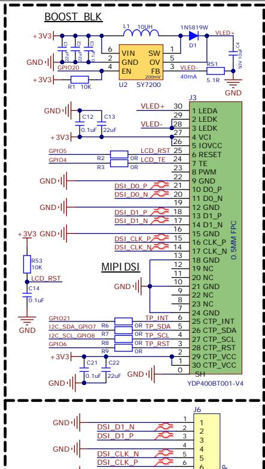

text_image

BOOST BLK
+3V3
GND
+3V3
R1 10K
GND
+3V3
C12 C13
+3V3
GPIO5
GPIO4
R2
R3
LCD_RST
LCD_TE
OR
OR
DSI_D0_P
DSI_D0_N
DSI_D1_P
DSI_D1_N
DSI_CLK_P
DSI_CLK_N
MIPI DSI
GND
C14
0.1uF
GND
+3V3 GND
R53
10K
LCD_RST
C14
0.1uF
GND
GPIO21
12C_SDA_GPIO7 R6
12C_SCL_GPIO8 R7
GPIO6
R8
R9
TP_INT
TP_SDA
TP_SCL
TP_RST
TP_RST
TP_INT
TP_SDA
TP_SCL
TP_RST
TP_VCC
TP_VCC
SH
YDP400BT001-V4
L1 10UH
VIN SW 1 1N5819W VLED+
D1 D1_100V C4
EN FB 5 3 VLED-
40mA 5.1R GND
VLED+
VLED-
29 28 27 26 25 24 23 22 21 20 19 18 17 16 15 14 13 12 11 10 9 8 7 6 5 4 3 2 1 0
+3V3 GND
+3V3 GND
+3V3 GND
DSI_CLK_N
DSI_CLK_P

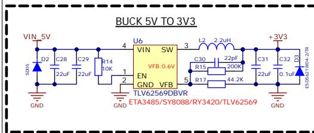

text_image

BUCK 5V TO 3V3
VIN 5V
SDOS
D2
C28
C29
R14
10K
EN
GND
TLV62569DBVR
VFB 0.6V
U6
SW
3
L2
2.2uH
C30
22pF
R15
200K
R17
44.2K
C31
22uF
+3V3
C32
D3
0.1uF
E506A/MA-2TR
GND
GND
ETA3485/SY8088/RY3420/TLV62569

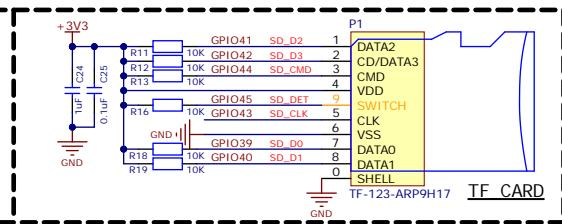

text_image

+3V3
C24
0.1uF C25
GND
R11
R12
R13
R16
R18
R19
GPIO41
10K
GPIO42
10K
GPIO44
10K
GPIO45
10K
GPIO43
GPIO39
10K
GPIO40
10K
SD_D2
SD_D3
SD_CMD
SD_DET
SD_CLK
SD_D0
SD_D1
P1
DATA2
CD/DATA3
CMD
VDD
SWITCH
CLK
VSS
DATA0
DATA1
SHELL
TF-123-ARP9H17
TF_CARD

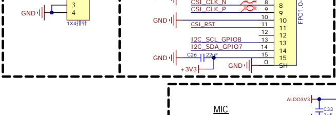

text_image

GND
3
4
1X4排针
GND
CSI_CLK N
8
CSI_CLK P
9
9
10
10
11
11
12
12
I2C_SCL_GPIO8
13
I2C_SDA_GPIO7
14
14
15
15
GND
C26 22μF
+3V3
GND
SH
FPC1.0
MIC
ALDO3V3
C33
1uF

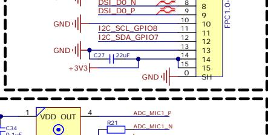

text_image

DSI_D0_P
DSI_D0_P
GND
I2C_SCL_GPIO8
I2C_SDA_GPIO7
+3V3
C27
22uF
GND
SH
FPC1.0
8
9
10
11
12
13
14
15
0
4
ADC_MIC1_P
R21
ADC_MIC1_N

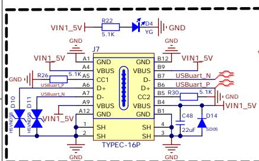

text_image

VIN1_5V
R22
5.1K
J7
GND
A1
A4
GND
VIN1_5V
R26
5.1K
A5
A6
USBuart.P
D11
U900P D10
VBUUSTN
D11
VIN1_5V
A12
A9
VBUS
CC1
D+
D-
VBUS
CC2
VBUS
GND
GND
VBUS
D-
D+
VBUS
GND
SH
1
2
3
4
5
6
7
8
9
10
11
12
13
14
15
16
17
18
19
20
21
22
23
24
25
26
27
28
29
30
31
32
33
34
35
36
37
38
39
40
41
42
43
44
45
46
47
48
49
50
51
52
53
54
55
56
57
58
59
60
61
62
63
64
65
66
67
68
69
70
71
72
73
74
75
76
77
78
79
80
81
82
83
84
85
86
87
88
89
90
91
92
93
94
95
96
97
98
99
100

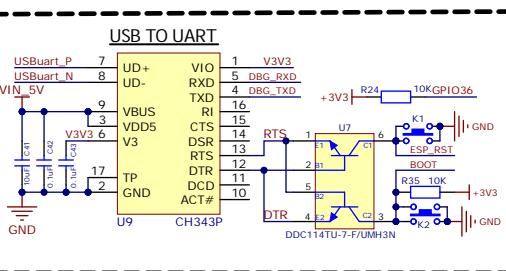

text_image

USB TO UART
USBuart_P 7
USBuart_N 8
VIN 5V
U9 1
UD+ VIO 1 V3V3
UD- VIO 5 DBG_RXD
VBUS 4 DBG_TXD
VDD5 3
V3 V3 6
TP 17 2
GND 2
CH343P U9
RTS 1 U7 6
DTR 4 DDC 2 DDC114TU-7-F/UMH3N
+3V3 R24 10KGPIO36
K1 ESP_RST
BOOT +3V3
R35 10K
K2 GND

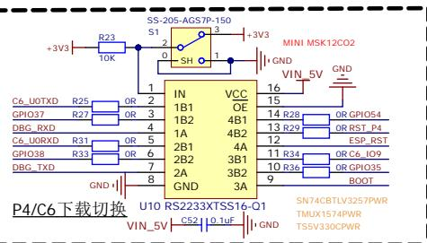

text_image

+3V3
R23
10K
SS-205-AGS7P-150
S1
2
SH
1
+3V3
MINI MSK12CO2
GND
VIN_5V
GND
C6_UOTXD R25 OR 2
GPIO37 R27 OR 3
DBG_RXD 4
C6_UORXD R31 OR 5
GPIO38 R33 OR 6
DBG_TXD 7
GND 8
U10 RS2233XTSS16-Q1
VIN_5V CS2 10.1uF GND
1B1 VCC
OE
1B2 4B1
1A 4B2
2B1 4A
2B2 3B1
2A 3B2
GND 3A
16
15
14 R28 OR GPIO54
13 R29 OR RST_P4
12 ESP_RST
11 R34 OR C6_IO9
10 R36 OR GPIO35
9 BOOT
SN74CBTLV3257PWR
TMUX1574PWR
TSSV330CPWR

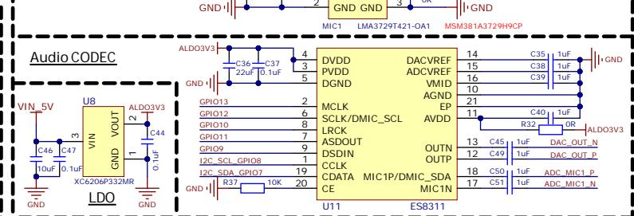

text_image

GND
2
GND GND
3
LMA3729T421-OA1
MSM381A3729H9CP
GND
Audio CODEC
VIN 5V
C46
10uF
C47
0.1uF
X6C6206P332MR
U8
VIN
GND VOUT
ALDO3V3
C44
2
C47
0.1uF
GND
GND
ALDO3V3
C36
22uF
C37
0.1uF
4
3
5
DVDD
PVDD
DGND
C37
3
4
DVDD
PVDD
DGND
C37
3
5
DVDD
PVDD
DGND
C37
3
5
DVDD
PVDD
DGND
C37
3
5
DVDD
PVDD
DGND
C37
3
5
DVDD
PVDD
DGND
C37
3
5
DVDD
PVDD
DGND
C37
3
5
DVDD
PVDD
DGND
C37
2
2
DVDD
PVDD
DGND
C37
2
2
DVDD
PVDD
DGND
C37
2
2
DVDD
PVDD
DGND
C37
2
2
DVDD
PVDD
DGND
C37
2
2
DVDD
PVDD
DGND
C37
2
2
DVDD
PVDD
DGND
C37
16
15
14
15
16
15
16
15
16
15
16
15
16
15
16
15
16
15
16
15
16
15
16
15
16
15
16
15

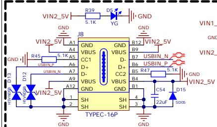

text_image

VIN2_5V
R39
5.1K
D5
YG
J8
GND
B12
VIN2_5V
GND
B9
USBIN_P
B7
USBIN_N
B6
USBIN_P
B5
R47
5.1K
GND
VIN2_5V
D15
SD05
22uF
C54
4
SH
SH
3
1
2
A12
A4
A5
A6
A7
A9
A12
VIN2_5V
D13
VIN2_5V
VGSN
VGSN
VBUS
CC1
D+
D-
VBUS
VBUS
CC2
GND
GND
GND
GND
GND
GND
GND
GND
GND
GND
GND
GND
GND

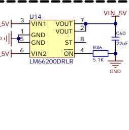

text_image

U14
5V 3
VIN1 VOUT
GND VOUT
GND ST
VIN2 ON
5V 5
LM66200DRLR
7
2
8
4
VIN 5V
C60
22uF
R46
5.1K
GND

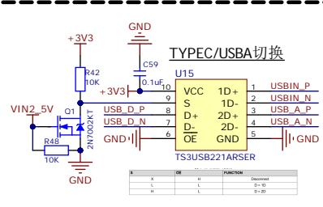

text_image

TYPEC/USBA切换
U15
VCC 1D+
S 1D-
D+ 2D+
D 2D-
OE GND
TS3USB221ARSER
VIN2 5V O1 USB_D_P 9 USB_D_P 8 USB_D_P 7 USB_D_P 6 USB_D_P 5 USB_D_P 4 USB_D_P 3 USB_D_P 2 USB_D_P 1 USB_D_P
+3V3 C59 D,1uF,10
R42
10K
R4B
10K
GND
GND
GND
GND
X H FUNCTION
X L (Discount)
H L (0-)
H L (0-30)

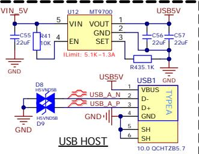

text_image

VIN 5V
C55
22uF
GND
D8
H5VND5B
D9
EN
R41
10K
5
U12
MT9700
VIN VOUT
GND SET
1
2
3
USBV
C56
22uF
C57
22uF
USBV
R435.1K
USB1 GND
USBV A N
USB A P
USBV B VBUS
D-
D+
GND
SH
SH
USB1 TYPE A
10.0 QCHTZB5.7
USB HOST

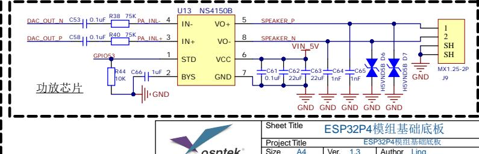

text_image

DAC_OUT_N C53 0.1uF R38 75K PA INL- 4
DAC_OUT_P C58 0.1uF R40 75K PA INL+ 3
GPIO3 1
R44 10K C66 1uF 2
GND
U13 NS4150B
IN- VO+
IN+ VO-
STD VCC
BYS GND
5 SPEAKER P
8 SPEAKER N
VIN_5V
6
7
C61 0.1uF C62 22uF C63 22uF C64 1nF C65 1nF
GND GND GND GND GND GND GND GND
MX1.25-2P J9
1
2
SH
SH
OSPTEK®
Sheet Title ESP32P4模组基础底板
Project Title ESP32P4模组基础底板
Size A4 Ver. 1.3 Author Ling

<table><tr><td rowspan="4"></td><td colspan="5">Sheet Title ESP32P4模组基础底板</td></tr><tr><td colspan="5">Project Title ESP32P4模组基础底板</td></tr><tr><td>Size A4</td><td colspan="2">Ver. 1.3</td><td colspan="2">Author Ling</td></tr><tr><td colspan="3">Sheet 1 / 1</td><td colspan="2">Data 2025/12/03</td></tr></table>