# SmartSens™

# SC2336 数据手册

V0.7

2021.9.13

# ■ 应用领域

◆ 安防摄像机  
◆ 家用安防监控系统  
◆ IoT 摄像机

# ■ 产品特性

◆ 高灵敏度  
◆ 高信噪比  
◆ 32x 模拟增益，4x 数字增益  
◆ 高速 DPC

◆ 外部控制帧率及多传感器同步  
◆ 水平/垂直窗口调整  
◆ 2 x 2 binning 模式  
◆ I2C 接口寄存器编程

■ 关键参数（典型值）

<table><tr><td>参数</td><td>描述</td></tr><tr><td>分辨率</td><td>2MP</td></tr><tr><td>像素阵列</td><td>1928H x 1088V</td></tr><tr><td>像素尺寸</td><td>2.7 μm x 2.7 μm</td></tr><tr><td>镜头光学尺寸</td><td>1/3”</td></tr><tr><td>最大图像传输速率</td><td>1920H x 1080V@30fps 10bit</td></tr><tr><td>输出接口</td><td>10/8-bit 1/2Lane MIPI, 10-bit DVP</td></tr><tr><td>输出格式</td><td>RAW RGB</td></tr><tr><td>CRA</td><td>12°</td></tr><tr><td>灵敏度</td><td>6594 mV/lux · s</td></tr><tr><td>动态范围</td><td>74 dB</td></tr><tr><td>信噪比</td><td>36 dB</td></tr><tr><td>工作温度范围</td><td>-30°C ~ +85°C</td></tr><tr><td>最佳工作温度范围</td><td>-20°C ~ +60°C</td></tr><tr><td>电源电压</td><td>AVDD = 2.8V ± 0.1V, DVDD 内供, DOVDD = 1.8V ± 0.1V</td></tr><tr><td>封装尺寸</td><td>CSP, 5.718 mm x 3.663 mm, 35-pin</td></tr><tr><td>ESD 等级</td><td>TBD</td></tr></table>

# 目录

# 目录....3

# 图片索引 4

# 表格索引 5

# 1. 系统描述....6

1.1. 芯片概述....6  
1.2. 系统框架 6  
1.3. 引脚描述....8  
1.4. 芯片初始化.... 10

1.4.1. 上电时序.... 10  
1.4.2. 睡眠模式.... 10  
1.4.3. 复位模式....11

1.5. 配置接口....11  
1.6. Sensor ID.... 13  
1.7. 数据接口.... 13

1.7.1. DVP.... 13  
1.7.2. MIPI.... 14

1.8. 锁相环.... 17

# 2. 功能介绍....18

2.1. SLAVE MODE 18  
2.2. AEC/AGC 20

2.2.1. AEC/AGC 的控制策略.... 20  
2.2.2. AEC 控制寄存器说明.... 20  
2.2.3. AGC 控制寄存器说明.... 21

2.3. GROUP HOLD 23  
2.4. DPC 23

2.5. 视频输出模式.... 24

2.5.1. 读取顺序.... 24  
2.5.2. 输出窗口.... 25

2.6. 帧率计算....25  
2.7. 测试模式 ..... 26

# 3. 电气特性....27

# 4. 光学特性....29

4.1. QE 曲线 ..... 29  
4.2. 主光线入射角(CRA).... 29

# 5. 封装信息....30

# 6. 订购信息....32

# 7. 版本变更记录....33

# 图片索引

图 1-1 结构图....6

图 1-2 典型应用图....7

图 1-3 封装引脚图....9

图 1-4 上电时序图....10

图 1-5 I²C 接口时序.....12

图 1-6 DVP 时序 ..... 13

图 1-7 MIPI 接口示意图.....14

图 1-8 MIPI 底层数据包示意图.....14

图 1-9 MIPI 长/短数据包结构示意图 ..... 15

图 1-10 MIPI 1/2lane 模式数据包传输示意图 ..... 15

图 1-11 MIPI 数据包 DI 结构 ..... 16

图 1-12 PLL 控制示意图 ..... 17

图 2-1 Slave Mode 时序图....18

图 2-2 Slave Mode 曝光实现图....19

图 2-3 像素阵列图一 ..... 24

图 2-4 像素阵列图二 ..... 24

图 2-5 镜像和倒置实例.....25

图 2-6 测试模式.....26

图 3-1 外部时钟（EXTCLK）波形图 ..... 28

图 4-1 CRA Curve....29

图 5-1 封装示意图....30

# 表格索引

表 1-1 引脚描述....8

表 1-2 睡眠模式控制寄存器 ..... 10

表 1-3 软复位控制寄存器....11

表 1-4 I²C 接口时序详细参数 ..... 12

表 1-5 SENSOR ID 寄存器 ..... 13

表 1-6 DVP 同步调整寄存器 ..... 14

表 1-7 MIPI 数据类型....16

表 1-8 MIPI 调整寄存器....16

表 2-1 Slave mode 控制寄存器....19

表 2-2 曝光的手动控制寄存器.....20

表 2-3 增益寄存器控制.....21

表 2-4 模拟 gain 值控制寄存器 ..... 21

表 2-5 数字 gain 值控制寄存器 ..... 22

表 2-6 Group hold 控制寄存器....23

表 2-7 DPC 控制寄存器 ..... 23

表 2-8 镜像和倒置模式控制寄存器 ..... 25

表 2-9 输出窗口寄存器.....25

表 2-10 帧率相关寄存器.....25

表 2-11 测试模式控制寄存器.....26

表 3-1 绝对最大额定值（以上所有电压都是 to pad 电压）.....27

表 3-2 直流电气特性（以上所有电压都是 to pad 电压）.....27

表 3-3 交流特性（TA=25°C，AVDD=2.8V，DOVDD=1.8V）.....28

表 5-1 封装尺寸表....30

表 6-1 订购信息表....32

# 1. 系统描述

# 1.1. 芯片概述

SC2336 是监控相机领域先进的数字 CMOS 图像传感器，最高支持 1920H x 1080V@30fps 的传输速率。SC2336 输出 raw 格式图像，有效像素窗口为 1928H x 1088V，支持复杂的片上操作——例如窗口化、水平镜像、垂直倒置等。

SC2336 可以通过标准的 I²C 接口读写寄存器。

SC2336 可以通过 EFSYNC/FSYNC 引脚实现外部控制曝光。

# 1.2. 系统框架

图 1-1 展示了 SC2336 图像传感器的功能模块。  
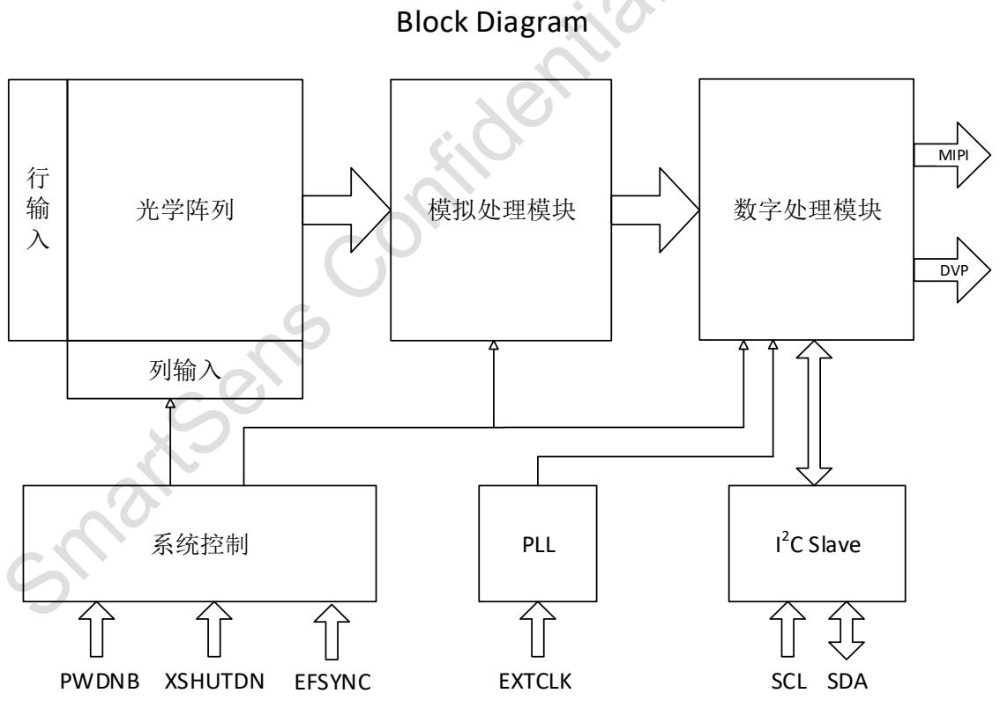

flowchart

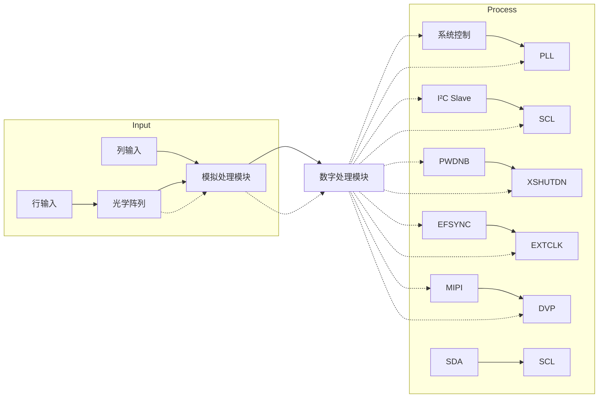
```mermaid
graph LR
  subgraph Input
  A["行输入"] --> B["光学阵列"]
  C["列输入"] --> D["模拟处理模块"]
  end
  
  B --> D
  D --> E["数字处理模块"]
  
  subgraph Process
  F["系统控制"] --> G["PLL"]
  H["I²C Slave"] --> I["SCL"]
  J["PWDNB"] --> K["XSHUTDN"]
  L["EFSYNC"] --> M["EXTCLK"]
  N["MIPI"] --> O["DVP"]
  P["SDA"] --> Q["SCL"]
  end
  
  B -.-> D
  D -.-> E
  E -.-> F
  E -.-> G
  E -.-> H
  E -.-> I
  E -.-> J
  E -.-> K
  E -.-> L
  E -.-> M
  E -.-> N
  E -.-> O
```

图 1-1 结构图

SC2336 支持 DVP、MIPI 接口，以 MIPI 接口为例：

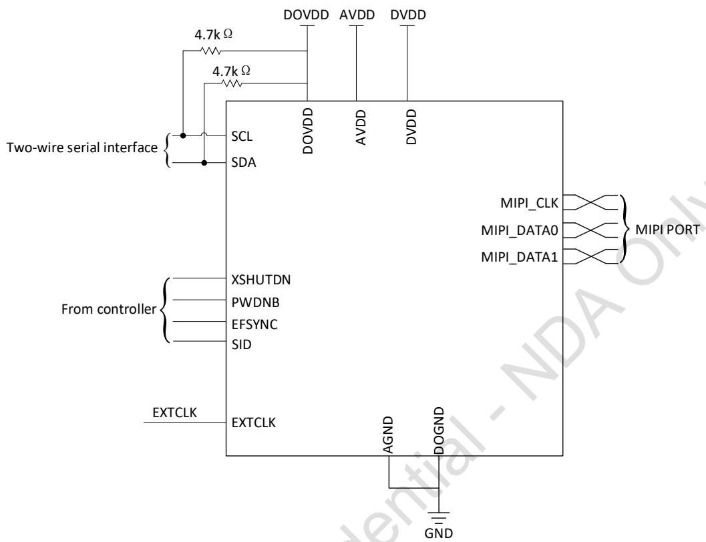

text_image

DOVDD AVDD DVDD
4.7kΩ
4.7kΩ
SCL DOVDD AVDD DVDD
SDA
Two-wire serial interface
MIPI_CLK
MIPI_DATA0
MIPI_DATA1
MIPI PORT
XSHUTDN
From controller
PWDNB
EFSYNC
SID
EXTCLK EXTCLK AGND DOGND GND

图 1-2 典型应用图

# 1.3. 引脚描述

表 1-1 列出了 SC2336 图像传感器的引脚信息及相关描述。

表 1-1 引脚描述

<table><tr><td>序号</td><td>编号</td><td>信号名</td><td>引脚类型</td><td>描述</td></tr><tr><td>1</td><td>A1</td><td>AGND</td><td>地线</td><td>模拟地</td></tr><tr><td>2</td><td>A2</td><td>LREF</td><td>输出</td><td>DVP 行同步</td></tr><tr><td>3</td><td>A3</td><td>EXTCLK</td><td>输入</td><td>时钟输入</td></tr><tr><td>4</td><td>A4</td><td>SDA</td><td>输入/输出</td><td> $I^2C$  数据线(open drain)</td></tr><tr><td>5</td><td>A5</td><td>SCL</td><td>输入</td><td> $I^2C$  时钟线</td></tr><tr><td>6</td><td>A6</td><td>XSHUTDN</td><td>输入</td><td>复位信号输入(内置上拉电阻,低电位有效)</td></tr><tr><td>7</td><td>A7</td><td>EFSYNC</td><td>输入</td><td>外部帧同步信号</td></tr><tr><td>8</td><td>B1</td><td>AVDD</td><td>电源</td><td>2.8V 模拟电源</td></tr><tr><td>9</td><td>B2</td><td>DOGND</td><td>地线</td><td>I/O 地</td></tr><tr><td>10</td><td>B3</td><td>FSYNC</td><td>输出</td><td>输入时作为外部帧同步信号输出时作为 DVP 帧同步信号</td></tr><tr><td>11</td><td>B4</td><td>DVDD</td><td>电源</td><td>数字电源(内置 LDO 供电)</td></tr><tr><td>12</td><td>B5</td><td>SID</td><td>输入</td><td>I2C Device ID(内置下拉电阻,默认为低电平,对应Device ID 是 7&#x27;h30)</td></tr><tr><td>13</td><td>B6</td><td>DVDD</td><td>电源</td><td>数字电源(内置 LDO 供电)</td></tr><tr><td>14</td><td>B7</td><td>AVDD</td><td>电源</td><td>2.8V 模拟电源</td></tr><tr><td>15</td><td>C1</td><td>DVDD</td><td>电源</td><td>数字电源(内置 LDO 供电)</td></tr><tr><td>16</td><td>C2</td><td>DOVDD</td><td>电源</td><td>1.8V I/O 电源</td></tr><tr><td>17</td><td>C3</td><td>DOVDD</td><td>电源</td><td>1.8V I/O 电源</td></tr><tr><td>18</td><td>C4</td><td>D&lt;6&gt;/MCP</td><td>输出</td><td>DVP 输出 bit[6]/ MIPI 时钟正极信号</td></tr><tr><td>19</td><td>C5</td><td>D&lt;9&gt;</td><td>输出</td><td>DVP 输出 bit[9]</td></tr><tr><td>20</td><td>C6</td><td>PWDNB</td><td>输入</td><td>Power Down 信号输入(内置上拉电阻,低电位有效)</td></tr><tr><td>21</td><td>C7</td><td>AGND</td><td>地线</td><td>模拟地</td></tr><tr><td>22</td><td>D1</td><td>D&lt;1&gt;</td><td>输出</td><td>DVP 输出 bit[1]</td></tr><tr><td>23</td><td>D2</td><td>D&lt;3&gt;/MD1N</td><td>输出</td><td>DVP 输出 bit[3]/ MIPI 数据 1 负极信号</td></tr><tr><td>24</td><td>D3</td><td>D&lt;4&gt;/MD1P</td><td>输出</td><td>DVP 输出 bit[4]/ MIPI 数据 1 正极信号</td></tr><tr><td>25</td><td>D4</td><td>PCLK/MCN</td><td>输出</td><td>DVP 时钟/MIPI 时钟负极信号</td></tr><tr><td>26</td><td>D5</td><td>D&lt;7&gt;/MD0N</td><td>输出</td><td>DVP 输出 bit[7]/ MIPI 数据 0 负极信号</td></tr><tr><td>27</td><td>D6</td><td>DOGND</td><td>地线</td><td>I/O 地</td></tr><tr><td>28</td><td>D7</td><td>VREFN</td><td>输出</td><td>内部参考电压(外接电容至 AGND)</td></tr><tr><td>29</td><td>E1</td><td>D&lt;0&gt;</td><td>输出</td><td>DVP 输出 bit[0]</td></tr><tr><td>30</td><td>E2</td><td>D&lt;2&gt;</td><td>输出</td><td>DVP 输出 bit[2]</td></tr><tr><td>31</td><td>E3</td><td>D&lt;5&gt;</td><td>输出</td><td>DVP 输出 bit[5]</td></tr><tr><td>32</td><td>E4</td><td>DVDD</td><td>电源</td><td>数字电源(内置 LDO 供电)</td></tr><tr><td>33</td><td>E5</td><td>D&lt;8&gt;/MD0P</td><td>输出</td><td>DVP 输出 bit[8]/ MIPI 数据 0 正极信号</td></tr><tr><td>34</td><td>E6</td><td>NC</td><td>-</td><td>NC</td></tr><tr><td>35</td><td>E7</td><td>NC</td><td>-</td><td>NC</td></tr></table>

Top View  
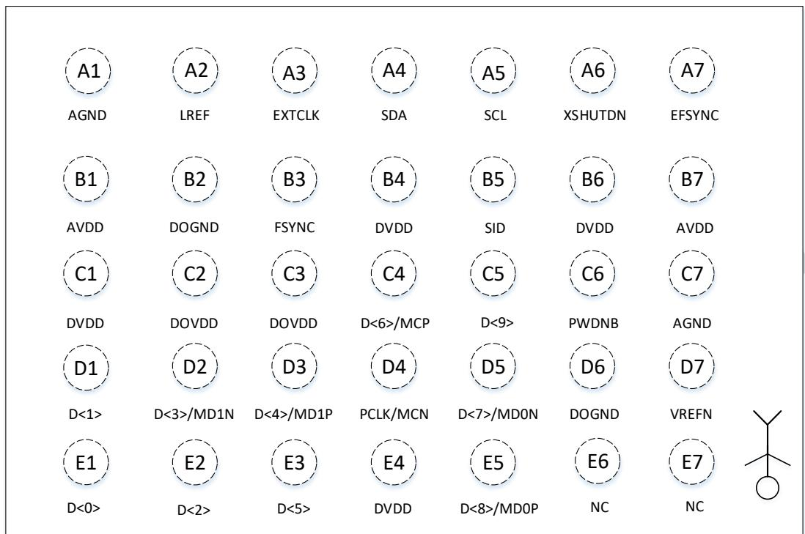

text_image

A1
AGND
A2
LREF
A3
EXTCLK
A4
SDA
A5
SCL
A6
XSHUTDN
A7
EFSYNC
B1
AVDD
B2
DOGND
B3
FSYNC
B4
DVDD
B5
SID
B6
DVDD
B7
C1
DVDD
C2
DOVDD
C3
DOVDD
C4
D<6>/MCP
C5
D<9>
PWDNB
C6
C7
D1
D<1>
D<3>/MD1N
D<4>/MD1P
D3
D4
PCLK/MCN
D<7>/MD0N
D5
D<8>/MD0P
D6
D7
VREFN
E1
D<0>
E2
D<2>
E3
D<5>
E4
DVDD
E5
NC
E6
E7
NC

图 1-3 封装引脚图

# 1.4. 芯片初始化

# 1.4.1. 上电时序

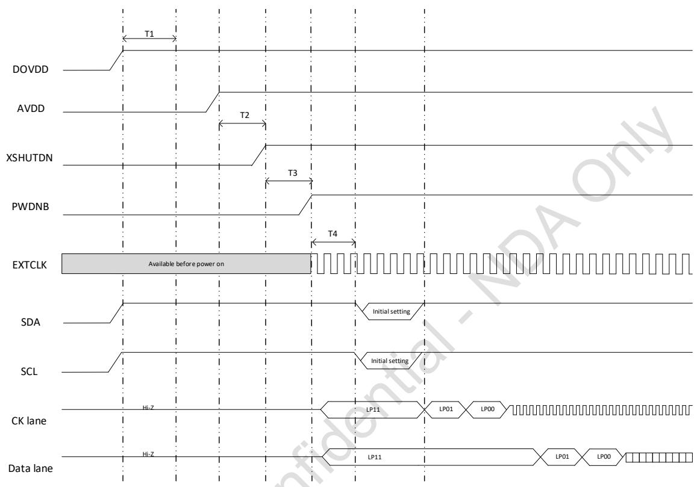

flowchart

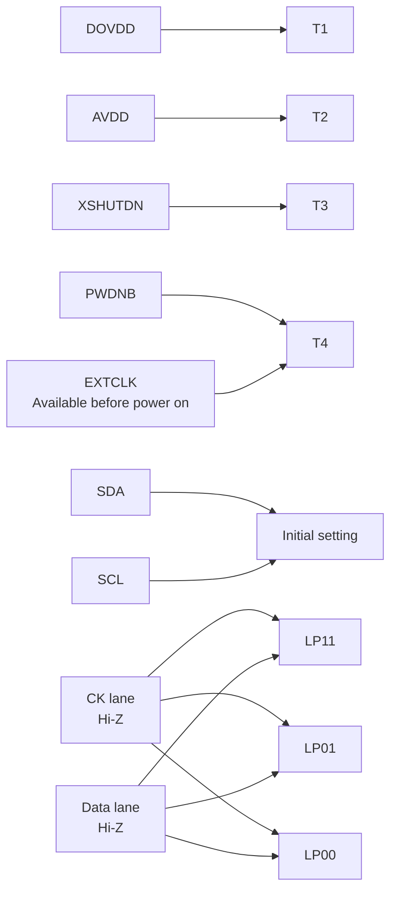
```mermaid
graph LR
  DOVDD["DOVDD"] --> T1["T1"]
  AVDD["AVDD"] --> T2["T2"]
  XSHUTDN["XSHUTDN"] --> T3["T3"]
  PWDNB["PWDNB"] --> T4["T4"]
  EXTCLK["EXTCLK\nAvailable before power on"] --> T4
  SDA["SDA"] --> InitialSetting["Initial setting"]
  SCL["SCL"] --> InitialSetting["Initial setting"]
  CKLane["CK lane\nHi-Z"] --> LP11["LP11"]
  CKLane --> LP01["LP01"]
  CKLane --> LP00["LP00"]
  DataLane["Data lane\nHi-Z"] --> LP11["LP11"]
  DataLane --> LP01["LP01"]
  DataLane --> LP00["LP00"]
```

图 1-4 上电时序图  
注：T1≥0ms，T2≥0ms，T3≥0ms，T4≥4ms。

# 1.4.2. 睡眠模式

睡眠模式下，SC2336 停止输出图像数据流，工作在低功耗状态，保持当前寄存器值。SC2336 提供两种方式进入睡眠模式：

1) 将 PWDNB 拉低，此时不支持 I²C 读写；  
2) 将寄存器 16'h0100[0]写入 0，此时支持 I²C 读写。

表 1-2 睡眠模式控制寄存器

<table><tr><td>功能</td><td>寄存器地址</td><td>默认值</td><td>描述</td></tr><tr><td>软睡眠模式使能</td><td>16&#x27;h0100</td><td>8&#x27;h0</td><td>Bit[0]: manual sleep mode ctrl1 ~ sleep mode disable0 ~ sleep mode enable</td></tr></table>

# 1.4.3. 复位模式

复位模式下，SC2336 停止输出图像数据流，工作在低功耗状态，重置所有寄存器，SC2336 提供两种方式进入复位模式：

1) 将 XSHUTDN 拉低，此时不支持 I²C 读写；  
2) 将寄存器 16'h0103[0]写入 1，此复位模式持续 150ns。

表 1-3 软复位控制寄存器

<table><tr><td>功能</td><td>寄存器地址</td><td>默认值</td><td>描述</td></tr><tr><td>软复位使能</td><td>16&#x27;h0103</td><td>8&#x27;h0</td><td>Bit[0]: soft reset</td></tr></table>

# 1.5. 配置接口

SC2336 提供标准的 I²C 总线配置接口对寄存器进行读写，I²C 设备地址为 7'h30。

消息类型：16-bit 地址、8-bit 数据和 7-bit 设备地址

<table><tr><td>S</td><td>Slave Address</td><td>R/W</td><td>A</td><td>Sub Address [15:8]</td><td>A</td><td>Sub Address [7:0]</td><td>A</td><td>data</td><td>A/Ã</td><td>P</td></tr></table>

I²C Write

<table><tr><td>S</td><td>Slave Address</td><td>0</td><td>A</td><td>Sub Address [15:8]</td><td>A</td><td>Sub Address [7:0]</td><td>A</td><td>data</td><td>A/ $\tilde{A}$ </td><td>P</td></tr></table>

I²C Read

<table><tr><td>S</td><td>Slave Address</td><td>0</td><td>A</td><td>Sub Address [15:8]</td><td>A</td><td>Sub Address [7:0]</td><td>A</td><td>Sr</td><td>Slave Address</td><td>1</td><td>A</td><td>data</td><td>Ã</td><td>P</td></tr></table>

Slave to Master S: Start Condition A: Acknowledge

Master to Slave P: Stop Condition Â: No-Acknowledge

Direction depends on the operation Sr: Restart Condition

$I^{2}C$ 时序  
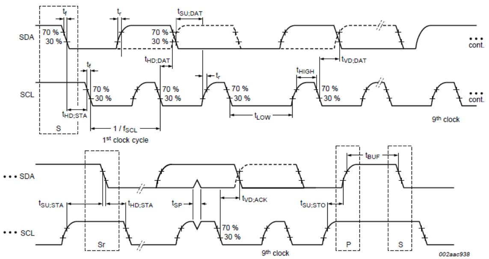  
图 1-5 I²C 接口时序

表 1-4 I²C 接口时序详细参数

<table><tr><td rowspan="2">Symbol</td><td rowspan="2">Parameter</td><td colspan="2">Standard-mode</td><td colspan="2">Fast-mode</td><td rowspan="2">Unit</td></tr><tr><td>Min</td><td>Max</td><td>Min</td><td>Max</td></tr><tr><td> $f_{SCL}$ </td><td>SCL clock frequency</td><td>0</td><td>100</td><td>0</td><td>400</td><td>kHz</td></tr><tr><td> $t_{HD;STA}$ </td><td>hold time (repeated) START condition</td><td>4.0</td><td>-</td><td>0.6</td><td>-</td><td>μs</td></tr><tr><td> $t_{LOW}$ </td><td>LOW period of the SCL clock</td><td>4.7</td><td>-</td><td>1.3</td><td>-</td><td>μs</td></tr><tr><td> $t_{HIGH}$ </td><td>HIGH period of the SCL clock</td><td>4.0</td><td>-</td><td>0.6</td><td>-</td><td>μs</td></tr><tr><td> $t_{SU;STA}$ </td><td>set-up time for a repeated START condition</td><td>4.7</td><td>-</td><td>0.6</td><td>-</td><td>μs</td></tr><tr><td> $t_{HD;DAT}$ </td><td>data hold time</td><td>0</td><td>-</td><td>0</td><td>-</td><td>μs</td></tr><tr><td> $t_{SU;DAT}$ </td><td>data set-up time</td><td>250</td><td>-</td><td>100</td><td>-</td><td>ns</td></tr><tr><td> $t_r$ </td><td>rise time of both SDA and SCL signals</td><td>-</td><td>1000</td><td>20</td><td>300</td><td>ns</td></tr><tr><td> $t_f$ </td><td>fall time of both SDA and SCL signals</td><td>-</td><td>300</td><td>20</td><td>300</td><td>ns</td></tr><tr><td> $t_{SU;STO}$ </td><td>set-up time for STOP condition</td><td>4.0</td><td>-</td><td>0.6</td><td>-</td><td>μs</td></tr><tr><td> $t_{BUF}$ </td><td>bus free time between a STOP and START condition</td><td>4.7</td><td>-</td><td>1.3</td><td>-</td><td>μs</td></tr><tr><td> $t_{VD;DAT}$ </td><td>data valid time</td><td>-</td><td>3.45</td><td>-</td><td>0.9</td><td>μs</td></tr><tr><td> $t_{VD;ACK}$ </td><td>data valid acknowledge time</td><td>-</td><td>3.45</td><td>-</td><td>0.9</td><td>μs</td></tr><tr><td> $t_{SP}$ </td><td>pulse width of spikes that must be suppressed by the input filter</td><td>-</td><td>-</td><td>0</td><td>50</td><td>ns</td></tr></table>

注：判断上升沿起始或下降沿终止的电平阈值为 30%；判断上升沿终止或下降沿起始的阈值为 70%。

# 1.6. Sensor ID

表 1-5 SENSOR ID 寄存器

<table><tr><td>功能</td><td>寄存器地址</td><td>默认值</td><td>描述</td></tr><tr><td>SENSOR ID 高位</td><td>16&#x27;h3107</td><td>8&#x27;hcb</td><td>SENSOR ID[15:8]</td></tr><tr><td>SENSOR ID 低位</td><td>16&#x27;h3108</td><td>8&#x27;h3a</td><td>SENSOR ID[7:0]</td></tr></table>

# 1.7. 数据接口

SC2336 提供两种数据接口：DVP 和 MIPI。

# 1.7.1. DVP

SC2336 支持并行视频端口（DVP），输出 10-bit 并行数据。做输出时的 FSYNC 脉冲信号表示新一帧数据的开始，LREF 表示数据行同步信号，PCLK 表示输出数据时钟。下图是 DVP 时序示意图。

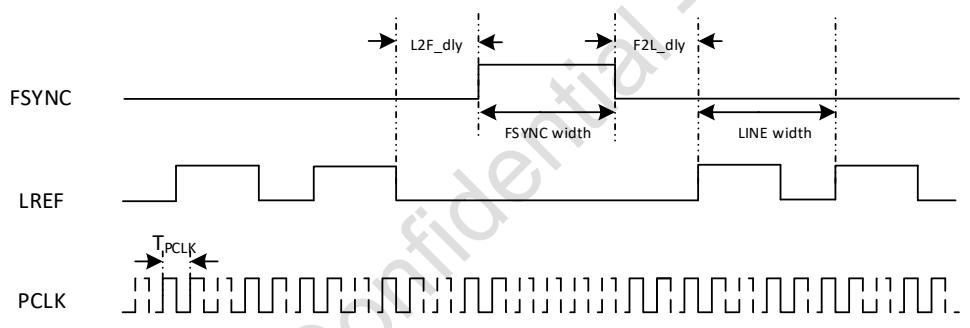

text_image

L2F_dly
F2L_dly
FSYNC width
LINE width
FSYNC
LREF
TPCLK
PCLK

图 1-6 DVP 时序

注：

1） $T_{PCLK}$ 表示 PCLK 的周期；  
2）L2F\_dly 表示最后的 LREF 下降沿至 FSYNC 上升沿间时延；  
3） F2L\_dly 表示 FSYNC 下降沿至第一条 LREF 上升沿间时延；  
4） LINE width 表示一行宽度，由寄存器{16h'320c, 16'h320d}控制；  
5）FSYNC width 默认值为一行宽度，以 1 行为单位，由寄存器 16'h3d01 调节。

表 1-6 DVP 同步调整寄存器

<table><tr><td>功能</td><td>寄存器地址</td><td>默认值</td><td>描述</td></tr><tr><td>FSYNC 输出使能</td><td>16&#x27;h300a</td><td>8&#x27;h20</td><td>Bit[2]: FSYNC output en1 ~ FSYNC as output PAD0 ~ FSYNC as input PAD</td></tr><tr><td>FSYNC 信号宽度</td><td>16&#x27;h3d01</td><td>8&#x27;h01</td><td>FSYNC length</td></tr><tr><td>DVP 信号极性</td><td>16&#x27;h3d08</td><td>8&#x27;h01</td><td>Bit[2]: LREF polarityBit[1]: FSYNC polarityBit[0]: PCLK polarity</td></tr><tr><td>PAD 驱动能力</td><td>16&#x27;h3641</td><td>8&#x27;h00</td><td>Bit[1:0]: adjust PAD driver capability</td></tr><tr><td>PCLK 延迟</td><td>16&#x27;h3640</td><td>8&#x27;h00</td><td>Bit[1:0]: PCLK DLY 2ns/step</td></tr></table>

# 1.7.2. MIPI

SC2336 提供串行视频端口（MIPI）。SC2336 MIPI 接口支持 8/10bit, 1/2lane 串行输出，传输速率推荐不大于 1.0Gbps。下图 MIPI 数据接口示意图。

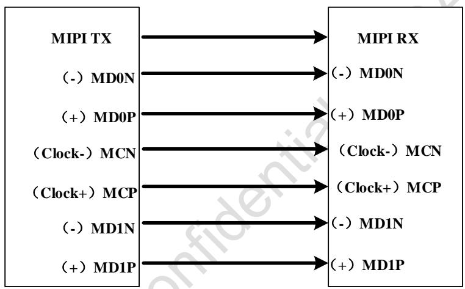

flowchart

```mermaid
graph LR
  subgraph MIPI_TX["MIPI TX"]
    direction TB
  (-) MD0N --> M1["(-) MD0N"]
  (+) MD0P --> M2["(+) MD0P"]
  (Clock-) MCN --> M3["(Clock-) MCN"]
  (Clock+) MCP --> M4["(Clock+) MCP"]
  (-) MD1N --> M5["(-) MD1N"]
  (+) MD1P --> M6["(+) MD1P"]
  end
  subgraph MIPI_RX["MIPI RX"]
    direction TB
  M1 --> M2
  M2 --> M3
  M3 --> M4
  M4 --> M5
  M5 --> M6
  end
```

图 1-7 MIPI 接口示意图

下图是 MIPI 底层数据包的简略示意图，其中分别展示了一个短数据包和长数据包的传输过程。

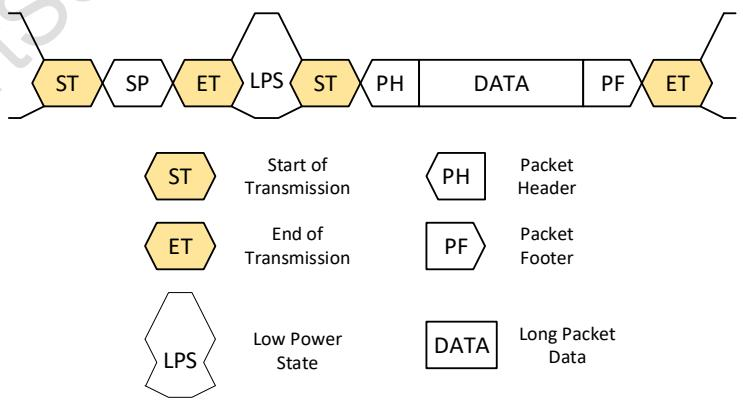

flowchart

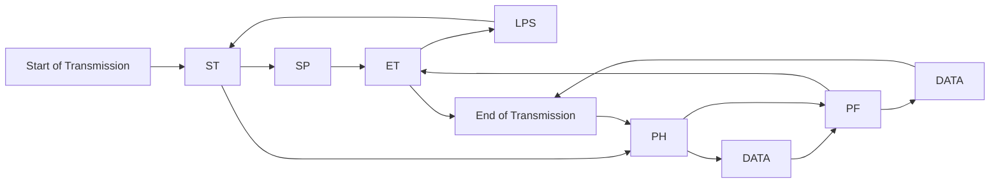
```mermaid
graph LR
  Start["Start of Transmission"] --> ST["ST"]
  ST --> SP["SP"]
  SP --> ET["ET"]
  ET --> LPS["LPS"]
  LPS --> ST["ST"]
  ST --> PH["PH"]
  PH --> DATA["DATA"]
  DATA --> PF["PF"]
  PF --> ET["ET"]
  ET --> End["End of Transmission"]
  End --> PH["PH"]
  PH --> PF["PF"]
  PF --> Data["DATA"]
  Data --> End
```

图 1-8 MIPI 底层数据包示意图

图 1-9 展示了 MIPI 长、短数据包结构示意图。其中数据标识 DI(Data Identifier)用来区分不同的数据包类型。图 1-10 展示了 MIPI 工作在 1lane 和 2lane 模式下的数据包传输示意图。图 1-11 中，DI 包括两部分，分别是虚拟通道（VC）和数据类型（DT）。默认情况下，Sensor 给出的 MIPI 数据 VC 值都是 0，而 DT 值如表 1-7 所示。

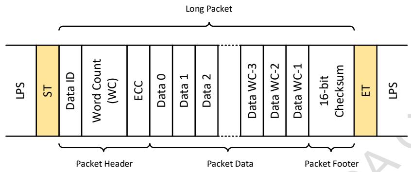

text_image

Long Packet
LPS
ST
Data ID
Word Count (WC)
ECC
Data 0
Data 1
Data 2
Packet Header
Packet Data
Data WC-3
Data WC-2
Data WC-1
16-bit Checksum
Packet Footer
ET
LPS

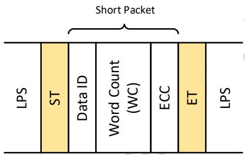

text_image

Short Packet
LPS ST Data ID Word Count (WC) ECC ET LPS

图 1-9 MIPI 长/短数据包结构示意图

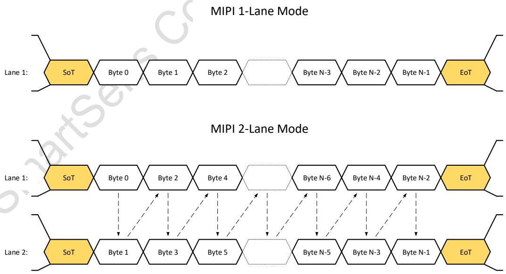  
图 1-10 MIPI 1/2lane 模式数据包传输示意图

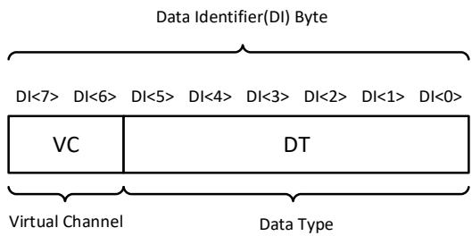

text_image

Data Identifier(DI) Byte
DI<7> DI<6> DI<5> DI<4> DI<3> DI<2> DI<1> DI<0>
VC	DT
Virtual Channel	Data Type

图 1-11 MIPI 数据包 DI 结构

表 1-7 MIPI 数据类型

<table><tr><td>DT</td><td>描述</td></tr><tr><td>6&#x27;h00</td><td>帧起始短包</td></tr><tr><td>6&#x27;h01</td><td>帧结束短包</td></tr><tr><td>6&#x27;h02</td><td>行起始短包</td></tr><tr><td>6&#x27;h03</td><td>行结束短包</td></tr><tr><td>6&#x27;h2a</td><td>8-bit 模式下数据长包</td></tr><tr><td>6&#x27;h2b</td><td>10-bit 模式下数据长包</td></tr></table>

表 1-8 MIPI 调整寄存器

<table><tr><td>功能</td><td>寄存器地址</td><td>默认值</td><td>描述</td></tr><tr><td>MIPI lane 数量</td><td>16&#x27;h3018</td><td>8&#x27;h32</td><td>Bit[7:5]: MIPI lane num-13&#x27;h0 ~ 1 lane mode3&#x27;h1 ~ 2 lane mode</td></tr><tr><td>MIPI 输出数据模式</td><td>16&#x27;h3031</td><td>8&#x27;h0a</td><td>Bit[3:0]: MIPI bit mode4&#x27;h8 ~ raw8 mode4&#x27;ha ~ raw10 mode</td></tr><tr><td>PHY 数据模式</td><td>16&#x27;h3037</td><td>8&#x27;h20</td><td>Bit[6:5]: phy bit mode2&#x27;h0 ~ 8bit mode2&#x27;h1 ~ 10bit mode</td></tr><tr><td>MIPI clock 设置</td><td>16&#x27;h303f</td><td>8&#x27;h01</td><td>Bit[7]: pclk sel1&#x27;h0 ~ sel MIPI_pclk1&#x27;b1 ~ sel DVP_pclk</td></tr><tr><td>MIPI 数据使能</td><td>16&#x27;h4603</td><td>8&#x27;h00</td><td>Bit[0]: MIPI read1&#x27;h1 ~ disable1&#x27;h0 ~ enable</td></tr><tr><td>MIPI LP 驱动</td><td>16&#x27;h3651</td><td>8&#x27;h7d</td><td>Bit[2:1]: MIPI LP 驱动能力调整,默认 3&#x27;h1</td></tr><tr><td>MIPI Lane 0 延时</td><td>16&#x27;h3652</td><td>8&#x27;h00</td><td>Bit[3]: lane0 相位反向,默认 1&#x27;h0Bit[2:0]: lane0 延时,40ps/step,默认 3&#x27;h0</td></tr><tr><td>MIPI Lane 1 延时</td><td>16&#x27;h3652</td><td>8&#x27;h00</td><td>Bit[7]: lane1 相位反向,默认 1&#x27;h0Bit[6:4]: lane1 延时,40ps/step,默认 3&#x27;h0</td></tr><tr><td>MIPI Clock 延时</td><td>16&#x27;h3654</td><td>8&#x27;h00</td><td>Bit[3]: 时钟反向,默认 1&#x27;h0Bit[2:0]: 时钟延时,40ps/step,默认 3&#x27;h0</td></tr></table>

# 1.8. 锁相环

SC2336 的 PLL 模块允许的输入时钟频率范围为 6\~40MHz，其中 VCO 输出频率（ $F_{VCO}$ ）的范围为 400MHz-1200MHz。PLL 结构示意图如下图所示。

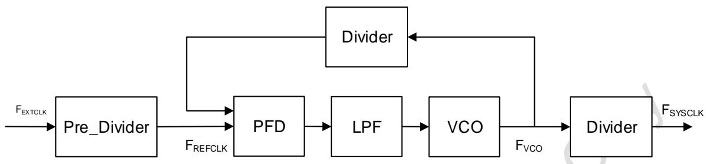

flowchart

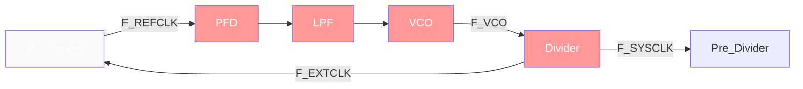
```mermaid
graph LR
  A["Pre_Divider"] -->|"F_REFCLK"| B["PFD"]
  B --> C["LPF"]
  C --> D["VCO"]
  D -->|"F_VCO"| E["Divider"]
  E -->|"F_SYSCLK"| F["Pre_Divider"]
  E -->|"F_EXTCLK"| A
  style A fill:#f9f9f9,color:#fff
  style B fill:#ff9999,color:#fff
  style C fill:#ff9999,color:#fff
  style D fill:#ff9999,color:#fff
  style E fill:#ff9999,color:#fff
```

图 1-12 PLL 控制示意图

# 2. 功能介绍

# 2.1. SLAVE MODE

Slave Mode 是主控芯片通过 EFSYNC 或者做输入时的 FSYNC 信号触发帧读出，以达到多个 sensor 同步成像的工作模式。

当 SC2336 工作在 Slave Mode 时，主控芯片通过 EFSYNC/FSYNC 引脚控制图像数据输出，并以此决定图像帧率，具体时序如下图：

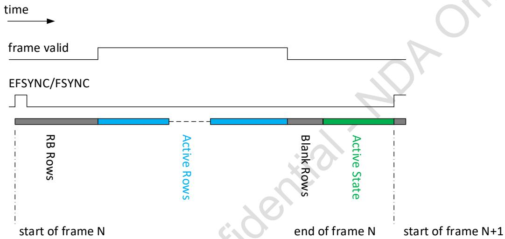

flowchart

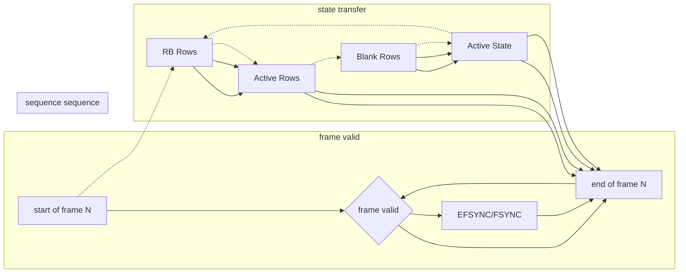
```mermaid
graph LR
  subgraph FrameValid ["frame valid"]
    direction TB
  Start["start of frame N"] --> Valid{"frame valid"}
  Valid --> End["end of frame N"]
  End --> Valid
  Valid --> FSYNC["EFSYNC/FSYNC"]
  end

  subgraph StateTransfer ["state transfer"]
    direction TB
  RB["RB Rows"] --> Active["Active Rows"]
  Active --> End
  Blank["Blank Rows"] --> ActiveState["Active State"]
  ActiveState --> End
  FSYNC --> End
  end

  subgraph Sequence["sequence sequence"]
    direction TB
  RB --> Active
  Active --> End
  Blank --> ActiveState
  ActiveState --> End
  end

  Start -.-> RB
  RB -.-> Active
  Active -.-> Blank
  Blank -.-> ActiveState
  ActiveState -.-> RB
```

图 2-1 Slave Mode 时序图

# Slave Mode 工作流程

1) 当 SC2336 工作在 Slave Mode 时，芯片自动进入 Active State 状态，等待 EFSYNC/FSYNC 触发；  
2) EFSYNC/FSYNC 触发上升沿有效，EFSYNC 高电平持续时间不小于 4 个 EXTCLK 周期；  
3) 当 EFSYNC/FSYNC 触发后，芯片进入 RB Rows，RB Rows 是有效数据读出之前的等待时间，由寄存器控制，以行为单位；  
4) Active Rows 时读出芯片图像数据，由寄存器控制，以行为单位；  
5) Blank Rows 时读出芯片图像数据之后的消隐时间，由寄存器控制，以行为单位；  
6) Active State 时芯片等待下一次 EFSYNC/FSYNC 触发，Active State 应尽量小，建议为 0;  
7) EFSYNC/FSYNC 上升沿间隔为一帧时间，EFSYNC/FSYNC 上升沿间隔允许有 40ns 偏差。

注：

1) 只有当 SC2336 处于 Active State 时，EFSYNC/FSYNC 触发才有效；  
2) Sensor 会提前 40ns 退出 Blank Rows 进入 Active State。

SC2336 Slave mode 下的曝光实现如下图:

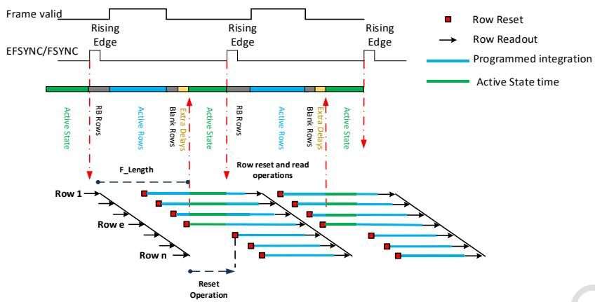

flowchart

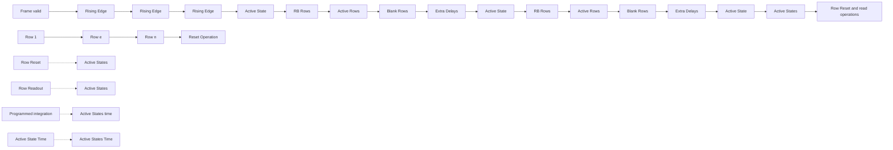
```mermaid
graph LR
  A["Frame valid"] --> B["Rising Edge"]
  B --> C["Rising Edge"]
  C --> D["Rising Edge"]
  D --> E["Active State"]
  E --> F["RB Rows"]
  F --> G["Active Rows"]
  G --> H["Blank Rows"]
  H --> I["Extra Delays"]
  I --> J["Active State"]
  J --> K["RB Rows"]
  K --> L["Active Rows"]
  L --> M["Blank Rows"]
  M --> N["Extra Delays"]
  N --> O["Active State"]
  O --> P["Active States"]
  P --> Q["Row Reset and read operations"]
  R["Row 1"] --> S["Row e"]
  S --> T["Row n"]
  T --> U["Reset Operation"]
  V["Row Reset"] -.-> W["Active States"]
  X["Row Readout"] -.-> Y["Active States"]
  Z["Programmed integration"] -.-> AA["Active States time"]
  AB["Active State Time"] -.-> AC["Active States Time"]
```

图 2-2 Slave Mode 曝光实现图

注：

1) Row Reset 开始曝光操作，Row Readout 开始前结束曝光操作，曝光包括 Active State 时间；  
2) VTS 表示帧长，VTS= RB Rows + Active Rows + Blank Rows;  
3) Active State 时，芯片停止输出及停止 Row reset 操作，如图 2-2 所示，会导致一帧图像 Row 1\~Row e 行与 Row (e+1)\~Row n 行的曝光时间不同，Row 1\~Row e 行的曝光时间比 Row (e+1)\~Row n 行的曝光时间大，多出的时间为 Active State time，为避免这种曝光差异，要求外部精确控制 EFSYNC/FSYNC，使 Active State 控制在 40ns 以内，保证一帧内的每行曝光时间基本一致；  
4) 当 RB Rows 大于曝光时间时，注释 3) 中帧内曝光时间不一致的情况便不会出现，一帧内的每行曝光时间一致，此时 EFSYNC/FSYNC 引脚可实现同步曝光。

表 2-1 Slave mode 控制寄存器

<table><tr><td>功能</td><td>寄存器地址</td><td>默认值</td><td>描述</td></tr><tr><td>Slave mode enable</td><td>16&#x27;h3222</td><td>8&#x27;h00</td><td>Bit[1]: Slave mode 使能控制1 ~ slave mode0 ~ master mode</td></tr><tr><td>Merge enable</td><td>16&#x27;h3225</td><td>8&#x27;h10</td><td>Bit[4]: Active Rows Blank Rows merge enable</td></tr><tr><td>Trigger Pad sel</td><td>16&#x27;h3224</td><td>8&#x27;h82</td><td>Bit[4]: trigger pad sel1 ~ sel FSYNC0 ~ sel EFSYNC</td></tr><tr><td>FSYNC OEN</td><td>16&#x27;h300a</td><td>8&#x27;h20</td><td>Bit[2]: FSYNC output en1 ~ FSYNC as output PAD0 ~ FSYNC as input PAD</td></tr><tr><td>RB rows</td><td>{16&#x27;h3230,16&#x27;h3231}</td><td>16&#x27;h0004</td><td>Rows Before Read 控制寄存器</td></tr><tr><td>Active Rows, Blank Rows</td><td>{16&#x27;h322e,16&#x27;h322f}</td><td>16&#x27;h04de</td><td>Active Rows + Blank Rows,需要满足:Active Rows + Blank Rows = VTS - RB Rows</td></tr><tr><td>VTS</td><td>{16&#x27;h320e,16&#x27;h320f}</td><td>16&#x27;h0465</td><td>帧长</td></tr></table>

# 2.2. AEC/AGC

AEC/AGC 都是基于亮度进行调节的，AEC 调节曝光时间，AGC 调节增益值，最终使图像亮度落在设定亮度阈值范围内。

# 2.2.1. AEC/AGC 的控制策略

SC2336 本身没有 AEC/AGC 功能，需要通过后端平台实现 AEC/AGC。在整个 AEC/AGC 过程中，不是独立的调整 sensor 的曝光时间或者增益，调整策略为：曝光时间优先，曝光时间已经最长无法继续调整时，调整增益。

以图像过暗的情况为例，调控的先后顺序为：①不开启任何增益，直到曝光时间达到上限；②曝光时间达到上限后，再开始调用自动增益控制。需要明确指出的是，增益开启，将直接导致平均噪声呈倍数放大；而曝光时间加大，则有助于提升信噪比。

反之，当图像过亮时，则优先关闭增益，当所有增益关闭，图像仍旧过亮，则降低曝光时间。

曝光时间与增益是一个交互的调节体系，在调试的时候，应该综合考虑。

# 2.2.2. AEC 控制寄存器说明

AEC 的控制寄存器如下表所示。

表 2-2 曝光的手动控制寄存器

<table><tr><td>功能</td><td>寄存器地址</td><td>说明</td><td>调节步长</td><td>最小值</td><td>最大值</td></tr><tr><td>曝光时间</td><td>{16&#x27;h3e00[3:0]16&#x27;h3e01[7:0],16&#x27;h3e02[7:4]}</td><td>手动曝光时间,寄存器值以1行为单位</td><td>1</td><td>1</td><td>{16&#x27;h320e, 16&#x27;h320f}-‘d4</td></tr></table>

AEC 控制说明如下:

1) AEC 的调节步长为 1 行时间，一行时间计算方法参考 2.6 章节；  
2) 曝光时间及增益若在第 N 帧写入，第 N+2 帧生效；  
3) 曝光时间及增益的写入点：线性模式下建议在帧开始之后写入。

# 2.2.3. AGC 控制寄存器说明

AGC 的控制寄存器如下表所示。

表 2-3 增益寄存器控制

<table><tr><td>ANA GAIN register</td><td>DIG GAIN register</td><td>DIG FINE GAIN register</td></tr><tr><td>16&#x27;h3e09</td><td>16&#x27;h3e06</td><td>16&#x27;h3e07</td></tr></table>

SC2336 AGC 控制方法：将寄存器 16'h3e03 的 Bit[3:0] 设置为 4'hb:

模拟 gain 值如表 2-4 所示，数字 gain 值如表 2-5 所示。一般情况下，优先调节模拟 gain 值，模拟 gain 调节到上限时，如果要继续增大图像亮度，可以调节数字 gain 值。DIG FINE GAIN 的精度为 1/32，列出了 DIG FINE GAIN 的控制方法。

由于模拟 gain 只有 coarse gain，没有 fine gain，所以在调节模拟 gain 时需要 DIG FINE GAIN（1\~2 倍）代替模拟 fine gain，平滑过渡，避免 AGC 震荡的现象。

表 2-4 模拟 gain 值控制寄存器

<table><tr><td>ANA GAIN</td><td>GAIN Value</td><td>dB Value</td></tr><tr><td>8&#x27;h00</td><td>1.000</td><td>0.00</td></tr><tr><td>8&#x27;h08</td><td>2.000</td><td>6.02</td></tr><tr><td>8&#x27;h09</td><td>4.000</td><td>12.04</td></tr><tr><td>8&#x27;h0b</td><td>8.000</td><td>18.06</td></tr><tr><td>8&#x27;h0f</td><td>16.000</td><td>24.08</td></tr><tr><td>8&#x27;h1f</td><td>32.000</td><td>30.10</td></tr></table>

表 2-5 数字 gain 值控制寄存器

<table><tr><td>DIG GAIN</td><td>DIG FINE GAIN</td><td>GAIN Value</td><td>dB Value</td><td>DIG GAIN</td><td>DIG FINE GAIN</td><td>GAIN Value</td><td>dB Value</td></tr><tr><td>8&#x27;h00</td><td>8&#x27;h80</td><td>1.000</td><td>0.00</td><td>8&#x27;h01</td><td>8&#x27;h84</td><td>2.063</td><td>6.29</td></tr><tr><td>8&#x27;h00</td><td>8&#x27;h84</td><td>1.031</td><td>0.27</td><td>8&#x27;h01</td><td>8&#x27;h88</td><td>2.125</td><td>6.55</td></tr><tr><td>8&#x27;h00</td><td>8&#x27;h88</td><td>1.063</td><td>0.53</td><td>8&#x27;h01</td><td>8&#x27;h8c</td><td>2.188</td><td>6.80</td></tr><tr><td>8&#x27;h00</td><td>8&#x27;h8c</td><td>1.094</td><td>0.78</td><td>8&#x27;h01</td><td>8&#x27;h90</td><td>2.250</td><td>7.04</td></tr><tr><td>8&#x27;h00</td><td>8&#x27;h90</td><td>1.125</td><td>1.02</td><td>8&#x27;h01</td><td>8&#x27;h94</td><td>2.313</td><td>7.28</td></tr><tr><td>8&#x27;h00</td><td>8&#x27;h94</td><td>1.156</td><td>1.26</td><td>8&#x27;h01</td><td>8&#x27;h98</td><td>2.375</td><td>7.51</td></tr><tr><td>8&#x27;h00</td><td>8&#x27;h98</td><td>1.188</td><td>1.49</td><td>8&#x27;h01</td><td>8&#x27;h9c</td><td>2.438</td><td>7.74</td></tr><tr><td>8&#x27;h00</td><td>8&#x27;h9c</td><td>1.219</td><td>1.72</td><td>8&#x27;h01</td><td>8&#x27;ha0</td><td>2.500</td><td>7.96</td></tr><tr><td>8&#x27;h00</td><td>8&#x27;ha0</td><td>1.250</td><td>1.94</td><td>8&#x27;h01</td><td>8&#x27;ha4</td><td>2.563</td><td>8.17</td></tr><tr><td>8&#x27;h00</td><td>8&#x27;ha4</td><td>1.281</td><td>2.15</td><td>8&#x27;h01</td><td>8&#x27;ha8</td><td>2.625</td><td>8.38</td></tr><tr><td>8&#x27;h00</td><td>8&#x27;ha8</td><td>1.313</td><td>2.36</td><td>8&#x27;h01</td><td>8&#x27;hac</td><td>2.688</td><td>8.59</td></tr><tr><td>8&#x27;h00</td><td>8&#x27;hac</td><td>1.344</td><td>2.57</td><td>8&#x27;h01</td><td>8&#x27;hb0</td><td>2.750</td><td>8.79</td></tr><tr><td>8&#x27;h00</td><td>8&#x27;hb0</td><td>1.375</td><td>2.77</td><td>8&#x27;h01</td><td>8&#x27;hb4</td><td>2.813</td><td>8.98</td></tr><tr><td>8&#x27;h00</td><td>8&#x27;hb4</td><td>1.406</td><td>2.96</td><td>8&#x27;h01</td><td>8&#x27;hb8</td><td>2.875</td><td>9.17</td></tr><tr><td>8&#x27;h00</td><td>8&#x27;hb8</td><td>1.438</td><td>3.15</td><td>8&#x27;h01</td><td>8&#x27;hbc</td><td>2.938</td><td>9.36</td></tr><tr><td>8&#x27;h00</td><td>8&#x27;hbc</td><td>1.469</td><td>3.34</td><td>8&#x27;h01</td><td>8&#x27;hc0</td><td>3.000</td><td>9.54</td></tr><tr><td>8&#x27;h00</td><td>8&#x27;hc0</td><td>1.500</td><td>3.52</td><td>8&#x27;h01</td><td>8&#x27;hc4</td><td>3.063</td><td>9.72</td></tr><tr><td>8&#x27;h00</td><td>8&#x27;hc4</td><td>1.531</td><td>3.70</td><td>8&#x27;h01</td><td>8&#x27;hc8</td><td>3.125</td><td>9.90</td></tr><tr><td>8&#x27;h00</td><td>8&#x27;hc8</td><td>1.563</td><td>3.88</td><td>8&#x27;h01</td><td>8&#x27;hcc</td><td>3.188</td><td>10.07</td></tr><tr><td>8&#x27;h00</td><td>8&#x27;hcc</td><td>1.594</td><td>4.05</td><td>8&#x27;h01</td><td>8&#x27;hd0</td><td>3.250</td><td>10.24</td></tr><tr><td>8&#x27;h00</td><td>8&#x27;hd0</td><td>1.625</td><td>4.22</td><td>8&#x27;h01</td><td>8&#x27;hd4</td><td>3.313</td><td>10.40</td></tr><tr><td>8&#x27;h00</td><td>8&#x27;hd4</td><td>1.656</td><td>4.38</td><td>8&#x27;h01</td><td>8&#x27;hd8</td><td>3.375</td><td>10.57</td></tr><tr><td>8&#x27;h00</td><td>8&#x27;hd8</td><td>1.688</td><td>4.54</td><td>8&#x27;h01</td><td>8&#x27;hdc</td><td>3.438</td><td>10.72</td></tr><tr><td>8&#x27;h00</td><td>8&#x27;hdc</td><td>1.719</td><td>4.70</td><td>8&#x27;h01</td><td>8&#x27;he0</td><td>3.500</td><td>10.88</td></tr><tr><td>8&#x27;h00</td><td>8&#x27;he0</td><td>1.750</td><td>4.86</td><td>8&#x27;h01</td><td>8&#x27;he4</td><td>3.563</td><td>11.04</td></tr><tr><td>8&#x27;h00</td><td>8&#x27;he4</td><td>1.781</td><td>5.01</td><td>8&#x27;h01</td><td>8&#x27;he8</td><td>3.625</td><td>11.19</td></tr><tr><td>8&#x27;h00</td><td>8&#x27;he8</td><td>1.813</td><td>5.17</td><td>8&#x27;h01</td><td>8&#x27;hec</td><td>3.688</td><td>11.33</td></tr><tr><td>8&#x27;h00</td><td>8&#x27;hec</td><td>1.844</td><td>5.31</td><td>8&#x27;h01</td><td>8&#x27;hf0</td><td>3.750</td><td>11.48</td></tr><tr><td>8&#x27;h00</td><td>8&#x27;hf0</td><td>1.875</td><td>5.46</td><td>8&#x27;h01</td><td>8&#x27;hf4</td><td>3.813</td><td>11.62</td></tr><tr><td>8&#x27;h00</td><td>8&#x27;hf4</td><td>1.906</td><td>5.60</td><td>8&#x27;h01</td><td>8&#x27;hf8</td><td>3.875</td><td>11.77</td></tr><tr><td>8&#x27;h00</td><td>8&#x27;hf8</td><td>1.938</td><td>5.74</td><td>8&#x27;h01</td><td>8&#x27;hfc</td><td>3.938</td><td>11.90</td></tr><tr><td>8&#x27;h00</td><td>8&#x27;hfc</td><td>1.969</td><td>5.88</td><td>8&#x27;h03</td><td>8&#x27;h80</td><td>4.000</td><td>12.04</td></tr><tr><td>8&#x27;h01</td><td>8&#x27;h80</td><td>2.000</td><td>6.02</td><td></td><td></td><td></td><td></td></tr></table>

# 2.3. GROUP HOLD

SC2336 具有 Group hold 功能，Group hold 指的是把寄存器打包在一帧特定时刻生效的功能。SC2336 最多支持 10 个寄存器打包；支持帧延迟写入功能，延迟帧数由寄存器控制。

使用方法：寄存器 16'h3812 写 8'h00，需要打包生效的寄存器写入 group，打包结束后寄存器 16'h3812 写 8'h30；打包生效的时刻为 16'h3812 写 8'h30 之后第 N 个帧内生效时刻，N=0 表示当前帧，N=1 表示下一帧……，延迟帧数由寄存器 16'h3802 控制。

表 2-6 Group hold 控制寄存器

<table><tr><td>功能</td><td>寄存器地址</td><td>默认值</td><td>描述</td></tr><tr><td>帧延迟控制</td><td>16&#x27;h3802</td><td>8&#x27;h00</td><td>Bit[3:0]: 帧延迟控制,生效时间帧延迟控制,写 0 表示当前帧,写 N 表示 N 帧延迟</td></tr></table>

# 2.4. DPC

SC2336 支持 DPC 功能。SC2336 坏点判断的原理是当前 pixel 值比周围相同颜色的 pixel 值都大（或者小），并且差值都大于设定阈值。SC2336 根据坏点判断的原理把坏点分为亮坏点（white pixel）和暗坏点（black pixel），具体控制寄存器如下表所示。

表 2-7 DPC 控制寄存器

<table><tr><td>功能</td><td>寄存器地址</td><td>默认值</td><td>描述</td></tr><tr><td>亮坏点消除功能开关</td><td>16&#x27;5000[2]</td><td>1&#x27;b1</td><td>white pixel cancellation enable1 ~ enable0 ~ disable</td></tr><tr><td>暗坏点消除功能开关</td><td>16&#x27;5000[1]</td><td>1&#x27;b1</td><td>black pixel cancellation enable1 ~ enable0 ~ disable</td></tr></table>

# 2.5. 视频输出模式

# 2.5.1. 读取顺序

下图提供了芯片工作的时候，第一个读取的 pixel 位置，以及整个 array 的结构示意图。此图是在 A1 pin 脚置于左上方的时候得到（top view）。

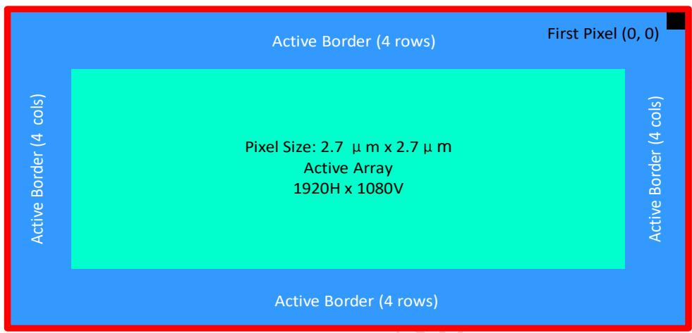

text_image

First Pixel (0, 0)
Active Border (4 rows)
Active Border (4 cols)
Pixel Size: 2.7 µm x 2.7 µm
Active Array
1920H x 1080V
Active Border (4 cols)

图 2-3 像素阵列图一

下图给出了 first pixel 的数据颜色格式。

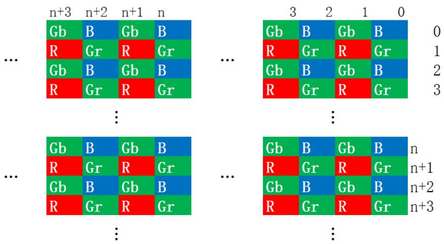

text_image

n+3 n+2 n+1 n
Gb B Gb B
R Gr R Gr
Gb B Gb B
R Gr R Gr
...
...
...
...
...
...
...
...
...
...
...
...
...
...
...
...
...
...
...
...
...
...
...
...
...
...
...
...
...
...
...
...
...
...
...
...
...
...
...
...
...
...
...
...
...
...
...
...
...
...
...
...
...
...
...
...
...
...
...
...
...
...
...
...
...
...
...
...
...
...
...
...
...
...
...
...
...
...
...
...
...
...
...
...
...
...
...
...
...
...
...
...
...
...
...
...
...
...
...
...
!
Gb B Gb B 0
R Gr R Gr 1
Gb B Gb B 2
R Gr R Gr 3
...
...
...
...
... ...
Gb B Gb B n
R Gr R Gr n+1
Gb B Gb B n+2
R Gr R Gr n+3
... ...
... ...
... ...
... ...
... ...
... ...
... ...
... ...
... ...
... ...
... ...
... ...
... ...
... ...
... ...
... ...
... ...
... ...
... ...
... ...
... ...
... ...
... ...
... ...
... ...
... ...
... ...
... ...
... ...
... ...
... ...
... ...
... ...
... ...
... ...
... ...
... ...
... ...
... ...
... ...
... ...
... ...
... ...
... ...
... ...
... ...
... ...
... ...
... ...
... ...
... ... ...
... ...
... ...
... ...
... ...
... ...
... ...
... ...
... ...
... ...
... ...
... ...
... ...
... ...
... ...
... ...
... ...
... ...
... ...
... ...
... ...
... ...
... ...
... ...
... ...
... ...
... ...
... ...
... ...
... ...
... ...
... ...
... ...
... ...
... ...
... ...
... ...
... ...
... ...
... ...
... ...
... ...
... ...
... ...
... ...
... ...
... ...
... ...
... ...
... ...
… ... ... ... ... ... ... ... ... ... ... ... ... ... ... ... ... ... ... ... ... ... ... ... ... ... ... ... ... ... ... ... ... ... ... ... ... ... ... ... ... ... ... ... ... ... ... ... ... ... ... ... ... ... ... ... ... ... ... ... ... ... ... ... ... ... ... ... ... ... ... ... ... ... ... ... ... ... ... ... ... ... ... ... ... ... ... ... ... ... ... ... ... ... ... ... ... ... ... ... ... ..

图 2-4 像素阵列图二

SC2336 提供镜像模式和倒置模式。前者会水平颠倒传感器的数据读出顺序，而后者会垂直颠倒传感器的读出顺序，如下图所示。

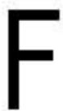  
原始图像

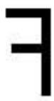  
镜像图像

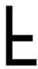  
倒置图像

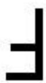  
镜像及倒置图像

图 2-5 镜像和倒置实例  
表 2-8 镜像和倒置模式控制寄存器

<table><tr><td>功能</td><td>寄存器地址</td><td>默认值</td><td>描述</td></tr><tr><td rowspan="3">镜像模式</td><td rowspan="3">16&#x27;h3221</td><td rowspan="3">8&#x27;h00</td><td>Bit[2:1]: mirror ctrl</td></tr><tr><td>2&#x27;b00 ~ mirror off</td></tr><tr><td>2&#x27;b11 ~ mirror on</td></tr><tr><td rowspan="3">倒置模式</td><td rowspan="3">16&#x27;h3221</td><td rowspan="3">8&#x27;h00</td><td>Bit[6:5]: flip ctrl</td></tr><tr><td>2&#x27;b00 ~ flip off</td></tr><tr><td>2&#x27;b11 ~ flip on</td></tr></table>

# 2.5.2. 输出窗口

表 2-9 输出窗口寄存器

<table><tr><td>功能</td><td>寄存器地址</td><td>默认值</td><td>描述</td></tr><tr><td>窗口宽度</td><td>{16&#x27;h3208, 16&#x27;h3209}</td><td>16&#x27;h0780</td><td>输出窗口宽度</td></tr><tr><td>窗口高度</td><td>{16&#x27;h320a, 16&#x27;h320b}</td><td>16&#x27;h0438</td><td>输出窗口高度</td></tr><tr><td>列起始</td><td>{16&#x27;h3210, 16&#x27;h3211}</td><td>16&#x27;h0004</td><td>输出窗口列起始位置</td></tr><tr><td>行起始</td><td>{16&#x27;h3212, 16&#x27;h3213}</td><td>16&#x27;h0004</td><td>输出窗口行起始位置</td></tr></table>

# 2.6. 帧率计算

SC2336 帧率由 FAE 提供，在此给出一种简单的计算一行时间的方法：

一行时间=1/(帧率\*帧长)。

表 2-10 帧率相关寄存器

<table><tr><td>功能</td><td>寄存器地址</td><td>默认值</td><td>描述</td></tr><tr><td>帧长</td><td>{16&#x27;h320e[7:0],16&#x27;h320f}</td><td>16&#x27;h0465</td><td>帧长={16&#x27;h320e[7:0],16&#x27;h320f}</td></tr></table>

# 2.7. 测试模式

为方便测试，SC2336 提供一种灰度递增测试模式，如下图所示。

natural_image

Gradient transition from black to white with no text or symbols

图 2-6 测试模式

表 2-11 测试模式控制寄存器

<table><tr><td>功能</td><td>寄存器地址</td><td>寄存器值</td><td>默认值</td><td>描述</td></tr><tr><td>灰度渐变模式</td><td>16&#x27;h4501</td><td>8&#x27;hac</td><td>8&#x27;hc4</td><td>Bit[3]: incremental pattern enable0 ~ normal image1 ~ incremental pattern</td></tr></table>

# 3. 电气特性

表 3-1 绝对最大额定值（以上所有电压都是 to pad 电压）

<table><tr><td>项目</td><td>符号</td><td>绝对最大额定值范围</td><td>单位</td></tr><tr><td>模拟电源电压</td><td> $V_{AVDD}$ </td><td>-0.3~3.4</td><td>V</td></tr><tr><td>I/O 电源电压</td><td> $V_{DOVDD}$ </td><td>-0.3~2.2</td><td>V</td></tr><tr><td>I/O 输入电压</td><td> $V_I$ </td><td>-0.3 ~  $V_{DOVDD}$ +0.3</td><td>V</td></tr><tr><td>I/O 输出电压</td><td> $V_O$ </td><td>-0.3 ~  $V_{DOVDD}$ +0.3</td><td>V</td></tr><tr><td>工作温度</td><td> $T_{OPR}$ </td><td>-30~+85</td><td>°C</td></tr><tr><td>最佳工作温度</td><td> $T_{SPEC}$ </td><td>-20~+60</td><td>°C</td></tr><tr><td>贮存温度</td><td> $T_{STG}$ </td><td>-40~+85</td><td>°C</td></tr></table>

表 3-2 直流电气特性（以上所有电压都是 to pad 电压）

<table><tr><td>项目</td><td>符号</td><td>最小值</td><td>典型值</td><td>最大值</td><td>单位</td></tr><tr><td colspan="6">电源</td></tr><tr><td>模拟电源电压</td><td> $V_{AVDD}$ </td><td>2.7</td><td>2.8</td><td>2.9</td><td>V</td></tr><tr><td>I/O 供电电压</td><td> $V_{DOVDD}$ </td><td>1.7</td><td>1.8</td><td>1.9</td><td>V</td></tr><tr><td colspan="6">电流(工作电流:线性模式30fps MIPI 2-lane output)</td></tr><tr><td>模拟电源电流</td><td> $I_{AVDD}$ </td><td>-</td><td>26.3</td><td>-</td><td>mA</td></tr><tr><td>I/O 电源电流</td><td> $I_{DOVDD}$ </td><td>-</td><td>37.4</td><td>-</td><td>mA</td></tr><tr><td>总功耗</td><td>Power(*)</td><td>-</td><td>140.96</td><td>-</td><td>mW</td></tr><tr><td colspan="6">数字输入</td></tr><tr><td>输入低电平</td><td> $V_{IL}$ </td><td>-</td><td>-</td><td>0.3 x DOVDD</td><td>V</td></tr><tr><td>输入高电平</td><td> $V_{IH}$ </td><td>0.7 x DOVDD</td><td>-</td><td>-</td><td>V</td></tr><tr><td>输入电容</td><td> $C_{IN}$ </td><td>-</td><td>-</td><td>10</td><td>pF</td></tr><tr><td colspan="6">数字输出(25Pf 标准负载)</td></tr><tr><td>输出高电平</td><td> $V_{OH}$ </td><td>0.9 x DOVDD</td><td>-</td><td>-</td><td>V</td></tr><tr><td>输出低电平</td><td> $V_{OL}$ </td><td>-</td><td>-</td><td>0.1 x DOVDD</td><td>V</td></tr><tr><td colspan="6">串行接口输入(SCL 和 SDA)</td></tr><tr><td>输入低电平</td><td> $V_{IL}$ </td><td>-0.5</td><td>0</td><td>0.3 x DOVDD</td><td>V</td></tr><tr><td>输入高电平</td><td> $V_{IH}$ </td><td>0.7 x DOVDD</td><td>DOVDD</td><td>DOVDD+0.5</td><td>V</td></tr></table>

注：工作电流：（典型值）工作电压 2.8V/1.8V， $T_{j}=25^{\circ}C$ ;  
亮度条件：芯片亮度达到最大亮度 1/3 时。

表 3-3 交流特性（TA=25°C，AVDD=2.8V，DOVDD=1.8V）

<table><tr><td>项目</td><td>符号</td><td>最小值</td><td>典型值</td><td>最大值</td><td>单位</td></tr><tr><td colspan="6">交流参数</td></tr><tr><td>直流微分线性误差</td><td>DLE</td><td>-</td><td>&lt;1</td><td>-</td><td>LSB</td></tr><tr><td>直流积分线性误差</td><td>ILE</td><td>-</td><td>&lt;2</td><td>-</td><td>LSB</td></tr><tr><td colspan="6">晶振和时钟输入</td></tr><tr><td>EXTCLK 频率</td><td> $f_{EXTCLK}$ </td><td>6</td><td>-</td><td>40</td><td>MHz</td></tr><tr><td>EXTCLK 高电平脉冲宽度</td><td> $t_{WH}$ </td><td>5</td><td>-</td><td>-</td><td>ns</td></tr><tr><td>EXTCLK 低电平脉冲宽度</td><td> $t_{WL}$ </td><td>5</td><td>-</td><td>-</td><td>ns</td></tr><tr><td>EXTCLK 占空比</td><td>-</td><td>45</td><td>50</td><td>55</td><td>%</td></tr></table>

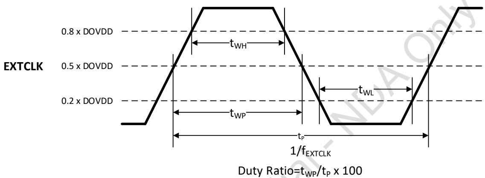

line

| Parameter | Value |
| --- | --- |
| Peak Voltage Level | 0.8 x DOVDD |
| Half-Peak Time | tWH |
| Half-Peak Duration | tWP |
| Pulse Width | tp |
| Duty Ratio | 1/fEXTCLK |

图 3-1 外部时钟（EXTCLK）波形图

# 4. 光学特性

# 4.1. QE 曲线

SC2336 QE 曲线如下图所示。

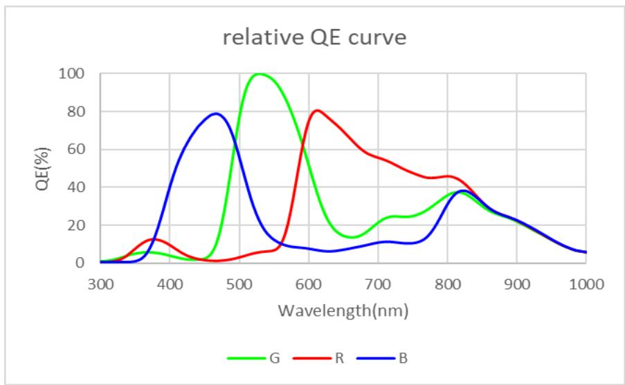

line

| Wavelength (nm) | G (%) | R (%) | B (%) |
| --- | --- | --- | --- |
| 300 | ~2 | ~1 | ~1 |
| 400 | ~5 | ~12 | ~65 |
| 500 | ~85 | ~5 | ~75 |
| 600 | ~45 | ~80 | ~10 |
| 700 | ~25 | ~55 | ~12 |
| 800 | ~35 | ~45 | ~35 |
| 900 | ~20 | ~20 | ~20 |
| 1000 | ~5 | ~5 | ~5 |

图 4-1 QE Curve

# 4.2. 主光线入射角（CRA）

SC2336 CRA 曲线如下图所示。

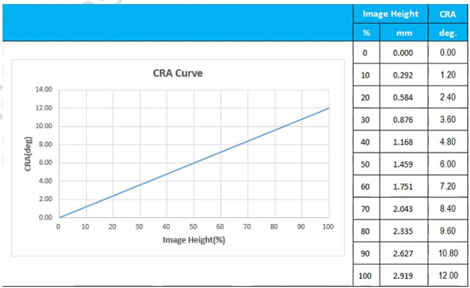

line

| Image Height(%) | CRA(deg) |
| --- | --- |
| 0 | 0.000 |
| 10 | 0.292 |
| 20 | 0.584 |
| 30 | 0.876 |
| 40 | 1.168 |
| 50 | 1.459 |
| 60 | 1.751 |
| 70 | 2.043 |
| 80 | 2.335 |
| 90 | 2.627 |
| 100 | 2.919 |

图 4-2 CRA Curve

# 5. 封装信息

SC2336 提供 35-pin CSP 的封装，封装尺寸图如下图所示。

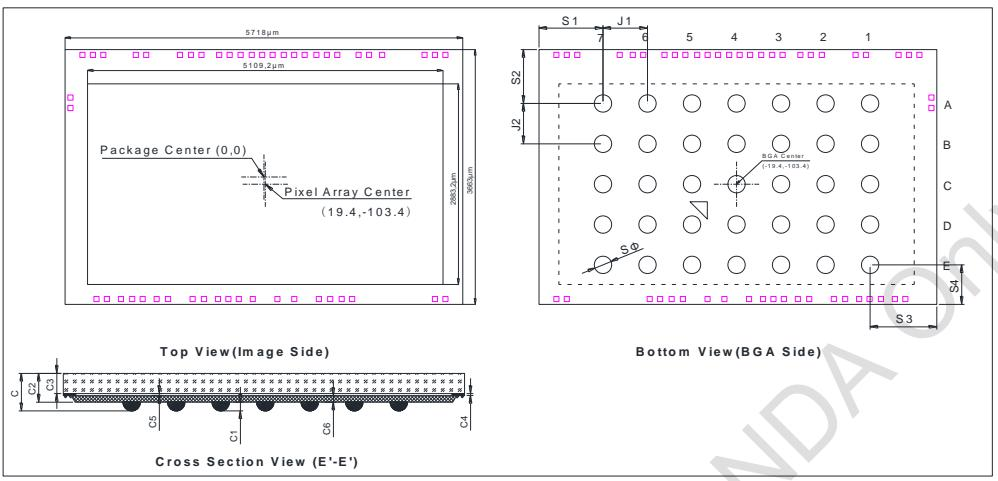

text_image

5718µm
5109.2µm
Package Center (0,0)
Pixel Array Center
(19.4,-103.4)
360µm
Top View(Image Side)
C2
C3
C5
C1
C6
C4
Cross Section View (E'-E')
S1 J1
7 6 5 4 3 2 1
S2
J2
RG-2 Center
(19.4,-103.4)
Sφ
Bottom View(BGA Side)
A
B
C
D
E
S4
S3

图 5-1 封装示意图

注：芯片的 Package Center (Chip Center)与 Array Center (Optical Center)不重合，BGA Center 与 Optical Center 重合。以 Chip Center 为（0, 0），BGA Center/Optical Center 均为（19.4, -103.4），单位为 μm。

表 5-1 封装尺寸表

<table><tr><td rowspan="2">Parameter</td><td rowspan="2">Symbol</td><td>Nominal</td><td>Min</td><td>Max</td><td>Nominal</td><td>Min</td><td>Max</td></tr><tr><td colspan="3">Millimeters</td><td colspan="3">Inches</td></tr><tr><td>Package Body Dimension X</td><td>A</td><td>5.7180</td><td>5.6930</td><td>5.7430</td><td>0.22512</td><td>0.22413</td><td>0.22610</td></tr><tr><td>Package Body Dimension Y</td><td>B</td><td>3.6630</td><td>3.6380</td><td>3.6880</td><td>0.14421</td><td>0.14323</td><td>0.14520</td></tr><tr><td>Package Height</td><td>C</td><td>0.6650</td><td>0.6100</td><td>0.7200</td><td>0.02618</td><td>0.02402</td><td>0.02835</td></tr><tr><td>Cavity wall height</td><td>C4</td><td>0.0410</td><td>0.0370</td><td>0.0450</td><td>0.00161</td><td>0.00146</td><td>0.00177</td></tr><tr><td>Cavity wall + epoxy thickness (glass to the wafer bonding top point)</td><td>C5</td><td>0.0435</td><td>0.0385</td><td>0.0485</td><td>0.00171</td><td>0.00152</td><td>0.00191</td></tr><tr><td>Si Thickness</td><td>C6</td><td>0.1500</td><td>0.1400</td><td>0.1600</td><td>0.00591</td><td>0.00551</td><td>0.00630</td></tr><tr><td>Glass Thickness</td><td>C3</td><td>0.3000</td><td>0.2900</td><td>0.3100</td><td>0.01181</td><td>0.01142</td><td>0.01220</td></tr><tr><td>Package Body Thickness</td><td>C2</td><td>0.5350</td><td>0.5000</td><td>0.5700</td><td>0.02106</td><td>0.01969</td><td>0.02244</td></tr><tr><td>Ball Height</td><td>C1</td><td>0.1300</td><td>0.1000</td><td>0.1600</td><td>0.00512</td><td>0.00394</td><td>0.00630</td></tr><tr><td>Ball Diameter</td><td>SΦ</td><td>0.2500</td><td>0.2200</td><td>0.2800</td><td>0.00984</td><td>0.00866</td><td>0.01102</td></tr><tr><td>Total Ball Count</td><td>N</td><td>34</td><td>-</td><td>-</td><td>-</td><td>-</td><td>-</td></tr><tr><td>Ball Count X axis</td><td>N1</td><td>7</td><td>-</td><td>-</td><td>-</td><td>-</td><td>-</td></tr><tr><td>Ball Count Y axis</td><td>N2</td><td>5</td><td>-</td><td>-</td><td>-</td><td>-</td><td>-</td></tr><tr><td>Pins Pitch X axis1</td><td>J1</td><td>0.6400</td><td>0.6300</td><td>0.6500</td><td>0.0252</td><td>0.02480</td><td>0.02559</td></tr><tr><td>Pins Pitch X axis2</td><td>J2</td><td>0.5800</td><td>0.5700</td><td>0.5900</td><td>0.02283</td><td>0.02244</td><td>0.02323</td></tr><tr><td>BGA ball center to package center offset in X-direction</td><td>X</td><td>0.0194</td><td>-0.0056</td><td>0.0444</td><td>0.00076</td><td>-0.00022</td><td>0.00175</td></tr><tr><td>BGA ball center to package center offset in Y-direction</td><td>Y</td><td>0.1034</td><td>0.0784</td><td>0.1284</td><td>0.00407</td><td>0.00309</td><td>0.00506</td></tr><tr><td>Edge to Ball Center Distance</td><td>S1</td><td>0.91960</td><td>0.88960</td><td>0.94960</td><td>0.03620</td><td>0.03502</td><td>0.03739</td></tr><tr><td>along X</td><td></td><td></td><td></td><td></td><td></td><td></td><td></td></tr><tr><td>Edge to Ball Center Distance along Y</td><td>S2</td><td>0.77490</td><td>0.74490</td><td>0.80490</td><td>0.03051</td><td>0.02933</td><td>0.03169</td></tr><tr><td>Edge to Ball Center Distance along X2</td><td>S3</td><td>0.95840</td><td>0.92840</td><td>0.98840</td><td>0.03773</td><td>0.03655</td><td>0.03891</td></tr><tr><td>Edge to Ball Center Distance along Y2</td><td>S4</td><td>0.56810</td><td>0.53810</td><td>0.59810</td><td>0.02237</td><td>0.02119</td><td>0.02355</td></tr></table>

# 6. 订购信息

表 6-1 订购信息表

<table><tr><td>产品编号</td><td>封装形式</td><td>描述</td></tr><tr><td>SC2336-CSBNN00</td><td>35-pin CSP</td><td>2.0 Megapixel, RAW/RGB, DVP/MIPI output</td></tr><tr><td>SC2336-CSBNF00</td><td>35-pin CSP</td><td>2.0 Megapixel, RAW/RGB, DVP/MIPI output</td></tr></table>

# 7. 版本变更记录

<table><tr><td>版本</td><td>修改内容以及说明</td><td>Owner and date</td></tr><tr><td>0.1</td><td>初始版本</td><td>Vicky Song/2021.4.23</td></tr><tr><td>0.2</td><td>· 增加灵敏度、动态范围、SNR 和 QE 曲线· 章节 4.2: 更新 CRA 角度为  $12^{\circ}$ · 章节 2.2.3: 表 2-3: 更新 Ana gain register</td><td>Vicky Song/2021.5.21</td></tr><tr><td>0.3</td><td>章节 2.2.3: 表 2-4: 更新 Ana gain register</td><td>Vicky Song/2021.7.14</td></tr><tr><td>0.4</td><td>更新像素尺寸</td><td>Vicky Song/2021.7.20</td></tr><tr><td>0.5</td><td>章节 2.2.2: 表 2-2: 更新最短曝光</td><td>Vicky Song/2021.8.18</td></tr><tr><td>0.6</td><td>第 3 章: 表 3-2: 更新工作电流典型值</td><td>Vicky Song/2021.8.30</td></tr><tr><td>0.7</td><td>第 6 章: 增加贴膜料号: SC2336-CSBNF00</td><td>Vicky Song/2021.9.13</td></tr></table>

# 联系我们：

总部：

地址：上海市徐汇区宜山路1009号11楼

电话：021-64853570

传真：021-64853572-8004

邮箱：sales@smartsenstech.com

网址：http://www.smartsenstech.com

美国分公司：

地址：4340 Stevens Creek Blvd. Suite 280, San Jose, CA 95129

电话：+1（408）981-6626

深圳分公司：

地址：深圳市龙岗区坂田街道五和大道南星河 WORLD B 座 2908

电话：0755-23739713

思特威技术支持邮箱：

support@smartsenstech.com