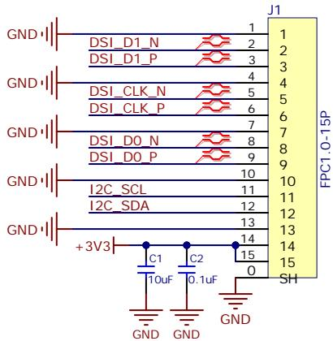
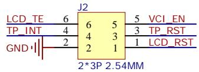
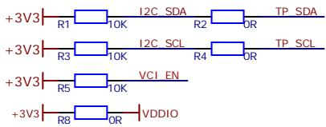
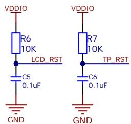
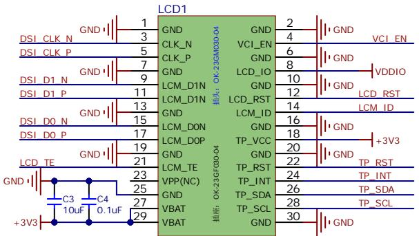
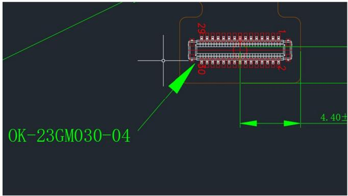

text_image

GND
DSI_D1_N
DSI_D1_P
GND
DSI_CLK_N
DSI_CLK_P
GND
DSI_D0_N
DSI_D0_P
GND
I2C_SCL
I2C_SDA
GND
+3V3
C1
10uF
C2
0.1uF
GND
J1
1
2
3
4
5
6
7
8
9
10
11
12
13
14
15
0
SH
FPC1.0-15P

text_image

LCD_TE 6 6 5 5 VCI_EN
TP_INT 4 4 3 3 TP_RST
GND|| 2 2 1 1 LCD_RST
2*3P 2.54MM

text_image

+3V3 R1 10K I2C SDA R2 OR TP SDA
+3V3 R3 10K I2C SCL R4 OR TP SCL
+3V3 R5 10K VCI EN
+3V3 R8 OR VDDIO

text_image

VDDIO
R6
10K
LCD_RST
C5
0.1uF
GND
VDDIO
R7
10K
TP_RST
C6
0.1uF
GND

text_image

LCD1
DSI_CLK_N GND 1
DSI_CLK_P GND 3
DSI_D1_N GND 5
DSI_D1_P GND 7
DSI_D0_N GND 9
DSI_D0_P GND 11
LCD_TE GND 13
+3V3 C3 C4 VPP(NC) 23
+3V3 C4 25
+3V3 C4 27
+3V3 C4 29
GND GND 2
CLK_N VCI_EN 4
CLK_P VCI_EN 6
GND LCD_IO 8
LCM_D1N GND 10
LCM_D1N LCD_RST 12
GND LCM_ID 14
LCM_DON GND 16
LCM_DOP TP_VCC 18
GND TP_RST 20
LCM_TE TP_INT 22
VPP(NC) TP_SDA 24
GND TP_SCL 26
VBAT TP_SCL 28
VBAT TP_SCL 30
GND GND VCDIO LCD_RST +3V3

AM319M262928HFL

text_image

29
50
1
2
4.40+
OK-23GM030-04

<table><tr><td colspan="2">PIN Difinition</td></tr><tr><td>NO.</td><td>SYMBOL</td></tr><tr><td>1</td><td>GND</td></tr><tr><td>2</td><td>GND</td></tr><tr><td>3</td><td>LCM_CLKN</td></tr><tr><td>4</td><td>VCI_EN(3.3V)</td></tr><tr><td>5</td><td>LCM_CLKP</td></tr><tr><td>6</td><td>GND</td></tr><tr><td>7</td><td>GND</td></tr><tr><td>8</td><td>LCD_IO(1.8V)</td></tr><tr><td>9</td><td>LCM_D1N (NC)</td></tr><tr><td>10</td><td>GND</td></tr><tr><td>11</td><td>LCM_D1P (NC)</td></tr><tr><td>12</td><td>LCD_RST</td></tr><tr><td>13</td><td>GND</td></tr><tr><td>14</td><td>LCM_ID(1.8V)</td></tr><tr><td>15</td><td>LCM_DON</td></tr><tr><td>16</td><td>GND</td></tr><tr><td>17</td><td>LCM_DOP</td></tr><tr><td>18</td><td>VCC_CTP(2.8V)</td></tr><tr><td>19</td><td>GND</td></tr><tr><td>20</td><td>GND</td></tr><tr><td>21</td><td>LCM_TE</td></tr><tr><td>22</td><td>CTP_RST(1.8V)</td></tr><tr><td>23</td><td>VPP (悬空)</td></tr><tr><td>24</td><td>CTP_INT(1.8V)</td></tr><tr><td>25</td><td>GND</td></tr><tr><td>26</td><td>TP_TWI2_SDA(1.8V)</td></tr><tr><td>27</td><td>VBAT (3.7V)</td></tr><tr><td>28</td><td>TP_TWI2_SCK(1.8V)</td></tr><tr><td>29</td><td>VBAT</td></tr><tr><td>30</td><td>GND</td></tr></table>

<table><tr><td rowspan="4"></td><td colspan="4">Sheet Title 3.19寸262x928 AMOLED</td></tr><tr><td colspan="4">Project Title 3.19寸262x928 AMOLED</td></tr><tr><td>Size A4</td><td>Ver. 1.0</td><td colspan="2">Author Ling</td></tr><tr><td colspan="2">Sheet 1 / 1</td><td colspan="2">Data 20251118</td></tr></table>

<table><tr><td>Comment</td><td>Description</td><td>Designator</td><td>Footprint</td><td>LibRef</td><td>Quantity</td></tr></table>