# Osptek Display

# AMOLED SPECIFICATION

Model No:

AM319M262928ZS

Revision History

<table><tr><td>Rev.</td><td>ECN No.</td><td>Description of Change</td><td>Date</td><td>Prepared</td></tr><tr><td>P0</td><td>-</td><td>-</td><td>2022.02.07</td><td></td></tr><tr><td>P1</td><td>-</td><td>更新取消 SCF</td><td>2022.03.03</td><td></td></tr><tr><td></td><td></td><td></td><td></td><td></td></tr><tr><td></td><td></td><td></td><td></td><td></td></tr></table>

text_image

osptek®

# Content

1. General Description....4  
2. Mechanical Specification....5  
3. Absolute Maximum Ratings....5  
4. Electrical Characteristics....6  
5. Electro-optical Characteristics 7  
6. FPC Pin Assignment 10  
7. AC Characteristics....11  
8. Recommended Operating Sequence....17  
9. Outline Information....19  
10. Code Information....21  
11. Reliability Test....22  
12. Handing Precautions......23

# 1. General Description

# 1-1. Introduction

OSP 3.19inch 262x928 is a color active matrix AMOLED module using Low Temperature Poly-silicon TFT's (Thin Film Transistors) as active switching devices. This module has a 3.19inch diagonally measured active area with 262x928 resolutions (262 horizontal by 928 vertical pixel arrays). Each pixel is divided into RED, GREEN, BLUE dots and this module can display 16.7M colors.

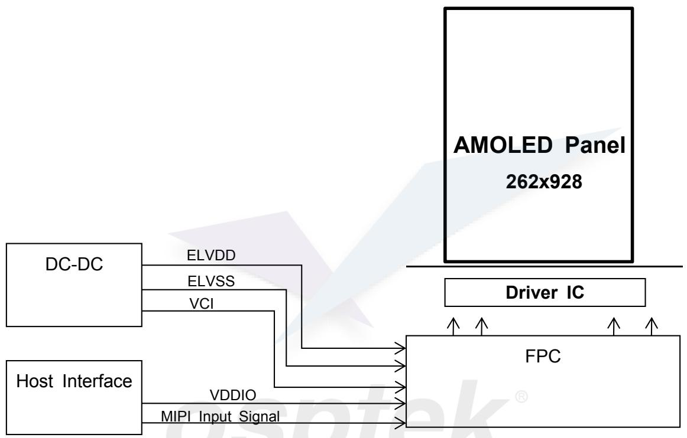

flowchart

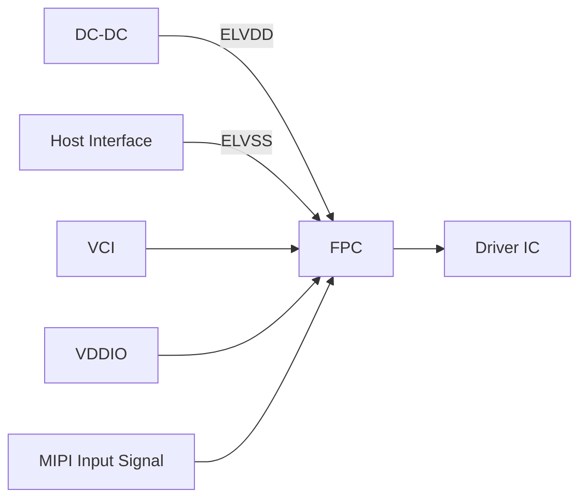

Figure 1

# 1-2. Features

1) Display Colors : 16.7M  
2) Display Format : 3.19" OLED 262×928  
3) MUX: source 1:6  
4) Interface : MIPI1-lane  
5) Driver IC : CO6300  
6) Touch IC: CST3530

# 1-3. Application

# 2. Mechanical Specification

Table 1

<table><tr><td>Item</td><td>Specifications</td><td>Unit</td><td>Remark</td></tr><tr><td>Panel outline</td><td>26.50(H)*82.45(V)</td><td>mm</td><td>Round</td></tr><tr><td>Number of dots</td><td>262 (H)RGB*928 (V)</td><td>Dots</td><td>Real RGB</td></tr><tr><td>Active area</td><td>22.008*77.952</td><td>mm</td><td>Radius</td></tr><tr><td>Diagonal Inch</td><td>3.189</td><td>Inch</td><td>Radius</td></tr><tr><td>Pixel pitch</td><td>84(H)*84(V)</td><td>μm</td><td></td></tr><tr><td>Pixel Arrangement</td><td>Real RGB</td><td>-</td><td>S-RGB</td></tr><tr><td>MDL outline</td><td>&lt;=108.15mm*57.65mm</td><td>-</td><td>Include COF bending dimension</td></tr><tr><td>Total Thickness</td><td>0.63</td><td>mm</td><td>POL~panel</td></tr><tr><td>View area</td><td>/</td><td>mm</td><td>No CG</td></tr><tr><td>Weight</td><td>3.06</td><td>g</td><td></td></tr></table>

# 3. Absolute Maximum Ratings

Table 2

<table><tr><td>Item</td><td>Symbol</td><td>Min.</td><td>Max.</td><td>Unit</td><td>Note</td></tr><tr><td>Module I/O Voltage</td><td>VDDIO</td><td>-0.3</td><td>5.5</td><td>V</td><td></td></tr><tr><td>Module Operation Voltage</td><td>VCI</td><td>-0.3</td><td>5.5</td><td>V</td><td></td></tr><tr><td>EL Driving Voltage</td><td>ELVDD</td><td>-0.3</td><td>5.5</td><td>V</td><td></td></tr><tr><td rowspan="2">Driver ICOperating temperature</td><td>ELVSS</td><td>-5.5</td><td>-0.3</td><td>V</td><td></td></tr><tr><td>Topr</td><td>-40</td><td>+85</td><td>°C</td><td></td></tr><tr><td>Driver IC Storage temperature</td><td>Tstg</td><td>-55</td><td>+125</td><td>°C</td><td></td></tr><tr><td>Touch power supply voltage</td><td>TP_1.8V</td><td>-</td><td>4.0</td><td>V</td><td></td></tr><tr><td>Touch Input voltage for I/O bus</td><td>-</td><td>-</td><td>4.0</td><td>V</td><td></td></tr><tr><td>Touch IC Storage temperature</td><td>Tstg</td><td>-40</td><td>+125</td><td>°C</td><td></td></tr><tr><td></td><td></td><td></td><td></td><td></td><td></td></tr><tr><td></td><td></td><td></td><td></td><td></td><td></td></tr><tr><td colspan="6"></td></tr></table>

# 4. Electrical Characteristics

# 4-1 Power Consumption of Display Panel

Test Condition: Temp=25±2°C

Table 3

<table><tr><td colspan="2">Item</td><td colspan="2">Symbol</td><td>Condition</td><td>Symbol</td><td>Min.</td><td>Typ.</td><td>Max.</td><td>Uni</td></tr><tr><td rowspan="2" colspan="2">ELVDD</td><td rowspan="2" colspan="2">ELVDD</td><td>Normal</td><td>-</td><td>3.25</td><td>3.3</td><td>3.35</td><td>V</td></tr><tr><td>Idle</td><td>-</td><td>3.25</td><td>3.3</td><td>3.35</td><td>V</td></tr><tr><td rowspan="2" colspan="2">ELVSS</td><td rowspan="2" colspan="2">ELVSS</td><td>Normal</td><td>-</td><td>-3.25</td><td>-3.3</td><td>-3.35</td><td>V</td></tr><tr><td>Idle</td><td>-</td><td>-3.25</td><td>-3.3</td><td>-3.35</td><td>V</td></tr><tr><td colspan="2">VBAT</td><td colspan="2">VBAT</td><td>-</td><td>-</td><td>2.9</td><td>3.7</td><td>5.0</td><td>V</td></tr><tr><td colspan="2">VDDIO</td><td colspan="2">Vddio</td><td>-</td><td>-</td><td>1.65</td><td>1.8</td><td>3.3</td><td>V</td></tr><tr><td rowspan="8">Power Consumption</td><td rowspan="4">Display on mode</td><td rowspan="4">IC</td><td rowspan="2">Vddio</td><td rowspan="4">100% Pixel On,500nits,60 Hz</td><td>Ivddio</td><td>-</td><td>5.1</td><td>-</td><td>mA</td></tr><tr><td>Pvddio</td><td>-</td><td>9.18</td><td>-</td><td>mW</td></tr><tr><td rowspan="2">VBAT</td><td>Ivbat</td><td>-</td><td>99.54</td><td>-</td><td>mA</td></tr><tr><td>Pvbat</td><td>-</td><td>368.28</td><td>-</td><td>mW</td></tr><tr><td rowspan="4">Idle mode</td><td rowspan="4">IC</td><td rowspan="2">Vddio</td><td rowspan="4">10% Pixel On,50nits, 15Hz</td><td>Ivddio</td><td>-</td><td>1.02</td><td>-</td><td>mA</td></tr><tr><td>Pvddio</td><td>-</td><td>1.836</td><td>-</td><td>mW</td></tr><tr><td rowspan="2">VBAT</td><td>Ivbat</td><td>-</td><td>10.27</td><td>-</td><td>mA</td></tr><tr><td>Pvbat</td><td>-</td><td>37.99</td><td>-</td><td>mW</td></tr><tr><td rowspan="2" colspan="2">Frame Rate</td><td rowspan="2" colspan="2"> $F_{frm}$ </td><td>-40°C~85°C</td><td rowspan="2"> $F_{frm}$ </td><td>55.2</td><td>60</td><td>64.8</td><td>Hz</td></tr><tr><td>25°C</td><td>58.2</td><td>60</td><td>61.8</td><td>Hz</td></tr></table>

text_image

osptek®

# 5. Electro-optical Characteristics

Table 4

<table><tr><td colspan="2">Item</td><td>Symbol</td><td>Temp</td><td>Condition</td><td>Min.</td><td>Typ.</td><td>Max.</td><td>Unit</td><td>Note</td></tr><tr><td colspan="3">Normal Mode Brightness</td><td>25°C</td><td>Normal (White pattern)</td><td>450</td><td>500</td><td>550</td><td> $cd/m^2$ </td><td rowspan="2">Center brightness</td></tr><tr><td colspan="3">High Brightness Mode Brightness</td><td>25°C</td><td>Normal (White pattern)</td><td>-</td><td>-</td><td>-</td><td> $cd/m^2$ </td></tr><tr><td colspan="3">Idle Mode Brightness</td><td>25°C</td><td>Normal (White pattern)</td><td>-</td><td>50</td><td>60</td><td> $cd/m^2$ </td><td></td></tr><tr><td colspan="3">Uniformity</td><td>25°C</td><td>Normal (White pattern)</td><td>80</td><td>85</td><td>-</td><td>%</td><td>(1)</td></tr><tr><td colspan="2">Contrast ratio</td><td>K</td><td>25°C</td><td> $\Phi=0^\circ, \theta=0^\circ$ </td><td>100000</td><td>-</td><td>-</td><td></td><td>(2)</td></tr><tr><td rowspan="8">Color of CIE coordinate</td><td rowspan="2">White</td><td>x</td><td rowspan="8">25°C</td><td rowspan="8"> $\Phi=0^\circ, \theta=0^\circ$ CIE1931</td><td>0.285</td><td>0.30</td><td>0.315</td><td>-</td><td rowspan="8">(3)</td></tr><tr><td>y</td><td>0.295</td><td>0.31</td><td>0.325</td><td>-</td></tr><tr><td rowspan="2">Red</td><td>x</td><td>0.65</td><td>0.68</td><td>0.71</td><td>-</td></tr><tr><td>y</td><td>0.29</td><td>0.32</td><td>0.35</td><td>-</td></tr><tr><td rowspan="2">Green</td><td>x</td><td>0.205</td><td>0.245</td><td>0.285</td><td>-</td></tr><tr><td>y</td><td>0.675</td><td>0.715</td><td>0.755</td><td>-</td></tr><tr><td rowspan="2">Blue</td><td>x</td><td>0.121</td><td>0.141</td><td>0.161</td><td>-</td></tr><tr><td>y</td><td>0.023</td><td>0.043</td><td>0.063</td><td>-</td></tr><tr><td colspan="3">Color Gamut</td><td>25°C</td><td>NTSC, CIE1931</td><td>95</td><td>100</td><td>-</td><td>%</td><td>(3)</td></tr><tr><td colspan="3">Viewing Angle</td><td>25°C</td><td>Up/Down/Right/Left CR ratio ≥10</td><td>80</td><td>85</td><td>-</td><td>°</td><td>(3)</td></tr><tr><td colspan="3">Color temp</td><td>25°C</td><td>-</td><td>7000</td><td>7500</td><td>8000</td><td>K</td><td></td></tr><tr><td colspan="3">Crosstalk</td><td>25°C</td><td>Background: gray127</td><td>-</td><td>-</td><td>3</td><td>%</td><td>(4)</td></tr><tr><td colspan="3">Color Shift(White)</td><td>25°C</td><td>30°</td><td>-</td><td>-®</td><td>5</td><td>JNCD</td><td>(5)</td></tr><tr><td colspan="3">Response time</td><td>25°C</td><td>-</td><td></td><td>2</td><td>3</td><td>ms</td><td>(6)</td></tr><tr><td colspan="3">Lifetime</td><td>25°C</td><td>350nit T95</td><td>300</td><td>-</td><td>-</td><td></td><td></td></tr><tr><td colspan="3">Gamma</td><td>25°C</td><td></td><td>2.0</td><td>2.2</td><td>2.4</td><td></td><td></td></tr><tr><td rowspan="2" colspan="3">Image Sticking</td><td rowspan="2">25°C</td><td>5x5 Chess box, 12h → G127</td><td>-</td><td>-</td><td>3</td><td>min</td><td>3min 后消失到L0.5水平,基本不可见</td></tr><tr><td>2x2 Chess box, 10s → G127</td><td>-</td><td>-</td><td>15</td><td>s</td><td></td></tr><tr><td colspan="3">Flicker</td><td>25°C</td><td>JEITA Method at 60Hz</td><td></td><td></td><td>-30</td><td>dB</td><td>@L255 灰阶</td></tr><tr><td colspan="10">(1) Uniformity Measuring Point</td></tr></table>

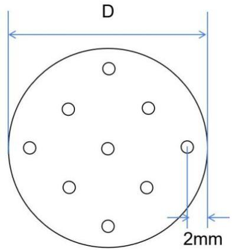

text_image

D
2mm

Figure 2
Uniformity=L min/L max \*100%

(2) Definition of contrast ratio(K)

$$
\mathrm{CR} = \frac {\text {Luminance When Display panel is at}" \text {White}" \text {state}}{\text {Luminance When Display panel is at}" \text {Black}" \text {state}}
$$

(3) Optical &viewing angle measuring system

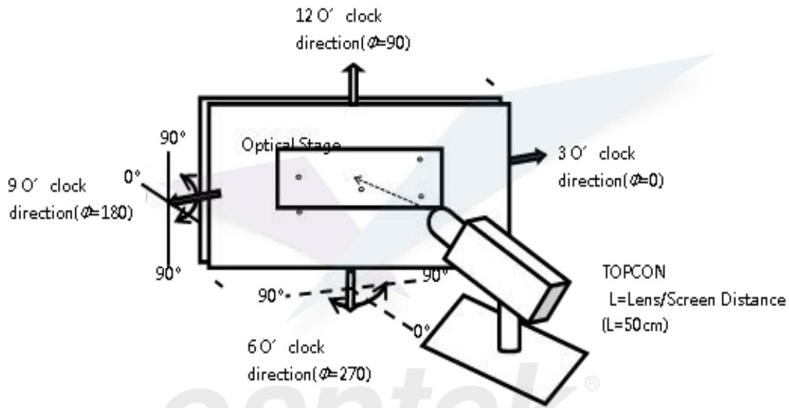

text_image

12 O' clock
direction(Φ=90)
Optical Stage
3 O' clock
direction(Φ=0)
9 O' clock
direction(Φ=180)
90°
90°
6 O' clock
direction(Φ=270)
TOPCON
L=Lens/Screen Distance
(L=50cm)

Figure 3. Viewing Angle measuring system

Definition of Color of CIE Coordinate and NTSC Ratio:

$$
S = \frac{\text{Area of RGB triangle}}{\text{Area of NTSC triangle}} * 100\%
$$

(4) Test crosstalk in dark room, use the pattern as figure 4.the center point of pattern ,and the background gray level is 127.

$$
\mathrm{LW} _ {\mathrm{OFF}} = \frac {L 1 + L 2 + L 3 + L 4}{4}
$$

$$
\mathrm{CT1} = \left| \frac {L W 1 - L W _ {O F F}}{L W _ {O F F}} \times 100 \% \right.
$$

$$
\mathrm{CT2} = \left| \frac {L W 2 - L W _ {O F F}}{L W _ {O F F}} \times 100 \% \right.
$$

$$
\mathrm{CT3} = \left| \frac {L W 3 - L W _ {O F F}}{L W _ {O F F}} \times 100 \% \right.
$$

$$
\mathrm{CT4} = \left| \frac {L W 4 - L W _ {O F F}}{L W _ {O F F}} \times 100 \% \right.
$$

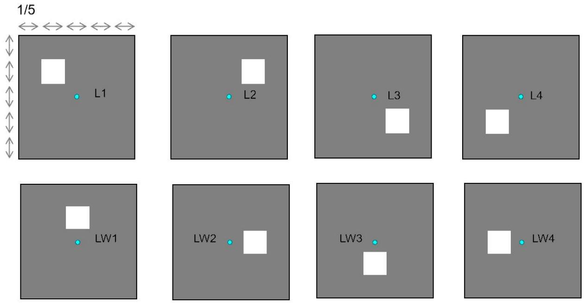

text_image

1/5
L1
L2
L3
L4
LW1
LW2
LW3
LW4

Figure 4. crosstalk measuring pattern

(5) Color Shift JNCD

For JNCD measure:

Fix on one pattern like white pattern,

On the condition $\theta=0\varnothing=0^{\circ}$ , we can get the color coordinate (u1', v1') and on $30^{\circ}$ we can get another color coordinate (u2', v2')

$$
\text {Delta} = \text {Square Root} \left(\left(u 2 ^ {\prime} - u 1 ^ {\prime}\right) ^ {\wedge} 2 + \left(v 2 ^ {\prime} - v 1 ^ {\prime}\right) ^ {\wedge} 2\right)
$$

JNCD stands for "Just Noticeable Color Difference"

For the (u', v') color space JNCD=0.0040.

2JNCD means Delta u', v'<0.0080

For color shift we need to measure white pattern

(6) The output signals of photo detector are measured when the input signals are changed from “black” to “white”(Voltage falling time) and from “white” to “black”(Voltage rising time), respectively. The response time is defined as the time interval between the 10% and 80% of amplitudes. Refer to figure as below:

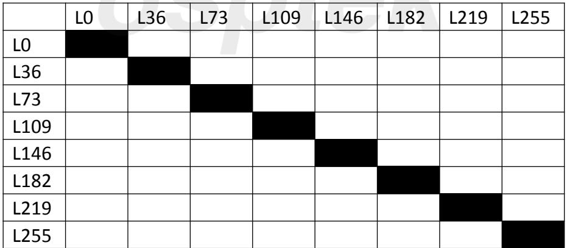

heatmap

| Category | L0 | L36 | L73 | L109 | L146 | L182 | L219 | L255 |
| --- | --- | --- | --- | --- | --- | --- | --- | --- |
| L0 | Yes | — | — | — | — | — | — | — |
| L36 | — | Yes | — | — | — | — | — | — |
| L73 | — | — | Yes | — | — | — | — | — |
| L109 | — | — | — | Yes | — | — | — | — |
| L146 | — | — | — | — | Yes | — | — | — |
| L182 | — | — | — | — | — | Yes | — | — |
| L219 | — | — | — | — | — | — | Yes | — |
| L255 | — | — | — | — | — | — | — | Yes |

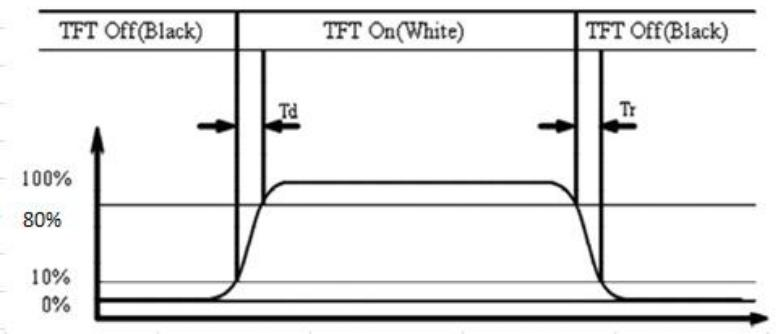

line

| Signal State | Description |
| --- | --- |
| TFT Off(Black) | Low state |
| TFT On(White) | High state |
| TFT Off(Black) | Low state |

Figure 5

# 6. FPC Pin Assignment

Main FPC assignment- AMOLED Panel Input/output Signal Interface.

Connector: Kyocera OK-23GM030-04

Table 5

<table><tr><td>PinNo.</td><td>Pin Name</td><td>Type</td><td>Descriptions</td></tr><tr><td>1</td><td>GND</td><td>P</td><td>Ground</td></tr><tr><td>2</td><td>GND</td><td>P</td><td>Ground</td></tr><tr><td>3</td><td>LCM_CLKN</td><td>I/O</td><td>MIPI strobe negative signal</td></tr><tr><td>4</td><td>VCI_EN</td><td>I</td><td>Active high enable input pin for VCI</td></tr><tr><td>5</td><td>LCM_CLKP</td><td>I/O</td><td>MIPI strobe positive signal</td></tr><tr><td>6</td><td>GND</td><td>P</td><td>Ground</td></tr><tr><td>7</td><td>GND</td><td>P</td><td>Ground</td></tr><tr><td>8</td><td>LCD_IO(1.8V)</td><td>P</td><td>DIC Logic 1.8V</td></tr><tr><td>9</td><td>LCM_D1N</td><td>/</td><td>NC</td></tr><tr><td>10</td><td>GND</td><td>P</td><td>Ground</td></tr><tr><td>11</td><td>LCM_D1P</td><td>/</td><td>NC</td></tr><tr><td>12</td><td>LCD_RST</td><td>I</td><td>OLED Device reset signal (0 : enable ; 1 : Disable)</td></tr><tr><td>13</td><td>GND</td><td>P</td><td>Ground</td></tr><tr><td>14</td><td>LCM_ID</td><td>/</td><td>ID</td></tr><tr><td>15</td><td>LCM_D0N</td><td>I/O</td><td>MIPI data 1 negative signal</td></tr><tr><td>16</td><td>GND</td><td>P</td><td>Ground</td></tr><tr><td>17</td><td>LCM_D0P</td><td>I/O</td><td>MIPI data 1 positive signal</td></tr><tr><td>18</td><td>VCC_CTP</td><td>P</td><td>TP Power 2.8V</td></tr><tr><td>19</td><td>GND</td><td>P</td><td>Ground</td></tr><tr><td>20</td><td>GND</td><td>P</td><td>Ground</td></tr><tr><td>21</td><td>LCM_TE</td><td>O</td><td>Synchronous signal output from panel to avoid tearing effect</td></tr><tr><td>22</td><td>CTP_RST</td><td>I</td><td>TP reset signal</td></tr><tr><td>23</td><td>VPP</td><td>P</td><td>MTP OLED</td></tr><tr><td>24</td><td>CTP_INT</td><td>I</td><td>TP INT signal</td></tr><tr><td>25</td><td>GND</td><td>P</td><td>Ground</td></tr><tr><td>26</td><td>TP_TWI2_SDA</td><td>I/O</td><td>TP I2C data.</td></tr><tr><td>27</td><td>VBAT</td><td>P</td><td>PMIC input power</td></tr><tr><td>28</td><td>TP_TWI2_SCK</td><td>I</td><td>TP I2C clock.</td></tr><tr><td>29</td><td>VBAT</td><td>P</td><td>PMIC input power</td></tr><tr><td>30</td><td>GND</td><td>P</td><td>Ground</td></tr></table>

<Pin layout of B-to-B contact pads>

# 7. AC Characteristics (For reference only)

# 7-1-1. DC Characteristics for MIPI DSI

Table 6

<table><tr><td>Signal</td><td>Symbol</td><td>Parameter</td><td>Min.</td><td>Typ.</td><td>Max.</td><td>Unit</td><td>Note</td></tr><tr><td rowspan="6">HS_RX</td><td> $V_{\text{IDTH}}$ </td><td>Differential input high threshold</td><td></td><td></td><td>70</td><td rowspan="5">mV</td><td>-</td></tr><tr><td> $V_{\text{IDTL}}$ </td><td>Differential input low threshold</td><td>-70</td><td></td><td></td><td>-</td></tr><tr><td> $V_{\text{IHHS}}$ </td><td>Single-ended input high voltage</td><td></td><td></td><td>460</td><td>1</td></tr><tr><td> $V_{\text{ILHS}}$ </td><td>Single-ended input low voltage</td><td>-40</td><td></td><td></td><td>1</td></tr><tr><td> $V_{\text{CMRX(DC)}}$ </td><td>Common-mode voltage HS receive mode</td><td>70</td><td></td><td>330</td><td>1-2</td></tr><tr><td> $Z_{\text{ID}}$ </td><td>Differential input impedance</td><td>80</td><td>100</td><td>125</td><td>Ω</td><td>-</td></tr><tr><td rowspan="3">LP_RX</td><td> $V_{\text{IL}}$ </td><td>Logic0 voltage not in ULP State</td><td>0</td><td></td><td>550</td><td>mV</td><td></td></tr><tr><td> $V_{\text{IH}}$ </td><td>Logic1 input voltage</td><td>880</td><td></td><td>1350</td><td>mV</td><td></td></tr><tr><td> $V_{\text{LEAK}}$ </td><td>I/O leakage current</td><td></td><td></td><td></td><td></td><td></td></tr><tr><td rowspan="3">LP_TX</td><td> $V_{\text{OL}}$ </td><td>The venin output low level</td><td>-50</td><td></td><td>50</td><td>mV</td><td></td></tr><tr><td> $V_{\text{OH}}$ </td><td>The venin output high level</td><td>1.1</td><td>1.2</td><td>1.3</td><td>V</td><td></td></tr><tr><td> $Z_{\text{OLP}}$ </td><td>Output impedance of LP transmitter</td><td></td><td></td><td></td><td></td><td></td></tr></table>

# Notes:

1、Excluding possible additional RF interference of 100mV peak sine wave beyond 450MHz.  
2、This table value includes a ground difference of 50mV between the transmitter and the receiver, the static common-mode level tolerance and variations below 450MHz.

# 7-1-2. MIPI DSI High-Speed RX Clock and Data-Clock Timing

Table 7

<table><tr><td>Symbol</td><td>Parameter</td><td>Min.</td><td>Typ.</td><td>Max.</td><td>Unit</td><td>Notes</td></tr><tr><td> $T_{SKEW[TX]}$ </td><td>Data to Clock Skew</td><td>-0.15</td><td></td><td>0.15</td><td> $UI_{INST}$ </td><td>1</td></tr><tr><td> $T_{SETUP}$ </td><td>Data to Clock Setup time</td><td>0.15</td><td></td><td></td><td> $UI_{INST}$ </td><td>2</td></tr><tr><td> $T_{HOLD}$ </td><td>Data to Clock Hold time</td><td>0.15</td><td></td><td></td><td> $UI_{INST}$ </td><td>2</td></tr><tr><td> $UI_{INST}$ </td><td>UI instantaneous</td><td>1.818</td><td></td><td>12.5</td><td>ns</td><td>3-4</td></tr></table>

# Notes:

1、Total silicon and package delay budget of 0.3\*UIINST.  
2、Total setup and hold window for receiver of 0.3\*UIINST.  
3、This value corresponds to a minimum 80 Mbps data rate.  
4、The minimum UI shall not be violated for any single bit period, i.e., any DDR half cycle within a data burst.

# 7-1-3. Timing Parameters:

Table 8

<table><tr><td rowspan="2">Parameter</td><td rowspan="2">Description</td><td colspan="3">Spec.</td><td>Unit</td></tr><tr><td>Min.</td><td>Typ.</td><td>Max.</td><td></td></tr><tr><td> $T_{CLK-POST}$ </td><td>Time that the transmitter continues to send HS clock after the last associated Data Lane has transitioned to LP Mode.Interval is defined as the period from the end of  $T_{HS-TRAIL}$  to beginning of  $T_{CLK-TRAIL}$ </td><td>60ns + 52*UI</td><td></td><td></td><td></td></tr><tr><td> $T_{CLK-PRE}$ </td><td>Time that the HS clock shall be driver by the transmitter prior to any associated Data Lane beginning the transition from LP to HS mode.</td><td>8</td><td></td><td></td><td>UI</td></tr><tr><td> $T_{CLK-PREPARE}$ </td><td>Time that the transmitter drives the Clock Lane LP-00 Line state immediately before the HS-00 Line state starting the HS transmission.</td><td>38</td><td></td><td>95</td><td>ns</td></tr><tr><td> $T_{CLK-TERM-EN}$ </td><td>Time for the Clock Lane receiver to enable the HS line termination, starting from the time point when Dn crosses  $V_{ILMAX}$ .</td><td>Time for Dn to reach  $V_{TERM-EN}$ </td><td></td><td>38</td><td>ns</td></tr><tr><td> $T_{CLK-TRAL}$ </td><td>Time that the transmitter drives the HS-00 state after the last payload clock bit of a HS HS transmission burst.</td><td>60</td><td></td><td></td><td>ns</td></tr><tr><td> $T_{CLK-PREPARE} + T_{CLK-ZERO}$ </td><td> $T_{CLK-PREPARE} + Time to that the transmitter drives the HS-00 state prior to starting the clock.$ </td><td>300</td><td></td><td></td><td>ns</td></tr><tr><td>\(T_{HS-EXIT}</td><td>Time that the transmitter drives LP-11 following HS burst.</td><td>300</td><td></td><td></td><td>ns</td></tr><tr><td> $T_{HS-TRAIL}$ </td><td>Time that the transmitter drives the flipped differential state after last payload data bit of a HS transmission burst</td><td>60ns + 4*UI</td><td></td><td></td><td>ns</td></tr><tr><td> $T_{HS-PREPARE} + T_{HS-ZERO}$ </td><td> $T_{HS-PREPARE} + time that the transmitter drives the HS-0 state prior to transmitting the Sync sequence.$ </td><td>145ns+10*UI</td><td></td><td></td><td>ns</td></tr><tr><td>\( T_{HS-PREPARE}</td><td>Time that the transmitter drives the Data Lane LP-00 Line state immediately before the HS-0 Line state starting the HS transmission</td><td>40ns+4*UI</td><td></td><td>85ns+6*UI</td><td>ns</td></tr><tr><td> $T_{D-TERM-EN}$ </td><td>Time for the Data Lane receiver to enable the HS line termination, starting from the time point when Dn crosses  $V_{IL,MAX}$ .</td><td>Time for Dn to reach  $V_{TERM-EN}$ </td><td></td><td>35ns+4*UI</td><td>ns</td></tr></table>

# 7-3-1. Touch Panel I2C Timing Characteristics

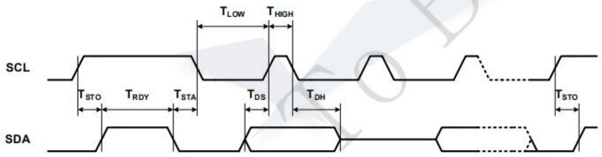

text_image

SCL
TLOW THIGH
TSTO TRDY TSTA
TDS TDH
SDA
TSTO

Figure 6

Table 9

<table><tr><td rowspan="2">SYMBOL</td><td rowspan="2">PARAMETER</td><td colspan="2">FAST-MODE</td><td colspan="2">HS-MODE</td><td rowspan="2">UNIT</td></tr><tr><td>MIN</td><td>MAX</td><td>MIN</td><td>MAX</td></tr><tr><td> $F_{SCL}$ </td><td>SCL clock frequency</td><td>0</td><td>400</td><td>0</td><td>1000</td><td>KHz</td></tr><tr><td> $T_{LOW}$ </td><td>LOW period of SCL</td><td>1300</td><td>-</td><td>500</td><td>-</td><td>ns</td></tr><tr><td> $T_{HIGH}$ </td><td>HIGH period of SCL</td><td>600</td><td>-</td><td>260</td><td>-</td><td>ns</td></tr><tr><td> $T_{STA}$ </td><td>Hold time for START condition</td><td>600</td><td>-</td><td>260</td><td>-</td><td>ns</td></tr><tr><td> $T_{STO}$ </td><td>Setup time for STOP condition</td><td>600</td><td>-</td><td>260</td><td>-</td><td>ns</td></tr><tr><td> $T_{DH}$ </td><td>Data hold time</td><td>0</td><td>900</td><td>0</td><td>900</td><td>ns</td></tr><tr><td> $T_{DS}$ </td><td>Data set-up time</td><td>100</td><td>-</td><td>50</td><td>-</td><td>ns</td></tr><tr><td> $T_{rC}$ </td><td>Rise time of SCL</td><td>20</td><td>300</td><td>20</td><td>120</td><td>ns</td></tr><tr><td> $T_{fC}$ </td><td>Fall time of SCL</td><td>20</td><td>300</td><td>20</td><td>120</td><td>ns</td></tr><tr><td> $T_{rD}$ </td><td>Rise Time of SDA</td><td>20</td><td>300</td><td>20</td><td>120</td><td>ns</td></tr><tr><td> $T_{fD}$ </td><td>Fall time of SDA</td><td>20</td><td>300</td><td>20</td><td>120</td><td>ns</td></tr><tr><td> $T_{RDY}$ </td><td>Ready time between STOP and START condition</td><td>20</td><td>-</td><td>20</td><td>-</td><td>us</td></tr></table>

# 7-3-2. Touch Specification

Table 10

<table><tr><td>No.</td><td colspan="2">ITEM</td><td>SPEC</td><td>REMARK</td></tr><tr><td>1</td><td colspan="2">Touch IC</td><td>ZT2628</td><td>Zinitix</td></tr><tr><td>2</td><td colspan="2">Communication Protocol to Host</td><td>I2C</td><td>≤400KHz</td></tr><tr><td>3</td><td colspan="2">Multi-Finger</td><td>Yes</td><td>/</td></tr><tr><td>4</td><td colspan="2">I2C Address</td><td>/</td><td></td></tr><tr><td>5</td><td colspan="2">Touch Origination Dot</td><td>COF 对侧左上角</td><td></td></tr><tr><td rowspan="4">6</td><td rowspan="4">Performance</td><td>Accuracy(Φ7mm)</td><td>Edge area&lt;1.5mmCenter area&lt;1.0mm</td><td></td></tr><tr><td>Linearity(Φ7mm)</td><td>Edge area&lt;1.5mmCenter area&lt;1.0mm</td><td></td></tr><tr><td>Jitter (Φ7mm)</td><td>&lt;1.5mm</td><td></td></tr><tr><td>Move Sensitivity</td><td>Φ4,5,6,7mm, 20mm/s</td><td>Continuous line</td></tr><tr><td>7</td><td colspan="2">Structure</td><td>On-Cell MLOC</td><td></td></tr><tr><td>8</td><td colspan="2">Sensor Pitch</td><td>4.4336×4.3396</td><td>Unit: mm</td></tr><tr><td>9</td><td colspan="2">Connector type /No.</td><td>/</td><td>NO connector</td></tr><tr><td>10</td><td colspan="2">Low Temperature</td><td>-20°C</td><td>Operating test</td></tr><tr><td>11</td><td colspan="2">Obvious ITO etching pattern</td><td>NO</td><td></td></tr></table>

Note (1): Accuracy is determined by a comparison of the actual copper position and the reported position when the copper touch on the surface of touch.  
1. Test Condition : Handset is on the insulated table.  
2. Measurement equipment: Arm of robot with 7mm diameter copper.  
3. Test procedure: Test touch panel with 7\*9 points, each point 10 time.  
4. The Accuracy is calculated by using following formula:  
Calculate every distance from reported position to actual position (Each point contains 10 reported position dates)  
Accuracy Error = square root [(xi - x0)2 + (yi - y0)2] (i-1,2...10)

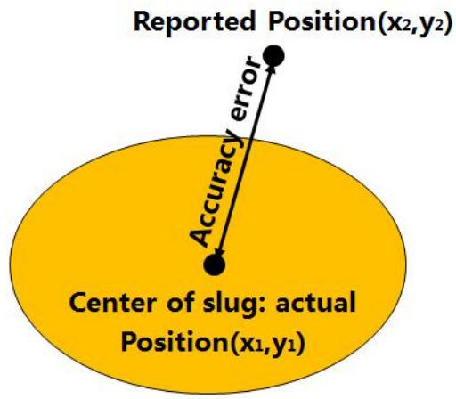

text_image

Reported Position(x2,y2)
Accuracy error
Center of slug: actual
Position(x1,y1)

Figure 7

Note (2): Linearity is defined as the difference between reported finger positions versus the least square fitted line as the finger moves linearly across a specified trajectory of the Display panel area.

1. Test Condition : Handset is on the insulated table.  
2. Measurement equipment: Arm of robot  
3. Test procedure: Draw 8 line with 30mm/s by 7mm copper.  
4. The Precision is calculated by using following formula:

Calculate the max $\triangle E$ for each line

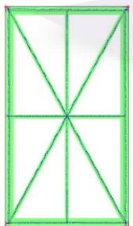

natural_image

Geometric diagram of a square divided into eight equal quadrants by diagonals (no text or symbols)

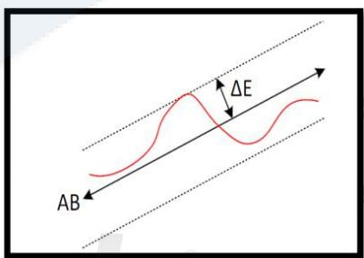

text_image

ΔE
AB

Figure 8

Note (3): Point sensitivity is determined by the minimum size finger that touch panel can detect. When the minimum size finger touch on the surface of touch, the touch can report to host exactly.

1. Test Condition : Handset is on the insulated table.  
2. Measurement equipment: Arm of robot with 6mm diameter copper.  
3. Test procedure: Test touch panel with 7\*9 points, each point 10 times  
4. The point sensitivity is calculated by using following formula:

Report Rate = Reported points/280\*100%

Note (4): Move sensitivity is determined by the minimum size finger that touch panel can detect. When the minimum size finger draw on the surface of touch, the touch can report to host exactly.

1. Test Condition : Handset is on the insulated table.

2. Measurement equipment: Arm of robot  
3. Test procedure: Draw 8 line with 30mm/s by 6mm copper  
Standard: No missing point.

Note (5): Jitter is defined as the deltas of reported positions when a conductive copper is in stationary contact with the sensor cover lens. A total of hundred sequential samples are collected with each stationary contact of the Copper with the sensor cover lens.

1. Test Condition : Handset is on the insulated table.  
2. Measurement equipment: Arm of robot with 6mm diameter copper.  
3. Test procedure: Test 8 points in the touch for 1s  
4. The Precision is calculated by using following formula:

Then we will get the result like below (Take point 1 as the example)

(1). calculate distance from each reported position to the rest of points
Distance Error = square root [(xi - Xj)2 + (yi - yj)2] (i=1,2.....120,j=1,2...120)  
(2). Select the maximum distance error from one to each one jitter 1= max(error 1,error 2....error 120)  
(3). Repeat 1 to 2 for the other 7 point as the jitter value  
(4). Select the maximum value as our test result jitter= max (jitter1 ,jitter 2......jitter 8)

Note (6): Anti-water:

The presence of moisture on the surface of touch can affect touch performance. Performance will vary based on the amount of moisture and its properties. In the test we will define the basic requirement in the document.

# Method:

Drop: Size : ∅10 mm diameter drop,4 drops

Spray size: 3ml once

Procedure:

# Test 1-drop test:

Step 1: Make 4 drops water on the surface of touch, each drop with 10mm diameter.  
Step 2: Test the area (without water area) handwork, and test it again after wiped off water  
Step 3: Observe whether the water area report ghost finger

# 8. Recommended Operating Sequence

# 8-1. Display Power on/off Sequence

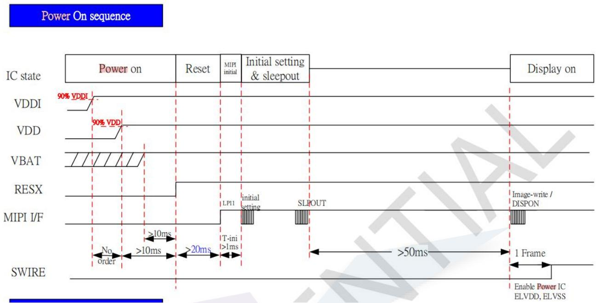

flowchart

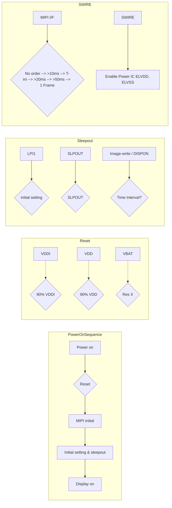

Figure 9 Power On Sequence

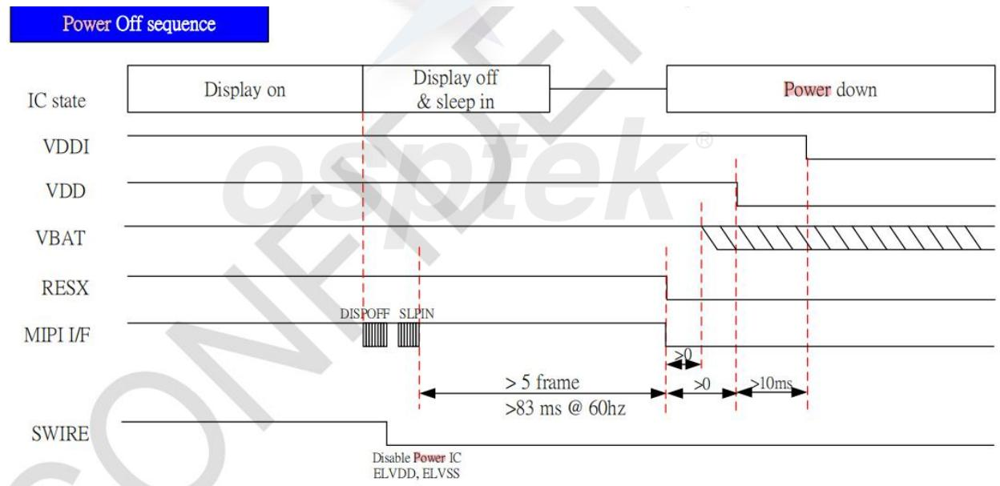

text_image

Power Off sequence
Display on	Display off & sleep in	Power down
IC state
VDDI
VDD
VBAT
RESX
MIPI I/F	DISPOFF SLPIN	>0	>0	>10ms
	>5 frame	>0	>83 ms @ 60hz
SWIRE	Disable Power IC
	ELVDD, ELVSS

Figure 10 Power Off Sequence

# 8-2. Touch Panel Power on Sequence

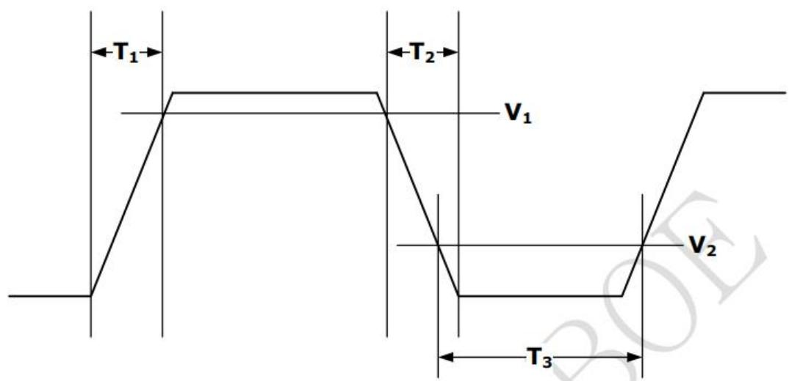

text_image

T₁
V₁
T₂
V₂
T₃

<table><tr><td>SYMBOL</td><td>PARAMETER</td><td>MIN</td><td>MAX</td><td>UNIT</td></tr><tr><td> $T_1$ </td><td>Power-on time</td><td>-</td><td>10ms@ $V_1$ =2.5V</td><td>ms</td></tr><tr><td> $T_2$ </td><td>Power-off time</td><td>-</td><td>10ms@ $V_2$ =0.3V</td><td>ms</td></tr><tr><td> $T_3$ </td><td>From power-off to power-on time</td><td>20</td><td>-</td><td>ms</td></tr></table>

Figure 11

# 9. Outline Information

# 9-1. Total Outline

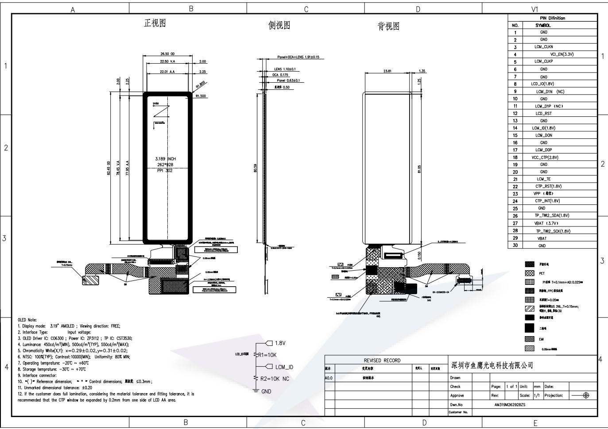

text_image

A	B	C	D	V1
正视图	侧视图	背视图
26.50 00	2.00
22.50 V.A	2.00
22.01 A.A	2.25
R1.500
2.00
2.25
R1.500
3.189 NCH
262*928
PPI 302
82.45 00
78.45 V.A
77.95 A.A
LENS 1.10±0.1
GCA 0.175
Panel 0.63±0.1
背视图
23.81	1.35
R1.05
R5.59
LCD_IIA
LCD_IIIA
LCD_IVA
LCD_IIIB
LCD_IVC
LCD_IIID
LCD_IVE
LCD_IIIF
LCD_IVG
LCD_IIIH
LCD_IVI
LCD_IIIJ
LCD_IVK
LCD_IIIL
LCD_IVM
LCD_IVN
LCD_IVO
LCD_IVP
LCD_IVQ
LCD_IVR
LCD_IVS
LCD_IVT
LCD_IVU
LCD_IVV
LCD_IVW
LCD_IVX
LCD_IVY
LCD_IVZ
LCD_IVW
LCD_IVX
LCD_IVY
LCD_IVZ
LCD_IVW
LCD_IVU
LCD_IVV
LCD_IVW
LCD_IVX
LCD_IVY
LCD_IVZ
LCD_IVW
LCD_IVU
LCD_IVV
LCD_IVW
LCD_IVX
LCD_IVY
LCD_IVZ
LCD_IVW
LCD_IVU
LCD_IVV
LCD_IVW
LCD_IVX
LCD_IVY
LCD_IVZ
LCD_IVW
LCD_IVUX
LCD_IVWY
LCD_IVYW
LCD_IVZW
LCD_IVWY
LCD_IVYWY
LCD_IVZWY
LCD_IVWYWY
LCD_IVZWYWYWYWYWYWYWYWYWYWYWYWYWYWYWYWYWYWYWYWYWYWYWYWYWYWYWYWYWYWYWYWYWYWYWYWYWYWYWYWYWYWYWYWYWYWYWYWYWYWYWYE
PIN Definition
NO.
SYMBOL
1.
GND
2.
GND
3.
LCM_CLKN
4.
VCI_EN(3.3V)
5.
LCM_CLKP
6.
GND
7.
GND
8.
LCD_ID(1.8V)
9.
LCM_D1N (NC)
10.
GND
11.
LCM_DIP (NC)
12.
LCD_RST
13.
GND
14.
LCM_ID(1.8V)
15.
LCM_DON
16.
GND
17.
LCM_DOP
18.
VCC_CTP(2.8V)
19.
GND
20.
GND
21.
LCM_TE
22.
CTP_RST(1.8V)
23.
VPP (最小值)
24.
CTP_INT(1.8V)
25.
GND
26.
TP_TW2_SDA(1.8V)
27.
VBAT (-3.7V)
28.
TP_TW2_SCK(1.8V)
29.
VBAT
30.
GND
2 OLED Note:
1. Display mode: 3.19" AMOLED ; Viewing direction: FREE;
2. Interface Type: Input voltage;
3. OLED Driver IC: CO6300 ; Power IC: ZP3112 ; TP IC: CST3530;
4. Luminance: 450cd/m²(MIN), 500cd/m²(TYP), 550cd/m²(MAX);
5. Chromaticity White(X,Y): x=0.29±0.02,y=0.31±0.02;
6. NTSC: 100% (TYP); Contrast: 10000(MIN); Uniformity: 80% MIN;
7. Operating temperature: -20℃ ~ +60℃;
8. Storage temperature: -30℃ ~ +70℃;
9. Interface connector:
10. = (*) Reference dimension; ** Control dimensions; 离合度 ≤0.3mm;
11. Unmarked dimensional tolerance: ±0.20;
12. If the customer does full lamination, considering the material tolerance and fitting tolerance, it is recommended that the CTP window be expanded by 0.2mm from one side of LCD AA area.
B	C	D	E
REVISED RECORD	深圳市鱼鹰光电科技有限公司
流水	变更内容	变更人	变更日期
A0.0	拆除流水			Drawn			
Check			Page:	1 of 1 Unit:	mm Dates:	
Approve			Rev		Scale:	/1/ Projection:	-
Den.No	AM319M4262928ZS	
Customer No.																																																																																																				 parties:			<xcel><xcel><xcel><xcel><xcel><xcel><xcel><xcel><xcel><xcel><xcel><xcel><xcel><xcel><xcel><xcel><xcel><xcel><xcel><xcel><xcel><xcel><xcel><xcel><xcel><xcel><xcel><xcel><xcel><xcel><xcel><xcel><xcel><xcel><xcel><xcel><xcel><xcel><xcel><xcel><xcel><xcel><xcel><xcel><xcel><xcel><xcel><xcel><xcel><xcel><xcel><xcel><xcel><xcel><xcel><xcel><xcel><xcel><xcel><xcel><xcel><xcel><xcel><xcel><xcel><xcel><xcel><xcel><xcel><xcel><xcel><xcel><xcel><xcel><xcel><xcel><xcel><xcel><xcel><xcel><xcel><xcel><xcel><xcel><xcel><xcel><xcel><xcel><xcel><xcel><xcel><xcel><xcel><xcel><xcel><xcel><xcel><xcel><xcel><xcel><lcel><lcel><lcel><lcel><lcel><lcel><lcel><lcel><lcel><lcel><lcel><lcel><lcel><lcel><lcel><lcel><lcel><lcel><lcel><lcel><lcel><lcel><lcel><lcel><lcel><lcel><lcel><lcel><lcel><lcel><lcel><lcel><lcel><lcel><lcel><lcel><lcel><lcel><lcel><lcel><lcel><lcel><lcel><lcel><lcel><lcel><lcel><lcel><lcel><lcel><lcel><lcel><lcel><nl>

Figure 12

# 9-2. Main FPCB &TSP FPCB Drawing

# 9-2-1.Main FPC & TSP FPC Schematic Diagram

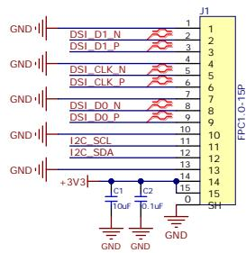

text_image

GND
DSI_D1_N
DSI_D1_P
DSI_CLK_N
DSI_CLK_P
DSI_D0_N
DSI_D0_P
+3V3
I2C_SCL
I2C_SDA
C1
TouF
C2
0.1uF
GND
GND
J1
1
2
3
4
5
6
7
8
9
10
11
12
13
14
15
16
3H
FPC1.0-15P

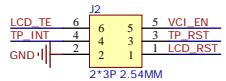

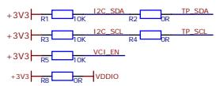

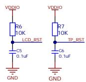

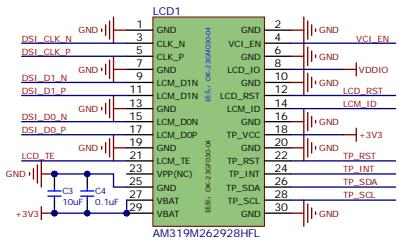

text_image

LCD1
DSI_CLK_N GND 1 GND
DSI_CLK_P GND 3 CLK_N VCI_EN
DSI_D1_N GND 7 CLK_P VCD_IG VDDIO
DSI_D1_P GND 9 LCM_ID
DSI_D0_N GND 11 LCM_ID
DSI_D0_P GND 13 LCM_ID
LCD_TE GND 15 LCM_ID
GND 17 LCM_ID
LCDD_CDEP GND 19 TP_VCC +3V3
LCD_TE 21 TP_VCC
VPP(NC) GND 23 TP_INT
C4 C5 C6 TP_SDA
+3V2 10uF 0.1uF
VBAT 27 TP_SCL
VBAT 29 TP_SCL
GND 2
4 VCI_EN
6 VVDIO
8 LCD_ID
10 LCD_RST
12 LCD_ID
14 LCM_ID
16 TP_VCC
18 TP_RST
20 TP_INT
22 TP_SDA
26 TP_SCL
28 TP_SCL
30 GND
GND
GND
GND
GND
GND
GND
GND
GND
GND
GND
GND
GND
GND
GND
GND
GND
GND
GND
GND

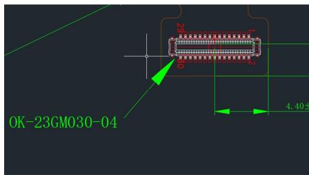

text_image

25
30
1
2
4.40

<table><tr><td colspan="2">PIN Definition</td></tr><tr><td>NO.</td><td>SYMEOL</td></tr><tr><td>1</td><td>GND</td></tr><tr><td>2</td><td>GND</td></tr><tr><td>3</td><td>LCM_CLKN</td></tr><tr><td>4</td><td>VCI_EN(3.8V)</td></tr><tr><td>5</td><td>LCM_CLKP</td></tr><tr><td>6</td><td>GND</td></tr><tr><td>7</td><td>GND</td></tr><tr><td>8</td><td>LCD_IO(1.8V)</td></tr><tr><td>9</td><td>LCM_D1N (NC)</td></tr><tr><td>10</td><td>GND</td></tr><tr><td>11</td><td>LCM_D1P (NC)</td></tr><tr><td>12</td><td>LCD_RST</td></tr><tr><td>13</td><td>GND</td></tr><tr><td>14</td><td>LCM_ID(1.8V)</td></tr><tr><td>15</td><td>LCM_DON</td></tr><tr><td>16</td><td>GND</td></tr><tr><td>17</td><td>LCM_DOP</td></tr><tr><td>18</td><td>VCC_CTF(2.8V)</td></tr><tr><td>19</td><td>GND</td></tr><tr><td>20</td><td>GND</td></tr><tr><td>21</td><td>LCM_TE</td></tr><tr><td>22</td><td>CTP_RST(1.8V)</td></tr><tr><td>23</td><td>VPP (悬浮)</td></tr><tr><td>24</td><td>CTP_INT(1.8V)</td></tr><tr><td>25</td><td>GND</td></tr><tr><td>26</td><td>TP_TWI2_SDA(1.8V)</td></tr><tr><td>27</td><td>VBAT (3.7V)</td></tr><tr><td>28</td><td>TP_TWI2_SCK(1.8V)</td></tr><tr><td>29</td><td>VBAT</td></tr><tr><td>30</td><td>GND</td></tr></table>

<table><tr><td rowspan="4"></td><td colspan="4">Sheet Title 3.19寸262x928 AMOLED</td></tr><tr><td colspan="4">Project Title 3.19寸262x928 AMOLED</td></tr><tr><td>Size A4</td><td>Ver. 1.0</td><td colspan="2">Author Ling</td></tr><tr><td colspan="2">Sheet 1 / 1</td><td colspan="2">Data 20251118</td></tr></table>

Figure 13

# 9-2-2.Main FPC & TSP FPC Electronic Part List

Table 11

<table><tr><td>CATEGORY</td><td>REFERENCE</td><td>SPECIFICATION/PN</td><td>Qty</td><td>Maker</td></tr><tr><td rowspan="7">CAPACITOR</td><td>C1</td><td>22nF/16V/0402/X7R</td><td>1</td><td rowspan="7">Murata</td></tr><tr><td>C42,C43</td><td>0.1uF/10V/0201/X5R</td><td>2</td></tr><tr><td>C41</td><td>1.0uF/10V/0201/X5R</td><td>1</td></tr><tr><td>C2-C8,C33</td><td>1.0uF/10V/0402/X5R</td><td>8</td></tr><tr><td>C9, C10</td><td>1.0uF/16V/0402/X5R</td><td>2</td></tr><tr><td>C11-C16</td><td>2.2uF/10V/0402/X5R</td><td>6</td></tr><tr><td>C17-C20</td><td>2.2uF/16V/0402/X5R</td><td>4</td></tr><tr><td>CONNECTOR</td><td>J30</td><td>OK-23GM030-04</td><td>1</td><td>亚奇</td></tr><tr><td>DIODE</td><td>D1, D2</td><td>OVB32TL37A</td><td>2</td><td>欧跃</td></tr><tr><td>INDUCTANCE</td><td>L1</td><td>HTTH2012FE-2R2MSR</td><td>1</td><td>乾坤</td></tr><tr><td rowspan="3">Resistor</td><td>R8</td><td>2.2K (0201) ±1%</td><td>1</td><td>厚生</td></tr><tr><td>R7</td><td>10K (0201) ±1%</td><td></td><td>厚生</td></tr><tr><td>R6</td><td>10K (0402) ±1%</td><td></td><td>厚生</td></tr><tr><td>PMIC</td><td>U1</td><td>ZP3112</td><td>1</td><td>ZINITIX</td></tr><tr><td>TP IC</td><td>U2</td><td>ZT2628</td><td>1</td><td>ZINITIX</td></tr><tr><td rowspan="3">TVS</td><td>TVS1</td><td>OVE3232R1G</td><td>1</td><td>欧跃</td></tr><tr><td>TVS2</td><td>OVE2432A1G</td><td>1</td><td>欧跃</td></tr><tr><td>TVS3</td><td>RST5265LN</td><td>1</td><td>欧跃</td></tr></table>

# 10. Code Information

# 10-1. Power on Initial Code

VDDI/VCI power on; //No order

wait 10ms;

Reset pull high;

wait 10ms;

mipi LP11;

wait 1ms;

mipi 0x15 0xFE 0x00;

mipi 0x15 0x35 0x00;

mipi 0x39 0x2A 0x00 0x00 0x01 0x05;

mipi 0x39 0x2B 0x00 0x00 0x03 0x9F;

mipi 0x39 0x31 0x00 0x01 0x01 0x04;

mipi 0x39 0x30 0x00 0x01 0x03 0x9E;

mipi 0x15 0x51 0xFF;

mipi 0x05 0x11;

wait 120ms;

mipi 0x05 0x29

# 10-2. Power off Code

mipi 0x05 0x28;

mipi 0x05 0x10

wait 5 Frames;// 83ms@60Hz

mipi low;

reset pull low;

VCI power off;

wait 10ms;

VDDI power off;

# 10-3. Enter Idle Mode Code

Black pattern;

mipi 0x15 0xFE 0x00;

mipi 0x05 0x39;

wait 50ms;//AOD mode patterns can be sent to module in this period.

mipi 0x15 0x51 0x5A;

mipi 0x15 0xFE 0x00;

# 10-4. Exit Idle Mode Code

mipi 0x15 0xFE 0x00;

mipi 0x15 0x51 0xFF;

Black pattern;

wait 50ms;// Normal mode patterns can not be sent to module in t

# 11. Reliability TEST

Table 12

<table><tr><td colspan="2">ITEM</td><td>Condition</td></tr><tr><td rowspan="7">Environment Reliability</td><td>Thermal Humidity Operating test (THO)</td><td>+60°C,90%RH, 240h</td></tr><tr><td>Low Temperature Operating test (LTO)</td><td>-20°C, 240h</td></tr><tr><td>High Temperature Operating test (HTO)</td><td>+70°C,240h</td></tr><tr><td>High Temperature Storage test( HTS)</td><td>80°C, 240h</td></tr><tr><td>Low Temperature Storage test (LTS)</td><td>-40°C,240h</td></tr><tr><td>Thermal Cycle Storage test (TST)</td><td>-40°C~+80°C,storage,1h/cycle,100cycle</td></tr><tr><td>Salt fog test</td><td>35°C±2°C,PH: 6.5-7.2,NaCl: 5%±1%,24h</td></tr><tr><td rowspan="2">Electrical reliability</td><td>Power Off (100pF + 1500 ohm)</td><td>(Contact) ±2KV/100pF+1500 ohm</td></tr><tr><td>Power On (150pF+330ohm)</td><td>(Contact) ±4kv/150pF + 330 ohm (Air) ±6kv/150pF + 330 ohm</td></tr></table>

Judgment criteria: no functional failures

# 12. Handling Precautions

# 12-1. Mounting Method

The AMOLED panel module can easily get damaged. Since the module is constructed as to be fixed by utilizing fitting holes in the printed circuit board. Extreme care should be used when handling the AMOLED modules.

# 12-2. Caution of AMOLED Handling and Cleaning

When cleaning the display surface, use soft cloth solvent as recommended below and wipe gently.

\- Ethyl alcohol

Do not wipe the display surface with dry or hard materials that will damage the polarizer surface. Do not use the following solvent.

- Water  
- Ketone  
- Aromatics

Do not wipe ITO pad area with the dry or hard materials that will damage the ITO patterns. Do not use the following solvent on the pad and prevent it from being contaminated.

- Soldering flux  
- Chlorine(Cl), Sulfur(S)  
- Spittle, Fingerprint

If the product is not wrapped with a desiccant added pad, ITO pattern can be damaged by corrosion. OSP suggests wrapping a product with a desiccant unless customers particularly indicate that they do not want it. In case ITO pattern corrodes due to the usage of chlorine, sulfur or customer's mishandling of the product, the responsibility lies with the customer.

# 12-3. Caution against Static Charge

For AMOLED module, use C-MOS LSI drivers, therefore we recommend that you ; Connect any unused input terminal to Panel, do not input any signals before power is turned on, and ground your body, work/assembly areas, assembly equipment to protect against static electricity. It could occur static electricity when taping off the film which protects AMOLED. Against static charge, you should make sure that the product is safe or not by experiment in advance.

# 12-4. Packing

- The packing principle is that AMOLED module should keep its packing condition at the time of delivery.  
- For safety & avoiding the module damage, Carton box must stack the below boxes. When storing the AMOLED after unpacking, note the followings.  
- AMOLED module is consisted of flexible materials. It should avoid pressure, especially the back and edge of the product. It should avoid strong impact, and being dropped from a height.  
- To prevent modules from degradation, do not operate or store them in a place where they are directly exposed to sunlight or high temperature/humidity.

# 12-5. Caution for Operation

\- If you do not follow normal POWER ON, OFF sequence or abnormal operating, then AMOLED module can be damaged electro-optically and does not recover. Do not change software without OSP confirmation.

\- Response time may extremely delay at a temperature lower than operating range; AMOLED does not normally operate at a high temperature. But this may recover at a proper temperature.

\- When you set optimal operating voltage to AMOLED module, you can see the optimal contrast of AMOLED. So, add voltage controllable function at SET Module.

\- AMOLED module may not display normally when abnormal power or pressing power is added. Therefore you should secure AMOLED module maximum power at set not to have any pressure affect AMOLED module.

\- Electro-chemical reaction may occur when there is humidity on pad; therefore, you should use AMOLED Module below maximum operating humidity.

\- AMOLED Module Power Vdd should be designed to protect surge current at SET Module.

\- You should not damage connector and cable for AMOLED module assembly by force folding or by applying extreme power.

\- AMOLED may not display normally when it is interfered by surrounding elements, therefore you should consider setting design not to damage AMOLED module by surrounding elements.

\- To satisfy EMI standards, you should plan your design after considering emitting energy.

\- We cannot guarantee display characteristics outside viewing area, therefore your set window should be fixed into viewing area.

\- Image-sticking may occur if AMOLED displays same image for a long time, so you need to make a change for AMOLED.

\- When remove the window protective film, necessarily need to apply as a way to prevent Cushion and conductive tape Delamination.

\- As an upper Figure, the handler takes off the direction of the arrow to remove the protective film.

# 12-6. Storage

- Place in a dark place where neither exposure to direct sunlight nor any fluorescent light is permitted and keep at room temperature & room humidity.  
- Store with no contact with product surface.

[It is recommended to store them as they have been contained in the inner container when we delivered them.]

# 12-7. Safety Precautions

- Disassembly or modification may cause electric shock, damages to sensitive part inside of the AMOLED module, dust adhesion, or scratches on the display part.  
- In the event that the contents of AMOLED module are on skin, wipe them with a paper towel or gauge and wash the part well, and receive medical attention if necessary.  
- Do not use the AMOLED module for the special purpose besides display units.  
- Be careful of the glass chips that may cause injury to fingers of skin, when the display part is broken.  
- For keeping safe quality from outer exposure or contamination, modules should be consumed within 2

months after unpacking.

# 12-8. Precautions before use

You should discuss the following case with OSP.

- In case of any questions about contents of this Specification.  
- In case of occurring new problems not mentioned at this Specification.  
- In case of your request about income inspection specification change.  
- In case of occurring new problem at your driving test

text_image

osptek®

