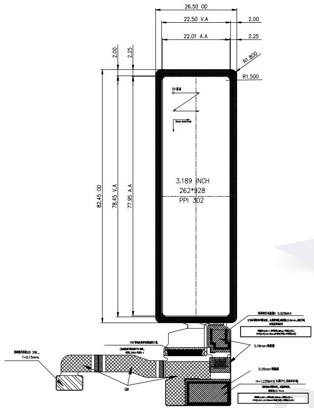
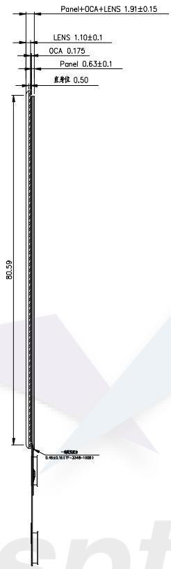
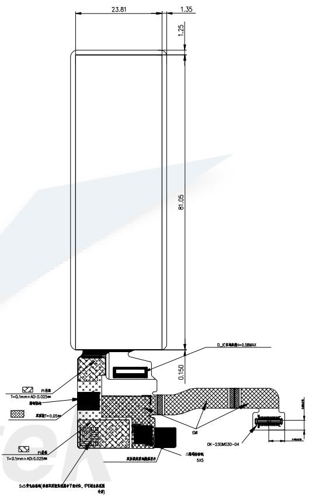
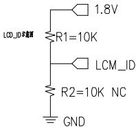
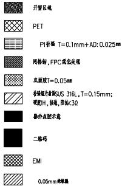

正视图  

text_image

26.50 00
22.50 V.A
22.01 A.A
2.00
2.25
R1,800
R1,500
TP 源点
78.45 V.A
77.95 A.A
3.189 INCH
262*928
PPI 302
82.45 00
PCB等表面的非金属材料尺寸
(含热处理材料的PCB)
DM
夹料直径最大值: 0.92MAX
C型双层结构件,主轴端、底板边长25mm,端子长度为10mm
附着力: H=1.25MAX (含热/PCB等表面)
厚度: 1mm
厚さ: 0.5mm
H=1.25MAX (含热/PCB等表面)
厚度: 1mm
厚さ: 0.5mm
附着力: H=1.25MAX (含热/PCB等表面)
厚度: 1mm
附着力: H=1.25MAX (含热/PCB等表面)

侧视图  

text_image

Panel+OCA+LENS 1.91±0.15
LENS 1.10±0.1
OCA 0.175
Panel 0.63±0.1
直射位 0.50
80.59
46000
E-4600.91F-2348-1001

背视图  

text_image

23.81
1.35
1.25
81.05
D, L, Z, X, Y, Z
0.150
D, L, Z, X, Y, Z
T=0.1mm+AD-0.022mm
本件直径T=0.05mm
T=0.1mm+AD-0.022mm
EIN
OK-2XCM030-04
S/5
本件夹具夹具夹具夹具夹具夹具夹具夹具夹具夹具夹具夹具夹具夹具夹具夹具夹具夹具夹具夹具夹具夹具夹具夹具夹具夹具夹具夹具夹具夹具夹具夹具夹具夹具夹具夹具夹具夹具夹具夹具夹具夹具夹具夹具夹具夹具夹具夹具夹具夹具夹
5≤5个加油箱间，各支阀的进给液用于油中，不可选油或层
水沟

<table><tr><td colspan="2">PIN Definition</td></tr><tr><td>NO.</td><td>SYMBOL</td></tr><tr><td>1</td><td>GND</td></tr><tr><td>2</td><td>GND</td></tr><tr><td>3</td><td>LCM_CLKN</td></tr><tr><td>4</td><td>VCI_EN(3.3V)</td></tr><tr><td>5</td><td>LCM_CLKP</td></tr><tr><td>6</td><td>GND</td></tr><tr><td>7</td><td>GND</td></tr><tr><td>8</td><td>LCD_JO(1.8V)</td></tr><tr><td>9</td><td>LCM_D1N (NC)</td></tr><tr><td>10</td><td>GND</td></tr><tr><td>11</td><td>LCM_D1P (NC)</td></tr><tr><td>12</td><td>LCD_RST</td></tr><tr><td>13</td><td>GND</td></tr><tr><td>14</td><td>LCM_ID(1.8V)</td></tr><tr><td>15</td><td>LCM_DON</td></tr><tr><td>16</td><td>GND</td></tr><tr><td>17</td><td>LCM_DOP</td></tr><tr><td>18</td><td>VCC_CTP(2.8V)</td></tr><tr><td>19</td><td>GND</td></tr><tr><td>20</td><td>GND</td></tr><tr><td>21</td><td>LCM_TE</td></tr><tr><td>22</td><td>CTP_RST(1.8V)</td></tr><tr><td>23</td><td>VPP (最空)</td></tr><tr><td>24</td><td>CTP_INT(1.8V)</td></tr><tr><td>25</td><td>GND</td></tr><tr><td>26</td><td>TP_TWI2_SDA(1.8V)</td></tr><tr><td>27</td><td>VBAT (3.7V)</td></tr><tr><td>28</td><td>TP_TWI2_SCK(1.8V)</td></tr><tr><td>29</td><td>VBAT</td></tr><tr><td>30</td><td>GND</td></tr></table>

OLED Note:  
1. Display mode: 3.19" AMOLED ; Viewing direction: FREE;  
2. Interface Type: Input voltage:  
3. OLED Driver IC: CO6300 ; Power IC: ZP3112 ; TP IC: CST3530;  
4. Luminance: 450cd/m²(MIN), 500cd/m²(TYP), 550cd/m²(MAX);  
5. Chromaticity White(X,Y): $x=0.29\pm0.02$ , $y=0.31\pm0.02$ ;  
6. NTSC: 100%(TYP); Contrast:10000(MIN); Uniformity: 80% MIN;  
7. Operating temperature: -20°C \~ +60°C  
8. Storage temperature: -30°C \~ +70°C  
9. Interface connector:  
10. “( )” Reference dimension; “ \* ” Control dimensions; 短曲度 ≤0.3mm ;  
11. Unmarked dimensional tolerance: ±0.20  
12. If the customer does full lamination, considering the material tolerance and fitting tolerance, it is recommended that the CTP window be expanded by $0.2\mathrm{mm}$ from one side of LCD AA area.

<table><tr><td colspan="4">REVISED RECORD</td><td rowspan="2" colspan="8">深圳市鱼鹰光电科技有限公司</td></tr><tr><td>版本</td><td>变更内容</td><td>变更人</td><td>变更日期</td></tr><tr><td>A0.0</td><td>初始版本</td><td></td><td></td><td>Drawn</td><td></td><td colspan="6"></td></tr><tr><td></td><td></td><td></td><td></td><td>Check</td><td></td><td>Page:</td><td>1 of 1</td><td>Unit:</td><td>mm</td><td>Date:</td><td></td></tr><tr><td></td><td></td><td></td><td></td><td>Approve</td><td></td><td>Rev:</td><td></td><td>Scale:</td><td>1/1</td><td>Projection:</td><td>—⊕</td></tr><tr><td></td><td></td><td></td><td></td><td>Dwn.No</td><td colspan="7">AM319M262928ZS</td></tr><tr><td></td><td></td><td></td><td></td><td>Customer No.</td><td colspan="7"></td></tr></table>

text_image

开窗区域
PET
P1(补偿 T=0.1mm+AD: 0.025mm)
网格钢，FPC柔化处理
双面胶T=0.05mm
非网格内摩擦US J6L，T=0.15mm；
或切片，伸长，厚张<30
紫外线胶罩套
二维码
EMI
0.05mm卷膜层

