# CHIPONE

集创北方

# OLED Smart Watch Display Driver IC Specification

# CO6300

# Specification Version

Model No : CO6300

Document Version : V0.00

Release Date : 27. Aug. 2024

Chipone Technology (Beijing) Co., Ltd.

Revision History

<table><tr><td>Version</td><td>Description</td><td>Prepared By</td><td>Checked By</td><td>Date</td></tr><tr><td>0.00</td><td>Preliminary Version</td><td>Xueling Gao</td><td>Lingguo Wang</td><td>2024/08/27</td></tr><tr><td></td><td></td><td></td><td></td><td></td></tr><tr><td></td><td></td><td></td><td></td><td></td></tr><tr><td></td><td></td><td></td><td></td><td></td></tr><tr><td></td><td></td><td></td><td></td><td></td></tr><tr><td></td><td></td><td></td><td></td><td></td></tr></table>

# Index

# REVISION HISTORY....2

1.DESCRIPTION....6  
2. FEATURES....7  
3. DEVICE OVERVIEW....10

3.1 BLOCK DIAGRAM....10

4. PIN DESCRIPTION....11

4.1 PINS FOR POWER INPUT 11  
4.2 PINS FOR MPU AND SPI INTERFACE....12  
4.3 PINS FOR MIPI INTERFACE....13  
4.4 PINS FOR INTERFACE LOGIC CONTROL 14  
4.5 PINS FOR ANALOG OUTPUT OF OLED DISPLAY DRIVING....15  
4.6 PINS FOR DC/DC CONVERT PINS 16  
4.7 TEST PINS 18

5. FUNCTION DESCRIPTION ...... 19

5.1 INTERFACE SELECTION....19  
5.2 MCU INTERFACE 20

5.2.1 Write Cycle and Sequence....20  
5.2.2 MCU Read Cycle and Sequence....22

5.3 3-WIRE/4-WIRE SPI INTERFACE ....23

5.3.1 Write Cycle and Sequence 23  
5.3.2 Read Cycle and Sequence....24  
5.3.3 Break and Pause Sequence....26

5.4 QUAD SPI INTERFACE 27

5.4.1 QUAD SPI command format 27  
5.4.2 Write Cycle and Sequence 28  
5.4.3 Read Cycle and Sequence....35  
5.4.4 QUAD SPI Function 36

5.5 TEARING EFFECT OUTPUT....38

5.5.1 Tearing Effect Line Mode 38  
5.5.2 Tearing Effect Line Timing....41

5.6 DISPLAY SERIAL INTERFACE (DSI) MIPI INTERFACE....42

5.6.1 Interface Level Communication....42  
5.6.2 Interface Level Communication - DSI Data Lane.... 51  
5.6.3 Packet Level Communication....62  
5.6.4 Packet Transmissions 77  
5.6.5 Communication Sequences ...... 93  
5.6.6 Video Mode Communication....99  
5.6.7 Display Data Format 103

5.7 GAMMA FUNCTION....106  
5.8 POWER ON/ OFF SEQUENCE....107

5.8.1 Power Stage Diagram 107  
5.8.2 Power ON Sequence 108  
5.8.3 Power OFF Sequence....109

6. ELECTRICAL CHARACTERISTICS ....110

6.1 ABSOLUTE MAXIMUM RATINGS....110  
6.2 DC CHARACTERISTICS....111

6.3 MIPI DC CHARACTERISTICS....113

6.3.1 DC Characteristics for DSI LP Mode 113  
6.3.2 DC Characteristics for DSI HS Mode....114

6.4 AC TIMINGS CHARACTERISTICS....115

6.4.1 Serial Interface Characteristics (3/4-wire SPI) 115  
6.4.2 Serial Interface Characteristics (QUAD SPI) 117  
6.4.3 Vertical Timings for DSI video mode....118

6.4.4 Horizontal Timings for DSI video mode 119

# 6.5 MIPI AC CHARACTERISTICS....120

6.5.1 High Speed Mode - Clock Timings 120  
6.5.2 High Speed Mode - Clock / Data Timings 120  
6.5.3 High Speed Mode - Rising and Falling Timings 121  
6.5.4 Low Speed Mode - Bus Turn Around 122  
6.5.5 Data Lanes from Low Power Mode to High Speed Mode....123  
6.5.6 Data Lanes from High Speed Mode to Low Power Mode....124  
6.5.7 DSI Clock Burst – High speed mode to /from Low Power Mode 125

# 6.6 RESET INPUT TIMING....126

# 7. COMMAND....127

7.1 COMMAND TABLE SWITCH FLOW....127  
7.2 PASS WORD COMMAND DESCRIPTION IN UCS (COMMAND1)....128

7.2.1 PASSWD1 128

7.3 PASS WORD COMMAND DESCRIPTION IN MCS (COMMAND2)....130  
7.3.1 PASSWD2 130  
7.4 COMMAND LIST....132  
7.5 COMMAND DESCRIPTION....136

7.5.1 NOP: NOP (00h)....136  
7.5.2 SWRESET: Software Reset (01h) 137  
7.5.3 RDDID: Read Display ID (04h) 138  
7.5.4 RDNUMED: Read Number of Errors on DSI (05h)....140  
7.5.5 RDDPM: Read Display Power Mode (0Ah)....141  
7.5.6 RDDMADCTR: Read Display MADCTR (OBh) 143  
7.5.7 RDDCOLMOD: Read Display Pixel Format (0Ch)....145  
7.5.8 RDDIM: Read Display Image Mode (ODh)....147  
7.5.9 RDDIM: Read Display Signal Mode (0Eh)....149  
7.5.10 RDDSDR: Read Display Self-Diagnostic Result (OFh) 151  
7.5.11 SLPIN: Sleep In (10h)....153  
7.5.12 SLPOUT: Sleep Out (11h) 155  
7.5.13 PARON: Partial Display Mode ON (12h)....157  
7.5.14 NORON: Normal Display Mode ON (13h)....158  
7.5.15 INVOFF: Display Inversion OFF (20h) 159  
7.5.16 INVON: Display Inversion ON (21h) 160  
7.5.17 ALLPOFF: All Pixel OFF (22h)....161  
7.5.18 ALLPON: All Pixel ON (23h)....163  
7.5.19 DISPOFF: Display OFF (28h) 165  
7.5.20 DISPON: Display ON (29h) 167  
7.5.21 CASET: Set Column Start Address (2Ah) 169  
7.5.22 RASET: Set Row Start Address (2Bh)....171  
7.5.23 RAMWR: Memory Start Write (2Ch) 173  
7.5.24 RAMWR: Memory Start Read (2Eh)....174  
7.5.25 PTLAR: Set Vertical Partial Area (30h)....175  
7.5.26 PTLAR\_H: Set Horizontal Partial Area (31h)....177  
7.5.27 TEOFF: Tearing Effect Line OFF (34h)....179  
7.5.28 TEON: Tearing Effect Line ON (35h)....180  
7.5.29 MADCTL: Memory Data Access Control (36h)....182  
7.5.30 IDMOFF: Idle mode OFF (38h)....184  
7.5.31 IDMON: Idle mode ON (39h) 185  
7.5.32 COLMOD: Interface Pixel Format (3Ah)....186  
7.5.33 RAMWR: Memory Continuous Write (3Ch)....188  
7.5.34 RAMWR: Memory Continuous Read (3Eh)....189  
7.5.35 STESL: Set Tearing Effect Scan Line (44h)....190  
7.5.36 GSL: Get Scan Line (45h)....192  
7.5.37 DSTBON: Deep Standby Mode On (4Fh)....193

7.5.38 WRDISBV: Write Display Brightness (51h) 194  
7.5.39 RDDISBV: Read Display Brightness (52h)....195  
7.5.40 WRCTRLD: Write CTRL Display (53h) 196  
7.5.41 RDCTRLD: Read CTRL Display (54h) 198  
7.5.42 WRACL: Read ACL Control (55h)....200  
7.5.43 RDACL: Read ACL Control (56h) 201  
7.5.44 WRIMGEHCCTR: Set Color Enhance Control (58h) 202  
7.5.45 RDIMGEHCCTR: Read Color Enhance Control (59h) 204  
7.5.46 RDIMGEHCCTR: Local HBM Control (5Fh) 206  
7.5.47 WRHBMDISBV: Frame Rate level Control (60h)....207  
7.5.48 WRHBMDISBV: Dynamic Frame Rate Enable (61h) 209  
7.5.49 WRHBMDISBV: Write HBM Display Brightness (63h) 211  
7.5.50 WRDISBV: Read HBM Display Brightness (64h) 212  
7.5.51 RDHBMDISBV: Read HBM Display Brightness (65h) 213  
7.5.52 HBM Mode: Set HBM Mode (66h) 214  
7.5.53 COLSET: Interface Pixel Format Set (70\~7Fh)....215  
7.5.54 COLOPT: Interface Pixel Format Option (80h)....220  
7.5.55 RDDDBS: Read DDB Start (A1h) 223  
7.5.56 RDDDBC: Read DDB Continuous (A8h) 225  
7.5.57 RDFCS: Read First Checksum (AAh) 227  
7.5.58 RDCCS: Read Continuous Checksum (AFh) 228  
7.5.59 SetDISPMode: Set Display Mode (C2h) 229  
7.5.60 SetDSPIMode:Set Dual SPI Mode (C4h)....231  
7.5.61 RDID1: Read ID1 Value (DAh) 233  
7.5.62 RDID2: Read ID2 Value (DBh)....234  
7.5.63 RDID3: Read ID3 Value (DCh)....235  
7.5.64 CMD Page Switch (FEh)....236  
7.5.65 CMD Page Switch (FFh)....238

8. APPLICATION....240

8.1 DC/DC CONVERTER CIRCUIT 240

8.2 EXTERNAL COMPONENTS CONNECTION....241

9. IMPORTANT NOTICE....243

# 1. Description

This purpose of this document has been created to provide complete reference specifications for the CO6300. Major of purpose for customers refer to these specifications for system design, quality performance control, and IC applications.

The CO6300 device is a single-chip with RAM display driver integration IC for LTPS AMOLED that incorporates gate drivers, a timing controller with glass interface level-shifters, and a glass power supply circuit that is capable of 540RGBx540, 480RGBx480, 454RGBx454, 400RGBx400, 390RGBx390, 360RGBx480, 360RGBx360, 340RGBx340, 320RGBx360, 320RGBx320, 320RGBx480, 300RGBx300, 272RGBx480, 240RGBx240, 240RGBx320, 192RGBx960, 180RGBx560, 180RGBx540, 180RGBx360, 128RGBx432 with internal GRAM including of a 2,332,800 bits internal memory.

The CO6300 supports MIPI Interface, 8-bit system interfaces, serial peripheral interfaces (SPI), dual serial peripheral interfaces (Dual-SPI), quad serial peripheral interfaces (Quad-SPI). The source resolution can be adjusted 540RGB and the gate resolution only can be set 540 lines. For the detailed resolution setting, please refer to CO6300 Application Note. The specified GRAM window area can be updated selectively, so that moving pictures can be displayed simultaneously independent of the still picture area.

The CO6300 is also able to make gamma correction settings separately for RGB dots to allow benign adjustments to panel characteristics, resulting in higher display qualities. CO6300 includes internal boosters that generate the AMOLED driving voltage, breeder resistance and voltage follower circuit for the AMOLED driver. CO6300 possesses internal GRAM with compression IP that stores 540 x 540 x 1/3 x 24 bits for 16.7M-color images. A deep standby mode is also supported for lower power consumption.

The CO6300 also supports ACL function for the AMOLED brightness control. It's able to reduce the total power consumption of display module significantly and keep AMOLED life time.

This LSI is suitable for wearable device applications, including watch and smart band.

# 2. Features

■ Single chip wearable device AMOLED controller/driver with internal RAM  
■ Display Resolution support. For detail settings, need to check Application Note

➢ 540RGB x 540 (1:9 Multiplexer for source driver)  
➢ 480RGB x 480 (1:6/1:9/1:12 Multiplexer for source driver)  
➢ 454RGB x 454 (1:6/1:12 Multiplexer for source driver)  
➢ 400RGB x 400 (1:6/1:12 Multiplexer for source driver)  
390RGB x 390 (1:6/1:12 Multiplexer for source driver)  
➢ 360RGB x 480 (1:6/1:9/1:12 Multiplexer for source driver)  
360RGB x 360 (1:6/1:12 Multiplexer for source driver)  
340RGB x 340 (1:6/1:12 Multiplexer for source driver)  
320RGB x 360 (1:6/1:12 Multiplexer for source driver)  
320RGB x 320 (1:6/1:12 Multiplexer for source driver)  
320RGB x 480 (1:6/1:12 Multiplexer for source driver)  
➢ 300RGB x 300 (1:6/1:12 Multiplexer for source driver)  
272RGB x 480 (1:6/1:12 Multiplexer for source driver)  
➢ 270RGB x 270 (1:6/1:9/1:12 Multiplexer for source driver)  
240RGB x 240 (1:6/1:12 Multiplexer for source driver)  
240RGB x 320 (1:6/1:12 Multiplexer for source driver)  
➢ 192RGB x 960 (1:6/1:9/1:12 Multiplexer for source driver)  
➢ 180RGB x 560 (1:6/1:12 Multiplexer for source driver)  
➢ 180RGB x 540 (1:6/1:12 Multiplexer for source driver)  
➢ 128RGB x 432 (1:6/1:12 Multiplexer for source driver)

■ Display data RAM (frame memory): 2,332,800 bits  
■ Display mode (Color mode)

Full color mode: 16.7M-colors  
▶ Reduced Color Mode: 262K-colors  
▶ Reduced Color Mode: 65K-colors  
▶ Supported Normal/Idle Display Mode  
Normal mode: 16.7M-colors, 262K-colors, 65K-colors  
Idle mode: 16.7M-colors, 4096-colors, 8-colors

# Interface

MIPI DSI Interface (D-PHY: V1.0, DSI:1.01.00, DCS:1.01.00)  
MIPI I/F Supported 2 data lanes (Lane numbers are selected by register xxh of CMD2 in MIPI LP mode, and this register can be programmed by MTP)  
◆ Support 1lane/2lane (1lane/2lane: 900Mbps)  
◆ Support two MIPI PORTS, control by MIPI\_SEL from Hardware 0: select MIPI1; 1:select MIPI2  
◆ Support switching between two ports when 1 lane Swap port @lp11 or Swap port @lp00  
◆ Support one port of two lanes(default 1lane)  
◆ Maximum total bit rate is 900Mbps with 24-bit data format, 700Mbps with 18-bit data format, 620Mbps with 16-bit data format

Serial peripheral interface (SPI)  
Dual serial peripheral interface (Dual-SPI)  
Quad serial peripheral interface (Quad-SPI)  
Quad-SPI DDR (1swire: 65Mbps)

# ■ Display Feature

➢ Individual gamma correction settings for RGB dots  
▶ Partial display function

# ■ On chip

DC/DC converter  
Supports control signals (VSR\_L[16:1], VSR\_R[16:1], ) to gate driver in the AMOLED panel  
Internal Oscillator for display clock generation  
On module checksum checking  
Sunlight readable technology  
VREFP5/VREFN5/VREFN5\_2 voltage generator for panel voltage  
VGHR1/VGLR1/VGHR2/VGLR2 voltage for gate control signal  
Source output MUX[6:1]/MUX[9:1]/MUX[12:1] with 240/180/120ch source output pins  
➢ Supports gate control signals to gate driver in the panel

# ■ Built-in OTP function to adjust panel setting

Provide MTP (2 times) to store related Power, GOA timing, Gamma1\~8 settings  
Provide MTP (3 times) to store ID1, ID2, ID3, DDB

# ■ Self-Diagnostic Function

ESD detection  
Low Voltage Detection

# ■ Control power IC by one-wire interface(S-Wire Control)

# ■ Supply Voltage Range

Logic / interface power supply voltage VDDI = 1.65V \~ 3.3V  
Analog power supply voltage VCI = 2.7V \~ 3.6V  
Logic / interface power supply voltage VDDD = 1.2V ± 50mV

# ■ Output voltage levels

Positive gate driver voltage range for VGHR1/VGHR2: 3V \~ 12V, step 0.2V  
➢ Negative gate driver voltage range for VGLR1/VGLR2: -2V \~ -12V, step 0.2V  
VREFP panel voltage range: 0V, 0.5\~5.5V, step 0.05V (Max<=AVDD-0.3V)  
VREFN/VREFN\_2 panel voltage range:0V, -0.5\~-5V, step 0.05V (Min>=VCL+0.3V)  
Step-up 1,2 output voltage range for AVDD: 4.0 \~ 6.0V, step 0.1V; VCL: -3.5 \~ -5.5V, step 0.5V  
➢ Gamma high/low voltage range for
VGMP: 2.0V \~ 5.8V (Max<=AVDD-0.2V), step 10.0mV, VGSP: 0V, 0.2V \~ 4.5V, step 10.0mV

# ■ Package: COF/COP

# ■ Chip size evaluation : 8218um x 1556um(including scribe line)

# 3. Device Overview

# 3.1 Block diagram

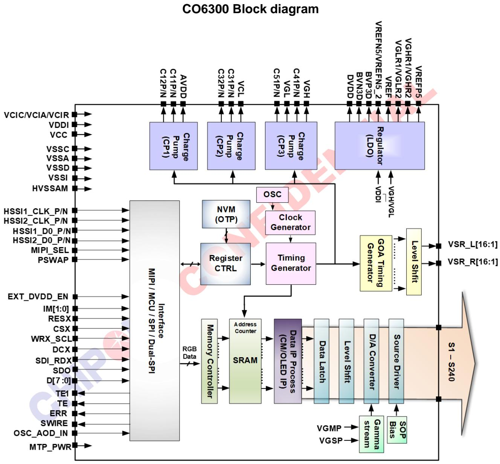

flowchart

```mermaid
graph TD
  subgraph Interface
    MIP1["MIPI / MCU / SPI / Dual-SPI"]
    VCC["VCIC/VCIA/VCIR"]
    VDDI["VDDI"]
    VCC2["VCC"]
    VSSC["VSSC"]
    VSSA["VSSA"]
    VSSD["VSSD"]
    VSSI["VSSI"]
    HVSSAM["HVSSAM"]
    HSSI1["HSSI1_CLK_P/N"]
    HSSI2["HSSI2_CLK_P/N"]
    HSSI1_D0["HSSI1_D0_P/N"]
    HSSI2_D0["HSSI2_D0_P/N"]
    MIPI_SEL["MIPI_SEL"]
    PSWAP["PSWAP"]
    EXT_DVDD_EN["EXT_DVDD_EN"]
    IM["1:0"]["IM["1:0"]"]
    RESX["RESX"]
    CSX["CSX"]
    WRX_SCL["WRX_SCL"]
    DCX["DCX"]
    SDI_RDX["SDI_RDX"]
    SDO["SDO"]
    D["7:0"]["D["7:0"]"]
    TE1["TE1"]
    TE2["TE"]
    ERR["ERR"]
    SWIRE["SWIRE"]
    OSC_AOD_IN["OSC_AOD_IN"]
    MTP_PWR["MTP_PWR"]
  end

  subgraph VoltageRegulator
  VCC --> C1P1NC12pN["C1P1N_C12P/N"]
  VCC --> AVDDC14pN["AVDD_C14P/N"]
  VCC --> C3P1NC32pN["C3P1N_C32P/N"]
  VCC --> C3P1N_VCL
  VCC --> C5P1NC54pN["C5P1N_C54P/N"]
  VCC --> C4P1N_VGL
  VCC --> C4P1N_VGH
  VCC --> DVDD_DVDDD
  VCC --> BVND3D_BVP3D
  VCC --> VREFN5/VREFN5_2 | VREFN5/VREFN5_2 |
  VCC --> VGHR1/VGHR2_VGLR1/VGLR2 | VGHR1/VGHR2_VGLR1/VGLR2 |
  VCC --> VGHR1/VGHR2_VREFN5/VREFN5_2 | VGHR1/VGHR2_VREFN5/VREFN5_2 |
  VCC --> VGHR1/VGHR2_VREFN5/VREFN5_2 | VGHR1/VGHR2_VREFN5/VREFN5_2 |
  VCC --> VGHR1/VGHR2_VREFN5/VREFN5_2 | VGHR1/VGHR2_VREFN5/VREFN5_2 |
  VCC --> VGHR1/VGHR2_VREFN5/VREFNN_2 | VGHR1/VGHR2_VREFN5/VREFNN_2 |
  VCC --> VGHR1/VGHR2_VREFNN_2 | VGHR1/VGHR2_VREFNN_2 |
  VCC --> VGHR1/VGHR2_VREFNN_2 | VGHR1/VGHR2_VREFNN_2 |
  | VCC --> VGHR1/VGHR2_VREFNN_2 | VGHR1/VGHR2_VREFNN_2 |
  | VCC --> VGHR1/VGHR2_VREFNN_2 | VGHR1/VGHR2_VREFNN_2 |
  | VCC --> VGHR1/VGHR2_VREFNN_2 | VGHR1/VGHR2_VREFNN_2 |
  | VCC --> VGHR1/VGHR3_VGLR1/VGLR2 | VGHR1/VGHR3_VGLR1/VGLR2 |
  | VCC --> VGHR3_VGLR2 | VGHR3_VGLR2 |
  | VCC --> VGHR3_VGLR2 | VGHR3_VGLR2 |
  | VCC --> VGHR3_VGLR2 | VGHR3_VGLR2 |
  | VCC --> VGHR3_VGLR3 | VGHR3_VGLR3 |
  | VCC --> VGHR3_VGLR3 | VGHR3_VGLR3 |
  | VCC --> VGHR3_VGLR3 | VGHR3_VGLR3 |
  | VCC --> VGHR3_VGLR4 | VGHR3_VGLR4 |
  | VCC --> VGHR3_VGLR4 | VGHR3_VGLR4 |
  | VCC --> VGHR3_VGLR4 | VGHR3_VGLR4 |
  | VCC --> VGHR3_VGLR5 | VGHR3_VGLR5 |
  | VCC --> VGHR3_VGLR5 | VGHR3_VGLR5 |
  | VCC --> VGHR3_VGLR5 | VGHR3_VGLR5 |
  | VCC --> VGHR3_VGLR6 | VGHR3_VGLR6 |
  | VCC --> VGHR3_VGLR6 | VGHR3_VGLR6 |
  | VCC --> VGHR3_VGLR6 | VGHR3_VGLR6 |
  | VCC --> VGHR3_VGLR7 | VGHR3_VGLR7 |
  | VCC --> VGHR3_VGLR7 | VGHR3_VGLR7 |
  | VCC --> VGHR3_VGLR7 | VGHR3_VGLR7 |
  | VCC --> VGHR3_VGLR8 | VGHR3_VGLR8 |
  | VCC --> VGHR3_VGLR8 | VGHR3_VGLR8 |
  | VCC --> VGHR3_VGLR8 | VGHR3_VGLR8 |
  | VCC --> VGHR3_VGLR9 | VGHR3_VGLR9 |
  | VCC --> VGHR3_VGLR9 | VGHR3_VGLR9 |
  | VCC --> VGHR3_VGLR9 | VGHR3_VGLR9 |
  | VCC --> VGHR3_VGLR10 | VGHR3_VGLR10 |
  | VCC --> VGHR3_VGLR10 | VGHR3_VGLR10 |
  | VCC --> VGHR3_VGLR10 | VGHR3_VGLR10 |
  | VCC --> VGHR3_VGLR11 | VGHR3_VGLR11 |
  | VCC --> VGHR3_VGLR11 | VGHR3_VGLR11 |
  | VCC --> VGHR3_VGLR11 | VGHR3_VGLR11 |
  | VCC --> VGHR3_VGLR12 | VGHR3_VGLR12 |
  | VCC --> VGHR3_VGLR12 | VGHR3_VGLR12 |
  | VCC --> VGHR3_VGLR12 | VGHR3_VGLR12 |
  | VCC --> VGHR3_VGLR13 | VGHR3_VGLR13 |
  | VCC --> VGHR3_VGLR13 | VGHR3_VGLR13 |
  | VCC --> VGHR3_VGLR13 | VGHR3_VGLR13 |
  | VCC --> VGHR3_VGLR14 | VGHR3_VGLR14 |
  | VCC --> VGHR3_VGLR14 | VGHR3_VGLR14 |
  | VCC --> VGHR3_VGLR14 | VGHR3_VGLR14 |
  | VCC --> VGHR3_VGLR15 | VGHR3_VGLR15 |
  | VCC --> VGHR3_VGLR15 | VGHR3_VGLR15 |
  | VCC --> VGHR3_VGLR15 | VGHR3_VGLR15 |
  | VCC --> VGHR3_VGLR16 | VGHR3_VGLR16 |
  | VCC --> VGHR3_VGLR16 | VGHR3_VGLR16 |
  | VCC --> VGHR3_VGLR16 | VGHR3_VGLR16 |
  | VCC --> VGHR3_VGLR17 | VGHR3_VGLR17 |
  | VCC --> VGHR3_VGLR17 | VGHR3_VGLR17 |
  | VCC --> VGHR3_VGLR17 | VGHR3_VGLR17 |
  | VCC --> VGHR3_VGLR18 | VGHR3_VGLR18 |
  | VCC --> VGHR3_VGLR18 | VGHR3_VGLR18 |
  | VCC --> VGHR3_VGLR18 | VGHR3_VGLR18 |
  | VCC --> VGHR3_VGLR19 | VGHR3_VGLR19 |
  | VCC --> VGHR3_VGLR19 | VGHR3_VGLR19 |
  | VCC --> VGHR3_VGLR19 | VGHR3_VGLR19 |
  | VCC --> VGHR3_VGLR20 | VGHR3_VGLR20 |
  | VCC --> VGHR3_VGLR20 | VGHR3_VGLR20 |
  | VCC --> VGHR3_VGLR20 | VGHR3_VGLR20 |
  | VCC --> VGHR3_VGLR21 | VGHR3_VGLR21 |
  | VCC --> VGHR3_VGLR21 | VGHR3_VGLR21 |
  | VCC --> VGHR3_VGLR21 | VGHR3_VGLR21 |
  | VCC --> VGHR3_VGLR22 | VGHR3_VGLR22 |
  | VCC --> VGHR3_VGLR22 | VGHR3_VGLR22 |
  | VCC --> VGHR3_VGLR22 | VGHR3_VGLR22 |
  | VCC --> VGHR3_VGLR23 | VGHR3_VGLR23 |
  | VCC --> VGHR3_VGLR23 | VGHR3_VGLR23 |
  | VCC --> VGHR3_VGLR24 | VGHR3_VGLR24 |
  | VCC --> VGHR3_VGLR24 | VGHR3_VGLR24 |
  | VCC --> VGHR3_VGLR25 | VGHR3_VGLR25 |
  | VCC --> VGHR3_VGLR25 | VGHR3_VGLR25 |
  | VCC --> VGHR3_VGLR26 | VGHR3_VGLR26 |
  | VCC --> VGHR3_VGLR26 | VGHR3_VGLR26 |
  | VCC --> VGHR3_VGLR27 | VGHR3_VGLR27 |
  | VCC --> VGHR3_VGLR27 | VGHR3_VGLR27 |
  | VCC --> VGHR3_VGLR28 | VGHR3_VGLR28 |
  | VCC --> VGHR3_VGLR28 | VGHR3_VGLR28 |
  | VCC --> VGHR3_VGLR29 | VGHR3_VGLR29 |
  | VCC --> VGHR3_VGLR29 | VGHR3_VGLR29 |
  | VCC --> VGHR3_VGLR30 | VGHR3_VGLR30 |
  | VCC --> VGHR3_VGLR30 | VGHR3_VGLR30 |
| VCO_Pump_Pump_Pump_CPump_Pump_Pump_Pump_Pump_Pump_Pump_Pump_Pump_Pump_Pump_Pump_Pump_Pump_Pump_Pump_Pump_Pump_Pump_Pump_Pump_Pump_Pump_Pump_Pump_Pump_Pump_Pump_Pump_Pump_Pump_Pump_Pump_Pump_Pump_Pump_Pump_Pump_Pump_Pump_Pump_Pump_Pump_Pump_Pump_Pump_Pump_Pump_Pump_Pump_PumpPump_Pump_Pump_Pump_Pump_Pump_Pump_Pump_Pump_Pump_Pump_Pump_Pump_Pump_Pump_Pump_Pump_Pump_Pump_Pump_Pump_Pump_Pump_Pump_Pump_Pump_Pump_Pump_Pump_Pump_Pump_Pump_Pump_Pump_Pump_Pump_Pump_Pump_Pump_Pump_Pump_Pump_Pump_Pump_Pump_Pump_Pump_Pump_Pump_PampPump_PumpPumpPumpPumpPumpPumpPumpPumpPumpPumpPumpPumpPumpPumpPumpPumpPumpPumpPumpPumpPumpPumpPumpPumpPumpPumpPumpPumpPumpPumpPumpPumpPumpPumpPumpPumpPumpPumpPumpPumpPumpPumpPumpPumpPumpPumpPumpPumpPumpPumpPumpQPPLPDPLPDPLPDPLPDPLPDPLPDPLPDPLPDPLPDPLPDPLPDPLPDPLPDPLPDPLPDPLPDPLPDPLPDPLPDPLPDPLPDPLPDPLPDPLPDPLPDPLPDPLPDPLPDPLPDPLPDPLPDPLPDPLPDPLPDPLPDPLPDPLPDPLPDPLPDPLPDPLPDPLPDPLPDPLPDPLPDPLPDPLPDPLPDPLPDPLPDPLPDFLPDPLPDFLPDPLPDFLPDFLPDFLPDFLPDFLPDFLPDFLPDFLPDFLPDFLPDFLPDFLPDFLPDFLPDFLPDFLPDFLPDFLPDFLPDFLPDFLPDFLPDFLPDFLPDFLPDFLPDFLPDFLPDFLPDFLPDFLPDFLPDFLPDFLPDFLPDFLPDFLPDFLPDFLPDFLPDFLPDFLPDFLPDFLPDFLPDFLPDFLPDFLPDFLPDFLPFPLPF LPDFLFPDFLPDFLFPDFLPDFLFPDFLPDFLFPDFLPDFLFPDFLPDFLFPDFLPDFLFPDFLPDFLFPDFLPDFLFPDFLPDFLFPDFLPDFLFPDFLPDFLFPDFLPDFLFPDFLPDFLFPDFLPDFLFPDFLPDFLFPDFLPDFLFPDFLPDFLFPDFLPDFLFPDFLPDFLFPDFLPDFLFPDF LPDFLFPDF LPDFLFPDF LPDFLFPDF LPDFLFPDF LPDFLFPDF LPDFLFPDF LPDFLFPDF LPDFLFPDF LPDFLFPDF LPDFLFPDF LPDFLFPDF LPDFLFPDF LPDFLFPDF LPDFLFPDF LPDFLFPDF LPDFLFPDF LPDFLFPDF LPDFLFPDF LPDFLFPDF LPDFLFPDF LSP-SPSIPSPSPSPSPSPSPSPSPSPSPSPSPSPSPSPSPSPSPSPSPSPSPSPSPSPSPSPSPSPSPSPSPSPSPSPSPSPSPSPSPSPSPSPSPSPSPSPSPSPSPSPSPSPSPSPSPSPSPSPSPSPSPSPSPSPSPSPSPSPSPSPSPSPSPSPSPSPSPSPSPSPSPSPSPSPSPSPSPSPSPSPSPSPSPSPSPSPSPSPSPSIPCPCPCPCPCPCPCPCPCPCPCPCPCPCPCPCPCPCPCPCPCPCPCPCPCPCPCPCPCPCPCPCPCPCPCPCPCPCPCPCPCPCPCPCPCPCPCPCPCPCPCPCPCPCPCPCPCPCPCPCPCPCPCPCPCPCPCPCPCPCPCPCPCPCPCPCPCPCPCPCPCPCPCPCPCPCPCPCPCPCPCPCPCPCPCPCPCPCPCPCPMPRPMPRPMPRPMPRPMPRPMPRPMPRPMPRPMPRPMPRPMPRPMPRPMPRPMPRPMPRPMPRPMPRPMPRPMPRPMPRPMPRPMPRPMPRPMPRPMPRPMPRPMPRPMPRPMPRPMPRPMPRPMPRPMPRPMPRPMPRPMPRPMPRPMPRPMPRPMPRPMPRPMPRPMPRPMPRPMPRPMPRPMPRPMPRPMPRPMPRPMPRpNPWPWPWPWPWPWPWPWPWPWPWPWPWPWPWPWPWPWPWPWPWPWPWPWPWPWPWPWPWPWPWPWPWPWPWPWPWPWPWPWPWPWPWPWPWPWPWPWPWPWPWPWPWPWPWPWPWPWPWPWPWPWPWPWPWPWPWPWPWPWPWPWPWPWPWPWPWPWPWPWPWPWPWPWPWPWPWPWPWPWPWPWPWPWPWPWPWPWPWPWP WPBPYPQPYPQPYPQPYPQPYPQPYPQPYPQPYPQPYPQPYPQPYPQPYPQPYPQPYPQPYPQPYPQPYPQPYPQPYPQPYPQPYPQPYPQPYPQPYPQPYPQPYPQPYPQPYPQPYPQPYPQPYPQPYPQPYPQPYPQPYPQPYPQPYPQPYPQPYPQPYPQPYPQPYPQPYPQPYPQPYPQPYPQPYPQPYPQPYPQPYPQPYPQEPVPVPVPVPVPVPVPVPVPVPVPVPVPVPVPVPVPVPVPVPVPVPVPVPVPVPVPVPVPVPVPVPVPVPVPVPVPVPVPVPVPVPVPVPVPVPVPVPVPVPVPVPVPVPVPVPVPVPVPVPVPVPVPVPVPVPVPVPVPVPVPVPVPVPVPVPVPVPVPVPVPVPVPVPVPVPVPVPVPVPVPVPVPVPVPVPVPVPVPVPVPPXPJPXPJPXPJPXPJPXPJPXPJPXPJPXPJPXPJPXPJPXPJPXPJPXPJPXPJPXPJPXPJPXPJPXPJPXPJPXPJPXPJPXPJPXPJPXPJPXPJPXPJPXPJPXPJPXPJPXPJPXPJPXPJPXPJPXPJPXPJPXPJPXPJPXPJPXPJPXPJPXPJPXPJPXPJPXPJPXPJPXPJPXPJPXPJPXPJPXPJPXPJPNPVPPXPJPNPVPPXPJPNPVPPXPJPNPVPPXPJPNPVPPXPJPNPVPPXPJPNPVPPXPJPNPVPPXPJPNPVPPXPJPNPVPPXPJPNPVPPXPJPNPVPPXPJPNPVPPXPJPNPVPPXPJPNPVPPXPJPNPVPPXPJPNPVPPXPJPNPVPPXPJPNPVPPXPJPNPVPPXPJPNPVppPVPPXPJPNPVPPXPJPNPVPPXPJPNPVPPXPJPNPVPPXPJPNPVPPXPJPNPVPPXPJPNPVPPXPJPNPVPPXPJPNPVPPXPJPNPVPPXPJPNPVPPXPJPNPVPPXPJPNPVPPXPJPNPVPPXPJPNPVPPXPJPNPVPPXPJPNPVPPXPJPNPVPPXPJPNPVPPXPJDNVPPXPJPNPVPPXPJPNPVPPXPJPNPVPPXPJPNPVPPXPJPNPVPPXPJPNPVPPXPJPNPVPPXPJPNPVPPXPJPNPVPPXPJPNPVPPXPJPNPVPPXPJPNPVPPXPJPNPVPPXPJPNPVPPXPJPNPVPPXPJPNPVPPXPJPNPVPPXPJPNPVPPXPJPNPVPPXPJPNVPPSVPPNPVPPSVPPSVPPSVPPSVPPSVPPSVPPSVPPSVPPSVPPSVPPSVPPSVPPSVPPSVPPSVPPSVPPSVPPSVPPSVPPSVPPSVPPSVPPSVPPSVPPSVPPSVPPSVPPSVPPSVPPSVPPSVPPSVPPSVPPSVPPSVPPSVPPSVPPSVPPSVPPSVPPSVPPSVPPSVPPSVPPSVPPSVPPSVPPSVPPSVPPSVPPSIPVSSIPVSSIPVSSIPVSSIPVSSIPVSSIPVSSIPVSSIPVSSIPVSSIPVSSIPVSSIPVSSIPVSSIPVSSIPVSSIPVSSIPVSSIPVSSIPVSSIPVSSIPVSSIPVSSIPVSSIPVSSIPVSSIPVSSIPVSSIPVSSIPVSSIPVSSIPVSSIPVSSIPVSSIDIPVSSIPVSSIPVSSIPVSSIPVSSIPVSSIPVSSIPVSSIPVSSIPVSSIPVSSIPVSSIPVSSIPVSSIPVSSIPVSSIPVSSIPVSSIPVSSIPVSSIPVSSIPVSSIPVSSIPVSSIPVSSIPVSSIPVSSIPVSSIPVSSIPVSSIPVSSIPVSSIPVSSISIPVSSIPVSSIPVSSIPVSSIPVSSIPVSSIPVSSIPVSSIPVSSIPVSSIPVSSIPVSSIPVSSIPVSSIPVSSIPVSSIPVSSIPVSSIPVSSIPVSSIPVSSIPVSSIPVSSIPVSSISIPVSSISIPVSSISIPVSSISIPVSSISIPVSSISIPVSSISIPVSSISIPVSSISIPVSSISIPVSSISIPVSSISIPVSSISIPVSSISIPVVSDIOPVVSDIOPVVSDIOPVVSDIOPVVSDIOPVVSDIOPVVSDIOPVVSDIOPVVSDIOPVVSDIOPVVSDIOPVVSDIOPVVSDIOPVVSDIOPVVSDIOPVVSDIOPVVSDIOPVVSDIOPVVSDIOPVVSDIOPVVSDIOPVVSDIOPVVSDIOPVVSDIOPVVSDIOPVVSDIODIFVVSDIOPVVSDIOPVVSDIOPVVSDIOPVVSDIOPVVSDIOPVVSDIOPVVSDIOPVVSDIOPVVSDIOPVVSDIOPVVSDIOPVVSDIOPVVSDIOPVVSDIOPVVSDIOPVVSDIOPVVSDIOPVVSDIOPVVSDIOPVVSDIOPVVSDIOPVVSDIOPVVSDIOPVVSDIOTIFVVSDIOPVVSDIOPVVSDIOPVVSDIOPVVSDIOPVVSDIOPVVSDIOPVVSDIOPVVSDIOPVVSDIOPVVSDIOPVVSDIOPVVSDIOPVVSDIOPVVSDIOPVVSDIOPVVSDIOPVVSDIOPVVSDIOPVVSDIOPVVSDIOPVVSDIOPVVSDIOPVVSDIOPVVSDIHPOVVSDIHPOVVSDIHPOVVSDIHPOVVSDIHPOVVSDIHPOVVSDIHPOVVSDIHPOVVSDIHPOVVSDIHPOVVSDIHPOVVSDIHPOVVSDIHPOVVSDIHPOVVSDIHPOVVSDIHPOVVSDIHPOVVSDIHPOVVSDIHPOVVSDIHPOVVSDIHPOVVSDIHPOVVSDIHPOVVSDIHPOVVSDIHPOVVSDIHPCOVDDIVDDIVDDIVDDIVDDIVDDIVDDIVDDIVDDIVDDIVDDIVDDIVDDIVDDIVDDIVDDIVDDIVDDIVDDIVDDIVDDIVDDIVDDIVDDIVDDIVDDIVDDIVDDIVDDIVDDIVDDIVDDIVDDIVDDIVDDIVDDIVDDIVDDIVDDIVDDIVDDIVDDIVDDIVDDIVDDIVDDIVDDIVDDIVDDIVDDIVDDILPDFFVFVFVFVFVFVFVFVFVFVFVFVFVFVFVFVFVFVFVFVFVFVFVFVFVFVFVFVFVFVFVFVFVFVFVFVFVFVFVFVFVFVFVFVFVFVFVFVFVFVFVFVFVFVFVFVFVFVFVFVFVFVFVFVFVFVFVFVFVFVFVFVFVFVFVFVFVFVFVFVFVFVFVFVFVFVFVFVFVFVFVFVFVFVFVFVFVFVFVFVFVEFVEFVEFVEFVEFVEFVEFVEFVEFVEFVEFVEFVEFVEFVEFVEFVEFVEFVEFVEFVEFVEFVEFVEFVEFVEFVEFVEFVEFVEFVEFVEFVEFVEFVEFVEFVEFVEFVEFVEFVEFVEFVEFVEFVEFVEFVEFVEFVEFVEFVEfEFEFEFEFEFEFEFEFEFEFEFEFEFEFEFEFEFEFEFEFEFEFEFEFEFEFEFEFEFEFEFEFEFEFEFEFEFEFEFEFEFEFEFEFEFEFEFEFEFEFEFEFEFEFEFEFEFEFEFEFEFEFEFEFEFEFEFEFEFEFEFEFEFEFEFEFEFEFEFEFEFEFEFEFEFEFEFEFEFEFEFEFEFEFEFEFEFEFEFEFEFAEFAEFAEAFAEAFAEAFAEAFAEAFAEAFAEAFAEAFAEAFAEAFAEAFAEAFAEAFAEAFAEAFAEAFAEAFAEAFAEAFAEAFAEAFAEAFAEAFAEAFAEAFAEAFAEAFAEAFAEAFAEAFAEAFAEAFAEAFAEAFAEAFAEAFAEAFAEAFAEAFAEAFAEAFAEAFAEAFAEAFAEAFAEAFAEAFAEAFAEAFAEAFAEFAEAFAEAFAEAFAEAFAEAFAEAFAEAFAEAFAEAFAEAFAEAFAEAFAEAFAEAFAEAFAEAFAEAFAEAFAEAFAEAFAEAFAEAFAEAFAEAFAEAFAEAFAEAFAEAFAEAFAEAFAEAFAEAFAEAFAEAFAEAFAEAFAEAFAEAFAEAFAEAFAEAFAEAFAEAFAEAFAEAFAEAFAEAFAEAFAEAAVAEAAVAEAAVAEAAVAEAAVAEAAVAEAAVAEAAVAEAAVAEAAVAEAAVAEAAVAEAAVAEAAVAEAAVAEAAVAEAAVAEAAVAEAAVAEAAVAEAAVAEAAVAEAAVAEAAVAEAAVAEAAVAEAAVAEAAVAEAAVAEAAVAEAAVAEAAVAEAAVAEAAVAeAaAaAaAaAaAaAaAaAaAaAaAaAaAaAaAaAaAaAaAaAaAaAaAaAaAaAaAaAaAaAaAaAaAaAaAaAaAaAaAaAaAaAaAaAaAaAaAaAaAaAePAePAePAePAePAePAePAePAePAePAePAePAePAePAePAePAePAePAePAePAePAePAePAePAePAePAePAePAePAePAePAePAePAePAePAePAePAePAePAePAePAePAePAePAePAePAePAePAePAePAePALePAePAePAePAePAePAePAePAePAePAePAePAePAePAePA
```

# 4. Pin Description

# 4.1 Pins for Power Input

<table><tr><td>Symbol</td><td>I/O Type</td><td>Description</td></tr><tr><td>VCIC</td><td>Power Supply</td><td>- Power supply to DCDC power for DDIC use.- It can be supported by “external PMIC”.- VCIC= 2.7V ~ 3.6V.- VCIC, VCIA, VCIR should be the same input voltage level to system VCI.</td></tr><tr><td>VCIA</td><td>Power Supply</td><td>- Power supply to analog power for DDIC use.- It can be supported by “external PMIC”.- VCIA= 2.7V ~ 3.6V.- VCIC, VCIA, VCIR should be the same input voltage level to system VCI.</td></tr><tr><td>VCIR</td><td>Power Supply</td><td>- Power supply to LDO for DDIC use.- It can be supported by “external PMIC”.- VCIR= 2.7V ~ 3.6V.- VCIC, VCIA, VCIR should be the same input voltage level to system VCI.</td></tr><tr><td>VDDI</td><td>Power Supply</td><td>- Power supply to I/O.- VDDI= 1.65V ~ 3.3V.</td></tr><tr><td>VCC</td><td>Power Supply</td><td>- Power supply for DVDD regulator.- In case of COF, connect VCC to VDDI on the FPC.</td></tr><tr><td>VSSC</td><td>Power GND</td><td>- Ground for DC/DC converter. VSSC=0V.</td></tr><tr><td>VSSA</td><td>Power GND</td><td>- Ground for analog system. VSSA=0V.- In case of COF, connect VSSA to VSS on the FPC to prevent noise.</td></tr><tr><td>HVSSAM</td><td>Power GND</td><td>- Ground for MIPI interface.- In case of COF, connect HVSSAM to system VSS on the FPC to prevent noise.</td></tr><tr><td>VSSI</td><td>Power GND</td><td>- Ground for I/O except MIPI interface.- In case of COF, connect VSSI to system VSS on the FPC to prevent noise.</td></tr><tr><td>VSSD</td><td>Power GND</td><td>- Ground for internal digital system. VSSD=0V.- In case of COF, connect VSSD to system VSS on the FPC to prevent noise.</td></tr><tr><td>MTP_PWR</td><td>Power Supply</td><td>- MTP programming power supply pin. (6.0V typical)- Must be left open or connected to VSSD in normal condition.</td></tr></table>

# 4.2 Pins for MPU and SPI Interface

<table><tr><td>Symbol</td><td>I/O Type</td><td>Description</td></tr><tr><td>CSX</td><td>Digital Input (VDDI - VSSI)</td><td>- Chip select input pin (&quot;Low&quot; enable) in 80-series MPU I/F and SPI I/F.- If not used, please connect to VDDI.</td></tr><tr><td>WRX_SCL</td><td>Digital Input (VDDI - VSSI)</td><td>- WRX: Writes strobe signal to write data when WRX is &quot;Low&quot; in 80-series MPU I/F.- SCL: A synchronous clock signal in SPI I/F.- If not used, please connect to VSSI.</td></tr><tr><td>D/CX</td><td>Digital Input (VDDI - VSSI)</td><td>- Display data / command selection in 80-series MPU I/F and 4-wire SPI I/F.D/CX = &quot;0&quot; : CommandD/CX = &quot;1&quot; : Display data or Parameter- If not used, please connect to VSSI.</td></tr><tr><td>SDI_RDX</td><td>Digital I/O (VDDI - VSSI)</td><td>- SDI: Serial input signal in SPI I/F. The data is input on the rising edge of the SCL signal.- RDX: Reads strobe signal to write data when RDX is &quot;Low&quot; in 80-series MPU interface.- If not used, please open this pin.</td></tr><tr><td>SDO</td><td>Digital Output (VDDI - VSSI)</td><td>- Serial output signal in SPI I/F. The data is output on the rising/falling edge of the SCL signal. If the host places the SDI line into high-impedance state during the read interval, the SDI and SDO can be tied together.- If not used, please open this pin.</td></tr><tr><td>D[7:0]</td><td>Digital I/O (VDDI - VSSI)</td><td>- 8-bit bi-directional data bus for 80-series MPU I/F and 8-bit input data bus for RGB I/F.- These pins are not used for SPI, MIPI, please open this pin.</td></tr></table>

# 4.3 Pins for MIPI Interface

<table><tr><td>Symbol</td><td>I/O Type</td><td colspan="9">Description</td><td></td></tr><tr><td>HSSI1_CLK_PHSSI1_CLK_N</td><td>MIPI Input</td><td colspan="9">- DSI CLK+/- differential clock signals.- HSSI1_CLK_P/N are differential signals. To be ensure the trace length is shortest so that COF and FPC resistance is less than 10 Ohm.- For MIPI I/F, please pull HSSI1_CLK_P/N to LP-00 or VSSI when enter deep standby mode.- If not used, please connect these pins to HVSSAM.</td><td></td></tr><tr><td>HSSI2_CLK_PHSSI2_CLK_N</td><td>MIPI Input</td><td colspan="9">- DSI CLK+/- differential clock signals.- HSSI2_CLK_P/N are differential signals. To be ensure the trace length is shortest so that COF and FPC resistance is less than 10 Ohm.- For MIPI I/F, please pull HSSI2_CLK_P/N to LP-00 or VSSI when enter deep standby mode.- If not used, please connect these pins to HVSSAM.</td><td></td></tr><tr><td>HSSI1_D0_PHSSI1_D0_N</td><td>MIPI I/O</td><td colspan="9">- DSI D0+/- differential clock signals.- HSSI1_D0_P/N are differential signals. To be ensure the trace length is shortest so that COF and FPC resistance is less than 10 Ohm.- For MIPI I/F, please pull HSSI1_D0_P/N to LP-00 or VSSI when enter deep standby mode.- If not used, please connect these pins to HVSSAM.</td><td></td></tr><tr><td>HSSI2_D0_PHSSI2_D0_N</td><td>MIPI I/O</td><td colspan="9">- DSI D0+/- differential clock signals.- HSSI2_D0_P/N are differential signals. To be ensure the trace length is shortest so that COF and FPC resistance is less than 10 Ohm.- For MIPI I/F, please pull HSSI2_D0_P/N to LP-00 or VSSI when enter deep standby mode.- If not used, please connect these pins to HVSSAM.</td><td></td></tr><tr><td rowspan="7">MIPI_SEL</td><td rowspan="7">Digital Input(VDDI - VSSI)</td><td colspan="9">- Input pin to select HSSI1_D0/HSSI2_D0 data lane sequence and polarity in high speed interface only.</td><td></td></tr><tr><td colspan="2">Pin Name</td><td>HSSI2_D0_P</td><td>HSSI2_D0_N</td><td>HSSI2_CLK_P</td><td>HSSI2_CLK_N</td><td>HSSI1_CLK_P</td><td>HSSI1_CLK_N</td><td>HSSI1_D0_P</td><td>HSSI1_D0_N</td></tr><tr><td rowspan="2">MIPI_SEL=0</td><td>PSWAP=0</td><td>HostKeep LP11or enter ULPS</td><td>HostKeep LP11or enter ULPS</td><td>HostKeep LP11or enter ULPS</td><td>HostKeep LP11or enter ULPS</td><td>DSI CLK+</td><td>DSI CLK-</td><td>DSI D0+</td><td>DSI D0-</td></tr><tr><td>PSWAP=1</td><td>HostKeep LP11or enter ULPS</td><td>HostKeep LP11or enter ULPS</td><td>HostKeep LP11or enter ULPS</td><td>HostKeep LP11or enter ULPS</td><td>DSI CLK-</td><td>DSI CLK+</td><td>DSI D0-</td><td>DSI D0+</td></tr><tr><td rowspan="2">MIPI_SEL=1</td><td>PSWAP=0</td><td>DSI D0+</td><td>DSI D0-</td><td>DSI CLK+</td><td>DSI CLK-</td><td>HostKeep LP11or enter ULPS</td><td>HostKeep LP11or enter ULPS</td><td>HostKeep LP11or enter ULPS</td><td>HostKeep LP11or enter ULPS</td></tr><tr><td>PSWAP=1</td><td>DSI D0-</td><td>DSI D0+</td><td>DSI CLK-</td><td>DSI CLK+</td><td>HostKeep LP11or enter ULPS</td><td>HostKeep LP11or enter ULPS</td><td>HostKeep LP11or enter ULPS</td><td>HostKeep LP11or enter ULPS</td></tr><tr><td colspan="10">- If not used, please connect to VSSI.</td></tr></table>

\*NOTE: “1” = VDDI level, “0” = VSSI level.

# 4.4 Pins for Interface Logic Control

<table><tr><td>Symbol</td><td>I/O Type</td><td colspan="3">Description</td></tr><tr><td>RESX</td><td>Digital Input (VDDI - VSSI)</td><td colspan="3">- This signal will reset the device and must be applied to properly initialize the chip. Signal is active low.- There is no internal pull high resistor for this pin.</td></tr><tr><td rowspan="6">IM[1:0]</td><td rowspan="6">Digital Input (VDDI - VSSI)</td><td colspan="3">- Interface type selection. The connections of IM[1:0] which not shown in table are invalid.</td></tr><tr><td>IM[1:0]</td><td>Display Data</td><td>Command</td></tr><tr><td>00</td><td>MIPI / 3-wire SPI</td><td>MIPI / 3-wire SPI</td></tr><tr><td>01</td><td>MIPI / 4-wire SPI</td><td>MIPI / 4-wire SPI</td></tr><tr><td>10</td><td>MIPI / QUAD-SPI</td><td>MIPI / QUAD-SPI</td></tr><tr><td>11</td><td>MCU 8-bit</td><td>MCU 8-bit</td></tr><tr><td>OSC_AOD_IN</td><td>Digital Input (VDDI - VSSI)</td><td colspan="3">- The oscillator input of self-clock function for AOD mode. (crystal oscillator=32.768kHz)- If not used, please connect to VSSI.</td></tr><tr><td>TE</td><td>Digital Output (VDDI - VSSI)</td><td rowspan="2" colspan="3">- Tearing effect output pin to synchronize MCU to frame writing, activated by S/W command.- When this pin is not activated, this pin is output low.- If not used, please open this pin.</td></tr><tr><td>TE1</td><td>Digital Output (VDDI - VSSI)</td></tr><tr><td>SWIRE</td><td>Digital Output (VDDI - VSSI)</td><td colspan="3">- Swire protocol setting pin of Power IC, If not used, please open this pin.</td></tr><tr><td>ERR</td><td>Digital Output (VDDI - VSSI)</td><td colspan="3">- Output pin used to monitor display driver state and error status, If not used, please open this pin.</td></tr><tr><td>EXT_DVDD_EN</td><td>Digital Input (VDDI - VSSI)</td><td colspan="3">- This signal use for 3 power mode ,if used,please connect to VDDI.- If not used, please open this pin or connect to VSSI.</td></tr></table>

<table><tr><td>IM[1:0]</td><td>Display Data</td><td>Command</td></tr><tr><td>00</td><td>MIPI / 3-wire SPI</td><td>MIPI / 3-wire SPI</td></tr><tr><td>01</td><td>MIPI / 4-wire SPI</td><td>MIPI / 4-wire SPI</td></tr><tr><td>10</td><td>MIPI / QUAD-SPI</td><td>MIPI / QUAD-SPI</td></tr><tr><td>11</td><td>MCU 8-bit</td><td>MCU 8-bit</td></tr></table>

\*NOTE: “1” = VDDI level, “0” = VSSI level.

# 4.5 Pins for Analog Output of OLED Display Driving

<table><tr><td>Symbol</td><td>I/O Type</td><td>Description</td></tr><tr><td>S1 ~ S240</td><td>Analog Output</td><td>- OLED pixel electrode driving output.- If not used, please keep these pins floating.</td></tr><tr><td>DMY[48:1]</td><td>N.A.</td><td>- These pins are used dummy for GOA Film routing on the COF.- If not used, please keep these pins floating.</td></tr><tr><td>DUMMY_R[13:1]DUMMY_L[13:1]</td><td>N.A.</td><td>- These pins are used source dummy.- If not used, please keep these pins floating.</td></tr><tr><td>VSR_L[16:1]VSR_R[16:1]</td><td>Analog Output(VGHR - VGLR)</td><td>- These pins are used OLED panel control signal.- If not used, please keep these pins floating.</td></tr></table>

# 4.6 Pins for DC/DC Convert Pins

<table><tr><td>Symbol</td><td>I/O Type</td><td>Description</td></tr><tr><td>AVDD</td><td>CP Output</td><td>- Output voltage from step-up circuit 1, generated from VCIC.- Connect a capacitor for stabilization.</td></tr><tr><td>VCL</td><td>CP Output</td><td>- Output voltage from step-up circuit 4, generated from VCIC.- Connect a capacitor for stabilization.</td></tr><tr><td>VGH</td><td>CP Output</td><td>- Output voltage from step-up circuit 2.- Connect a capacitor for stabilization.</td></tr><tr><td>VGL</td><td>CP Output</td><td>- Output voltage from step-up circuit 3.- Connect a capacitor for stabilization.</td></tr><tr><td>C11P, C11N C12P, C12N</td><td>Analog Output</td><td>- Capacitor connection pins for the step-up circuit which generate AVDD.- Connect capacitor as requirement. When not in used, please open these pins.</td></tr><tr><td>C41P, C41N C42P, C42N</td><td>Analog Output</td><td>- Capacitor connection pins for the step-up circuit which generate VCL.- Connect capacitor as requirement.</td></tr><tr><td>C21P, C21N</td><td>Analog Output</td><td>- Capacitor connection pins for the step-up circuit which generate VGH.- Connect capacitor as requirement.</td></tr><tr><td>C31P, C31N</td><td>Analog Output</td><td>- Capacitor connection pins for the step-up circuit which generate VGL.- Connect capacitor as requirement.</td></tr><tr><td>VGHR1/VGHR2</td><td>LDO Output</td><td>- Output voltage generated from VGH. LDO output used for panel voltage.- Connect a capacitor for stabilization.- When not in use, please open this pin.</td></tr><tr><td>VGLR1/VGLR2</td><td>LDO Output</td><td>- Output voltage generated from VGL. LDO output used for panel voltage.- Connect a capacitor for stabilization.- When not in use, please open this pin.</td></tr><tr><td>VGMP</td><td>LDO Output</td><td>- Output voltage generated from AVDD. LDO output for positive gamma high voltage generator.</td></tr><tr><td>VGSP</td><td>LDO Output</td><td>- Output voltage generated from AVDD. LDO output for positive gamma low voltage generator.</td></tr><tr><td>VREF</td><td>LDO Output</td><td>- LDO output for internal reference voltage.- Connect capacitor for stabilization.</td></tr><tr><td>DVDD</td><td>LDO Output</td><td>- LDO output for logic system power.- Connect a capacitor for stabilization.</td></tr><tr><td>VREFP5</td><td>LDO Output</td><td>- LDO output used for OLED panel display.- Connect a capacitor for stabilization.</td></tr><tr><td>VREFN5/ VREFN5_2</td><td>LDO Output</td><td>- LDO output used for OLED panel display.- Connect a capacitor for stabilization.</td></tr><tr><td>BVP3D (I_ELVDD)</td><td>LDO Output</td><td>- Positive output voltage generated from AVDD. LDO output used for OLED panel display. Connect a capacitor for stabilization. When not in use,</td></tr><tr><td></td><td></td><td>please open this pin.- Connect a capacitor for stabilization.</td></tr><tr><td>BVN3D(I_ELVSS)</td><td>LDO Output</td><td>- Negative output voltage generated from VCL. LDO output used for OLED panel display Connect a capacitor for stabilization. When not in use, please open this pin.- Connect a capacitor for stabilization.</td></tr><tr><td>VREFX</td><td>LDO Output</td><td>- Output for VREFN5 or VREFP5</td></tr></table>

# 4.7 Test Pins

<table><tr><td>Symbol</td><td>I/O Type</td><td>Description</td></tr><tr><td>ANALOG_TEST[2:1]</td><td>Analog Output</td><td>- Test pin, must be left open.- ANALOG_TEST1 (AVDD --- VSSA)- ANALOG_TEST2 (VSSA --- VCL)</td></tr><tr><td>PCD_DET</td><td>Anolog Input</td><td>- Panel crack detect pin, If not used, please open this pin.</td></tr><tr><td>TEST1~3</td><td>Digital I/O</td><td>- Test pin, must be left open.</td></tr><tr><td>TESTEN</td><td>Digital Input</td><td>- Test pin, must be tied low by COF or FPC.</td></tr><tr><td>EXTCLK</td><td>Digital Input</td><td>- Test pin, must be left open.</td></tr><tr><td>DUMMY_C1[48:1]DUMMY_C2[48:1]DUMMY_R1*2DUMMY_R2*2DUMMY_R3*2DUMMY_R4*2</td><td>N.A.</td><td>- Dummy PAD, must be left open.</td></tr></table>

# 5. Function Description

# 5.1 Interface Selection

The CO6300 provides Interface type selection, which is determined by hardware connection pins of IM[1:0] as shown in table are below.

<table><tr><td>IM[1:0]</td><td>Display Data</td><td>Command</td></tr><tr><td>00</td><td>MIPI / 3-wire SPI</td><td>MIPI / 3-wire SPI</td></tr><tr><td>01</td><td>MIPI / 4-wire SPI</td><td>MIPI / 4-wire SPI</td></tr><tr><td>10</td><td>MIPI / QUAD-SPI</td><td>MIPI / QUAD-SPI</td></tr><tr><td>11</td><td>MCU 8-bit</td><td>MCU 8-bit</td></tr></table>

# 5.2 MCU Interface

# 5.2.1 Write Cycle and Sequence

The MCU interface utilizes 12-wire 8-bit data for parallel transmission, including CSX, DCX, RDX, SCL and D[7:0] signals. The CSX (active low) enables and disables the parallel interface. SCL is driven from high to low then pulled back to high during the write cycle. The DDIC captures host processor command and data on the rising edge of SCL.

The IFPF (0x3A00) defines the pixel format of the MCU interface, which is configured as 7: RGB888

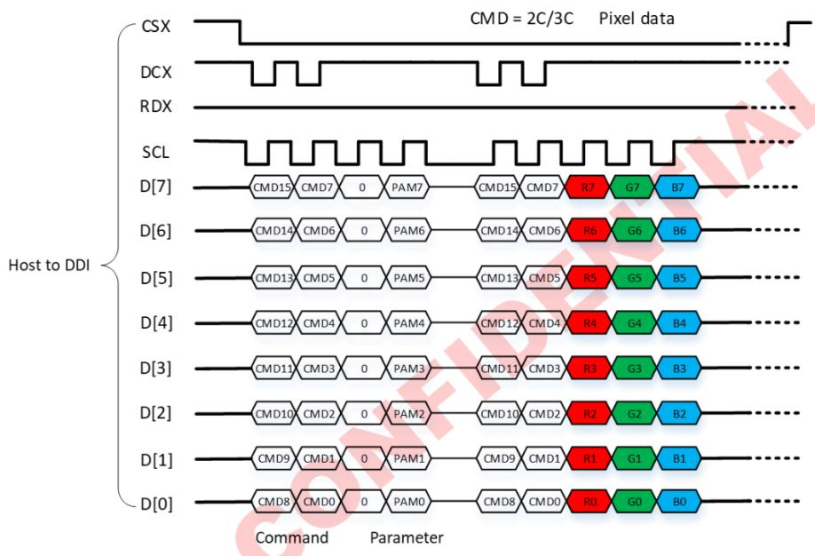

flowchart

```mermaid
graph TD
  CSX["CSX"] --> CMD1["CMD = 2C/3C"]
  DCX["DCX"] --> PAM1["PAM7"]
  RDX["RDX"] --> PAM2["PAM6"]
  SCL["SCL"] --> CMD15["CMD15"]
  SCL --> CMD7["CMD7\n0"]
  SCL --> CMD14["CMD14"]
  SCL --> CMD5["CMD5\n0"]
  SCL --> CMD12["CMD12"]
  SCL --> CMD11["CMD11"]
  SCL --> CMD9["CMD9\n0"]
  SCL --> CMD8["CMD8\n0"]
  
  subgraph Host to DDI ["Host to DDI"]
    direction TB
  D["7"] --> CMD15
  D["7"] --> CMD7
  D["7"] --> PAM7
  D["7"] --> CMD15
  D["7"] --> CMD7
  D["7"] --> R7["R7\nG7"]
  D["7"] --> B7["B7"]
  D["6"] --> CMD14
  D["6"] --> CMD6
  D["6"] --> PAM6
  D["6"] --> CMD14
  D["6"] --> CMD6
  D["6"] --> R6["R6\nG6"]
  D["6"] --> B6["B6"]
  D["5"] --> CMD13
  D["5"] --> CMD5
  D["5"] --> PAM5
  D["5"] --> CMD13
  D["5"] --> CMD5
  D["5"] --> R5["R5\nG5"]
  D["5"] --> B5["B5"]
  D["4"] --> CMD12
  D["4"] --> CMD4
  D["4"] --> PAM4
  D["4"] --> CMD12
  D["4"] --> CMD4
  D["4"] --> R4["R4\nG4"]
  D["4"] --> B4["B4"]
  D["3"] --> CMD11
  D["3"] --> CMD3
  D["3"] --> PAM3
  D["3"] --> CMD11
  D["3"] --> CMD3
  D["3"] --> R3["R3\nG3"]
  D["3"] --> B3["B3"]
  D["2"] --> CMD10
  D["2"] --> CMD2
  D["2"] --> PAM2
  D["2"] --> CMD10
  D["2"] --> CMD2
  D["2"] --> R2["R2\nG2"]
  D["2"] --> B2["B2"]
  D["1"] --> CMD9
  D["1"] --> CMD1
  D["1"] --> PAM1
  D["1"] --> CMD9
  D["1"] --> CMD1
  D["1"] --> R1["R1\nG1"]
  D["1"] --> B1["B1"]
  D["0"] --> CMD8
  D["0"] --> CMD0
  D["0"] --> PAM0
  D["0"] --> CMD8
  D["0"] --> CMD0
    Command["Command"] -.-> Parameter["Parameter"]
  end
```

The IFPF (0x3A00) defines the pixel format of the MCU interface, which is configured as 6: RGB666

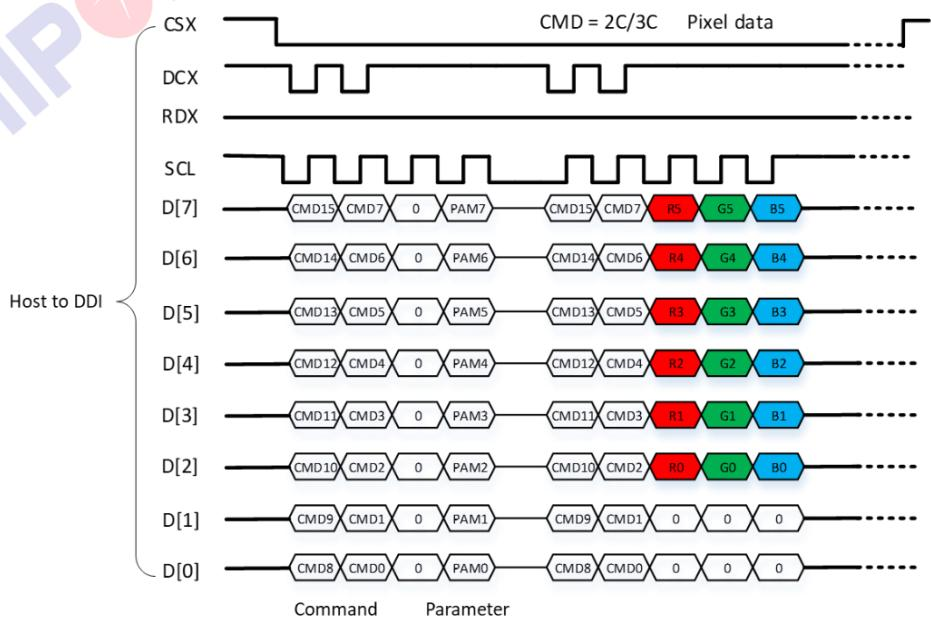

flowchart

```mermaid
graph TD
  subgraph CSX
    A["CMD = 2C/3C Pixel data"]
  end
  
  subgraph DCX
    B["Pixel data"]
  end
  
  subgraph RDX
    C["Pixel data"]
  end
  
  subgraph SCL
    D["&quot;D[7"]"]
    E["&quot;D[6"]"]
    F["&quot;D[5"]"]
    G["&quot;D[4"]"]
    H["&quot;D[3"]"]
    I["&quot;D[2"]"]
    J["&quot;D[1"]"]
    K["&quot;D[0"]"]
  end
  
  %% Config Details
  %% Command: CMD15, CMD7, 0, PAM7
  %% Parameter: CMD15, CMD7, R5, G5, B5
  %% Config Details: CMD14, CMD6, 0, PAM6
  %% Config Details: CMD14, CMD6, R4, G4, B4
  %% Config Details: CMD13, CMD5, 0, PAM5
  %% Config Details: CMD13, CMD5, R3, G3, B3
  %% Config Details: CMD12, CMD4, 0, PAM4
  %% Config Details: CMD12, CMD4, R2, G2, B2
  %% Config Details: CMD11, CMD3, 0, PAM3
  %% Config Details: CMD11, CMD3, R1, G1, B1
  %% Config Details: CMD10, CMD2, 0, PAM2
  %% Config Details: CMD10, CMD2, R0, G0, B0
  %% Config Details: CMD9, CMD1, 0, PAM1
  %% Config Details: CMD9, CMD1, 0, 0
  %% Config Details: CMD8, CMD0, 0, PAM0
  %% Config Details: CMD8, CMD0, 0, 0
```

The IFPF (0x3A00) defines the pixel format of the MCU interface, which is configured as 5: RGB565

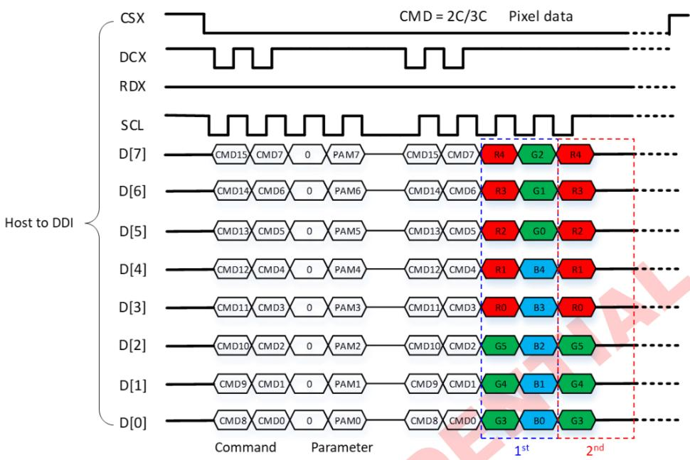

flowchart

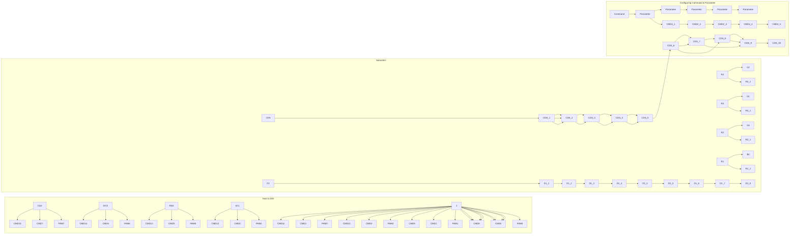
```mermaid
graph LR
  subgraph Host to DDI["Host to DDI"]
    direction TB
  CSX["CSX"] --> CMD15["CMD15"]
  CSX --> CMD7["CMD7"]
  CSX --> PAM7["PAM7"]
  DCX["DCX"] --> CMD14["CMD14"]
  DCX --> CMD6["CMD6"]
  DCX --> PAM6["PAM6"]
  RDX["RDX"] --> CMD13["CMD13"]
  RDX --> CMD5["CMD5"]
  RDX --> PAM5["PAM5"]
  SCL["SCL"] --> CMD12["CMD12"]
  SCL --> CMD4["CMD4"]
  SCL --> PAM4["PAM4"]
  D["7"] --> CMD11["CMD11"]
  D["7"] --> CMD3["CMD3"]
  D["7"] --> PAM3["PAM3"]
  D["6"] --> CMD10["CMD10"]
  D["6"] --> CMD2["CMD2"]
  D["6"] --> PAM2["PAM2"]
  D["5"] --> CMD9["CMD9"]
  D["5"] --> CMD1["CMD1"]
  D["5"] --> PAM1["PAM1"]
  D["4"] --> CMD8["CMD8"]
  D["4"] --> CMD0["CMD0"]
  D["4"] --> PAM0["PAM0"]
  D["3"] --> CMD8
  D["3"] --> CMD0
  D["2"] --> CMD8
  D["2"] --> CMD0
  D["1"] --> CMD8
  D["1"] --> CMD0
  end

  subgraph Configing["Configuring Command & Parameter"]
  Command1["Command"] --> Command2["Parameter"]
  Command2 --> Command3["Parameter"]
  Command3 --> Command4["Parameter"]
  Command4 --> Command5["Parameter"]
  Command5 --> Command6["Parameter"]
  end

  subgraph Subusters [Subusters]
  R4["R4"] --> G2["G2"]
  R4 --> R4_1["R4_1"]
  R3["R3"] --> G1["G1"]
  R3 --> R3_1["R3_1"]
  R2["R2"] --> G0["G0"]
  R2 --> R2_1["R2_1"]
  R1["R1"] --> B4["B4"]
  R1 --> R1_1["R1_1"]

  CDS["CDS"] --> CDS_1["CDS_1"]
  CDS_1 --> CDS_2["CDS_2"]
  CDS_2 --> CDS_3["CDS_3"]
  CDS_3 --> CDS_4["CDS_4"]
  CDS_4 --> CDS_5["CDS_5"]
  end

  subgraph Subusters [Subusters]
  D1["D1"] --> D1_1["D1_1"]
  D1_1 --> D1_2["D1_2"]
  D1_2 --> D1_3["D1_3"]
  D1_3 --> D1_4["D1_4"]
  D1_4 --> D1_5["D1_5"]
  end

  subgraph Configing [Configuring Parameters]
  Command2 --> CMD2_1["CMD2_1"]
  CMD2_1 --> CMD2_2["CMD2_2"]
  CMD2_2 --> CMD2_3["CMD2_3"]
  CMD2_3 --> CMD2_4["CMD2_4"]
  CMD2_4 --> CMD2_5["CMD2_5"]
  end

  subgraph Subusters [Subusters with Subsets]
  CDS_1 --> CDS_2
  CDS_1 --> CDS_2
  CDS_2 --> CDS_3
  CDS_3 --> CDS_4
  CDS_4 --> CDS_5
  end

  subgraph Configing [Configuring Parameters]
  CDS_5 --> CDS_6["CDS_6"]
  CDS_6 --> CDS_7["CDS_7"]
  CDS_7 --> CDS_8["CDS_8"]
  CDS_8 --> CDS_9["CDS_9"]
  end

  subgraph Subusters [Subsets with Subsets]
  D1_5 --> D1_6["D1_5"]
  D1_6 --> D1_7["D1_6"]
  D1_7 --> D1_8["D1_7"]
  D1_8 --> D1_9["D1_8"]
  end

  subgraph Configing [Configuring Parameters]
  CDS_6 --> CDS_7
  CDS_6 --> CDS_8
  CDS_7 --> CDS_9
  CDS_8 --> CDS_9
  CDS_9 --> CDS_10
  end
```

# 5.2.2 MCU Read Cycle and Sequence

The following read cycle (RDX high-low-high sequence) specifies the timing for the host to read command and data from the display module through the MCU interface.

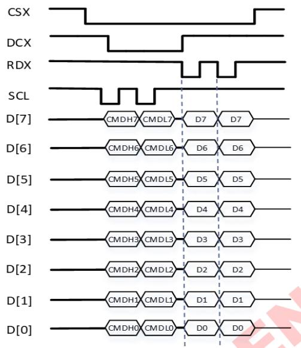

flowchart

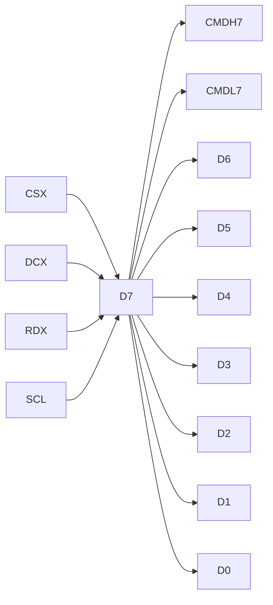
```mermaid
graph LR
  CSX["CSX"] --> D7["D7"]
  DCX["DCX"] --> D7["D7"]
  RDX["RDX"] --> D7["D7"]
  SCL["SCL"] --> D7["D7"]
  D7 --> CMDH7["CMDH7"]
  D7 --> CMDL7["CMDL7"]
  D7 --> D6["D6"]
  D7 --> D5["D5"]
  D7 --> D4["D4"]
  D7 --> D3["D3"]
  D7 --> D2["D2"]
  D7 --> D1["D1"]
  D7 --> D0["D0"]
```

1 Dummy Parameter

# 5.3 3-wire/4-wire SPI Interface

The CO6300 supports 3-wire/4-wire SPI interface. (Refer to the below figures)

# 5.3.1 Write Cycle and Sequence

The 3-wire/4-wire SPI interface utilizes DCX, CSX, SCL and SDA signals. SCL is driven from high to low then pulled back to high during the write cycle. The host processor provides information during the write cycle while the display module reads the host processor information on the rising edge of SCL.

The 3-wire/4-wire SPI interface write command sequences are described in the following figure as below.

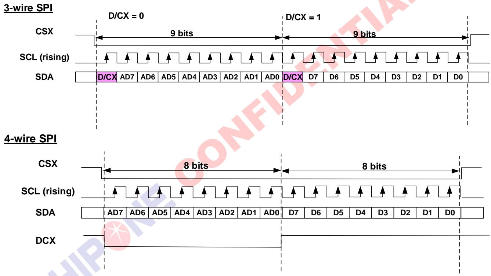

# 5.3.2 Read Cycle and Sequence

The 3-wire/4-wire SPI interface utilizes DCX, CSX, SCL and SDA signals. SCL is driven from high to low then pulled back to high during the read cycle. The host processor provides information during the read cycle while the display module reads the host processor information on the rising edge of SCL.

The 3-wire/4-wire SPI interface read command sequences are described in the following figure as below.

3-wire SPI (05h/0Ah/0B/0Ch/0Dh/0Eh/0Fh/52h/54h/56h/59h/64h/AAh/AFh/DAh/DBh/DCh/E1h/E2h/E3h) for 8 bit read  
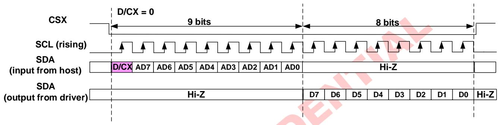

text_image

CSX
D/CX = 0
9 bits
8 bits
SCL (rising)
SDA
(input from host)
Hi-Z
SDA
(output from driver)
Hi-Z
D7 D6 D5 D4 D3 D2 D1 D0 Hi-Z

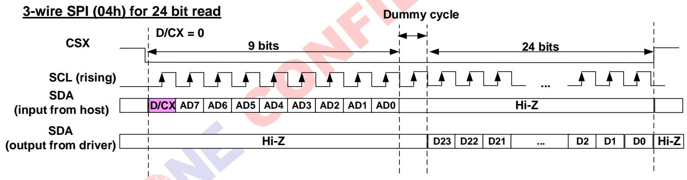

text_image

3-wire SPI (04h) for 24 bit read
CSX
D/CX = 0
9 bits
Dummy cycle
SCL (rising)
...
SDA
(input from host)
Hi-Z
SDA
(output from driver)
Hi-Z
D23 D22 D21 ...
D2 D1 D0 Hi-Z

4-wire SPI (05h/0Ah/0B/0Ch/0Dh/0Eh/0Fh/52h/54h/56h/59h/64h/AAh/AFh/DAh/DBh/DCh/E1h/E2h/E3h) for 8 bit read  
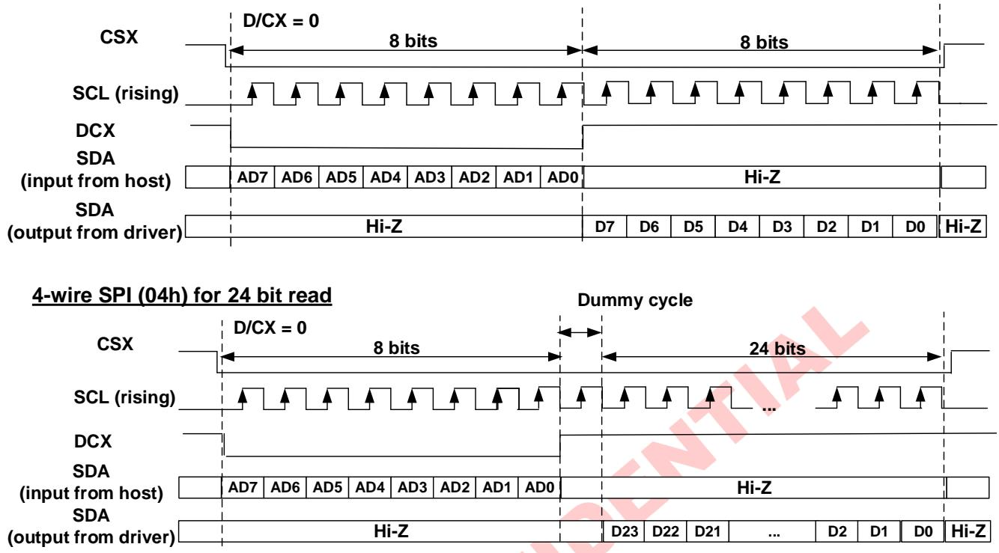

# 5.3.3 Break and Pause Sequence

The host processor can break a read or write sequence by pulling the CSX signal high during a command or data byte. The display module shall reset its interface so it will be ready to receive the same byte when CSX is again driven low.

The host processor can pause a read or write sequence by pulling the CSX signal high between command or data bytes. The display module shall wait for the host processor to drive CSX low before continuing the read or write sequence at the point where the sequence was paused.

# 1. Middle of frame

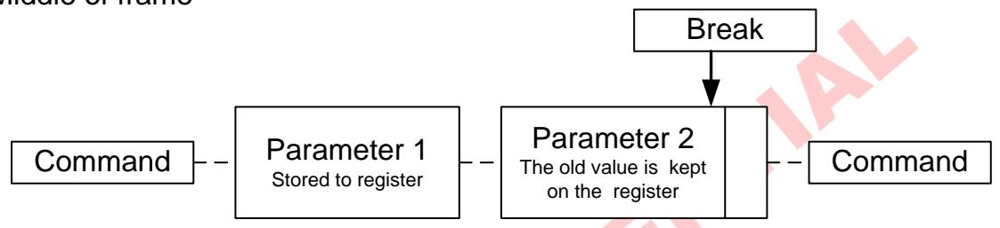

flowchart

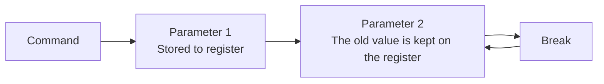
```mermaid
graph LR
  A["Command"] --> B["Parameter 1\nStored to register"]
  B --> C["Parameter 2\nThe old value is kept on the register"]
  C --> D["Break"]
  D --> C
```

# 2. Between frames

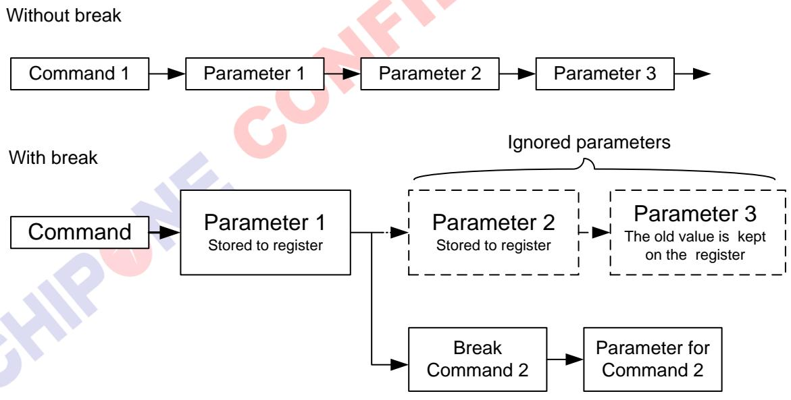

flowchart

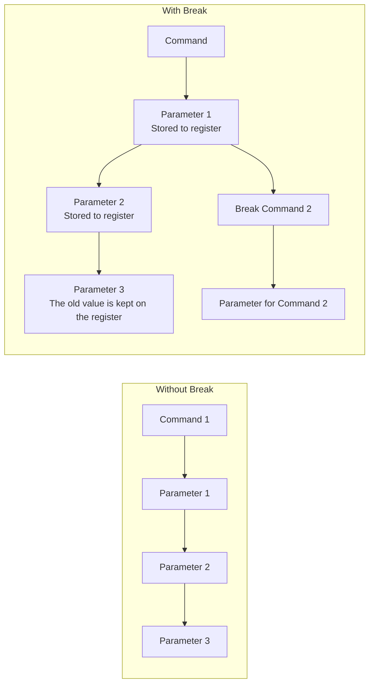
```mermaid
graph LR
  subgraph Without Break
  A["Command 1"] --> B["Parameter 1"]
  B --> C["Parameter 2"]
  C --> D["Parameter 3"]
  end

  subgraph With Break
  E["Command"] --> F["Parameter 1\nStored to register"]
  F --> G["Parameter 2\nStored to register"]
  G --> H["Parameter 3\nThe old value is kept on the register"]
  F --> I["Break Command 2"]
  I --> J["Parameter for Command 2"]
  end

  %% Note: Ignored parameters are highlighted in the 'With Break' section.
```

Break can be e.g. another command or noise pulse.

# 5.4 QUAD SPI Interface

CO6300 would support QUAD SPI interface (Refer to the below figures). QUAD SPI provides 1-wire for writing / reading command, and 4-wire for writing pixel data. CSX is the chip selection and it is low active property. SCL is driven from high to low then pulled back to high during the write cycle. The host processor provides information during the write cycle while the display module reads the host processor information on the rising edge of SCL.

# 5.4.1 QUAD SPI command format

The QUAD SPI interface contains three operating modes, Standard SPI, Dual SPI and Quad SPI. These modes structure as below.

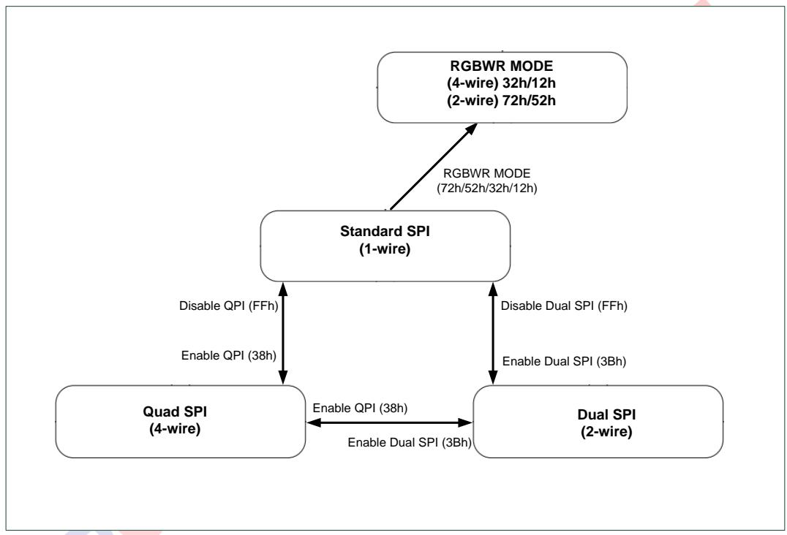

flowchart

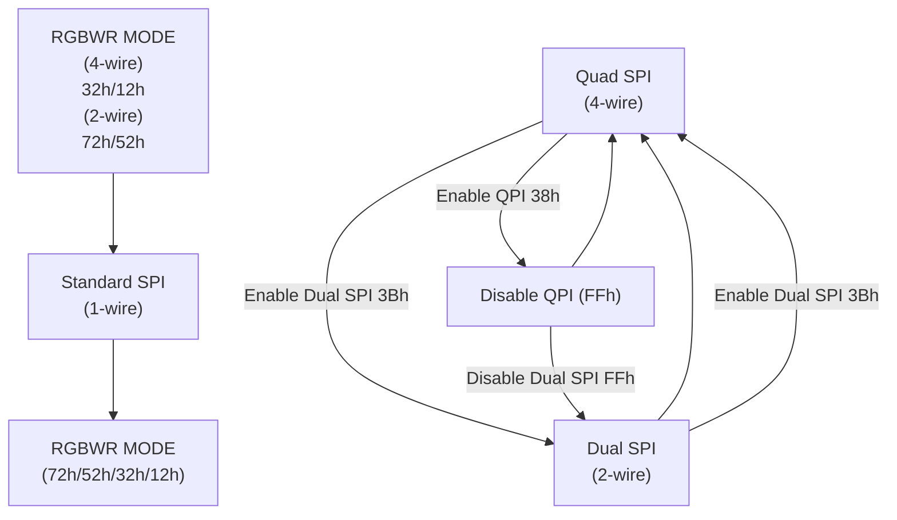
```mermaid
graph TD
  A["RGBWR MODE\n(4-wire)\n32h/12h\n(2-wire)\n72h/52h"] --> B["Standard SPI\n(1-wire)"]
  B --> C["RGBWR MODE\n(72h/52h/32h/12h)"]
  D["Quad SPI\n(4-wire)"] -->|"Enable QPI 38h"| E["Disable QPI (FFh)"]
  D -->|"Enable Dual SPI 3Bh"| F["Dual SPI\n(2-wire)"]
  E --> D
  F --> D
  E -->|"Disable Dual SPI FFh"| F
  F -->|"Enable Dual SPI 3Bh"| D
```

The QUAD SPI interface instruction code as below:

<table><tr><td>Instruction code</td><td>Description</td></tr><tr><td>0xFF</td><td>Reset dual &amp; quad SPI to single SPI</td></tr><tr><td>0x3B</td><td>Enter dual SPI</td></tr><tr><td>0x38</td><td>Enter quad SPI</td></tr><tr><td>0x02</td><td>Command / pixel write</td></tr><tr><td>0x03</td><td>Command / pixel read</td></tr><tr><td>0x32</td><td>4-wire pixel write (address: 24clk)</td></tr><tr><td>0x12</td><td>4-wire pixel write (address: 6clk)</td></tr><tr><td>0x72</td><td>2-wire pixel write (address: 24clk)</td></tr><tr><td>0x52</td><td>2-wire pixel write (address: 12clk)</td></tr></table>

# 5.4.2 Write Cycle and Sequence

The QUAD SPI interface write command sequences are described in the following figure as below.

QSPI write protocol contain as below :

Instruction[7:0] = 02h

AD[23:0] = {8'h00, CMD[7:0], 8'h00}

PAM[7:0]

Command write

Driver IC command address

Driver IC parameters

# QSPI 1-wire write

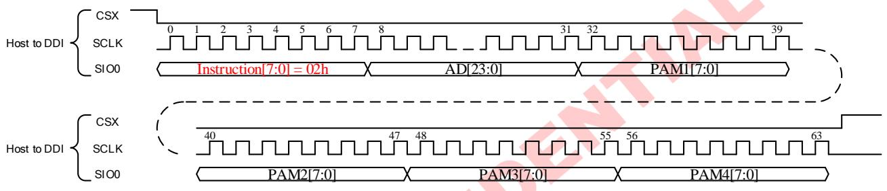

text_image

Host to DDI {CSX
SCLK
SIO0
Instruction[7:0] = 02h
AD[23:0]
PAM1[7:0]
Host to DDI {CSX
SCLK
SIO0
40
47
48
55
56
63
PAM2[7:0]
PAM3[7:0]
PAM4[7:0]

# QSPI 2-wire write

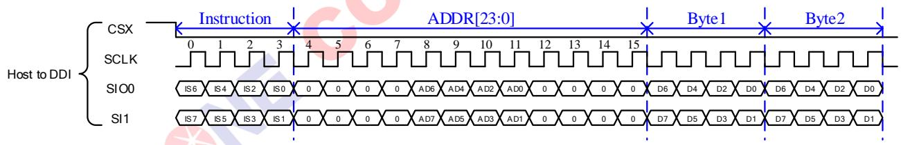

text_image

Instruction
ADDR[23:0]
Byte1
Byte2
CSX
0 1 2 3 4 5 6 7 8 9 10 11 12 13 14 15
SCLK
Host to DDI
SI00
IS6 IS4 IS2 IS0 0 0 0 0 AD6 AD4 AD2 AD0 0 0 0 0 D6 D4 D2 D0 D6 D4 D2 D0
SI1
IS7 IS5 IS3 IS1 0 0 0 0 AD7 AD5 AD3 AD1 0 0 0 0 D7 D5 D3 D1 D7 D5 D3 D1

# QSPI 4-wire write

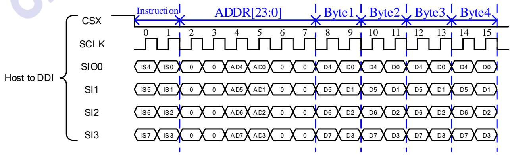

text_image

CSX
Host to DDI
Instruction
ADDR[23:0]
Byte1
Byte2
Byte3
Byte4
SCLK
0 1 2 3 4 5 6 7 8 9 10 11 12 13 14 15
SI00
IS4 IS0 0 0 AD4 AD0 0 0 D4 D0 D4 D0 D4 D0 D4 D0
SI1
IS5 IS1 0 0 AD5 AD1 0 0 D5 D1 D5 D1 D5 D1 D5 D1
SI2
IS6 IS2 0 0 AD6 AD2 0 0 D6 D2 D6 D2 D6 D2 D6 D2
SI3
IS7 IS3 0 0 AD7 AD3 0 0 D7 D3 D7 D3 D7 D3 D7 D3

The QUAD SPI interface supports different display data formats with six color depths, RGB888, RGB666, RGB565, RGB332, RGB111, GRAY256.

# RGB888:

1-wire  
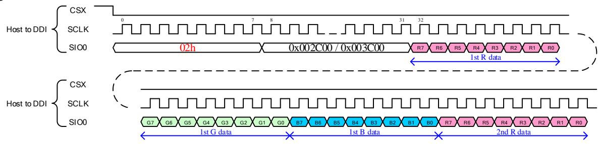

text_image

Host to DDI {CSX
SCLK
SIO0 0 7 8 31 32
02h 0x002C00 / 0x003C00 R7 R6 R5 R4 R3 R2 R1 R0
1st R data
Host to DDI {CSX
SCLK
SIO0 G7 G6 G5 G4 G3 G2 G1 G0 B7 B6 B5 B4 B3 B2 B1 B0 R7 R6 R5 R4 R3 R2 R1 R0
1st G data 1st B data 2nd R data

2-wire  
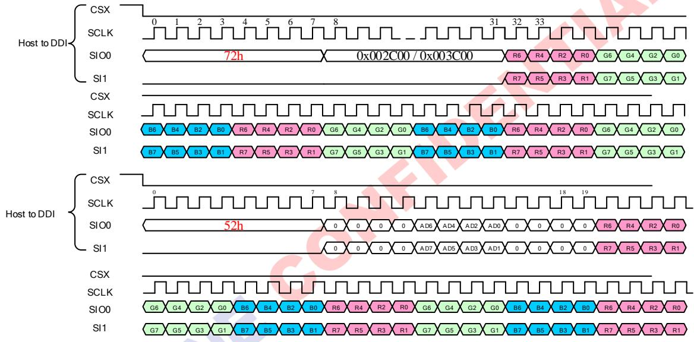

text_image

Host to DDI
CSX
SCLK
SI00
72h
0x002C00 / 0x003C00
R6 R4 R2 R0 G6 G4 G2 G0
SI1
R7 R5 R3 R1 G7 G5 G3 G1
CSX
SCLK
SI00
B6 B4 B2 B0 R6 R4 R2 R0 G6 G4 G2 G0 B6 B4 B2 B0 R6 R4 R2 R0 G6 G4 G2 G0
SI1
B7 B5 B3 B1 R7 R5 R3 R1 G7 G5 G3 G1 B7 B5 B3 B1 R7 R5 R3 R1 G7 G5 G3 G1
Host to DDI
CSX
SCLK
SI00
52h
0 0 0 0 AD6 AD4 AD2 AD0 0 0 0 0 R6 R4 R2 R0
SI1
0 0 0 0 AD7 AD5 AD3 AD1 0 0 0 0 R7 R5 R3 R1
CSX
SCLK
SI00
G6 G4 G2 G0 B6 B4 B2 B0 R6 R4 R2 R0 G6 G4 G2 G0 B6 B4 B2 B0 R6 R4 R2 R0
SI1
G7 G5 G3 G1 B7 B5 B3 B1 R7 R5 R3 R1 G7 G5 G3 G1 B7 B5 B3 B1 R7 R5 R3 R1

4-wire  
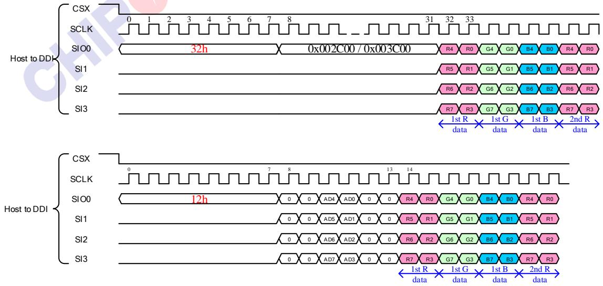

text_image

CSX
0 1 2 3 4 5 6 7 8 31 32 33
SCLK
Host to DDI
SI00
32h
0x002C00 / 0x003C00
R4 R0 G4 G0 B4 B0 R4 R0
SI1
R5 R1 G5 G1 B5 B1 R5 R1
SI2
R6 R2 G6 G2 B6 B2 R6 R2
SI3
R7 R3 G7 G3 B7 B3 R7 R3
1st R data 1st G data 1st B data 2nd R data
Host to DDI
CSX
0
7 8
13 14
SCLK
12h
SI00
0 0 AD4 AD0 0 0 R4 R0 G4 G0 B4 B0 R4 R0
SI1
0 0 AD5 AD1 0 0 R5 R1 G5 G1 B5 B1 R5 R1
SI2
0 0 AD6 AD2 0 0 R6 R2 G6 G2 B6 B2 R6 R2
SI3
0 0 AD7 AD3 0 0 R7 R3 G7 G3 B7 B3 R7 R3
1st R data 1st G data 1st B data 2nd R data

# RGB666:

1-wire  
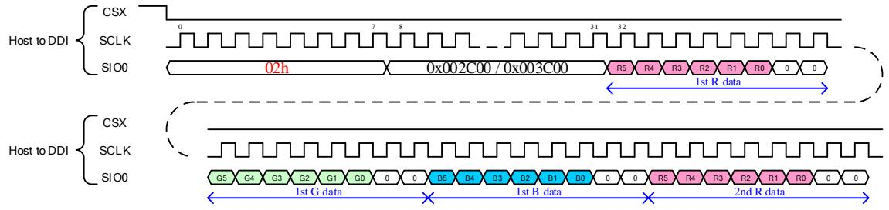

text_image

Host to DDI
CSX
SCLK
SIO0
02h
0x002C00 / 0x003C00
R5 R4 R3 R2 R1 R0 0 0
1st R data
Host to DDI
CSX
SCLK
SIO0
G5 G4 G3 G2 G1 G0 0 0 B5 B4 B3 B2 B1 B0 0 0 R5 R4 R3 R2 R1 R0 0 0
1st G data
1st B data
2nd R data

2-wire  
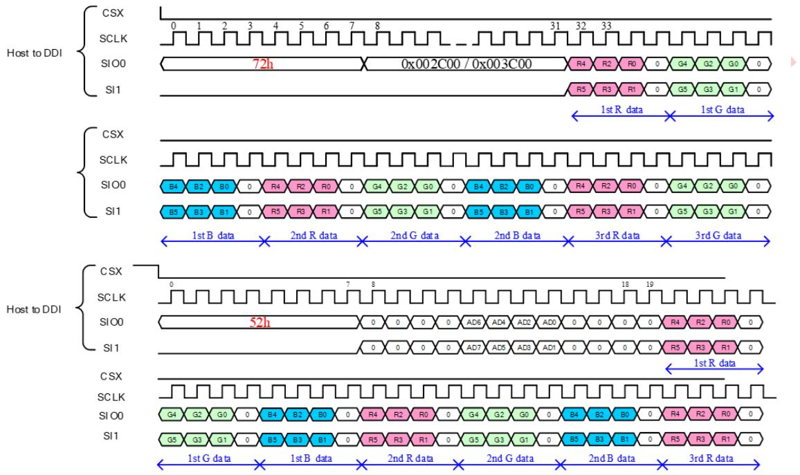

text_image

Host to DDI
CSX
SCLK
SI00
72h
0x00 2C00 / 0x00 3C00
R4 R2 R0 0 G4 G2 G0 0
SI1
R5 R3 R1 0 G5 G3 G1 0
1st R data × 1st G data →
CSX
SCLK
SI00
B4 B2 B0 0 R4 R2 R0 0 G4 G2 G0 0 B4 B2 B0 0 R4 R2 R0 0 G4 G2 G0 0
SI1 B5 B3 B1 0 R5 R3 R1 0 G5 G3 G1 0 B5 B3 B1 0 R5 R3 R1 0 G5 G3 G1 0
1st B data × 2nd R data × 2nd G data × 2nd B data × 3rd R data × 3rd G data →
Host to DDI
CSX
SCLK
SI00
52h
0 0 0 0 AD6 AD4 AD2 AD0 0 0 0 0 R4 R2 R0 0
SI1
0 0 0 0 AD7 AD6 AD8 AD1 0 0 0 0 R5 R3 R1 0
1st R data →
CSX
SCLK
SI00
G4 G2 G0 0 B4 B2 B0 0 R4 R2 R0 0 G4 G2 G0 0 B4 B2 B0 0 R4 R2 R0 0
SI1 G5 G3 G1 0 B5 B3 B1 0 R5 R3 R1 0 G5 G3 G1 0 B5 B3 B1 0 R5 R3 R1 0
1st G data × 1st B data × 2nd R data × 2nd G data × 2nd B data × 3rd R data →

4-wire  
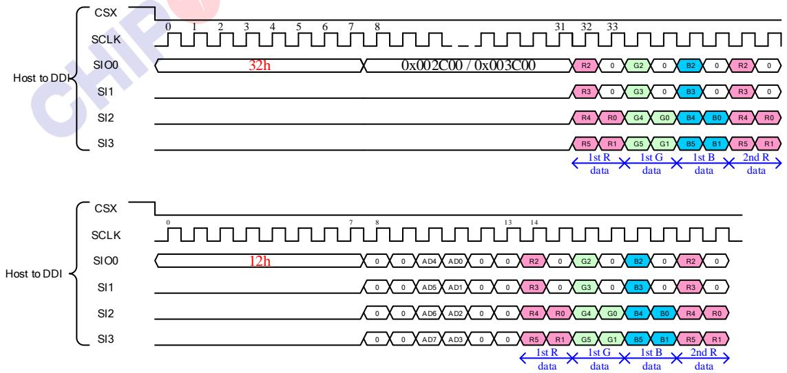

text_image

CSX
SCLK
0 1 2 3 4 5 6 7 8 31 32 33
Host to DDI
SI00
32h
0x002C00 / 0x003C00
R2 0 G2 0 B2 0 R2 0
SI1
R3 0 G3 0 B3 0 R3 0
SI2
R4 R0 G4 G0 B4 B0 R4 R0
SI3
R5 R1 G5 G1 B5 B1 R5 R1
1st R data 1st G data 1st B data 2nd R data
Host to DDI
CSX
SCLK
0 7 8 13 14
12h
SI00
0 0 AD4 AD0 0 0 R2 0 G2 0 B2 0 R2 0
SI1
0 0 AD5 AD1 0 0 R3 0 G3 0 B3 0 R3 0
SI2
0 0 AD6 AD2 0 0 R4 R0 G4 G0 B4 B0 R4 R0
SI3
0 0 AD7 AD3 0 0 R5 R1 G5 G1 B5 B1 R5 R1
1st R data 1st G data 1st B data 2nd R data

# RGB565:

1-wire  
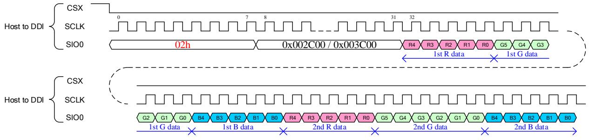

text_image

Host to DDI
CSX
SCLK
SIO0
0
7
8
31
32
02h
0x002C00 / 0x003C00
R4 R3 R2 R1 R0 G5 G4 G3
1st R data
1st G data
Host to DDI
CSX
SCLK
SIO0
G2 G1 G0 B4 B3 B2 B1 B0 R4 R3 R2 R1 R0 G5 G4 G3 G2 G1 G0 B4 B3 B2 B1 B0
1st G data
1st B data
2nd R data
2nd G data
2nd B data

2-wire  
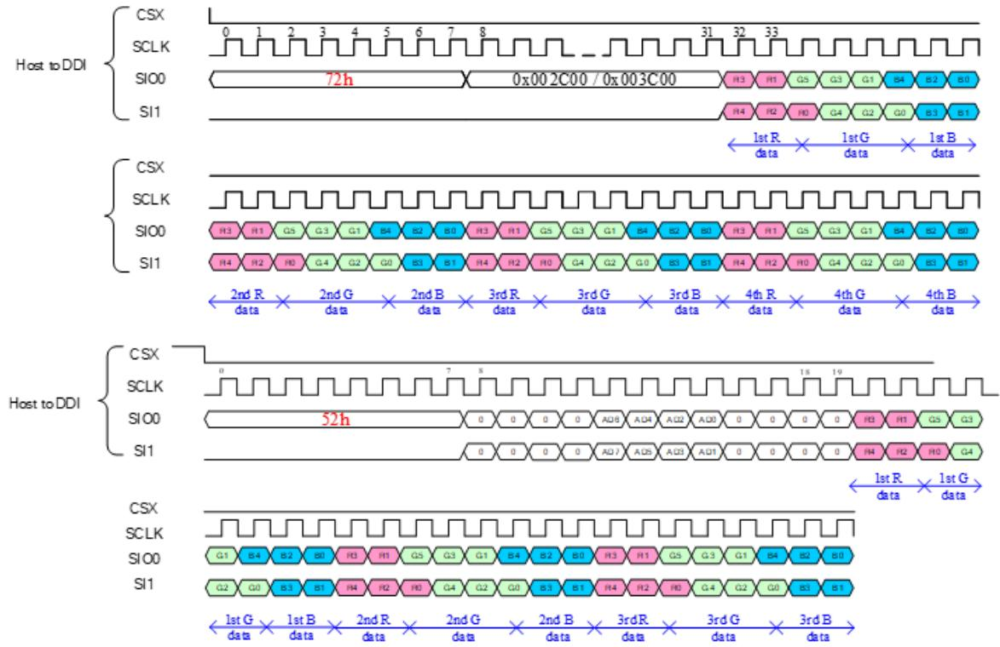

text_image

Host to DDI
CSX
SCLK
SI00
SI1
72h
0x00 2C00 / 0x003C00
R3 R1 G5 G3 G1 B4 B2 B1
R4 R2 H0 G4 G2 G0 B3 B1
1st R data 1st G data 1st B data
CSX
SCLK
SI00
SI1
R3 R1 G5 G3 G1 B4 B2 B1
R3 R1 G5 G3 G1 B4 B2 B1
R3 R1 G5 G3 G1 B4 B2 B1
R4 R2 H0 G4 G2 G0 B3 B1
R4 R2 H0 G4 G2 G0 B3 B1
2nd R data 2nd G data 2nd B data 3rd R data 3rd G data 3rd B data 4th R data 4th G data 4th B data
Host to DDI
CSX
SCLK
SI00
SI1
52h
0 7 8 18 19
0 0 0 0 AD6 AD4 AD2 AD0 0 0 0 0 H3 H1 G5 G3
0 0 0 0 AD7 AD5 AD3 AD1 0 0 0 0 H4 H2 H0 G4
1st R data 1st G data
CSX
SCLK
SI00
SI1
G1 B4 B2 B0 F3 F1 G5 G3 G1 B4 B2 B1
G2 G0 B3 B1 F4 F2 F0 C4 C2 C0 B3 B1
1st G data 1st B data 2nd R data 2nd G data 2nd B data 3rd R data 3rd G data 3rd B data

4-wire  
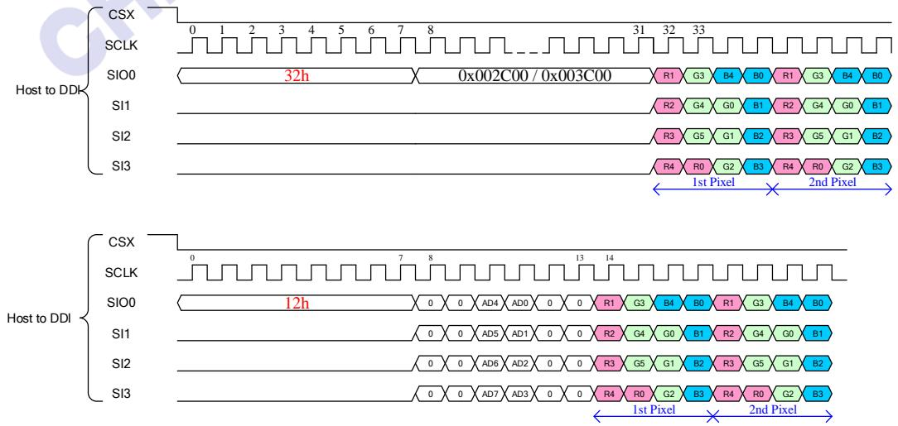

text_image

CSX
SCLK
0 1 2 3 4 5 6 7 8
Host to DDI
SI00
32h
0x002C00 / 0x003C00
R1 G3 B4 B0 R1 G3 B4 B0
SI1
R2 G4 G0 B1 R2 G4 G0 B1
SI2
R3 G5 G1 B2 R3 G5 G1 B2
SI3
R4 R0 G2 B3 R4 R0 G2 B3
1st Pixel 2nd Pixel
CSX
SCLK
0 7 8 13 14
Host to DDI
SI00
12h
0 0 AD4 AD0 0 0 R1 G3 B4 B0 R1 G3 B4 B0
SI1
0 0 AD5 AD1 0 0 R2 G4 G0 B1 R2 G4 G0 B1
SI2
0 0 AD6 AD2 0 0 R3 G5 G1 B2 R3 G5 G1 B2
SI3
0 0 AD7 AD3 0 0 R4 R0 G2 B3 R4 R0 G2 B3
1st Pixel 2nd Pixel

# RGB332:

1-wire  
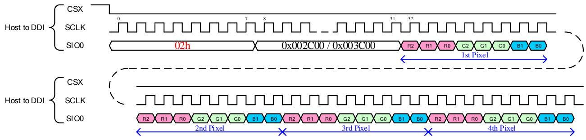

text_image

Host to DDI {CSX
SCLK
SI00 0 7 8 31 32
02h 0x002C00 / 0x003C00 R2 R1 R0 G2 G1 G0 B1 B0 B0
1st Pixel
Host to DDI {CSX
SCLK
SI00 R2 R1 R0 G2 G1 G0 B1 B0 R2 R1 R0 G2 G1 G0 B1 B0 R2 R1 R0 G2 G1 G0 B1 B0
2nd Pixel 3rd Pixel 4th Pixel

2-wire  
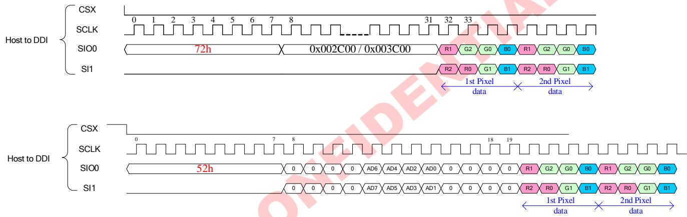

text_image

Host to DDI
CSX
SCLK
0 1 2 3 4 5 6 7 8
72h
0x002C00 / 0x003C00
R1 G2 G0 B0 R1 G2 G0 B0
SI00
R2 R0 G1 B1 R2 R0 G1 B1
1st Pixel data 2nd Pixel data
Host to DDI
CSX
SCLK
SIO0
52h
0 0 0 0 AD6 AD4 AD2 AD0 0 0 0 0 R1 G2 G0 B0 R1 G2 G0 B0
SI1
0 0 0 0 AD7 AD5 AD3 AD1 0 0 0 0 R2 R0 G1 B1 R2 R0 G1 B1
1st Pixel data 2nd Pixel data

4-wire  
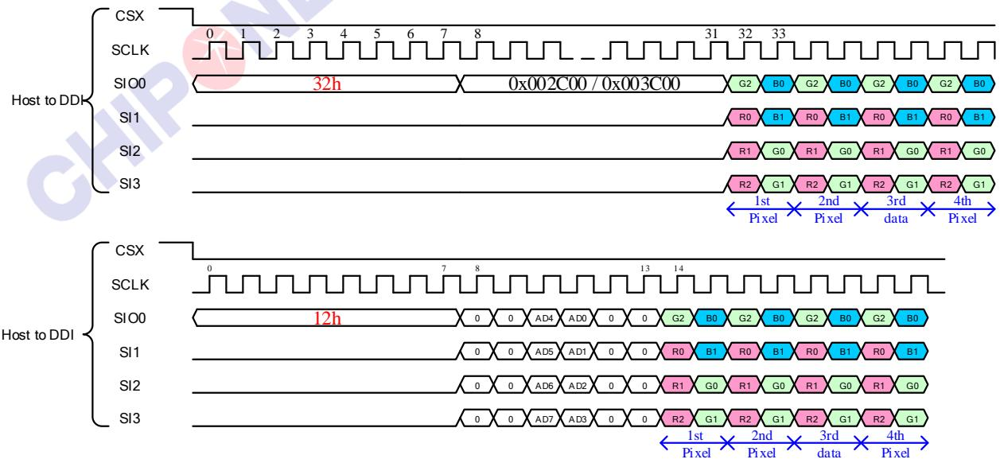

text_image

CSX
0 1 2 3 4 5 6 7 8 31 32 33
SCLK
SI00 32h 0x002C00 / 0x003C00 G2 B0 G2 B0 G2 B0 G2 B0
SI1 R0 B1 R0 B1 R0 B1 R0 B1
SI2 R1 G0 R1 G0 R1 G0 R1 G0
SI3 R2 G1 R2 G1 R2 G1 R2 G1
Host to DDI
CSX
0 7 8 13 14
SCLK
SI00 12h 0 0 AD4 AD0 0 0 G2 B0 G2 B0 G2 B0
SI1 0 0 AD5 AD1 0 0 R0 B1 R0 B1 R0 B1
SI2 0 0 AD6 AD2 0 0 R1 G0 R1 G0 R1 G0
SI3 0 0 AD7 AD3 0 0 R2 G1 R2 G1 R2 G1 R2 G1
1st Pixel 2nd Pixel 3rd data 4th Pixel

# RGB111:

0RGB0RGB  
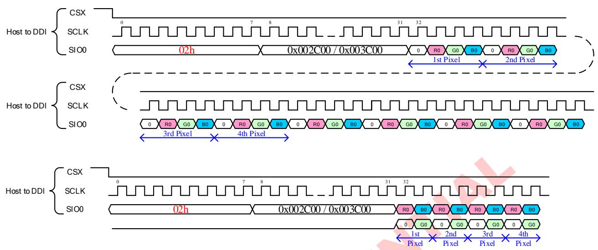

00RGBRGB  
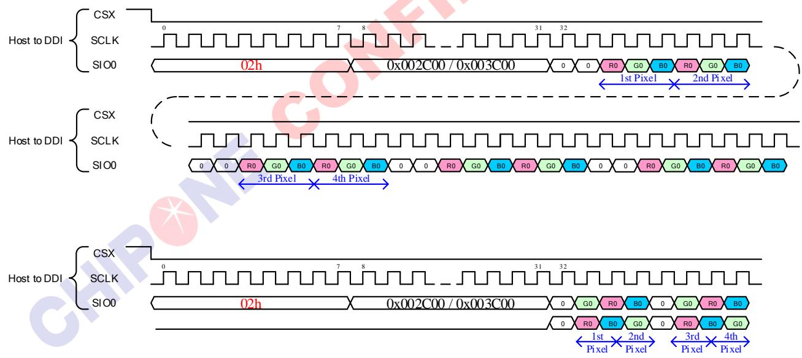

# GRAY256:

1-wire  
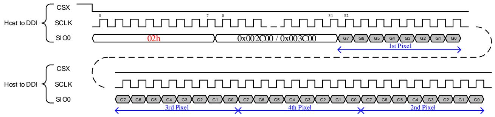

text_image

Host to DDI {CSX
SCLK
SIO0
02h
0x002C00 / 0x003C00
G7 G6 G5 G4 G3 G2 G1 G0 G7 G6 G5 G4 G3 G2 G1 G0 G7 G6 G5 G4 G3 G2 G1 G0
1st Pixel
Host to DDI {CSX
SCLK
SIO0
G7 G6 G5 G4 G3 G2 G1 G0 G7 G6 G5 G4 G3 G2 G1 G0
3rd Pixel
4th Pixel
2nd Pixel

4-wire  
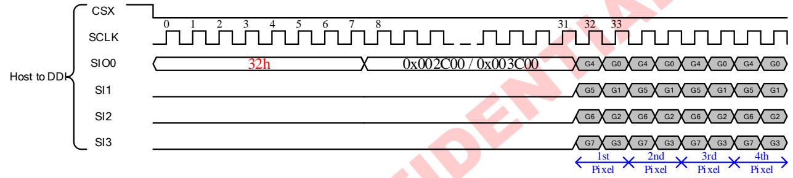

text_image

CSX
SCLK
Host to DDI
0 1 2 3 4 5 6 7 8
31 32 33
32h
0x002C00 / 0x003C00
G4 G0 G4 G0 G4 G0 G4 G0
SI1
G5 G1 G5 G1 G5 G1 G5 G1
SI2
G6 G2 G6 G2 G6 G2 G6 G2
SI3
G7 G3 G7 G3 G7 G3 G7 G3
1st Pixel 2nd Pixel 3rd Pixel 4th Pixel

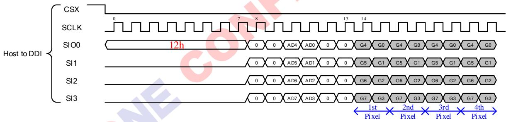

text_image

CSX
SCLK
Host to DDI
SI00
12h
SI1
SI2
SI3
0 0 AD4 AD0 0 0 G4 G0 G4 G0 G4 G0 G4 G0
0 0 AD5 AD1 0 0 G5 G1 G5 G1 G5 G1 G5 G1
0 0 AD6 AD2 0 0 G6 G2 G6 G2 G6 G2 G6 G2
0 0 AD7 AD3 0 0 G7 G3 G7 G3 G7 G3 G7 G3
1st Pixel 2nd Pixel 3rd Pixel 4th Pixel

# 5.4.3 Read Cycle and Sequence

The QUAD SPI interface read mode are described in the following figure as below.

Instruction[7:0] = 03h

AD[23:0] = {8'h00, CMD[7:0], 8'h00}

Dout[7:0]

Command read

Driver IC command address

Driver IC output to host

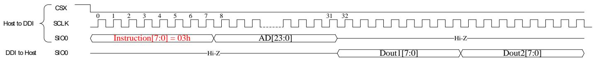

text_image

Host to DDI { CSX
SCLK
SO0
DDI to Host { SO0
Instruction[7:0] = 03h
AD[23:0]
Hi-Z
Hi-Z
Dout1[7:0]
Dout2[7:0]

# 5.4.4 QUAD SPI Function

# 1.work mode change

The QUAD SPI interface utilizes CSX, SCL, SIO0, SI1, SI2 and SI3 signals. SCL is driven from high to low then pulled back to high during the write cycle. The host processor provides information during the write cycle while the display module reads the host processor information on the rising edge of SCL.

The QUAD SPI interface Send instruction in current mode to change to new mode.

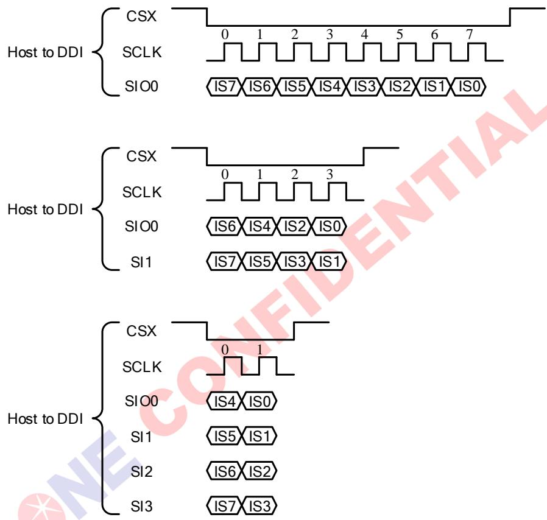

# 2. Reset Function

If the host is operating in 1-wire SPI protocol and the driver IC is operating in 2-wire or 4-wire SPI protocol, then the DDIC interface is reset to 1-wire SPI.

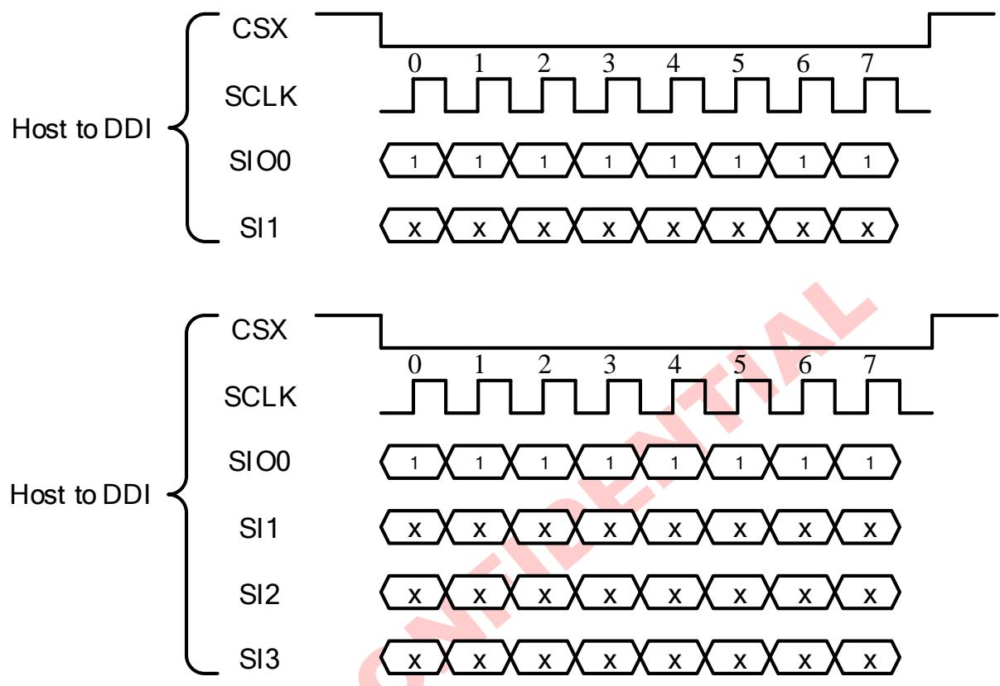

# 5.5 Tearing Effect Output

The tearing effect output line supplies to the HOST a panel synchronization signal. This signal can be enabled or disabled by the Tearing Effect Line off and on commands. The mode of the tearing effect signal is defined by the parameter of the set\_tear\_on (35h) and set\_tear\_scanline(44h) commands. The signal can be used by the HOST to synchronize internal VSYNC when displaying video images.

# 5.5.1 Tearing Effect Line Mode

# Mode 1,

The tearing effect output signal consist of V-sync and V-Blanking information only:

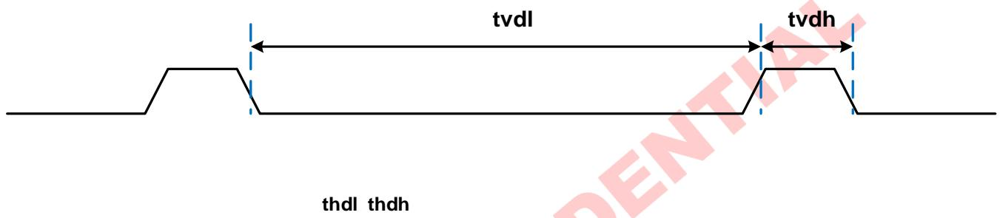

text_image

tvdl
tvdh
thdl thdh

tvdh = The LCD display is not updated from the frame memory.

tvdI = The LCD display is updated from the frame memory.

# Mode 2,

The tearing effect output signal consist of V-Blanking and H-Blanking which are included of V-sync and H-sync information:

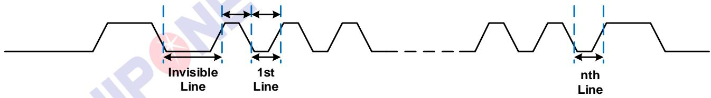

text_image

Invisible
Line
1st
Line
nth
Line

thdh = The display is not updated from the frame memory.

thdl = The display is updated from the frame memory.

n = Vertical scanning resolution

# Mode 3,

This mode turn on the tearing effect output signal when vertical scanning reaches line N. In below figure, it shows that TE only output one line period pulse that can be selected from 2nd line to 1280th line by register 44h.

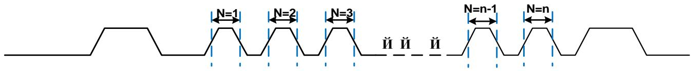

text_image

N=1
N=2
N=3
и и и
N=n-1
N=n

N = The N-th scanning line which set by register N[15:0] of command STESL(44h).

n = Vertical scanning resolution

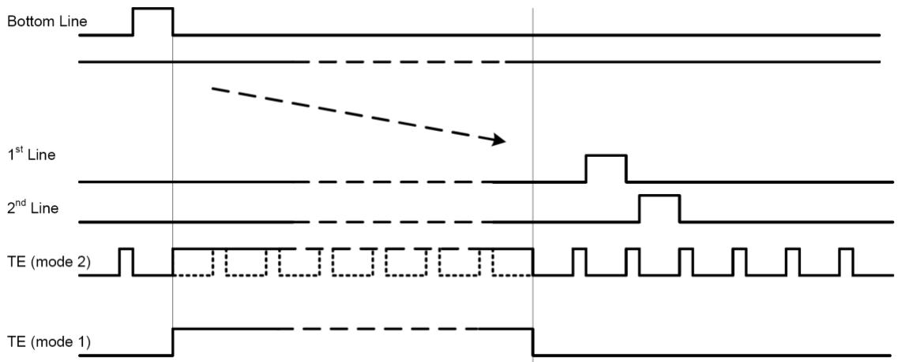

flowchart

```mermaid
graph LR
  subgraph Bottom_Line ["Bottom Line"]
  A["Start"] --> B["Step Up"]
  B --> C["End"]
  end

  subgraph sg_1st_Line_1st_Line["1st_Line [\"1st Line\"]"]
    D["Dashed Arrow"] -.-> E["Transition Point"]
  E --> F["Step Up"]
  F --> G["End"]
  end

  subgraph sg_2nd_Line_2nd_Line["2nd_Line [\"2nd Line\"]"]
    H["Dashed Arrow"] -.-> I["Transition Point"]
  I --> J["Step Up"]
  J --> K["End"]
  end

  subgraph TE_Models ["TE (mode 2)"]
    L["Dotted Box"] -.-> M["Transition Point"]
  M --> N["Step Up"]
  N --> O["End"]
  end

  subgraph TE_Models ["TE (mode 1)"]
    P["Dashed Arrow"] -.-> Q["Transition Point"]
  Q --> R["End"]
  R --> S["End"]
  end
```

Note. During Sleep In mode, the tearing effect output signal is active low.

# 5.5.2 Tearing Effect Line Timing

The tearing effect signal is described as below:

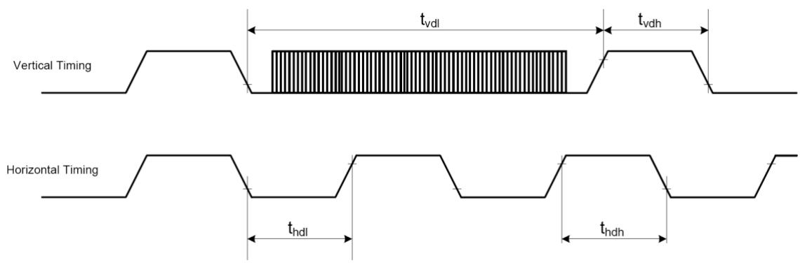

text_image

Vertical Timing
t_{vdl}
t_{vdh}
Horizontal Timing
t_{hdl}
t_{hdh}

AC characteristics of Tearing Effect Signal (Frame Rate = 60Hz)

Notes:

The signal's rise and fall times (tf, tr) are stipulated to be equal to or less than 15ns.

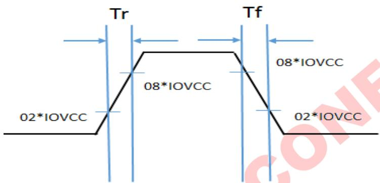

text_image

Tr
Tf
02*IOVCC
08*IOVCC
08*IOVCC
02*IOVCC

The Tearing Effect Output Line is fed back to the HOST and should be used as shown below to avoid tearing effect:

The below is described TE output Position by Register 35h and 44h.

<table><tr><td>Reg. 35h</td><td>Reg. 44h</td><td rowspan="2">TE Output Position</td></tr><tr><td>M</td><td>N</td></tr><tr><td>0</td><td>0</td><td>TE high in V-porch region including of VBP and VFP for TE mode 1</td></tr><tr><td>1</td><td>0</td><td>TE high in all V-porch including of VBP and VFP/H-porch including of HBP and HFP region for TE mode 2</td></tr><tr><td>0</td><td>≠0</td><td>TE high at N-th line for TE mode 3</td></tr><tr><td>1</td><td>≠0</td><td>TE high in all V-porch including of VBP and VFP/H-porch including of HBP and HFP region for TE mode 2</td></tr></table>

# 5.6 Display Serial Interface (DSI) MIPI Interface

# 5.6.1 Interface Level Communication

# 5.6.1.1 General

The display module uses data and clock lane differential pairs for DSI (DSI-1M). Both differential lane pairs can be driven to Low Power (LP) or High Speed (HS) mode.

Low Power mode means that each line of the differential pair is used in the single ended mode, a differential receiver is disable (a termination resistor of the receiver is disable), and it can be driven into a low power mode.

High Speed mode means that differential pairs (the termination resistor of the receiver is enable) are not used in the single ended mode.

Different modes and protocols are used in each mode when transferring information from the MCU to the display module and vice versa.

The State Codes of the High Speed (HS) and Low Power (LP) lane pair are defined below.

The State Codes of the High Speed (HS) and Low Power (LP) lane pair define

<table><tr><td rowspan="2">Lane Pair State Code</td><td colspan="2">Line DC Voltage Levels</td><td>High Speed (HS)</td><td colspan="2">Low Power</td></tr><tr><td>DATA_P</td><td>DATA_N</td><td>Burst Mode</td><td>Control Mode</td><td>Escape Mode</td></tr><tr><td>HS-0</td><td>Low (HS)</td><td>High (HS)</td><td>Differential - 0</td><td>Note1</td><td>Note1</td></tr><tr><td>HS-1</td><td>High (HS)</td><td>Low (HS)</td><td>Differential – 1</td><td>Note1</td><td>Note1</td></tr><tr><td>LP-00</td><td>Low (LP)</td><td>Low (LP)</td><td>Not Defined</td><td>Bridge</td><td>Space</td></tr><tr><td>LP-01</td><td>Low (LP)</td><td>High (LP)</td><td>Not Defined</td><td>HS-Request</td><td>Mark-0</td></tr><tr><td>LP-10</td><td>High (LP)</td><td>Low (LP)</td><td>Not Defined</td><td>LP-Request</td><td>Mark-1</td></tr><tr><td>LP-11</td><td>High (LP)</td><td>High (LP)</td><td>Not Defined</td><td>Stop</td><td>Note 2</td></tr></table>

Note 1: Low-Power Receivers (LP-Rx) of the lane pair will check the LP-00 state code when the Lane Pair is in the High Speed (HS) mode.  
Note 2 : If Low-Power Receivers (LP-Rx) of the lane pair recognizes the LP-11 state code, then the lane pair will return to LP-11 of the Control Mode.  
Note 3: n = 0, and 1(D1P/N, and D2 P/N lanes only for HS-0 and HS-1).

# 5.6.1.2 DSI CLK Lanes

CLKP/N lanes can be driven into three different power modes: Low Power Mode (LPM), Ultra-Low Power Mode (ULPM) and High Speed Clock Mode (HSCM). Clock lane is in the single ended mode (LP = Low Power) when entering or leaving Low Power Mode (LPM) or Ultra-Low Power Mode (ULPM). Clock lane is in the single ended mode (LP = Low Power) when entering in or leaving High Speed Clock Mode (HSCM). These entering and leaving protocols use Clock lane in the single ended mode to generate an entering or leaving sequence. The principal flow chart of the different Clock lane power modes is illustrated below.

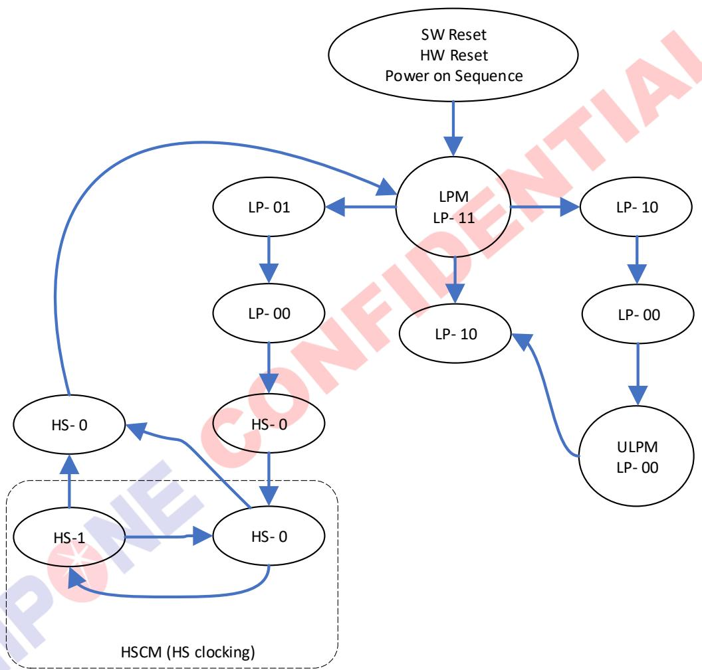

flowchart

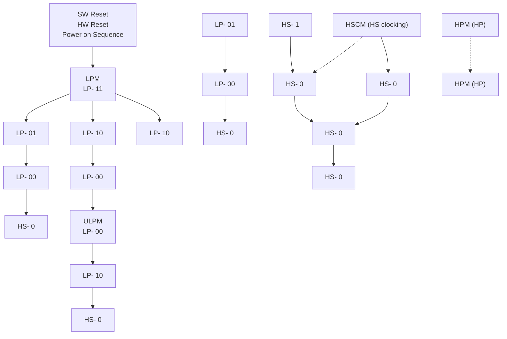
```mermaid
graph TD
  A["SW Reset\nHW Reset\nPower on Sequence"] --> B["LPM\nLP- 11"]
  B --> C["LP- 01"]
  B --> D["LP- 10"]
  B --> E["LP- 10"]
  C --> F["LP- 00"]
  F --> G["HS- 0"]
  D --> H["LP- 00"]
  H --> I["ULPM\nLP- 00"]
  I --> J["LP- 10"]
  J --> K["HS- 0"]
  L["LP- 01"] --> M["LP- 00"]
  M --> N["HS- 0"]
  O["HS- 1"] --> P["HS- 0"]
  Q["HS- 0"] --> R["HS- 0"]
  P --> R
  R --> S["HS- 0"]
  T["HSCM (HS clocking)"] -.-> P
  T --> Q
  U["HPM (HP)"] -.-> V["HPM (HP)"]
```

Clock Lane Power Modes

# 5.6.1.3 Low Power Mode (LPM)

CLKP/N lanes can be driven to the Low Power Mode (LPM), when CLKP/N lanes enter LP-11 State Code, in three different ways:

1) After SW Reset, HW Reset or Power On Sequence => LP-11.  
2) After CLKP/N lanes leave Ultra-Low Power Mode (ULPM, LP-00 State Code) => LP-10 => LP-11 (LPM). This sequence is illustrated below.

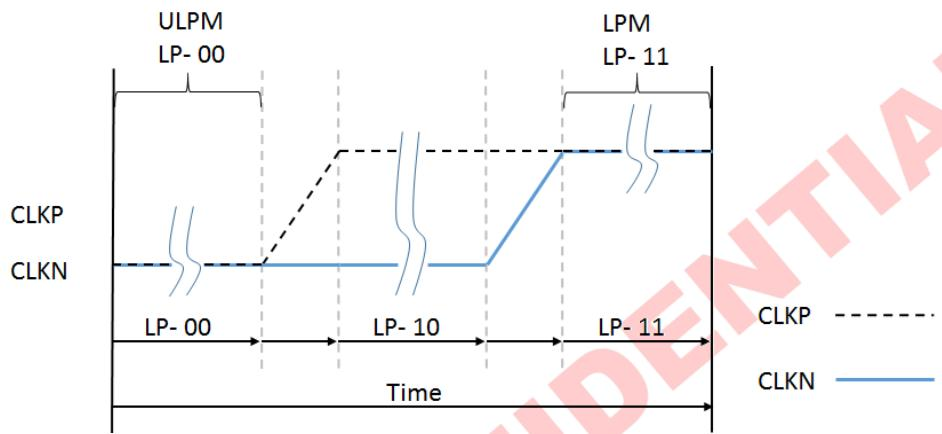

flowchart

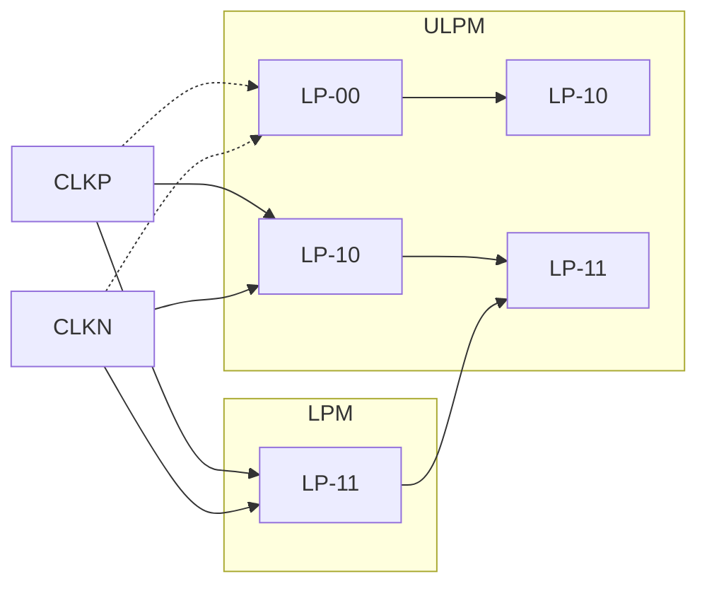
```mermaid
graph LR
  subgraph ULPM ["ULPM"]
    direction TB
  LP-00["LP-00"] --> LP-10["LP-10"]
  LP10["LP-10"] --> LP-11["LP-11"]
  end
  subgraph LPM ["LPM"]
    direction TB
  LP11["LP-11"] --> LP-11["LP-11"]
  end
  CLKP["CLKP"] -.-> LP-00
  CLKN["CLKN"] -.-> LP-00
  CLKP --> LP10
  CLKN --> LP10
  CLKP --> LP11
  CLKN --> LP11
```

From ULPM to LPM

3) After CLKP/N lanes leave High Speed Clock Mode (HSCM, HS-0 or HS-1 State Code) => HS-0=> LP-11 (LPM). This sequence is illustrated below.

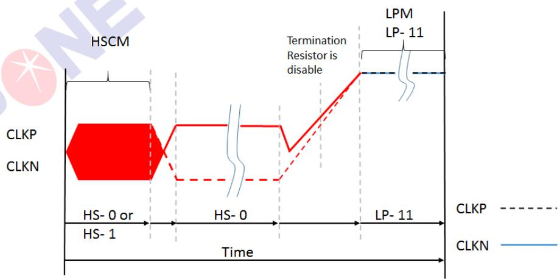

flowchart

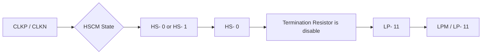
```mermaid
graph LR
  A["CLKP / CLKN"] --> B{"HSCM State"}
  B --> C["HS- 0 or HS- 1"]
  C --> D["HS- 0"]
  D --> E["Termination Resistor is disable"]
  E --> F["LP- 11"]
  F --> G["LPM / LP- 11"]
```

From High Speed Clock Mode (HSCM) to LPM

The changes of all the three modes are illustrated in the flow chart below.

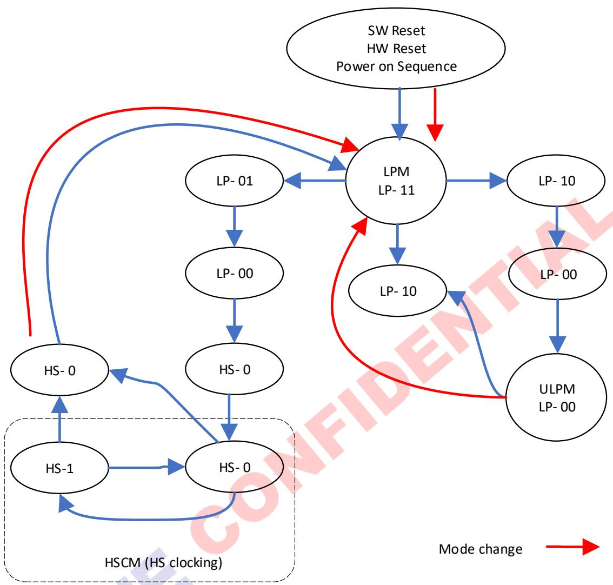

flowchart

This diagram illustrates a power management system architecture for switching and hybrid mode control, showing the flow of power from SW Reset to various Low Power Management (LP) and High State Control (HS) states.

All Three Mode Changes to LPM

# 5.6.1.4 Ultra- Low Power Mode (ULPM)

CLKP/N lanes can be driven to the Ultra- Low Power Mode (ULPM), when CLKP/N lanes enter LP-11 State Code, in three different ways:

1) After SW Reset, HW Reset or Power On Sequence => LP-11.  
2) After CLKP/N lanes leave Low Power Mode (LPM, LP-11 State Code) => LP-10 => LP-00 (ULPM). This sequence is illustrated below.

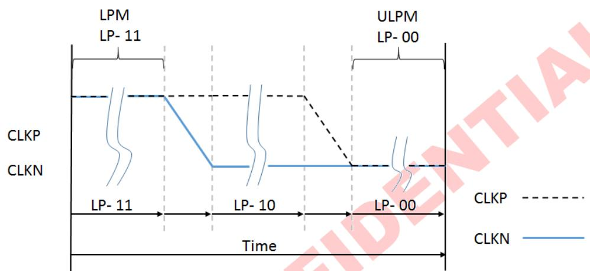

flowchart

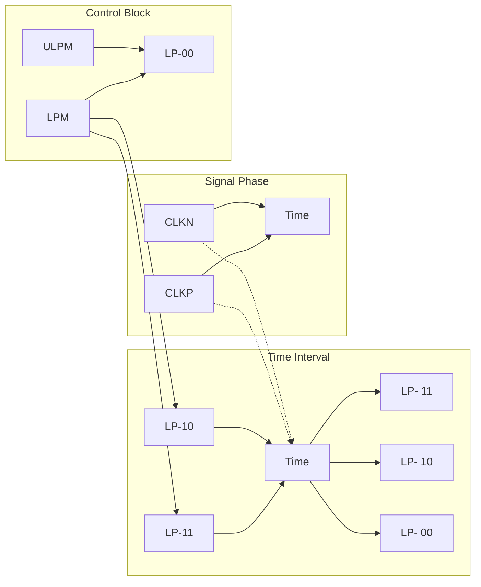
```mermaid
graph LR
  subgraph Time Interval
  Start["Time"] --> LP-11["LP- 11"]
  LP11["LP-11"] --> Start
  Start --> LP-10["LP- 10"]
  LP10["LP-10"] --> Start
  Start --> LP-00["LP- 00"]
  end

  subgraph Signal Phase
    CLKP["CLKP"] -.-> Start
    CLKN["CLKN"] -.-> Start
  CLKP --> End["Time"]
  CLKN --> End
  end

  subgraph Control Block
  LPM["LPM"] --> LP11
  LPM --> LP10
  LPM --> LP00["LP-00"]
  ULPM["ULPM"] --> LP00
  end
```

From LPM to ULPM

The mode change is also illustrated below.

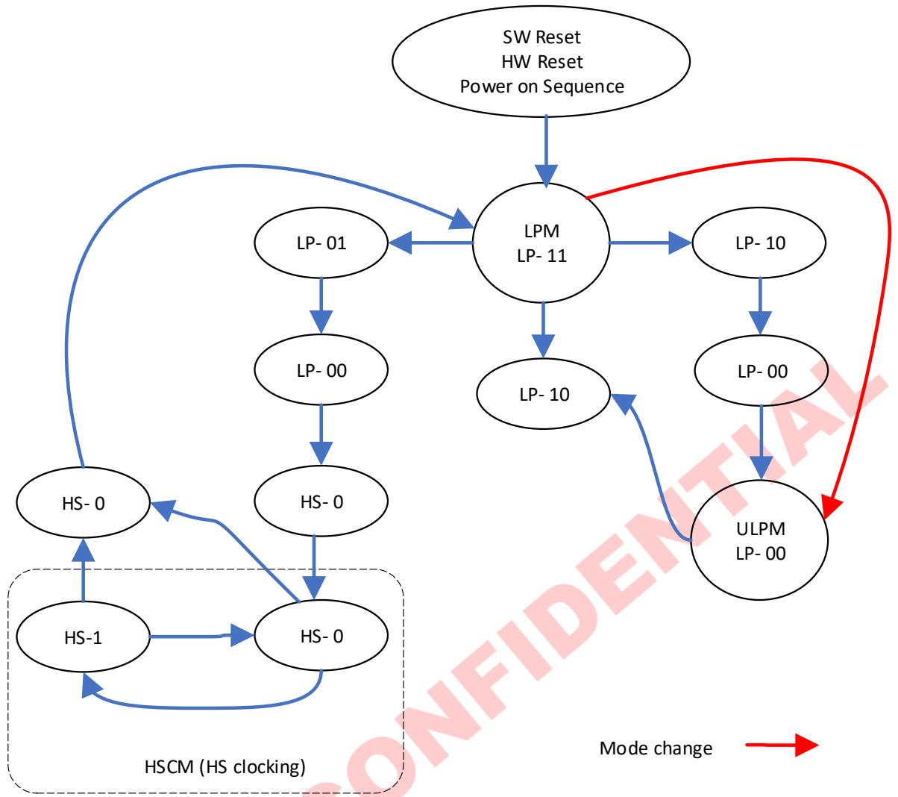

flowchart

This flowchart illustrates a power management system architecture for switching between SW Reset and HW Reset sequences, showing the interaction between LP and HSCM clocking modes with feedback loops.

Mode Change from LPM to ULPM

# 5.6.1.5 High- Speed Clock Mode (HSCM)

CLKP/N lanes can be driven to the High Speed Clock Mode (HSCM) when CLK lanes start to function between HS-0 and HS-1 State Codes. The only entering possibility is from the Low Power Mode (LPM, LP-11 State Code) => LP-01 => LP-00 => HS-0 => HS-0/1 (HSCM).

This sequence is illustrated below.

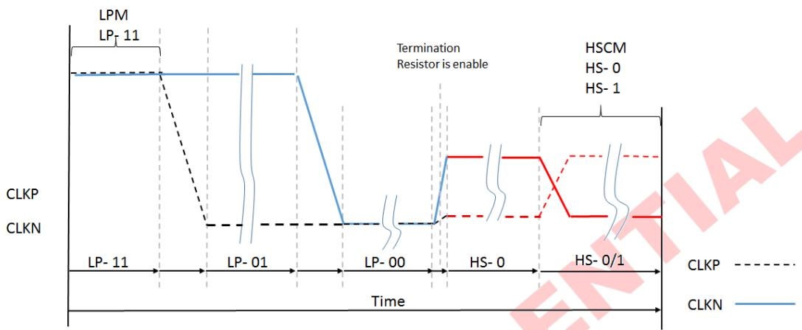

state_timeline

| Time Event | CLKP Status | CLKN Status |
| --- | --- | --- |
| LP- 11 | Active | Active |
| LP- 01 | Inactive | Active |
| LP- 00 | Inactive | Inactive |
| HS- 0 | Active | Active |
| HS- 0/1 | Active | Inactive |

From LPM to HSCM

The mode change is also illustrated below.

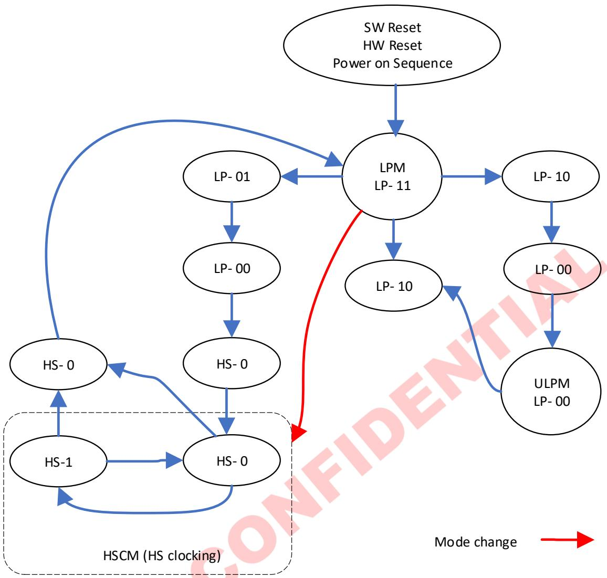

flowchart

This flowchart illustrates a power management system architecture for switching and hybrid (HSCM) clocking. It shows the sequence of switches (HS-0, HS-1, LP-01, LP-00, LP-10, ULPM) and their interactions with LPM and HSCM controllers.

Mode Change from LPM to HSCM

The high speed clock (CLKP/N) starts before high speed data is sent via data lanes. The high speed clock continues clocking after the high speed data sending is stopped.

The burst of the high speed clock consists of:

- Even number of transitions.  
- Start state is HS- 0.  
- End state is HS- 0.

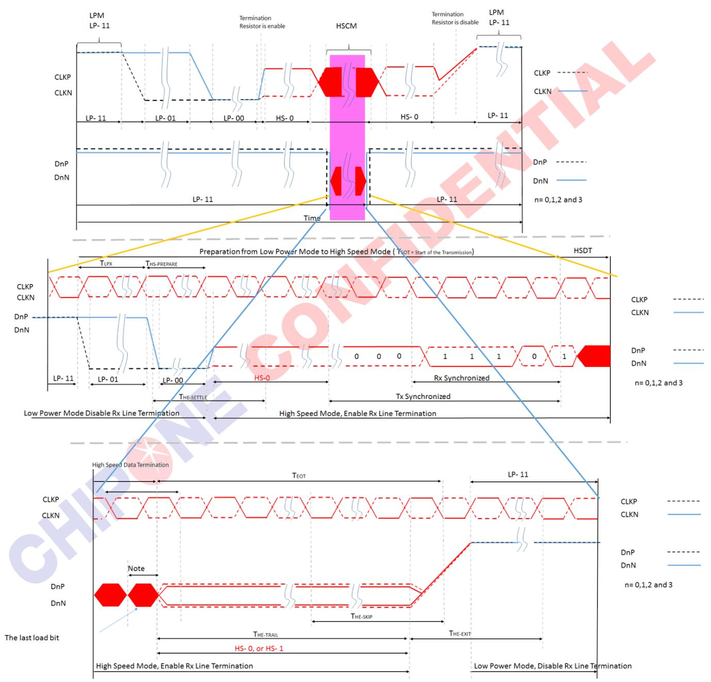

flowchart

This image displays a block diagram representing the signal processing workflow of a High Speed Modulation (HSCM) system, showing timing relationships between CLKP/CLKN, DnP/DnN, and transmission signals.

Note: If the last load bit is HS-0, the transmitter changes from HS-0 to HS-1. If the last load bit is HS-1, the transmitter changes from HS-1 to HS-0

# High Speed Clock Burs

# 5.6.2 Interface Level Communication - DSI Data Lane

# 5.6.2.1 General

D0P/N, and D1P/N Data lanes can be driven into different modes:

- Escape Mode ( Only D0P/N data lane is used).  
- High- Speed Data Transmission (all data lanes are used).  
- Bus Turnaround Request (Only D0P/N data lane are used).

These modes and their entering codes are defined in the following table.

Modes and entering code define

<table><tr><td>Mode</td><td>Entering Mode Sequence</td><td>Leaving Mode Sequence</td></tr><tr><td>Escape Mode</td><td>LP- 11→ LP- 10→ LP- 00 → LP- 01 → LP- 00</td><td>LP- 00→ LP- 10→ LP- 11 (Mark-1)</td></tr><tr><td>High- Speed Data Transmission</td><td>LP- 11→ LP- 01 → LP- 00 → HS- 0</td><td>(HS- 0 or HS- 1)→ LP11</td></tr><tr><td>Bus Turnaround Request</td><td>LP- 11→ LP- 10→ LP- 00 → LP- 10→ LP- 00</td><td>Hi- Z</td></tr></table>

# 5.6.2.2 Escape Modes

D0P/N data lanes can be used in different Escape Modes when data lanes are in the Low Power (LP) mode. These Escape Modes are used to:

- Send “Low-Power Data Transmission” (LPDT) from the MCU to the display module.  
- Drive data lanes to "Ultra-Low Power State" (ULPS).  
- Indicate “Remote Application Reset” (RAR), which can reset the display module.  
- Indicate “Acknowledge” (ACK), which is used to transmit a non-error event from the display module to the MCU.

The basic sequence of the Escape Mode is as follows:

- Start: LP-11.  
- Escape Mode Entry (EME): LP-11 => LP-10 => LP-00 => LP-01 => LP-00.  
- Escape Command (EC), which is coded, when one of the data lanes changes from low-to-high-to-low then this changed data lane presents the value of the current data bit (D0P = 1, D0N= 0). When DSI-D0 changes from low-to-high-to-low, the receiver will latch a data bit, which value is logical 0. The receiver will use this low-to-high-to-low transition as its internal clock.

- A load if it is needed.  
- Exit Escape (Mark-1) LP-00 => LP-10 => LP-11.  
- End: LP-11.

This basic construction is illustrated below.

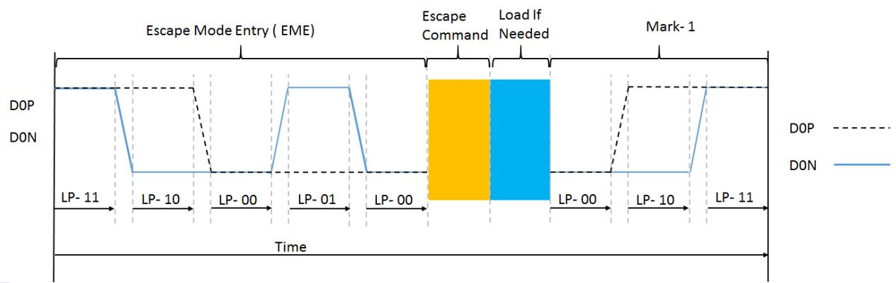

flowchart

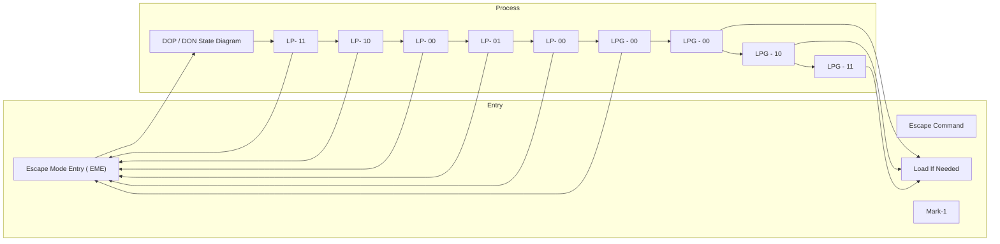
```mermaid
graph LR
  subgraph Entry
    A["Escape Mode Entry ( EME)"]
    B["Escape Command"]
    C["Load If Needed"]
    D["Mark-1"]
  end

  subgraph Process
    E["DOP / DON State Diagram"]
  F["LP- 11"] --> A
  G["LP- 10"] --> A
  H["LP- 00"] --> A
  I["LP- 01"] --> A
  J["LP- 00"] --> A
  K["LPG - 00"] --> A
  L["LPG - 00"] --> C
  M["LPG - 10"] --> C
  N["LPG - 11"] --> C
  end

  A --> E
  E --> F
  F --> G
  G --> H
  H --> I
  I --> J
  J --> K
  K --> L
  L --> M
  M --> N
```

General Escape Mode Sequence

A total of eight Escape Commands (EC) are divided into two types: Mode and Trigger, as shown in below Table.

An example of the Mode type Escape Command is „Ultra-Low Power Mode", where the MCU instructs the display module to enter its Ultra-Low Power Mode.

Escape commands are defined in the following table.

Escape commands define

<table><tr><td>Escape Command</td><td>Command Type Mode / Trigger</td><td>Entry command Pattern (First Bit→ Last Bit Transmitted)</td><td>Dn</td><td>D0</td></tr><tr><td>Low- Power Data Transmission</td><td>Mode</td><td>1110 0001 bin</td><td></td><td>x</td></tr><tr><td>Ultra- Low Power Mode</td><td>Mode</td><td>0001 1110 bin</td><td>x</td><td>x</td></tr><tr><td>Underfined- 1, Note1</td><td>Mode</td><td>1001 1111 bin</td><td></td><td></td></tr><tr><td>Underfined- 2, Note1</td><td>Mode</td><td>1101 1110 bin</td><td></td><td></td></tr><tr><td>Remote Application Reset</td><td>Trigger</td><td>0110 0010 bin</td><td></td><td>x</td></tr><tr><td>Acknowledge</td><td>Trigger</td><td>0010 0001 bin</td><td></td><td>x</td></tr><tr><td>UnKnow- 5, Note1</td><td>Trigger</td><td>1010 0000 bin</td><td></td><td></td></tr></table>

Note 1: This Escape command support is not implemented on the display module.  
Note 2: n=1.  
Note 3: x= supported.

# 5.6.2.3 Low- Power Data Transmission (LPDT)

The MCU can send data to the display module in the Low-Power Data Transmission (LPDT) mode when data lanes enter the Escape Mode and Low-Power Data Transmission (LPDT) command is sent to the display module.

The display module also uses the same sequence when it sends data to the MCU. The Low Power Data Transmission (LPDT) uses the following sequence:

- Start: LP-11.  
- Escape Mode Entry (EME): LP-11 => LP-10 => LP-00 => LP-01 => LP-00.  
- Low-Power Data Transmission (LPDT) command in the Escape Mode: 1110 0001 (first to last bit).  
- Load (Data).  
- One or more bytes (one byte = 8 bit).  
- Data lanes are in pause mode when data lanes are stopped (both lanes are low) between bytes.  
- Mark-1: LP-00 => LP-10 => LP-11.  
- End: LP-11.

This sequence is illustrated for reference purposes below.

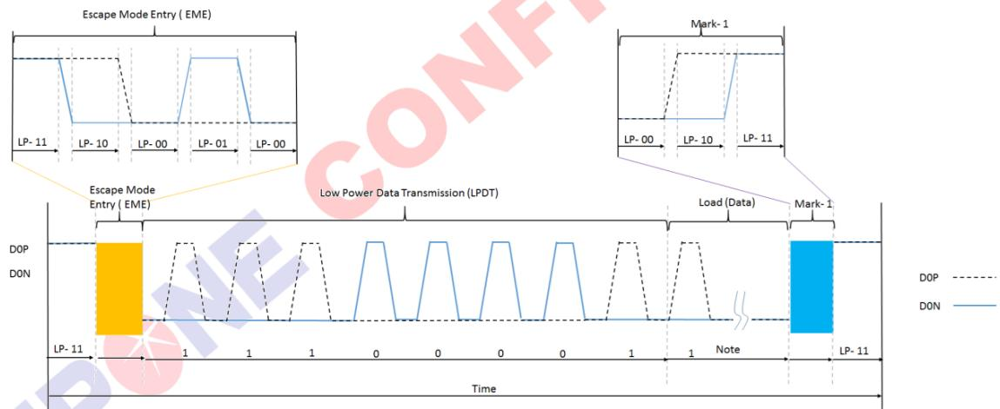

flowchart

This diagram illustrates a Low Power Data Transmission (LPDT) system process, showing the relationship between escape mode entry, LPDT transmission, and load data over time.

Low- Power Data Transmission (LPDT)  
Note: Load (Data) presents that the first bit is the logical 1 in this example.

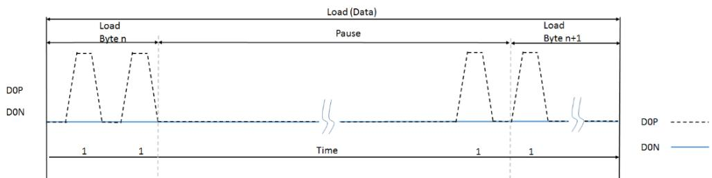

state_timeline

| Phase | Event | Duration |
| --- | --- | --- |
| 1 | Start of Load Byte n | 1 |
| 1 | End of Load Byte n | 1 |
| Pause | N/A | N/A |
| 1 | Start of Load Byte n+1 | 1 |
| 1 | End of Load Byte n+1 | 1 |

Pause (Example)

# 5.6.2.4 Ultra- Low Power State (ULPS)

The MCU can force data lanes get into the Ultra-Low Power State (ULPS) mode when data lanes enter the Escape Mode. The Ultra-Low Power State (ULPS) uses the following sequence:

- Start: LP-11.  
- Escape Mode Entry (EME): LP-11 => LP-10 => LP-00 => LP-01 => LP-00.  
- Ultra-Low Power State (ULPS) command in the Escape Mode: 0001 1110 (first to last bit).  
- Ultra-Low Power State (ULPS) when the MCU keeps data lanes low.  
- Mark-1: LP-00 => LP-10 => LP-11.  
- End: LP-11 (Next command must wait 100us after data lanes leave ULPS).

This sequence is illustrated for reference purposes below.

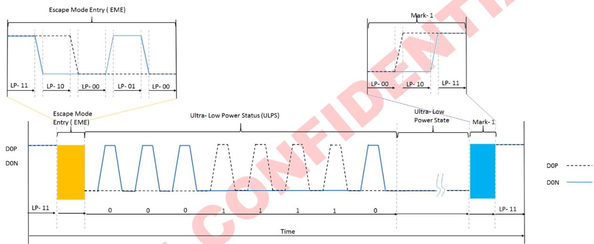

flowchart

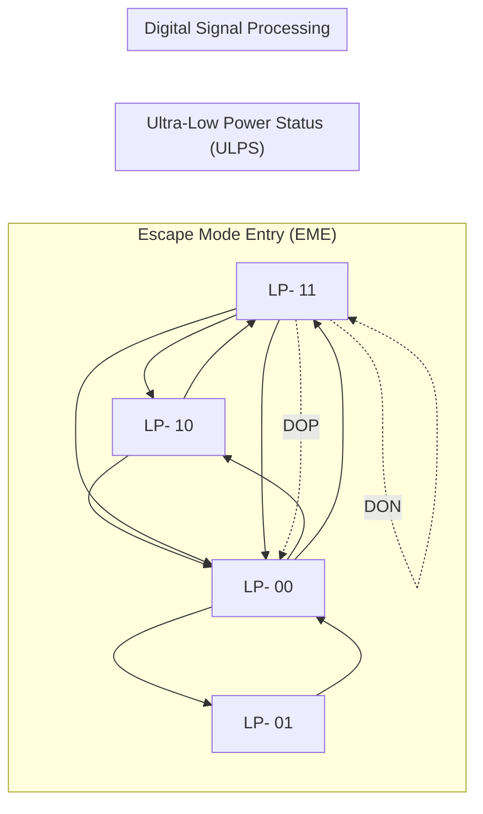
```mermaid
graph LR
  subgraph Top_1["Escape Mode Entry (EME)"]
  LP_11["LP- 11"] --> LP_10["LP- 10"]
  LP_10 --> LP_00["LP- 00"]
  LP_00 --> LP_01["LP- 01"]
  LP_01 --> LP_00["LP- 00"]
  end

  subgraph Top_2["Ultra-Low Power Status (ULPS)"]
  LP_00["LP- 00"] --> LP_10["LP- 10"]
  LP_10 --> LP_11["LP- 11"]
  end

  subgraph Bottom_1["Digital Signal Processing"]
  LP_11["LP- 11"] --> LP_00["LP- 00"]
  LP_00 --> LP_11["LP- 11"]
  LP_11 --> LP_00["LP- 00"]
  LP_11 --> LP_11["LP- 11"]
  end

  LP_11 -.->|"DOP"| LP_00
  LP_11 -.->|"DON"| LP_11
```

Ultra- Low Power State (ULPS)

# 5.6.2.5 Remote Application Reset (RAR)

The MCU can inform the display module that it should be reset in Remote Application Reset (RAR) trigger when data lanes enter the Escape Mode. The Remote Application Reset (RAR) uses the following sequence:

- Start: LP-11.  
- Escape Mode Entry (EME): LP-11 => LP-10 => LP-00 => LP-01 => LP-00.  
- Remote Application Reset (RAR) command in Escape Mode: 0110 0010 (first to last bit).  
- Mark-1: LP-00 => LP-10 => LP-11.  
- End: LP-11.

This sequence is illustrated for reference purposes below.

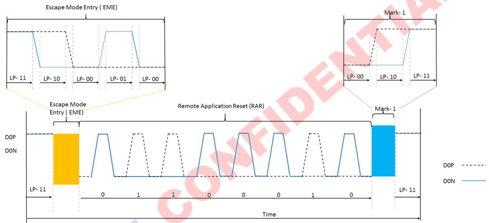

flowchart

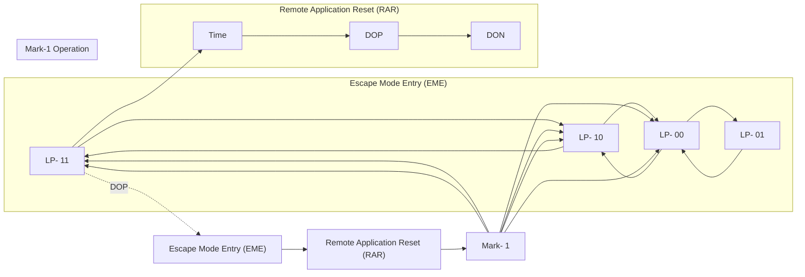
```mermaid
graph LR
  subgraph Top_Left["Escape Mode Entry (EME)"]
  LP_11["LP- 11"] --> LP_10["LP- 10"]
  LP_10 --> LP_00["LP- 00"]
  LP_00 --> LP_01["LP- 01"]
  LP_01 --> LP_00["LP- 00"]
  end

  subgraph Top_Rack["Mark-1 Operation"]
  LP_00["LP- 00"] --> LP_10["LP- 10"]
  LP_10 --> LP_11["LP- 11"]
  end

  subgraph Bottom_Right["Remote Application Reset (RAR)"]
  LP_11["LP- 11"] --> Time["Time"]
  Time --> DOP["DOP"]
  DOP --> DON["DON"]
  end

  LP_11 -.->|"DOP"| EME["Escape Mode Entry (EME)"]
  EME --> RAR["Remote Application Reset (RAR)"]
  RAR --> Mark_1["Mark- 1"]
  Mark_1 --> LP_11
  Mark_1 --> LP_10
  Mark_1 --> LP_00
  Mark_1 --> LP_00
  Mark_1 --> LP_10
  Mark_1 --> LP_11
```

Remote Application Reset (RAR)

# 5.6.2.6 Acknowledge (ACK)

The display module can inform the MCU an error is not recognized by Acknowledge (ACK). The display module sends the Acknowledge (ACK) with the following sequence:

- Start: LP-11.  
- Escape Mode Entry (EME): LP-11 => LP-10 => LP-00 => LP-01 => LP-00.  
- Acknowledge (ACK) command in the Escape Mode: 0010 0001 (first to last bit).  
- Mark-1: LP-00 => LP-10 => LP-11.  
- End: LP-11.

This sequence is illustrated for reference purposes below.

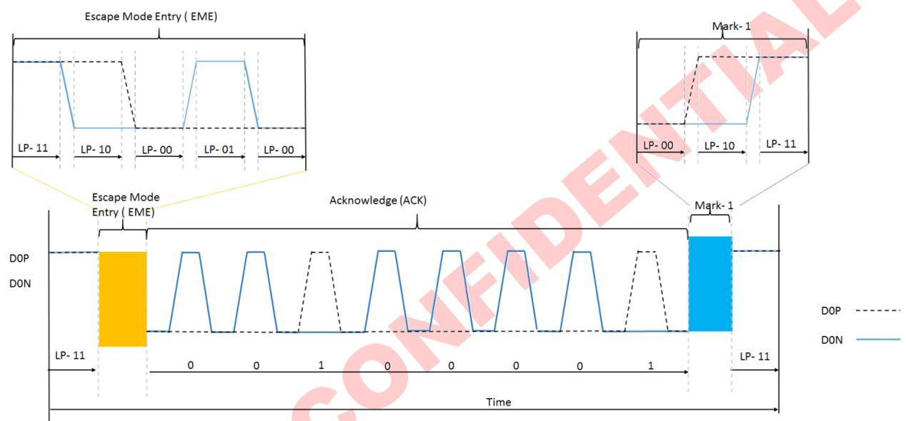

flowchart

```mermaid
graph LR
  subgraph Top_1["Escape Mode Entry ( EME)"]
  LP_11["LP- 11"] --> LP_10["LP- 10"]
  LP_10 --> LP_00["LP- 00"]
  LP_00 --> LP_01["LP- 01"]
  LP_01 --> LP_00["LP- 00"]
  end

  subgraph Top_2["Mark-1"]
  LP_00["LP- 00"] --> LP_10["LP- 10"]
  LP_10 --> LP_11["LP- 11"]
  end

  subgraph Bottom_1["Encourage ( ACK)"]
  LP_11["LP- 11"] --> TimeInterval0To1["Time Interval::0 to 1"]
    Time Interval::0 to 1
    Time Interval::1 to 1
  end

  subgraph Bottom_2["Mark-1"]
  LP_11["LP- 11"] --> TimeInterval0To1
    Time Interval::1 to End
  end
```

Acknowledge (ACK)

# 5.6.2.7 Entering High- Speed Data Transmission (TSOT of HSDT)

The display module enters High-Speed Data Transmission (HSDT) when Clock lane CLKP/N have already entered the High-Speed Clock Mode (HSCM) by the MCU. See more information in the section “High-Speed Clock Mode (HSCM)”. Data lanes D0P/N and D1P/N of the display module enter the High-Speed Data Transmission (TSOT of HSDT) as follows:

- Start: LP-11.  
- HS-Request: LP-01.  
- HS-Settle: LP-00 => HS-0 (Rx: Lane Termination Enable).  
- Rx Synchronization: 011101 (Tx (= MCU) Synchronization: 0001 1101).  
- End: High-Speed Data Transmission (HSDT) – Ready to receive High-Speed Data Load.

The sequence of entering High-Speed Data Transmission (TSOT of HSDT) is illustrated below.

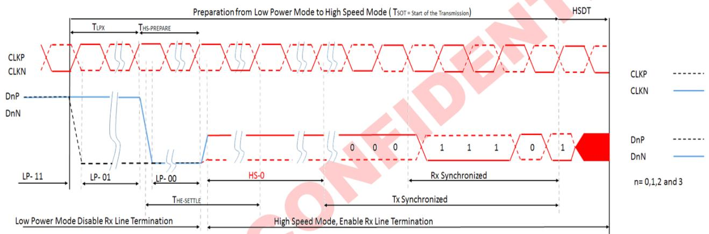

flowchart

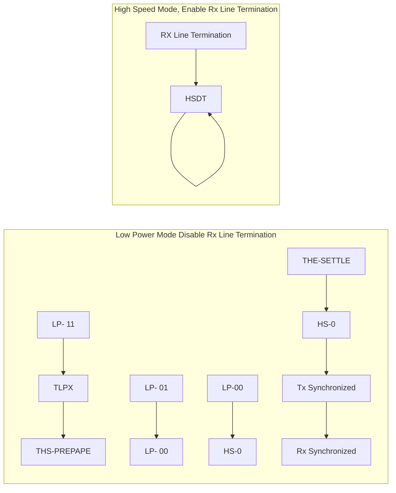
```mermaid
graph LR
  subgraph LowPowerMode ["Low Power Mode Disable Rx Line Termination"]
  LP-11["LP- 11"] --> TLPX["TLPX"]
  TLPX --> THS_PREPARE["THS-PREPAPE"]
  LP-01["LP- 01"] --> LP-00["LP- 00"]
  LP00["LP-00"] --> HS-0["HS-0"]
  TTHE_SETTLE["THE-SETTLE"] --> HS0["HS-0"]
  HS0 --> TxSynchronized["Tx Synchronized"]
  TxSynchronized --> RxSynchronized["Rx Synchronized"]
  end

  subgraph HighSpeedMode ["High Speed Mode, Enable Rx Line Termination"]
  RXLine["RX Line Termination"] --> HSDT["HSDT"]
  HSDT --> HSDT
  end
```

Entering High- Speed Data Transmission (TSOT of HSDT)

# 5.6.2.8 Leaving High- Speed Data Transmission (TEOP of HSDT)

The display module leaves the High-Speed Data Transmission (TEOT of HSDT) when Clock lane DSICLKP/N are in the High-Speed Clock Mode (HSCM) by the MCU, and this HSCM is kept until data lanes D0P/N and D1P/N are in the LP-11 mode. See more information in the section “High-Speed Clock Mode (HSCM)”. Data lanes D0P/N and D1P/N of the display module leave the High-Speed Data Transmission (TEOT of HSDT) as follows:

- Start: High-Speed Data Transmission (HSDT).  
- Stops High-Speed Data Transmission.  
- MCU changes to HS-1, if the last load bit is HS-0.  
- MCU changes to HS-0, if the last load bit is HS-1.  
- End: LP-11 (Rx: Lane Termination Disable).

The sequence of leaving High-Speed Data Transmission (TEOT of HSDT) is illustrated below.

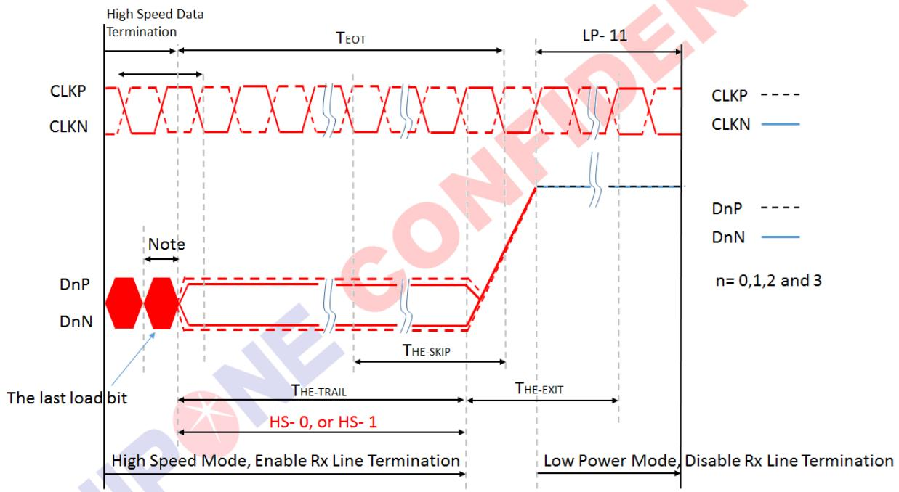

flowchart

```mermaid
graph LR
  subgraph High Speed Data Termination
  CLKP["CLKP"] --> CLKN["CLKN"]
  CLKN --> CLKP
  end

  subgraph LP_11["LP-11"]
  CLKP --> LPN["DnN"]
  CLKN --> LPN
  end

  subgraph The Last Load Bit
  CLKP --> DnP["DnP"]
  DnP --> DnN["DnN"]
  end

  subgraph Time Intervals
    CLKP -.->|TEOT| LPN
    CLKN -.->|LP-11| LPN
    DnP -.->|THE-SKIP| LPN
    DnN -.->|THE-TRAIL| LPN
    DnP -.->|THE-EXIT| LPN
  end

  subgraph Power Mode
  CLKP --> LowPowerMode["Low Power Mode"]
  DnP --> EnableRxLineTermination["High Speed Mode, Enable Rx Line Termination"]
  DnN --> EnableRxLineTermination
  end

  subgraph Note
    CLKP & DnP & DnN indicate specific signal states or logic states associated with the data transmission period.
```

Note:  
If the last load bit is HS- 0, the transmitter changes from HS- 0 to HS- 1.  
If the last load bit is HS- 1, the transmitter changes from HS- 1 to HS- 0

# Leaving High- Speed Data Transmission (TEOT of HSDT)

# 5.6.2.9 Burst of the High- Speed Data Transmission (HSDT)

The burst of the “High-Speed Data Transmission” (HSDT) can consist of one or several data packet(s). These data packets can be Long (LPa) or Short (SPa) packets. These packets are defined in the section “Short Packet (SPa) and Long Packet (LPa) Structures”. These different burst of the High-Speed Data Transmission (HSDT) cases are illustrated for reference purposes below.

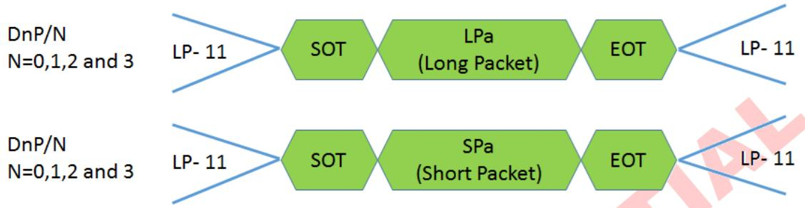

flowchart

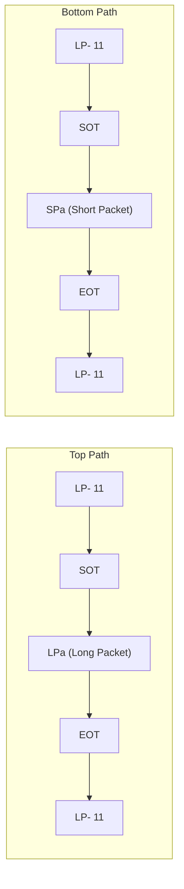
```mermaid
graph LR
  subgraph Top_1["Top Path"]
  A["LP- 11"] --> B["SOT"]
  B --> C["LPa (Long Packet)"]
  C --> D["EOT"]
  D --> E["LP- 11"]
  end
  subgraph Bottom_2["Bottom Path"]
  F["LP- 11"] --> G["SOT"]
  G --> H["SPa (Short Packet)"]
  H --> I["EOT"]
  I --> J["LP- 11"]
  end
```

Single Packet in High- Speed Data Transmissions

The multiple packets in High-Speed Data Transmission are illustrated for reference purposes below.

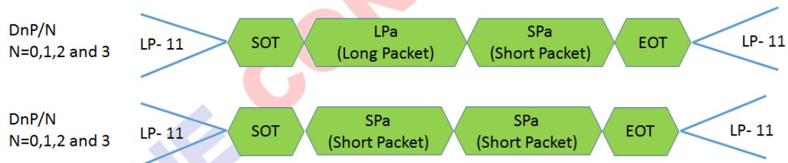

flowchart

```mermaid
graph LR
  subgraph Top["DnP/N\nN=0,1,2 and 3"]
    direction TB
  LP-11["LP- 11"] --> SOT["SOT"]
  SOT --> LPa["LPa\n(Long Packet)"]
  LPa --> SPa["SPa\n(Short Packet)"]
  SPa --> EOT["EOT"]
  EOT --> LP-11["LP- 11"]
  end

  subgraph Bottom["DnP/N\nN=0,1,2 and 3"]
    direction TB
  LP-11["LP- 11"] --> SOT["SOT"]
  SOT --> SPa["SPa\n(Short Packet)"]
  SPa --> SPa["SPa\n(Short Packet)"]
  SPa --> EOT["EOT"]
  EOT --> LP-11["LP- 11"]
  end
```

Multiple Packets in High- Speed Data Transmission – Example

Explanations of Packet Abbreviation

<table><tr><td>Abbreviation</td><td>Explanation</td></tr><tr><td>EOT</td><td>End of the Transmission</td></tr><tr><td>LPa</td><td>Long Packet</td></tr><tr><td>LP-11</td><td>Low Power Mode, Both of Data lanes stay at “1” (Stop Mode)</td></tr><tr><td>SPa</td><td>Short Packet</td></tr><tr><td>SOT</td><td>Start of the Transmission</td></tr></table>

# 5.6.2.10 Bus Turnaround (BTA)

The MCU or display module, which controls D0P/N Data Lanes, can start a bus turnaround procedure when it requires information from a receiver, which can be the MCU or display module. The MCU and display module use the same sequence when this bus turnaround procedure is used. The sequence, when the MCU wants to do the bus turnaround procedure to the display module, is described for reference purposes as follows:

- Start (MCU): LP-11.  
- Turnaround Request (MCU): LP-11 => LP-10 => LP-00 => LP-10 => LP-00.  
- The MCU waits until the display module starts to control D0P/N data lanes and the MCU stops to control D0P/N data lanes (= High-Z).  
- The display module changes to the stop mode: LP-00 => LP-10 => LP-11.

The bus turnaround procedure (from the MCU to the display module) is illustrated below.

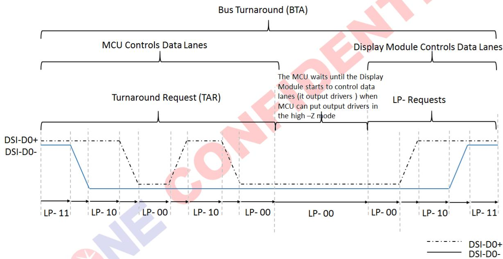

flowchart

```mermaid
graph LR
  subgraph Bus_Turnaround [Bus Turnaround (BTA)]
    direction TB
    MCU_Lanes["MCU Controls Data Lanes"]
    Display_Module_Lanes["Display Module Controls Data Lanes"]
    TAR_Request["Turnaround Request (TAR)"]
    LP_Requests["LP- Requests"]
  end

  subgraph Load_Days [DSI_D0+] / DSI_D0-]
    DSI_D0+: DSI-D0+
    DSI_D0-: DSI-D0-
    DSI_D0+: DSI_D0+
    DSI_D0-: DSI_D0-
    DSI_D0+: DSI_D0+
    DSI_D0-: DSI_D0-
  end

  LP_11 --> TARP_11
  TARP_11 --> TARP_10
  TARP_10 --> TARP_09
  TARP_09 --> TARP_08
  TARP_08 --> TARP_07
  TARP_07 --> TARP_06
  TARP_06 --> TARP_05
  TARP_05 --> TARP_04
  TARP_04 --> TARP_03
  TARP_03 --> TARP_02
  TARP_02 --> TARP_01
  TARP_01 --> TARP_00
  TARP_00 --> LP_00
  LP_00 --> LP_01
  LP_01 --> LP_02
  LP_02 --> LP_03
  LP_03 --> LP_04
  LP_04 --> LP_05
  LP_05 --> LP_06
  LP_06 --> LP_07
  LP_07 --> LP_08
  LP_08 --> LP_09
  LP_09 --> LP_10
  LP_10 --> LP_11
```

Bus Turnaround Procedure

MCU and display module terms can be switched on above figure, if the Bus Turnaround (BTA) is from the display module to the MCU.

# 5.6.3 Packet Level Communication

# 5.6.3.1 Short Packet (SPa) and Long Packet (LPa) Structures

Short Packet (SPa) and Long Packet (LPa) are always used when data transmission is done in Low Power Data Transmission (LPDT) or High-Speed Data Transmission (HSDT) modes. The lengths of the packets are:

- Short Packet (SPa): 4 bytes.  
- Long Packet (LPa): 6 to 65,541 bytes.

The type (SPa or LPa) of the packet can be recognized from their package headers (PH).

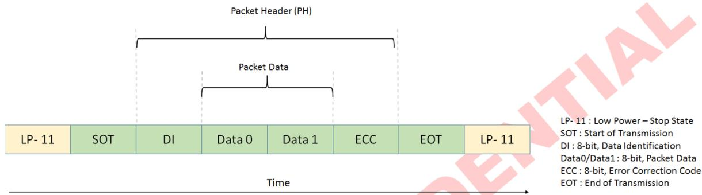

flowchart

```mermaid
graph LR
  subgraph Timeframe
    LP-11["LP- 11"]
    SOT["SOT"]
    DI["DI"]
    Data0["Data 0"]
    Data1["Data 1"]
    ECC["ECC"]
    EOT["EOT"]
    LP-11["LP- 11"]
  end

  subgraph PacketHeader
    PH["Packet Header (PH)"]
    Data["Packet Data"]
  end

  LP11["LP-11"] --> SOT
  SOT --> DI
  DI --> Data0
  Data0 --> Data1
  Data1 --> ECC
  ECC --> EOT
  EOT --> LP11
```

Short Packet (SPa) Structure

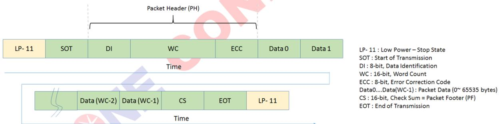

flowchart

```mermaid
graph LR
  subgraph Packet Header["Packet Header (PH)"]
    direction TB
  LP_11["LP- 11"] --> SOT["SOT"]
  SOT --> DI["DI"]
  DI --> WC["WC"]
  WC --> ECC["ECC"]
  ECC --> Data0["Data 0"]
  Data0 --> Data1["Data 1"]
  end

  subgraph DataTimeline["Time"]
  LP_11 --> DataWC2["Data (WC-2)"]
  DataWC2 --> DataWC1["Data (WC-1)"]
  DataWC1 --> CS["CS"]
  CS --> EOT["EOT"]
  EOT --> LP_11["LP- 11"]
  end
```

Long Packet (LPa) Structure

Notes 1. Short Packet (SPa) Structure and Long Packet (LPa) Structure present a single packet sending (= Includes LP-11, SOT and EOT for each packet sending).  
Notes 2. The other possibility is that SOT, EOT and LP-11 are not needed between packets if packets are sent in multiple packet format, e.g:

$$
\begin{array}{l} - L P - 1 1 \rightarrow S O T \rightarrow S P a \rightarrow L P a \rightarrow S P a \rightarrow S P a \rightarrow E O T \rightarrow L P - 1 1 \\ - L P - 1 1 \rightarrow S O T \rightarrow S P a \rightarrow S P a \rightarrow S P a \rightarrow E O T \rightarrow L P - 1 1 \\ - L P - 1 1 \rightarrow S O T \rightarrow L P a \rightarrow L P a \rightarrow L P a \rightarrow E O T \rightarrow L P - 1 1 \\ \end{array}
$$

# 5.6.3.2 Bit Order of the Byte on Packet

The bit order of the byte, what is used in packets, is that the Least Significant Bit (LSB) of the byte is sent first, and the Most Significant Bit (MSB) is sent last. The order is illustrated for reference purposes below.

<table><tr><td colspan="8">DI(Data Identification)</td><td colspan="8">WC - LSB(Word Count – LSB)</td><td colspan="8">WC – MSB(Word Count – MSB)</td><td colspan="8">ECC(Error Correction Code)</td></tr><tr><td colspan="8">8&#x27;b 29H</td><td colspan="8">8&#x27;b 01H</td><td colspan="8">8&#x27;b 00H</td><td colspan="8">8&#x27;b 06H</td></tr><tr><td>1</td><td>0</td><td>0</td><td>1</td><td>0</td><td>1</td><td>0</td><td>0</td><td>1</td><td>0</td><td>0</td><td>0</td><td>0</td><td>0</td><td>0</td><td>0</td><td>0</td><td>0</td><td>0</td><td>0</td><td>0</td><td>0</td><td>0</td><td>0</td><td>0</td><td>1</td><td>1</td><td>0</td><td>0</td><td>0</td><td>0</td><td>0</td></tr><tr><td>B</td><td>B</td><td>B</td><td>B</td><td>B</td><td>B</td><td>B</td><td>B</td><td>B</td><td>B</td><td>B</td><td>B</td><td>B</td><td>B</td><td>B</td><td>B</td><td>B</td><td>B</td><td>B</td><td>B</td><td>B</td><td>B</td><td>B</td><td>B</td><td>B</td><td>B</td><td>B</td><td>B</td><td>B</td><td>B</td><td>B</td><td>B</td></tr><tr><td>0</td><td>1</td><td>2</td><td>3</td><td>4</td><td>5</td><td>6</td><td>7</td><td>0</td><td>1</td><td>2</td><td>3</td><td>4</td><td>5</td><td>6</td><td>7</td><td>0</td><td>1</td><td>2</td><td>3</td><td>4</td><td>5</td><td>6</td><td>7</td><td>0</td><td>1</td><td>2</td><td>3</td><td>4</td><td>5</td><td>6</td><td>7</td></tr><tr><td>L</td><td rowspan="3" colspan="6"></td><td>M</td><td>L</td><td rowspan="3" colspan="6"></td><td>M</td><td>L</td><td rowspan="3" colspan="6"></td><td>M</td><td>L</td><td rowspan="3" colspan="6"></td><td>M</td></tr><tr><td>S</td><td>S</td><td>S</td><td>S</td><td>S</td><td>S</td><td>S</td><td>S</td></tr><tr><td>B</td><td>B</td><td>B</td><td>B</td><td>B</td><td>B</td><td>B</td><td>B</td></tr></table>

Time

# Bit order of the byte on packet

# 5.6.3.3 Byte Order of the Multiple Byte Information on Packets

Byte order of the multiple bytes information, what is used in packets, is that the Least Significant (LS) Byte of the information is sent first and the Most Significant (MS) Byte is sent last. For example, Word Count (WC) consists of 2 bytes (= 16 bits); while the LS byte is sent first and the MS byte is sent last. The order is illustrated for reference purposes below.

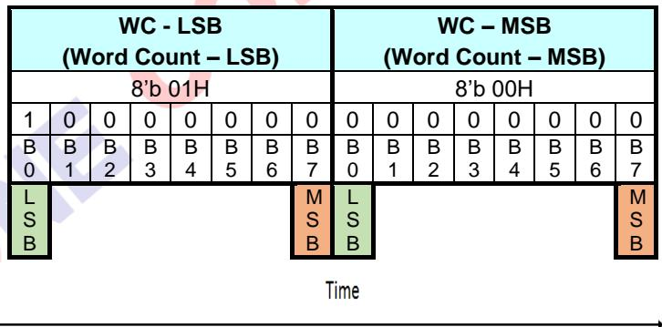

text_image

WC - LSB
(Word Count - LSB)
8'b 01H
WC - MSB
(Word Count - MSB)
8'b 00H
1	0	0	0	0	0	0	0	0	0	0	0	0	0	0	0	0
B	B	B	B	B	B	B	B	B	B	B	B	B	B	B
0	1	2	3	4	5	6	7	0	1	2	3	4	5	6	7
L	S	M	M	M
S	B	L	S	M
B	B	B	B	B	B	B	B
Time

Order of the multiple byte information on packets

# 5.6.3.4 Packet Header (PH)

The packet header always consists of 4 bytes. The content of these 4 bytes are different for Short Packet (SPa) and Long Packet (LPa).

# - Short Packet (SPa) :

- 1st byte: Data Identification (DI) => Identify that this is a Short Packet (SPa).  
- 2nd and 3rd bytes: Packet Data (PD), Data 0 and 1.  
- 4th byte: Error Correction Code (ECC).

<table><tr><td colspan="8">DI(Data Identification)</td><td colspan="8">Data 0(Packet Data)</td><td colspan="8">Data 1(Packet Data)</td><td colspan="8">ECC(Error Correction Code)</td></tr><tr><td colspan="8">8&#x27;b 15H</td><td colspan="8">8&#x27;b 3AH</td><td colspan="8">8&#x27;b 07H</td><td colspan="8">8&#x27;b 18H</td></tr><tr><td>1</td><td>0</td><td>1</td><td>0</td><td>1</td><td>0</td><td>0</td><td>0</td><td>0</td><td>1</td><td>0</td><td>1</td><td>1</td><td>1</td><td>0</td><td>0</td><td>1</td><td>1</td><td>1</td><td>0</td><td>0</td><td>0</td><td>0</td><td>0</td><td>0</td><td>0</td><td>0</td><td>1</td><td>1</td><td>0</td><td>0</td><td>0</td></tr><tr><td>B</td><td>B</td><td>B</td><td>B</td><td>B</td><td>B</td><td>B</td><td>B</td><td>B</td><td>B</td><td>B</td><td>B</td><td>B</td><td>B</td><td>B</td><td>B</td><td>B</td><td>B</td><td>B</td><td>B</td><td>B</td><td>B</td><td>B</td><td>B</td><td>B</td><td>B</td><td>B</td><td>B</td><td>B</td><td>B</td><td>B</td><td>B</td></tr><tr><td>0</td><td>1</td><td>2</td><td>3</td><td>4</td><td>5</td><td>6</td><td>7</td><td>0</td><td>1</td><td>2</td><td>3</td><td>4</td><td>5</td><td>6</td><td>7</td><td>0</td><td>1</td><td>2</td><td>3</td><td>4</td><td>5</td><td>6</td><td>7</td><td>0</td><td>1</td><td>2</td><td>3</td><td>4</td><td>5</td><td>6</td><td>7</td></tr><tr><td>L</td><td></td><td></td><td></td><td></td><td></td><td></td><td>M</td><td>L</td><td></td><td></td><td></td><td></td><td></td><td></td><td>M</td><td>L</td><td></td><td></td><td></td><td></td><td></td><td></td><td>M</td><td>L</td><td></td><td></td><td></td><td></td><td></td><td></td><td>M</td></tr><tr><td>S</td><td></td><td></td><td></td><td></td><td></td><td></td><td>S</td><td>S</td><td></td><td></td><td></td><td></td><td></td><td></td><td>S</td><td>S</td><td></td><td></td><td></td><td></td><td></td><td></td><td>S</td><td>S</td><td></td><td></td><td></td><td></td><td></td><td></td><td>S</td></tr><tr><td>B</td><td></td><td></td><td></td><td></td><td></td><td></td><td>B</td><td>B</td><td></td><td></td><td></td><td></td><td></td><td></td><td>B</td><td>B</td><td></td><td></td><td></td><td></td><td></td><td></td><td>B</td><td>B</td><td></td><td></td><td></td><td></td><td></td><td></td><td>B</td></tr></table>

Time

# Packet Header (PH) in a Short Packet (SPa)

# - Long Packet (LPa) :

- 1st byte: Data Identification (DI) => Identify that this is a Long Packet (LPa).  
- 2nd and 3rd bytes: Word Count (WC).  
- 4th byte: Error Correction Code (ECC).

<table><tr><td colspan="8">DI(Data Identification)</td><td colspan="8">WC - LSB(Word Count – LSB)</td><td colspan="8">WC – MSB(Word Count – MSB)</td><td colspan="8">ECC(Error Correction Code)</td></tr><tr><td colspan="8">8&#x27;b 29H</td><td colspan="8">8&#x27;b 01H</td><td colspan="8">8&#x27;b 00H</td><td colspan="8">8&#x27;b 06H</td></tr><tr><td>1</td><td>0</td><td>0</td><td>1</td><td>0</td><td>1</td><td>0</td><td>0</td><td>1</td><td>0</td><td>0</td><td>0</td><td>0</td><td>0</td><td>0</td><td>0</td><td>0</td><td>0</td><td>0</td><td>0</td><td>0</td><td>0</td><td>0</td><td>0</td><td>0</td><td>1</td><td>1</td><td>0</td><td>0</td><td>0</td><td>0</td><td>0</td></tr><tr><td>B</td><td>B</td><td>B</td><td>B</td><td>B</td><td>B</td><td>B</td><td>B</td><td>B</td><td>B</td><td>B</td><td>B</td><td>B</td><td>B</td><td>B</td><td>B</td><td>B</td><td>B</td><td>B</td><td>B</td><td>B</td><td>B</td><td>B</td><td>B</td><td>B</td><td>B</td><td>B</td><td>B</td><td>B</td><td>B</td><td>B</td><td>B</td></tr><tr><td>0</td><td>1</td><td>2</td><td>3</td><td>4</td><td>5</td><td>6</td><td>7</td><td>0</td><td>1</td><td>2</td><td>3</td><td>4</td><td>5</td><td>6</td><td>7</td><td>0</td><td>1</td><td>2</td><td>3</td><td>4</td><td>5</td><td>6</td><td>7</td><td>0</td><td>1</td><td>2</td><td>3</td><td>4</td><td>5</td><td>6</td><td>7</td></tr><tr><td>L</td><td></td><td></td><td></td><td></td><td></td><td></td><td>M</td><td>L</td><td></td><td></td><td></td><td></td><td></td><td>M</td><td>L</td><td></td><td></td><td></td><td></td><td></td><td></td><td>M</td><td>L</td><td></td><td></td><td></td><td></td><td></td><td></td><td>M</td><td></td></tr><tr><td>S</td><td></td><td></td><td></td><td></td><td></td><td></td><td>S</td><td>S</td><td></td><td></td><td></td><td></td><td></td><td>S</td><td>S</td><td></td><td></td><td></td><td></td><td></td><td></td><td>S</td><td>S</td><td></td><td></td><td></td><td></td><td></td><td></td><td>S</td><td></td></tr><tr><td>B</td><td></td><td></td><td></td><td></td><td></td><td></td><td>B</td><td>B</td><td></td><td></td><td></td><td></td><td></td><td>B</td><td>B</td><td></td><td></td><td></td><td></td><td></td><td></td><td>B</td><td>B</td><td></td><td></td><td></td><td></td><td></td><td></td><td>B</td><td></td></tr></table>

Time

# Packet Header (PH) in a Long Packet (LPa)

# 5.6.3.5 Data Identification (DI)

Data Identification (DI) is a part of the Packet Header (PH), and it consists of 2 parts:

- Virtual Channel (VC), 2 bits, DI [7...6].  
- Data Type (DT), 6 bits, DI [5...0].

The Data Identification (DI) structure is illustrated, see the figure below.

<table><tr><td colspan="8">DI (Data Identification)</td></tr><tr><td colspan="2">VC(Virtual Channel Identifier)</td><td colspan="6">DT(Data Type)</td></tr><tr><td>Bit 7</td><td>Bit 6</td><td>Bit 5</td><td>Bit 4</td><td>Bit 3</td><td>Bit 2</td><td>Bit 1</td><td>Bit 0</td></tr></table>

Data Identification (DI) Structure

Data Identification (DI) in the Packet Header (PH) is illustrated for reference purposes below.

<table><tr><td colspan="8">DI(Data Identification)</td><td colspan="8">WC - LSB(Word Count – LSB)</td><td colspan="8">WC – MSB(Word Count – MSB)</td><td colspan="8">ECC(Error Correction Code)</td></tr><tr><td colspan="8">8&#x27;b 29H</td><td colspan="8">8&#x27;b 01H</td><td colspan="8">8&#x27;b 00H</td><td colspan="8">8&#x27;b 06H</td></tr><tr><td>1</td><td>0</td><td>0</td><td>1</td><td>0</td><td>1</td><td>0</td><td>0</td><td>1</td><td>0</td><td>0</td><td>0</td><td>0</td><td>0</td><td>0</td><td>0</td><td>0</td><td>0</td><td>0</td><td>0</td><td>0</td><td>0</td><td>0</td><td>0</td><td>0</td><td>1</td><td>1</td><td>0</td><td>0</td><td>0</td><td>0</td><td>0</td></tr><tr><td>B</td><td>B</td><td>B</td><td>B</td><td>B</td><td>B</td><td>B</td><td>B</td><td>B</td><td>B</td><td>B</td><td>B</td><td>B</td><td>B</td><td>B</td><td>B</td><td>B</td><td>B</td><td>B</td><td>B</td><td>B</td><td>B</td><td>B</td><td>B</td><td>B</td><td>B</td><td>B</td><td>B</td><td>B</td><td>B</td><td>B</td><td>B</td></tr><tr><td>0</td><td>1</td><td>2</td><td>3</td><td>4</td><td>5</td><td>6</td><td>7</td><td>0</td><td>1</td><td>2</td><td>3</td><td>4</td><td>5</td><td>6</td><td>7</td><td>0</td><td>1</td><td>2</td><td>3</td><td>4</td><td>5</td><td>6</td><td>7</td><td>0</td><td>1</td><td>2</td><td>3</td><td>4</td><td>5</td><td>6</td><td>7</td></tr><tr><td>L</td><td rowspan="3" colspan="6"></td><td>M</td><td>L</td><td rowspan="3" colspan="5"></td><td>M</td><td>L</td><td rowspan="3" colspan="6"></td><td>M</td><td>L</td><td rowspan="3" colspan="7"></td><td>M</td></tr><tr><td>S</td><td>S</td><td>S</td><td>S</td><td>S</td><td>S</td><td>S</td><td>S</td></tr><tr><td>B</td><td>B</td><td>B</td><td>B</td><td>B</td><td>B</td><td>B</td><td>B</td></tr></table>

Time

Data Identification (DI) on the Packet Header (PH)

# 5.6.3.6 Virtual Channel (VC)

Virtual Channel (VC) is a part of Data Identification (DI [7:6]) structure, and it is used to address where a packet is to be sent from the MCU. Bits of the Virtual Channel (VC) are illustrated for reference purposes below.

<table><tr><td colspan="8">DI(Data Identification)</td><td colspan="8">WC - LSB(Word Count – LSB)</td><td colspan="8">WC – MSB(Word Count – MSB)</td><td colspan="8">ECC(Error Correction Code)</td></tr><tr><td colspan="8">8&#x27;b 29H</td><td colspan="8">8&#x27;b 01H</td><td colspan="8">8&#x27;b 00H</td><td colspan="8">8&#x27;b 06H</td></tr><tr><td>1</td><td>0</td><td>0</td><td>1</td><td>0</td><td>1</td><td>0</td><td>0</td><td>1</td><td>0</td><td>0</td><td>0</td><td>0</td><td>0</td><td>0</td><td>0</td><td>0</td><td>0</td><td>0</td><td>0</td><td>0</td><td>0</td><td>0</td><td>0</td><td>0</td><td>1</td><td>1</td><td>0</td><td>0</td><td>0</td><td>0</td><td>0</td></tr><tr><td>B</td><td>B</td><td>B</td><td>B</td><td>B</td><td>B</td><td>B</td><td>B</td><td>B</td><td>B</td><td>B</td><td>B</td><td>B</td><td>B</td><td>B</td><td>B</td><td>B</td><td>B</td><td>B</td><td>B</td><td>B</td><td>B</td><td>B</td><td>B</td><td>B</td><td>B</td><td>B</td><td>B</td><td>B</td><td>B</td><td>B</td><td>B</td></tr><tr><td>0</td><td>1</td><td>2</td><td>3</td><td>4</td><td>5</td><td>6</td><td>7</td><td>0</td><td>1</td><td>2</td><td>3</td><td>4</td><td>5</td><td>6</td><td>7</td><td>0</td><td>1</td><td>2</td><td>3</td><td>4</td><td>5</td><td>6</td><td>7</td><td>0</td><td>1</td><td>2</td><td>3</td><td>4</td><td>5</td><td>6</td><td>7</td></tr><tr><td>L</td><td></td><td></td><td></td><td></td><td></td><td></td><td>M</td><td>L</td><td></td><td></td><td></td><td></td><td></td><td></td><td>M</td><td>L</td><td></td><td></td><td></td><td></td><td></td><td></td><td>M</td><td>L</td><td></td><td></td><td></td><td></td><td></td><td></td><td>M</td></tr><tr><td>S</td><td></td><td></td><td></td><td></td><td></td><td></td><td>S</td><td>S</td><td></td><td></td><td></td><td></td><td></td><td></td><td>S</td><td>S</td><td></td><td></td><td></td><td></td><td></td><td></td><td>S</td><td>S</td><td></td><td></td><td></td><td></td><td></td><td></td><td>S</td></tr><tr><td>B</td><td></td><td></td><td></td><td></td><td></td><td></td><td>B</td><td>B</td><td></td><td></td><td></td><td></td><td></td><td></td><td>B</td><td>B</td><td></td><td></td><td></td><td></td><td></td><td></td><td>B</td><td>B</td><td></td><td></td><td></td><td></td><td></td><td></td><td>B</td></tr></table>

Time

# Virtual Channel (VC) on the Packet Header (PH)

Virtual Channel (VC) can assign 4 different channels for 4 different display modules. Devices will use the same virtual channel as which the MCU uses to send packets to them, e.g.

- The MCU uses the virtual channel 0 when it sends packets to the CO6300.  
- The CO6300 also uses the virtual channel 0 when it sends packets to the MCU.

This functionality is illustrated below.

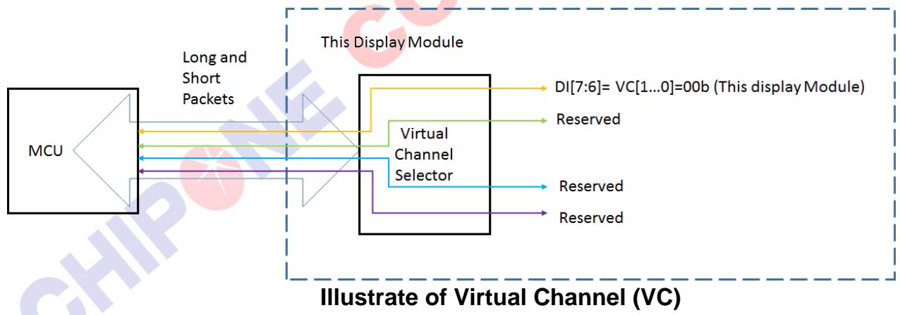

flowchart

```mermaid
graph LR
  MCU["MCU"] -->|"Long and Short Packets"| VirtualChannel["Virtual Channel Selector"]
  VirtualChannel -->|"DI["7:6"]= VC["1...0"]=00b This display Module"| VirtualChannel
  VirtualChannel -->|"Reserved"| VirtualChannel
  VirtualChannel -->|"Reserved"| MCU
  VirtualChannel -->|"Reserved"| MCU
```

Virtual Channel (VC) is always 0 (DI [7:6] = VC [1:0] = 00b) when the MCU sends “End of Transmission Packet” to the display module. See the section “End of Transmission Packet (EoTP)”. This display module does not support the virtual channel selector for other devices (1 to 3) when the only possible virtual channel (VC [1:0]) is 00b for the CO6300.

# 5.6.3.7 Data Type (DT)

Data Type (DT) is a part of Data Identification (DI [5...0]) structure, and it is used to define the type of the used data in a packet. Bits of the Data Type (DT) are illustrated for reference purposes below.

<table><tr><td colspan="8">DI(Data Identification)</td><td colspan="8">WC - LSB(Word Count – LSB)</td><td colspan="8">WC – MSB(Word Count – MSB)</td><td colspan="8">ECC(Error Correction Code)</td></tr><tr><td colspan="8">8&#x27;b 29H</td><td colspan="8">8&#x27;b 01H</td><td colspan="8">8&#x27;b 00H</td><td colspan="8">8&#x27;b 06H</td></tr><tr><td>1</td><td>0</td><td>0</td><td>1</td><td>0</td><td>1</td><td>0</td><td>0</td><td>1</td><td>0</td><td>0</td><td>0</td><td>0</td><td>0</td><td>0</td><td>0</td><td>0</td><td>0</td><td>0</td><td>0</td><td>0</td><td>0</td><td>0</td><td>0</td><td>0</td><td>1</td><td>1</td><td>0</td><td>0</td><td>0</td><td>0</td><td>0</td></tr><tr><td>B</td><td>B</td><td>B</td><td>B</td><td>B</td><td>B</td><td>B</td><td>B</td><td>B</td><td>B</td><td>B</td><td>B</td><td>B</td><td>B</td><td>B</td><td>B</td><td>B</td><td>B</td><td>B</td><td>B</td><td>B</td><td>B</td><td>B</td><td>B</td><td>B</td><td>B</td><td>B</td><td>B</td><td>B</td><td>B</td><td>B</td><td>B</td></tr><tr><td>0</td><td>1</td><td>2</td><td>3</td><td>4</td><td>5</td><td>6</td><td>7</td><td>0</td><td>1</td><td>2</td><td>3</td><td>4</td><td>5</td><td>6</td><td>7</td><td>0</td><td>1</td><td>2</td><td>3</td><td>4</td><td>5</td><td>6</td><td>7</td><td>0</td><td>1</td><td>2</td><td>3</td><td>4</td><td>5</td><td>6</td><td>7</td></tr><tr><td>L</td><td></td><td></td><td></td><td></td><td></td><td></td><td>M</td><td>L</td><td></td><td></td><td></td><td></td><td></td><td>M</td><td>L</td><td></td><td></td><td></td><td></td><td></td><td></td><td>M</td><td>L</td><td></td><td></td><td></td><td></td><td></td><td></td><td>M</td><td></td></tr><tr><td>S</td><td></td><td></td><td></td><td></td><td></td><td></td><td>S</td><td>S</td><td></td><td></td><td></td><td></td><td></td><td>S</td><td>S</td><td></td><td></td><td></td><td></td><td></td><td></td><td>S</td><td>S</td><td></td><td></td><td></td><td></td><td></td><td></td><td>S</td><td></td></tr><tr><td>B</td><td></td><td></td><td></td><td></td><td></td><td></td><td>B</td><td>B</td><td></td><td></td><td></td><td></td><td></td><td>B</td><td>B</td><td></td><td></td><td></td><td></td><td></td><td></td><td>B</td><td>B</td><td></td><td></td><td></td><td></td><td></td><td></td><td>B</td><td></td></tr></table>

Time

# Data Type (DT) on the Packet Header (PH)

This Data Type (DT) also defines the used packet is a Short Packet (SPa) or a Long Packet (LPa). Data Types (DT) are different from the MCU to the display module (or other devices) and vice versa. These Data Types (DT) are defined in the tables below.

Data Types (DT) define List

<table><tr><td colspan="3">From the MCU to the Display Module</td></tr><tr><td>Hex</td><td>Description</td><td>Short / Long Packet</td></tr><tr><td>01</td><td>Sync Even, V Sync Start</td><td>SPa ( Short Packet)</td></tr><tr><td>11</td><td>Sync Even, V Sync End</td><td>SPa ( Short Packet)</td></tr><tr><td>21</td><td>Sync Even, H Sync Start</td><td>SPa ( Short Packet)</td></tr><tr><td>31</td><td>Sync Even, H Sync End</td><td>SPa ( Short Packet)</td></tr><tr><td>08</td><td>End of Transmission Packet (EOTP) Note1</td><td>SPa ( Short Packet)</td></tr><tr><td>02</td><td>Color Mode Off Command</td><td>SPa ( Short Packet)</td></tr><tr><td>12</td><td>Color Mode On Command</td><td>SPa ( Short Packet)</td></tr><tr><td>22</td><td>Shut Down Peripheral Command</td><td>SPa ( Short Packet)</td></tr><tr><td>32</td><td>Turn On Peripheral Command</td><td>SPa ( Short Packet)</td></tr><tr><td>03</td><td>Generic Short WRITE, no parameters</td><td>SPa ( Short Packet)</td></tr><tr><td>13</td><td>Generic Short WRITE, 1 parameters</td><td>SPa ( Short Packet)</td></tr><tr><td>23</td><td>Generic Short WRITE, 2 parameters</td><td>SPa ( Short Packet)</td></tr><tr><td>04</td><td>Generic Short READ, no parameters</td><td>SPa ( Short Packet)</td></tr><tr><td>14</td><td>Generic Short READ, 1 parameters</td><td>SPa ( Short Packet)</td></tr><tr><td>24</td><td>Generic Short READ, 2 parameters</td><td>SPa ( Short Packet)</td></tr><tr><td>05</td><td>DCS Write, No Parameter</td><td>SPa ( Short Packet)</td></tr><tr><td>15</td><td>DCS Write, 1 Parameter</td><td>SPa ( Short Packet)</td></tr><tr><td>06</td><td>DCS Read, No Parameter</td><td>SPa ( Short Packet)</td></tr><tr><td>37</td><td>Set Maximum Return Packet Size</td><td>SPa ( Short Packet)</td></tr><tr><td>09</td><td>Null Packet, No Data, Note2</td><td>LPa (Long Packet)</td></tr><tr><td>19</td><td>Blanking Packet, no data</td><td>LPa (Long Packet)</td></tr><tr><td>29</td><td>Generic Long Write</td><td>LPa (Long Packet)</td></tr><tr><td>39</td><td>DCS Write Long</td><td>LPa (Long Packet)</td></tr><tr><td>1E</td><td>Packed Pixel Stream, 18-bit RGB, 6-6-6 Format</td><td>LPa (Long Packet)</td></tr><tr><td>2E</td><td>Loosely Packed Pixel Stream, 18-bit RGB, 6-6-6 Format</td><td>LPa (Long Packet)</td></tr><tr><td>3E</td><td>Packed Pixel Stream, 24-bit RGB, 8-8-8 Format</td><td>LPa (Long Packet)</td></tr><tr><td>X0XF</td><td>DO NOT USEAll unspecified codes are reserved</td><td></td></tr></table>

Note 1: This can be used when the MCU wants to make sure that it is the end of the transmission in High Speed Data Transferring (HSDT) mode.  
Note 2. This can be used when data lanes are to be kept in High Speed Data Transferring (HSDT) Mode.

Data Type (DT) from the Display Module (or Other Devices) to the MCU.

Data Type (DT) from the Display Module (or Other Devices) to the MCU

<table><tr><td colspan="3">From the Display Module to the MCU</td></tr><tr><td>Hex</td><td>Description</td><td>Short / Long Packet</td></tr><tr><td>02h</td><td>Acknowledge with Error Report</td><td>SPa ( Short Packet)</td></tr><tr><td>1Ch</td><td>DCS Read Long Response</td><td>LPa (Long Packet)</td></tr><tr><td>21h</td><td>DCS Read Short Response, 1 byte returned</td><td>SPa ( Short Packet)</td></tr><tr><td>22h</td><td>DCS Read Short Response, 2 byte returned</td><td>SPa ( Short Packet)</td></tr><tr><td>1Ah</td><td>Generic Read Long Response</td><td>LPa (Long Packet)</td></tr><tr><td>11h</td><td>Generic Read Short Response, 1 byte returned</td><td>SPa ( Short Packet)</td></tr><tr><td>12h</td><td>Generic Read Short Response, 2 byte returned</td><td>SPa ( Short Packet)</td></tr></table>

Note: The data type for Generic write/read: 1Ah, 11h, 12 will be disable (ignored packet) if bit DSIG is set to "0".

The receiver will ignore other Data Type (DT) if they are not defined on tables: "Data Type (DT) from the MCU to the Display Module (or Other Devices)" or "Data Type (DT) from the Display Module (or Other Devices) to the MCU".

# 5.6.3.8 Packet Data (PD) in a Short Packet (SPa)

Packet Data (PD) of the Short Packet (SPa) is placed after Data Type (DT) of the Data Identification (DI) and indicates a Short Packet (SPa) is to be sent. Packet Data (PD) of a Short Packet (SPa) consists of 2 data bytes: Data 0 and Data 1. The sending order of the Packet Data (PD) is that Data 0 is sent first and the Data 1 is sent last. Bits of Data 1 are set to 0 if the information length is 1 byte. Packet Data (PD) of a Short Packet (SPa), when the length of the information is 1 or 2 bytes and Virtual Channel (VC) is 0, are illustrated for reference purposes below.

\- Packet Data (PD) information:

- Data 0: 26Hex (Display Command Set (DCS) with 1 Parameter => DI (Data Type (DT)) = 15Hex).  
• Data 1: 01Hex ( DCS's Parameter).

<table><tr><td colspan="8">DI(Data Identification)</td><td colspan="8">Data 0(Packet Data)</td><td colspan="8">Data 1(Packet Data)</td><td colspan="8">ECC(Error Correction Code)</td></tr><tr><td colspan="8">8&#x27;b 15H</td><td colspan="8">8&#x27;b 26H</td><td colspan="8">8&#x27;b 01H</td><td colspan="8">8&#x27;b 3EH</td></tr><tr><td>1</td><td>0</td><td>1</td><td>0</td><td>1</td><td>0</td><td>0</td><td>0</td><td>0</td><td>1</td><td>1</td><td>0</td><td>0</td><td>1</td><td>0</td><td>0</td><td>1</td><td>0</td><td>0</td><td>0</td><td>0</td><td>0</td><td>0</td><td>0</td><td>0</td><td>1</td><td>1</td><td>1</td><td>1</td><td>1</td><td>0</td><td>0</td></tr><tr><td>B</td><td>B</td><td>B</td><td>B</td><td>B</td><td>B</td><td>B</td><td>B</td><td>B</td><td>B</td><td>B</td><td>B</td><td>B</td><td>B</td><td>B</td><td>B</td><td>B</td><td>B</td><td>B</td><td>B</td><td>B</td><td>B</td><td>B</td><td>B</td><td>B</td><td>B</td><td>B</td><td>B</td><td>B</td><td>B</td><td>B</td><td>B</td></tr><tr><td>0</td><td>1</td><td>2</td><td>3</td><td>4</td><td>5</td><td>6</td><td>7</td><td>0</td><td>1</td><td>2</td><td>3</td><td>4</td><td>5</td><td>6</td><td>7</td><td>0</td><td>1</td><td>2</td><td>3</td><td>4</td><td>5</td><td>6</td><td>7</td><td>0</td><td>1</td><td>2</td><td>3</td><td>4</td><td>5</td><td>6</td><td>7</td></tr><tr><td>L</td><td rowspan="3" colspan="6"></td><td>M</td><td>L</td><td rowspan="3" colspan="6"></td><td>M</td><td>L</td><td rowspan="3" colspan="6"></td><td>M</td><td>L</td><td rowspan="3" colspan="6"></td><td>M</td></tr><tr><td>S</td><td>S</td><td>S</td><td>S</td><td>S</td><td>S</td><td>S</td><td>S</td></tr><tr><td>B</td><td>B</td><td>B</td><td>B</td><td>B</td><td>B</td><td>B</td><td>B</td></tr></table>

Time

# Packet Data (PD) for Short Packet (SPa), 2 Bytes Information

\- Packet Data (PD) information:

• Data 0: 10Hex (DCS without Parameter => DI (Data Type (DT)) = 05Hex).  
• Data 1: 00Hex (Null).

<table><tr><td colspan="8">DI(Data Identification)</td><td colspan="8">Data 0(Packet Data)</td><td colspan="8">Data 1(Packet Data)</td><td colspan="8">ECC(Error Correction Code)</td></tr><tr><td colspan="8">8&#x27;b 05H</td><td colspan="8">8&#x27;b 10H</td><td colspan="8">8&#x27;b 00H</td><td colspan="8">8&#x27;b 2CH</td></tr><tr><td>1</td><td>0</td><td>1</td><td>0</td><td>0</td><td>0</td><td>0</td><td>0</td><td>0</td><td>0</td><td>0</td><td>0</td><td>1</td><td>0</td><td>0</td><td>0</td><td>0</td><td>0</td><td>0</td><td>0</td><td>0</td><td>0</td><td>0</td><td>0</td><td>0</td><td>0</td><td>1</td><td>1</td><td>0</td><td>1</td><td>0</td><td>0</td></tr><tr><td>B</td><td>B</td><td>B</td><td>B</td><td>B</td><td>B</td><td>B</td><td>B</td><td>B</td><td>B</td><td>B</td><td>B</td><td>B</td><td>B</td><td>B</td><td>B</td><td>B</td><td>B</td><td>B</td><td>B</td><td>B</td><td>B</td><td>B</td><td>B</td><td>B</td><td>B</td><td>B</td><td>B</td><td>B</td><td>B</td><td>B</td><td>B</td></tr><tr><td>0</td><td>1</td><td>2</td><td>3</td><td>4</td><td>5</td><td>6</td><td>7</td><td>0</td><td>1</td><td>2</td><td>3</td><td>4</td><td>5</td><td>6</td><td>7</td><td>0</td><td>1</td><td>2</td><td>3</td><td>4</td><td>5</td><td>6</td><td>7</td><td>0</td><td>1</td><td>2</td><td>3</td><td>4</td><td>5</td><td>6</td><td>7</td></tr><tr><td>L</td><td></td><td></td><td></td><td></td><td></td><td></td><td>M</td><td>L</td><td></td><td></td><td></td><td></td><td></td><td></td><td>M</td><td>L</td><td></td><td></td><td></td><td></td><td></td><td></td><td>M</td><td>L</td><td></td><td></td><td></td><td></td><td></td><td></td><td>M</td></tr><tr><td>S</td><td></td><td></td><td></td><td></td><td></td><td></td><td>S</td><td>S</td><td></td><td></td><td></td><td></td><td></td><td></td><td>S</td><td>S</td><td></td><td></td><td></td><td></td><td></td><td></td><td>S</td><td>S</td><td></td><td></td><td></td><td></td><td></td><td></td><td>S</td></tr><tr><td>B</td><td></td><td></td><td></td><td></td><td></td><td></td><td>B</td><td>B</td><td></td><td></td><td></td><td></td><td></td><td></td><td>B</td><td>B</td><td></td><td></td><td></td><td></td><td></td><td></td><td>B</td><td>B</td><td></td><td></td><td></td><td></td><td></td><td></td><td>B</td></tr></table>

Time

# Packet Data (PD) for Short Packet (SPa), 1 Byte Information

# 5.6.3.9 Word Count (WC) in a Long Packet (LPa)

Word Count (WC) of the Long Packet (LPa) is placed after Data Type (DT) of the Data Identification (DI) and indicates that a Long Packet (LPa) is to be sent. Word Count (WC) indicates the amount of data bytes of the Packet Data (PD) that is to be sent after the Packet Header (PH). The location of the Word Count (WC) in a Long Packet is the same as which of the Packet Data (PD) in a Short Packet (SPa), as shown in Figure 5.4.9-2. Word Count (WC) of the Long Packet (LPa) consists of 2 bytes. The sending order of these 2 bytes of the Word Count (WC) is that the Least Significant (LS) Byte is sent first, and the Most Significant (MS) Byte is sent last. Word Count (WC) of a Long Packet (LPa) is illustrated for reference purposes below.

<table><tr><td colspan="8">DI(Data Identification)</td><td colspan="8">WC - LSB(Word Count – LSB)</td><td colspan="8">WC – MSB(Word Count – MSB)</td><td colspan="8">ECC(Error Correction Code)</td></tr><tr><td colspan="8">8&#x27;b 29H</td><td colspan="8">8&#x27;b 01H</td><td colspan="8">8&#x27;b 00H</td><td colspan="8">8&#x27;b 06H</td></tr><tr><td>1</td><td>0</td><td>0</td><td>1</td><td>0</td><td>1</td><td>0</td><td>0</td><td>1</td><td>0</td><td>0</td><td>0</td><td>0</td><td>0</td><td>0</td><td>0</td><td>0</td><td>0</td><td>0</td><td>0</td><td>0</td><td>0</td><td>0</td><td>0</td><td>0</td><td>1</td><td>1</td><td>0</td><td>0</td><td>0</td><td>0</td><td>0</td></tr><tr><td>B</td><td>B</td><td>B</td><td>B</td><td>B</td><td>B</td><td>B</td><td>B</td><td>B</td><td>B</td><td>B</td><td>B</td><td>B</td><td>B</td><td>B</td><td>B</td><td>B</td><td>B</td><td>B</td><td>B</td><td>B</td><td>B</td><td>B</td><td>B</td><td>B</td><td>B</td><td>B</td><td>B</td><td>B</td><td>B</td><td>B</td><td>B</td></tr><tr><td>0</td><td>1</td><td>2</td><td>3</td><td>4</td><td>5</td><td>6</td><td>7</td><td>0</td><td>1</td><td>2</td><td>3</td><td>4</td><td>5</td><td>6</td><td>7</td><td>0</td><td>1</td><td>2</td><td>3</td><td>4</td><td>5</td><td>6</td><td>7</td><td>0</td><td>1</td><td>2</td><td>3</td><td>4</td><td>5</td><td>6</td><td>7</td></tr><tr><td>L</td><td></td><td></td><td></td><td></td><td></td><td></td><td>M</td><td>L</td><td></td><td></td><td></td><td></td><td></td><td>M</td><td>L</td><td></td><td></td><td></td><td></td><td></td><td></td><td>M</td><td>L</td><td></td><td></td><td></td><td></td><td></td><td></td><td></td><td>M</td></tr><tr><td>S</td><td></td><td></td><td></td><td></td><td></td><td></td><td>S</td><td>S</td><td></td><td></td><td></td><td></td><td></td><td>S</td><td>S</td><td></td><td></td><td></td><td></td><td></td><td></td><td>S</td><td>S</td><td></td><td></td><td></td><td></td><td></td><td></td><td></td><td>S</td></tr><tr><td>B</td><td></td><td></td><td></td><td></td><td></td><td></td><td>B</td><td>B</td><td></td><td></td><td></td><td></td><td></td><td>B</td><td>B</td><td></td><td></td><td></td><td></td><td></td><td></td><td>B</td><td>B</td><td></td><td></td><td></td><td></td><td></td><td></td><td></td><td>B</td></tr></table>

Time  
Word Count (WC) in a Long Packet (LPa)

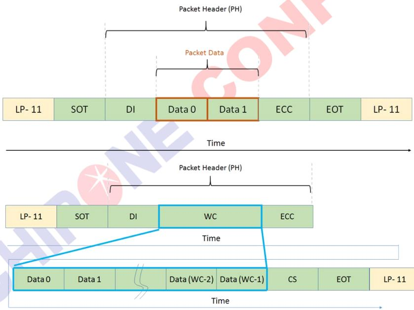

flowchart

```mermaid
graph LR
  subgraph Top_Left["Packet Header (PH)"]
  LP_11["LP- 11"] --> SOT["SOT"]
  SOT --> DI["DI"]
  DI --> Data_0["Data 0"]
  Data_0 --> Data_1["Data 1"]
  Data_1 --> ECC["ECC"]
  ECC --> EOT["EOT"]
  EOT --> LP_11["LP- 11"]
  end

  subgraph Bottom_Right["Packet Header (PH)"]
  LP_11 --> SOT["SOT"]
  SOT --> DI["DI"]
  WC["WC"] --> ECC["ECC"]
  Data_0 --> Data_1
  Data_2["Data (WC-2)"] --> Data_1
  Data_2 --> Data_1
  Data_1 --> CS["CS"]
  CS --> EOT["EOT"]
  LP_11 --> LP_11
  end
```

LP- 11 : Low Power – Stop State  
SOT : Start of Transmission  
DI : 8-bit, Data Identification  
Data0/Data1: 8-bit, Packet Data  
ECC : 8-bit, Error Correction Code  
EOT : End of Transmission  
LP- 11 : Low Power – Stop State  
SOT : Start of Transmission  
DI : 8-bit, Data Identification  
WC : 16-bit, Word Count  
ECC : 8-bit, Error Correction Code  
Data0.....Data(WC-1): Packet Data (0\~ 65535 bytes)  
CS : 16-bit, Check Sum = Packet Footer (PF)  
EOT : End of Transmission  
Packet Data in Short and Long Packets

# 5.6.3.10 Error Correction Code (ECC)

The Error Correction Code (ECC) is a part of Packet Header (PH) and its purpose is to identify an error or errors. The ECC protects the following fields:

- Short Packet (SPa): Data Identification (DI) byte (8 bits: D [0...7]), Packet Data (PD) bytes (16 bits: D [8...23]) and ECC (8 bits: P [0...7]).  
- Long Packet (LPa): Data Identification (DI) byte (8 bits: D [0...7]), Word Count (WC) bytes (16 bits: D [8...23]) and ECC (8 bits: P [0...7]) D [23...0] and P [7...0] are illustrated for reference purposes below.

<table><tr><td colspan="8">DI(Data Identification)</td><td colspan="8">Data 0(Packet Data)</td><td colspan="8">Data 1(Packet Data)</td><td colspan="8">ECC(Error Correction Code)</td></tr><tr><td colspan="8">8&#x27;b 05H</td><td colspan="8">8&#x27;b 10H</td><td colspan="8">8&#x27;b 00H</td><td colspan="8">8&#x27;b 2CH</td></tr><tr><td>1</td><td>0</td><td>1</td><td>0</td><td>0</td><td>0</td><td>0</td><td>0</td><td>0</td><td>0</td><td>0</td><td>0</td><td>1</td><td>0</td><td>0</td><td>0</td><td>0</td><td>0</td><td>0</td><td>0</td><td>0</td><td>0</td><td>0</td><td>0</td><td>0</td><td>0</td><td>1</td><td>1</td><td>0</td><td>1</td><td>0</td><td>0</td></tr><tr><td>B</td><td>B</td><td>B</td><td>B</td><td>B</td><td>B</td><td>B</td><td>B</td><td>B</td><td>B</td><td>B</td><td>B</td><td>B</td><td>B</td><td>B</td><td>B</td><td>B</td><td>B</td><td>B</td><td>B</td><td>B</td><td>B</td><td>B</td><td>B</td><td>B</td><td>B</td><td>B</td><td>B</td><td>B</td><td>B</td><td>B</td><td>B</td></tr><tr><td>0</td><td>1</td><td>2</td><td>3</td><td>4</td><td>5</td><td>6</td><td>7</td><td>0</td><td>1</td><td>2</td><td>3</td><td>4</td><td>5</td><td>6</td><td>7</td><td>0</td><td>1</td><td>2</td><td>3</td><td>4</td><td>5</td><td>6</td><td>7</td><td>0</td><td>1</td><td>2</td><td>3</td><td>4</td><td>5</td><td>6</td><td>7</td></tr><tr><td>L</td><td rowspan="3" colspan="6"></td><td>M</td><td>L</td><td rowspan="3" colspan="6"></td><td>M</td><td>L</td><td rowspan="3" colspan="6"></td><td>M</td><td>L</td><td rowspan="3" colspan="6"></td><td>M</td></tr><tr><td>S</td><td>S</td><td>S</td><td>S</td><td>S</td><td>S</td><td>S</td><td>S</td></tr><tr><td>B</td><td>B</td><td>B</td><td>B</td><td>B</td><td>B</td><td>B</td><td>B</td></tr></table>

Time

D [23:0] and D 7:0] in a Short Packet (SPa)

<table><tr><td colspan="8">DI(Data Identification)</td><td colspan="8">WC - LSB(Word Count – LSB)</td><td colspan="8">WC – MSB(Word Count – MSB)</td><td colspan="8">ECC(Error Correction Code)</td></tr><tr><td colspan="8">8&#x27;b 29H</td><td colspan="8">8&#x27;b 01H</td><td colspan="8">8&#x27;b 00H</td><td colspan="8">8&#x27;b 06H</td></tr><tr><td>1</td><td>0</td><td>0</td><td>1</td><td>0</td><td>1</td><td>0</td><td>0</td><td>1</td><td>0</td><td>0</td><td>0</td><td>0</td><td>0</td><td>0</td><td>0</td><td>0</td><td>0</td><td>0</td><td>0</td><td>0</td><td>0</td><td>0</td><td>0</td><td>0</td><td>1</td><td>1</td><td>0</td><td>0</td><td>0</td><td>0</td><td>0</td></tr><tr><td>B</td><td>B</td><td>B</td><td>B</td><td>B</td><td>B</td><td>B</td><td>B</td><td>B</td><td>B</td><td>B</td><td>B</td><td>B</td><td>B</td><td>B</td><td>B</td><td>B</td><td>B</td><td>B</td><td>B</td><td>B</td><td>B</td><td>B</td><td>B</td><td>B</td><td>B</td><td>B</td><td>B</td><td>B</td><td>B</td><td>B</td><td>B</td></tr><tr><td>0</td><td>1</td><td>2</td><td>3</td><td>4</td><td>5</td><td>6</td><td>7</td><td>0</td><td>1</td><td>2</td><td>3</td><td>4</td><td>5</td><td>6</td><td>7</td><td>0</td><td>1</td><td>2</td><td>3</td><td>4</td><td>5</td><td>6</td><td>7</td><td>0</td><td>1</td><td>2</td><td>3</td><td>4</td><td>5</td><td>6</td><td>7</td></tr><tr><td>LSB</td><td colspan="6"></td><td>MSB</td><td>LSB</td><td colspan="6"></td><td>MSB</td><td>LSB</td><td colspan="6"></td><td>MSB</td><td>LSB</td><td colspan="6"></td><td>MSB</td></tr></table>

Time

# D [23:0] and D 7:0] in a Long Packet (LPa)

Error Correction Code (ECC) can recognize one or several error(s) and can only correct one-bit error. Bits (P [7...0]) of the Error Correction Code (ECC) are defined, where the symbol „^” presents the XOR function (Pn is 1 if there is odd number of 1, and Pn is 0 if there is even number of 1) as follows.

• P7 = 0.  
- P6 = 0.  
• P5 = D10^D11^D12^D13^D14^D15^D16^D17^D18^D19^D21^D22^D23.  
• P4 = D4^D5^D6^D7^D8^D9^D16^D17^D18^D19^D20^D22^D23.  
• P3 = D1^D2^D3^D7^D8^D9^D13^D14^D15^D19^D20^D21^D23.  
• P2 = D0^D2^D3^D5^D6^D9^D11^D12^D15^D18^D20^D21^D22.  
- P1 = D0^D1^D3^D4^D6^D8^D10^D12^D14^D17^D20^D21^D22^D23.  
• P0 = D0^D1^D2^D4^D5^D7^D10^D11^D13^D16^D20^D21^D22^D23.

P7 and P6 are set to 0 because Error Correction Code (ECC) is based on 64 bit value (D

[63...0]), but this implementation is based on 24 bit value (D [23...0]). Therefore, only 6 bits are needed (P [5...0]) for Error Correction Code (ECC).

<table><tr><td colspan="8">DI(Data Identification)</td><td colspan="8">Data 0</td><td colspan="8">Data 1</td><td colspan="8">ECC(Error Correction Code)</td></tr><tr><td colspan="8">8&#x27;b 05H</td><td colspan="8">8&#x27;b 10H</td><td colspan="8">8&#x27;b 00H</td><td colspan="8">8&#x27;b 2CH</td></tr><tr><td>1</td><td>0</td><td>1</td><td>0</td><td>0</td><td>0</td><td>0</td><td>0</td><td>0</td><td>0</td><td>0</td><td>0</td><td>1</td><td>0</td><td>0</td><td>0</td><td>0</td><td>0</td><td>0</td><td>0</td><td>0</td><td>0</td><td>0</td><td>0</td><td>0</td><td>0</td><td>1</td><td>1</td><td>0</td><td>1</td><td>0</td><td>0</td></tr><tr><td>D0</td><td>D1</td><td>D2</td><td></td><td>D4</td><td>D5</td><td></td><td>D7</td><td></td><td></td><td>D10</td><td>D11</td><td></td><td>D13</td><td></td><td></td><td>D16</td><td></td><td></td><td></td><td>D20</td><td>D21</td><td>D22</td><td>D23</td><td>P0</td><td></td><td></td><td></td><td></td><td></td><td></td><td></td></tr><tr><td>D0</td><td>D1</td><td></td><td>D3</td><td>D4</td><td></td><td>D6</td><td></td><td>D8</td><td></td><td>D10</td><td></td><td>D12</td><td></td><td>D14</td><td></td><td></td><td>D17</td><td></td><td></td><td>D20</td><td>D21</td><td>D22</td><td>D23</td><td></td><td>P1</td><td></td><td></td><td></td><td></td><td></td><td></td></tr><tr><td>D0</td><td></td><td>D2</td><td>D3</td><td></td><td>D5</td><td>D6</td><td></td><td></td><td>D9</td><td></td><td>D11</td><td>D12</td><td></td><td></td><td>D15</td><td></td><td></td><td>D18</td><td></td><td>D20</td><td>D21</td><td>D22</td><td></td><td></td><td></td><td>P2</td><td></td><td></td><td></td><td></td><td></td></tr><tr><td></td><td>D1</td><td>D2</td><td>D3</td><td></td><td></td><td></td><td>D7</td><td>D8</td><td>D9</td><td></td><td></td><td></td><td>D13</td><td>D14</td><td>D15</td><td></td><td></td><td></td><td>D19</td><td>D20</td><td>D21</td><td></td><td>D23</td><td></td><td></td><td></td><td>P3</td><td></td><td></td><td></td><td></td></tr><tr><td></td><td></td><td></td><td></td><td>D4</td><td>D5</td><td>D6</td><td>D7</td><td>D8</td><td>D9</td><td></td><td></td><td></td><td></td><td></td><td></td><td>D16</td><td>D17</td><td>D18</td><td>D19</td><td>D20</td><td></td><td>D22</td><td>D23</td><td></td><td></td><td></td><td></td><td>P4</td><td></td><td></td><td></td></tr><tr><td></td><td></td><td></td><td></td><td></td><td></td><td></td><td></td><td></td><td></td><td>D10</td><td>D11</td><td>D12</td><td>D13</td><td>D14</td><td>D15</td><td>D16</td><td>D17</td><td>D18</td><td>D19</td><td></td><td>D21</td><td>D22</td><td>D23</td><td></td><td></td><td></td><td></td><td></td><td>P5</td><td></td><td></td></tr><tr><td>B0</td><td>B1</td><td>B2</td><td>B3</td><td>B4</td><td>B5</td><td>B6</td><td>B7</td><td>B0</td><td>B1</td><td>B2</td><td>B3</td><td>B4</td><td>B5</td><td>B6</td><td>B7</td><td>B0</td><td>B1</td><td>B2</td><td>B3</td><td>B4</td><td>B5</td><td>B6</td><td>B7</td><td>B0</td><td>B1</td><td>B2</td><td>B3</td><td>B4</td><td>B5</td><td>B6</td><td>B7</td></tr><tr><td>LSB</td><td colspan="6"></td><td>MSB</td><td>LSB</td><td colspan="6"></td><td>MSB</td><td>LSB</td><td colspan="6"></td><td>MSB</td><td>LSB</td><td colspan="6"></td><td>MSB</td></tr></table>

Time

XOR Function on Short Packet (SPa)

<table><tr><td colspan="8">DI(Data Identification)</td><td colspan="8">WC - LSB(Word Count – LSB)</td><td colspan="8">WC - MSB(Word Count – MSB)</td><td colspan="8">ECC(Error Correction Code)</td></tr><tr><td colspan="8">8&#x27;b 29H</td><td colspan="8">8&#x27;b 01H</td><td colspan="8">8&#x27;b 00H</td><td colspan="8">8&#x27;b 06H</td></tr><tr><td>1</td><td>0</td><td>0</td><td>1</td><td>0</td><td>1</td><td>0</td><td>0</td><td>1</td><td>0</td><td>0</td><td>0</td><td>0</td><td>0</td><td>0</td><td>0</td><td>0</td><td>0</td><td>0</td><td>0</td><td>0</td><td>0</td><td>0</td><td>0</td><td>0</td><td>1</td><td>1</td><td>0</td><td>0</td><td>0</td><td>0</td><td>0</td></tr><tr><td>D0</td><td>D1</td><td>D2</td><td></td><td>D4</td><td>D5</td><td></td><td>D7</td><td></td><td></td><td>D10</td><td>D11</td><td></td><td>D13</td><td></td><td></td><td>D16</td><td></td><td></td><td></td><td>D20</td><td>D21</td><td>D22</td><td>D23</td><td>P0</td><td></td><td></td><td></td><td></td><td></td><td></td><td></td></tr><tr><td>D0</td><td>D1</td><td></td><td>D3</td><td>D4</td><td></td><td>D6</td><td></td><td>D8</td><td></td><td>D10</td><td></td><td>D12</td><td></td><td>D14</td><td></td><td></td><td>D17</td><td></td><td></td><td>D20</td><td>D21</td><td>D22</td><td>D23</td><td></td><td>P1</td><td></td><td></td><td></td><td></td><td></td><td></td></tr><tr><td>D0</td><td></td><td>D2</td><td>D3</td><td></td><td>D5</td><td>D6</td><td></td><td></td><td>D9</td><td></td><td>D11</td><td>D12</td><td></td><td></td><td>D15</td><td></td><td></td><td>D18</td><td></td><td>D20</td><td>D21</td><td>D22</td><td></td><td></td><td></td><td>P2</td><td></td><td></td><td></td><td></td><td></td></tr><tr><td></td><td>D1</td><td>D2</td><td>D3</td><td></td><td></td><td></td><td>D7</td><td>D8</td><td>D9</td><td></td><td></td><td></td><td>D13</td><td>D14</td><td>D15</td><td></td><td></td><td></td><td>D19</td><td>D20</td><td>D21</td><td></td><td>D23</td><td></td><td></td><td></td><td>P3</td><td></td><td></td><td></td><td></td></tr><tr><td></td><td></td><td></td><td></td><td>D4</td><td>D5</td><td>D6</td><td>D7</td><td>D8</td><td>D9</td><td></td><td></td><td></td><td></td><td></td><td></td><td>D16</td><td>D17</td><td>D18</td><td>D19</td><td>D20</td><td></td><td>D22</td><td>D23</td><td></td><td></td><td></td><td></td><td>P4</td><td></td><td></td><td></td></tr><tr><td></td><td></td><td></td><td></td><td></td><td></td><td></td><td></td><td></td><td></td><td>D10</td><td>D11</td><td>D12</td><td>D13</td><td>D14</td><td>D15</td><td>D16</td><td>D17</td><td>D18</td><td>D19</td><td></td><td>D21</td><td>D22</td><td>D23</td><td></td><td></td><td></td><td></td><td></td><td>P5</td><td></td><td></td></tr><tr><td>B0</td><td>B1</td><td>B2</td><td>B3</td><td>B4</td><td>B5</td><td>B6</td><td>B7</td><td>B0</td><td>B1</td><td>B2</td><td>B3</td><td>B4</td><td>B5</td><td>B6</td><td>B7</td><td>B0</td><td>B1</td><td>B2</td><td>B3</td><td>B4</td><td>B5</td><td>B6</td><td>B7</td><td>B0</td><td>B1</td><td>B2</td><td>B3</td><td>B4</td><td>B5</td><td>B6</td><td>B7</td></tr><tr><td>LSB</td><td colspan="6"></td><td>MSB</td><td>LSB</td><td colspan="6"></td><td>MSB</td><td>LSB</td><td colspan="6"></td><td>MSB</td><td>LSB</td><td colspan="6"></td><td>MSB</td></tr></table>

# Time

# XOR Function on Long Packet (LPa)

The transmitter (= the MCU or the Display Module) will send data bits D [23...0] and Error Correction Code (ECC) P [7...0]. The receiver (= the Display module or the MCU) will calculate the Internal Error Correction Code (IECC) and compare the received Error Correction Code (ECC) and the Internal Error Correction Code (IECC). This comparison is done when each power bit of ECC and IECC have performed the XOR function. The result of this function is PO [7...0]. This functionality, where the transmitter is the MCU and the receiver is the display module, is illustrated for reference purposes below.

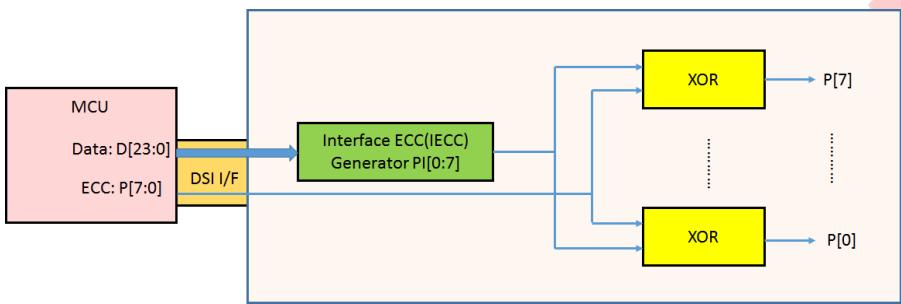

flowchart

```mermaid
graph LR
  A["&quot;MCU\nData: D[23:0"]\nECC: P["7:0"]"] --> B["DSI I/F"]
  B --> C["&quot;Interface ECC(IECC)\nGenerator PI[0:7"]"]
  C --> D["XOR"]
  C --> E["XOR"]
  D --> F["&quot;P[7"]"]
  E --> G["&quot;P[0"]"]
```

Internal Error Correction Code (IECC) on the Display Module (= the Receiver)

The sent data bits (D [23...0]) and ECC (P [7...0]) are correctly received if the value of the PO [7...0]) is 00h.

The sent data bits (D [23...0]) and ECC (P [7...0]) are not correctly received if the value of the PO [7...0]) is not 00h.

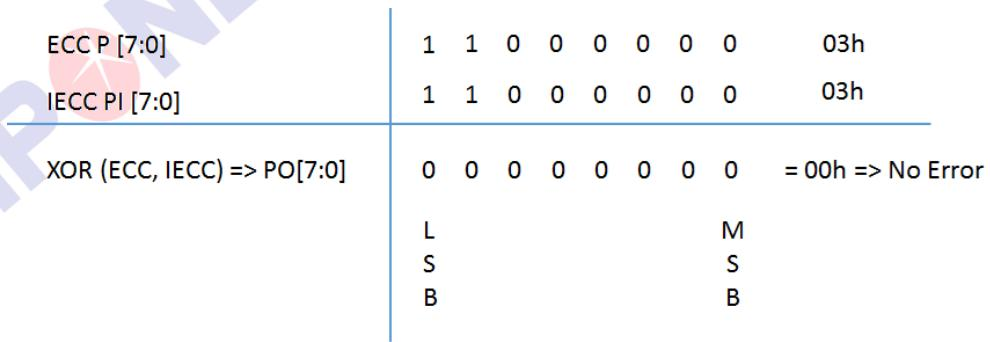

other

| Signal | State 1 | State 2 | State 3 | State 4 | State 5 | State 6 |
| --- | --- | --- | --- | --- | --- | --- |
| ECC P [7:0] | 1 | 1 | 0 | 0 | 0 | 0 |
| IECC PI [7:0] | 1 | 1 | 0 | 0 | 0 | 0 |
| XOR (ECC, IECC) => PO[7:0] | 0 | 0 | 0 | 0 | 0 | 0 |
| XOR (ECC, IECC) => NO Error | L | — | — | — | M | — |
| XOR (ECC, IECC) => NO Error | S | — | — | — | S | — |
| XOR (ECC, IECC) => NO Error | B | — | — | — | B | — |
| XOR (ECC, IECC) => NO Error | — | — | — | — | — | 03h |
| XOR (ECC, IECC) => NO Error | — | — | — | — | — | 03h |

Internal XOR Calculation between ECC and IECC Values – No Error

<table><tr><td>ECC P [7:0]</td><td>1</td><td>1</td><td>0</td><td>0</td><td>0</td><td>0</td><td>0</td><td>0</td><td>03h</td></tr><tr><td>IECC PI [7:0]</td><td>1</td><td>1</td><td>1</td><td>1</td><td>0</td><td>0</td><td>0</td><td>0</td><td>0Fh</td></tr><tr><td>XOR (ECC, IECC) =&gt; PO[7:0]</td><td>0</td><td>0</td><td>1</td><td>1</td><td>0</td><td>0</td><td>0</td><td>0</td><td>= 0Ch =&gt; Error</td></tr><tr><td></td><td>L</td><td></td><td></td><td></td><td></td><td></td><td></td><td>M</td><td></td></tr><tr><td></td><td>S</td><td></td><td></td><td></td><td></td><td></td><td></td><td>S</td><td></td></tr><tr><td></td><td>B</td><td></td><td></td><td></td><td></td><td></td><td></td><td>B</td><td></td></tr></table>

# Internal XOR Calculation between ECC and IECC Values – Error

The received Error Correction Code (ECC) can be 00h when the Error Correction Code (ECC) function is not used for data values D [23...0] on the transmitter side. The number of the errors (one or more) can be defined when the value of the PO [7...0] is compared to the values in the following table.

The number of the errors define

<table><tr><td>Data Bit</td><td>PO7</td><td>PO6</td><td>PO5</td><td>PO4</td><td>PO3</td><td>PO2</td><td>PO1</td><td>PO0</td><td>Hex</td></tr><tr><td>D [0]</td><td>0</td><td>0</td><td>0</td><td>0</td><td>0</td><td>1</td><td>1</td><td>1</td><td>07h</td></tr><tr><td>D [1]</td><td>0</td><td>0</td><td>0</td><td>0</td><td>1</td><td>0</td><td>1</td><td>1</td><td>0Bh</td></tr><tr><td>D [2]</td><td>0</td><td>0</td><td>0</td><td>0</td><td>1</td><td>1</td><td>0</td><td>1</td><td>0Dh</td></tr><tr><td>D [3]</td><td>0</td><td>0</td><td>0</td><td>0</td><td>1</td><td>1</td><td>1</td><td>0</td><td>0Eh</td></tr><tr><td>D [4]</td><td>0</td><td>0</td><td>0</td><td>1</td><td>0</td><td>0</td><td>1</td><td>1</td><td>13h</td></tr><tr><td>D [5]</td><td>0</td><td>0</td><td>0</td><td>1</td><td>0</td><td>1</td><td>0</td><td>1</td><td>15h</td></tr><tr><td>D [6]</td><td>0</td><td>0</td><td>0</td><td>1</td><td>0</td><td>1</td><td>1</td><td>0</td><td>16h</td></tr><tr><td>D [7]</td><td>0</td><td>0</td><td>0</td><td>1</td><td>1</td><td>0</td><td>0</td><td>1</td><td>19h</td></tr><tr><td>D [8]</td><td>0</td><td>0</td><td>0</td><td>1</td><td>1</td><td>0</td><td>1</td><td>0</td><td>1Ah</td></tr><tr><td>D [9]</td><td>0</td><td>0</td><td>0</td><td>1</td><td>1</td><td>1</td><td>0</td><td>0</td><td>1Ch</td></tr><tr><td>D [10]</td><td>0</td><td>0</td><td>1</td><td>0</td><td>0</td><td>0</td><td>1</td><td>1</td><td>23h</td></tr><tr><td>D [11]</td><td>0</td><td>0</td><td>1</td><td>0</td><td>0</td><td>1</td><td>0</td><td>1</td><td>25h</td></tr><tr><td>D [12]</td><td>0</td><td>0</td><td>1</td><td>0</td><td>0</td><td>1</td><td>1</td><td>0</td><td>26h</td></tr><tr><td>D [13]</td><td>0</td><td>0</td><td>1</td><td>0</td><td>1</td><td>0</td><td>0</td><td>1</td><td>29h</td></tr><tr><td>D [14]</td><td>0</td><td>0</td><td>1</td><td>0</td><td>1</td><td>0</td><td>1</td><td>0</td><td>2Ah</td></tr><tr><td>D [15]</td><td>0</td><td>0</td><td>1</td><td>0</td><td>1</td><td>1</td><td>0</td><td>0</td><td>2Ch</td></tr><tr><td>D [16]</td><td>0</td><td>0</td><td>1</td><td>1</td><td>0</td><td>0</td><td>0</td><td>1</td><td>31h</td></tr><tr><td>D [17]</td><td>0</td><td>0</td><td>1</td><td>1</td><td>0</td><td>0</td><td>1</td><td>0</td><td>32h</td></tr><tr><td>D [18]</td><td>0</td><td>0</td><td>1</td><td>1</td><td>0</td><td>1</td><td>0</td><td>0</td><td>34h</td></tr><tr><td>D [19]</td><td>0</td><td>0</td><td>1</td><td>1</td><td>1</td><td>0</td><td>0</td><td>0</td><td>38h</td></tr><tr><td>D [20]</td><td>0</td><td>0</td><td>0</td><td>1</td><td>1</td><td>1</td><td>1</td><td>1</td><td>1Fh</td></tr><tr><td>D [21]</td><td>0</td><td>0</td><td>1</td><td>0</td><td>1</td><td>1</td><td>1</td><td>1</td><td>2Fh</td></tr><tr><td>D [22]</td><td>0</td><td>0</td><td>1</td><td>1</td><td>0</td><td>1</td><td>1</td><td>1</td><td>37h</td></tr><tr><td>D [23]</td><td>0</td><td>0</td><td>1</td><td>1</td><td>1</td><td>0</td><td>1</td><td>1</td><td>3Bh</td></tr></table>

An error is detected if the value of the PO [7...0] is in Table, and the receiver can correct this one bit error because this found value also defines the location of the corrupt bit, e.g.

- PO [7...0] = 0Eh.  
- The bit of the data (D [23...0]), that is not correct, is D [3] More than one error is detected if the value of the PO [7...0] is not in Table for example, PO [7...0] = 0Ch.

# 5.6.3.11 Packet Data (PD) in a Long Packet (LPa)

Packet Data (PD) of a Long Packet (LPa) is placed after the Packet Header (PH) of a Long Packet (LPa). The amount of the data bytes is defined in the section “Word Count (WC) in a Long Packet (LPa)”.

# 5.6.3.12 Packet Footer (PF) in a Long Packet (LPa)

Packet Footer (PF) of a Long Packet (LPa) is placed after the Packet Data (PD) of a Long Packet (LPa). The Packet Footer (PF) is a checksum value that is calculated from the Packet Data of the Long Packet (LPa). The checksum uses a 16-bit Cyclic Redundancy Check (CRC) value which is generated by a polynomial X16+X12+X5+X0, as illustrated below.

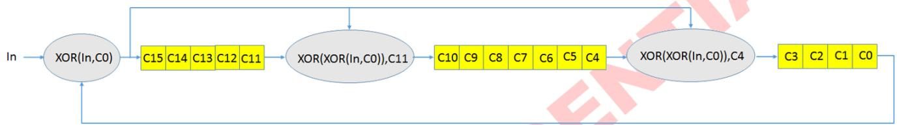

flowchart

```mermaid
graph LR
  In --> XOR(In,C0)
  XOR(In,C0) --> C15
  C15 --> XOR(XOR(In,C0)),C11
  XOR(XOR(In,C0)),C11 --> C10
  C10 --> XOR(XOR(XOR(In,C0)),C4)
  XOR(XOR(XOR(In,C0)),C4 --> C3
  C3 --> C2
  C2 --> C1
  C1 --> C0
  C0 --> XOR(In,C0)
```

16-bit Cyclic Redundancy Check (CRC) Calculation

The 16-bit Cyclic Redundancy Check (CRC) generator is initialized to FFFFh before calculations. The Most Significant Bit (MSB) of the data byte of the Packet Data (PD) is the first bit which is inputted into the 16-bit Cyclic Redundancy Check (CRC). An example of the 16-bit Cyclic Redundancy Check (CRC), where the Packet Data (PD) of a Long Packet (LPa) is 01h, is illustrated (step-by-step) below.  
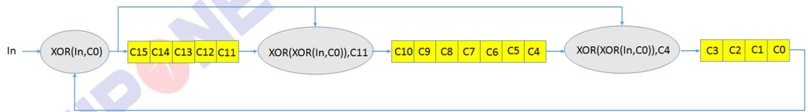

flowchart

```mermaid
graph LR
  In --> XOR(In,C0)
  XOR(In,C0) --> C15_C14_C13_C12_C11
  C15_C14_C13_C12_C11 --> XOR(XOR(In,C0)),C11
  XOR(XOR(In,C0)),C11 --> C10_C9_C8_C7_C6_C5_C4
  C10_C9_C8_C7_C6_C5_C4 --> XOR(XOR(In,C0)),C4
  XOR(XOR(In,C0)),C4 --> C3_C2_C1_C0
  C3_C2_C1_C0 --> XOR(In,C0)
```

<table><tr><td>Step</td><td>In</td><td>XOR(in,C0)</td><td>C15</td><td>C14</td><td>C13</td><td>C12</td><td>C11</td><td>XOR(XOR(In,C0),C11,(Step-1))</td><td>C10</td><td>C9</td><td>C8</td><td>C7</td><td>C6</td><td>C5</td><td>C4</td><td>XOR(XOR(In,C0),C4,(Step-1))</td><td>C3</td><td>C2</td><td>C1</td><td>C0</td><td>C0</td></tr><tr><td>0</td><td>X</td><td>X</td><td>1</td><td>1</td><td>1</td><td>1</td><td>1</td><td>X</td><td>1</td><td>1</td><td>1</td><td>1</td><td>1</td><td>1</td><td>1</td><td>X</td><td>1</td><td>1</td><td>1</td><td>1</td><td>X</td></tr><tr><td>1</td><td>1(LSB)</td><td>0</td><td>0</td><td>1</td><td>1</td><td>1</td><td>1</td><td>1</td><td>1</td><td>1</td><td>1</td><td>1</td><td>1</td><td>1</td><td>1</td><td>1</td><td>1</td><td>1</td><td>1</td><td>1</td><td>1</td></tr><tr><td>2</td><td>0</td><td>1</td><td>1</td><td>0</td><td>1</td><td>1</td><td>1</td><td>0</td><td>0</td><td>1</td><td>1</td><td>1</td><td>1</td><td>1</td><td>1</td><td>0</td><td>0</td><td>1</td><td>1</td><td>1</td><td>1</td></tr><tr><td>3</td><td>0</td><td>1</td><td>1</td><td>1</td><td>0</td><td>1</td><td>1</td><td>0</td><td>0</td><td>0</td><td>1</td><td>1</td><td>1</td><td>1</td><td>1</td><td>0</td><td>0</td><td>0</td><td>1</td><td>1</td><td>1</td></tr><tr><td>4</td><td>0</td><td>1</td><td>1</td><td>1</td><td>1</td><td>0</td><td>1</td><td>0</td><td>0</td><td>0</td><td>0</td><td>1</td><td>1</td><td>1</td><td>1</td><td>0</td><td>0</td><td>0</td><td>0</td><td>1</td><td>1</td></tr><tr><td>5</td><td>0</td><td>1</td><td>1</td><td>1</td><td>1</td><td>1</td><td>0</td><td>0</td><td>0</td><td>0</td><td>0</td><td>0</td><td>1</td><td>1</td><td>1</td><td>0</td><td>0</td><td>0</td><td>0</td><td>0</td><td>0</td></tr><tr><td>6</td><td>0</td><td>0</td><td>0</td><td>1</td><td>1</td><td>1</td><td>1</td><td>0</td><td>0</td><td>0</td><td>0</td><td>0</td><td>0</td><td>1</td><td>1</td><td>0</td><td>1</td><td>0</td><td>0</td><td>0</td><td>0</td></tr><tr><td>7</td><td>0</td><td>0</td><td>0</td><td>0</td><td>1</td><td>1</td><td>1</td><td>1</td><td>1</td><td>0</td><td>0</td><td>0</td><td>0</td><td>0</td><td>1</td><td>0</td><td>1</td><td>1</td><td>0</td><td>0</td><td>0</td></tr><tr><td>8</td><td></td><td></td><td></td><td></td><td></td><td></td><td></td><td></td><td></td><td></td><td></td><td></td><td></td><td></td><td></td><td></td><td></td><td></td><td></td><td></td><td></td></tr><tr><td></td><td></td><td></td><td></td><td></td><td></td><td></td><td></td><td></td><td></td><td></td><td></td><td></td><td></td><td></td><td></td><td></td><td></td><td></td><td></td><td></td><td></td></tr><tr><td></td><td></td><td></td><td></td><td></td><td></td><td></td><td></td><td></td><td></td><td></td><td></td><td></td><td></td><td></td><td></td><td></td><td></td><td></td><td></td><td></td><td></td></tr></table>

CRC Calculation – Packet Data (PD) is 01h

The value of the Packet Footer (PF) is 1E0Eh in this example (Command 01h has been sent), and is illustrated below.

<table><tr><td colspan="8">DI(Data Identification)</td><td colspan="8">WC - LSB(Word Count – LSB)</td><td colspan="8">WC – MSB(Word Count – MSB)</td><td colspan="8">ECC(Error Correction Code)</td></tr><tr><td colspan="8">8&#x27;b 39H</td><td colspan="8">8&#x27;b 01H</td><td colspan="8">8&#x27;b 00H</td><td colspan="8">8&#x27;b 15H</td></tr><tr><td>1</td><td>0</td><td>0</td><td>1</td><td>1</td><td>1</td><td>0</td><td>0</td><td>1</td><td>0</td><td>0</td><td>0</td><td>0</td><td>0</td><td>0</td><td>0</td><td>0</td><td>0</td><td>0</td><td>0</td><td>0</td><td>0</td><td>0</td><td>0</td><td>1</td><td>0</td><td>1</td><td>0</td><td>1</td><td>0</td><td>0</td><td>0</td></tr><tr><td>B</td><td>B</td><td>B</td><td>B</td><td>B</td><td>B</td><td>B</td><td>B</td><td>B</td><td>B</td><td>B</td><td>B</td><td>B</td><td>B</td><td>B</td><td>B</td><td>B</td><td>B</td><td>B</td><td>B</td><td>B</td><td>B</td><td>B</td><td>B</td><td>B</td><td>B</td><td>B</td><td>B</td><td>B</td><td>B</td><td>B</td><td>B</td></tr><tr><td>0</td><td>1</td><td>2</td><td>3</td><td>4</td><td>5</td><td>6</td><td>7</td><td>0</td><td>1</td><td>2</td><td>3</td><td>4</td><td>5</td><td>6</td><td>7</td><td>0</td><td>1</td><td>2</td><td>3</td><td>4</td><td>5</td><td>6</td><td>7</td><td>0</td><td>1</td><td>2</td><td>3</td><td>4</td><td>5</td><td>6</td><td>7</td></tr><tr><td>L</td><td rowspan="3" colspan="6"></td><td>M</td><td>L</td><td rowspan="3" colspan="5"></td><td>M</td><td rowspan="2">L</td><td rowspan="3" colspan="6"></td><td>M</td><td rowspan="2">L</td><td rowspan="3" colspan="7"></td><td>M</td></tr><tr><td>S</td><td>S</td><td>S</td><td>S</td><td>S</td><td>S</td></tr><tr><td>B</td><td>B</td><td>B</td><td>B</td><td>B</td><td>B</td><td>B</td><td>B</td></tr></table>

Time

<table><tr><td colspan="8">Data 0(Packet Data)</td><td colspan="8">CRC- LSB</td><td colspan="8">CRC- MSB</td></tr><tr><td colspan="8">8&#x27;b 00H</td><td colspan="8">8&#x27;b 0EH</td><td colspan="8">8&#x27;b 1EH</td></tr><tr><td>0</td><td>0</td><td>0</td><td>0</td><td>0</td><td>0</td><td>0</td><td>0</td><td>0</td><td>1</td><td>1</td><td>1</td><td>0</td><td>0</td><td>0</td><td>0</td><td>0</td><td>1</td><td>1</td><td>1</td><td>1</td><td>0</td><td>0</td><td>0</td></tr><tr><td>B</td><td>B</td><td>B</td><td>B</td><td>B</td><td>B</td><td>B</td><td>B</td><td>B</td><td>B</td><td>B</td><td>B</td><td>B</td><td>B</td><td>B</td><td>B</td><td>B</td><td>B</td><td>B</td><td>B</td><td>B</td><td>B</td><td>B</td><td>B</td></tr><tr><td>0</td><td>1</td><td>2</td><td>3</td><td>4</td><td>5</td><td>6</td><td>7</td><td>0</td><td>1</td><td>2</td><td>3</td><td>4</td><td>5</td><td>6</td><td>7</td><td>0</td><td>1</td><td>2</td><td>3</td><td>4</td><td>5</td><td>6</td><td>7</td></tr><tr><td>L</td><td rowspan="3" colspan="6"></td><td>M</td><td rowspan="2">L</td><td rowspan="3" colspan="6"></td><td>M</td><td rowspan="2">L</td><td rowspan="3" colspan="6"></td><td>M</td></tr><tr><td>S</td><td>S</td><td>S</td><td>S</td></tr><tr><td>B</td><td>B</td><td>B</td><td>B</td><td>B</td><td>B</td></tr></table>

Time

# Packet Footer (PF) Example

The receiver calculates its checksum value from the received Packet Data (PD). The receiver compares its checksum and the Packet Footer (PF) that the transmitter has sent. The received Packet Data (PD) and Packet Footer (PF) are correct if the checksum of the receiver and Packet Footer (PF) are equal. The received Packet Data (PD) and Packet Footer (PF) are not correct if the checksum of the receiver and Packet Footer (PF) are not equal.

# 5.6.4 Packet Transmissions

# 5.6.4.1 Display Command Set (DCS)

Display Command Set (DCS), defined in the section “Command 1 Description”, is used from the MCU to the display module. This Display Command Set (DCS) is always defined in the Data 0 of the Packet Data (PD), and is included in Short Packet (SPa) and Long packet (LPa), as illustrated below.

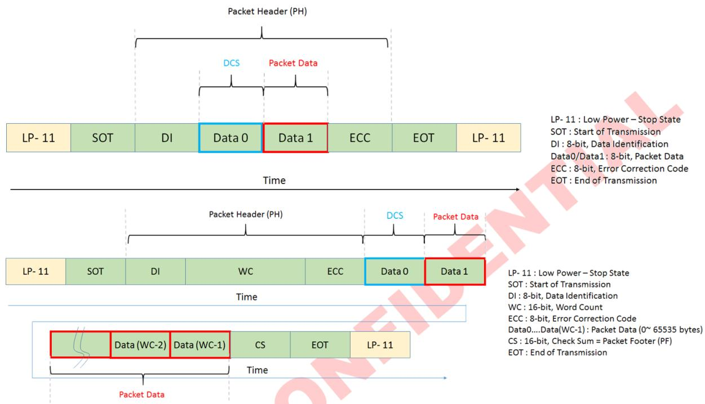

flowchart

```mermaid
graph TD
  subgraph Packet Header [Packet Header (PH)]
    direction TB
  LP-11_SOT["LP- 11"] --> DI["DI"]
  DI --> Data0["Data 0"]
  Data0 --> Data1["Data 1"]
  Data1 --> ECC_EOT["ECC"]
  ECC_EOT --> LP-11_LP["LP- 11"]
  end

  subgraph Packet Data [Packet Data]
    direction TB
  LP11Sot["LP-11_SOT"] --> DI_WC["DI"]
  DI_WC --> ECC_ECC["ECC"]
  ECC_ECC --> Data0["Data 0"]
  Data0 --> Data1["Data 1"]
  Data1 --> LP-11_LP2["LP- 11"]
  end

  LP11Lp["LP-11_LP"] --> Time_Start
  Time_Start --> Time_End
  Time_End --> Time_End
```

Display Command Set (DCS) in Short Packet (SPa) and Long Packet (LPa)

# 5.6.4.2 Display Command Set (DCS) Write, No Parameter (DSCWN-S)

"Display Command Set (DCS) Write, No Parameter", which is defined in Data Type (DT, 00 0101b), is always used in a Short Packet (SPa) from the MCU to the display module. These commands are defined in a table below:

DSCWN-S Commands

<table><tr><td>Command</td></tr><tr><td>NOP (00h)</td></tr><tr><td>Software Reset (01h)</td></tr><tr><td>Sleep In (10h)</td></tr><tr><td>Sleep Out (11h)</td></tr><tr><td>Normal Display Mode On (13h)</td></tr><tr><td>INVOff (20h)</td></tr><tr><td>INVOn (21h)</td></tr><tr><td>All Pixel Off (22h)</td></tr><tr><td>All Pixel On (23h)</td></tr><tr><td>Display Off (28h)</td></tr><tr><td>Display On (29h)</td></tr><tr><td>Tearing Effect Line Off (34h)</td></tr><tr><td>Idle Mode Off (38h)</td></tr><tr><td>Idle Mode On (39h)</td></tr></table>

A Short Packet (SPa) is defined as:

\- Data Identification (DI):

• Virtual Channel (VC, DI [7...6]): 00b.  
• Data Type (DT, DI [5...0]): 00 0101b.

\- Packet Data (PD):

• Data 0: "Sleep In (10h)", Display Command Set (DCS).  
• Data 1: Always 00hex.

\- Error Correction Code (ECC).

<table><tr><td colspan="8">DI(Data Identification)</td><td colspan="8">Data 0(Packet Data)</td><td colspan="8">Data 1(Packet Data)</td><td colspan="8">ECC(Error Correction Code)</td></tr><tr><td colspan="8">8&#x27;b 05H</td><td colspan="8">8&#x27;b 10H</td><td colspan="8">8&#x27;b 00H</td><td colspan="8">8&#x27;b 2CH</td></tr><tr><td>1</td><td>0</td><td>1</td><td>0</td><td>0</td><td>0</td><td>0</td><td>0</td><td>0</td><td>0</td><td>0</td><td>0</td><td>1</td><td>0</td><td>0</td><td>0</td><td>0</td><td>0</td><td>0</td><td>0</td><td>0</td><td>0</td><td>0</td><td>0</td><td>0</td><td>0</td><td>1</td><td>1</td><td>0</td><td>1</td><td>0</td><td>0</td></tr><tr><td>B</td><td>B</td><td>B</td><td>B</td><td>B</td><td>B</td><td>B</td><td>B</td><td>B</td><td>B</td><td>B</td><td>B</td><td>B</td><td>B</td><td>B</td><td>B</td><td>B</td><td>B</td><td>B</td><td>B</td><td>B</td><td>B</td><td>B</td><td>B</td><td>B</td><td>B</td><td>B</td><td>B</td><td>B</td><td>B</td><td>B</td><td>B</td></tr><tr><td>0</td><td>1</td><td>2</td><td>3</td><td>4</td><td>5</td><td>6</td><td>7</td><td>0</td><td>1</td><td>2</td><td>3</td><td>4</td><td>5</td><td>6</td><td>7</td><td>0</td><td>1</td><td>2</td><td>3</td><td>4</td><td>5</td><td>6</td><td>7</td><td>0</td><td>1</td><td>2</td><td>3</td><td>4</td><td>5</td><td>6</td><td>7</td></tr><tr><td>L</td><td></td><td></td><td></td><td></td><td></td><td></td><td>M</td><td>L</td><td></td><td></td><td></td><td></td><td></td><td></td><td>M</td><td>L</td><td></td><td></td><td></td><td></td><td></td><td></td><td>M</td><td>L</td><td></td><td></td><td></td><td></td><td></td><td></td><td>M</td></tr><tr><td>S</td><td></td><td></td><td></td><td></td><td></td><td></td><td>S</td><td>S</td><td></td><td></td><td></td><td></td><td></td><td></td><td>S</td><td>S</td><td></td><td></td><td></td><td></td><td></td><td></td><td>S</td><td>S</td><td></td><td></td><td></td><td></td><td></td><td></td><td>S</td></tr><tr><td>B</td><td></td><td></td><td></td><td></td><td></td><td></td><td>B</td><td>B</td><td></td><td></td><td></td><td></td><td></td><td></td><td>B</td><td>B</td><td></td><td></td><td></td><td></td><td></td><td></td><td>B</td><td>B</td><td></td><td></td><td></td><td></td><td></td><td></td><td>B</td></tr></table>

Time

Display Command Set (DCS) Write, No Parameter (DCSWN-S) – Example

# 5.6.4.3 Display Command Set (DCS) Write, 1 Parameter (DSCW1-S)

"Display Command Set (DCS) Write, 1 Parameter" (DCSW1-S), which is defined in Data Type (DT, 01 0101b), is always used in a Short Packet (SPa) from the MCU to the display module. These commands are defined in the table below.

DSCW1-S Commands

<table><tr><td>Command</td></tr><tr><td>Gamma Curve Set (26h)</td></tr><tr><td>TEON (35h)</td></tr><tr><td>MADCTR (36h)</td></tr><tr><td>COLMOD (3Ah)</td></tr><tr><td>WRDISBV (51h)</td></tr><tr><td>WRCTRLD (53h)</td></tr><tr><td>WRCABC (55h)</td></tr><tr><td>WRCABCMB (5Eh)</td></tr></table>

Short Packet (SPa) is defined e.g.

\- Data Identification (DI):

• Virtual Channel (VC, DI[7...6]): 00b.  
• Data Type (DT, DI[5...0]): 01 0101b.

\- Packet Data (PD):

• Data 0: "PMCSET (3Ah)", Display Command Set (DCS).  
• Data 1: 01hex, Parameter of the DCS.

\- Error Correction Code (ECC).

This is defined on the Short Packet (SPa) as follows.

<table><tr><td colspan="8">DI(Data Identification)</td><td colspan="8">Data 0(Packet Data)</td><td colspan="8">Data 1(Packet Data)</td><td colspan="8">ECC(Error Correction Code)</td></tr><tr><td colspan="8">8&#x27;b 15H</td><td colspan="8">8&#x27;b 3AH</td><td colspan="8">8&#x27;b 01H</td><td colspan="8">8&#x27;b 1EH</td></tr><tr><td>1</td><td>0</td><td>1</td><td>0</td><td>1</td><td>0</td><td>0</td><td>0</td><td>1</td><td>0</td><td>1</td><td>0</td><td>1</td><td>1</td><td>0</td><td>0</td><td>1</td><td>0</td><td>0</td><td>0</td><td>0</td><td>0</td><td>0</td><td>0</td><td>0</td><td>1</td><td>1</td><td>1</td><td>1</td><td>0</td><td>0</td><td>0</td></tr><tr><td>B</td><td>B</td><td>B</td><td>B</td><td>B</td><td>B</td><td>B</td><td>B</td><td>B</td><td>B</td><td>B</td><td>B</td><td>B</td><td>B</td><td>B</td><td>B</td><td>B</td><td>B</td><td>B</td><td>B</td><td>B</td><td>B</td><td>B</td><td>B</td><td>B</td><td>B</td><td>B</td><td>B</td><td>B</td><td>B</td><td>B</td><td>B</td></tr><tr><td>0</td><td>1</td><td>2</td><td>3</td><td>4</td><td>5</td><td>6</td><td>7</td><td>0</td><td>1</td><td>2</td><td>3</td><td>4</td><td>5</td><td>6</td><td>7</td><td>0</td><td>1</td><td>2</td><td>3</td><td>4</td><td>5</td><td>6</td><td>7</td><td>0</td><td>1</td><td>2</td><td>3</td><td>4</td><td>5</td><td>6</td><td>7</td></tr><tr><td>L</td><td></td><td></td><td></td><td></td><td></td><td></td><td>M</td><td>L</td><td></td><td></td><td></td><td></td><td></td><td></td><td>M</td><td>L</td><td></td><td></td><td></td><td></td><td></td><td></td><td>M</td><td>L</td><td></td><td></td><td></td><td></td><td></td><td></td><td>M</td></tr><tr><td>S</td><td></td><td></td><td></td><td></td><td></td><td></td><td>S</td><td>S</td><td></td><td></td><td></td><td></td><td></td><td></td><td>S</td><td>S</td><td></td><td></td><td></td><td></td><td></td><td></td><td>S</td><td>S</td><td></td><td></td><td></td><td></td><td></td><td></td><td>S</td></tr><tr><td>B</td><td></td><td></td><td></td><td></td><td></td><td></td><td>B</td><td>B</td><td></td><td></td><td></td><td></td><td></td><td></td><td>B</td><td>B</td><td></td><td></td><td></td><td></td><td></td><td></td><td>B</td><td>B</td><td></td><td></td><td></td><td></td><td></td><td></td><td>B</td></tr></table>

Time

Display Command Set (DCS) Write, 1 Parameter (DCSW1-S) – Example

# 5.6.4.4 Display Command Set (DCS) Write, Long (DCSW-L)

"Display Command Set (DCS) Write Long" (DCSW-L), which is defined in Data Type (DT, 11 1001b), is always used in a Long Packet (LPa) from the MCU to the display module. Command (No Parameters) and Write (1 or more parameters) are defined in a table below.

DCSW-L Commands

<table><tr><td>Command</td></tr><tr><td>NOP (00h) Note 1</td></tr><tr><td>Software Reset (01h), Note 1</td></tr><tr><td>Sleep In (10h), Note 1</td></tr><tr><td>Sleep Out (11h), Note 1</td></tr><tr><td>Normal Display Mode On (13h), Note 1</td></tr><tr><td>INVOff (21h), Note 1</td></tr><tr><td>INVOn (22h), Note 1</td></tr><tr><td>All Pixel Off (22h), Note 1</td></tr><tr><td>All Pixel On (23h), Note 1</td></tr><tr><td>GAMSET (26h), Note 2</td></tr><tr><td>Display Off (28h), Note 1</td></tr><tr><td>Display On (29h), Note 1</td></tr><tr><td>Tearing Effect Line Off (34h), Note 1</td></tr><tr><td>Tearing Effect Line On (35h), Note 2</td></tr><tr><td>MADCTR (36h)</td></tr><tr><td>Idle Mode Off (38h), Note 1</td></tr><tr><td>Idle Mode On (39h), Note 1</td></tr><tr><td>COLMOD (3Ah), Note 2</td></tr><tr><td>Tearline (44h)</td></tr><tr><td>WRDISBV (51h), Note 2</td></tr><tr><td>WRCTRLD (53h)</td></tr><tr><td>WRCABC (55h), Note 2</td></tr><tr><td>WRCABCMB (5Eh)</td></tr></table>

Notes 1. Also Long Packet (LPa) can be used; See Display Command Set (DCS) Write, No Parameter.  
Notes 2. Also Long Packet (LPa) can be used; See Display Command Set (DCS) Write, 1 Parameter.

Long Packet (LPa), when a command (No Parameter) was sent, is defined e.g.

\- Data Identification (DI):

• Virtual Channel (VC, DI[7...6]): 00b.  
• Data Type (DT, DI[5...0]): 11 1001b.

\- Word Count (WC):

• Word Count (WC): 0001h.

- Error Correction Code (ECC).  
- Packet Data (PD):

• Data 0: "Sleep In (10h)", Display Command Set (DCS).

\- Packet Footer (PF).

This is defined on the Long Packet (LPa) as follows.

<table><tr><td colspan="8">DI(Data Identification)</td><td colspan="8">WC - LSB(Word Count – LSB)</td><td colspan="8">WC – MSB(Word Count – MSB)</td><td colspan="8">ECC(Error Correction Code)</td></tr><tr><td colspan="8">8&#x27;b 39H</td><td colspan="8">8&#x27;b 01H</td><td colspan="8">8&#x27;b 00H</td><td colspan="8">8&#x27;b 15H</td></tr><tr><td>1</td><td>0</td><td>0</td><td>1</td><td>1</td><td>1</td><td>0</td><td>0</td><td>1</td><td>0</td><td>0</td><td>0</td><td>0</td><td>0</td><td>0</td><td>0</td><td>0</td><td>0</td><td>0</td><td>0</td><td>0</td><td>0</td><td>0</td><td>0</td><td>1</td><td>0</td><td>1</td><td>0</td><td>1</td><td>0</td><td>0</td><td>0</td></tr><tr><td>B0</td><td>B1</td><td>B2</td><td>B3</td><td>B4</td><td>B5</td><td>B6</td><td>B7</td><td>B0</td><td>B1</td><td>B2</td><td>B3</td><td>B4</td><td>B5</td><td>B6</td><td>B7</td><td>B0</td><td>B1</td><td>B2</td><td>B3</td><td>B4</td><td>B5</td><td>B6</td><td>B7</td><td>B0</td><td>B1</td><td>B2</td><td>B3</td><td>B4</td><td>B5</td><td>B6</td><td>B7</td></tr><tr><td>LSB</td><td colspan="6"></td><td>MSB</td><td>LSB</td><td colspan="6"></td><td>MSB</td><td>LSB</td><td colspan="6"></td><td>MSB</td><td>LSB</td><td colspan="6"></td><td>MSB</td></tr></table>

Time

<table><tr><td colspan="8">Data 0(Packet Data)</td><td colspan="8">CRC- LSB</td><td colspan="8">CRC- MSB</td></tr><tr><td colspan="8">8&#x27;b 10H</td><td colspan="8">8&#x27;b 06H</td><td colspan="8">8&#x27;b 1FH</td></tr><tr><td>0</td><td>0</td><td>0</td><td>0</td><td>1</td><td>0</td><td>0</td><td>0</td><td>0</td><td>1</td><td>1</td><td>0</td><td>0</td><td>0</td><td>0</td><td>0</td><td>1</td><td>1</td><td>1</td><td>1</td><td>1</td><td>0</td><td>0</td><td>0</td></tr><tr><td>B</td><td>B</td><td>B</td><td>B</td><td>B</td><td>B</td><td>B</td><td>B</td><td>B</td><td>B</td><td>B</td><td>B</td><td>B</td><td>B</td><td>B</td><td>B</td><td>B</td><td>B</td><td>B</td><td>B</td><td>B</td><td>B</td><td>B</td><td>B</td></tr><tr><td>0</td><td>1</td><td>2</td><td>3</td><td>4</td><td>5</td><td>6</td><td>7</td><td>0</td><td>1</td><td>2</td><td>3</td><td>4</td><td>5</td><td>6</td><td>7</td><td>0</td><td>1</td><td>2</td><td>3</td><td>4</td><td>5</td><td>6</td><td>7</td></tr><tr><td>L</td><td rowspan="3" colspan="6"></td><td>M</td><td>L</td><td rowspan="3" colspan="6"></td><td>M</td><td>L</td><td rowspan="3" colspan="6"></td><td>M</td></tr><tr><td>S</td><td>S</td><td>S</td><td>S</td><td>S</td><td>S</td></tr><tr><td>B</td><td>B</td><td>B</td><td>B</td><td>B</td><td>B</td></tr></table>

Time  
Display Command Set (DCS) Write, Long (DCSWL-S) with DCS Only-Example

A Long Packet (LPa) with one Write (1 parameter) is defined as:

\- Data Identification (DI):

• Virtual Channel (VC, DI [7...6]): 00b.  
• Data Type (DT, DI [5...0]): 11 1001b.

\- Word Count (WC):

• Word Count (WC): 0002h.

- Error Correction Code (ECC).  
- Packet Data (PD):

• Data 0: "Gamma Set (26h)", Display Command Set (DCS).  
• Data 1: 01hex, Parameter of the DCS.

\- Packet Footer (PF).

<table><tr><td colspan="8">DI(Data Identification)</td><td colspan="8">WC - LSB(Word Count - LSB)</td><td colspan="8">WC - MSB(Word Count - MSB)</td><td colspan="8">ECC(Error Correction Code)</td></tr><tr><td colspan="8">8&#x27;b 39H</td><td colspan="8">8&#x27;b 05H</td><td colspan="8">8&#x27;b 00H</td><td colspan="8">8&#x27;b 36H</td></tr><tr><td>1</td><td>0</td><td>0</td><td>1</td><td>1</td><td>1</td><td>0</td><td>0</td><td>1</td><td>0</td><td>1</td><td>0</td><td>0</td><td>0</td><td>0</td><td>0</td><td>0</td><td>0</td><td>0</td><td>0</td><td>0</td><td>0</td><td>0</td><td>0</td><td>0</td><td>1</td><td>1</td><td>0</td><td>1</td><td>1</td><td>0</td><td>0</td></tr><tr><td>B</td><td>B</td><td>B</td><td>B</td><td>B</td><td>B</td><td>B</td><td>B</td><td>B</td><td>B</td><td>B</td><td>B</td><td>B</td><td>B</td><td>B</td><td>B</td><td>B</td><td>B</td><td>B</td><td>B</td><td>B</td><td>B</td><td>B</td><td>B</td><td>B</td><td>B</td><td>B</td><td>B</td><td>B</td><td>B</td><td>B</td><td>B</td></tr><tr><td>0</td><td>1</td><td>2</td><td>3</td><td>4</td><td>5</td><td>6</td><td>7</td><td>0</td><td>1</td><td>2</td><td>3</td><td>4</td><td>5</td><td>6</td><td>7</td><td>0</td><td>1</td><td>2</td><td>3</td><td>4</td><td>5</td><td>6</td><td>7</td><td>0</td><td>1</td><td>2</td><td>3</td><td>4</td><td>5</td><td>6</td><td>7</td></tr><tr><td>L</td><td rowspan="3" colspan="6"></td><td>M</td><td>L</td><td rowspan="3" colspan="5"></td><td>M</td><td>L</td><td rowspan="3" colspan="6"></td><td>M</td><td>L</td><td rowspan="3" colspan="7"></td><td>M</td></tr><tr><td>S</td><td>S</td><td>S</td><td>S</td><td>S</td><td>S</td><td>S</td><td>S</td></tr><tr><td>B</td><td>B</td><td>B</td><td>B</td><td>B</td><td>B</td><td>B</td><td>B</td></tr></table>

Time

<table><tr><td colspan="8">Data 0(DCS)</td><td colspan="8">Data 1(1stParameter)</td><td colspan="8">Data 2(2ndParameter)</td><td colspan="8">Data 3(3rdParameter)</td></tr><tr><td colspan="8">8&#x27;b 2AH</td><td colspan="8">8&#x27;b 00H</td><td colspan="8">8&#x27;b 12H</td><td colspan="8">8&#x27;b 01H</td></tr><tr><td>0</td><td>1</td><td>0</td><td>1</td><td>0</td><td>1</td><td>0</td><td>0</td><td>0</td><td>0</td><td>0</td><td>0</td><td>0</td><td>0</td><td>0</td><td>0</td><td>0</td><td>1</td><td>0</td><td>0</td><td>1</td><td>0</td><td>0</td><td>0</td><td>1</td><td>0</td><td>0</td><td>0</td><td>0</td><td>0</td><td>0</td><td>0</td></tr><tr><td>B</td><td>B</td><td>B</td><td>B</td><td>B</td><td>B</td><td>B</td><td>B</td><td>B</td><td>B</td><td>B</td><td>B</td><td>B</td><td>B</td><td>B</td><td>B</td><td>B</td><td>B</td><td>B</td><td>B</td><td>B</td><td>B</td><td>B</td><td>B</td><td>B</td><td>B</td><td>B</td><td>B</td><td>B</td><td>B</td><td>B</td><td>B</td></tr><tr><td>0</td><td>1</td><td>2</td><td>3</td><td>4</td><td>5</td><td>6</td><td>7</td><td>0</td><td>1</td><td>2</td><td>3</td><td>4</td><td>5</td><td>6</td><td>7</td><td>0</td><td>1</td><td>2</td><td>3</td><td>4</td><td>5</td><td>6</td><td>7</td><td>0</td><td>1</td><td>2</td><td>3</td><td>4</td><td>5</td><td>6</td><td>7</td></tr><tr><td>L</td><td rowspan="3" colspan="6"></td><td>M</td><td>L</td><td rowspan="3" colspan="5"></td><td>M</td><td>L</td><td rowspan="3" colspan="6"></td><td>M</td><td>L</td><td rowspan="3" colspan="7"></td><td>M</td></tr><tr><td>S</td><td>S</td><td>S</td><td>S</td><td>S</td><td>S</td><td>S</td><td>S</td></tr><tr><td>B</td><td>B</td><td>B</td><td>B</td><td>B</td><td>B</td><td>B</td><td>B</td></tr></table>

Time

<table><tr><td colspan="8">Data 4(4th Parameter)</td><td colspan="8">CRC - LSB</td><td colspan="8">CRC - MSB</td></tr><tr><td colspan="8">8&#x27;b EFH</td><td colspan="8">8&#x27;b BDH</td><td colspan="8">8&#x27;b 2AH</td></tr><tr><td>1</td><td>1</td><td>1</td><td>1</td><td>0</td><td>1</td><td>1</td><td>1</td><td>1</td><td>0</td><td>1</td><td>1</td><td>1</td><td>1</td><td>0</td><td>1</td><td>0</td><td>1</td><td>0</td><td>1</td><td>0</td><td>1</td><td>0</td><td>0</td></tr><tr><td>B0</td><td>B1</td><td>B2</td><td>B3</td><td>B4</td><td>B5</td><td>B6</td><td>B7</td><td>B0</td><td>B1</td><td>B2</td><td>B3</td><td>B4</td><td>B5</td><td>B6</td><td>B7</td><td>B0</td><td>B1</td><td>B2</td><td>B3</td><td>B4</td><td>B5</td><td>B6</td><td>B7</td></tr><tr><td>LSB</td><td colspan="6"></td><td>MSB</td><td>LSSB</td><td colspan="6"></td><td>MSB</td><td>LSSB</td><td colspan="6"></td><td>MSB</td></tr></table>

Time

Display Command Set (DCS) Write, Long with DCS and 4 Parameter – Example

# 5.6.4.5 Display Command Set (DCS) Read, No Parameter (DCSRN-S)

“Display Command Set (DCS) Read, No Parameter” (DCSRN-S), which is defined in Data Type (DT, 00 0110b), is always used in a Short Packet (SPa) from the MCU to the display module. These commands are defined in the table below.

DCSRN-S Commands

<table><tr><td>Command</td></tr><tr><td>RDDID (04h)</td></tr><tr><td>RDDPM (0Ah)</td></tr><tr><td>RDDMADCTR (0Bh)</td></tr><tr><td>RDDCOLMOD (0Ch)</td></tr><tr><td>RDDIM (0Dh)</td></tr><tr><td>RDDSM (0Eh)</td></tr><tr><td>RDDSDR (0Fh)</td></tr><tr><td>GSL (45h)</td></tr><tr><td>RDDISBV (52h)</td></tr><tr><td>RDCTRLD (54h)</td></tr><tr><td>RDCABC (56h)</td></tr><tr><td>RDCABCMB (5Fh)</td></tr><tr><td>RDID1 (DAh)</td></tr><tr><td>RDID2 (DBh)</td></tr><tr><td>RDID3 (DCh)</td></tr></table>

The MCU has to define to the display module the maximum size of the returned packet. The command, which is used for this purpose, is “Set Maximum Return Packet Size” (SMRPS-S), which Data Type (DT) is 11 0111b and is used in a Short Packet (SPa) before the MCU can send “Display Command Set (DCS) Read, No Parameter” to the display module. This sequence is illustrated for reference purposes below.

# - Step1

The MCU sends “Set Maximum Return Packet Size” (Short Packet (SPa)) (SMRPS-S) to the display module when it wants to return one byte from the display module.

\- Data Identification (DI):

• Virtual Channel (VC, DI [7...6]): 00b.  
• Data Type (DT, DI [5...0]): 11 0111b.

\- Maximum Return Packet Size (MRPS)

- Data 0: 01h.  
Data 1:00h.

\- Error Correction Code (ECC).

<table><tr><td colspan="8">DI(Data Identification)</td><td colspan="8">MRPS - LSB</td><td colspan="8">MRPS - MSB</td><td colspan="8">ECC(Error Correction Code)</td></tr><tr><td colspan="8">8&#x27;b 37H</td><td colspan="8">8&#x27;b 01H</td><td colspan="8">8&#x27;b 00H</td><td colspan="8">8&#x27;b 1DH</td></tr><tr><td>1</td><td>1</td><td>1</td><td>0</td><td>1</td><td>1</td><td>0</td><td>0</td><td>1</td><td>0</td><td>0</td><td>0</td><td>0</td><td>0</td><td>0</td><td>0</td><td>0</td><td>0</td><td>0</td><td>0</td><td>0</td><td>0</td><td>0</td><td>0</td><td>1</td><td>0</td><td>1</td><td>1</td><td>1</td><td>0</td><td>0</td><td>0</td></tr><tr><td>B</td><td>B</td><td>B</td><td>B</td><td>B</td><td>B</td><td>B</td><td>B</td><td>B</td><td>B</td><td>B</td><td>B</td><td>B</td><td>B</td><td>B</td><td>B</td><td>B</td><td>B</td><td>B</td><td>B</td><td>B</td><td>B</td><td>B</td><td>B</td><td>B</td><td>B</td><td>B</td><td>B</td><td>B</td><td>B</td><td>B</td><td>B</td></tr><tr><td>0</td><td>1</td><td>2</td><td>3</td><td>4</td><td>5</td><td>6</td><td>7</td><td>0</td><td>1</td><td>2</td><td>3</td><td>4</td><td>5</td><td>6</td><td>7</td><td>0</td><td>1</td><td>2</td><td>3</td><td>4</td><td>5</td><td>6</td><td>7</td><td>0</td><td>1</td><td>2</td><td>3</td><td>4</td><td>5</td><td>6</td><td>7</td></tr><tr><td>LSB</td><td colspan="6"></td><td>MSB</td><td>LSB</td><td colspan="6"></td><td>MSB</td><td>LSB</td><td colspan="6"></td><td>MSB</td><td>LSB</td><td colspan="6"></td><td>MSB</td></tr></table>

Time

# Set Maximum Return Packet Size (SMRPS-S) – Example

# - Step 2

The MCU wants to receive the value of the “Read ID1 (DAh)” from the display module when the MCU sends “Display Command Set (DCS) Read, No Parameter” to the display module.

\- Data Identification (DI):

• Virtual Channel (VC, DI [7...6]): 00b.  
• Data Type (DT, DI [5...0]): 00 0110b.

\- Packet Data (PD):

• Data 0: "Read ID1 (DAh)", Display Command Set (DCS).  
• Data 1: Always 00hex.

\- Error Correction Code (ECC).

<table><tr><td colspan="8">DI(Data Identification)</td><td colspan="8">Data 0(DCS)</td><td colspan="8">Data 1(Always 8&#x27;b 00H)</td><td colspan="8">ECC(Error Correction Code)</td></tr><tr><td colspan="8">8&#x27;b 06H</td><td colspan="8">8&#x27;b DAH</td><td colspan="8">8&#x27;b 00H</td><td colspan="8">8&#x27;b 1FH</td></tr><tr><td>0</td><td>1</td><td>1</td><td>0</td><td>0</td><td>0</td><td>0</td><td>0</td><td>0</td><td>1</td><td>0</td><td>1</td><td>1</td><td>0</td><td>1</td><td>1</td><td>0</td><td>0</td><td>0</td><td>0</td><td>0</td><td>0</td><td>0</td><td>0</td><td>1</td><td>1</td><td>1</td><td>1</td><td>1</td><td>0</td><td>0</td><td>0</td></tr><tr><td>B</td><td>B</td><td>B</td><td>B</td><td>B</td><td>B</td><td>B</td><td>B</td><td>B</td><td>B</td><td>B</td><td>B</td><td>B</td><td>B</td><td>B</td><td>B</td><td>B</td><td>B</td><td>B</td><td>B</td><td>B</td><td>B</td><td>B</td><td>B</td><td>B</td><td>B</td><td>B</td><td>B</td><td>B</td><td>B</td><td>B</td><td>B</td></tr><tr><td>0</td><td>1</td><td>2</td><td>3</td><td>4</td><td>5</td><td>6</td><td>7</td><td>0</td><td>1</td><td>2</td><td>3</td><td>4</td><td>5</td><td>6</td><td>7</td><td>0</td><td>1</td><td>2</td><td>3</td><td>4</td><td>5</td><td>6</td><td>7</td><td>0</td><td>1</td><td>2</td><td>3</td><td>4</td><td>5</td><td>6</td><td>7</td></tr><tr><td>L</td><td rowspan="3" colspan="6"></td><td>M</td><td>L</td><td rowspan="3" colspan="5"></td><td>M</td><td>L</td><td rowspan="3" colspan="6"></td><td>M</td><td>L</td><td rowspan="3" colspan="7"></td><td>M</td></tr><tr><td>S</td><td>S</td><td>S</td><td>S</td><td>S</td><td>S</td><td>S</td><td>S</td></tr><tr><td>B</td><td>B</td><td>B</td><td>B</td><td>B</td><td>B</td><td>B</td><td>B</td></tr></table>

Time

# Display Command Set (DCS) Read, No Parameter (DCSRN - S) - Example

# - Step 3

The display module can send 2 different information to the MCU after Bus Turnaround (BTA):

1) An acknowledge with Error Report (AwER), which is used in a Short Packet (SPa), if there is an error when receiving a command. See the section “Acknowledge with Error Report (AwER)”.  
2) Information of the received command, which can be a Short Packet (SPa) or a Long Packet (LPa).

# 5.6.4.6 Null Packet, No Data (NP-L)

"Null Packet, No Data" (NP-L), which is defined in Data Type (DT, 001001b), is always used in a Long Packet (LPa) from the MCU to the display module. The purpose of this command is to keep data lanes in the high speed mode (HSDT) if necessary. The display module can ignore the Packet Data (PD) that the MCU sends.

A Long Packet (LPa) with 5 random data bytes of the Packet Data (PD) is defined as:

\- Data Identification (DI):

• Virtual Channel (VC, DI [7...6]): 00b.  
• Data Type (DT, DI [5...0]): 001001b.

\- Word Count (WC):

• Word Count (WC): 0005h.

\- Error Correction Code (ECC).

\- Packet Data (PD):

• Data 0: 89h (Random data).  
• Data 1: 23h (Random data).  
• Data 2: 12h (Random data).  
• Data 3: A2h (Random data).  
• Data 4: E2h (Random data).

\- Packet Footer (PF).

<table><tr><td colspan="8">DI(Data Identification)</td><td colspan="8">WC - LSB(Word Count - LSB)</td><td colspan="8">WC - MSB(Word Count - MSB)</td><td colspan="8">ECC(Error Correction Code)</td></tr><tr><td colspan="8">8&#x27;b 09H</td><td colspan="8">8&#x27;b 05H</td><td colspan="8">8&#x27;b 00H</td><td colspan="8">8&#x27;b 30H</td></tr><tr><td>1</td><td>0</td><td>0</td><td>1</td><td>0</td><td>0</td><td>0</td><td>0</td><td>1</td><td>0</td><td>1</td><td>0</td><td>0</td><td>0</td><td>0</td><td>0</td><td>0</td><td>0</td><td>0</td><td>0</td><td>0</td><td>0</td><td>0</td><td>0</td><td>0</td><td>0</td><td>0</td><td>0</td><td>1</td><td>1</td><td>0</td><td>0</td></tr><tr><td>B</td><td>B</td><td>B</td><td>B</td><td>B</td><td>B</td><td>B</td><td>B</td><td>B</td><td>B</td><td>B</td><td>B</td><td>B</td><td>B</td><td>B</td><td>B</td><td>B</td><td>B</td><td>B</td><td>B</td><td>B</td><td>B</td><td>B</td><td>B</td><td>B</td><td>B</td><td>B</td><td>B</td><td>B</td><td>B</td><td>B</td><td>B</td></tr><tr><td>0</td><td>1</td><td>2</td><td>3</td><td>4</td><td>5</td><td>6</td><td>7</td><td>0</td><td>1</td><td>2</td><td>3</td><td>4</td><td>5</td><td>6</td><td>7</td><td>0</td><td>1</td><td>2</td><td>3</td><td>4</td><td>5</td><td>6</td><td>7</td><td>0</td><td>1</td><td>2</td><td>3</td><td>4</td><td>5</td><td>6</td><td>7</td></tr><tr><td>LSB</td><td colspan="6"></td><td>MSB</td><td>LSB</td><td colspan="6"></td><td>MSB</td><td>LSB</td><td colspan="6"></td><td>MSB</td><td>LSB</td><td colspan="6"></td><td>MSB</td></tr></table>

Time

<table><tr><td colspan="8">Data 0</td><td colspan="8">Data 1</td><td colspan="7">Data 2</td><td colspan="7">Data 3</td><td></td></tr><tr><td colspan="8">8&#x27;b 89H</td><td colspan="8">8&#x27;b 23H</td><td colspan="7">8&#x27;b 12H</td><td colspan="7">8&#x27;b A2H</td><td></td></tr><tr><td>1</td><td>0</td><td>0</td><td>1</td><td>0</td><td>0</td><td>0</td><td>1</td><td>1</td><td>1</td><td>0</td><td>0</td><td>0</td><td>1</td><td>0</td><td>0</td><td>0</td><td>1</td><td>0</td><td>0</td><td>1</td><td>0</td><td>0</td><td>0</td><td>0</td><td>1</td><td>0</td><td>0</td><td>1</td><td>0</td><td>1</td></tr><tr><td>B</td><td>B</td><td>B</td><td>B</td><td>B</td><td>B</td><td>B</td><td>B</td><td>B</td><td>B</td><td>B</td><td>B</td><td>B</td><td>B</td><td>B</td><td>B</td><td>B</td><td>B</td><td>B</td><td>B</td><td>B</td><td>B</td><td>B</td><td>B</td><td>B</td><td>B</td><td>B</td><td>B</td><td>B</td><td>B</td><td></td></tr><tr><td>0</td><td>1</td><td>2</td><td>3</td><td>4</td><td>5</td><td>6</td><td>7</td><td>0</td><td>1</td><td>2</td><td>3</td><td>4</td><td>5</td><td>6</td><td>7</td><td>0</td><td>1</td><td>2</td><td>3</td><td>4</td><td>5</td><td>6</td><td>7</td><td>0</td><td>1</td><td>2</td><td>3</td><td>4</td><td>5</td><td>6</td></tr><tr><td>L</td><td></td><td></td><td></td><td></td><td></td><td></td><td>M</td><td>L</td><td></td><td></td><td></td><td></td><td></td><td>M</td><td>L</td><td></td><td></td><td></td><td></td><td></td><td></td><td>M</td><td>L</td><td></td><td></td><td></td><td></td><td></td><td></td><td>M</td></tr><tr><td>S</td><td></td><td></td><td></td><td></td><td></td><td></td><td>S</td><td>S</td><td></td><td></td><td></td><td></td><td></td><td>S</td><td>S</td><td></td><td></td><td></td><td></td><td></td><td></td><td>S</td><td>S</td><td></td><td></td><td></td><td></td><td></td><td></td><td>S</td></tr><tr><td>B</td><td></td><td></td><td></td><td></td><td></td><td></td><td>B</td><td>B</td><td></td><td></td><td></td><td></td><td></td><td>B</td><td>B</td><td></td><td></td><td></td><td></td><td></td><td></td><td>B</td><td>B</td><td></td><td></td><td></td><td></td><td></td><td></td><td>B</td></tr></table>

Time

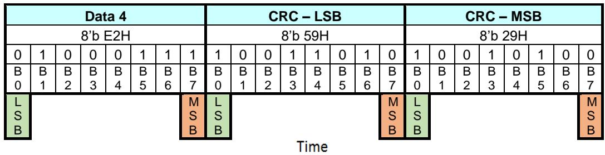

text_image

Data 4
8'b E2H
CRC - LSB
8'b 59H
CRC - MSB
8'b 29H
0 1 0 0 0 1 1 1 0 0 1 1 0 1 0 0 1 0 1 0 0
B B B B B B B B B B B B B B B B B B B B B B
0 1 2 3 4 5 6 7 0 1 2 3 4 5 6 7 0 1 2 3 4 5 6 7
L     M     L     M     L     M     M     M
S     S     S     S     S     S     S     S
B     B     B     B     B     B     B     B     B
Time

Null Packet, No Data (NP- L) – Example

# 5.6.4.7 End of Transmission Packet (EoTP)

"End of Transmission Packet" (EoTP), which is an interface level function and defined in Data Type (DT, 00 1000b), is always used in a Short Packet (SPa) from the MCU to the display module. The purpose of this command is to terminate the high Speed Data Transmission (HSDT) mode properly when EoTP is added after the last payload packet before "End of Transmission" (EoT).The MCU can decide if it wants to use the "End of Transmission Packet" (EoTP) or not. The display shall have the capability to support both. That is, if the MCU applies the EoTP, it shall report the "DSI Protocol Violation Error" when the EoTP is not detected in the High-Speed (HS). The display module error reporting shall be enabled/disabled statistically, according to the module application. The display module does or does not receive "End of Transmission Packet" (EoTP) from the MCU during the Low Power Data Transmission (LPDT) mode before "Mark-1" (= leaving the Escape mode) which ends the Low Power Data Transmission (LPDT) mode. The display module is not allowed to send "End of Transmission Packet" (EoTP) to the MCU during the Low Power Data Transmission (LPDT) mode. The summary of the receiving and transmitting EoTP is listed below.

The summary of the receiving and transmitting EoTP

<table><tr><td>Direction</td><td>Display Module (DM) in High Speed Data Transmission (HSDT)</td><td>Display Module (DM) in Low Power Data Transmission (LPDT)</td></tr><tr><td>MCU=&gt; Display Module</td><td>Support with and without EoTP</td><td>Support with and without EoTP</td></tr><tr><td>Display Module =&gt; MCU</td><td>HS mode is not available(EoTP is not available)</td><td>EoTP cannot be sent by the Display Module (DM)</td></tr></table>

A Short Packet (SPa) using a fixed format is as follows:

\- Data Identification (DI):

• Virtual Channel (VC, DI [7...6]): 00b.  
• Data Type (DT, DI [5...0]): 001000b.

\- Packet Data (PD):

- Data 0: 0Fh.  
- Data 1: 0Fh.

\- Error Correction Code.

<table><tr><td colspan="8">DI(Data Identification)</td><td colspan="8">Data 0</td><td colspan="8">Data 1</td><td colspan="8">ECC(Error Correction Code)</td></tr><tr><td colspan="8">8&#x27;b 08H</td><td colspan="8">8&#x27;b 0FH</td><td colspan="8">8&#x27;b 0FH</td><td colspan="8">8&#x27;b 01H</td></tr><tr><td>0</td><td>0</td><td>0</td><td>1</td><td>0</td><td>0</td><td>0</td><td>0</td><td>1</td><td>1</td><td>1</td><td>1</td><td>0</td><td>0</td><td>0</td><td>0</td><td>1</td><td>1</td><td>1</td><td>1</td><td>0</td><td>0</td><td>0</td><td>0</td><td>1</td><td>0</td><td>0</td><td>0</td><td>0</td><td>0</td><td>0</td><td>0</td></tr><tr><td>B</td><td>B</td><td>B</td><td>B</td><td>B</td><td>B</td><td>B</td><td>B</td><td>B</td><td>B</td><td>B</td><td>B</td><td>B</td><td>B</td><td>B</td><td>B</td><td>B</td><td>B</td><td>B</td><td>B</td><td>B</td><td>B</td><td>B</td><td>B</td><td>B</td><td>B</td><td>B</td><td>B</td><td>B</td><td>B</td><td>B</td><td>B</td></tr><tr><td>0</td><td>1</td><td>2</td><td>3</td><td>4</td><td>5</td><td>6</td><td>7</td><td>0</td><td>1</td><td>2</td><td>3</td><td>4</td><td>5</td><td>6</td><td>7</td><td>0</td><td>1</td><td>2</td><td>3</td><td>4</td><td>5</td><td>6</td><td>7</td><td>0</td><td>1</td><td>2</td><td>3</td><td>4</td><td>5</td><td>6</td><td>7</td></tr><tr><td>L</td><td rowspan="3" colspan="6"></td><td>M</td><td>L</td><td rowspan="3" colspan="6"></td><td>M</td><td>L</td><td rowspan="3" colspan="6"></td><td>M</td><td>L</td><td rowspan="3" colspan="6"></td><td>M</td></tr><tr><td>S</td><td>S</td><td>S</td><td>S</td><td>S</td><td>S</td><td>S</td><td>S</td></tr><tr><td>B</td><td>B</td><td>B</td><td>B</td><td>B</td><td>B</td><td>B</td><td>B</td></tr></table>

Time

# End of Transmission Packet (EoTP)

Some examples of the “End of Transmission Packet” (EoTP) are illustrated for reference purposes below.

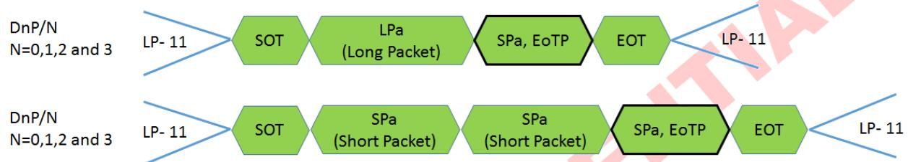

flowchart

```mermaid
graph LR
  subgraph TopGroup
  A["DnP/N\nN=0,1,2 and 3"] --> B["LP- 11"]
  B --> C["SOT"]
  C --> D["LPa\n(Long Packet)"]
  D --> E["SPa, EoTP"]
  E --> F["EOT"]
  F --> G["LP- 11"]
  end

  subgraph BottomGroup
  H["DnP/N\nN=0,1,2 and 3"] --> I["LP- 11"]
  I --> J["SOT"]
  J --> K["SPa\n(Short Packet)"]
  K --> L["SPa\n(Short Packet)"]
  L --> M["SPa, EoTP"]
  M --> N["EOT"]
  N --> O["LP- 11"]
  end
```

End of Transmission Packet (EoTP) – Example

# 5.6.4.8 Acknowledge with Error Report (AwER)

“Acknowledge with Error Report” (AwER), which is defined in Data Type (DT, 00 0010b), is always used in a Short Packet (SPa) from the display module to the MCU. The Packet Data (PD) can include bits, which define the current error, when the corresponding bit is set to 1, as defined in the following table.

Acknowledge with Error Report

<table><tr><td>Bit</td><td>Description</td></tr><tr><td>0</td><td>SoT Error</td></tr><tr><td>1</td><td>SoT Sync Error</td></tr><tr><td>2</td><td>EoT Sync Error</td></tr><tr><td>3</td><td>Escape Mode Entry Command Error</td></tr><tr><td>4</td><td>Low-Power Transmit Sync Error</td></tr><tr><td>5</td><td>Any Protocol Timer Time-Out</td></tr><tr><td>6</td><td>False Control Error</td></tr><tr><td>7</td><td>Contention is Detected on the Display Module</td></tr><tr><td>8</td><td>ECC Error, single-bit (detected and corrected)</td></tr><tr><td>9</td><td>ECC Error, multi-bit (detected, not corrected)</td></tr><tr><td>10</td><td>Checksum Error (Long Packet only)</td></tr><tr><td>11</td><td>DSI Data Type (DT) Not Recognized</td></tr><tr><td>12</td><td>DSI Virtual Channel (VC) ID Invalid</td></tr><tr><td>13</td><td>Invalid Transmission Length</td></tr><tr><td>14</td><td>Reserved, Set to 0 internally</td></tr><tr><td>15</td><td>DSI Protocol Violation</td></tr></table>

These errors are included in all packages that have been received from the MCU to the display module before the Bus Turnaround (BTA). The display module ignores the received

packet which includes error or errors.

Acknowledge with Error Report (AwER) of a Short Packet (SPa) is defined as:

\- Data Identification (DI):

• - Virtual Channel (VC, DI [7...6]): 00b.  
- Data Type (DT, DI [5...0]): 000010b.

\- Packet Data (PD):

- Bit 8: ECC Error, single-bit (detected and corrected).  
- AwER: 0100h.

\- Error Correction Code (ECC).

<table><tr><td colspan="8">DI(Data Identification)</td><td colspan="8">AwER - LSB</td><td colspan="8">AwER - MSB</td><td colspan="8">ECC(Error Correction Code)</td></tr><tr><td colspan="8">8&#x27;b 02H</td><td colspan="8">8&#x27;b 00H</td><td colspan="8">8&#x27;b 01H</td><td colspan="8">8&#x27;b 3AH</td></tr><tr><td>0</td><td>1</td><td>0</td><td>0</td><td>0</td><td>0</td><td>0</td><td>0</td><td>0</td><td>0</td><td>0</td><td>0</td><td>0</td><td>0</td><td>0</td><td>1</td><td>0</td><td>0</td><td>0</td><td>0</td><td>0</td><td>0</td><td>0</td><td>0</td><td>0</td><td>1</td><td>0</td><td>1</td><td>1</td><td>1</td><td>0</td><td>0</td></tr><tr><td>B</td><td>B</td><td>B</td><td>B</td><td>B</td><td>B</td><td>B</td><td>B</td><td>B</td><td>B</td><td>B</td><td>B</td><td>B</td><td>B</td><td>B</td><td>B</td><td>B</td><td>B</td><td>B</td><td>B</td><td>B</td><td>B</td><td>B</td><td>B</td><td>B</td><td>B</td><td>B</td><td>B</td><td>B</td><td>B</td><td>B</td><td>B</td></tr><tr><td>0</td><td>1</td><td>2</td><td>3</td><td>4</td><td>5</td><td>6</td><td>7</td><td>0</td><td>1</td><td>2</td><td>3</td><td>4</td><td>5</td><td>6</td><td>7</td><td>0</td><td>1</td><td>2</td><td>3</td><td>4</td><td>5</td><td>6</td><td>7</td><td>0</td><td>1</td><td>2</td><td>3</td><td>4</td><td>5</td><td>6</td><td>7</td></tr><tr><td>L</td><td rowspan="3" colspan="6"></td><td>M</td><td>L</td><td rowspan="3" colspan="6"></td><td>M</td><td>L</td><td rowspan="3" colspan="6"></td><td>M</td><td>L</td><td rowspan="3" colspan="6"></td><td>M</td></tr><tr><td>S</td><td>S</td><td>S</td><td>S</td><td>S</td><td>S</td><td>S</td><td>S</td></tr><tr><td>B</td><td>B</td><td>B</td><td>B</td><td>B</td><td>B</td><td>B</td><td>B</td></tr></table>

Time

# Acknowledge with Error Report (AwER) – Example

It is possible that the display module receives several packets, which include errors, from the MCU before the MCU performs the Bus Turnaround (BTA). Some examples are illustrated for reference purposes below.

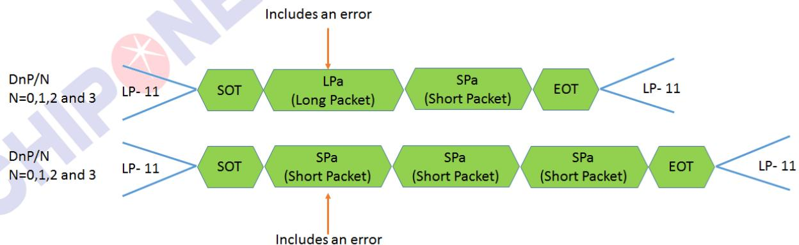

flowchart

```mermaid
graph LR
  subgraph Top_Process
  A["DnP/N\nN=0,1,2 and 3<br/>LP- 11"] --> B["SOT"]
  B --> C["LPa (Long Packet)"]
  C --> D["SPa (Short Packet)"]
  D --> E["EOT"]
  end

  subgraph Bottom_Process
  F["DnP/N\nN=0,1,2 and 3<br/>LP- 11"] --> G["SOT"]
  G --> H["SPa (Short Packet)"]
  H --> I["SPa (Short Packet)"]
  I --> J["SPa (Short Packet)"]
  J --> K["EOT"]
  end

  %% Error Arrow
  C -.->|"Includes an error"| H
  H -.->|"Includes an error"| K
```

Error Packets

Therefore, a method is needed to check if there are errors in the previous packets. These errors of the previous packets can be detected by “Read Display Signal Mode (0Eh)” and “Read Number of the Errors on DSI (05h)” commands. The bit D0 of the “Read Display Signal Mode (0Eh)” command will be set to 1 if a received packet includes an error. The amount of packets,

which include an ECC or CRC error, is calculated in the RDNUMED register, which can read "Read Number of the Errors on DSI (05h)" command. This command also sets the RDNUMED register to 00h and set the bit D0 of the "Read Display Signal Mode (0Eh)" command to 0 after the MCU has read the RDNUMED register from the display module. The functionality of the RDNUMED register is illustrated for reference purposes below.

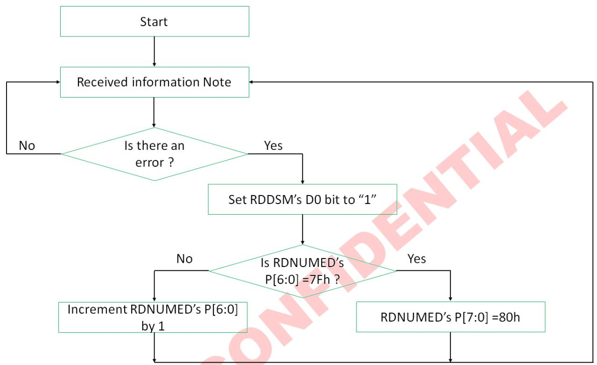

flowchart

```mermaid
graph TD
  Start["Start"] --> A["Received information Note"]
  A --> B{"Is there an error?"}
  B -->|No| A
  B -->|Yes| C["&quot;Set RDDSM's D0 bit to &quot;1&quot;<br>  C --> D{&quot;Is RDNUMED's P[6:0"] =7Fh?"}
  D -->|No| E["&quot;Increment RDNUMED's P[6:0"] by 1"]
  D -->|Yes| F["&quot;RDNUMED's P[7:0"] =80h"]
  E --> A
  F --> A
```

Flow Chart for Errors on DSI  
Notes 1. This information can be Interface or Packet Level Communication, but it is always from the MCU to the display module.  
Notes 2. CRC or ECC error

# 5.6.4.9 DCS Read Long Response (DCSRR-L)

“DCS Read Long Response” (DCSRR-L), which is defined in Data Type (DT, 011100b), is always used in a Long Packet (LPa) from the display module to the MCU. “DCS Read Long Response” (DCSRR-L) is used when the display module wants to respond to a DCS Read command, which the MCU has sent to the display module.

A Long Packet (LPa), which includes 5 data bytes of the Packet Data (PD), defined as:

- Data Identification (DI)  
- Virtual Channel (VC, DI [7...6]): 00b  
- Data Type (DT, DI [5...0]): 01 1100b  
- Word Count (WC)  
- Word Count (WC): 0005hex  
- Error Correction Code (ECC)  
- Packet Data (PD):  
- Data 0: 89hex  
- Data 1: 23hex  
- Data 2: 12hex  
- Data 3: A2hex  
- Data 4: E2hex  
- Packet Footer (PF)

<table><tr><td colspan="8">DI(Data Identification)</td><td colspan="8">WC - LSB(Word Count - LSB)</td><td colspan="8">WC - MSB(Word Count - MSB)</td><td colspan="8">ECC(Error Correction Code)</td></tr><tr><td colspan="8">8&#x27;b 1CH</td><td colspan="8">8&#x27;b 05H</td><td colspan="8">8&#x27;b 00H</td><td colspan="8">8&#x27;b 29H</td></tr><tr><td>0</td><td>0</td><td>1</td><td>1</td><td>1</td><td>0</td><td>0</td><td>0</td><td>1</td><td>0</td><td>1</td><td>0</td><td>0</td><td>0</td><td>0</td><td>0</td><td>0</td><td>0</td><td>0</td><td>0</td><td>0</td><td>0</td><td>0</td><td>0</td><td>1</td><td>0</td><td>0</td><td>1</td><td>0</td><td>1</td><td>0</td><td>0</td></tr><tr><td>B</td><td>B</td><td>B</td><td>B</td><td>B</td><td>B</td><td>B</td><td>B</td><td>B</td><td>B</td><td>B</td><td>B</td><td>B</td><td>B</td><td>B</td><td>B</td><td>B</td><td>B</td><td>B</td><td>B</td><td>B</td><td>B</td><td>B</td><td>B</td><td>B</td><td>B</td><td>B</td><td>B</td><td>B</td><td>B</td><td>B</td><td>B</td></tr><tr><td>0</td><td>1</td><td>2</td><td>3</td><td>4</td><td>5</td><td>6</td><td>7</td><td>0</td><td>1</td><td>2</td><td>3</td><td>4</td><td>5</td><td>6</td><td>7</td><td>0</td><td>1</td><td>2</td><td>3</td><td>4</td><td>5</td><td>6</td><td>7</td><td>0</td><td>1</td><td>2</td><td>3</td><td>4</td><td>5</td><td>6</td><td>7</td></tr><tr><td>L</td><td></td><td></td><td></td><td></td><td></td><td></td><td>M</td><td>L</td><td></td><td></td><td></td><td></td><td></td><td></td><td>M</td><td>L</td><td></td><td></td><td></td><td></td><td></td><td></td><td>M</td><td>L</td><td></td><td></td><td></td><td></td><td></td><td></td><td>M</td></tr><tr><td>S</td><td></td><td></td><td></td><td></td><td></td><td></td><td>S</td><td>S</td><td></td><td></td><td></td><td></td><td></td><td></td><td>S</td><td>S</td><td></td><td></td><td></td><td></td><td></td><td></td><td>S</td><td>S</td><td></td><td></td><td></td><td></td><td></td><td></td><td>S</td></tr><tr><td>B</td><td></td><td></td><td></td><td></td><td></td><td></td><td>B</td><td>B</td><td></td><td></td><td></td><td></td><td></td><td></td><td>B</td><td>B</td><td></td><td></td><td></td><td></td><td></td><td></td><td>B</td><td>B</td><td></td><td></td><td></td><td></td><td></td><td></td><td>B</td></tr></table>

<table><tr><td colspan="8">Data 0</td><td colspan="8">Data1</td><td colspan="7">Data2</td><td colspan="7">Data3</td><td></td></tr><tr><td colspan="8">8&#x27;b 89H</td><td colspan="8">8&#x27;b 23H</td><td colspan="7">8&#x27;b 12H</td><td colspan="7">8&#x27;b A2H</td><td></td></tr><tr><td>1</td><td>0</td><td>0</td><td>1</td><td>0</td><td>0</td><td>0</td><td>1</td><td>1</td><td>1</td><td>0</td><td>0</td><td>0</td><td>1</td><td>0</td><td>0</td><td>0</td><td>1</td><td>0</td><td>0</td><td>1</td><td>0</td><td>0</td><td>0</td><td>0</td><td>1</td><td>0</td><td>0</td><td>1</td><td>0</td><td>1</td></tr><tr><td>B</td><td>B</td><td>B</td><td>B</td><td>B</td><td>B</td><td>B</td><td>B</td><td>B</td><td>B</td><td>B</td><td>B</td><td>B</td><td>B</td><td>B</td><td>B</td><td>B</td><td>B</td><td>B</td><td>B</td><td>B</td><td>B</td><td>B</td><td>B</td><td>B</td><td>B</td><td>B</td><td>B</td><td>B</td><td>B</td><td></td></tr><tr><td>0</td><td>1</td><td>2</td><td>3</td><td>4</td><td>5</td><td>6</td><td>7</td><td>0</td><td>1</td><td>2</td><td>3</td><td>4</td><td>5</td><td>6</td><td>7</td><td>0</td><td>1</td><td>2</td><td>3</td><td>4</td><td>5</td><td>6</td><td>7</td><td>0</td><td>1</td><td>2</td><td>3</td><td>4</td><td>5</td><td>6</td></tr><tr><td>L</td><td></td><td></td><td></td><td></td><td></td><td></td><td>M</td><td>L</td><td></td><td></td><td></td><td></td><td></td><td>M</td><td>L</td><td></td><td></td><td></td><td></td><td></td><td></td><td>M</td><td>L</td><td></td><td></td><td></td><td></td><td></td><td></td><td>M</td></tr><tr><td>S</td><td></td><td></td><td></td><td></td><td></td><td></td><td>S</td><td>S</td><td></td><td></td><td></td><td></td><td></td><td>S</td><td>S</td><td></td><td></td><td></td><td></td><td></td><td></td><td>S</td><td>S</td><td></td><td></td><td></td><td></td><td></td><td></td><td>S</td></tr><tr><td>B</td><td></td><td></td><td></td><td></td><td></td><td></td><td>B</td><td>B</td><td></td><td></td><td></td><td></td><td></td><td>B</td><td>B</td><td></td><td></td><td></td><td></td><td></td><td></td><td>B</td><td>B</td><td></td><td></td><td></td><td></td><td></td><td></td><td>B</td></tr></table>

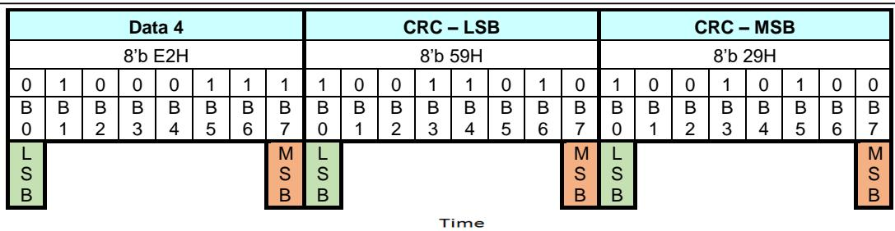

text_image

Data 4
8'b E2H
CRC - LSB
8'b 59H
CRC - MSB
0 1 0 0 0 1 1 1 0 0 1 1 0 1 0 0 1 0 1 0 0
B B B B B B B B B B B B B B B B B B B B B B B
0 1 2 3 4 5 6 7 0 1 2 3 4 5 6 7 0 1 2 3 4 5 6 7
L S M L M L
S S S S S
B B B B B B B B B
Time

Figure 5-1 DCS Read Long Response (DCSRR-L) – Example

# 5.6.4.10 DCS Read Short Response, 1 Byte Returned (DCSRR1-S)

“DCS Read Short Response, 1 Byte Returned” (DCSRR1-S), which is defined in Data Type (DT, 10 0001b), is always used in a Short Packet (SPa) from the display module to the MCU. “DCS Read Short Response, 1 Byte Returned (DCSRR1-S) is used when the display module wants to respond to a DCS Read command, which the MCU has sent to the display module.

A Short Packet (SPa) is defined as:

- Data Identification (DI).  
- Virtual Channel (VC, DI [7...6]): 00b.  
- Data Type (DT, DI [5...0]): 100001b.  
- Packet Data (PD).  
- Data 0: 45h.  
- Data 1: 00h (Always).  
- Error Correction Code (ECC).

<table><tr><td colspan="8">DI(Data Identification)</td><td colspan="8">Data0(Packet Data)</td><td colspan="8">Data1(Always 8&#x27;b 00h)</td><td colspan="8">ECC(Error Correction Code)</td></tr><tr><td colspan="8">8&#x27;b 21H</td><td colspan="8">8&#x27;b 45H</td><td colspan="8">8&#x27;b 00H</td><td colspan="8">8&#x27;b 01H</td></tr><tr><td>1</td><td>0</td><td>0</td><td>0</td><td>0</td><td>1</td><td>0</td><td>0</td><td>1</td><td>0</td><td>1</td><td>0</td><td>0</td><td>0</td><td>1</td><td>0</td><td>0</td><td>0</td><td>0</td><td>0</td><td>0</td><td>0</td><td>0</td><td>0</td><td>1</td><td>0</td><td>0</td><td>0</td><td>0</td><td>0</td><td>0</td><td>0</td></tr><tr><td>B</td><td>B</td><td>B</td><td>B</td><td>B</td><td>B</td><td>B</td><td>B</td><td>B</td><td>B</td><td>B</td><td>B</td><td>B</td><td>B</td><td>B</td><td>B</td><td>B</td><td>B</td><td>B</td><td>B</td><td>B</td><td>B</td><td>B</td><td>B</td><td>B</td><td>B</td><td>B</td><td>B</td><td>B</td><td>B</td><td>B</td><td>B</td></tr><tr><td>0</td><td>1</td><td>2</td><td>3</td><td>4</td><td>5</td><td>6</td><td>7</td><td>0</td><td>1</td><td>2</td><td>3</td><td>4</td><td>5</td><td>6</td><td>7</td><td>0</td><td>1</td><td>2</td><td>3</td><td>4</td><td>5</td><td>6</td><td>7</td><td>0</td><td>1</td><td>2</td><td>3</td><td>4</td><td>5</td><td>6</td><td>7</td></tr><tr><td>L</td><td rowspan="3" colspan="6"></td><td>M</td><td>L</td><td rowspan="3" colspan="6"></td><td>M</td><td>L</td><td rowspan="3" colspan="6"></td><td>M</td><td>L</td><td rowspan="3" colspan="6"></td><td>M</td></tr><tr><td>S</td><td>S</td><td>S</td><td>S</td><td>S</td><td>S</td><td>S</td><td>S</td></tr><tr><td>B</td><td>B</td><td>B</td><td>B</td><td>B</td><td>B</td><td>B</td><td>B</td></tr></table>

Time

DCS Read Short Response, 1Byte Return (DCSRR1-S) – Example

# 5.6.4.11 DCS Read Short Response, 2 Byte Returned (DCSRR2-S)

“DCS Read Short Response, 2 Bytes Returned” (DCSRR2-S), which is defined in Data Type (DT, 10 0010b), is always used in a Short Packet (SPa) from the display module to the MCU. “DCS Read Short Response, 2 Bytes Returned” (DCSRR2-S) is used when the display module wants to respond to a DCS Read command, which the MCU has sent to the display module.

# A Short Packet (SPa) is defined as:

- Data Identification (DI).  
- Virtual Channel (VC, DI [7...6]): 00b.  
- Data Type (DT, DI [5...0]): 10 0010b.  
- Packet Data (PD)  
- Data 0: 45h.  
- Data 1: 32h.  
- Error Correction Code (ECC).

<table><tr><td colspan="8">DI(Data Identification)</td><td colspan="8">Data 0(Packet Data)</td><td colspan="8">Data1</td><td colspan="8">ECC(Error Correction Code)</td><td></td></tr><tr><td colspan="8">8&#x27;b 22H</td><td colspan="8">8&#x27;b 45H</td><td colspan="8">8&#x27;b 32H</td><td colspan="8">8&#x27;b 0FH</td><td></td></tr><tr><td>0</td><td>1</td><td>0</td><td>0</td><td>0</td><td>1</td><td>0</td><td>0</td><td>1</td><td>0</td><td>1</td><td>0</td><td>0</td><td>0</td><td>1</td><td>0</td><td>0</td><td>1</td><td>0</td><td>0</td><td>1</td><td>1</td><td>1</td><td>1</td><td>0</td><td>0</td><td>1</td><td>1</td><td>1</td><td>1</td><td>0</td><td>0</td><td>0</td></tr><tr><td>B</td><td>B</td><td>B</td><td>B</td><td>B</td><td>B</td><td>B</td><td>B</td><td>B</td><td>B</td><td>B</td><td>B</td><td>B</td><td>B</td><td>B</td><td>B</td><td>B</td><td>B</td><td>B</td><td>B</td><td>B</td><td>B</td><td>B</td><td>B</td><td>B</td><td>B</td><td>B</td><td>B</td><td>B</td><td>B</td><td>B</td><td>B</td><td></td></tr><tr><td>0</td><td>1</td><td>2</td><td>3</td><td>4</td><td>5</td><td>6</td><td>7</td><td>0</td><td>1</td><td>2</td><td>3</td><td>4</td><td>5</td><td>6</td><td>7</td><td>0</td><td>1</td><td>2</td><td>3</td><td>4</td><td>5</td><td>6</td><td>7</td><td>0</td><td>1</td><td>2</td><td>3</td><td>4</td><td>5</td><td>6</td><td>7</td><td></td></tr><tr><td>L</td><td></td><td></td><td></td><td></td><td></td><td></td><td>M</td><td>L</td><td></td><td></td><td></td><td></td><td></td><td></td><td>M</td><td>L</td><td></td><td></td><td></td><td></td><td></td><td></td><td>M</td><td>L</td><td></td><td></td><td></td><td></td><td></td><td></td><td>M</td><td></td></tr><tr><td>S</td><td></td><td></td><td></td><td></td><td></td><td></td><td>S</td><td>S</td><td></td><td></td><td></td><td></td><td></td><td></td><td>S</td><td>S</td><td></td><td></td><td></td><td></td><td></td><td></td><td>S</td><td>S</td><td></td><td></td><td></td><td></td><td></td><td></td><td>S</td><td></td></tr><tr><td>B</td><td></td><td></td><td></td><td></td><td></td><td></td><td>B</td><td>B</td><td></td><td></td><td></td><td></td><td></td><td></td><td>B</td><td>B</td><td></td><td></td><td></td><td></td><td></td><td></td><td>B</td><td>B</td><td></td><td></td><td></td><td></td><td></td><td></td><td>B</td><td></td></tr></table>

Time

DCS Read Short Response, 2Byte Returned (DCSRR2-S) – Example

# 5.6.5 Communication Sequences

# 5.6.5.1 General

The communication sequences can be done on interface or packet levels between the MCU and the display module. See sections “Interface Level Communication” and “Packet Level Communication”. This communication sequence description is for DSI data lanes (D0P/N and D1P/N), and it is assumed that the needed low level communication is done on DSI Clock lane (CLKP/N) automatically. See the section “DSI CLK Lanes”. Functions of the interface level communication are described in the following table.

Interface Level Communication

<table><tr><td>Interface Mode</td><td>Abbreviation</td><td>Interface Action Description</td></tr><tr><td rowspan="7">Low Power</td><td>LP-11</td><td>Stop state</td></tr><tr><td>LPDT</td><td>Low power data transmission</td></tr><tr><td>ULPS</td><td>Ultra- Low power state</td></tr><tr><td>RAR</td><td>Remote application reset</td></tr><tr><td>TEE</td><td>Tearing effect event (Not supported)</td></tr><tr><td>ACK</td><td>Acknowledge (No error)</td></tr><tr><td>BTA</td><td>Bus turnaround</td></tr><tr><td>High Speed</td><td>HSDT</td><td>High speed data transmission</td></tr></table>

Functions of the packet level communication are described on the following table.

Packet level communication

<table><tr><td>Packet Sender</td><td>Abbreviation</td><td>Packet Size</td><td>Packet Description</td></tr><tr><td rowspan="6">MCU</td><td>DCSW1-S</td><td>SPa</td><td>DCS Write, 1 Parameter</td></tr><tr><td>DCSWN-S</td><td>SPa</td><td>DCS Write, No Parameter</td></tr><tr><td>DCSW-L</td><td>LPa</td><td>DCS Write, Long</td></tr><tr><td>DCSRN-S</td><td>SPa</td><td>DCS Read, No Parameter</td></tr><tr><td>SMRPS-S</td><td>SPa</td><td>Set maximum return packet size</td></tr><tr><td>NP-L</td><td>LPa</td><td>Null packet, No data</td></tr><tr><td rowspan="4">Display Module</td><td>AwER</td><td>SPa</td><td>Acknowledge with error report</td></tr><tr><td>DCSRR-L</td><td>LPa</td><td>DCS Read, Long Response</td></tr><tr><td>DCSRR1-S</td><td>SPa</td><td>DCS Read, Short Response</td></tr><tr><td>DCSRR2-S</td><td>SPa</td><td>DCS Read, Short Response</td></tr></table>

# 5.6.5.2 Sequences –DCS Write, 1 Parameter Sequence

A Short Packet (SPa) of “Display Command Set (DCS) Write, 1 Parameter (DCSW1-S)” is defined on chapter “Display Command Set (DCS) Write, 1 Parameter (DCSW1-S)” and example sequences, how this packet is used is described on following tables.

DCS Write,1 parameter Sequence – Example 1

<table><tr><td rowspan="2">Line</td><td colspan="2">MCU</td><td rowspan="2">Interface Direction</td><td colspan="2">Display Module</td><td rowspan="2">Comment</td></tr><tr><td>Packet Sender</td><td>Interface Mode Control</td><td>Interface Mode Control</td><td>Packet Sender</td></tr><tr><td>1</td><td>-</td><td>LP-11</td><td>→</td><td>-</td><td>-</td><td>Start</td></tr><tr><td>2</td><td>DCSW1-S</td><td>LPDT</td><td>→</td><td>-</td><td>-</td><td></td></tr><tr><td>3</td><td>-</td><td>LP-11</td><td>→</td><td>-</td><td>-</td><td>End</td></tr></table>

DCS Write,1 parameter Sequence – Example 2

<table><tr><td rowspan="2">Line</td><td colspan="2">MCU</td><td rowspan="2">Interface Direction</td><td colspan="2">Display Module</td><td rowspan="2">Comment</td></tr><tr><td>Packet Sender</td><td>Interface Mode Control</td><td>Interface Mode Control</td><td>Packet Sender</td></tr><tr><td>1</td><td>-</td><td>LP-11</td><td>→</td><td>-</td><td>-</td><td>Start</td></tr><tr><td>2</td><td>DCSW1-S</td><td>HSDT</td><td>→</td><td>-</td><td>-</td><td></td></tr><tr><td>3</td><td>EoTP</td><td>HSDT</td><td>→</td><td>-</td><td>-</td><td>End of Transmission Packet</td></tr><tr><td>4</td><td>-</td><td>LP-11</td><td>→</td><td>-</td><td>-</td><td>End</td></tr></table>

DCS Write,1 parameter Sequence – Example 3

<table><tr><td rowspan="2">Line</td><td colspan="2">MCU</td><td rowspan="2">Interface Direction</td><td colspan="2">Display Module</td><td rowspan="2">Comment</td></tr><tr><td>Packet Sender</td><td>Interface Mode Control</td><td>Interface Mode Control</td><td>Packet Sender</td></tr><tr><td>1</td><td>-</td><td>LP-11</td><td>→</td><td>-</td><td>-</td><td>Start</td></tr><tr><td>2</td><td>DCSW1-S</td><td>HSDT</td><td>→</td><td>-</td><td>-</td><td></td></tr><tr><td>3</td><td>EoTP</td><td>HSDT</td><td>→</td><td>-</td><td>-</td><td>End of Transmission Packet</td></tr><tr><td>4</td><td></td><td>LP-11</td><td>→</td><td></td><td></td><td></td></tr><tr><td>5</td><td></td><td>BTA</td><td>←/→</td><td>BTA</td><td></td><td>Interface control change from the MCU to the display module</td></tr><tr><td>6</td><td></td><td>-</td><td>←</td><td>LP-11</td><td></td><td>If no error =&gt; goto line 8If error =&gt; goto line 13</td></tr><tr><td>7</td><td></td><td></td><td></td><td></td><td></td><td></td></tr><tr><td>8</td><td></td><td>-</td><td>←</td><td>ACK</td><td></td><td>No error</td></tr><tr><td>9</td><td></td><td>-</td><td>←</td><td>LP-11</td><td></td><td></td></tr><tr><td>10</td><td></td><td>BTA</td><td>←/→</td><td>BTA</td><td></td><td>Interface control change from the display module to the MCU</td></tr><tr><td>11</td><td></td><td>LP-11</td><td>→</td><td>-</td><td></td><td>End</td></tr><tr><td>12</td><td></td><td></td><td></td><td></td><td></td><td></td></tr><tr><td>13</td><td></td><td>-</td><td>←</td><td>LPDT</td><td>AwER</td><td>Error report</td></tr><tr><td>14</td><td></td><td>-</td><td>←</td><td>LP-11</td><td></td><td></td></tr><tr><td>15</td><td></td><td>BTA</td><td>←/→</td><td>BTA</td><td></td><td></td></tr><tr><td>16</td><td>-</td><td>LP-11</td><td>→</td><td>-</td><td>-</td><td>End</td></tr></table>

# 5.6.5.3 Sequences –DCS Write, No Parameter Sequence

A Short Packet (SPa) of “Display Command Set (DCS) Write, No Parameter (DCSWN-S)” is defined on chapter “Display Command Set (DCS) Write, No Parameter (DCSWN-S)” and example sequences, how this packet is used, is described on following tables.

DCS Write, No parameter Sequence – Example 1

<table><tr><td rowspan="2">Line</td><td colspan="2">MCU</td><td rowspan="2">Interface Direction</td><td colspan="2">Display Module</td><td rowspan="2">Comment</td></tr><tr><td>Packet Sender</td><td>Interface Mode Control</td><td>Interface Mode Control</td><td>Packet Sender</td></tr><tr><td>1</td><td>-</td><td>LP-11</td><td>→</td><td>-</td><td>-</td><td>Start</td></tr><tr><td>2</td><td>DCSWN-S</td><td>LPDT</td><td>→</td><td>-</td><td>-</td><td></td></tr><tr><td>3</td><td>-</td><td>LP-11</td><td>→</td><td>-</td><td>-</td><td>End</td></tr></table>

DCS Write, No parameter Sequence – Example 2

<table><tr><td rowspan="2">Line</td><td colspan="2">MCU</td><td rowspan="2">Interface Direction</td><td colspan="2">Display Module</td><td rowspan="2">Comment</td></tr><tr><td>Packet Sender</td><td>Interface Mode Control</td><td>Interface Mode Control</td><td>Packet Sender</td></tr><tr><td>1</td><td>-</td><td>LP-11</td><td>→</td><td>-</td><td>-</td><td>Start</td></tr><tr><td>2</td><td>DCSWN-S</td><td>HSDT</td><td>→</td><td>-</td><td>-</td><td></td></tr><tr><td>3</td><td>EoTP</td><td>HSDT</td><td>→</td><td>-</td><td>-</td><td>End of Transmission Packet</td></tr><tr><td>4</td><td>-</td><td>LP-11</td><td>→</td><td>-</td><td>-</td><td>End</td></tr></table>

DCS Write, No parameter Sequence – Example 3

<table><tr><td rowspan="2">Line</td><td colspan="2">MCU</td><td rowspan="2">Interface Direction</td><td colspan="2">Display Module</td><td rowspan="2">Comment</td></tr><tr><td>Packet Sender</td><td>Interface Mode Control</td><td>Interface Mode Control</td><td>Packet Sender</td></tr><tr><td>1</td><td>-</td><td>LP-11</td><td>→</td><td>-</td><td>-</td><td>Start</td></tr><tr><td>2</td><td>DCSWN-S</td><td>HSDT</td><td>→</td><td>-</td><td>-</td><td></td></tr><tr><td>3</td><td>EoTP</td><td>HSDT</td><td>→</td><td>-</td><td>-</td><td>End of Transmission Packet</td></tr><tr><td>4</td><td></td><td>LP-11</td><td>→</td><td></td><td></td><td></td></tr><tr><td>5</td><td></td><td>BTA</td><td>←/→</td><td>BTA</td><td></td><td>Interface control change from the MCU to the display module</td></tr><tr><td>6</td><td></td><td>-</td><td>←</td><td>LP-11</td><td></td><td>If no error =&gt; goto line 8If error =&gt; goto line 13</td></tr><tr><td>7</td><td></td><td></td><td></td><td></td><td></td><td></td></tr><tr><td>8</td><td></td><td>-</td><td>←</td><td>ACK</td><td></td><td>No error</td></tr><tr><td>9</td><td></td><td>-</td><td>←</td><td>LP-11</td><td></td><td></td></tr><tr><td>10</td><td></td><td>BTA</td><td>←/→</td><td>BTA</td><td></td><td>Interface control change from the display module to the MCU</td></tr><tr><td>11</td><td></td><td>LP-11</td><td>→</td><td>-</td><td></td><td>End</td></tr><tr><td>12</td><td></td><td></td><td></td><td></td><td></td><td></td></tr><tr><td>13</td><td></td><td>-</td><td>←</td><td>LPDT</td><td>AwER</td><td>Error report</td></tr><tr><td>14</td><td></td><td>-</td><td>←</td><td>LP-11</td><td></td><td></td></tr><tr><td>15</td><td></td><td>BTA</td><td>←/→</td><td>BTA</td><td></td><td></td></tr><tr><td>16</td><td>-</td><td>LP-11</td><td>→</td><td>-</td><td>-</td><td>End</td></tr></table>

# 5.6.5.4 Sequences -DCS Write, Long Sequence

A Long Packet (LPa) of “Display Command Set (DCS) Write Long (DCSW-L)” is defined on chapter “Display Command Set (DCS) Write Long (DCSW-L)” and example sequences, how this packet is used, is described on following tables.

DCS Write, Long Sequence – Example 1

<table><tr><td rowspan="2">Line</td><td colspan="2">MCU</td><td rowspan="2">Interface Direction</td><td colspan="2">Display Module</td><td rowspan="2">Comment</td></tr><tr><td>Packet Sender</td><td>Interface Mode Control</td><td>Interface Mode Control</td><td>Packet Sender</td></tr><tr><td>1</td><td>-</td><td>LP-11</td><td>→</td><td>-</td><td>-</td><td>Start</td></tr><tr><td>2</td><td>DCSW-L</td><td>LPDT</td><td>→</td><td>-</td><td>-</td><td></td></tr><tr><td>3</td><td>-</td><td>LP-11</td><td>→</td><td>-</td><td>-</td><td>End</td></tr></table>

DCS Write, Long Sequence – Example 2

<table><tr><td rowspan="2">Line</td><td colspan="2">MCU</td><td rowspan="2">Interface Direction</td><td colspan="2">Display Module</td><td rowspan="2">Comment</td></tr><tr><td>Packet Sender</td><td>Interface Mode Control</td><td>Interface Mode Control</td><td>Packet Sender</td></tr><tr><td>1</td><td>-</td><td>LP-11</td><td>→</td><td>-</td><td>-</td><td>Start</td></tr><tr><td>2</td><td>DCSW-L</td><td>HSDT</td><td>→</td><td>-</td><td>-</td><td></td></tr><tr><td>3</td><td>EoTP</td><td>HSDT</td><td>→</td><td>-</td><td>-</td><td>End of Transmission Packet</td></tr><tr><td>4</td><td>-</td><td>LP-11</td><td>→</td><td>-</td><td>-</td><td>End</td></tr></table>

DCS Write, Long Sequence – Example 3

<table><tr><td rowspan="2">Line</td><td colspan="2">MCU</td><td rowspan="2">Interface Direction</td><td colspan="2">Display Module</td><td rowspan="2">Comment</td></tr><tr><td>Packet Sender</td><td>Interface Mode Control</td><td>Interface Mode Control</td><td>Packet Sender</td></tr><tr><td>1</td><td>-</td><td>LP-11</td><td>→</td><td>-</td><td>-</td><td>Start</td></tr><tr><td>2</td><td>DCSW-L</td><td>HSDT</td><td>→</td><td>-</td><td>-</td><td></td></tr><tr><td>3</td><td>EoTP</td><td>HSDT</td><td>→</td><td>-</td><td>-</td><td>End of Transmission Packet</td></tr><tr><td>4</td><td></td><td>LP-11</td><td>→</td><td></td><td></td><td></td></tr><tr><td>5</td><td></td><td>BTA</td><td>←/→</td><td>BTA</td><td></td><td>Interface control change from the MCU to the display module</td></tr><tr><td>6</td><td></td><td>-</td><td>←</td><td>LP-11</td><td></td><td>If no error =&gt; goto line 8If error =&gt; goto line 13</td></tr><tr><td>7</td><td></td><td></td><td></td><td></td><td></td><td></td></tr><tr><td>8</td><td></td><td>-</td><td>←</td><td>ACK</td><td></td><td>No error</td></tr><tr><td>9</td><td></td><td>-</td><td>←</td><td>LP-11</td><td></td><td></td></tr><tr><td>10</td><td></td><td>BTA</td><td>←/→</td><td>BTA</td><td></td><td>Interface control change from the display module to the MCU</td></tr><tr><td>11</td><td></td><td>LP-11</td><td>→</td><td>-</td><td></td><td>End</td></tr><tr><td>12</td><td></td><td></td><td></td><td></td><td></td><td></td></tr><tr><td>13</td><td></td><td>-</td><td>←</td><td>LPDT</td><td>AwER</td><td>Error report</td></tr><tr><td>14</td><td></td><td>-</td><td>←</td><td>LP-11</td><td></td><td></td></tr><tr><td>15</td><td></td><td>BTA</td><td>←/→</td><td>BTA</td><td></td><td></td></tr><tr><td>16</td><td>-</td><td>LP-11</td><td>→</td><td>-</td><td>-</td><td>End</td></tr></table>

Sequences –DCS Read, No Parameter Sequence

A Short Packet (SPa) of “Display Command Set (DCS) Read, No Parameter (DCSRN-S)” is defined on chapter “Display Command Set (DCS) Read, No Parameter (DCSRN-S)” and example sequences, how this packet is used, is described on following tables.

DCS Read, No Parameter Sequence – Example 1

<table><tr><td rowspan="2">Line</td><td colspan="2">MCU</td><td rowspan="2">Interface Direction</td><td colspan="2">Display Module</td><td rowspan="2">Comment</td></tr><tr><td>Packet Sender</td><td>Interface Mode Control</td><td>Interface Mode Control</td><td>Packet Sender</td></tr><tr><td>1</td><td>-</td><td>LP-11</td><td>→</td><td>-</td><td>-</td><td>Start</td></tr><tr><td>2</td><td>SMRPS-S</td><td>HSDT</td><td>→</td><td>-</td><td>-</td><td>Define how many data byte is wanted to read: 1 byte</td></tr><tr><td>3</td><td>DCSRN-S</td><td>HSDT</td><td>→</td><td>-</td><td>-</td><td>wanted to get a response ID1 (DAh)</td></tr><tr><td>4</td><td>EoTP</td><td>HSDT</td><td>→</td><td>-</td><td>-</td><td>End of Transmission Packet</td></tr><tr><td>5</td><td>-</td><td>LP-11</td><td>→</td><td>-</td><td>-</td><td></td></tr><tr><td>6</td><td>-</td><td>BTA</td><td>←/→</td><td>BTA</td><td>-</td><td>Interface control change from the MCU to the display module</td></tr><tr><td>7</td><td>-</td><td>-</td><td>←</td><td>LP-11</td><td>-</td><td>If no error =&gt; goto line 9If error =&gt; goto line 14If error is corrected by ECC=&gt; go to line 19</td></tr><tr><td>8</td><td></td><td></td><td></td><td></td><td></td><td></td></tr><tr><td>9</td><td>-</td><td>-</td><td>←</td><td>LPDT</td><td>DCSRR1-S</td><td>Responded 1 byte return</td></tr><tr><td>10</td><td>-</td><td>-</td><td>←</td><td>LP-11</td><td>-</td><td></td></tr><tr><td>11</td><td>-</td><td>BTA</td><td>←/→</td><td>BTA</td><td>-</td><td>Interface control change from the display module to the MCU</td></tr><tr><td>12</td><td>-</td><td>LP-11</td><td>→</td><td>-</td><td>-</td><td>End</td></tr><tr><td>13</td><td></td><td></td><td></td><td></td><td></td><td></td></tr><tr><td>14</td><td>-</td><td>-</td><td>←</td><td>LPDT</td><td>AwER</td><td>Error report</td></tr><tr><td>15</td><td>-</td><td>-</td><td>←</td><td>LP-11</td><td>-</td><td></td></tr><tr><td>16</td><td>-</td><td>BTA</td><td>←/→</td><td>BTA</td><td>-</td><td>Interface control change from the display module to the MCU</td></tr><tr><td>17</td><td>-</td><td>LP-11</td><td>→</td><td>-</td><td>-</td><td>End</td></tr><tr><td>18</td><td></td><td></td><td></td><td></td><td></td><td></td></tr><tr><td>19</td><td>-</td><td>-</td><td>←</td><td>LPDT</td><td>DCSRR1-S</td><td>Responded 1 byte return</td></tr><tr><td>20</td><td>-</td><td>-</td><td>←</td><td>LPDT</td><td>AwER</td><td>Error Report(Error is Corrected by ECC)</td></tr><tr><td>21</td><td>-</td><td>-</td><td>←</td><td>LP-11</td><td>-</td><td></td></tr><tr><td>22</td><td>-</td><td>BTA</td><td>←/→</td><td>BTA</td><td>-</td><td>Interface control change from the display module to the MCU</td></tr><tr><td>23</td><td>-</td><td>LP-11</td><td>→</td><td></td><td>-</td><td>End</td></tr></table>

# 5.6.5.5 Sequences -Null Packet, No Data Sequence

A Long Packet (LPa) of “Null Packet, No Data (NP-L)” is defined on chapter “Null Packet,

No Data (NP-L)" and example sequences, how this packet is used, is described on following tables.

Null Packet, No Data Sequence – Example

<table><tr><td rowspan="2">Line</td><td colspan="2">MCU</td><td rowspan="2">Interface Direction</td><td colspan="2">Display Module</td><td rowspan="2">Comment</td></tr><tr><td>Packet Sender</td><td>Interface Mode Control</td><td>Interface Mode Control</td><td>Packet Sender</td></tr><tr><td>1</td><td>-</td><td>LP-11</td><td>→</td><td>-</td><td>-</td><td>Start</td></tr><tr><td>2</td><td>NP-L</td><td>HSDT</td><td>→</td><td>-</td><td>-</td><td>Only high speed data transmission is used.</td></tr><tr><td>3</td><td>EoTP</td><td>HSDT</td><td>→</td><td></td><td></td><td>End of transmission Packet</td></tr><tr><td>4</td><td>-</td><td>LP-11</td><td>→</td><td>-</td><td>-</td><td>End</td></tr></table>

# 5.6.5.6 Sequences –End of Transmission Packet

A Short Packet (SPa) of “End of Transmission (EoT)” is defined on chapter “End of Transmission Packet (EoT)” and an example sequences, how this packet is used, is described on following tables.

End of Transmission Packet – Example

<table><tr><td rowspan="2">Line</td><td colspan="2">MCU</td><td rowspan="2">Interface Direction</td><td colspan="2">Display Module</td><td rowspan="2">Comment</td></tr><tr><td>Packet Sender</td><td>Interface Mode Control</td><td>Interface Mode Control</td><td>Packet Sender</td></tr><tr><td>1</td><td>-</td><td>LP-11</td><td>→</td><td>-</td><td>-</td><td>Start</td></tr><tr><td>2</td><td>NP-L</td><td>HSDT</td><td>→</td><td>-</td><td>-</td><td>Only high speed data transmission is used.</td></tr><tr><td>3</td><td>EoTP</td><td>HSDT</td><td>→</td><td></td><td></td><td>End of transmission Packet</td></tr><tr><td>4</td><td>-</td><td>LP-11</td><td>→</td><td>-</td><td>-</td><td>End</td></tr></table>

# 5.6.6 Video Mode Communication

Video Mode peripherals require pixel data delivered in real time. This section specifies the format and timing of DSI traffic for this type of display module.

# 5.6.6.1 Transmission Packet Sequences

DSI supports several formats, or packet sequences, for Video Mode data transmission. The peripheral's timing requirements dictate which format is appropriate. In the following sections, Burst Mode refers to time-compression of the RGB pixel (active video) portion of the transmission. In addition, these terms are used throughout the following sections:

- Non-Burst Mode with Sync Pulses – enables the peripheral to accurately reconstruct original video timing, including sync pulse widths.  
- Non-Burst Mode with Sync Events – similar to above, but accurate reconstruction of sync pulse widths is not required, so a single Sync Event is substituted.  
- Burst mode – RGB pixel packets are time-compressed, leaving more time during a scan line for LP mode (saving power) or for multiplexing other transmissions onto the DSI link.

In the following figures the Blanking or Low-Power Interval (BLLP) is defined as a period during which video packets such as pixel-stream and sync event packets are not actively transmitted to the peripheral. To enable PHY synchronization the host processor should periodically end HS transmission and drive the Data Lanes to the LP state. This transition should take place at least once per frame; shown as LPM in the figures in this section. It is recommended to return to LP state once per scan-line during the horizontal blanking time. Regardless of the frequency of BLLP periods, the host processor is responsible for meeting all documented peripheral timing requirements. Note, at lower frequencies BLLP periods will approach, or become, zero, and burst mode will be indistinguishable from non-burst mode. During the BLLP the DSI Link may do any of the following:

- Remain in Idle Mode with the host processor in LP-11 state and the peripheral in LP-RX.  
- Transmit one or more non-video packets from the host processor to the peripheral using Escape Mode.  
- Transmit one or more non-video packets from the host processor to the peripheral using HS Mode.  
- If the previous processor-to-peripheral transmission ended with BTA, transmit one or more packets from the peripheral to the host processor using Escape Mode.  
- Transmit one or more packets from the host processor to a different peripheral using a different Virtual Channel ID.

The sequence of packets within the BLLP or RGB portion of a HS transmission is arbitrary. The host processor may compose any sequence of packets, including iterations, within the limits of the packet format definitions. For all timing cases, the first line of a frame shall start with VS; all other lines shall start with HS. This is also true in the special case when VSA+VBP=0. Note that the position of synchronization packets, such as VS and HS, in time is of utmost importance since this has a direct impact on the visual performance of the display panel.

Normally, RGB pixel data is sent with one full scan line of pixels in a single packet. If necessary, a horizontal scan-line of active pixels may be divided into two or more packets. However, individual pixels shall not be split across packets.

Transmission packet components used in the figures in this section are defined in Figure below unless otherwise specified.

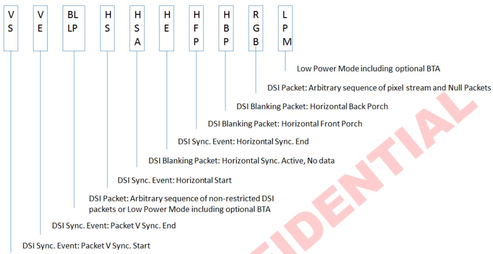

text_image

V S
V E
BL LP
H S
H S A
H E
H F P
H B P
R G B
L P M
DSI Packet: Arbitrary sequence of pixel stream and Null Packets
DSI Blanking Packet: Horizontal Back Porch
DSI Blanking Packet: Horizontal Front Porch
DSI Sync. Event: Horizontal Sync. End
DSI Blanking Packet: Horizontal Sync. Active, No data
DSI Sync. Event: Horizontal Start
DSI Packet: Arbitrary sequence of non-restricted DSI packets or Low Power Mode including optional BTA
DSI Sync. Event: Packet V Sync. End
DSI Sync. Event: Packet V Sync. Start
Low Power Mode including optional BTA

DSI Video Mode Interface Timing Legend

If a peripheral timing specification for HBP or HFP minimum period is zero, the corresponding Blanking Packet may be omitted. If the HBP or HFP maximum period is zero, the corresponding blanking packet shall be omitted.

# 5.6.6.2 Non-Burst Mode with Sync Pulses

With this format, the goal is to accurately convey DPI-type timing over the DSI serial Link. This includes matching DPI pixel-transmission rates, and widths of timing events like sync pulses. Accordingly, synchronization periods are defined using packets transmitting both start and end of sync pulses. An example of this mode is shown in figure below.

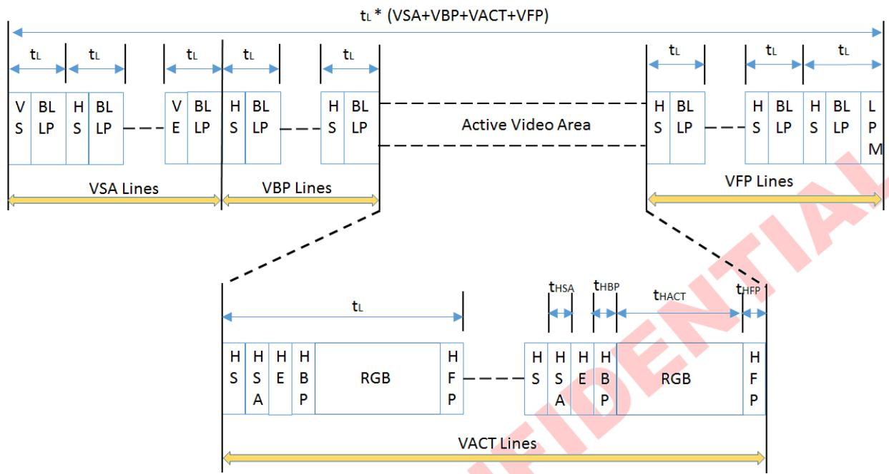

flowchart

```mermaid
graph LR
  subgraph VSA["VSA Lines"]
    direction TB
  S["V"] --> BL["BL"]
  LP["LP"] --> H["H"]
  BL --> BL["BL"]
  LP --> BL["LP"]
  S --> V["V"]
  V --> E["E"]
  E --> BL["BL"]
  BL --> LP["LP"]
  VEE["V & E & E"] --> VBP["VBP Lines"]
  VBP --> VBP
  end

  subgraph Active["Active Video Area"]
    direction TB
  H["H"] --> BL["BL"]
  LP["LP"] --> BL["LP"]
  H --> BL["BL"]
  LP --> BL["LP"]
  BL --> Active
  end

  subgraph VFP["VFP Lines"]
    direction TB
  H["H"] --> BL["BL"]
  LP["LP"] --> BL["LP"]
  BL --> BL["LP"]
  BL --> L["L"]
  BL --> P["P"]
  L --> M["M"]
  end

  subgraph VACT["VACT Lines"]
    direction TB
  H["H"] --> H["H"]
  S["S"] --> H
  A["A"] --> H
  H --> B["B"]
  P --> RGB["RGB"]
  H --> F["F"]
  F --> P
  RGB --> H
  H --> S
  S --> H
  H --> E
  H --> B
  H --> P
  H --> R["R"]
  S --> P
  end

  Active -.-> ActiveArea
  ActiveArea -.-> ActiveLine
  ActiveLine -.-> ActiveLine
  ActiveLine -.-> ActiveLine
```

DSI Video Mode Interface Timing: Non-Burst Transmission with Sync Start and End

Normally, periods shown as HSA (Horizontal Sync Active), HBP (Horizontal Back Porch) and HFP (Horizontal Front Porch) are filled by Blanking Packets, with lengths (including packet overhead) calculated to match the period specified by the peripheral's data sheet.

Alternatively, if there is sufficient time to transition from HS to LP mode and back again, a timed interval in LP mode may substitute for a Blanking Packet, thus saving power.

# 5.6.6.3 Burst Mode

In this mode, blocks of pixel data can be transferred in a shorter time using a time-compressed burst format. This is a good strategy to reduce overall DSI power consumption, as well as enabling larger blocks of time for other data transmissions over the Link in either direction. There may be a line buffer or similar memory on the peripheral to accommodate incoming data at high speed. Following HS pixel data transmission, the bus goes to Low Power Mode, during which it may remain idle, i.e. the host processor remains in LP-11 state, or LP transmission may take place in either direction. If the peripheral takes control of the bus for sending data to the host processor, its transmission time shall be limited to ensure data underflow does not occur from its internal buffer memory to the display device. An example of this mode is shown in figure below.

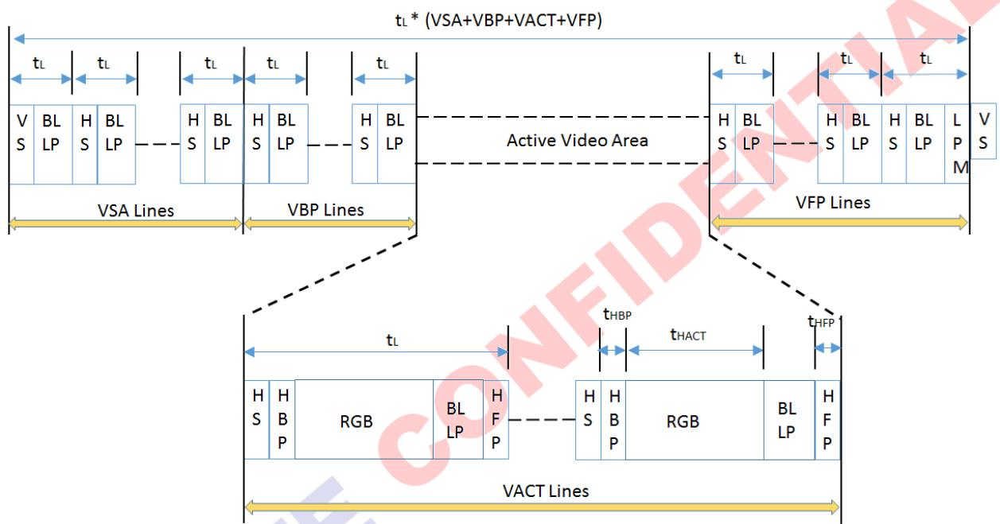

flowchart

```mermaid
graph LR
  subgraph VSA["VSA Lines"]
    direction TB
  S["V"] --> BL["BL"]
  LP["LP"] --> H["H"]
  BL --> BL["BL"]
  LP --> H
  H --> BL["BL"]
  LP --> H
  BL --> BL["BL"]
  H --> BL["BL"]
  LP --> BL
  BL --> H
  BL --> BL
  end

  subgraph VBP["VBP Lines"]
    direction TB
  V["V"] --> V["VPA"]
  VLP["VPA"] --> V["VPA"]
  VLP --> V["VPA"]
  VLP --> V["VPA"]
  VLP --> V["VPA"]
  VLP --> V["VPA"]
  VLP --> V["VPA"]
  end

  subgraph Active["Active Video Area"]
    direction TB
  A["Active Video Area"] --> A
  B["Active Video Area"] --> B
  C["Active Video Area"] --> C
  D["Active Video Area"] --> D
  E["Active Video Area"] --> E
  F["Active Video Area"] --> F
  G["Active Video Area"] --> G
  H["Active Video Area"] --> H
  I["Active Video Area"] --> I
  J["Active Video Area"] --> J
  K["Active Video Area"] --> K
  L["Active Video Area"] --> L
  end

  subgraph VFP["VFP Lines"]
    direction TB
  P["VFP Line"] --> P
  Q["VFP Line"] --> Q
  R["VFP Line"] --> R
  end

  subgraph VACT["VACT Lines"]
    direction TB
  S1["VACT Line"] --> S2["VACT Line"]
  S3["VACT Line"] --> S4["VACT Line"]
  S5["VACT Line"] --> S6["VACT Line"]
  S7["VACT Line"] --> S8["VACT Line"]
  end

  subgraph ActiveData["Active Video Area"]
    direction TB
  A1["Active Video Area"] --> A2["Active Video Area"]
  A3["Active Video Area"] --> A4["Active Video Area"]
  A5["Active Video Area"] --> A6["Active Video Area"]
  A7["Active Video Area"] --> A8["Active Video Area"]
  A9["Active Video Area"] --> A10["Active Video Area"]
  A11["Active Video Area"] --> A12["Active Video Area"]
  A13["Active Video Area"] --> A14["Active Video Area"]
  A15["Active Video Area"] --> A16["Active Video Area"]
  A17["Active Video Area"] --> A18["Active Video Area"]
  A19["Active Video Area"] --> A20["Active Video Area"]
  A21["Active Video Area"] --> A22["Active Video Area"]
  A23["Active Video Area"] --> A24["Active Video Area"]
  A25["Active Video Area"] --> A26["Active Video Area"]
  A27["Active Video Area"] --> A28["Active Video Area"]
  A29["Active Video Area"] --> A30["Active Video Area"]
  A31["Active Video Area"] --> A32["Active Video Area"]
  A33["Active Video Area"] --> A34["Active Video Area"]
  A35["Active Video Area"] --> A36["Active Video Area"]
  A37["Active Video Area"] --> A38["Active Video Area"]
  A39["Active Video Area"] --> A40["Active Video Area"]
  A41["Active Video Area"] --> A42["Active Video Area"]
  A43["Active Video Area"] --> A44["Active Video Area"]
  A45["Active Video Area"] --> A46["Active Video Area"]
  A47["Active Video Area"] --> A48["Active Video Area"]
  A49["Active Video Area"] --> A50["Active Video Area"]
  end

  subgraph ActiveDataPath
    direction TB
    S1["(&quot;VSA&quot;)"]
    S2["(&quot;VBA&quot;)"]
    S3["(&quot;VAC&quot;)"]
    S4["(&quot;VFP&quot;)"]
  end

  subgraph ActiveDataPath
    direction TB
    S1 -.->|"tL"| S2
    S2 -.->|"tL"| S3
    S3 -.->|"tL"| S4
    S4 -.->|"tL"| S5
    S5 -.->|"tL"| S6
  end

  subgraph ActiveDataPath
    direction TB
    S1 -.->|"tL"| S2
    S2 -.->|"tL"| S3
    S3 -.->|"tL"| S4
    S4 -.->|"tL"| S5
  end

  subgraph ActiveDataPath
    direction TB
    S1 -.->|"tL"| S2
    S2 -.->|"tL"| S3
    S3 -.->|"tL"| S4
  end

  subgraph ActiveDataPath
    direction TB
    S1 -.->|"tL"| S2
    S2 -.->|"tL"| S3
  end
```

DSI Video Mode Interface Timing: Burst Transmission

Similar to the Non-Burst Mode scenario, if there is sufficient time to transition from HS to LP mode and back again, a timed interval in LP mode may substitute for a Blanking Packet, thus saving power.

# 5.6.7 Display Data Format

5.6.7.1 18-bit per Pixel, Long Packet, Data Type 011110 (1Eh)  
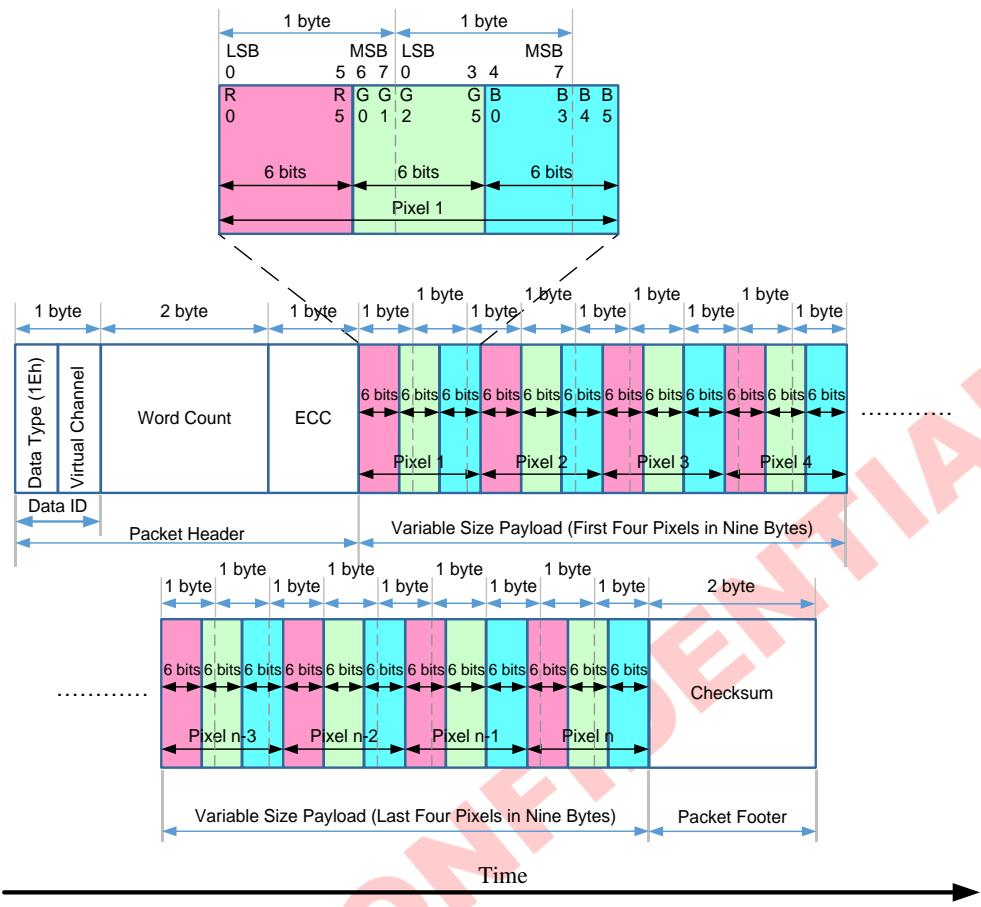

text_image

1 byte
LSB 0 5 6 7 0 3 4 7
R 0 R G G G B B B B
0 5 0 1 2 5 0 3 4 5
6 bits 6 bits 6 bits
Pixel 1
1 byte 1 byte 1 byte 1 byte 1 byte 1 byte
Data Type (1Eh) Virtual Channel Word Count ECC 6 bits 6 bits 6 bits 6 bits 6 bits 6 bits 6 bits 6 bits 6 bits
Pixel 1 Pixel 2 Pixel 3 Pixel 4
Data ID Packet Header Variable Size Payload (First Four Pixels in Nine Bytes)
1 byte 1 byte 1 byte 1 byte 1 byte 1 byte 1 byte
6 bits 6 bits 6 bits 6 bits 6 bits 6 bits 6 bits 6 bits
Pixel n-3 Pixel n-2 Pixel n-1 Pixel n
Checksum
Variable Size Payload (Last Four Pixels in Nine Bytes) Packet Footer
Time

18-bit per Pixel – RGB Color Format, Long Packet

Packed Pixel Stream 18-Bit Format (Packed) is a Long packet. It is used to transmit RGB image data formatted as pixels to a Video Mode display module that displays 18-bit pixels The packet consists of the DI byte, a two-byte WC, an ECC byte, a payload of length WC bytes and a two-byte Checksum. Pixel format is red (6 bits), green (6 bits) and blue (6 bits), in that order. Within a color component, the LSB is sent first, the MSB last. Note that pixel boundaries only align with byte boundaries every four pixels (nine bytes). Preferably, display modules employing this format have a horizontal extent (width in pixels) evenly divisible by four, so no partial bytes remain at the end of the display line data. If the active (displayed) horizontal width is not a multiple of four pixels, the transmitter shall send additional fill pixels at the end of the display line to make the transmitted width a multiple of four pixels. The receiving peripheral shall not display the fill pixels when refreshing the display device.

For example, if a display device has an active display width of 399 pixels, the transmitter should send 400 pixels in one or more packets. The receiver should display the first 399 pixels and discard the last pixel of the transmission.

With this format, the total line width (displayed plus non-displayed pixels) should be a multiple of four pixels (nine bytes).

5.6.7.2 18-bit per Pixel, Long Packet, Data Type 101110 (2Eh)  
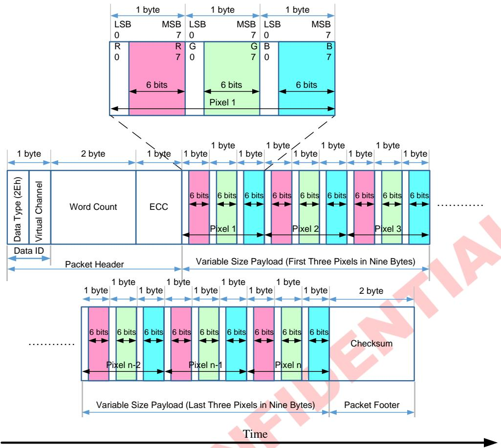

text_image

1 byte
LSB 0 MSB 7 LSB 0 MSB 7 LSB 0 MSB 7
R 0 R G G B B
6 bits Pixel 1 6 bits 6 bits
Data Type (2Eh) Virtual Channel Word Count ECC 6 bits 6 bits 6 bits 6 bits 6 bits 6 bits 6 bits 6 bits
Pixel 1 Pixel 2 Pixel 3
Data ID Packet Header Variable Size Payload (First Three Pixels in Nine Bytes)
1 byte 2 byte 1 byte 1 byte 1 byte 1 byte 1 byte 1 byte 1 byte
1 byte 1 byte 1 byte 1 byte 1 byte 1 byte 1 byte 1 byte 2 byte
6 bits 6 bits 6 bits 6 bits 6 bits 6 bits 6 bits Checksum
Pixel n-2 Pixel n-1 Pixel n
Variable Size Payload (Last Three Pixels in Nine Bytes) Packet Footer Time

18-bit per Pixel (Loosely Packed) – RGB Color Format, Long Packet

In the 18-bit Pixel Loosely Packed format, each R, G, or B color component is six bits but is shifted to the upper bits of the byte, such that the valid pixel bits occupy bits [7:2] of each byte. Bits [1:0] of each payload byte representing active pixels are ignored. As a result, each pixel requires three bytes as it is transmitted across the Link. This requires more bandwidth than the “packed” format, but requires less shifting and multiplexing logic in the packing and unpacking functions on each end of the Link.

This format is used to transmit RGB image data formatted as pixels to a Video Mode display module that displays 18-bit pixels. The packet consists of the DI byte, a two-byte WC, an ECC byte, a payload of length WC bytes and a two-byte Checksum. The pixel format is red (6 bits), green (6 bits) and blue (6 bits) in that order. Within a color component, the LSB is sent first, the MSB last. With this format, pixel boundaries align with byte boundaries every three bytes. The total line width (displayed plus non-displayed pixels) should be a multiple of three bytes.

5.6.7.3 24-bit per Pixel, Long Packet, Data Type 111110 (3Eh)  
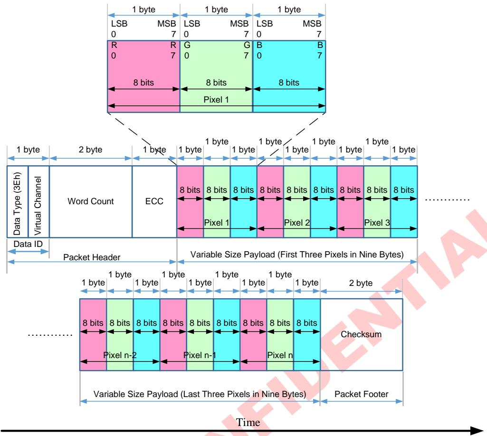

text_image

1 byte
LSB MSB LSB MSB LSB MSB
0 7 0 7 0 7
R R G G B B
0 7 0 7 0 7
8 bits 8 bits 8 bits
Pixel 1
1 byte
1 byte
1 byte
1 byte
1 byte
1 byte
1 byte
1 byte
1 byte
1 byte
1 byte
1 byte
1 byte
1 byte
1 byte
1 byte
1 byte
1 byte
1 byte
1 byte
1 byte
1 byte
1 byte
1 byte
1 byte
1 byte
1 byte
1 byte
1 byte
1 byte
1 byte
1 byte
1 byte
1 byte

24-bit per Pixel – RGB Color Format, Long Packet

Packed Pixel Stream 24-Bit Format is a Long packet. It is used to transmit image data formatted as 24-bit pixels to a Video Mode display module. The packet consists of the DI byte, a two-byte WC, an ECC byte, a payload of length WC bytes and a two-byte Checksum. The pixel format is red (8 bits), green (8 bits) and blue (8 bits), in that order. Each color component occupies one byte in the pixel stream; no components are split across byte boundaries. Within a color component, the LSB is sent first, the MSB last. With this format, pixel boundaries align with byte boundaries every three bytes. The total line width (displayed plus non-displayed pixels) should be a multiple of three bytes.

# 5.7 Gamma Function

The structure of grayscale amplifier is shown as below. CO6300 have support Separated Gamma Correction function for R/G/B data.

There are 27 voltage levels between VGMP/VGSP and Gamma GND (VGS), which are determined by the reference adjustment register.

CO6300 Gamma Structure as below:

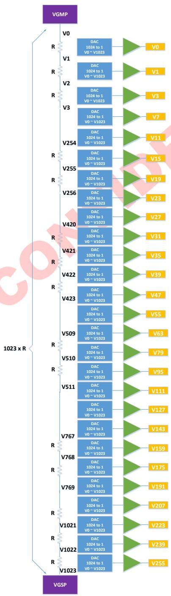

flowchart

This diagram illustrates the architecture of a V023 microcontroller (V023) and its corresponding data flow, showing the signal paths from input through various DACs to output signals.

Gamma register stream and Gamma reference voltage

# 5.8 Power On/ OFF Sequence

5.8.1 Power Stage Diagram  
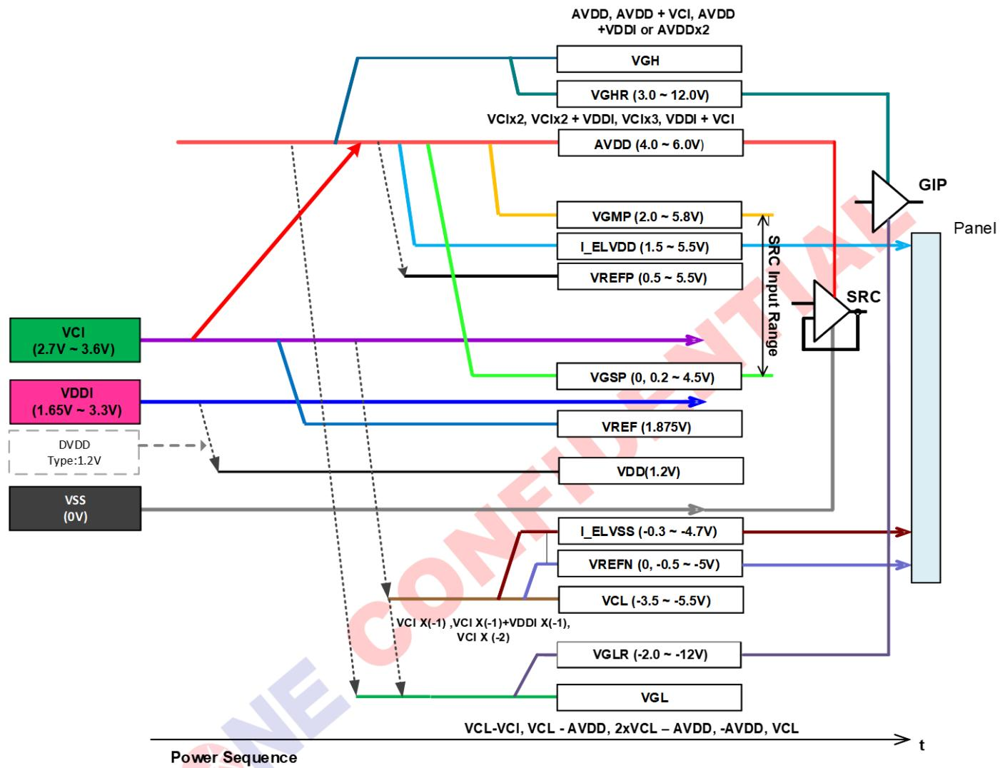

flowchart

```mermaid
graph LR
  subgraph Power_Switchs
  A["VGH"] --> B["AVDD, AVDD + VCI, AVDD +VDDI or AVDDx2"]
  C["VGHR (3.0 ~ 12.0V)"] --> D["VCIx2, VCIX2 + VDDI, VCIX3, VDDI + VCI"]
  E["AVDD (4.0 ~ 6.0V)"] --> F["VGMP (2.0 ~ 5.8V)"]
  G["I_ELVDD (1.5 ~ 5.5V)"] --> H["VREFP (0.5 ~ 5.5V)"]
  I["VGSP (0, 0.2 ~ 4.5V)"] --> J["VREF (1.875V)"]
  K["VDD(1.2V)"] --> L["VCL (1.65V ~ 3.3V)"]
  M["VCL-(-3.5 ~ -5.5V)"] --> N["I_ELVSS (-0.3 ~ -4.7V)"]
  O["VGLR (-2.0 ~ -12V)"] --> P["VGL (0V)"]
  Q["VCL-VCI, VCL - AVDD, 2xVCL - AVDD, -AVDD, VCL"] --> R["VCL X(-1), VCI X(-1)+VDDI X(-1), VCI X (-2)"]
  end

  subgraph Interface
    S["GIP / Panel"]
    T["SRC Input Range"]
  end

  A -.-> B
  C -.-> D
  D -.-> E
  E -.-> F
  F -.-> G
  G -.-> H
  H -.-> I
  I -.-> J
  J -.-> K
  K -.-> L
  L -.-> M
  M -.-> N
  N -.-> O
  O -.-> P
  P -.-> Q
  Q -.-> R
  R -.-> S
```

Power Stage Diagram

# 5.8.2 Power ON Sequence

The power on sequence for different power input modes are shown below figures.

Power ON Sequence Timing

<table><tr><td rowspan="2">Symbol</td><td rowspan="2">Description</td><td colspan="3">Value</td><td rowspan="2">Unit</td><td rowspan="2">Remark</td></tr><tr><td>Min.</td><td>Typ.</td><td>Max.</td></tr><tr><td>Ton1</td><td>VDDI on to DVDD on delay</td><td>&gt;0</td><td>-</td><td>-</td><td>us</td><td></td></tr><tr><td>Ton2</td><td>DVDD on to VCI on power delay time</td><td>&gt;0</td><td>-</td><td>-</td><td>ms</td><td></td></tr><tr><td>T1</td><td>VCI on to valid to nRESET high</td><td>10</td><td>-</td><td>-</td><td>ms</td><td></td></tr><tr><td>T2</td><td>VCI to MIPI bus ready delay</td><td>0</td><td>-</td><td>T1</td><td>ms</td><td></td></tr><tr><td>T3</td><td>nRESET low period</td><td>50</td><td>-</td><td>-</td><td>us</td><td></td></tr><tr><td>T4</td><td>nRESET high to OTP code re-load ready</td><td>10</td><td>-</td><td>-</td><td>ms</td><td></td></tr><tr><td>T5</td><td>Sleep-out command received to Display on command received.</td><td>50</td><td>-</td><td>-</td><td>ms</td><td></td></tr><tr><td>Tr1</td><td>VDDI power rising time</td><td>0.3</td><td>-</td><td>2</td><td>ms</td><td></td></tr><tr><td>Tr2</td><td>DVDD power rising time</td><td>0.3</td><td>-</td><td>2</td><td>ms</td><td></td></tr><tr><td>Tr3</td><td>VCI power rising time</td><td>0.3</td><td>-</td><td>2</td><td>ms</td><td></td></tr></table>

The Power on sequence is shown as below.

MIPI CASE:  
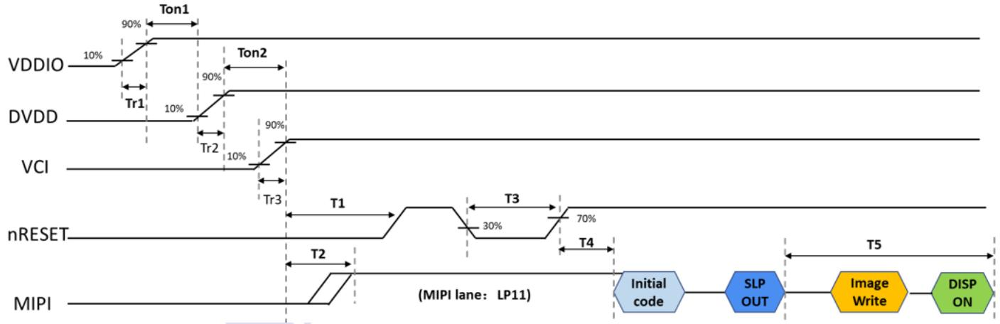

flowchart

```mermaid
graph LR
  A["VDDIO"] -->|10%| B["Tr1"]
  B -->|90%| C["Ton1"]
  D["DVDD"] -->|10%| E["Tr2"]
  E -->|90%| F["Ton2"]
  G["VCI"] -->|10%| H["Tr3"]
  I["nRESET"] -->|T1| J["30%"]
  J -->|T3| K["70%"]
  L["MIPI"] -->|T2| M["Initial code"]
  M --> N["SLP OUT"]
  O["Image Write"] --> P["DISP ON"]
  Q["(MIPI lane: LP11)"] -.-> R["T4"]
  S["T5"] -.-> T["Final Output"]
```

SPI CASE:  
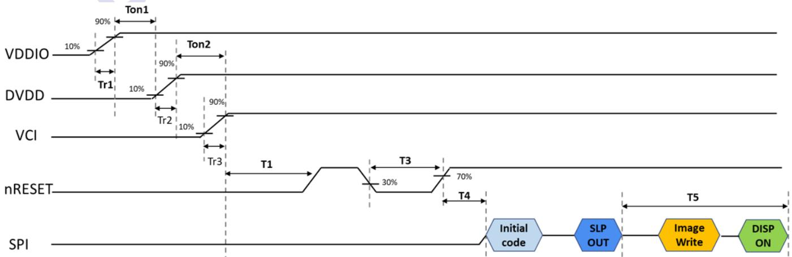

flowchart

```mermaid
graph LR
  SPI["SPI"] --> InitialCode{{Initial code}}
  nRESET["nRESET"] --> T1["T1"]
  nRESET --> T3["T3"]
  nRESET --> T4["T4"]
  T1 --> nRESET
  T3 --> nRESET
  T4 --> nRESET
  nRESET --> Trans1["Tr1"]
  nRESET --> Trans2["Tr2"]
  nRESET --> Trans3["Tr3"]
  nRESET --> Trans4["Tr4"]
  Trans1 --> Ton1["Ton1"]
  Trans2 --> Ton2["Ton2"]
  Trans3 --> Ton2
  Trans4 --> Ton2
  Ton1 --> VDDIO["VDDIO"]
  Ton2 --> VDDIO
  VDDIO --> VDDIO
  VDDIO --> DVDD["DVDD"]
  VDDIO --> VCI["VCI"]
  VDDIO --> SPI
```

Note 1: Unless otherwise specified, timings herein show cross point at 50% of signal/power level.  
Note 2: This power-on sequence is based on adding Schottky diode on VGL pin to ground.

# 5.8.3 Power OFF Sequence

The power off sequence for different power input modes are shown below figures.

Power OFF Sequence Timing

<table><tr><td rowspan="2">Symbol</td><td rowspan="2">Description</td><td colspan="3">Value</td><td rowspan="2">Unit</td><td rowspan="2">Remark</td></tr><tr><td>Min.</td><td>Typ.</td><td>Max.</td></tr><tr><td>Toff1</td><td>VCI off to DVDD off delay</td><td>&gt;0</td><td>-</td><td>-</td><td>us</td><td></td></tr><tr><td>Toff2</td><td>DVDD off to VDDI off delay</td><td>&gt;0</td><td>-</td><td>-</td><td>us</td><td></td></tr><tr><td>T7</td><td>Sleep-in command received to valid to nRESET low</td><td>100</td><td>-</td><td>-</td><td>ms</td><td></td></tr><tr><td>T8</td><td>MIPI ultra low power mode to valid to nRESET low</td><td>0</td><td>-</td><td>-</td><td>us</td><td></td></tr><tr><td>T9</td><td>nRESET low to VCI off delay</td><td>0</td><td>-</td><td>-</td><td>us</td><td></td></tr><tr><td>Tf1</td><td>VDDI power falling time</td><td>0.1</td><td>-</td><td>5</td><td>ms</td><td></td></tr><tr><td>Tf2</td><td>DVDD power falling time</td><td>0.1</td><td>-</td><td>5</td><td>ms</td><td></td></tr><tr><td>Tf3</td><td>VCI power falling time</td><td>0.1</td><td>-</td><td>5</td><td>ms</td><td></td></tr></table>

The power off sequence is shown as below:

MIPI CASE:  
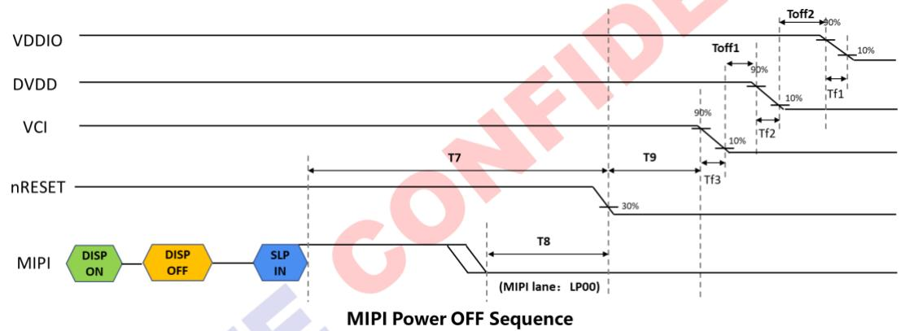

flowchart

```mermaid
graph LR
  A["MIPI"] --> B["DISP ON"]
  B --> C["DISP OFF"]
  C --> D["SLP IN"]
  D --> E["nRESET"]
  E --> F["T7"]
  F --> G["T8"]
  G --> H["(MIPI lane: LP00)"]
  H --> I["T9"]
  I --> J["Tf3"]
  J --> K["Tff1"]
  K --> L["Tff2"]
  L --> M["Tff1"]
  M --> N["Tff2"]
  N --> O["VDDIO"]
  O --> P["DVDD"]
  P --> Q["VCI"]
  Q --> R["nRESET"]
  R --> S["MIPI"]
  S --> T["VDDIO"]
```

SPI CASE:

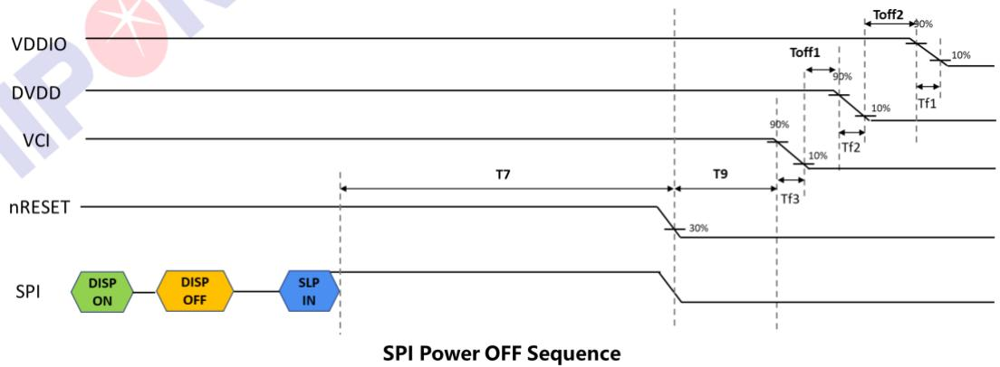

flowchart

```mermaid
graph LR
  A["VDDIO"] --> B["DVDD"]
  B --> C["VCI"]
  C --> D["nRESET"]
  D --> E["SPI"]
  E --> F["DISP ON"]
  F --> G["DISP OFF"]
  G --> H["SLP IN"]
  H --> I["T7"]
  I --> J["T9"]
  J --> K["Tf3"]
  K --> L["Toff1"]
  L --> M["Toff2"]
  M --> N["Tf1"]
  N --> O["10%"]
  O --> P["10%"]
```

Note 1: Unless otherwise specified, timings herein show cross point at 50% of signal/power level.  
Note 2: Keep VGH is equal to or larger than VCI during power off sequence.

# 6. Electrical Characteristics

# 6.1 Absolute Maximum Ratings

The absolute maximum rating is listed in below table. It may lead permanently damaged when the CO6300 is used out of the absolute maximum rating.

To use the CO6300 within the following electrical characteristics limit is strongly recommended for normal operation. If these electrical characteristic conditions are exceeded during normal operation, the CO6300 will malfunction and be poor reliability.

Absolute Maximum Ratings List

<table><tr><td rowspan="2">Item</td><td rowspan="2">Symbol</td><td colspan="3">Rating</td><td rowspan="2">Unit</td></tr><tr><td>Min.</td><td>Typ.</td><td>Max.</td></tr><tr><td>Power supply voltage</td><td>VDDI ~ VSSD</td><td>-0.3</td><td>-</td><td>+5.5</td><td>V</td></tr><tr><td>Power supply voltage</td><td>VCI (VCIA, VCIC, VCIR) ~ VSSA</td><td>-0.3</td><td>-</td><td>+5.5</td><td>V</td></tr><tr><td>Supply voltage</td><td>AVDD ~ VSSA</td><td>-0.3</td><td>-</td><td>+6.6</td><td>V</td></tr><tr><td>Supply voltage</td><td>AVSS ~ VCL</td><td>-0.3</td><td>-</td><td>+5.0</td><td>V</td></tr><tr><td>Supply voltage</td><td>VGH ~ VGL</td><td colspan="3">|VGH-VGL| ≤30</td><td>V</td></tr><tr><td>Operating temperature</td><td>Topr</td><td>-40</td><td></td><td>+85</td><td>°C</td></tr><tr><td>Storage temperature</td><td>Tstg</td><td>-55</td><td></td><td>+125</td><td>°C</td></tr><tr><td>Input voltage</td><td>Vin</td><td>-0.3</td><td></td><td>VDDI+0.3</td><td>V</td></tr></table>

# 6.2 DC Characteristics

Condition : Ta =25°C

DC Characteristics List

<table><tr><td>Parameter</td><td>Symbol</td><td>Conditions</td><td>MIN</td><td>TYP</td><td>MAX</td><td>Unit</td><td>Notes</td></tr><tr><td colspan="8">Power generation &amp; Operation Voltage</td></tr><tr><td>AVDD booster voltage</td><td>AVDD</td><td>Operating Voltage</td><td>4.0</td><td>-</td><td>6.0</td><td>V</td><td></td></tr><tr><td>VCL booster voltage</td><td>VCL</td><td>Operating Voltage</td><td>-5.5</td><td>-</td><td>-3.5</td><td>V</td><td></td></tr><tr><td>Analog Operating voltage</td><td>VREFP</td><td>Operating Voltage</td><td>0.5</td><td>-</td><td>5.5</td><td>V</td><td></td></tr><tr><td>Analog Operating voltage</td><td>VREFN</td><td>Operating Voltage</td><td>-5.0</td><td>-</td><td>-0.5</td><td>V</td><td></td></tr><tr><td>Analog Operating voltage</td><td>I_ELVDD</td><td>Operating Voltage</td><td>1.5</td><td>-</td><td>5.5</td><td>V</td><td></td></tr><tr><td>Analog Operating voltage</td><td>I_ELVSS</td><td>Operating Voltage</td><td>-4.7</td><td>-</td><td>-0.3</td><td>V</td><td></td></tr><tr><td>Gamma reference voltage</td><td>VGMP</td><td>Operating Voltage</td><td>2</td><td>-</td><td>5.8</td><td>V</td><td></td></tr><tr><td>Gamma reference voltage</td><td>VGSP</td><td>Operating Voltage</td><td>0.2</td><td>-</td><td>4.5</td><td>V</td><td></td></tr><tr><td>VGH booster voltage</td><td>VGH</td><td>Operating Voltage</td><td>3</td><td></td><td>12.0</td><td>V</td><td></td></tr><tr><td>VGL booster voltage</td><td>VGL</td><td>Operating Voltage</td><td>-12</td><td></td><td>-2</td><td>V</td><td></td></tr><tr><td>Voltage difference between VGH and VGL</td><td>VGH-VGL</td><td>|VGH-VGL| ≤30</td><td></td><td></td><td>30</td><td>V</td><td></td></tr><tr><td>I/O operating voltage</td><td>VDDI</td><td>I/O supply voltage</td><td>1.65</td><td>-</td><td>3.3</td><td>V</td><td></td></tr><tr><td colspan="8">LOGIC INPUT/ OUTPUT</td></tr><tr><td>Logic High level input voltage</td><td>VIH</td><td></td><td>0.8×VDDI</td><td>-</td><td>VDDI</td><td>V</td><td>1</td></tr><tr><td>Logic Low level input voltage</td><td>VIL</td><td>-</td><td>VSS</td><td>-</td><td>0.2×VDDI</td><td>V</td><td>1</td></tr><tr><td>Logic High level output voltage</td><td>VOH</td><td>IOH = -0.1mA</td><td>0.8×VDDI</td><td>-</td><td>VDDI</td><td>V</td><td>2</td></tr><tr><td>Logic Low level output voltage</td><td>VOL</td><td>IOL = +0.1mA</td><td>VSS</td><td>-</td><td>0.2×VDDI</td><td>V</td><td>2</td></tr><tr><td>Logic High level leakage</td><td>ILIH1</td><td>Vin = 0 to VDDI</td><td>-</td><td>-</td><td>1</td><td>μA</td><td>1,2</td></tr><tr><td>Logic Low level leakage</td><td>ILIL1</td><td>Vin = 0 to VDDI</td><td>-1</td><td>-</td><td>-</td><td>μA</td><td>1,2</td></tr><tr><td colspan="8">Source OP Output</td></tr><tr><td>Output deviation voltage</td><td> $V_{dev}$ </td><td>Sout ≥ 4.2VSout ≤ 0.8V</td><td></td><td></td><td>TBD</td><td>mV</td><td rowspan="2"></td></tr><tr><td>Output deviation voltage</td><td> $V_{dev}$ </td><td>4.2V&gt;Sout&gt;0.8V</td><td></td><td></td><td>TBD</td><td>mV</td></tr><tr><td>Output offset voltage</td><td> $V_{OFFSET}$ </td><td></td><td></td><td></td><td>TBD</td><td>mv</td><td></td></tr><tr><td colspan="8">Stand-by Current</td></tr><tr><td rowspan="4">Sleep In mode</td><td rowspan="2"> $I_{stlp1}$ </td><td>DSI LP modeVDDI Current</td><td></td><td>110</td><td></td><td>μA</td><td></td></tr><tr><td>DSI LP modeVCI Current</td><td></td><td>25</td><td></td><td>μA</td><td>1</td></tr><tr><td rowspan="2"> $I_{stul1}$ </td><td>DSI Ultra Low powerVDDI Current</td><td></td><td>85</td><td></td><td>μA</td><td></td></tr><tr><td>DSI Ultra Low powerVCI Current</td><td></td><td>25</td><td></td><td>μA</td><td>1</td></tr><tr><td colspan="8">Oscillator Output</td></tr><tr><td>Oscillator tolerance</td><td>△OSC</td><td>All Temperature</td><td>-2%</td><td>-</td><td>2%</td><td>%</td><td>3</td></tr></table>

Note 1: Including of all logic I/O pins.

Note 2: Including of TE, TE1, SWIRE.

Note 3: Oscillator = 24MHz.

# 6.3 MIPI DC Characteristics

# 6.3.1 DC Characteristics for DSI LP Mode

Condition : Ta =25°C, VDDI =1.65V\~3.3V, VCI =2.7V\~3.6V,

DC Characteristics List for DSI LP Mode

<table><tr><td rowspan="2">Parameter</td><td rowspan="2">Symbol</td><td rowspan="2">Conditions</td><td colspan="3">Specification</td><td rowspan="2">Unit</td><td rowspan="2">Notes</td></tr><tr><td>MIN</td><td>TYP</td><td>MAX</td></tr><tr><td>Logic high level input voltage</td><td> $V_{IHLPCD}$ </td><td>LP-CD</td><td>450</td><td></td><td>1350</td><td>mV</td><td></td></tr><tr><td>Logic Low level input voltage</td><td> $V_{ILLPCD}$ </td><td>LP-CD</td><td>0</td><td></td><td>200</td><td>mV</td><td></td></tr><tr><td>Logic high level input voltage</td><td> $V_{IHLPRX}$ </td><td>LP-RX (CLK,D0)</td><td>880</td><td></td><td>1350</td><td>mV</td><td></td></tr><tr><td>Logic Low level input voltage</td><td> $V_{ILLPRX}$ </td><td>LP-RX (CLK,D0)</td><td>0</td><td></td><td>550</td><td>mV</td><td></td></tr><tr><td>Logic Low level input voltage</td><td> $V_{ILLPRXULP}$ </td><td>LP-RX(CLK ULP mode)</td><td>0</td><td></td><td>300</td><td>mV</td><td></td></tr><tr><td>Logic high level input voltage</td><td> $V_{OHLPTX}$ </td><td>LP-TX(D0)</td><td>1.1</td><td></td><td>1.3</td><td>V</td><td></td></tr><tr><td>Logic Low level input voltage</td><td> $V_{OLLPTX}$ </td><td>LP-TX(D0)</td><td>-50</td><td></td><td>50</td><td>mV</td><td></td></tr><tr><td>Logic high level input voltage</td><td> $I_{IH}$ </td><td>LP-RX,Vin =0~1.3V</td><td></td><td></td><td>10</td><td>μA</td><td></td></tr><tr><td>Logic Low level input voltage</td><td> $I_{IL}$ </td><td>LP-RX,Vin =0~1.3V</td><td>-10</td><td></td><td></td><td>μA</td><td></td></tr><tr><td>Input pulse rejection</td><td>SGD</td><td>DSI-CLKP/N,DSI-DnP/N</td><td></td><td></td><td>300</td><td>Vps</td><td>1</td></tr></table>

Note 1: Peak interference amplitude max. 200mV and interference frequency min. 450MHz.

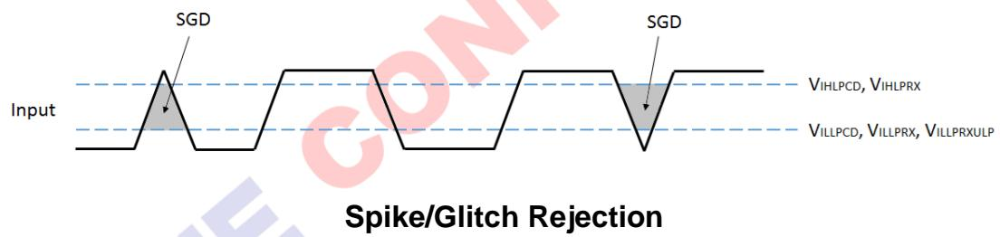

text_image

SGD
SGD
Input
VIHLPCD, VIHLPRX
VILLPCD, VILLPRX, VILLPRXULP
Spike/Glitch Rejection

# 6.3.2 DC Characteristics for DSI HS Mode

Condition : Ta =25°C, VDDI =1.65V\~3.3V, VCI =2.7V\~3.6V.

DC Characteristics List for DSI HS Mode

<table><tr><td rowspan="2">Parameter</td><td rowspan="2">Symbol</td><td rowspan="2">Conditions</td><td colspan="3">Specification</td><td rowspan="2">Unit</td><td rowspan="2">Notes</td></tr><tr><td>MIN</td><td>TYP</td><td>MAX</td></tr><tr><td>Input voltage common mode range</td><td> $V_{CMCLK}$  $V_{CMDATA}$ </td><td>CLKP/N, DnP/N</td><td>70</td><td></td><td>330</td><td>mV</td><td>1,2</td></tr><tr><td>Input voltage common mode variation (≤450MHz)</td><td> $V_{CMRCLKL}$  $V_{CMRDATAL}$ </td><td>CLKP/N, DnP/N</td><td>-50</td><td></td><td>50</td><td>mV</td><td>3</td></tr><tr><td>Input voltage common mode variation (≥450MHz)</td><td> $V_{CMRCLKM}$  $V_{CMRDATAM}$ </td><td>CLKP/N, DnP/N</td><td></td><td></td><td>100</td><td>mV</td><td></td></tr><tr><td>Low-level differential input voltage threshold</td><td> $V_{THLCLK}$  $V_{THLDATA}$ </td><td>CLKP/N, DnP/N</td><td>-70</td><td></td><td></td><td>mV</td><td></td></tr><tr><td>High-level differential input voltage threshold</td><td> $V_{THHCLK}$  $V_{THHDATA}$ </td><td>CLKP/N, DnP/N</td><td></td><td></td><td>70</td><td>mV</td><td></td></tr><tr><td>Single-ended input low voltage</td><td> $V_{ILHS}$ </td><td>CLKP/N, DnP/N</td><td>-40</td><td></td><td></td><td>mV</td><td>2</td></tr><tr><td>Single-ended input high voltage</td><td> $V_{IHHS}$ </td><td>CLKP/N, DnP/N</td><td></td><td></td><td>460</td><td>mV</td><td>2</td></tr><tr><td>Differential input termination resistor</td><td> $R_{TERM}$ </td><td>CLKP/N, DnP/N</td><td>80</td><td>100</td><td>125</td><td>Ω</td><td></td></tr><tr><td>Single-ended threshold voltage for termination enable</td><td> $V_{TERM\_EN}$ </td><td>CLKP/N, DnP/N</td><td></td><td></td><td>450</td><td>mV</td><td></td></tr><tr><td>Termination capacitor</td><td> $C_{TERM}$ </td><td>CLKP/N, DnP/N</td><td></td><td></td><td>14</td><td>pF</td><td></td></tr></table>

Note 1: Includes 50mV (-50mV to 50mV) ground difference.  
Note 2: Without VCMRCLKM / VCMRDATAM.  
Note3: Without 50mV (-50mV to 50mV) ground difference.  
Note4: Dn =D0, and D1.

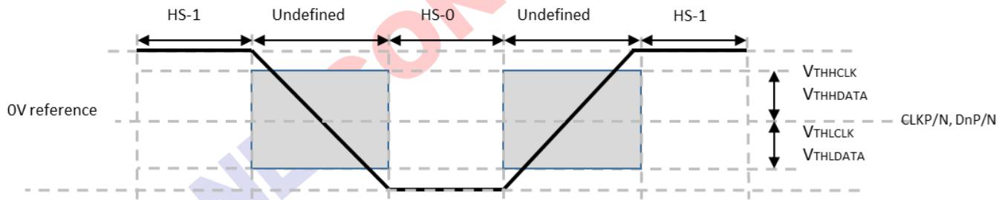

text_image

HS-1 Undefined HS-0 Undefined HS-1
VTHHCLK
VTHHDATA
VTHLCLK
VTHLDATA
CLKP/N, DnP/N
OV reference

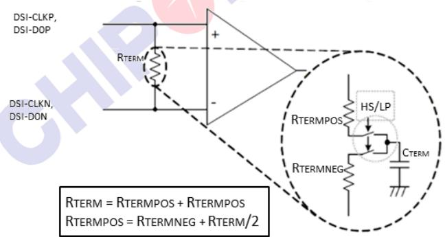

text_image

DSI-CLKP,
DSI-DOP
DSI-CLKN,
DSI-DON
RTERM
+
-
RTERMPOS
HS/LP
RTERMNEG
CTERM
RTERM = RTERMPOS + RTERMPOS
RTERMPOS = RTERMNEG + RTERM/2

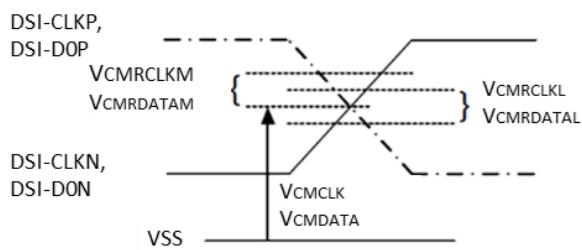

text_image

DSI-CLKP,
DSI-DOP
VCMRCLKM
VCMRDATAM
VCMRCLKL
VCMRDATAL
DSI-CLKN,
DSI-DON
VCMCLK
VCMDATA
VSS

Figure 6-1 Differential voltage range, termination resistor and Common mode voltage

# 6.4 AC Timings Characteristics

# 6.4.1 Serial Interface Characteristics (3/4-wire SPI)

3-Wire SPI Serial Interface Characteristics  
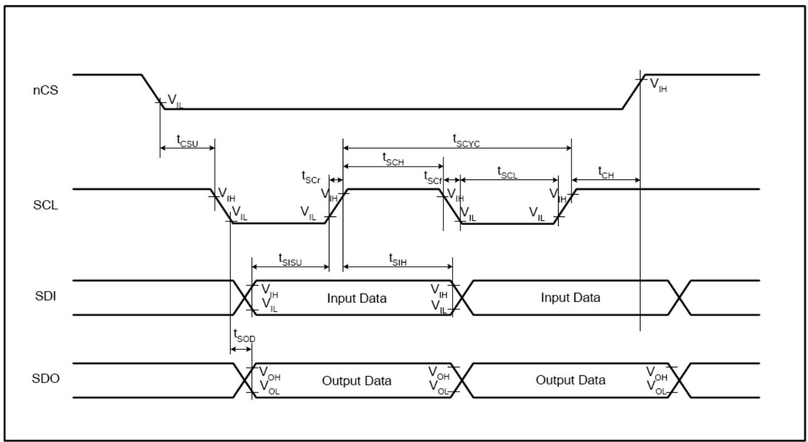

text_image

nCS
VIL
tCSU
SCL
VIH
VIL
tSCR
VIL
tSCYC
tSCH
tSCf
VIL
tSCL
VIL
tCH
SDI
Input Data
VIH
VIL
tSIH
Input Data
SDO
tSOD
VOH
VOL
Output Data
VOH
VOL
Output Data
VOH
VOL

4-Wire SPI Serial Interface Characteristics  
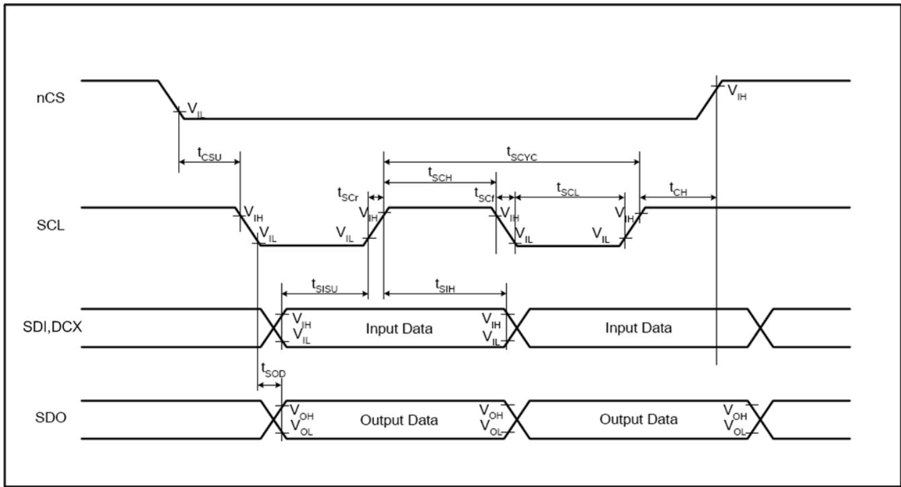

text_image

nCS
VIL
tCSU
SCL
VIH
VIL
tSCR
VIL
tSCYC
tSCH
tSCF
tSCL
VIL
VIL
tCH
SDI,DCX
Input Data
VIH
VIL
tSIH
Input Data
tSOD
SDO
VOH
VOL
Output Data
VOH
VOL
Output Data
VOH
VOL

<table><tr><td rowspan="2">Parameter</td><td rowspan="2">Symbol</td><td rowspan="2">Conditions</td><td colspan="3">Specification</td><td rowspan="2">Unit</td><td rowspan="2">Notes</td></tr><tr><td>MIN</td><td>TYP</td><td>MAX</td></tr><tr><td rowspan="8">SCL</td><td> $T_{SCYC}$ </td><td>Clock cycle (Write)</td><td>20</td><td>-</td><td>-</td><td>ns</td><td></td></tr><tr><td> $T_{SCYC}$ </td><td>Clock cycle (Read)</td><td>300</td><td></td><td>-</td><td>ns</td><td></td></tr><tr><td> $T_{SCH}$ </td><td>Clock “H” pulse width (Write)</td><td>9</td><td>-</td><td>-</td><td>ns</td><td></td></tr><tr><td> $T_{SCH}$ </td><td>Clock “H” pulse width (Read)</td><td>140</td><td>-</td><td>-</td><td>ns</td><td></td></tr><tr><td> $T_{SCL}$ </td><td>Clock “L” pulse width (Write)</td><td>9</td><td>-</td><td>-</td><td>ns</td><td></td></tr><tr><td> $T_{SCL}$ </td><td>Clock “L” pulse width (Read)</td><td>140</td><td>-</td><td>-</td><td>ns</td><td></td></tr><tr><td> $T_{SCR}$ </td><td>Clock rise time</td><td>-</td><td>-</td><td>2</td><td>ns</td><td></td></tr><tr><td> $T_{SCf}$ </td><td>Clock fall time</td><td>-</td><td>-</td><td>2</td><td>ns</td><td></td></tr><tr><td rowspan="2">CSX</td><td> $T_{CSU}$ </td><td>Chip select setup time</td><td>10</td><td>-</td><td>-</td><td>ns</td><td></td></tr><tr><td> $T_{CH}$ </td><td>Chip select hold time</td><td>10</td><td>-</td><td>-</td><td>ns</td><td></td></tr><tr><td rowspan="2">SDI</td><td> $T_{SISU}$ </td><td>Data input setup time</td><td>5</td><td>-</td><td>-</td><td>ns</td><td></td></tr><tr><td> $T_{SIH}$ </td><td>Data input hold time</td><td>5</td><td>-</td><td>-</td><td>ns</td><td></td></tr><tr><td rowspan="2">SDO</td><td> $T_{SOD}$ </td><td>Data output setup time</td><td>-</td><td>-</td><td>120</td><td>ns</td><td></td></tr><tr><td> $T_{SOH}$ </td><td>Data output hold time</td><td>5</td><td>-</td><td>-</td><td>ns</td><td></td></tr></table>

Note 1: Logic high and low levels are specified as 20% and 80% of VDDI for Input signals.  
Note 2: Ta = -30 to 85 °C, VDDI=1.65V to 3.3V, VCI=2.7V to 3.6V, GND=0V

# 6.4.2 Serial Interface Characteristics (QUAD SPI)

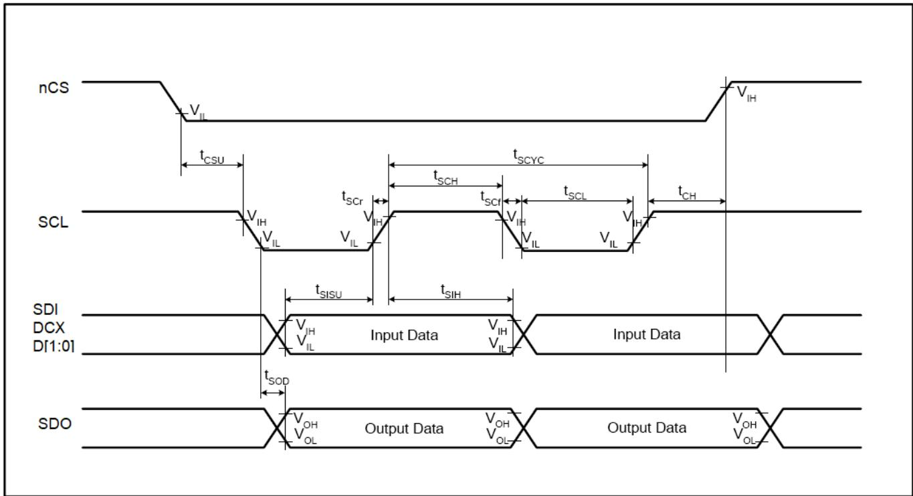

text_image

nCS
VIL
tCSU
SCL
VIH
VIL
tSCr
VIL
tSCYC
tSCH
tSCr
VIL
tSCL
VIL
tCH
SDI
DCX
D[1:0]
Input Data
VIH
VIL
tSIH
Input Data
SDO
tSOD
VOH
VOL
Output Data
VOH
VOL
Output Data
VOH
VOL

<table><tr><td rowspan="2">Parameter</td><td rowspan="2">Symbol</td><td rowspan="2">Conditions</td><td colspan="3">Specification</td><td rowspan="2">Unit</td><td rowspan="2">Notes</td></tr><tr><td>MIN</td><td>TYP</td><td>MAX</td></tr><tr><td rowspan="8">SCL</td><td> $T_{SCYC}$ </td><td>Clock cycle (Write)</td><td>20</td><td>-</td><td>-</td><td>ns</td><td></td></tr><tr><td> $T_{SCYC}$ </td><td>Clock cycle (Read)</td><td>100</td><td></td><td>-</td><td>ns</td><td></td></tr><tr><td> $T_{SCH}$ </td><td>Clock “H” pulse width (Write)</td><td>6.5</td><td>-</td><td>-</td><td>ns</td><td></td></tr><tr><td> $T_{SCH}$ </td><td>Clock “H” pulse width (Read)</td><td>45</td><td>-</td><td>-</td><td>ns</td><td></td></tr><tr><td> $T_{SCL}$ </td><td>Clock “L” pulse width (Write)</td><td>6.5</td><td>-</td><td>-</td><td>ns</td><td></td></tr><tr><td> $T_{SCL}$ </td><td>Clock “L” pulse width (Read)</td><td>45</td><td>-</td><td>-</td><td>ns</td><td></td></tr><tr><td> $T_{Scr}$ </td><td>Clock rise time</td><td>-</td><td>-</td><td>3.5</td><td>ns</td><td></td></tr><tr><td> $T_{Scf}$ </td><td>Clock fall time</td><td>-</td><td>-</td><td>3.5</td><td>ns</td><td></td></tr><tr><td rowspan="2">CSX</td><td> $T_{CSU}$ </td><td>Chip select setup time</td><td>10</td><td>-</td><td>-</td><td>ns</td><td></td></tr><tr><td> $T_{CH}$ </td><td>Chip select hold time</td><td>10</td><td>-</td><td>-</td><td>ns</td><td></td></tr><tr><td rowspan="2">SDIDCX D[1:0]</td><td> $T_{SISU}$ </td><td>Data input setup time</td><td>4</td><td>-</td><td>-</td><td>ns</td><td></td></tr><tr><td> $T_{SIH}$ </td><td>Data input hold time</td><td>4</td><td>-</td><td>-</td><td>ns</td><td></td></tr><tr><td rowspan="2">SDO</td><td> $T_{SOD}$ </td><td>Data output setup time</td><td>-</td><td>-</td><td>45</td><td>ns</td><td></td></tr><tr><td> $T_{SOH}$ </td><td>Data output hold time</td><td>5</td><td>-</td><td>-</td><td>ns</td><td></td></tr></table>

Note 1: Logic high and low levels are specified as 20% and 80% of VDDI for Input signals.  
Note 2: Ta = -30 to 85 °C, VDDI=1.65V to 3.3V, VCI=2.7V to 3.6V, GND=0V  
Note 3: The max SCL sequence of 4-wire QSPI transferring RGB888, RGB666 and RGB555 is 50Mhz.

# 6.4.3 Vertical Timings for DSI video mode

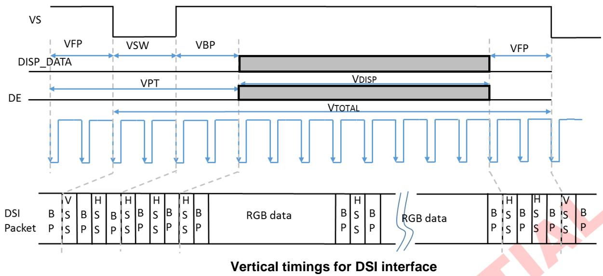

flowchart

```mermaid
graph LR
  VS["VS"] --> VFP["VFP"]
  VFP --> VSW["VSW"]
  VSW --> VBP["VBP"]
  VBP --> VDISP["VDISP"]
  VDISP --> VFP
  VFP -.->|"VPT"| DE["DE"]
  DE -.->|"VTOTAL"| VFP
  DE -.->|"VTotal"| DE
  DE -.->|"RGB data"| RGBData["RGB data"]
  RGBData -.->|"RGB data"| VFP
  RGBData -.->|"RGB data"| DE
```

Condition : Ta =25°C, Resolution = 454(RGB)\* 454

Vertical Timings List for DSI video mode

<table><tr><td rowspan="2">Parameter</td><td rowspan="2">Symbol</td><td rowspan="2">Conditions</td><td colspan="3">Specification</td><td rowspan="2">Unit</td><td rowspan="2">Notes</td></tr><tr><td>MIN</td><td>TYP</td><td>MAX</td></tr><tr><td>Vertical Total</td><td> $V_{TOTAL}$ </td><td></td><td></td><td>TBD</td><td></td><td>Line</td><td></td></tr><tr><td>Vertical low pulse width</td><td>VSW</td><td></td><td></td><td>TBD</td><td></td><td>Line</td><td>1</td></tr><tr><td>Vertical front porch</td><td>VFP</td><td></td><td></td><td>TBD</td><td></td><td>Line</td><td></td></tr><tr><td>Vertical back porch</td><td>VBP</td><td></td><td></td><td>TBD</td><td></td><td>Line</td><td>1</td></tr><tr><td>Vertical data start point</td><td></td><td>VSW+VBP</td><td></td><td>TBD</td><td></td><td>Line</td><td>1</td></tr><tr><td>Vertical blanking period</td><td>VPT</td><td>VSW+VBP+VFP</td><td></td><td>TBD</td><td></td><td>Line</td><td></td></tr><tr><td>Vertical active area</td><td> $V_{DISP}$ </td><td></td><td></td><td>454</td><td></td><td>Line</td><td></td></tr><tr><td>Vertical Frame rate</td><td>VFR</td><td></td><td></td><td>60</td><td></td><td>Hz</td><td></td></tr></table>

Note 1: The VSW and VBP pulse width are related to GOA timing. The GOA timing must be set at corresponding position for normal display.

# 6.4.4 Horizontal Timings for DSI video mode

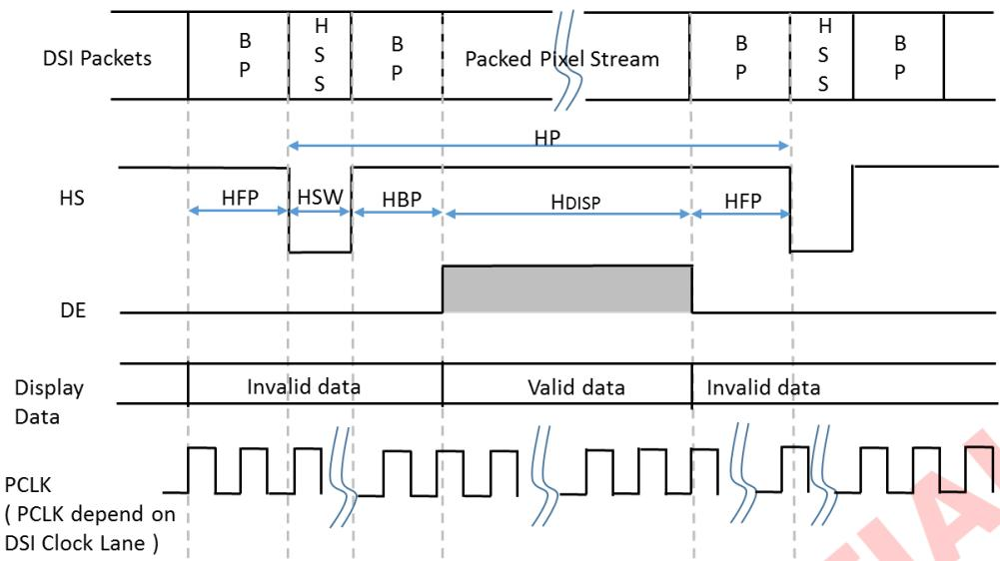

flowchart

```mermaid
graph LR
  subgraph DSI_Packets
  A["DSI Packets"] --> B["B"]
  B --> C["H"]
  C --> D["S"]
  D --> E["B"]
  E --> F["P"]
  F --> G["Packed Pixel Stream"]
  G --> H["B"]
  H --> I["H"]
  I --> J["S"]
  J --> K["B"]
  end

  subgraph HS
  L["HS"] --> M["HFP"]
  M --> N["HSW"]
  N --> O["HBP"]
  O --> P["HDISP"]
  P --> Q["HFP"]
  end

  subgraph DE
  R["DE"] --> S["Display Data"]
  S --> T["Invalid data"]
  T --> U["Valid data"]
  U --> V["Invalid data"]
  end

  subgraph Display_Data
  W["PCLK"] --> X["PCLK (PCLK depend on DSI Clock Lane)"]
  end
```

Horizontal timings for DSI video mode

Condition : Ta =25°C, Resolution = 454(RGB)\* 454

Horizontal Timings List for DSI video mode

<table><tr><td rowspan="2">Parameter</td><td rowspan="2">Symbol</td><td rowspan="2">Conditions</td><td colspan="3">Specification</td><td rowspan="2">Unit</td><td rowspan="2">Notes</td></tr><tr><td>MIN</td><td>TYP</td><td>MAX</td></tr><tr><td>HS low pulse width</td><td>HSW</td><td></td><td></td><td>TBD</td><td></td><td>nS</td><td></td></tr><tr><td>Horizontal back porch</td><td>HBP</td><td></td><td></td><td>TBD</td><td></td><td>nS</td><td></td></tr><tr><td>Horizontal front porch</td><td>HFP</td><td></td><td></td><td>TBD</td><td></td><td>nS</td><td></td></tr><tr><td>Horizontal data start point</td><td></td><td>HSW+HBP</td><td></td><td>TBD</td><td></td><td>nS</td><td></td></tr><tr><td>Horizontal blanking period</td><td>HBLK</td><td>HSW+HBP+HFP</td><td></td><td>TBD</td><td></td><td>nS</td><td></td></tr><tr><td>Horizontal active area</td><td>HDISP</td><td></td><td></td><td>454</td><td></td><td>DCLK</td><td></td></tr></table>

# 6.5 MIPI AC Characteristics

# 6.5.1 High Speed Mode - Clock Timings

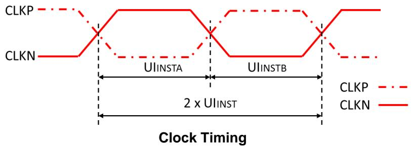

line

| Time Interval | CLKP (Dashed) | CLKN (Solid) |
| --- | --- | --- |
| Initial Phase | High | Low |
| UIINSTA | Low | High |
| UIINSTB | High | Low |
| Final Phase | Low | High |

High Speed Mode - Clock Timing

<table><tr><td rowspan="2">Signal</td><td rowspan="2">Symbol</td><td rowspan="2">Parameter</td><td colspan="3">Specification</td><td rowspan="2">Unit</td><td rowspan="2">Notes</td></tr><tr><td>MIN</td><td>TYP</td><td>MAX</td></tr><tr><td>CLK P/N</td><td> $2xUI_{INST}$ </td><td>Double UI instantaneous</td><td>4</td><td></td><td>25</td><td>nS</td><td></td></tr><tr><td>CLK P/N</td><td> $UI_{INSTA}, UI_{INSTB}$ </td><td>UI instantaneous Half</td><td>2</td><td></td><td>12.5</td><td>nS</td><td>1</td></tr></table>

Note 1: UI = UIINSTA = UIINSTB.

# 6.5.2 High Speed Mode - Clock / Data Timings

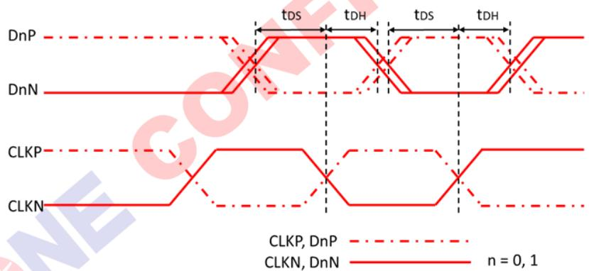

wireframe

| Signal | Description |
| --- | --- |
| DnP | DnP signal (dashed line) |
| DnN | DnN signal (solid line) |
| CLKP | CLKP signal (dotted line) |
| CLKN | CLKN signal (solid line) |

DSI Clock / Data Timings

High Speed Mode - Clock / Data Timing

<table><tr><td rowspan="2">Signal</td><td rowspan="2">Symbol</td><td rowspan="2">Parameter</td><td colspan="3">Specification</td><td rowspan="2">Unit</td><td rowspan="2">Notes</td></tr><tr><td>MIN</td><td>TYP</td><td>MAX</td></tr><tr><td rowspan="2">Dn P/N(n=0, and1)</td><td>tDS</td><td>Data to Clock Setup time</td><td>0.15*UI</td><td></td><td></td><td>UI</td><td></td></tr><tr><td>tDH</td><td>Clock to Data Hold time</td><td>0.15*UI</td><td></td><td></td><td>UI</td><td></td></tr></table>

# 6.5.3 High Speed Mode - Rising and Falling Timings

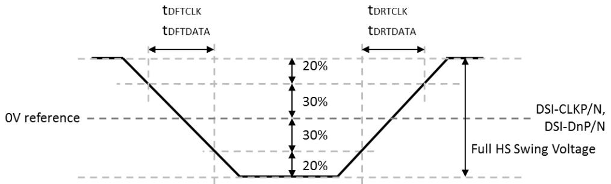

line

| Time Interval | Delay (%) |
| --- | --- |
| tDFTCLK to tDFTDATA | 20% |
| tDFTDATA to tDRTDATA | 30% |
| tDRTDATA to Full HS Swing Voltage | 20% |

Figure 6-2 Rising and Falling Timings

High Speed Mode - Rising and Falling Timing

<table><tr><td rowspan="2">Parameter</td><td rowspan="2">Symbol</td><td rowspan="2">Conditions</td><td colspan="3">Specification</td><td rowspan="2">Unit</td><td rowspan="2">Notes</td></tr><tr><td>MIN</td><td>TYP</td><td>MAX</td></tr><tr><td>Differential Rise Time for Clock</td><td> $t_{DRTCLK}$ </td><td>CLKP/N</td><td>150pS</td><td></td><td>0.3*UI</td><td></td><td>2,3</td></tr><tr><td>Differential Rise Time for Data</td><td> $t_{DRTDATA}$ </td><td>DnP/N</td><td>150pS</td><td></td><td>0.3*UI</td><td></td><td>1,2,3</td></tr><tr><td>Differential Fall Time for Clock</td><td> $t_{DFTCLK}$ </td><td>CLKP/N</td><td>150pS</td><td></td><td>0.3*UI</td><td></td><td>2,3</td></tr><tr><td>Differential Fall Time for Data</td><td> $t_{DFTDATA}$ </td><td>DnP/N</td><td>150pS</td><td></td><td>0.3*UI</td><td></td><td>1,2,3</td></tr></table>

Note 1: DnP/N, n = 0, and 1.  
Note 2: The display module has to meet timing requirements, which are defined for the transmitter (MCU) on MIPI D-PHY standard.  
Note 3: DSI-CLK+ = CLKP.  
DSI-CLK-=CLKN.  
DSI-D0+ =D0P.  
DSI-D0- =DON.

# 6.5.4 Low Speed Mode - Bus Turn Around

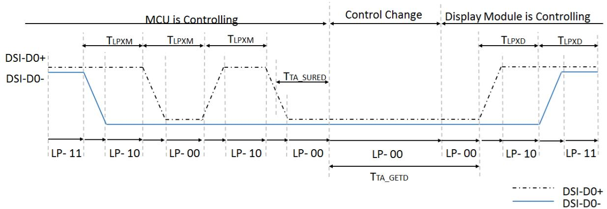

flowchart

This diagram illustrates the control logic of a MCU, showing how DSI-D0 and DSI-D0+ signals are controlled by specific time intervals (TLPXM, TTA_SURED, TTA_GETD) to trigger changes in the display module.

Bus Turnaround (BTA) from MCU to display module Timing

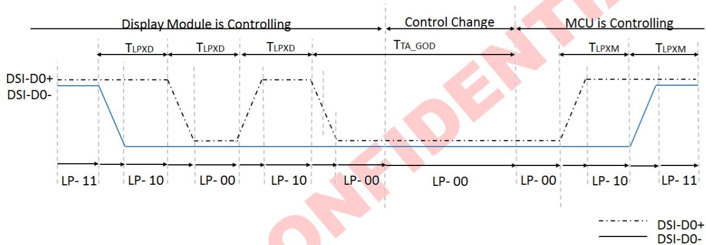

flowchart

This diagram illustrates the control logic of a Display Module, showing how DSI-D0 and DSI-D0+ signals transition between different states (DSI-D0-, DSI-D0+, TLPXD, TLPXD, TLPXD, TTA_GOD) across various LP- intervals.

Figure 6-3 Bus Turnaround (BTA) from Display module to MCU Timing

Low Speed Mode - Bus Turn Around Timing

<table><tr><td rowspan="2">Signal</td><td rowspan="2">Symbol</td><td rowspan="2">Parameter</td><td colspan="3">Specification</td><td rowspan="2">Unit</td><td rowspan="2">Notes</td></tr><tr><td>MIN</td><td>TYP</td><td>MAX</td></tr><tr><td>D0P/N</td><td> $T_{LPXM}$ </td><td>Length of LP-00,LP-01,LP-10 or LP11 periods MCU to Display Module</td><td>50</td><td></td><td>75</td><td>nS</td><td>1</td></tr><tr><td>D0P/N</td><td> $T_{LPXD}$ </td><td>Length of LP-00,LP-01,LP-10 or LP11 periods Display Module to MCU</td><td>50</td><td></td><td>75</td><td>nS</td><td>1</td></tr><tr><td>D0P/N</td><td> $T_{TA\_SURED}$ </td><td>Time-out before the Display Module starts driving</td><td> $T_{LPXD}$ </td><td></td><td>2*  $T_{LPXD}$ </td><td>nS</td><td>1</td></tr><tr><td>D0P/N</td><td> $T_{TA\_GETD}$ </td><td>Time to drive LP-00 by Display Module</td><td>5*  $T_{LPXD}$ </td><td></td><td></td><td>nS</td><td>1</td></tr><tr><td>D0P/N</td><td> $T_{TA\_GOD}$ </td><td>Time to drive LP-00 after turnaround request -MCU</td><td>4 *  $T_{LPXD}$ </td><td></td><td></td><td>nS</td><td>1</td></tr></table>

Note 1: D0P = DSI-D0+, D0N = DSI-D0-.

# 6.5.5 Data Lanes from Low Power Mode to High Speed Mode

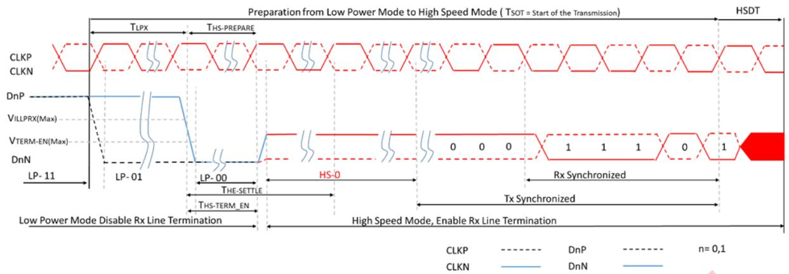

flowchart

```mermaid
graph LR
  subgraph LowPowerMode [Low Power Mode Disable Rx Line Termination]
  LP11["LP-11"] --> TLPX["TLPX"]
  TLPX --> THS_PREPARE["THS-PREPARE"]
  LP01["LP-01"] --> LP-00["LP-00"]
  LP00["LP-00"] --> THE_SETTLE["THE-SETTLE"]
  THE_SETTLE --> HS-0["HS-0"]
  HS0["HS-0"] --> Tx_Synchronized["Tx Synchronized"]
  Tx_Synchronized --> HSDT["HSDT"]
  end

  subgraph HighSpeedMode [High Speed Mode, Enable Rx Line Termination]
  HSDT --> HSDT
  end
```

Data Lanes from High Speed Mode to Low Power Mode Timing

Data Lanes from Low Power Mode to High Speed Mode Timing

<table><tr><td rowspan="2">Signal</td><td rowspan="2">Symbol</td><td rowspan="2">Parameter</td><td colspan="3">Specification</td><td rowspan="2">Unit</td><td rowspan="2">Notes</td></tr><tr><td>MIN</td><td>TYP</td><td>MAX</td></tr><tr><td>DnP/N</td><td> $T_{LPX}$ </td><td>Length of any Low Power State Period</td><td>50</td><td></td><td></td><td>nS</td><td>1</td></tr><tr><td>DnP/N</td><td> $T_{HS-PREPARE}$ </td><td>Time to drive LP-00 to prepare for HS Transmission</td><td>40+4*UI</td><td></td><td>85+6*UI</td><td>nS</td><td>1</td></tr><tr><td>DnP/N</td><td> $T_{HS-TREM-EN}$ </td><td>Time to enable Data lane Receiver line termination measured from when Dn crosses VILMAX</td><td></td><td></td><td>35+4*UI</td><td>nS</td><td>1</td></tr></table>

Note 1: DnP/N, n=0, and 1

# 6.5.6 Data Lanes from High Speed Mode to Low Power Mode

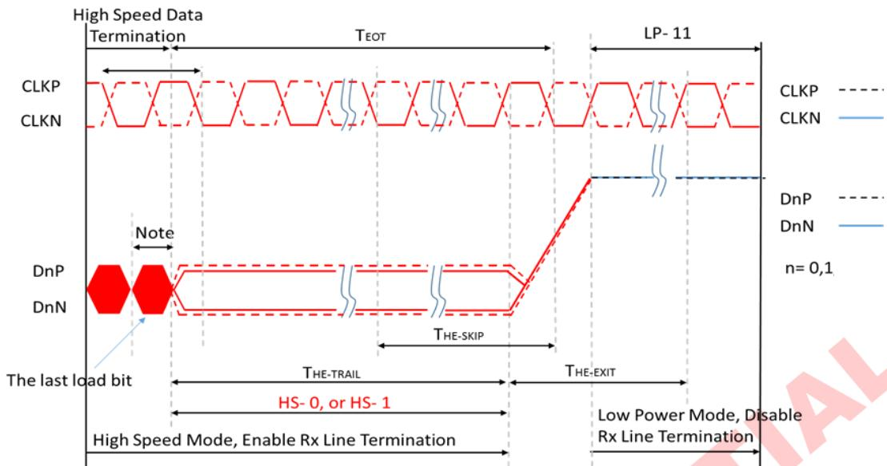

flowchart

```mermaid
graph LR
  subgraph High Speed Data
  A["High Speed Data Termination"] --> B["TETOT"]
  B --> C["LP-11"]
  end

  subgraph Power Mode
  D["DnP / DnN"] --> E["THE-TRAIL"]
  E --> F["HS-0, or HS-1"]
  F --> G["THE-SKIP"]
  G --> H["THE-EXIT"]
  H --> I["Low Power Mode, Disable Rx Line Termination"]
  end

  %% Signal Signals
  A -.->|"Note"| D
  D -.->|"The last load bit"| E
  E -.->|"THE-TRAIL"| F
  F -.->|"THE-SKIP"| G
  G -.->|"THE-EXIT"| H
  H -.->|"THE-EXIT"| I
```

Note:  
If the last load bit is HS- 0, the transmitter changes from HS- 0 to HS- 1.  
If the last load bit is HS- 1, the transmitter changes from HS- 1 to HS- 0

# Data Lanes from High Speed Mode to Low Power Mode Timing

Data Lanes from High Speed Mode to Low Power Mode Timing

<table><tr><td rowspan="2">Signal</td><td rowspan="2">Symbol</td><td rowspan="2">Parameter</td><td colspan="3">Specification</td><td rowspan="2">Unit</td><td rowspan="2">Notes</td></tr><tr><td>MIN</td><td>TYP</td><td>MAX</td></tr><tr><td>DnP/N</td><td> $T_{HS-SKIP}$ </td><td>Time-Out at Display Module to ignore transition period of EoT</td><td>40</td><td></td><td>55+4*UI</td><td>nS</td><td>1</td></tr><tr><td>DnP/N</td><td> $T_{HS-EXIT}$ </td><td>Time to drive LP-11 after HS burst</td><td>100</td><td></td><td></td><td>nS</td><td>1</td></tr></table>

Note 1: DnP/N, n=0, and 1.

# 6.5.7 DSI Clock Burst – High speed mode to /from Low Power Mode

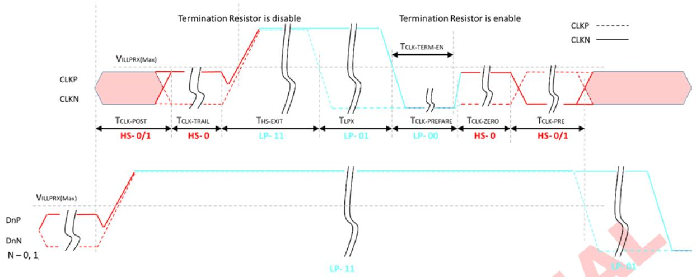

flowchart

```mermaid
graph LR
  subgraph Top_1 [Top Graph]
  CLKP --> VILLPRX(Max) --> TCLK-POST_HS-0/1
  CLKP --> VILLPRX(Max) --> TCLK-TRAIL_HS-0
  CLKP --> VILLPRX(Max) --> THS_EXIT_LP-11
  CLKP --> VILLPRX(Max) --> TLPX_LP-01
  CLKP --> VILLPRX(Max) --> TCLK-PREPARE_LP-00
  CLKP --> VILLPRX(Max) --> TCLK-ZERO_LP-0
  CLKP --> VILLPRX(Max) --> TCLK-PRE_LP-01
  CLKP --> CLKP --> CLKN --> CLKN
  end

  subgraph Bottom_2 [Bottom Graph]
  DnP --> VILLPRX(Max) --> LP-11
  DnP --> DnN --> LP11["LP-11"]
  CLKP --> CLKN --> CLKP --> CLKN
  end

  subgraph Phase_1 [Phase 1]
  CLKP --> TCLKPostHs01["TCLK-POST_HS-0/1"]
  CLKP --> TCLKTrailHs0["TCLK-TRAIL_HS-0"]
  CLKP --> THSExitLp11["THS_EXIT_LP-11"]
  CLKP --> THSExitLp01["THS_EXIT_LP-01"]
  CLKP --> TCLKPrepareLp00["TCLK-PREPARE_LP-00"]
  CLKP --> TCLKZeroLp0["TCLK-ZERO_LP-0"]
  CLKP --> TCLKPreLp01["TCLK-PRE_LP-01"]
  end
```

Clock Lane –High speed mode to / from Low Power Mode Timing

DSI Clock Burst – High speed mode to /from Low Power Mode Timing

<table><tr><td rowspan="2">Signal</td><td rowspan="2">Symbol</td><td rowspan="2">Parameter</td><td colspan="3">Specification</td><td rowspan="2">Unit</td><td rowspan="2">Notes</td></tr><tr><td>MIN</td><td>TYP</td><td>MAX</td></tr><tr><td>CKP/N</td><td> $T_{CLK-POST}$ </td><td>Time that the MCU shall continue sending HS clock after the last associated Data Lanes has transitioned to LP mode</td><td>60+52*UI</td><td></td><td></td><td>nS</td><td></td></tr><tr><td>CKP/N</td><td> $T_{CLK-TRAIL}$ </td><td>Time to drive HS differential state after last payload clock bit of a HS transmission burst</td><td>60</td><td></td><td></td><td>nS</td><td></td></tr><tr><td>CKP/N</td><td> $T_{HS-EXIT}$ </td><td>Time to drive LP-11 after HS burst</td><td>100</td><td></td><td></td><td>nS</td><td></td></tr><tr><td>CKP/N</td><td> $T_{CLK-PREPARE}$ </td><td>Time to drive LP-00 to prepare for HS transmission</td><td>38</td><td></td><td>95</td><td>nS</td><td></td></tr><tr><td>CKP/N</td><td> $T_{CLK-TERM-EN}$ </td><td>Time-out at Clock Lane to enable HS termination</td><td></td><td></td><td>38</td><td>nS</td><td></td></tr><tr><td>CKP/N</td><td> $T_{CLK-PREPARE+}$  $T_{CLK-ZERO}$ </td><td>Minimum lead HS-0 drive period before starting Clock</td><td>300</td><td></td><td></td><td>nS</td><td></td></tr><tr><td>CKP/N</td><td> $T_{CLK-PRE}$ </td><td>Time that the HS clock shall be driven prior to any associated Data Lane beginning the transition from LP to HS mode</td><td>8*UI</td><td></td><td></td><td>nS</td><td></td></tr></table>

# 6.6 Reset Input Timing

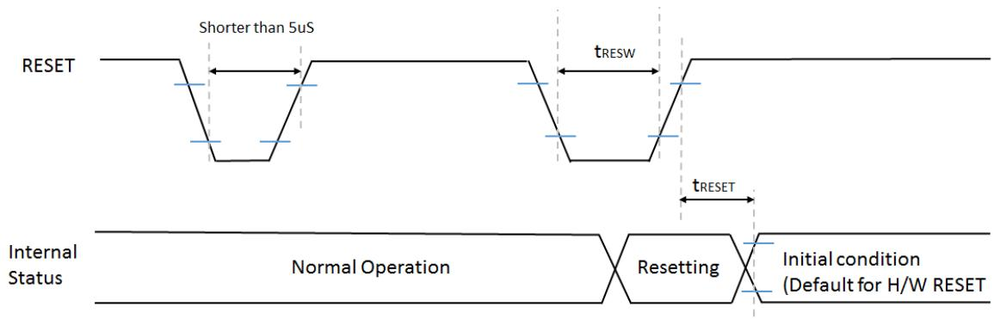

flowchart

```mermaid
graph LR
  subgraph Internal Status
  A["Normal Operation"] --> B["Resetting"]
  C["Initial condition\n(Default for H/W RESET)"] --> B
  end

  D["RESET"] --> E["Shorter than 5uS"]
  E --> F["tRESW"]
  F --> G["tRESET"]
```

Reset Input Timing  
Condition : Ta =25°C

Reset Input Timing

<table><tr><td rowspan="2">Signal</td><td rowspan="2">Symbol</td><td rowspan="2">Parameter</td><td rowspan="2">Description</td><td colspan="3">Specification</td><td rowspan="2">Unit</td><td rowspan="2">Notes</td></tr><tr><td>MIN</td><td>TYP</td><td>MAX</td></tr><tr><td rowspan="3">RESET</td><td>tRESW</td><td>Reset “L” pulse width</td><td></td><td>10</td><td></td><td></td><td>μS</td><td>1</td></tr><tr><td rowspan="2">tRESET</td><td rowspan="2">Reset complete time</td><td>When reset applied during Sleep in mode</td><td></td><td></td><td>5</td><td>mS</td><td>2</td></tr><tr><td>When reset applied during Sleep Out mode</td><td></td><td></td><td>120</td><td>mS</td><td>5</td></tr></table>

Note 1: Spike due to an electrostatic discharge on RESET line does not cause irregular system reset according to the table below.

Reset Input Actions

<table><tr><td>RESET Pulse</td><td>Action</td></tr><tr><td>Short than 5us</td><td>Reset Rejected</td></tr><tr><td>Long than 10μS</td><td>Reset</td></tr><tr><td>Between 5us and 10μS</td><td>Reset Start</td></tr></table>

Note 2: During the resetting period, the display will be blanked (The display is entering blanking sequence, which maximum time is 120ms, when Reset Starts in sleep out mode. The display remains the blank state in sleep in mode) and then return to Default condition for H/W RESET.  
Note3: During Reset Complete Time, values in OTP memory will be latched to internal register during this period. This loading is done every time when there is H/W RESET complete time(tRESET) within 5ms after a rising edge of RESET.  
Note4: Spike Rejection also applies during a valid reset pulse as shown below.

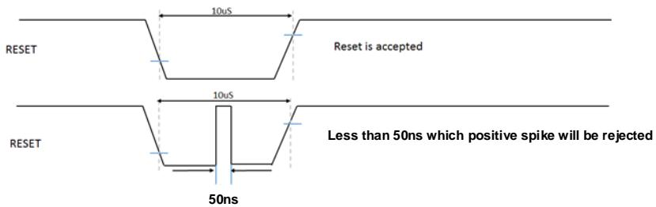

text_image

RESET
10uS
Reset is accepted
RESET
10uS
Less than 50ns which positive spike will be rejected
50ns

Note5: It is necessary to wait 5ms after releasing RESET before sending commands. Also Sleep Out command cannot be sent for 120msec.

# 7. Command

7.1 Command Table Switch Flow  
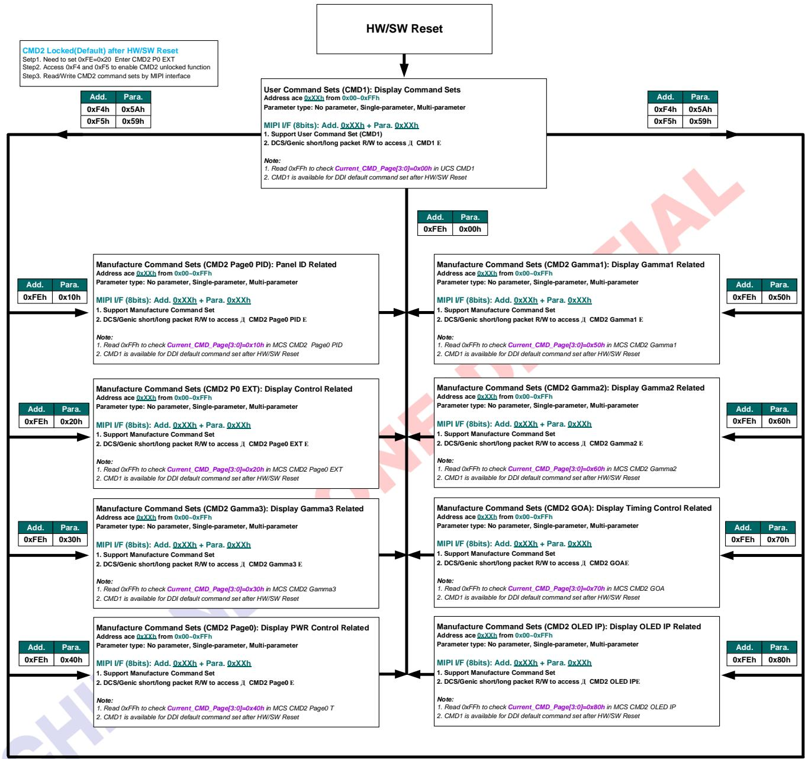

flowchart

This flowchart illustrates the hardware and system configuration process for a CMD2 (Computational Machine Interface) system, detailing how user command sets are stored in various configurations to access DDI default commands.

Figure shown Switching Flow for Accessing Registers in UCS / MCS by MIPI interface.

# Note:

1. After power on or HW/SW reset, the default page is in CMD1.  
2. After power on or HW/SW reset, CMD2 Register Pages are locked.  
Setp1. Need to set 0xFE=0x20 → Enter CMD2 P0 EXT  
Step2. Access 0xF4 and 0xF5 to enable CMD2 pages unlocked function  
Step3. Read/Write CMD2 page by MIPI interface

# 7.2 Pass Word Command Description in UCS (Command1)

# 7.2.1 PASSWD1

(CMD2, F4h)

<table><tr><td colspan="2">Command set</td><td colspan="9">PASSWD1</td></tr><tr><td>Inst / Para</td><td>W/R</td><td>D[7]</td><td>D[6]</td><td>D[5]</td><td>D[4]</td><td>D[3]</td><td>D[2]</td><td>D[1]</td><td>D[0]</td><td>Default Value</td></tr><tr><td>PASSWD1</td><td rowspan="2">W/R</td><td>1</td><td>1</td><td>1</td><td>1</td><td>0</td><td>1</td><td>0</td><td>0</td><td>F4h</td></tr><tr><td>Parameter 1</td><td colspan="8">PASSWORD1[7:0]</td><td>00h</td></tr></table>

(CMD2, F5h)

<table><tr><td colspan="2">Command set</td><td colspan="9">PASSWD1</td></tr><tr><td>Inst / Para</td><td>W/R</td><td>D[7]</td><td>D[6]</td><td>D[5]</td><td>D[4]</td><td>D[3]</td><td>D[2]</td><td>D[1]</td><td>D[0]</td><td>Default Value</td></tr><tr><td>PASSWD2</td><td rowspan="2">W/R</td><td>1</td><td>1</td><td>1</td><td>1</td><td>0</td><td>1</td><td>0</td><td>1</td><td>F5h</td></tr><tr><td>Parameter 1</td><td colspan="8">PASSWORD2[7:0]</td><td>00h</td></tr></table>

NOTE: “-“Don’t care.

<table><tr><td rowspan="7">Description</td><td colspan="4">This command is used to lock or unlock the User Command Sets in CMD2.- Enable CMD1(UCS) command lock/unlock Function (0xFE=0x80)Setp1. Set 0xFE=0x80 → enter CMD2 pageStep2. Access 0xF4 and 0xF5 to enable lock and unlock function</td></tr><tr><td>Address</td><td>Parameter</td><td>Value</td><td>Description</td></tr><tr><td rowspan="2">0xF4h</td><td rowspan="2">PASSWORD1[7:0]</td><td>00h(Default)</td><td>CMD1(UCS) Unlocked</td></tr><tr><td>ACh</td><td>CMD1(UCS) locked</td></tr><tr><td rowspan="2">0xF5h</td><td rowspan="2">PASSWORD2[7:0]</td><td>00h(Default)</td><td>CMD1(UCS) Unlocked</td></tr><tr><td>E1h</td><td>CMD1(UCS) locked</td></tr><tr><td colspan="4">Note:- Unlocked StatePASSWORD1 [7:0]: This register should be set to "00h" for writing / reading Command 1 registers.PASSWORD2 [7:0]: This register should be set to "00h" for writing / reading Command 1 registers.- Locked StatePASSWORD1 [7:0]: This register should be set to "ACh" for Command 1 registers locked.PASSWORD2 [7:0]: This register should be set to "E1h" for Command 1 registers locked.</td></tr><tr><td>Restriction</td><td colspan="4">- Must write password 1 first and password 2 last</td></tr><tr><td rowspan="7">Register Availability</td><td colspan="4"></td></tr><tr><td>Status</td><td colspan="3">Availability</td></tr><tr><td>Normal Mode On, Idle Mode Off, Sleep Out</td><td colspan="3">Yes</td></tr><tr><td>Normal Mode On, Idle Mode On, Sleep Out</td><td colspan="3">Yes</td></tr><tr><td>Partial Mode On, Idle Mode Off, Sleep Out</td><td colspan="3">Yes</td></tr><tr><td>Partial Mode On, Idle Mode On, Sleep Out</td><td colspan="3">Yes</td></tr><tr><td>Sleep In</td><td colspan="3">Yes</td></tr><tr><td rowspan="6">Default</td><td colspan="4"></td></tr><tr><td rowspan="2">Status</td><td colspan="3">Default Value</td></tr><tr><td>F4h</td><td colspan="2">F5h</td></tr><tr><td>Power On Sequence</td><td>00h</td><td colspan="2">00h</td></tr><tr><td>S/W Reset</td><td>00h</td><td colspan="2">00h</td></tr><tr><td>H/W Reset</td><td>00h</td><td colspan="2">00h</td></tr><tr><td>Flow Chart</td><td colspan="4"></td></tr></table>

# 7.3 Pass Word Command Description in MCS (Command2)

# 7.3.1 PASSWD2

(CMD2, F4h)

<table><tr><td colspan="2">Command set</td><td colspan="9">PASSWD2</td></tr><tr><td>Inst / Para</td><td>W/R</td><td>D[7]</td><td>D[6]</td><td>D[5]</td><td>D[4]</td><td>D[3]</td><td>D[2]</td><td>D[1]</td><td>D[0]</td><td>Default Value</td></tr><tr><td>PASSWD2</td><td rowspan="2">W/R</td><td>1</td><td>1</td><td>1</td><td>1</td><td>0</td><td>1</td><td>0</td><td>0</td><td>F4h</td></tr><tr><td>Parameter 1</td><td colspan="8">PASSWORD1[7:0]</td><td>5Ah</td></tr></table>

(CMD2, F5h)

<table><tr><td colspan="2">Command set</td><td colspan="9">PASSWD2</td></tr><tr><td>Inst / Para</td><td>W/R</td><td>D[7]</td><td>D[6]</td><td>D[5]</td><td>D[4]</td><td>D[3]</td><td>D[2]</td><td>D[1]</td><td>D[0]</td><td>Default Value</td></tr><tr><td>PASSWD2</td><td rowspan="2">W/R</td><td>1</td><td>1</td><td>1</td><td>1</td><td>0</td><td>1</td><td>0</td><td>1</td><td>F5h</td></tr><tr><td>Parameter 1</td><td colspan="8">PASSWORD2[7:0]</td><td>59h</td></tr></table>

NOTE: “-“Don’t care.

<table><tr><td rowspan="7">Description</td><td colspan="4">This command is used to lock or unlock the Manufacture Command Sets in CMD2.- Enable CMD2(MCS) command lock/unlock Function (0xFE=0x20)Setp1. Set 0xFE=0x20 → enter CMD2 pageStep2. Access 0xF4 and 0xF5 to enable lock and unlock function</td></tr><tr><td>Address</td><td>Parameter</td><td>Value</td><td>Description</td></tr><tr><td rowspan="2">0xF4h</td><td rowspan="2">PASSWORD1[7:0]</td><td>5A</td><td>CMD1(MCS) Unlocked</td></tr><tr><td>A5h(Default)</td><td>CMD1(UCS) locked</td></tr><tr><td rowspan="2">0xF5h</td><td rowspan="2">PASSWORD2[7:0]</td><td>59</td><td>CMD1(MCS) Unlocked</td></tr><tr><td>A5h(Default)</td><td>CMD1(UCS) locked</td></tr><tr><td colspan="4">Note:- Unlocked StatePASSWORD1 [7:0]: This register should be set to “5Ah” for writing / reading Command 1 registers.PASSWORD2 [7:0]: This register should be set to “59h” for writing / reading Command 1 registers.- Locked StatePASSWORD1 [7:0]: This register should be set to “A5h” for Command 2 registers locked.PASSWORD2 [7:0]: This register should be set to “A5h” for Command 2 registers locked.</td></tr><tr><td>Restriction</td><td colspan="4">- Must write password 1 first and password 2 last</td></tr><tr><td rowspan="7">Register Availability</td><td colspan="4"></td></tr><tr><td>Status</td><td colspan="3">Availability</td></tr><tr><td>Normal Mode On, Idle Mode Off, Sleep Out</td><td colspan="3">Yes</td></tr><tr><td>Normal Mode On, Idle Mode On, Sleep Out</td><td colspan="3">Yes</td></tr><tr><td>Partial Mode On, Idle Mode Off, Sleep Out</td><td colspan="3">Yes</td></tr><tr><td>Partial Mode On, Idle Mode On, Sleep Out</td><td colspan="3">Yes</td></tr><tr><td>Sleep In</td><td colspan="3">Yes</td></tr><tr><td rowspan="6">Default</td><td colspan="4"></td></tr><tr><td rowspan="2">Status</td><td colspan="3">Default Value</td></tr><tr><td>F4h</td><td colspan="2">F5h</td></tr><tr><td>Power On Sequence</td><td>A5h</td><td colspan="2">A5h</td></tr><tr><td>S/W Reset</td><td>A5h</td><td colspan="2">A5h</td></tr><tr><td>H/W Reset</td><td>A5h</td><td colspan="2">A5h</td></tr><tr><td>Flow Chart</td><td colspan="4"></td></tr></table>

7.4 Command List

<table><tr><td colspan="3">Command</td><td rowspan="2">W/R</td><td rowspan="2">Function</td><td rowspan="2">D7</td><td rowspan="2">D6</td><td rowspan="2">D5</td><td rowspan="2">D4</td><td rowspan="2">D3</td><td rowspan="2">D2</td><td rowspan="2">D1</td><td rowspan="2">D0</td><td rowspan="2">Default (hex)</td><td rowspan="2">MTP</td></tr><tr><td>Page</td><td>Add.</td><td>Para.</td></tr><tr><td>CMD1</td><td>00h</td><td>-</td><td>W</td><td>NOP</td><td colspan="8">No Argument</td><td>-</td><td>-</td></tr><tr><td>CMD1</td><td>01h</td><td>-</td><td>W</td><td>Software reset</td><td colspan="8">No Argument</td><td>-</td><td>-</td></tr><tr><td>CMD1</td><td>04h</td><td>1st</td><td rowspan="3">R</td><td rowspan="3">Read display identification information</td><td colspan="8">ID1[7:0]</td><td>33h</td><td>-</td></tr><tr><td>CMD1</td><td>04h</td><td>2nd</td><td colspan="8">ID2[7:0]</td><td>11h</td><td>-</td></tr><tr><td>CMD1</td><td>04h</td><td>3rd</td><td colspan="8">ID3[7:0]</td><td>00h</td><td>-</td></tr><tr><td>CMD1</td><td>05h</td><td>-</td><td>R</td><td>Read number of the errors on DSI</td><td colspan="8">P[7:0]</td><td>00h</td><td>-</td></tr><tr><td>CMD1</td><td>0Ah</td><td>1st</td><td>R</td><td>Read display power mode</td><td>BSTON</td><td>IDMON</td><td>PTLON</td><td>SLPOUT</td><td>NORON</td><td>DISPON</td><td>-</td><td>-</td><td>08h</td><td>-</td></tr><tr><td>CMD1</td><td>0Bh</td><td>1st</td><td>R</td><td>Read display MADCTR</td><td>MY</td><td>MX</td><td>-</td><td>-</td><td>RGB</td><td>-</td><td>-</td><td>-</td><td>00h</td><td>-</td></tr><tr><td>CMD1</td><td>0Ch</td><td>1st</td><td>R</td><td>Read display pixel format</td><td>SPI_IFPF_SEL</td><td colspan="3">VIPF[2:0]</td><td>-</td><td colspan="3">IFPF[2:0]</td><td>77h</td><td>-</td></tr><tr><td>CMD1</td><td>0Dh</td><td>1st</td><td>R</td><td>Read display image mode</td><td>0</td><td>0</td><td>INVON</td><td>ALLPON</td><td>ALLPOFF</td><td>0</td><td>0</td><td>0</td><td>00h</td><td>-</td></tr><tr><td>CMD1</td><td>0Eh</td><td>1st</td><td>R</td><td>Read display signal mode</td><td>TEON</td><td>M</td><td>0</td><td>0</td><td>0</td><td>0</td><td>0</td><td>ERR</td><td>00h</td><td>-</td></tr><tr><td>CMD1</td><td>0Fh</td><td>1st</td><td>R</td><td>Read display self-diagnostic result</td><td>0</td><td>0</td><td>0</td><td>0</td><td>0</td><td>0</td><td>0</td><td>checksum_comp</td><td>00h</td><td>-</td></tr><tr><td>CMD1</td><td>10h</td><td>-</td><td>W</td><td>Sleep-in</td><td colspan="8">No Argument</td><td>-</td><td>-</td></tr><tr><td>CMD1</td><td>11h</td><td>-</td><td>W</td><td>Sleep-out</td><td colspan="8">No Argument</td><td>-</td><td>-</td></tr><tr><td>CMD1</td><td>12h</td><td>-</td><td>W</td><td>Partial display mode on</td><td colspan="8">No Argument</td><td>-</td><td>-</td></tr><tr><td>CMD1</td><td>13h</td><td>-</td><td>W</td><td>Normal display mode on</td><td colspan="8">No Argument</td><td>-</td><td>-</td></tr><tr><td>CMD1</td><td>20h</td><td>-</td><td>W</td><td>Display inversion off</td><td colspan="8">No Argument</td><td>-</td><td>-</td></tr><tr><td>CMD1</td><td>21h</td><td>-</td><td>W</td><td>Display inversion on</td><td colspan="8">No Argument</td><td>-</td><td>-</td></tr><tr><td>CMD1</td><td>22h</td><td>-</td><td>W</td><td>All pixel off</td><td colspan="8">No Argument</td><td>-</td><td>-</td></tr><tr><td>CMD1</td><td>23h</td><td>-</td><td>W</td><td>All pixel on</td><td colspan="8">No Argument</td><td>-</td><td>-</td></tr><tr><td>CMD1</td><td>28h</td><td>-</td><td>W</td><td>Display off</td><td colspan="8">No Argument</td><td>-</td><td>-</td></tr><tr><td>CMD1</td><td>29h</td><td>-</td><td>W</td><td>Display on</td><td colspan="8">No Argument</td><td>-</td><td>-</td></tr><tr><td>CMD1</td><td rowspan="4">2Ah</td><td>1st</td><td rowspan="4">W/R</td><td rowspan="4">Set column start address</td><td colspan="6">-</td><td colspan="2">SC[9:8]</td><td>00h</td><td>-</td></tr><tr><td>CMD1</td><td>2nd</td><td colspan="8">SC[7:0]</td><td>00h</td><td>-</td></tr><tr><td>CMD1</td><td>3rd</td><td colspan="6">-</td><td colspan="2">EC[9:8]</td><td>01h</td><td>-</td></tr><tr><td>CMD1</td><td>4th</td><td colspan="8">EC[7:0]</td><td>C5h</td><td>-</td></tr><tr><td>CMD1</td><td rowspan="4">2Bh</td><td>1st</td><td rowspan="4">W/R</td><td rowspan="4">Set row start address</td><td colspan="6">-</td><td colspan="2">SP[9:8]</td><td>00h</td><td>-</td></tr><tr><td>CMD1</td><td>2nd</td><td colspan="8">SP[7:0]</td><td>00h</td><td>-</td></tr><tr><td>CMD1</td><td>3rd</td><td colspan="6">-</td><td colspan="2">EP[9:8]</td><td>01h</td><td>-</td></tr><tr><td>CMD1</td><td>4th</td><td colspan="8">EP[7:0]</td><td>C5h</td><td>-</td></tr><tr><td>CMD1</td><td>2Ch</td><td>-</td><td>W</td><td>Memory Start Write</td><td colspan="8">No Argument</td><td>-</td><td>-</td></tr><tr><td>CMD1</td><td>2Eh</td><td>-</td><td>R</td><td>Memory Start Read</td><td colspan="8">No Argument</td><td>-</td><td>-</td></tr><tr><td>CMD1</td><td rowspan="3">30h</td><td>1st</td><td rowspan="3">W/R</td><td rowspan="3">Partial area</td><td colspan="6">-</td><td colspan="2">PSL[9:8]</td><td>00h</td><td>-</td></tr><tr><td>CMD1</td><td>2nd</td><td colspan="8">PSL[7:0]</td><td>00h</td><td>-</td></tr><tr><td>CMD1</td><td>3rd</td><td colspan="6">-</td><td colspan="2">PEL[9:8]</td><td>01h</td><td>-</td></tr><tr><td>CMD1</td><td></td><td>4th</td><td></td><td></td><td colspan="8">PEL[7:0]</td><td>C5h</td><td>-</td></tr><tr><td>CMD1</td><td rowspan="4">31h</td><td>1st</td><td rowspan="4">W/R</td><td rowspan="4">Vertical partial area</td><td colspan="5">-</td><td colspan="3">PSC[9:8]</td><td>00h</td><td>-</td></tr><tr><td>CMD1</td><td>2nd</td><td colspan="8">PSC[7:0]</td><td>00h</td><td>-</td></tr><tr><td>CMD1</td><td>3rd</td><td colspan="5">-</td><td colspan="3">PEC[9:8]</td><td>01h</td><td>-</td></tr><tr><td>CMD1</td><td>4th</td><td colspan="8">PEC[7:0]</td><td>C5h</td><td>-</td></tr><tr><td>CMD1</td><td>34h</td><td>-</td><td>W</td><td>Tearing effect line off</td><td colspan="8">No Argument</td><td>-</td><td>-</td></tr><tr><td>CMD1</td><td>35h</td><td>1st</td><td>W</td><td>Tearing effect line on</td><td colspan="7">-</td><td>M</td><td>00h</td><td>-</td></tr><tr><td>CMD1</td><td>36h</td><td>1st</td><td>W</td><td>Scan direction control</td><td>MY</td><td>MX</td><td>-</td><td>-</td><td>RGB</td><td>-</td><td>-</td><td>-</td><td>00h</td><td>-</td></tr><tr><td>CMD1</td><td>38h</td><td>-</td><td>W</td><td>Idle mode off</td><td colspan="8">No Argument</td><td>-</td><td>-</td></tr><tr><td>CMD1</td><td>39h</td><td>-</td><td>W</td><td>Enter idle mode</td><td colspan="8">No Argument</td><td>-</td><td>-</td></tr><tr><td>CMD1</td><td>3Ah</td><td>1st</td><td>W</td><td>Interface Pixel Format</td><td>SPI_IFPF_SEL</td><td colspan="3">VIPF[2:0]</td><td>0</td><td colspan="3">IFPF[2:0]</td><td>77h</td><td>-</td></tr><tr><td>CMD1</td><td>3Ch</td><td>-</td><td>W</td><td>Memory Continuous Write</td><td colspan="8">No Argument</td><td>-</td><td>-</td></tr><tr><td>CMD1</td><td>3Eh</td><td>-</td><td>R</td><td>Memory Continuous Read</td><td colspan="8">No Argument</td><td>-</td><td>-</td></tr><tr><td>CMD1</td><td rowspan="2">44h</td><td>1st</td><td>W/R</td><td rowspan="2">Set tear scan-line</td><td colspan="8">N[15:8]</td><td>00h</td><td>-</td></tr><tr><td>CMD1</td><td>2nd</td><td>W</td><td colspan="8">N[7:0]</td><td>00h</td><td>-</td></tr><tr><td>CMD1</td><td rowspan="2">45h</td><td>1st</td><td rowspan="2">R</td><td rowspan="2">Get scan line</td><td colspan="8">N[15:8]</td><td>00h</td><td>-</td></tr><tr><td>CMD1</td><td>2nd</td><td colspan="8">N[7:0]</td><td>00h</td><td>-</td></tr><tr><td>CMD1</td><td>4Fh</td><td>1st</td><td>W</td><td>Deep standby</td><td>0</td><td>0</td><td>0</td><td>0</td><td>0</td><td>0</td><td>0</td><td>DSTB</td><td>00h</td><td>-</td></tr><tr><td>CMD1</td><td>51h</td><td>1st</td><td>W</td><td>Write display brightness</td><td colspan="8">DBV[7:0]</td><td>00h</td><td>-</td></tr><tr><td>CMD1</td><td>52h</td><td>1st</td><td>R</td><td>Read display brightness</td><td colspan="8">DBV[7:0]</td><td>00h</td><td>-</td></tr><tr><td>CMD1</td><td>53h</td><td>1st</td><td>W</td><td>Write CTRL display</td><td>0</td><td>0</td><td>BC_EN</td><td>0</td><td>DIM_EN</td><td>0</td><td>0</td><td>0</td><td>28h</td><td>-</td></tr><tr><td>CMD1</td><td>54h</td><td>1st</td><td>R</td><td>Read CTRL display</td><td>0</td><td>0</td><td>BC_EN</td><td>0</td><td>DIM_EN</td><td>0</td><td>0</td><td>0</td><td>28h</td><td>-</td></tr><tr><td>CMD1</td><td>55h</td><td>1st</td><td>W</td><td>Write ACL function</td><td>0</td><td>0</td><td>0</td><td>0</td><td>0</td><td>0</td><td colspan="2">ACL[1:0]</td><td>00h</td><td></td></tr><tr><td>CMD1</td><td>56h</td><td>1st</td><td>R</td><td>Read ACL function</td><td>0</td><td>0</td><td>0</td><td>0</td><td>0</td><td>0</td><td colspan="2">ACL[1:0]</td><td>00h</td><td></td></tr><tr><td>CMD1</td><td>58h</td><td>1st</td><td>W</td><td>Set color enhancement</td><td>0</td><td>0</td><td>0</td><td>0</td><td>0</td><td>SLR_EN</td><td colspan="2">SLR_LEVEL[1:0]</td><td>00h</td><td>-</td></tr><tr><td>CMD1</td><td>59h</td><td>1st</td><td>R</td><td>Read color enhancement</td><td>0</td><td>0</td><td>0</td><td>0</td><td>0</td><td>SLR_EN</td><td colspan="2">SLR_LEVEL[1:0]</td><td>00h</td><td>-</td></tr><tr><td>CMD1</td><td>5Fh</td><td>1st</td><td>R/W</td><td>Read Loac1 HBM</td><td>-</td><td>-</td><td>-</td><td>-</td><td>-</td><td>-</td><td>-</td><td>Local_hbm_en</td><td>40h</td><td></td></tr><tr><td>CMD1</td><td>60h</td><td>1st</td><td>R/W</td><td>Dynamic Frame rate control</td><td>-</td><td colspan="3">normal_level[2:0]</td><td>-</td><td>-</td><td colspan="2">idle_level[1:0]</td><td>00h</td><td></td></tr><tr><td>CMD1</td><td>61h</td><td>1st</td><td>R/W</td><td>Enable Dynamic Frame rate</td><td>-</td><td>-</td><td>-</td><td>-</td><td>-</td><td>-</td><td>dynf_en_B</td><td>dynf_en_A</td><td>00h</td><td></td></tr><tr><td>CMD1</td><td>63h</td><td>1st</td><td>W</td><td>Write HBM display brightness</td><td colspan="8">DBV_HBM[7:0]</td><td>00h</td><td></td></tr><tr><td>CMD1</td><td>64h</td><td>1st</td><td>R</td><td>Read HBM display brightness</td><td colspan="8">DBV_HBM[7:0]</td><td>00h</td><td></td></tr><tr><td>CMD1</td><td>66h</td><td>1st</td><td>W</td><td>HBM enable</td><td>-</td><td>-</td><td>-</td><td>-</td><td>-</td><td>-</td><td>HBM_EN</td><td>-</td><td>00h</td><td></td></tr><tr><td>CMD1</td><td rowspan="4">70h</td><td>1st</td><td rowspan="4">W/R</td><td>COLSET</td><td colspan="8">R_0000[7:0]</td><td>00h</td><td></td></tr><tr><td></td><td></td><td></td><td colspan="8"></td><td></td><td></td></tr><tr><td>CMD1</td><td>2nd</td><td>COLSET</td><td colspan="8">G_0000[7:0]</td><td>00h</td><td></td></tr><tr><td>CMD1</td><td>3rd</td><td>COLSET</td><td colspan="8">B_0000[7:0]</td><td>00h</td><td></td></tr><tr><td>CMD1</td><td rowspan="3">71h</td><td>1st</td><td rowspan="3">W/R</td><td>COLSET</td><td colspan="8">R_0001[7:0]</td><td>00h</td><td></td></tr><tr><td>CMD1</td><td>2nd</td><td>COLSET</td><td colspan="8">G_0001[7:0]</td><td>00h</td><td></td></tr><tr><td>CMD1</td><td>3rd</td><td>COLSET</td><td colspan="8">B_0001[7:0]</td><td>FFh</td><td></td></tr><tr><td>CMD1</td><td rowspan="2">72h</td><td>1st</td><td rowspan="2">W/R</td><td>COLSET</td><td colspan="8">R_0010[7:0]</td><td>00h</td><td></td></tr><tr><td>CMD1</td><td>2nd</td><td>COLSET</td><td colspan="8">G_0010[7:0]</td><td>FFh</td><td></td></tr><tr><td>CMD1</td><td></td><td>3rd</td><td></td><td>COLSET</td><td colspan="5">B_0010[7:0]</td><td>00h</td><td colspan="4"></td></tr><tr><td>CMD1</td><td rowspan="3">73h</td><td>1st</td><td rowspan="3">W/R</td><td>COLSET</td><td colspan="5">R_0011[7:0]</td><td>00h</td><td colspan="4"></td></tr><tr><td>CMD1</td><td>2nd</td><td>COLSET</td><td colspan="5">G_0011[7:0]</td><td>FFh</td><td colspan="4"></td></tr><tr><td>CMD1</td><td>3rd</td><td>COLSET</td><td colspan="5">B_0011[7:0]</td><td>FFh</td><td colspan="4"></td></tr><tr><td>CMD1</td><td rowspan="3">74h</td><td>1st</td><td rowspan="3">W/R</td><td>COLSET</td><td colspan="5">R_0100[7:0]</td><td>FFh</td><td colspan="4"></td></tr><tr><td>CMD1</td><td>2nd</td><td>COLSET</td><td colspan="5">G_0100[7:0]</td><td>00h</td><td colspan="4"></td></tr><tr><td>CMD1</td><td>3rd</td><td>COLSET</td><td colspan="5">B_0100[7:0]</td><td>00h</td><td colspan="4"></td></tr><tr><td>CMD1</td><td rowspan="3">75h</td><td>1st</td><td rowspan="3">W/R</td><td>COLSET</td><td colspan="5">R_0101[7:0]</td><td>FFh</td><td colspan="4"></td></tr><tr><td>CMD1</td><td>2nd</td><td>COLSET</td><td colspan="5">G_0101[7:0]</td><td>00h</td><td colspan="4"></td></tr><tr><td>CMD1</td><td>3rd</td><td>COLSET</td><td colspan="5">B_0101[7:0]</td><td>FFh</td><td colspan="4"></td></tr><tr><td>CMD1</td><td rowspan="3">76h</td><td>1st</td><td rowspan="3">W/R</td><td>COLSET</td><td colspan="5">R_0110[7:0]</td><td>FFh</td><td colspan="4"></td></tr><tr><td>CMD1</td><td>2nd</td><td>COLSET</td><td colspan="5">G_0110[7:0]</td><td>FFh</td><td colspan="4"></td></tr><tr><td>CMD1</td><td>3rd</td><td>COLSET</td><td colspan="5">B_0110[7:0]</td><td>00h</td><td colspan="4"></td></tr><tr><td>CMD1</td><td rowspan="3">77h</td><td>1st</td><td rowspan="3">W/R</td><td>COLSET</td><td colspan="5">R_0111[7:0]</td><td>FFh</td><td colspan="4"></td></tr><tr><td>CMD1</td><td>2nd</td><td>COLSET</td><td colspan="5">G_0111[7:0]</td><td>FFh</td><td colspan="4"></td></tr><tr><td>CMD1</td><td>3rd</td><td>COLSET</td><td colspan="5">B_0111[7:0]</td><td>FFh</td><td colspan="4"></td></tr><tr><td>CMD1</td><td rowspan="3">78h</td><td>1st</td><td rowspan="3">W/R</td><td>COLSET</td><td colspan="5">R_1000[7:0]</td><td>00h</td><td colspan="4"></td></tr><tr><td>CMD1</td><td>2nd</td><td>COLSET</td><td colspan="5">G_1000[7:0]</td><td>00h</td><td colspan="4"></td></tr><tr><td>CMD1</td><td>3rd</td><td>COLSET</td><td colspan="5">B_1000[7:0]</td><td>00h</td><td colspan="4"></td></tr><tr><td>CMD1</td><td rowspan="3">79h</td><td>1st</td><td rowspan="3">W/R</td><td>COLSET</td><td colspan="5">R_1001[7:0]</td><td>00h</td><td colspan="4"></td></tr><tr><td>CMD1</td><td>2nd</td><td>COLSET</td><td colspan="5">G_1001[7:0]</td><td>00h</td><td colspan="4"></td></tr><tr><td>CMD1</td><td>3rd</td><td>COLSET</td><td colspan="5">B_1001[7:0]</td><td>FFh</td><td colspan="4"></td></tr><tr><td>CMD1</td><td rowspan="3">7Ah</td><td>1st</td><td rowspan="3">W/R</td><td>COLSET</td><td colspan="5">R_1010[7:0]</td><td>00h</td><td colspan="4"></td></tr><tr><td>CMD1</td><td>2nd</td><td>COLSET</td><td colspan="5">G_1010[7:0]</td><td>FFh</td><td colspan="4"></td></tr><tr><td>CMD1</td><td>3rd</td><td>COLSET</td><td colspan="5">B_1010[7:0]</td><td>00h</td><td colspan="4"></td></tr><tr><td>CMD1</td><td rowspan="3">7Bh</td><td>1st</td><td rowspan="3">W/R</td><td>COLSET</td><td colspan="5">R_1011[7:0]</td><td>00h</td><td colspan="4"></td></tr><tr><td>CMD1</td><td>2nd</td><td>COLSET</td><td colspan="5">G_1011[7:0]</td><td>FFh</td><td colspan="4"></td></tr><tr><td>CMD1</td><td>3rd</td><td>COLSET</td><td colspan="5">B_1011[7:0]</td><td>FFh</td><td colspan="4"></td></tr><tr><td>CMD1</td><td rowspan="3">7Ch</td><td>1st</td><td rowspan="3">W/R</td><td>COLSET</td><td colspan="5">R_1100[7:0]</td><td>FFh</td><td colspan="4"></td></tr><tr><td>CMD1</td><td>2nd</td><td>COLSET</td><td colspan="5">G_1100[7:0]</td><td>00h</td><td colspan="4"></td></tr><tr><td>CMD1</td><td>3rd</td><td>COLSET</td><td colspan="5">B_1100[7:0]</td><td>00h</td><td colspan="4"></td></tr><tr><td>CMD1</td><td rowspan="3">7Dh</td><td>1st</td><td rowspan="3">W/R</td><td>COLSET</td><td colspan="5">R_1101[7:0]</td><td>FFh</td><td colspan="4"></td></tr><tr><td>CMD1</td><td>2nd</td><td>COLSET</td><td colspan="5">G_1101[7:0]</td><td>00h</td><td colspan="4"></td></tr><tr><td>CMD1</td><td>3rd</td><td>COLSET</td><td colspan="5">B_1101[7:0]</td><td>FFh</td><td colspan="4"></td></tr><tr><td>CMD1</td><td rowspan="3">7Eh</td><td>1st</td><td rowspan="3">W/R</td><td>COLSET</td><td colspan="5">R_1110[7:0]</td><td>FFh</td><td colspan="4"></td></tr><tr><td>CMD1</td><td>2nd</td><td>COLSET</td><td colspan="5">G_1110[7:0]</td><td>FFh</td><td colspan="4"></td></tr><tr><td>CMD1</td><td>3rd</td><td>COLSET</td><td colspan="5">B_1110[7:0]</td><td>00h</td><td colspan="4"></td></tr><tr><td>CMD1</td><td rowspan="3">7Fh</td><td>1st</td><td rowspan="3">W/R</td><td>COLSET</td><td colspan="5">R_1111[7:0]</td><td>FFh</td><td colspan="4"></td></tr><tr><td>CMD1</td><td>2nd</td><td>COLSET</td><td colspan="5">G_1111[7:0]</td><td>FFh</td><td colspan="4"></td></tr><tr><td>CMD1</td><td>3rd</td><td>COLSET</td><td colspan="5">B_1111[7:0]</td><td>FFh</td><td colspan="4"></td></tr><tr><td>CMD1</td><td>80h</td><td>1st</td><td>W</td><td>GRAY256_COLOR</td><td>-</td><td>RGB111_opt</td><td>-</td><td>-</td><td>RGB4bit_en</td><td>Gray256_color[2:0]</td><td colspan="4">07h</td></tr><tr><td>CMD1</td><td>A1h</td><td>1st</td><td>R</td><td>Read DDB</td><td colspan="6">SID[7:0]</td><td colspan="4">33h</td></tr></table>

<table><tr><td>CMD1</td><td rowspan="4"></td><td>2nd</td><td rowspan="4"></td><td rowspan="4"></td><td colspan="8">SID[15:8]</td><td>10h</td><td>-</td></tr><tr><td>CMD1</td><td>3rd</td><td colspan="8">MID[7:0]</td><td>00h</td><td>-</td></tr><tr><td>CMD1</td><td>4th</td><td colspan="8">MID[15:8]</td><td>00h</td><td>-</td></tr><tr><td>CMD1</td><td>5th</td><td>1</td><td>1</td><td>1</td><td>1</td><td>1</td><td>1</td><td>1</td><td>1</td><td>FFh</td><td>-</td></tr><tr><td>CMD1</td><td rowspan="5">A8h</td><td>1st</td><td rowspan="5">R</td><td rowspan="5">Read DDB Continuous</td><td colspan="8">SID[7:0]</td><td>33h</td><td>-</td></tr><tr><td>CMD1</td><td>2nd</td><td colspan="8">SID[15:8]</td><td>10h</td><td>-</td></tr><tr><td>CMD1</td><td>3rd</td><td colspan="8">MID[7:0]</td><td>00h</td><td>-</td></tr><tr><td>CMD1</td><td>4th</td><td colspan="8">MID[15:8]</td><td>00h</td><td>-</td></tr><tr><td>CMD1</td><td>5th</td><td>1.0</td><td>1.0</td><td>1.0</td><td>1.0</td><td>1.0</td><td>1.0</td><td>1.0</td><td>1.0</td><td>FFh</td><td>-</td></tr><tr><td>CMD1</td><td>AAh</td><td>1st</td><td>R</td><td>Read first checksum</td><td colspan="8">FCS[7:0]</td><td>00h</td><td>-</td></tr><tr><td>CMD1</td><td>AFh</td><td>1st</td><td>R</td><td>Read continuous checksum</td><td colspan="8">CCS[7:0]</td><td>00h</td><td>-</td></tr><tr><td>CMD1</td><td>C2h</td><td>1st</td><td>W/R</td><td>Set_DSIP Mode</td><td>0.0</td><td>0.0</td><td>0.0</td><td>0.0</td><td>0.0</td><td colspan="3">DM[1:0]</td><td>00h</td><td>-</td></tr><tr><td>CMD1</td><td>C4h</td><td>1st</td><td>W/R</td><td>Set_DSPI Mode</td><td>SPI_WRAM_CMD1</td><td>0.0</td><td colspan="2">DSPI_CFG[1:0]</td><td>0.0</td><td>DSPI_single_DCX</td><td colspan="2">DSPI_SPI_EN</td><td>00h</td><td>-</td></tr><tr><td>CMD1</td><td>DAh</td><td>1st</td><td>R</td><td rowspan="3">Read display identification information (the same as 04h)</td><td colspan="8">ID1[7:0]</td><td>33h</td><td>-</td></tr><tr><td>CMD1</td><td>DBh</td><td>1st</td><td>R</td><td colspan="8">ID2[7:0]</td><td>10h</td><td>-</td></tr><tr><td>CMD1</td><td>DCh</td><td>1st</td><td>R</td><td colspan="8">ID3[7:0]</td><td>00h</td><td>-</td></tr><tr><td>CMD1</td><td>E1h</td><td>1st</td><td>R</td><td rowspan="3">CHIPONE ID</td><td colspan="8">CHIP_ID1[7:0]</td><td>33h</td><td></td></tr><tr><td>CMD1</td><td>E2h</td><td>1st</td><td>R</td><td colspan="8">CHIP_ID2[7:0]</td><td>10h</td><td></td></tr><tr><td>CMD1</td><td>E3h</td><td>1st</td><td>R</td><td colspan="8">CHIP_ID3[7:0]</td><td>00h</td><td></td></tr><tr><td>CMD1</td><td>FEh</td><td>1st</td><td>W</td><td>Write CMD mode page</td><td>0.0</td><td>0.0</td><td>0.0</td><td>0.0</td><td colspan="4">CMD_Page_Selection[3:0]</td><td>00h</td><td>-</td></tr><tr><td>CMD1</td><td>FFh</td><td>1st</td><td>R</td><td>Read CMD page Status</td><td>0.0</td><td>0.0</td><td>0.0</td><td>0.0</td><td colspan="4">Current_CMD_Page[3:0]</td><td>00h</td><td>-</td></tr></table>

# 7.5 Command Description

7.5.1 NOP: NOP (00h)

<table><tr><td colspan="2">Command set</td><td colspan="9">NOP</td></tr><tr><td>Inst / Para</td><td>W/R</td><td>D[7]</td><td>D[6]</td><td>D[5]</td><td>D[4]</td><td>D[3]</td><td>D[2]</td><td>D[1]</td><td>D[0]</td><td>Default Value</td></tr><tr><td>NOP</td><td rowspan="2">W</td><td>0</td><td>0</td><td>0</td><td>0</td><td>0</td><td>0</td><td>0</td><td>0</td><td>00h</td></tr><tr><td>Parameter 1</td><td colspan="9">No Parameter</td></tr></table>

NOTE: “-“Don’t care

<table><tr><td>Description</td><td colspan="2">This command is empty command. It does not have effect on the display module.</td></tr><tr><td>Restriction</td><td colspan="2">-</td></tr><tr><td rowspan="7">Register Availability</td><td colspan="2"></td></tr><tr><td>Status</td><td>Availability</td></tr><tr><td>Normal Mode On, Idle Mode Off, Sleep Out</td><td>Yes</td></tr><tr><td>Normal Mode On, Idle Mode On, Sleep Out</td><td>Yes</td></tr><tr><td>Partial Mode On, Idle Mode Off, Sleep Out</td><td>Yes</td></tr><tr><td>Partial Mode On, Idle Mode On, Sleep Out</td><td>Yes</td></tr><tr><td>Sleep In</td><td>Yes</td></tr><tr><td rowspan="5">Default</td><td colspan="2"></td></tr><tr><td>Status</td><td>Default Value</td></tr><tr><td>Power On Sequence</td><td>00h</td></tr><tr><td>S/W Reset</td><td>00h</td></tr><tr><td>H/W Reset</td><td>00h</td></tr><tr><td>Flow Chart</td><td colspan="2">-</td></tr></table>

7.5.2 SWRESET: Software Reset (01h)

<table><tr><td colspan="2">Command set</td><td colspan="9">SWRESET</td></tr><tr><td>Inst / Para</td><td>W/R</td><td>D[7]</td><td>D[6]</td><td>D[5]</td><td>D[4]</td><td>D[3]</td><td>D[2]</td><td>D[1]</td><td>D[0]</td><td>Default Value</td></tr><tr><td>SWRESET</td><td rowspan="2">W</td><td>0</td><td>0</td><td>0</td><td>0</td><td>0</td><td>0</td><td>0</td><td>1</td><td>00h</td></tr><tr><td>Parameter 1</td><td colspan="9">No Parameter</td></tr></table>

NOTE: “-“Don’t care

<table><tr><td>Description</td><td colspan="2">When the Software Reset command is written, it causes software reset. It resets the commands and parameters to their S/W Reset default values. (See default tables in each command description.)</td></tr><tr><td>Restriction</td><td colspan="2">It will be necessary to wait 5msec before sending new command following software reset.The display module loads all display suppliers&#x27; factory default values to the registers during 5msec.If Software Reset is applied during Sleep Out mode, it will be necessary to wait 120msec before sending Sleep Out command.Software Reset command cannot be sent during Sleep Out sequence.</td></tr><tr><td>Register Availability</td><td colspan="2"></td></tr><tr><td>Default</td><td colspan="2"></td></tr><tr><td>Flow Chart</td><td colspan="2"></td></tr></table>

7.5.3 RDDID: Read Display ID (04h)

<table><tr><td colspan="2">Command set</td><td colspan="9">RDDID</td></tr><tr><td>Inst / Para</td><td>W/R</td><td>D[7]</td><td>D[6]</td><td>D[5]</td><td>D[4]</td><td>D[3]</td><td>D[2]</td><td>D[1]</td><td>D[0]</td><td>Default Value</td></tr><tr><td>RDDID</td><td rowspan="4">R</td><td>0</td><td>0</td><td>0</td><td>0</td><td>0</td><td>1</td><td>0</td><td>0</td><td>04h</td></tr><tr><td>Parameter 1</td><td colspan="8">ID1[7:0]</td><td>33h</td></tr><tr><td>Parameter 2</td><td colspan="8">ID2[7:0]</td><td>11h</td></tr><tr><td>Parameter 3</td><td colspan="8">ID3[7:0]</td><td>00h</td></tr></table>

NOTE: “-“Don’t care

<table><tr><td>Description</td><td colspan="4">This command is used to read Driver ID- ID1[7:0]:ID1: the driver version ID- ID2[7:0]:ID2: the driver version ID- ID3[7:0]:ID3: the driver version ID</td></tr><tr><td>Restriction</td><td colspan="4">-</td></tr><tr><td rowspan="7">Register Availability</td><td colspan="4"></td></tr><tr><td>Status</td><td colspan="3">Availability</td></tr><tr><td>Normal Mode On, Idle Mode Off, Sleep Out</td><td colspan="3">Yes</td></tr><tr><td>Normal Mode On, Idle Mode On, Sleep Out</td><td colspan="3">Yes</td></tr><tr><td>Partial Mode On, Idle Mode Off, Sleep Out</td><td colspan="3">Yes</td></tr><tr><td>Partial Mode On, Idle Mode On, Sleep Out</td><td colspan="3">Yes</td></tr><tr><td>Sleep In</td><td colspan="3">Yes</td></tr><tr><td rowspan="12">Default</td><td colspan="4">If ID1/ID2/ID3 OTP are not yet programmed:</td></tr><tr><td rowspan="2">Status</td><td colspan="3">Default Value</td></tr><tr><td>ID1</td><td>ID2</td><td>ID3</td></tr><tr><td>Power On Sequence</td><td>33h</td><td>10h</td><td>00h</td></tr><tr><td>S/W Reset</td><td>33h</td><td>10h</td><td>00h</td></tr><tr><td>H/W Reset</td><td>33h</td><td>10h</td><td>00h</td></tr><tr><td colspan="4">If ID1/ID2/ID3 OTP were programmed:</td></tr><tr><td rowspan="2">Status</td><td colspan="3">Default Value</td></tr><tr><td>ID1</td><td>ID2</td><td>ID3</td></tr><tr><td>Power On Sequence</td><td>(OTP value)</td><td>(OTP value)</td><td>(OTP value)</td></tr><tr><td>S/W Reset</td><td>(OTP value)</td><td>(OTP value)</td><td>(OTP value)</td></tr><tr><td>H/W Reset</td><td>(OTP value)</td><td>(OTP value)</td><td>(OTP value)</td></tr></table>

<table><tr><td>Flow Chart</td><td></td><td>LegendcommandParameterDisplayActionModeSequentialtransfer</td></tr></table>

7.5.4 RDNUMED: Read Number of Errors on DSI (05h)

<table><tr><td colspan="2">Command set</td><td colspan="9">RDNUMED</td></tr><tr><td>Inst / Para</td><td>W/R</td><td>D[7]</td><td>D[6]</td><td>D[5]</td><td>D[4]</td><td>D[3]</td><td>D[2]</td><td>D[1]</td><td>D[0]</td><td>Default Value</td></tr><tr><td>RDNUMED</td><td rowspan="2">R</td><td>0</td><td>0</td><td>0</td><td>0</td><td>0</td><td>1</td><td>0</td><td>1</td><td>05h</td></tr><tr><td>Parameter 1</td><td colspan="8">P[7:0]</td><td>00h</td></tr></table>

NOTE: “-“Don’t care

<table><tr><td>Description</td><td colspan="2">The first parameter is telling a number of the parity errors on DSI. The more detailed description of the bits is below.P[6..0] bits are telling a number of the parity errors.P[7] is set to &quot;1&quot; if there is overflow with P[6..0] bits.P[7..0] bits are set to &quot;0&quot;s (as well as RDDSM(0Eh)&#x27;s D0 are set &quot;0&quot; at the same time) after there is sent the first parameter information (= The read function is completed).See also section &quot;Acknowledge with Error Report (AwER)&quot; and command RDDSM 0Eh.</td></tr><tr><td>Restriction</td><td colspan="2">-</td></tr><tr><td>Register Availability</td><td colspan="2"></td></tr><tr><td>Default</td><td colspan="2"></td></tr><tr><td>Flow Chart</td><td colspan="2"></td></tr></table>

7.5.5 RDDPM: Read Display Power Mode (0Ah)

<table><tr><td colspan="2">Command set</td><td colspan="9">RDDST</td></tr><tr><td>Inst / Para</td><td>W/R</td><td>D[7]</td><td>D[6]</td><td>D[5]</td><td>D[4]</td><td>D[3]</td><td>D[2]</td><td>D[1]</td><td>D[0]</td><td>Default Value</td></tr><tr><td>RDDST</td><td rowspan="2">R</td><td>0</td><td>0</td><td>0</td><td>0</td><td>1</td><td>0</td><td>1</td><td>0</td><td>0Ah</td></tr><tr><td>Parameter 1</td><td>BSTON</td><td>IDMON</td><td>PTLON</td><td>SLPOUT</td><td>NORON</td><td>DISPON</td><td>-</td><td>-</td><td>08h</td></tr></table>

NOTE: “-“Don’t care

<table><tr><td rowspan="10">Description</td><td colspan="3">This command indicates the current status of the display as described in the table below.- BSTON:BSTON: Booster Voltage Status-IDMON:IDMON: Idle Mode On/Off- PTLON:PTLON: Partial Mode On/Off-SLPOUT:SLPOUT: Sleep In/Out-NORON:NORON: Display Normal Mode On/Off-DISPON:DISON: Display On/Off</td></tr><tr><td>Bit</td><td>Description</td><td>Value</td></tr><tr><td>D7</td><td>Booster ON/OFF</td><td>“1”: Booster ON, “0”: Booster OFF</td></tr><tr><td>D6</td><td>Idle Mode ON/OFF</td><td>“1”: Idle Mode ON, “0”: Idle Mode OFF</td></tr><tr><td>D5</td><td>Partial Mode ON/OFF</td><td>“1”: Partial Mode ON, “0”: Partial Mode OFF</td></tr><tr><td>D4</td><td>Sleep Out</td><td>“1”: Sleep Out, “0”: Sleep In</td></tr><tr><td>D3</td><td>Normal Mode ON/OFF</td><td>“1”: Normal Display, “0”: Partial Display</td></tr><tr><td>D2</td><td>Display Mode ON/OFF</td><td>“1”: Display ON, “0”: Display OFF</td></tr><tr><td>D1</td><td>Not Used</td><td>“0”</td></tr><tr><td>D0</td><td>Not Used</td><td>“0”</td></tr><tr><td>Restriction</td><td colspan="3">-</td></tr><tr><td rowspan="7">Register Availability</td><td colspan="3"></td></tr><tr><td colspan="2">Status</td><td>Availability</td></tr><tr><td colspan="2">Normal Mode On, Idle Mode Off, Sleep Out</td><td>Yes</td></tr><tr><td colspan="2">Normal Mode On, Idle Mode On, Sleep Out</td><td>Yes</td></tr><tr><td colspan="2">Partial Mode On, Idle Mode Off, Sleep Out</td><td>Yes</td></tr><tr><td colspan="2">Partial Mode On, Idle Mode On, Sleep Out</td><td>Yes</td></tr><tr><td colspan="2">Sleep In</td><td>Yes</td></tr><tr><td rowspan="5">Default</td><td colspan="3"></td></tr><tr><td colspan="2">Status</td><td>Default Value</td></tr><tr><td colspan="2">Power On Sequence</td><td>00h,71h,00h,00h</td></tr><tr><td colspan="2">S/W Reset</td><td>00h,71h,00h,00h</td></tr><tr><td colspan="2">H/W Reset</td><td>00h,71h,00h,00h</td></tr></table>

<table><tr><td>Flow Chart</td><td></td></tr></table>

7.5.6 RDDMADCTR: Read Display MADCTR (0Bh)

<table><tr><td colspan="2">Command set</td><td colspan="9">RDDMADCTR</td></tr><tr><td>Inst / Para</td><td>W/R</td><td>D[7]</td><td>D[6]</td><td>D[5]</td><td>D[4]</td><td>D[3]</td><td>D[2]</td><td>D[1]</td><td>D[0]</td><td>Default Value</td></tr><tr><td>RDDMADCTR</td><td rowspan="2">R</td><td>0</td><td>0</td><td>0</td><td>0</td><td>1</td><td>0</td><td>1</td><td>1</td><td>0Bh</td></tr><tr><td>Parameter 1</td><td>MY</td><td>MX</td><td>-</td><td>-</td><td>RGB</td><td>-</td><td>-</td><td>-</td><td>00h</td></tr></table>

NOTE: “-“Don’t care

<table><tr><td rowspan="10">Description</td><td colspan="3">This command indicates the current status of the display as described in the table below:</td></tr><tr><td>Bit</td><td>Description</td><td>Value</td></tr><tr><td>D7</td><td>MY: Row Address Increment</td><td>“1”: Increasing in vertical, “0”: Decreasing in vertical</td></tr><tr><td>D6</td><td>MX: Column Address Increment</td><td>“1”: Increasing in horizontal, “0”: Decreasing in horizontal</td></tr><tr><td>D5</td><td>Not Used</td><td>“0”</td></tr><tr><td>D4</td><td>Not Used</td><td>“0”</td></tr><tr><td>D3</td><td>RGB/BGR Order</td><td>“1”=BGR, “0”=RGB</td></tr><tr><td>D2</td><td>Not Used</td><td>“0”</td></tr><tr><td>D1</td><td>Not Used</td><td>“0”</td></tr><tr><td>D0</td><td>Not Used</td><td>“0”</td></tr><tr><td>Restriction</td><td colspan="3">-</td></tr><tr><td>Register Availability</td><td colspan="3"></td></tr><tr><td>Default</td><td colspan="3"></td></tr><tr><td>Flow Chart</td><td colspan="3"></td></tr></table>

7.5.7 RDDCOLMOD: Read Display Pixel Format (0Ch)

<table><tr><td colspan="2">Command set</td><td colspan="9">RDDCOLMOD</td></tr><tr><td>Inst / Para</td><td>W/R</td><td>D[7]</td><td>D[6]</td><td>D[5]</td><td>D[4]</td><td>D[3]</td><td>D[2]</td><td>D[1]</td><td>D[0]</td><td>Default Value</td></tr><tr><td>RDDCOLMOD</td><td rowspan="2">R</td><td>0</td><td>0</td><td>0</td><td>0</td><td>1</td><td>1</td><td>0</td><td>0</td><td>0Ch</td></tr><tr><td>Parameter 1</td><td>SPI_IFPF_SEL</td><td>VIPF[2:0]</td><td>-</td><td>IFPF[2:0]</td><td>SPI_IFPF_SEL</td><td>VIPF[2:0]</td><td>-</td><td>IFPF[2:0]</td><td>77h</td></tr></table>

NOTE: “-“Don’t care

This command indicates the current status of the display as described in the table below:

\- To return the status of 0x3A00.

This command sets the pixel format for the RGB image data used by the interface.

If SPI\_IFPF\_SEL(3Ah-B7) = 1: The VIPF[2:0] pixel format used by the SPI interface

If SPI\_IFPF\_SEL(3Ah-B7) = 0: The IFPF[2:0] pixel format used by the SPI / MCU interface

If not used DPI interface, then the corresponding bits in the parameter are ignored.

\- SPI\_IFPF\_SEL: Sets the pixel format for the RGB image data used by the interface.

<table><tr><td>Value</td><td>Description</td></tr><tr><td>0</td><td>The IFPF[2:0] pixel format used by the SPI / MCU interface</td></tr><tr><td>1</td><td>The VIPF[2:0] pixel format used by the SPI interface</td></tr></table>

Description

\- VIPF[2:0]:Pixel Format(Control Interface Color Format) for RGB\_IF and SPI

<table><tr><td>Value</td><td>Description</td></tr><tr><td>001</td><td>SPI 256 Gray / pixel</td></tr><tr><td>010</td><td>SPI 3-3-2 / pixel</td></tr><tr><td>011</td><td>SPI 1-1-1 / pixel</td></tr><tr><td>101</td><td>16-bits / pixel</td></tr><tr><td>110</td><td>18-bits / pixel</td></tr><tr><td>111</td><td>24-bits / pixel</td></tr></table>

\- IFPF[2:0]:Pixel Format(Control Interface Color Format) for MCU and SPI

<table><tr><td>Value</td><td>Description</td></tr><tr><td>001</td><td>SPI 256 Gray / pixel</td></tr><tr><td>010</td><td>SPI 3-3-2 / pixel</td></tr><tr><td>011</td><td>SPI 1-1-1 / pixel</td></tr><tr><td>101</td><td>16-bits / pixel</td></tr><tr><td>110</td><td>18-bits / pixel</td></tr><tr><td>111</td><td>24-bits / pixel</td></tr></table>

<table><tr><td></td><td colspan="2"></td></tr><tr><td>Restriction</td><td colspan="2">-</td></tr><tr><td rowspan="7">Register Availability</td><td colspan="2"></td></tr><tr><td>Status</td><td>Availability</td></tr><tr><td>Normal Mode On, Idle Mode Off, Sleep Out</td><td>Yes</td></tr><tr><td>Normal Mode On, Idle Mode On, Sleep Out</td><td>Yes</td></tr><tr><td>Partial Mode On, Idle Mode Off, Sleep Out</td><td>Yes</td></tr><tr><td>Partial Mode On, Idle Mode On, Sleep Out</td><td>Yes</td></tr><tr><td>Sleep In</td><td>Yes</td></tr><tr><td rowspan="5">Default</td><td colspan="2"></td></tr><tr><td>Status</td><td>Default Value</td></tr><tr><td>Power On Sequence</td><td>77h</td></tr><tr><td>S/W Reset</td><td>77h</td></tr><tr><td>H/W Reset</td><td>77h</td></tr><tr><td>Flow Chart</td><td colspan="2"></td></tr></table>

7.5.8 RDDIM: Read Display Image Mode (0Dh)

<table><tr><td colspan="2">Command set</td><td colspan="9">RDDIM</td></tr><tr><td>Inst / Para</td><td>W/R</td><td>D[7]</td><td>D[6]</td><td>D[5]</td><td>D[4]</td><td>D[3]</td><td>D[2]</td><td>D[1]</td><td>D[0]</td><td>Default Value</td></tr><tr><td>RDDIM</td><td rowspan="2">R</td><td>0</td><td>0</td><td>0</td><td>0</td><td>1</td><td>1</td><td>0</td><td>1</td><td>0Dh</td></tr><tr><td>Parameter 1</td><td>0</td><td>0</td><td>INVON</td><td>ALLPON</td><td>ALLPOFF</td><td>0</td><td>0</td><td>0</td><td>00h</td></tr></table>

NOTE: “-“Don’t care

<table><tr><td rowspan="10">Description</td><td colspan="3">This command indicates the current status of the display as described in the table below:</td></tr><tr><td>Bit</td><td>Description</td><td>Value</td></tr><tr><td>D7</td><td>Not Used</td><td>“0”</td></tr><tr><td>D6</td><td>Not Used</td><td>“0”</td></tr><tr><td>D5</td><td>Inversion On/Off</td><td>“1”: Inversion ON, “0”: Inversion OFF</td></tr><tr><td>D4</td><td>All Pixels On</td><td>“1”: White display, “0”: Normal display</td></tr><tr><td>D3</td><td>All Pixels Off</td><td>“1”: Black Display, “0”: Normal display</td></tr><tr><td>D2</td><td>Not Used</td><td>“0”</td></tr><tr><td>D1</td><td>Not Used</td><td>“0”</td></tr><tr><td>D0</td><td>Not Used</td><td>“0”</td></tr><tr><td>Restriction</td><td colspan="3">-</td></tr><tr><td rowspan="6">Register Availability</td><td colspan="3" rowspan="6"></td></tr><tr></tr><tr></tr><tr></tr><tr></tr><tr></tr><tr><td rowspan="4">Default</td><td colspan="3" rowspan="4"></td></tr><tr></tr><tr></tr><tr></tr><tr><td>Flow Chart</td><td colspan="3"></td></tr></table>

7.5.9 RDDIM: Read Display Signal Mode (0Eh)

<table><tr><td colspan="2">Command set</td><td colspan="9">RDDIM</td></tr><tr><td>Inst / Para</td><td>W/R</td><td>D[7]</td><td>D[6]</td><td>D[5]</td><td>D[4]</td><td>D[3]</td><td>D[2]</td><td>D[1]</td><td>D[0]</td><td>Default Value</td></tr><tr><td>RDDSM</td><td rowspan="2">R</td><td>0</td><td>0</td><td>0</td><td>0</td><td>1</td><td>1</td><td>1</td><td>0</td><td>0Eh</td></tr><tr><td>Parameter 1</td><td>TEON</td><td>M</td><td>0</td><td>0</td><td>0</td><td>0</td><td>0</td><td>ERR</td><td>00h</td></tr></table>

NOTE: “-“Don’t care

<table><tr><td rowspan="10">Description</td><td colspan="3">This command indicates the current status of the display as described in the table below:</td></tr><tr><td>Bit</td><td>Description</td><td>Value</td></tr><tr><td>D7</td><td>Tearing Effect Line On/Off</td><td>“1” = ON, “0” = OFF</td></tr><tr><td>D6</td><td>Tearing effect line mode</td><td>“1” = Mode 2, “0” = Mode 1</td></tr><tr><td>D5</td><td>Not Used</td><td>“0”</td></tr><tr><td>D4</td><td>Not Used</td><td>“0”</td></tr><tr><td>D3</td><td>Not Used</td><td>“0”</td></tr><tr><td>D2</td><td>Not Used</td><td>“0”</td></tr><tr><td>D1</td><td>Not Used</td><td>“0”</td></tr><tr><td>D0</td><td>Error on DSI</td><td>“1” = Error, “0” = No Error</td></tr><tr><td>Restriction</td><td colspan="3">-</td></tr><tr><td>Register Availability</td><td colspan="3"></td></tr><tr><td>Default</td><td colspan="3"></td></tr><tr><td>Flow Chart</td><td colspan="3"></td></tr></table>

7.5.10 RDDSDR: Read Display Self-Diagnostic Result (0Fh)

<table><tr><td colspan="2">Command set</td><td colspan="9">RDDSDR</td></tr><tr><td>Inst / Para</td><td>W/R</td><td>D[7]</td><td>D[6]</td><td>D[5]</td><td>D[4]</td><td>D[3]</td><td>D[2]</td><td>D[1]</td><td>D[0]</td><td>Default Value</td></tr><tr><td>RDDSDR</td><td rowspan="2">R</td><td>0</td><td>0</td><td>0</td><td>0</td><td>1</td><td>1</td><td>1</td><td>1</td><td>0Fh</td></tr><tr><td>Parameter 1</td><td>0</td><td>0</td><td>0</td><td>0</td><td>0</td><td>0</td><td>0</td><td>checksum_comp</td><td>00h</td></tr></table>

NOTE: “-“Don’t care

<table><tr><td rowspan="10">Description</td><td colspan="3">This command indicates the current status of the display as described in the table below:</td></tr><tr><td>Bit</td><td>Description</td><td>Value</td></tr><tr><td>D7</td><td>Not Used</td><td>“0”</td></tr><tr><td>D6</td><td>Not Used</td><td>“0”</td></tr><tr><td>D5</td><td>Not Used</td><td>“0”</td></tr><tr><td>D4</td><td>Not Used</td><td>“0”</td></tr><tr><td>D3</td><td>Not Used</td><td>“0”</td></tr><tr><td>D2</td><td>Not Used</td><td>“0”</td></tr><tr><td>D1</td><td>Not Used</td><td>“0”</td></tr><tr><td>D0</td><td>Checksum compare result flag</td><td>“1” = Error, “0” = No Error</td></tr><tr><td>Restriction</td><td colspan="3">-</td></tr><tr><td>Register Availability</td><td colspan="3"></td></tr><tr><td>Default</td><td colspan="3"></td></tr><tr><td>Flow Chart</td><td colspan="3"></td></tr></table>

7.5.11 SLPIN: Sleep In (10h)

<table><tr><td colspan="2">Command set</td><td colspan="9">SLPIN</td></tr><tr><td>Inst / Para</td><td>W/R</td><td>D[7]</td><td>D[6]</td><td>D[5]</td><td>D[4]</td><td>D[3]</td><td>D[2]</td><td>D[1]</td><td>D[0]</td><td>Default Value</td></tr><tr><td>SLPIN</td><td rowspan="2">W</td><td>0</td><td>0</td><td>0</td><td>1</td><td>0</td><td>0</td><td>0</td><td>0</td><td>10h</td></tr><tr><td>Parameter 1</td><td colspan="9">No Parameter</td></tr></table>

NOTE: “-“Don’t care

<table><tr><td>Description</td><td colspan="2">This command causes the LCD module to enter the minimum power consumption mode.In this mode the DC/DC converter is stopped, Internal display oscillator is stopped, and panel scanning is stopped.After Sleep in command, user can send PCLK, HS and VS information on RGB I/F for blank display and this information is valid during 2 frames if there is used Normal Mode On in Sleep Out-mode.There is used an internal oscillator for blank display.</td></tr><tr><td>Restriction</td><td colspan="2">This command has no effect when module is already in sleep in mode. Sleep In Mode can only be exit by the Sleep Out Command (11h).It will be necessary to wait 5msec before sending next command; this is to allow time for the supply voltages and clock circuits to stabilize.It will be necessary to wait 120msec after sending Sleep Out command (when in Sleep In Mode) before Sleep In command can be sent.</td></tr><tr><td rowspan="6">Register Availability</td><td rowspan="6"></td><td>StatusAvailability</td></tr><tr><td>Normal Mode On, Idle Mode Off, Sleep OutYes</td></tr><tr><td>Normal Mode On, Idle Mode On, Sleep OutYes</td></tr><tr><td>Partial Mode On, Idle Mode Off, Sleep OutYes</td></tr><tr><td>Partial Mode On, Idle Mode On, Sleep OutYes</td></tr><tr><td>Sleep InYes</td></tr><tr><td rowspan="4">Default</td><td rowspan="4"></td><td>StatusDefault Value</td></tr><tr><td>Power On SequenceSleep In mode</td></tr><tr><td>S/W ResetSleep In mode</td></tr><tr><td>H/W ResetSleep In mode</td></tr></table>

<table><tr><td>Flow Chart</td><td>It takes about 120msec to get into Sleep In mode (booster off state) after SLPIN command issued.The results of booster off can be check by RDDST (09h) command Bit 31.</td></tr></table>

7.5.12 SLPOUT: Sleep Out (11h)

<table><tr><td colspan="2">Command set</td><td colspan="9">SLPOUT</td></tr><tr><td>Inst / Para</td><td>W/R</td><td>D[7]</td><td>D[6]</td><td>D[5]</td><td>D[4]</td><td>D[3]</td><td>D[2]</td><td>D[1]</td><td>D[0]</td><td>Default Value</td></tr><tr><td>SLPOUT</td><td rowspan="2">W</td><td>0</td><td>0</td><td>0</td><td>1</td><td>0</td><td>0</td><td>0</td><td>1</td><td>11h</td></tr><tr><td>Parameter 1</td><td colspan="9">No Parameter</td></tr></table>

NOTE: “-“Don’t care

<table><tr><td>Description</td><td colspan="2">This command causes the display module to exit Sleep mode. All blocks inside the display module are enabled.The host processor sends PCLK, HS and VS information to display modules two frames before this command is sent when the display module is in Normal Mode.</td></tr><tr><td>Restriction</td><td colspan="2">This command has no effect when module is already in sleep out mode. Sleep Out Mode can only be exit by the Sleep In Command (10h).It will be necessary to wait 5msec before sending next command; this is to allow time for the supply voltages and clock circuits to stabilize.CO6300 loads all default values of extended and test command to the registers during this 5msec and there cannot be any abnormal visual effect on the display image if those default and register values are same when this load is done and when the CO6300 is already Sleep Out –mode.CO6300 is doing self-diagnostic functions during this 5msec. It will be necessary to wait 120msec after sending Sleep In command (when in Sleep Out mode) before Sleep Out command can be sent.</td></tr><tr><td>Register Availability</td><td colspan="2"></td></tr><tr><td>Default</td><td colspan="2"></td></tr><tr><td>Flow Chart</td><td colspan="2">It takes 120msec to become Sleep Out mode (booster on mode) after SLPOUT command issued.</td></tr></table>

7.5.13 PARON: Partial Display Mode ON (12h)

<table><tr><td colspan="2">Command set</td><td colspan="9">PARON</td></tr><tr><td>Inst / Para</td><td>W/R</td><td>D[7]</td><td>D[6]</td><td>D[5]</td><td>D[4]</td><td>D[3]</td><td>D[2]</td><td>D[1]</td><td>D[0]</td><td>Default Value</td></tr><tr><td>NORON</td><td rowspan="2">W</td><td>0</td><td>0</td><td>0</td><td>1</td><td>0</td><td>0</td><td>1</td><td>0</td><td>12h</td></tr><tr><td>Parameter 1</td><td colspan="9">No Parameter</td></tr></table>

NOTE: “-“Don’t care

<table><tr><td>Description</td><td colspan="2">This command causes the display module to enter the Partial Display Mode. The Partial Display Mode window is described To leave Partial Display Mode, the Normal Display Mode On (13h) command should be written.The host processor continues to send PCLK, HS and VS information to display modules for two frames after this command is sent when the display module is in Normal Display Mode.</td></tr><tr><td>Restriction</td><td colspan="2">This command has no effect when Normal Display mode is active.</td></tr><tr><td>Register Availability</td><td colspan="2"></td></tr><tr><td>Default</td><td colspan="2"></td></tr><tr><td>Flow Chart</td><td colspan="2"></td></tr></table>

7.5.14 NORON: Normal Display Mode ON (13h)

<table><tr><td colspan="2">Command set</td><td colspan="9">NORON</td></tr><tr><td>Inst / Para</td><td>W/R</td><td>D[7]</td><td>D[6]</td><td>D[5]</td><td>D[4]</td><td>D[3]</td><td>D[2]</td><td>D[1]</td><td>D[0]</td><td>Default Value</td></tr><tr><td>NORON</td><td rowspan="2">W</td><td>0</td><td>0</td><td>0</td><td>1</td><td>0</td><td>0</td><td>1</td><td>1</td><td>13h</td></tr><tr><td>Parameter 1</td><td colspan="9">No Parameter</td></tr></table>

NOTE: “-“Don’t care

<table><tr><td>Description</td><td colspan="2">This command causes the display module to enter the Normal mode. Normal Mode is defined as Partial Display mode.The host processor sends PCLK, HS and VS information to Type 2 display modules two frames before this command is sent when the display module is in Partial Display Mode.</td></tr><tr><td>Restriction</td><td colspan="2">This command has no effect when Normal Display mode is active.</td></tr><tr><td>Register Availability</td><td colspan="2"></td></tr><tr><td>Default</td><td colspan="2"></td></tr><tr><td>Flow Chart</td><td colspan="2"></td></tr></table>

7.5.15 INVOFF: Display Inversion OFF (20h)

<table><tr><td colspan="2">Command set</td><td colspan="9">INVOFF</td></tr><tr><td>Inst / Para</td><td>W/R</td><td>D[7]</td><td>D[6]</td><td>D[5]</td><td>D[4]</td><td>D[3]</td><td>D[2]</td><td>D[1]</td><td>D[0]</td><td>Default Value</td></tr><tr><td>INVOFF</td><td rowspan="2">W</td><td>0</td><td>0</td><td>1</td><td>0</td><td>0</td><td>0</td><td>0</td><td>0</td><td>20h</td></tr><tr><td>Parameter 1</td><td colspan="9">No Parameter</td></tr></table>

NOTE: “-“Don’t care

<table><tr><td>Description</td><td colspan="2">This command causes the display module to stop inverting the image data on the display device.No status bits are changed.(Example)  </td></tr><tr><td>Restriction</td><td colspan="2">This command has no effect when module is already inversion off mode.</td></tr><tr><td rowspan="7">Register Availability</td><td colspan="2"></td></tr><tr><td>Status</td><td>Availability</td></tr><tr><td>Normal Mode On, Idle Mode Off, Sleep Out</td><td>Yes</td></tr><tr><td>Normal Mode On, Idle Mode On, Sleep Out</td><td>Yes</td></tr><tr><td>Partial Mode On, Idle Mode Off, Sleep Out</td><td>Yes</td></tr><tr><td>Partial Mode On, Idle Mode On, Sleep Out</td><td>Yes</td></tr><tr><td>Sleep In</td><td>Yes</td></tr><tr><td rowspan="5">Default</td><td colspan="2"></td></tr><tr><td>Status</td><td>Default Value</td></tr><tr><td>Power On Sequence</td><td>Display Inversion Off</td></tr><tr><td>S/W Reset</td><td>Display Inversion Off</td></tr><tr><td>H/W Reset</td><td>Display Inversion Off</td></tr><tr><td>Flow Chart</td><td></td><td>LegendcommandParameterDisplayActionModeSequentialtransfer</td></tr></table>

7.5.16 INVON: Display Inversion ON (21h)

<table><tr><td colspan="2">Command set</td><td colspan="9">INVON</td></tr><tr><td>Inst / Para</td><td>W/R</td><td>D[7]</td><td>D[6]</td><td>D[5]</td><td>D[4]</td><td>D[3]</td><td>D[2]</td><td>D[1]</td><td>D[0]</td><td>Default Value</td></tr><tr><td>INVON</td><td rowspan="2">W</td><td>0</td><td>0</td><td>1</td><td>0</td><td>0</td><td>0</td><td>0</td><td>1</td><td>21h</td></tr><tr><td>Parameter 1</td><td colspan="9">No Parameter</td></tr></table>

NOTE: “-“Don’t care

<table><tr><td>Description</td><td colspan="2">This command causes the display module to invert the image data only on the display device. No status bits are changed.(Example)  </td></tr><tr><td>Restriction</td><td colspan="2">This command has no effect when module is already inversion On mode.</td></tr><tr><td rowspan="7">Register Availability</td><td colspan="2"></td></tr><tr><td>Status</td><td>Availability</td></tr><tr><td>Normal Mode On, Idle Mode Off, Sleep Out</td><td>Yes</td></tr><tr><td>Normal Mode On, Idle Mode On, Sleep Out</td><td>Yes</td></tr><tr><td>Partial Mode On, Idle Mode Off, Sleep Out</td><td>Yes</td></tr><tr><td>Partial Mode On, Idle Mode On, Sleep Out</td><td>Yes</td></tr><tr><td>Sleep In</td><td>Yes</td></tr><tr><td rowspan="5">Default</td><td colspan="2"></td></tr><tr><td>Status</td><td>Default Value</td></tr><tr><td>Power On Sequence</td><td>Display Inversion Off</td></tr><tr><td>S/W Reset</td><td>Display Inversion Off</td></tr><tr><td>H/W Reset</td><td>Display Inversion Off</td></tr><tr><td>Flow Chart</td><td colspan="2"> </td></tr></table>

<table><tr><td>Status</td><td>Availability</td></tr><tr><td>Normal Mode On, Idle Mode Off, Sleep Out</td><td>Yes</td></tr><tr><td>Normal Mode On, Idle Mode On, Sleep Out</td><td>Yes</td></tr><tr><td>Partial Mode On, Idle Mode Off, Sleep Out</td><td>Yes</td></tr><tr><td>Partial Mode On, Idle Mode On, Sleep Out</td><td>Yes</td></tr><tr><td>Sleep In</td><td>Yes</td></tr></table>

<table><tr><td>Status</td><td>Default Value</td></tr><tr><td>Power On Sequence</td><td>Display Inversion Off</td></tr><tr><td>S/W Reset</td><td>Display Inversion Off</td></tr><tr><td>H/W Reset</td><td>Display Inversion Off</td></tr></table>

7.5.17 ALLPOFF: All Pixel OFF (22h)

<table><tr><td colspan="2">Command set</td><td colspan="9">ALLPOFF</td></tr><tr><td>Inst / Para</td><td>W/R</td><td>D[7]</td><td>D[6]</td><td>D[5]</td><td>D[4]</td><td>D[3]</td><td>D[2]</td><td>D[1]</td><td>D[0]</td><td>Default Value</td></tr><tr><td>ALLPOFF</td><td rowspan="2">W</td><td>0</td><td>0</td><td>1</td><td>0</td><td>0</td><td>0</td><td>1</td><td>0</td><td>22h</td></tr><tr><td>Parameter 1</td><td colspan="9">No Parameter</td></tr></table>

NOTE: “-“Don’t care

<table><tr><td>Description</td><td colspan="2">This command turns the display panel black in Sleep Out mode and a status of the Display On/Off register can be on or off.This command makes no change of contents of frame memory.This command does not change any other status.(Example)&quot;All Pixels On&quot;, &quot;Normal Display Mode On&quot; commands are used to leave this mode. The display panel is showing the content of the frame memory after &quot;Normal Display On&quot; command.</td></tr><tr><td>Restriction</td><td colspan="2">This command has no effect when module is already in All Pixel Off mode.</td></tr><tr><td rowspan="7">Register Availability</td><td colspan="2"></td></tr><tr><td>Status</td><td>Availability</td></tr><tr><td>Normal Mode On, Idle Mode Off, Sleep Out</td><td>Yes</td></tr><tr><td>Normal Mode On, Idle Mode On, Sleep Out</td><td>Yes</td></tr><tr><td>Partial Mode On, Idle Mode Off, Sleep Out</td><td>Yes</td></tr><tr><td>Partial Mode On, Idle Mode On, Sleep Out</td><td>Yes</td></tr><tr><td>Sleep In</td><td>Yes</td></tr><tr><td rowspan="5">Default</td><td colspan="2"></td></tr><tr><td>Status</td><td>Default Value</td></tr><tr><td>Power On Sequence</td><td>All Pixels Off</td></tr><tr><td>S/W Reset</td><td>All Pixels Off</td></tr><tr><td>H/W Reset</td><td>All Pixels Off</td></tr></table>

<table><tr><td>Flow Chart</td><td></td><td></td><td></td><td></td></tr></table>

7.5.18 ALLPON: All Pixel ON (23h)

<table><tr><td colspan="2">Command set</td><td colspan="9">ALLPON</td></tr><tr><td>Inst / Para</td><td>W/R</td><td>D[7]</td><td>D[6]</td><td>D[5]</td><td>D[4]</td><td>D[3]</td><td>D[2]</td><td>D[1]</td><td>D[0]</td><td>Default Value</td></tr><tr><td>ALLPON</td><td rowspan="2">W</td><td>0</td><td>0</td><td>1</td><td>0</td><td>0</td><td>0</td><td>1</td><td>1</td><td>23h</td></tr><tr><td>Parameter 1</td><td colspan="9">No Parameter</td></tr></table>

NOTE: “-“Don’t care

<table><tr><td>Description</td><td colspan="2">This command turns the display panel white in Sleep Out mode and a status of the Display On/Off register can be on or off.This command makes no change of contents of frame memory.This command does not change any other status.(Example)  "All Pixels OFF", "Normal Display Mode On" commands are used to leave this mode. The display panel is showing the content of the frame memory after "Normal Display On" command.</td></tr><tr><td>Restriction</td><td colspan="2">This command has no effect when module is already in All Pixel On mode.</td></tr><tr><td rowspan="7">Register Availability</td><td colspan="2"></td></tr><tr><td>Status</td><td>Availability</td></tr><tr><td>Normal Mode On, Idle Mode Off, Sleep Out</td><td>Yes</td></tr><tr><td>Normal Mode On, Idle Mode On, Sleep Out</td><td>Yes</td></tr><tr><td>Partial Mode On, Idle Mode Off, Sleep Out</td><td>Yes</td></tr><tr><td>Partial Mode On, Idle Mode On, Sleep Out</td><td>Yes</td></tr><tr><td>Sleep In</td><td>Yes</td></tr><tr><td rowspan="5">Default</td><td colspan="2"></td></tr><tr><td>Status</td><td>Default Value</td></tr><tr><td>Power On Sequence</td><td>All Pixels Off</td></tr><tr><td>S/W Reset</td><td>All Pixels Off</td></tr><tr><td>H/W Reset</td><td>All Pixels Off</td></tr><tr><td>Flow Chart</td><td> </td></tr></table>

7.5.19 DISPOFF: Display OFF (28h)

<table><tr><td colspan="2">Command set</td><td colspan="9">DISPOFF</td></tr><tr><td>Inst / Para</td><td>W/R</td><td>D[7]</td><td>D[6]</td><td>D[5]</td><td>D[4]</td><td>D[3]</td><td>D[2]</td><td>D[1]</td><td>D[0]</td><td>Default Value</td></tr><tr><td>DISPOFF</td><td rowspan="2">W</td><td>0</td><td>0</td><td>1</td><td>0</td><td>1</td><td>0</td><td>0</td><td>0</td><td>28h</td></tr><tr><td>Parameter 1</td><td colspan="9">No Parameter</td></tr></table>

NOTE: “-“Don’t care

<table><tr><td>Description</td><td colspan="2">This command is used to enter into DISPLAY OFF mode. In this mode, the output from Frame Memory is disabled and blank page inserted.This command makes no change of contents of frame memory. This command does not change any other status.There will be no abnormal visible effect on the display.(Example)MemoryDisplay</td></tr><tr><td>Restriction</td><td colspan="2">This command has no effect when module is already in Display Off mode.</td></tr><tr><td rowspan="7">Register Availability</td><td colspan="2"></td></tr><tr><td>Status</td><td>Availability</td></tr><tr><td>Normal Mode On, Idle Mode Off, Sleep Out</td><td>Yes</td></tr><tr><td>Normal Mode On, Idle Mode On, Sleep Out</td><td>Yes</td></tr><tr><td>Partial Mode On, Idle Mode Off, Sleep Out</td><td>Yes</td></tr><tr><td>Partial Mode On, Idle Mode On, Sleep Out</td><td>Yes</td></tr><tr><td>Sleep In</td><td>Yes</td></tr><tr><td rowspan="5">Default</td><td colspan="2"></td></tr><tr><td>Status</td><td>Default Value</td></tr><tr><td>Power On Sequence</td><td>Display Off</td></tr><tr><td>S/W Reset</td><td>Display Off</td></tr><tr><td>H/W Reset</td><td>Display Off</td></tr><tr><td>Flow Chart</td><td></td><td>LegendcommandParameterDisplayActionModeSequential transfer</td></tr></table>

7.5.20 DISPON: Display ON (29h)

<table><tr><td colspan="2">Command set</td><td colspan="9">DISPON</td></tr><tr><td>Inst / Para</td><td>W/R</td><td>D[7]</td><td>D[6]</td><td>D[5]</td><td>D[4]</td><td>D[3]</td><td>D[2]</td><td>D[1]</td><td>D[0]</td><td>Default Value</td></tr><tr><td>DISPON</td><td rowspan="2">W</td><td>0</td><td>0</td><td>1</td><td>0</td><td>1</td><td>0</td><td>0</td><td>1</td><td>29h</td></tr><tr><td>Parameter 1</td><td colspan="9">No Parameter</td></tr></table>

NOTE: “-“Don’t care

<table><tr><td>Description</td><td colspan="2">This command is used to recover from DISPLAY OFF mode.This command makes no change of contents of frame memory.This command does not change any other status.(Example)  </td></tr><tr><td>Restriction</td><td colspan="2">This command has no effect when module is already in Display On mode.</td></tr><tr><td rowspan="7">Register Availability</td><td colspan="2"></td></tr><tr><td>Status</td><td>Availability</td></tr><tr><td>Normal Mode On, Idle Mode Off, Sleep Out</td><td>Yes</td></tr><tr><td>Normal Mode On, Idle Mode On, Sleep Out</td><td>Yes</td></tr><tr><td>Partial Mode On, Idle Mode Off, Sleep Out</td><td>Yes</td></tr><tr><td>Partial Mode On, Idle Mode On, Sleep Out</td><td>Yes</td></tr><tr><td>Sleep In</td><td>Yes</td></tr><tr><td rowspan="5">Default</td><td colspan="2"></td></tr><tr><td>Status</td><td>Default Value</td></tr><tr><td>Power On Sequence</td><td>Display Off</td></tr><tr><td>S/W Reset</td><td>Display Off</td></tr><tr><td>H/W Reset</td><td>Display Off</td></tr><tr><td>Flow Chart</td><td> </td></tr></table>

7.5.21 CASET: Set Column Start Address (2Ah)

<table><tr><td colspan="2">Command set</td><td colspan="9">CASET</td></tr><tr><td>Inst / Para</td><td>W/R</td><td>D[7]</td><td>D[6]</td><td>D[5]</td><td>D[4]</td><td>D[3]</td><td>D[2]</td><td>D[1]</td><td>D[0]</td><td>Default Value</td></tr><tr><td>CASET</td><td rowspan="5">W/R</td><td>0</td><td>0</td><td>1</td><td>0</td><td>1</td><td>0</td><td>1</td><td>0</td><td>2Ah</td></tr><tr><td>Parameter 1</td><td colspan="6"></td><td colspan="2">SC[9:8]</td><td>00h</td></tr><tr><td>Parameter 2</td><td colspan="8">SC[7:0]</td><td>00h</td></tr><tr><td>Parameter 3</td><td colspan="6"></td><td colspan="2">SE[9:8]</td><td>01h</td></tr><tr><td>Parameter 4</td><td colspan="8">SE[7:0]</td><td>C5h</td></tr></table>

NOTE: “-“Don’t care

<table><tr><td>Description</td><td colspan="2">This command defines the column extent of the frame memory accessed by the host processor with the read_memory_continue and write_memory_continueThis command makes no change on the other driver status. The values of SC[9:0] and EC[9:0] are referred when RAMWR command comes. Each value represents one column line in the Frame Memory.</td></tr><tr><td>Restriction</td><td colspan="2">- SC[9:0] always must be equal to or less than EC[9:0].- The SC[9:0] and EC[9:0]-SC[9:0]+1 must can be divisible by 2.</td></tr><tr><td rowspan="7">Register Availability</td><td colspan="2"></td></tr><tr><td>Status</td><td>Availability</td></tr><tr><td>Normal Mode On, Idle Mode Off, Sleep Out</td><td>Yes</td></tr><tr><td>Normal Mode On, Idle Mode On, Sleep Out</td><td>Yes</td></tr><tr><td>Partial Mode On, Idle Mode Off, Sleep Out</td><td>Yes</td></tr><tr><td>Partial Mode On, Idle Mode On, Sleep Out</td><td>Yes</td></tr><tr><td>Sleep In</td><td>Yes</td></tr></table>

<table><tr><td rowspan="6">Default</td><td colspan="3"></td></tr><tr><td rowspan="2">Status</td><td colspan="2">Default Value</td></tr><tr><td>SC[9:0]</td><td>SE[9:0]</td></tr><tr><td>Power On Sequence</td><td>0000h</td><td>01C5h</td></tr><tr><td>S/W Reset</td><td>0000h</td><td>01C5h</td></tr><tr><td>H/W Reset</td><td>0000h</td><td>01C5h</td></tr><tr><td>Flow Chart</td><td colspan="3"></td></tr></table>

7.5.22 RASET: Set Row Start Address (2Bh)

<table><tr><td colspan="2">Command set</td><td colspan="9">RASET</td></tr><tr><td>Inst / Para</td><td>W/R</td><td>D[7]</td><td>D[6]</td><td>D[5]</td><td>D[4]</td><td>D[3]</td><td>D[2]</td><td>D[1]</td><td>D[0]</td><td>Default Value</td></tr><tr><td>RASET</td><td rowspan="5">W/R</td><td>0</td><td>0</td><td>1</td><td>0</td><td>1</td><td>0</td><td>1</td><td>0</td><td>2Bh</td></tr><tr><td>Parameter 1</td><td colspan="6"></td><td colspan="2">SP[9:8]</td><td>00h</td></tr><tr><td>Parameter 2</td><td colspan="8">SP[7:0]</td><td>00h</td></tr><tr><td>Parameter 3</td><td colspan="6"></td><td colspan="2">EP[9:8]</td><td>01h</td></tr><tr><td>Parameter 4</td><td colspan="8">EP[7:0]</td><td>C5h</td></tr></table>

NOTE: “-“Don’t care

<table><tr><td>Description</td><td colspan="2">This command defines the column extent of the frame memory accessed by the host processor with the read_memory_continue and write_memory_continueThis command makes no change on the other driver status. The values of SP[9:0] and EP[9:0] are referred when RAMWR command comes. Each value represents one column line in the Frame Memory.</td></tr><tr><td>Restriction</td><td colspan="2">- SP[9:0] always must be equal to or less than EC[9:0].- The SCP9:0] and EP[9:0]-SP[9:0]+1 must can be divisible by 2.</td></tr><tr><td rowspan="7">Register Availability</td><td colspan="2"></td></tr><tr><td>Status</td><td>Availability</td></tr><tr><td>Normal Mode On, Idle Mode Off, Sleep Out</td><td>Yes</td></tr><tr><td>Normal Mode On, Idle Mode On, Sleep Out</td><td>Yes</td></tr><tr><td>Partial Mode On, Idle Mode Off, Sleep Out</td><td>Yes</td></tr><tr><td>Partial Mode On, Idle Mode On, Sleep Out</td><td>Yes</td></tr><tr><td>Sleep In</td><td>Yes</td></tr></table>

<table><tr><td rowspan="6">Default</td><td colspan="3"></td></tr><tr><td rowspan="2">Status</td><td colspan="2">Default Value</td></tr><tr><td>SP[9:0]</td><td>EP[9:0]</td></tr><tr><td>Power On Sequence</td><td>0000h</td><td>01C5h</td></tr><tr><td>S/W Reset</td><td>0000h</td><td>01C5h</td></tr><tr><td>H/W Reset</td><td>0000h</td><td>01C5h</td></tr><tr><td>Flow Chart</td><td colspan="3"></td></tr></table>

7.5.23 RAMWR: Memory Start Write (2Ch)

<table><tr><td colspan="2">Command set</td><td colspan="9">RAMWR</td></tr><tr><td>Inst / Para</td><td>W/R</td><td>D[7]</td><td>D[6]</td><td>D[5]</td><td>D[4]</td><td>D[3]</td><td>D[2]</td><td>D[1]</td><td>D[0]</td><td>Default Value</td></tr><tr><td>RAMWR</td><td rowspan="5">W</td><td>0</td><td>0</td><td>1</td><td>0</td><td>1</td><td>1</td><td>0</td><td>0</td><td>2Ch</td></tr><tr><td>Parameter 1</td><td> $D_17$ </td><td> $D_16$ </td><td> $D_15$ </td><td> $D_14$ </td><td> $D_13$ </td><td> $D_12$ </td><td> $D_11$ </td><td> $D_10$ </td><td>-</td></tr><tr><td>...</td><td colspan="8">...</td><td>-</td></tr><tr><td>...</td><td colspan="8">...</td><td>-</td></tr><tr><td>Parameter n</td><td> $D_N7$ </td><td> $D_N6$ </td><td> $D_N5$ </td><td> $D_N4$ </td><td> $D_N3$ </td><td> $D_N2$ </td><td> $D_N1$ </td><td> $D_N0$ </td><td>-</td></tr></table>

NOTE: “-“Don’t care

<table><tr><td>Description</td><td colspan="2">This command transfers image data from the host processor to the display module&#x27;s frame memory starting at the pixel location specified by preceding CASET (2Ah) and RASET (2Bh) commands.</td></tr><tr><td>Restriction</td><td colspan="2">A Memory Write should follow a CASET(2Ah), RASET(2Bh) or MADCTR(36h) to define the write location. Otherwise, data written with RAMWR(2Ch) and any following RAMWRC(3Ch) commands is written to undefined locations.</td></tr><tr><td rowspan="7">Register Availability</td><td colspan="2"></td></tr><tr><td>Status</td><td>Availability</td></tr><tr><td>Normal Mode On, Idle Mode Off, Sleep Out</td><td>Yes</td></tr><tr><td>Normal Mode On, Idle Mode On, Sleep Out</td><td>Yes</td></tr><tr><td>Partial Mode On, Idle Mode Off, Sleep Out</td><td>Yes</td></tr><tr><td>Partial Mode On, Idle Mode On, Sleep Out</td><td>Yes</td></tr><tr><td>Sleep In</td><td>Yes</td></tr><tr><td rowspan="5">Default</td><td colspan="2"></td></tr><tr><td>Status</td><td>Default Value</td></tr><tr><td>Power On Sequence</td><td>Memory is set randomly</td></tr><tr><td>S/W Reset</td><td>Memory is not cleared</td></tr><tr><td>H/W Reset</td><td>Memory is not cleared</td></tr><tr><td>Flow Chart</td><td colspan="2">----</td></tr></table>

7.5.24 RAMWR: Memory Start Read (2Eh)

<table><tr><td colspan="2">Command set</td><td colspan="9">RAMRD</td></tr><tr><td>Inst / Para</td><td>W/R</td><td>D[7]</td><td>D[6]</td><td>D[5]</td><td>D[4]</td><td>D[3]</td><td>D[2]</td><td>D[1]</td><td>D[0]</td><td>Default Value</td></tr><tr><td>RAMRD</td><td rowspan="5">R</td><td>0</td><td>0</td><td>1</td><td>0</td><td>1</td><td>1</td><td>1</td><td>0</td><td>2Eh</td></tr><tr><td>Parameter 1</td><td> $D_17$ </td><td> $D_16$ </td><td> $D_15$ </td><td> $D_14$ </td><td> $D_13$ </td><td> $D_12$ </td><td> $D_11$ </td><td> $D_10$ </td><td>-</td></tr><tr><td>...</td><td colspan="8">...</td><td>-</td></tr><tr><td>...</td><td colspan="8">...</td><td>-</td></tr><tr><td>Parameter n</td><td> $D_N7$ </td><td> $D_N6$ </td><td> $D_N5$ </td><td> $D_N4$ </td><td> $D_N3$ </td><td> $D_N2$ </td><td> $D_N1$ </td><td> $D_N0$ </td><td>-</td></tr></table>

NOTE: “-“Don’t care

<table><tr><td>Description</td><td colspan="2">This command transfers image data from the display module&#x27;s frame memory to the host processor starting at the pixel location specified by preceding CASET (2Ah) and RASET (2Bh) commands.</td></tr><tr><td>Restriction</td><td colspan="2">A Memory Write should follow a CASET(2Ah), RASET(2Bh) or MADCTR(36h) to define the write location. Otherwise, data written with RAMWR(2Eh) and any following RAMWRC(3Eh) commands is written to undefined locations.</td></tr><tr><td rowspan="7">Register Availability</td><td colspan="2"></td></tr><tr><td>Status</td><td>Availability</td></tr><tr><td>Normal Mode On, Idle Mode Off, Sleep Out</td><td>Yes</td></tr><tr><td>Normal Mode On, Idle Mode On, Sleep Out</td><td>Yes</td></tr><tr><td>Partial Mode On, Idle Mode Off, Sleep Out</td><td>Yes</td></tr><tr><td>Partial Mode On, Idle Mode On, Sleep Out</td><td>Yes</td></tr><tr><td>Sleep In</td><td>Yes</td></tr><tr><td rowspan="5">Default</td><td colspan="2"></td></tr><tr><td>Status</td><td>Default Value</td></tr><tr><td>Power On Sequence</td><td>Memory is set randomly</td></tr><tr><td>S/W Reset</td><td>Memory is not cleared</td></tr><tr><td>H/W Reset</td><td>Memory is not cleared</td></tr><tr><td>Flow Chart</td><td colspan="2"></td></tr></table>

7.5.25 PTLAR: Set Vertical Partial Area (30h)

<table><tr><td colspan="2">Command set</td><td colspan="9">PTLAR</td></tr><tr><td>Inst / Para</td><td>W/R</td><td>D[7]</td><td>D[6]</td><td>D[5]</td><td>D[4]</td><td>D[3]</td><td>D[2]</td><td>D[1]</td><td>D[0]</td><td>Default Value</td></tr><tr><td>PTLAR</td><td rowspan="5">W/R</td><td>0</td><td>0</td><td>1</td><td>1</td><td>0</td><td>0</td><td>0</td><td>0</td><td>30h</td></tr><tr><td>Parameter 1</td><td colspan="6">-</td><td colspan="2">PSL[9:8]</td><td>00h</td></tr><tr><td>Parameter 2</td><td colspan="8">PSL[7:0]</td><td>00h</td></tr><tr><td>Parameter 3</td><td colspan="6">-</td><td colspan="2">PEL[9:8]</td><td>01h</td></tr><tr><td>Parameter 4</td><td colspan="8">PEL[7:0]</td><td>C5h</td></tr></table>

NOTE: “-“Don’t care

<table><tr><td>Description</td><td>This command defines the Partial Display mode&#x27;s display area. There are two parameters associated with this command, the first defines the Start Row (SR) and the second the End Row (ER).If End Row = Start Row then the Partial Area will be one row deep.</td></tr></table>

This command defines the Partial Display mode's display area. There are two parameters associated with this command, the first defines the Start Row (SR) and the second the End Row (ER).

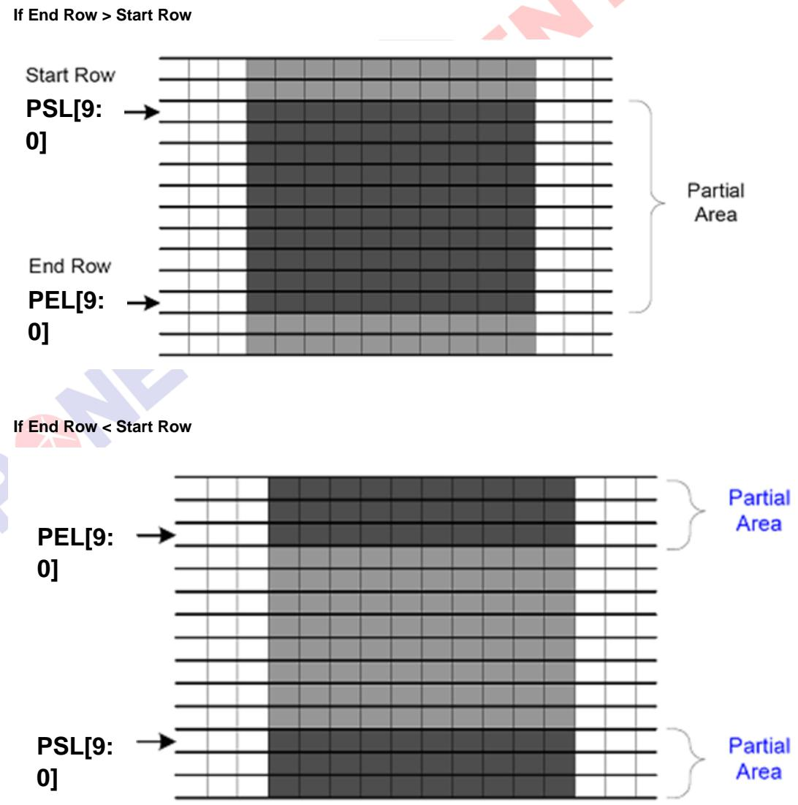  
If End Row = Start Row then the Partial Area will be one row deep.

<table><tr><td></td><td colspan="3"></td></tr><tr><td>Restriction</td><td colspan="3">PSL[9:0] and PEL[9:0] settings should be based on max available Display Area.</td></tr><tr><td rowspan="7">Register Availability</td><td colspan="3"></td></tr><tr><td colspan="2">Status</td><td>Availability</td></tr><tr><td colspan="2">Normal Mode On, Idle Mode Off, Sleep Out</td><td>Yes</td></tr><tr><td colspan="2">Normal Mode On, Idle Mode On, Sleep Out</td><td>Yes</td></tr><tr><td colspan="2">Partial Mode On, Idle Mode Off, Sleep Out</td><td>Yes</td></tr><tr><td colspan="2">Partial Mode On, Idle Mode On, Sleep Out</td><td>Yes</td></tr><tr><td colspan="2">Sleep In</td><td>Yes</td></tr><tr><td colspan="4"></td></tr><tr><td rowspan="6">Default</td><td colspan="3"></td></tr><tr><td rowspan="2">Status</td><td colspan="2">Default Value</td></tr><tr><td>PSL[9:0]</td><td>PEL[9:0]</td></tr><tr><td>Power On Sequence</td><td>0000h</td><td>01C5h</td></tr><tr><td>S/W Reset</td><td>0000h</td><td>01C5h</td></tr><tr><td>H/W Reset</td><td>0000h</td><td>01C5h</td></tr><tr><td colspan="4"></td></tr><tr><td>Flow Chart</td><td colspan="3"></td></tr></table>

<table><tr><td>Status</td><td>Availability</td></tr><tr><td>Normal Mode On, Idle Mode Off, Sleep Out</td><td>Yes</td></tr><tr><td>Normal Mode On, Idle Mode On, Sleep Out</td><td>Yes</td></tr><tr><td>Partial Mode On, Idle Mode Off, Sleep Out</td><td>Yes</td></tr><tr><td>Partial Mode On, Idle Mode On, Sleep Out</td><td>Yes</td></tr><tr><td>Sleep In</td><td>Yes</td></tr></table>

<table><tr><td rowspan="2">Status</td><td colspan="2">Default Value</td></tr><tr><td>PSL[9:0]</td><td>PEL[9:0]</td></tr><tr><td>Power On Sequence</td><td>0000h</td><td>01C5h</td></tr><tr><td>S/W Reset</td><td>0000h</td><td>01C5h</td></tr><tr><td>H/W Reset</td><td>0000h</td><td>01C5h</td></tr></table>

7.5.26 PTLAR\_H: Set Horizontal Partial Area (31h)

<table><tr><td colspan="2">Command set</td><td colspan="9">PTLAR_H</td></tr><tr><td>Inst / Para</td><td>W/R</td><td>D[7]</td><td>D[6]</td><td>D[5]</td><td>D[4]</td><td>D[3]</td><td>D[2]</td><td>D[1]</td><td>D[0]</td><td>Default Value</td></tr><tr><td>PTLAR_H</td><td rowspan="5">W/R</td><td>0</td><td>0</td><td>1</td><td>1</td><td>0</td><td>0</td><td>0</td><td>1</td><td>31h</td></tr><tr><td>Parameter 1</td><td colspan="7">-</td><td>PSC[8]</td><td>00h</td></tr><tr><td>Parameter 2</td><td colspan="8">PSC[7:0]</td><td>00h</td></tr><tr><td>Parameter 3</td><td colspan="7">-</td><td>PEC[8]</td><td>01h</td></tr><tr><td>Parameter 4</td><td colspan="8">PEC[7:0]</td><td>C5h</td></tr></table>

NOTE: “-“Don’t care

<table><tr><td>Description</td><td colspan="3">This command defines the Horizontal Partial Display mode's display area. There are two parameters associated with this command, the first defines the Start Column (PSC) and the second the End Column (PEC).If End Column &gt; Start ColumnIf End Column &lt; Start Column</td></tr><tr><td></td><td colspan="3">If End Column = Start Column then the Partial Area will be one column deep.</td></tr><tr><td>Restriction</td><td colspan="3">PSL[9:0] and PEL[9:0] settings should be based on max available Display Area.</td></tr><tr><td rowspan="7">Register Availability</td><td colspan="3"></td></tr><tr><td colspan="2">Status</td><td>Availability</td></tr><tr><td colspan="2">Normal Mode On, Idle Mode Off, Sleep Out</td><td>Yes</td></tr><tr><td colspan="2">Normal Mode On, Idle Mode On, Sleep Out</td><td>Yes</td></tr><tr><td colspan="2">Partial Mode On, Idle Mode Off, Sleep Out</td><td>Yes</td></tr><tr><td colspan="2">Partial Mode On, Idle Mode On, Sleep Out</td><td>Yes</td></tr><tr><td colspan="2">Sleep In</td><td>Yes</td></tr><tr><td rowspan="6">Default</td><td colspan="3"></td></tr><tr><td rowspan="2">Status</td><td colspan="2">Default Value</td></tr><tr><td>PSL[9:0]</td><td>PEL[9:0]</td></tr><tr><td>Power On Sequence</td><td>0000h</td><td>01C5h</td></tr><tr><td>S/W Reset</td><td>0000h</td><td>01C5h</td></tr><tr><td>H/W Reset</td><td>0000h</td><td>01C5h</td></tr><tr><td>Flow Chart</td><td colspan="3"></td></tr></table>

<table><tr><td>Status</td><td>Availability</td></tr><tr><td>Normal Mode On, Idle Mode Off, Sleep Out</td><td>Yes</td></tr><tr><td>Normal Mode On, Idle Mode On, Sleep Out</td><td>Yes</td></tr><tr><td>Partial Mode On, Idle Mode Off, Sleep Out</td><td>Yes</td></tr><tr><td>Partial Mode On, Idle Mode On, Sleep Out</td><td>Yes</td></tr><tr><td>Sleep In</td><td>Yes</td></tr></table>

<table><tr><td rowspan="2">Status</td><td colspan="2">Default Value</td></tr><tr><td>PSL[9:0]</td><td>PEL[9:0]</td></tr><tr><td>Power On Sequence</td><td>0000h</td><td>01C5h</td></tr><tr><td>S/W Reset</td><td>0000h</td><td>01C5h</td></tr><tr><td>H/W Reset</td><td>0000h</td><td>01C5h</td></tr></table>

7.5.27 TEOFF: Tearing Effect Line OFF (34h)

<table><tr><td colspan="2">Command set</td><td colspan="9">TEOFF</td></tr><tr><td>Inst / Para</td><td>W/R</td><td>D[7]</td><td>D[6]</td><td>D[5]</td><td>D[4]</td><td>D[3]</td><td>D[2]</td><td>D[1]</td><td>D[0]</td><td>Default Value</td></tr><tr><td>TEOFF</td><td rowspan="2">W</td><td>0</td><td>0</td><td>1</td><td>1</td><td>0</td><td>1</td><td>0</td><td>0</td><td>34h</td></tr><tr><td>Parameter 1</td><td colspan="9">No Parameter</td></tr></table>

NOTE: “-“Don’t care

<table><tr><td>Description</td><td colspan="2">This command is used to turn OFF (Active Low) the Tearing Effect output signal from the TE signal line.</td></tr><tr><td>Restriction</td><td colspan="2">This command has no effect when Tearing Effect output is already OFF.</td></tr><tr><td rowspan="7">Register Availability</td><td colspan="2"></td></tr><tr><td>Status</td><td>Availability</td></tr><tr><td>Normal Mode On, Idle Mode Off, Sleep Out</td><td>Yes</td></tr><tr><td>Normal Mode On, Idle Mode On, Sleep Out</td><td>Yes</td></tr><tr><td>Partial Mode On, Idle Mode Off, Sleep Out</td><td>Yes</td></tr><tr><td>Partial Mode On, Idle Mode On, Sleep Out</td><td>Yes</td></tr><tr><td>Sleep In</td><td>Yes</td></tr><tr><td rowspan="5">Default</td><td colspan="2"></td></tr><tr><td>Status</td><td>Default Value</td></tr><tr><td>Power On Sequence</td><td>Tearing Effect off</td></tr><tr><td>S/W Reset</td><td>Tearing Effect off</td></tr><tr><td>H/W Reset</td><td>Tearing Effect off</td></tr><tr><td>Flow Chart</td><td></td><td>LegendcommandParameterDisplayActionModeSequentialtransfer</td></tr></table>

7.5.28 TEON: Tearing Effect Line ON (35h)

<table><tr><td colspan="2">Command set</td><td colspan="9">TEON</td></tr><tr><td>Inst / Para</td><td>W/R</td><td>D[7]</td><td>D[6]</td><td>D[5]</td><td>D[4]</td><td>D[3]</td><td>D[2]</td><td>D[1]</td><td>D[0]</td><td>Default Value</td></tr><tr><td>TEON</td><td rowspan="2">W</td><td>0</td><td>0</td><td>1</td><td>1</td><td>0</td><td>1</td><td>0</td><td>1</td><td>35h</td></tr><tr><td>Parameter 1</td><td>-</td><td>-</td><td>-</td><td>-</td><td>-</td><td>-</td><td>-</td><td>M</td><td>00h</td></tr></table>

NOTE: “-“Don’t care

<table><tr><td>Description</td><td colspan="2">This command is used to turn ON the Tearing Effect output signal from the TE signal line. This output is not affected by changing MADCTL bit ML.The Tearing Effect Line On has one parameter, which describes the mode of the Tearing Effect Output Line.When M = "0": The Tearing Effect Output line consists of V-Blanking information only.When M = "1": The Tearing Effect Output line consists of both V-Blanking and H-Blinking information.Note: During Sleep In Mode with Tearing Effect Line On, Tearing Effect Output pin will be active Low.</td></tr><tr><td>Restriction</td><td colspan="2">This command has no effect when Tearing Effect output is already ON.</td></tr><tr><td rowspan="7">Register Availability</td><td colspan="2"></td></tr><tr><td>Status</td><td>Availability</td></tr><tr><td>Normal Mode On, Idle Mode Off, Sleep Out</td><td>Yes</td></tr><tr><td>Normal Mode On, Idle Mode On, Sleep Out</td><td>Yes</td></tr><tr><td>Partial Mode On, Idle Mode Off, Sleep Out</td><td>Yes</td></tr><tr><td>Partial Mode On, Idle Mode On, Sleep Out</td><td>Yes</td></tr><tr><td>Sleep In</td><td>Yes</td></tr><tr><td rowspan="5">Default</td><td colspan="2"></td></tr><tr><td>Status</td><td>Default Value</td></tr><tr><td>Power On Sequence</td><td>Tearing Effect off</td></tr><tr><td>S/W Reset</td><td>Tearing Effect off</td></tr><tr><td>H/W Reset</td><td>Tearing Effect off</td></tr><tr><td>Flow Chart</td><td></td><td>LegendcommandParameterDisplayActionModeSequentialtransfer</td></tr></table>

7.5.29 MADCTL: Memory Data Access Control (36h)

<table><tr><td colspan="2">Command set</td><td colspan="9">MADCTL</td></tr><tr><td>Inst / Para</td><td>W/R</td><td>D[7]</td><td>D[6]</td><td>D[5]</td><td>D[4]</td><td>D[3]</td><td>D[2]</td><td>D[1]</td><td>D[0]</td><td>Default Value</td></tr><tr><td>MADCTL</td><td rowspan="2">W/R</td><td>0</td><td>0</td><td>1</td><td>1</td><td>0</td><td>1</td><td>1</td><td>0</td><td>36h</td></tr><tr><td>Parameter</td><td>MY</td><td>MX</td><td>-</td><td>-</td><td>RGB</td><td>-</td><td>-</td><td>-</td><td>00h</td></tr></table>

NOTE: “-“Don’t care

<table><tr><td rowspan="12">Description</td><td colspan="2">This command defines display direction of image.This command makes no change on the other driver status.- MY: Row Address Increment</td></tr><tr><td>Value</td><td>Description</td></tr><tr><td>0</td><td>Increasing in vertical</td></tr><tr><td>1</td><td>Decreasing in vertical</td></tr><tr><td colspan="2">- MX: Column Address Increment</td></tr><tr><td>Value</td><td>Description</td></tr><tr><td>0</td><td>Increasing in horizontal</td></tr><tr><td>1</td><td>Decreasing in horizontal</td></tr><tr><td colspan="2">- RGB: RGB/BGR Order</td></tr><tr><td>Value</td><td>Description</td></tr><tr><td>0</td><td>RGB</td></tr><tr><td>1</td><td>BGR</td></tr><tr><td>Restriction</td><td colspan="2"></td></tr><tr><td rowspan="7">Register Availability</td><td colspan="2"></td></tr><tr><td>Status</td><td>Availability</td></tr><tr><td>Normal Mode On, Idle Mode Off, Sleep Out</td><td>Yes</td></tr><tr><td>Normal Mode On, Idle Mode On, Sleep Out</td><td>Yes</td></tr><tr><td>Partial Mode On, Idle Mode Off, Sleep Out</td><td>Yes</td></tr><tr><td>Partial Mode On, Idle Mode On, Sleep Out</td><td>Yes</td></tr><tr><td>Sleep In</td><td>Yes</td></tr><tr><td rowspan="5">Default</td><td colspan="2"></td></tr><tr><td>Status</td><td>Default Value</td></tr><tr><td>Power On Sequence</td><td>00h</td></tr><tr><td>S/W Reset</td><td>00h</td></tr><tr><td>H/W Reset</td><td>00h</td></tr><tr><td>Flow Chart</td><td></td><td>LegendcommandParameterDisplayActionModeSequentialtransfer</td></tr></table>

7.5.30 IDMOFF: Idle mode OFF (38h)

<table><tr><td colspan="2">Command set</td><td colspan="9">IDMOFF</td></tr><tr><td>Inst / Para</td><td>W/R</td><td>D[7]</td><td>D[6]</td><td>D[5]</td><td>D[4]</td><td>D[3]</td><td>D[2]</td><td>D[1]</td><td>D[0]</td><td>Default Value</td></tr><tr><td>IDMOFF</td><td rowspan="2">W</td><td>0</td><td>0</td><td>1</td><td>1</td><td>1</td><td>0</td><td>0</td><td>0</td><td>38h</td></tr><tr><td>Parameter 1</td><td colspan="9">No Parameter</td></tr></table>

NOTE: “-“Don’t care

<table><tr><td>Description</td><td colspan="2">This command is used to recover from Idle mode on.In the idle off mode, display panel can display maximum 16.7M colors.</td></tr><tr><td>Restriction</td><td colspan="2">This command has no effect when module is already in Idle Off mode.</td></tr><tr><td rowspan="7">Register Availability</td><td colspan="2"></td></tr><tr><td>Status</td><td>Availability</td></tr><tr><td>Normal Mode On, Idle Mode Off, Sleep Out</td><td>Yes</td></tr><tr><td>Normal Mode On, Idle Mode On, Sleep Out</td><td>Yes</td></tr><tr><td>Partial Mode On, Idle Mode Off, Sleep Out</td><td>Yes</td></tr><tr><td>Partial Mode On, Idle Mode On, Sleep Out</td><td>Yes</td></tr><tr><td>Sleep In</td><td>Yes</td></tr><tr><td rowspan="5">Default</td><td colspan="2"></td></tr><tr><td>Status</td><td>Default Value</td></tr><tr><td>Power On Sequence</td><td>Idle mode Off</td></tr><tr><td>S/W Reset</td><td>Idle mode Off</td></tr><tr><td>H/W Reset</td><td>Idle mode Off</td></tr><tr><td>Flow Chart</td><td colspan="2"></td></tr></table>

7.5.31 IDMON: Idle mode ON (39h)

<table><tr><td colspan="2">Command set</td><td colspan="9">IDMON</td></tr><tr><td>Inst / Para</td><td>W/R</td><td>D[7]</td><td>D[6]</td><td>D[5]</td><td>D[4]</td><td>D[3]</td><td>D[2]</td><td>D[1]</td><td>D[0]</td><td>Default Value</td></tr><tr><td>IDMON</td><td rowspan="2">W</td><td>0</td><td>0</td><td>1</td><td>1</td><td>1</td><td>0</td><td>0</td><td>1</td><td>39h</td></tr><tr><td>Parameter 1</td><td colspan="9">No Parameter</td></tr></table>

NOTE: “-“Don’t care

<table><tr><td>Description</td><td colspan="2">This command is used to enter into Idle mode on.In the idle on mode, color expression is reduced.The display color is determined by MSB of R, G, and B.</td></tr><tr><td>Restriction</td><td colspan="2">This command has no effect when module is already in Idle On mode.</td></tr><tr><td rowspan="7">Register Availability</td><td colspan="2"></td></tr><tr><td>Status</td><td>Availability</td></tr><tr><td>Normal Mode On, Idle Mode Off, Sleep Out</td><td>Yes</td></tr><tr><td>Normal Mode On, Idle Mode On, Sleep Out</td><td>Yes</td></tr><tr><td>Partial Mode On, Idle Mode Off, Sleep Out</td><td>Yes</td></tr><tr><td>Partial Mode On, Idle Mode On, Sleep Out</td><td>Yes</td></tr><tr><td>Sleep In</td><td>Yes</td></tr><tr><td rowspan="5">Default</td><td colspan="2"></td></tr><tr><td>Status</td><td>Default Value</td></tr><tr><td>Power On Sequence</td><td>Idle mode Off</td></tr><tr><td>S/W Reset</td><td>Idle mode Off</td></tr><tr><td>H/W Reset</td><td>Idle mode Off</td></tr><tr><td>Flow Chart</td><td colspan="2"></td></tr></table>

7.5.32 COLMOD: Interface Pixel Format (3Ah)

<table><tr><td colspan="2">Command set</td><td colspan="9">COLMOD</td></tr><tr><td>Inst / Para</td><td>W/R</td><td>D[7]</td><td>D[6]</td><td>D[5]</td><td>D[4]</td><td>D[3]</td><td>D[2]</td><td>D[1]</td><td>D[0]</td><td>Default Value</td></tr><tr><td>COLMOD</td><td rowspan="2">W</td><td>0</td><td>0</td><td>1</td><td>1</td><td>1</td><td>0</td><td>1</td><td>0</td><td>3Ah</td></tr><tr><td>Parameter 1</td><td>SPI_IFPF_SEL</td><td colspan="3">VIPF[2:0]</td><td>-</td><td colspan="3">IFPF[2:0]</td><td>77h</td></tr></table>

NOTE: “-“Don’t care

<table><tr><td rowspan="13">Description</td><td colspan="2">This command is used to define the format of RGB picture data.The formats are shown in the table:- SPI_IFPF_SEL:sets the pixel format for the RGB image data used by the interface.</td></tr><tr><td>Value</td><td>Description</td></tr><tr><td>0</td><td>The IFPF[2:0] pixel format used by the SPI / MCU interface</td></tr><tr><td>1</td><td>The VIPF[2:0] pixel format used by the SPI interface</td></tr><tr><td colspan="2">- IFPF[2:0]:IFPF:Control Interface Color Format</td></tr><tr><td>Value</td><td>Description</td></tr><tr><td>001</td><td>SPI 8 bit/pixel (256 colors); SPI 256 Gray (Support IF: SPI3/SPI4)</td></tr><tr><td>010</td><td>SPI 8 bit/pixel (256 colors); SPI 3-3-2 (Support IF: SPI3/SPI4)</td></tr><tr><td>011</td><td>SPI 3 bit/pixel (8 colors); SPI 1-1-1 (Support IF: SPI3/SPI4)</td></tr><tr><td>101</td><td>16bit/pixel (65,536 colors)</td></tr><tr><td>110</td><td>18bit/pixel (262,144 colors)</td></tr><tr><td>111</td><td>24bit/pixel (16.7M colors)</td></tr><tr><td>001</td><td>SPI 8 bit/pixel (256 colors); SPI 256 Gray (Support IF: SPI3/SPI4)</td></tr><tr><td>Restriction</td><td colspan="2">There is no visible effect until the Frame Memory is written to.</td></tr><tr><td rowspan="7">Register Availability</td><td colspan="2"></td></tr><tr><td>Status</td><td>Availability</td></tr><tr><td>Normal Mode On, Idle Mode Off, Sleep Out</td><td>Yes</td></tr><tr><td>Normal Mode On, Idle Mode On, Sleep Out</td><td>Yes</td></tr><tr><td>Partial Mode On, Idle Mode Off, Sleep Out</td><td>Yes</td></tr><tr><td>Partial Mode On, Idle Mode On, Sleep Out</td><td>Yes</td></tr><tr><td>Sleep In</td><td>Yes</td></tr></table>

<table><tr><td rowspan="4">Default</td><td rowspan="4"></td><td>Status</td><td>Default Value</td></tr><tr><td>Power On Sequence</td><td>70h</td></tr><tr><td>S/W Reset</td><td>70h</td></tr><tr><td>H/W Reset</td><td>70h</td></tr><tr><td>Flow Chart</td><td colspan="3"></td></tr></table>

7.5.33 RAMWR: Memory Continuous Write (3Ch)

<table><tr><td colspan="2">Command set</td><td colspan="9">RAMWRC</td></tr><tr><td>Inst / Para</td><td>W/R</td><td>D[7]</td><td>D[6]</td><td>D[5]</td><td>D[4]</td><td>D[3]</td><td>D[2]</td><td>D[1]</td><td>D[0]</td><td>Default Value</td></tr><tr><td>RAMWRC</td><td rowspan="5">W</td><td>0</td><td>0</td><td>1</td><td>1</td><td>1</td><td>1</td><td>0</td><td>0</td><td>3Ch</td></tr><tr><td>Parameter 1</td><td> $D_17$ </td><td> $D_16$ </td><td> $D_15$ </td><td> $D_14$ </td><td> $D_13$ </td><td> $D_12$ </td><td> $D_11$ </td><td> $D_10$ </td><td>-</td></tr><tr><td>...</td><td colspan="8">...</td><td>-</td></tr><tr><td>...</td><td colspan="8">...</td><td>-</td></tr><tr><td>Parameter n</td><td> $D_N7$ </td><td> $D_N6$ </td><td> $D_N5$ </td><td> $D_N4$ </td><td> $D_N3$ </td><td> $D_N2$ </td><td> $D_N1$ </td><td> $D_N0$ </td><td>-</td></tr></table>

NOTE: “-“Don’t care

<table><tr><td>Description</td><td colspan="2">This command transfers image data from the host processor to the display module&#x27;s frame memory continuing from the pixel location following the previous write_memory_continue or write_memory_start command.</td></tr><tr><td>Restriction</td><td colspan="2">A Memory Write should follow a CASET(2Ah), RASET(2Bh) or MADCTR(36h) to define the write location. Otherwise, data written with RAMWR(2Ch) and any following RAMWRC(3Ch) commands is written to undefined locations.</td></tr><tr><td rowspan="7">Register Availability</td><td colspan="2"></td></tr><tr><td>Status</td><td>Availability</td></tr><tr><td>Normal Mode On, Idle Mode Off, Sleep Out</td><td>Yes</td></tr><tr><td>Normal Mode On, Idle Mode On, Sleep Out</td><td>Yes</td></tr><tr><td>Partial Mode On, Idle Mode Off, Sleep Out</td><td>Yes</td></tr><tr><td>Partial Mode On, Idle Mode On, Sleep Out</td><td>Yes</td></tr><tr><td>Sleep In</td><td>Yes</td></tr><tr><td rowspan="5">Default</td><td colspan="2"></td></tr><tr><td>Status</td><td>Default Value</td></tr><tr><td>Power On Sequence</td><td>Memory is set randomly</td></tr><tr><td>S/W Reset</td><td>Memory is not cleared</td></tr><tr><td>H/W Reset</td><td>Memory is not cleared</td></tr><tr><td>Flow Chart</td><td colspan="2"> </td></tr></table>

7.5.34 RAMWR: Memory Continuous Read (3Eh)

<table><tr><td colspan="2">Command set</td><td colspan="9">RAMRDC</td></tr><tr><td>Inst / Para</td><td>W/R</td><td>D[7]</td><td>D[6]</td><td>D[5]</td><td>D[4]</td><td>D[3]</td><td>D[2]</td><td>D[1]</td><td>D[0]</td><td>Default Value</td></tr><tr><td>RAMRDC</td><td rowspan="5">R</td><td>0</td><td>0</td><td>1</td><td>1</td><td>1</td><td>1</td><td>1</td><td>0</td><td>3Eh</td></tr><tr><td>Parameter 1</td><td> $D_17$ </td><td> $D_16$ </td><td> $D_15$ </td><td> $D_14$ </td><td> $D_13$ </td><td> $D_12$ </td><td> $D_11$ </td><td> $D_10$ </td><td>-</td></tr><tr><td>...</td><td colspan="8">...</td><td>-</td></tr><tr><td>...</td><td colspan="8">...</td><td>-</td></tr><tr><td>Parameter n</td><td> $D_N7$ </td><td> $D_N6$ </td><td> $D_N5$ </td><td> $D_N4$ </td><td> $D_N3$ </td><td> $D_N2$ </td><td> $D_N1$ </td><td> $D_N0$ </td><td>-</td></tr></table>

NOTE: “-“Don’t care

<table><tr><td>Description</td><td colspan="2">This command transfers image data from the host processor to the display module&#x27;s frame memory continuing from the pixel location following the previous read_memory_continue or read_memory_start command.</td></tr><tr><td>Restriction</td><td colspan="2">A Memory Write should follow a CASET(2Ah), RASET(2Bh) or MADCTR(36h) to define the write location. Otherwise, data written with RAMWR(2Eh) and any following RAMWRC(3Eh) commands is written to undefined locations.</td></tr><tr><td rowspan="7">Register Availability</td><td colspan="2"></td></tr><tr><td>Status</td><td>Availability</td></tr><tr><td>Normal Mode On, Idle Mode Off, Sleep Out</td><td>Yes</td></tr><tr><td>Normal Mode On, Idle Mode On, Sleep Out</td><td>Yes</td></tr><tr><td>Partial Mode On, Idle Mode Off, Sleep Out</td><td>Yes</td></tr><tr><td>Partial Mode On, Idle Mode On, Sleep Out</td><td>Yes</td></tr><tr><td>Sleep In</td><td>Yes</td></tr><tr><td colspan="3"></td></tr><tr><td rowspan="5">Default</td><td colspan="2"></td></tr><tr><td>Status</td><td>Default Value</td></tr><tr><td>Power On Sequence</td><td>Memory is set randomly</td></tr><tr><td>S/W Reset</td><td>Memory is not cleared</td></tr><tr><td>H/W Reset</td><td>Memory is not cleared</td></tr><tr><td colspan="3"></td></tr><tr><td>Flow Chart</td><td colspan="2"> </td></tr></table>

7.5.35 STESL: Set Tearing Effect Scan Line (44h)

<table><tr><td colspan="2">Command set</td><td colspan="9">STESL</td></tr><tr><td>Inst / Para</td><td>W/R</td><td>D[7]</td><td>D[6]</td><td>D[5]</td><td>D[4]</td><td>D[3]</td><td>D[2]</td><td>D[1]</td><td>D[0]</td><td>Default Value</td></tr><tr><td>STESL</td><td rowspan="3">W/R</td><td>0</td><td>1</td><td>0</td><td>0</td><td>0</td><td>1</td><td>0</td><td>0</td><td>44h</td></tr><tr><td>Parameter 1</td><td>N15</td><td>N14</td><td>N13</td><td>N12</td><td>N11</td><td>N10</td><td>N9</td><td>N8</td><td>00h</td></tr><tr><td>Parameter 2</td><td>N7</td><td>N6</td><td>N5</td><td>N4</td><td>N3</td><td>N2</td><td>N1</td><td>N0</td><td>00h</td></tr></table>

NOTE: “-“Don’t care

<table><tr><td>Description</td><td colspan="2">This command turns on the display module's Tearing Effect output signal on the TE signal line when the display module reaches line N. The TE signal is not affected by changing MADCTL bit ML. The Tearing Effect Line On has one parameter, which describes the mode of the Tearing Effect Output Line mode. The Tearing Effect Output line consists of V-Blanking information only.Note 1: STESL with N[15:0]="0000h" is equivalent to TEON with M="0"The Tearing Effect Output line shall be active low when the display module is in Sleep in mode.Note 2: This command takes effect on the frame following the current frame. Therefore, if the TE output is already on, the TE output shall continue to operate as programmed by the previous "TEON (35h)" or "STESL (44h) command" until the end of the frame.</td></tr><tr><td>Restriction</td><td colspan="2">Parameter range 1 ≤ N[15:0] ≤ 1280+Porch Line.</td></tr><tr><td rowspan="7">Register Availability</td><td colspan="2"></td></tr><tr><td>Status</td><td>Availability</td></tr><tr><td>Normal Mode On, Idle Mode Off, Sleep Out</td><td>Yes</td></tr><tr><td>Normal Mode On, Idle Mode On, Sleep Out</td><td>Yes</td></tr><tr><td>Partial Mode On, Idle Mode Off, Sleep Out</td><td>Yes</td></tr><tr><td>Partial Mode On, Idle Mode On, Sleep Out</td><td>Yes</td></tr><tr><td>Sleep In</td><td>Yes</td></tr><tr><td rowspan="5">Default</td><td colspan="2"></td></tr><tr><td>Status</td><td>Default Value</td></tr><tr><td>Power On Sequence</td><td>0000h</td></tr><tr><td>S/W Reset</td><td>0000h</td></tr><tr><td>H/W Reset</td><td>0000h</td></tr><tr><td>Flow Chart</td><td></td></tr></table>

7.5.36 GSL: Get Scan Line (45h)

<table><tr><td colspan="2">Command set</td><td colspan="9">GSL</td></tr><tr><td>Inst / Para</td><td>W/R</td><td>D[7]</td><td>D[6]</td><td>D[5]</td><td>D[4]</td><td>D[3]</td><td>D[2]</td><td>D[1]</td><td>D[0]</td><td>Default Value</td></tr><tr><td>GSL</td><td rowspan="3">R</td><td>0</td><td>1</td><td>0</td><td>0</td><td>0</td><td>1</td><td>0</td><td>1</td><td>45h</td></tr><tr><td>Parameter 1</td><td>N15</td><td>N14</td><td>N13</td><td>N12</td><td>N11</td><td>N10</td><td>N9</td><td>N8</td><td>00h</td></tr><tr><td>Parameter 2</td><td>N7</td><td>N6</td><td>N5</td><td>N4</td><td>N3</td><td>N2</td><td>N1</td><td>N0</td><td>00h</td></tr></table>

NOTE: “-“Don’t care

<table><tr><td>Description</td><td colspan="2">This command returns the current scan line, N, used to update the display module. The total number of scan lines on display is defined as Vdisplay + Vporch. The first scan line is defined as the first line of V Sync and is denoted as Line 0.When in Sleep in mode, the returned value is undefined.</td></tr><tr><td>Restriction</td><td colspan="2">-</td></tr><tr><td rowspan="7">Register Availability</td><td colspan="2"></td></tr><tr><td>Status</td><td>Availability</td></tr><tr><td>Normal Mode On, Idle Mode Off, Sleep Out</td><td>Yes</td></tr><tr><td>Normal Mode On, Idle Mode On, Sleep Out</td><td>Yes</td></tr><tr><td>Partial Mode On, Idle Mode Off, Sleep Out</td><td>Yes</td></tr><tr><td>Partial Mode On, Idle Mode On, Sleep Out</td><td>Yes</td></tr><tr><td>Sleep In</td><td>Yes</td></tr><tr><td rowspan="5">Default</td><td colspan="2"></td></tr><tr><td>Status</td><td>Default Value</td></tr><tr><td>Power On Sequence</td><td>0000h</td></tr><tr><td>S/W Reset</td><td>0000h</td></tr><tr><td>H/W Reset</td><td>0000h</td></tr><tr><td>Flow Chart</td><td colspan="2"></td></tr></table>

7.5.37 DSTBON: Deep Standby Mode On (4Fh)

<table><tr><td colspan="2">Command set</td><td colspan="9">DSTBON</td></tr><tr><td>Inst / Para</td><td>W/R</td><td>D[7]</td><td>D[6]</td><td>D[5]</td><td>D[4]</td><td>D[3]</td><td>D[2]</td><td>D[1]</td><td>D[0]</td><td>Default Value</td></tr><tr><td>DSTBON</td><td rowspan="2">W</td><td>0</td><td>1</td><td>0</td><td>0</td><td>1</td><td>1</td><td>0</td><td>0</td><td>4Fh</td></tr><tr><td>Parameter 1</td><td>-</td><td>-</td><td>-</td><td>-</td><td>-</td><td>-</td><td>-</td><td>DSTB</td><td>00h</td></tr></table>

NOTE: “-“Don’t care

<table><tr><td>Description</td><td colspan="2">This command is used to enter deep standby mode.DSTB=&quot;1&quot;, enter deep standby mode.Notes:1. To exit Deep Standby Mode, input low pulse more than 3 msec to pin RESX.2. For MIPI IF, if deep standby mode is used, please pull HSSI_CLK_P/N &amp; HSSI_D0~D1_P/N to GND after executing deep standby command.</td></tr><tr><td>Restriction</td><td colspan="2">-</td></tr><tr><td>Register Availability</td><td colspan="2"></td></tr><tr><td>Default</td><td colspan="2"></td></tr><tr><td>Flow Chart</td><td colspan="2"> </td></tr></table>

7.5.38 WRDISBV: Write Display Brightness (51h)

<table><tr><td colspan="2">Command set</td><td colspan="9">WRDISBV</td></tr><tr><td>Inst / Para</td><td>W/R</td><td>D[7]</td><td>D[6]</td><td>D[5]</td><td>D[4]</td><td>D[3]</td><td>D[2]</td><td>D[1]</td><td>D[0]</td><td>Default Value</td></tr><tr><td>WRDISBV</td><td rowspan="2">W</td><td>0</td><td>1</td><td>0</td><td>1</td><td>0</td><td>0</td><td>0</td><td>1</td><td>51h</td></tr><tr><td>Parameter 1</td><td colspan="8">DBV[7:0]</td><td>00h</td></tr></table>

NOTE: “-“Don’t care

<table><tr><td rowspan="7">Description</td><td colspan="3">This command is used to adjust brightness value.In principle relationship is that 00h value means the lowest brightness and FFh value means the highest brightness.</td></tr><tr><td>BV[7:0]</td><td>Brightness (Ratio)</td><td>Brightness (%)</td></tr><tr><td>00h</td><td>0/256</td><td>0 %</td></tr><tr><td>01h</td><td>2/256</td><td>0.78 %</td></tr><tr><td>......</td><td>......</td><td>......</td></tr><tr><td>FEh</td><td>255/256</td><td>99.6%</td></tr><tr><td>FFh</td><td>256/256</td><td>100%</td></tr><tr><td>Restriction</td><td colspan="3">The display supplier cannot use this command for tuning (e.g. factory tuning, etc.).</td></tr><tr><td rowspan="7">Register Availability</td><td colspan="3"></td></tr><tr><td colspan="2">Status</td><td>Availability</td></tr><tr><td colspan="2">Normal Mode On, Idle Mode Off, Sleep Out</td><td>Yes</td></tr><tr><td colspan="2">Normal Mode On, Idle Mode On, Sleep Out</td><td>Yes</td></tr><tr><td colspan="2">Partial Mode On, Idle Mode Off, Sleep Out</td><td>Yes</td></tr><tr><td colspan="2">Partial Mode On, Idle Mode On, Sleep Out</td><td>Yes</td></tr><tr><td colspan="2">Sleep In</td><td>Yes</td></tr><tr><td rowspan="5">Default</td><td colspan="3"></td></tr><tr><td colspan="2">Status</td><td>Default Value</td></tr><tr><td colspan="2">Power On Sequence</td><td>00h</td></tr><tr><td colspan="2">S/W Reset</td><td>00h</td></tr><tr><td colspan="2">H/W Reset</td><td>00h</td></tr><tr><td>Flow Chart</td><td colspan="3"></td></tr></table>

7.5.39 RDDISBV: Read Display Brightness (52h)

<table><tr><td colspan="2">Command set</td><td colspan="9">RDDISBV</td></tr><tr><td>Inst / Para</td><td>W/R</td><td>D[7]</td><td>D[6]</td><td>D[5]</td><td>D[4]</td><td>D[3]</td><td>D[2]</td><td>D[1]</td><td>D[0]</td><td>Default Value</td></tr><tr><td>RDDISBV</td><td rowspan="2">R</td><td>0</td><td>1</td><td>0</td><td>1</td><td>0</td><td>0</td><td>1</td><td>0</td><td>52h</td></tr><tr><td>Parameter 1</td><td colspan="8">DBV[7:0]</td><td>00h</td></tr></table>

NOTE: “-“Don’t care

<table><tr><td>Description</td><td colspan="2">This command returns brightness value.In principle relationship is that 00h value means the lowest brightness and FFh value means the highest brightness.</td></tr><tr><td>Restriction</td><td colspan="2">-</td></tr><tr><td rowspan="7">Register Availability</td><td colspan="2"></td></tr><tr><td>Status</td><td>Availability</td></tr><tr><td>Normal Mode On, Idle Mode Off, Sleep Out</td><td>Yes</td></tr><tr><td>Normal Mode On, Idle Mode On, Sleep Out</td><td>Yes</td></tr><tr><td>Partial Mode On, Idle Mode Off, Sleep Out</td><td>Yes</td></tr><tr><td>Partial Mode On, Idle Mode On, Sleep Out</td><td>Yes</td></tr><tr><td>Sleep In</td><td>Yes</td></tr><tr><td colspan="3"></td></tr><tr><td rowspan="5">Default</td><td colspan="2"></td></tr><tr><td>Status</td><td>Default Value</td></tr><tr><td>Power On Sequence</td><td>00h</td></tr><tr><td>S/W Reset</td><td>00h</td></tr><tr><td>H/W Reset</td><td>00h</td></tr><tr><td colspan="3"></td></tr><tr><td>Flow Chart</td><td colspan="2"></td></tr></table>

7.5.40 WRCTRLD: Write CTRL Display (53h)

<table><tr><td colspan="2">Command set</td><td colspan="9">WRCTRLD</td></tr><tr><td>Inst / Para</td><td>W/R</td><td>D[7]</td><td>D[6]</td><td>D[5]</td><td>D[4]</td><td>D[3]</td><td>D[2]</td><td>D[1]</td><td>D[0]</td><td>Default Value</td></tr><tr><td>WRCTRLD</td><td rowspan="2">W</td><td>0</td><td>1</td><td>0</td><td>1</td><td>0</td><td>0</td><td>1</td><td>1</td><td>53h</td></tr><tr><td>Parameter 1</td><td>-</td><td>-</td><td>BCTRL</td><td>-</td><td>DD</td><td>-</td><td>-</td><td>-</td><td>28h</td></tr></table>

NOTE: “-“Don’t care

<table><tr><td>Description</td><td colspan="2">This command is used to control display brightness.BCTRL: Brightness Control Block On/Off.The BCTRL bit is always used to switch brightness for display with dimming effect (according to DIM_EN bit).BCTRL =0, dBV[7:0] value disable.BCTRL =1,d BV[7:0] value enable.DD: Display Dimming Control On/Off.DD = 0, Display dimming is off.DD =1, Display dimming is on.The dimming function is adapted to the brightness registers for display when bit BCTRL is changed at DD ="1", e.g.BCTRL: 0_1 or 1_0.Note: All read and write commands are valid, but there is no effect (except registers can be changed) when write commands are used.</td></tr><tr><td>Restriction</td><td colspan="2">-</td></tr><tr><td>Register Availability</td><td colspan="2"></td></tr><tr><td>Default</td><td colspan="2"></td></tr><tr><td>Flow Chart</td><td colspan="2"> </td></tr></table>

7.5.41 RDCTRLD: Read CTRL Display (54h)

<table><tr><td colspan="2">Command set</td><td colspan="9">RDCTRLD</td></tr><tr><td>Inst / Para</td><td>W/R</td><td>D[7]</td><td>D[6]</td><td>D[5]</td><td>D[4]</td><td>D[3]</td><td>D[2]</td><td>D[1]</td><td>D[0]</td><td>Default Value</td></tr><tr><td>RDCTRLD</td><td rowspan="2">R</td><td>0</td><td>1</td><td>0</td><td>1</td><td>0</td><td>1</td><td>0</td><td>0</td><td>54h</td></tr><tr><td>Parameter 1</td><td>-</td><td>-</td><td>BCTRL</td><td>-</td><td>DD</td><td>BL</td><td>-</td><td>-</td><td>28h</td></tr></table>

NOTE: “-“Don’t care

<table><tr><td>Description</td><td colspan="2">This command is used to control display brightness.BCTRL: Brightness Control Block On/Off.The BCTRL bit is always used to switch brightness for display with dimming effect (according to DIM_EN bit).BCTRL =0, dBV[7:0] value disable.BCTRL =1,d BV[7:0] value enable.DD: Display Dimming Control On/Off.DD = 0, Display dimming is off.DD =1, Display dimming is on.The dimming function is adapted to the brightness registers for display when bit BCTRL is changed at DD ="1", e.g.BCTRL: 0_1 or 1_0.Note: All read and write commands are valid, but there is no effect (except registers can be changed) when write commands are used.</td></tr><tr><td>Restriction</td><td colspan="2">-</td></tr><tr><td>Register Availability</td><td colspan="2"></td></tr><tr><td>Default</td><td colspan="2"></td></tr><tr><td>Flow Chart</td><td colspan="2"></td></tr></table>

7.5.42 WRACL: Read ACL Control (55h)

<table><tr><td colspan="2">Command set</td><td colspan="9">WRACL</td></tr><tr><td>Inst / Para</td><td>W/R</td><td>D[7]</td><td>D[6]</td><td>D[5]</td><td>D[4]</td><td>D[3]</td><td>D[2]</td><td>D[1]</td><td>D[0]</td><td>Default Value</td></tr><tr><td>WRACL</td><td rowspan="2">W</td><td>0</td><td>1</td><td>0</td><td>1</td><td>0</td><td>1</td><td>0</td><td>1</td><td>55h</td></tr><tr><td>Parameter 1</td><td>-</td><td>-</td><td>-</td><td>-</td><td>-</td><td>-</td><td colspan="2">RAD_ACL[1:0]</td><td>00h</td></tr></table>

NOTE: “-“Don’t care

<table><tr><td rowspan="4">Description</td><td colspan="2">This command is used to control ACL (Auto Current Limit) function- ACL[1:0]: control ACL (Auto Current Limit) function.</td></tr><tr><td>Value</td><td>Description</td></tr><tr><td>00</td><td>Disable ACL function.</td></tr><tr><td>11</td><td>Enable ACL function.</td></tr><tr><td>Restriction</td><td colspan="2">-</td></tr><tr><td>Register Availability</td><td colspan="2"></td></tr><tr><td>Default</td><td colspan="2"></td></tr><tr><td>Flow Chart</td><td colspan="2"></td></tr></table>

7.5.43 RDACL: Read ACL Control (56h)

<table><tr><td colspan="2">Command set</td><td colspan="9">RDACL</td></tr><tr><td>Inst / Para</td><td>W/R</td><td>D[7]</td><td>D[6]</td><td>D[5]</td><td>D[4]</td><td>D[3]</td><td>D[2]</td><td>D[1]</td><td>D[0]</td><td>Default Value</td></tr><tr><td>RDACL</td><td rowspan="2">R</td><td>0</td><td>1</td><td>0</td><td>1</td><td>0</td><td>1</td><td>1</td><td>0</td><td>56h</td></tr><tr><td>Parameter 1</td><td>-</td><td>-</td><td>-</td><td>-</td><td>-</td><td>-</td><td colspan="2">RAD_ACL[1:0]</td><td>00h</td></tr></table>

NOTE: “-“Don’t care

<table><tr><td rowspan="4">Description</td><td colspan="2">This command is used to control ACL (Auto Current Limit) function- ACL[1:0]: control ACL (Auto Current Limit) function.</td></tr><tr><td>Value</td><td>Description</td></tr><tr><td>00</td><td>Disable ACL function.</td></tr><tr><td>11</td><td>Enable ACL function.</td></tr><tr><td>Restriction</td><td colspan="2">-</td></tr><tr><td>Register Availability</td><td colspan="2"></td></tr><tr><td>Default</td><td colspan="2"></td></tr><tr><td>Flow Chart</td><td colspan="2"></td></tr></table>

7.5.44 WRIMGEHCCTR: Set Color Enhance Control (58h)

<table><tr><td colspan="2">Command set</td><td colspan="9">SRIMGEHCCTR</td></tr><tr><td>Inst / Para</td><td>W/R</td><td>D[7]</td><td>D[6]</td><td>D[5]</td><td>D[4]</td><td>D[3]</td><td>D[2]</td><td>D[1]</td><td>D[0]</td><td>Default Value</td></tr><tr><td>WRIMGEHCCTR</td><td rowspan="2">W</td><td>0</td><td>1</td><td>0</td><td>1</td><td>1</td><td>0</td><td>0</td><td>0</td><td>58h</td></tr><tr><td>Parameter 1</td><td>-</td><td>-</td><td>-</td><td>-</td><td>-</td><td>SLR_EN</td><td colspan="2">SLR_LEVEL[1:0]</td><td>00h</td></tr></table>

NOTE: “-“Don’t care

<table><tr><td rowspan="9">Description</td><td colspan="2">This command is used to control ACL (Auto Current Limit) function- SLR_EN: Sunlight Readable Enhancement enable function.</td></tr><tr><td>Value</td><td>Description</td></tr><tr><td>0</td><td>Disable SRE function.</td></tr><tr><td>1</td><td>Enable SRE function.</td></tr><tr><td colspan="2">- SLR_LEVEL[1:0]: Sunlight Readable Enhancement Enable</td></tr><tr><td>Value</td><td>Description</td></tr><tr><td>0</td><td>Low</td></tr><tr><td>1</td><td>Medium</td></tr><tr><td>2</td><td>High</td></tr><tr><td>Restriction</td><td colspan="2">-</td></tr><tr><td rowspan="7">Register Availability</td><td colspan="2"></td></tr><tr><td>Status</td><td>Availability</td></tr><tr><td>Normal Mode On, Idle Mode Off, Sleep Out</td><td>Yes</td></tr><tr><td>Normal Mode On, Idle Mode On, Sleep Out</td><td>Yes</td></tr><tr><td>Partial Mode On, Idle Mode Off, Sleep Out</td><td>Yes</td></tr><tr><td>Partial Mode On, Idle Mode On, Sleep Out</td><td>Yes</td></tr><tr><td>Sleep In</td><td>Yes</td></tr><tr><td rowspan="5">Default</td><td colspan="2"></td></tr><tr><td>Status</td><td>Default Value</td></tr><tr><td>Power On Sequence</td><td>00h</td></tr><tr><td>S/W Reset</td><td>00h</td></tr><tr><td>H/W Reset</td><td>00h</td></tr><tr><td>Flow Chart</td><td></td></tr></table>

7.5.45 RDIMGEHCCTR: Read Color Enhance Control (59h)

<table><tr><td colspan="2">Command set</td><td colspan="9">RDIMAGEHCCTR</td></tr><tr><td>Inst / Para</td><td>W/R</td><td>D[7]</td><td>D[6]</td><td>D[5]</td><td>D[4]</td><td>D[3]</td><td>D[2]</td><td>D[1]</td><td>D[0]</td><td>Default Value</td></tr><tr><td>RDIMAGEHCCTR</td><td rowspan="2">R</td><td>0</td><td>1</td><td>0</td><td>1</td><td>1</td><td>0</td><td>0</td><td>1</td><td>59h</td></tr><tr><td>Parameter 1</td><td>-</td><td>-</td><td>-</td><td>-</td><td>-</td><td>SLR_EN</td><td colspan="2">SLR_LEVEL[1:0]</td><td>00h</td></tr></table>

NOTE: “-“Don’t care

<table><tr><td rowspan="9">Description</td><td colspan="2">This command is used to control ACL (Auto Current Limit) function- SLR_EN: Read Sunlight Readable Enhancement enable function.</td></tr><tr><td>Value</td><td>Description</td></tr><tr><td>0</td><td>Disable SRE function.</td></tr><tr><td>1</td><td>Enable SRE function.</td></tr><tr><td colspan="2">- SLR_LEVEL[1:0]: Read Sunlight Readable Enhancement level</td></tr><tr><td>Value</td><td>Description</td></tr><tr><td>0</td><td>Low</td></tr><tr><td>1</td><td>Medium</td></tr><tr><td>2</td><td>High</td></tr><tr><td>Restriction</td><td colspan="2">-</td></tr><tr><td>Register Availability</td><td colspan="2"></td></tr><tr><td>Default</td><td colspan="2"></td></tr><tr><td></td><td colspan="2"></td></tr><tr><td>Flow Chart</td><td colspan="2"></td></tr></table>

7.5.46 RDIMGEHCCTR: Local HBM Control (5Fh)

<table><tr><td colspan="2">Command set</td><td colspan="9">RDIMAGEHCCTR</td></tr><tr><td>Inst / Para</td><td>W/R</td><td>D[7]</td><td>D[6]</td><td>D[5]</td><td>D[4]</td><td>D[3]</td><td>D[2]</td><td>D[1]</td><td>D[0]</td><td>Default Value</td></tr><tr><td>RDIMAGEHCCTR</td><td rowspan="2">R/W</td><td>0</td><td>1</td><td>0</td><td>1</td><td>1</td><td>1</td><td>1</td><td>1</td><td>5Fh</td></tr><tr><td>Parameter 1</td><td>-</td><td>-</td><td>-</td><td>-</td><td>-</td><td>-</td><td>-</td><td>Loacl_hbm_en</td><td>00h</td></tr></table>

NOTE: “-“Don’t care

<table><tr><td rowspan="4">Description</td><td colspan="2">This command is used to control Local hbm function- Loacl hbm: Loacl hbm enable function.</td></tr><tr><td>Value</td><td>Description</td></tr><tr><td>0</td><td>Disable Loacl hbm function.</td></tr><tr><td>1</td><td>Enable Local hbm function.</td></tr><tr><td>Restriction</td><td colspan="2">-</td></tr><tr><td>Register Availability</td><td colspan="2"></td></tr><tr><td>Default</td><td colspan="2"></td></tr><tr><td>Flow Chart</td><td colspan="2"></td></tr></table>

7.5.47 WRHBMDISBV: Frame Rate level Control (60h)

<table><tr><td colspan="2">Command set</td><td colspan="9">RDIMAGEHCCTR</td></tr><tr><td>Inst / Para</td><td>W/R</td><td>D[7]</td><td>D[6]</td><td>D[5]</td><td>D[4]</td><td>D[3]</td><td>D[2]</td><td>D[1]</td><td>D[0]</td><td>Default Value</td></tr><tr><td>RDIMAGEHCCTR</td><td rowspan="2">R/W</td><td>0</td><td>1</td><td>1</td><td>0</td><td>0</td><td>0</td><td>0</td><td>0</td><td>60h</td></tr><tr><td>Parameter 1</td><td>-</td><td colspan="3">normal_level[2:0]</td><td>-</td><td>-</td><td colspan="2">idle_level[1:0]</td><td>00h</td></tr></table>

NOTE: “-“Don’t care

<table><tr><td rowspan="4">Description</td><td colspan="2">This command is used to control Frame Rate level function</td></tr><tr><td>Value</td><td>Description</td></tr><tr><td>Normal_level[2:0]</td><td>0: Normal mode base level1: Normal mode level 12: Normal mode level 23: Normal mode level 34: Normal mode level 4Others: Reserved</td></tr><tr><td>Idle_level[1:0]</td><td>0: IDLE mode base level1: IDLE mode level 12: IDLE mode level 2Others: Reserved</td></tr><tr><td>Restriction</td><td colspan="2">-</td></tr><tr><td>Register Availability</td><td colspan="2"></td></tr><tr><td>Default</td><td colspan="2"></td></tr><tr><td>Flow Chart</td><td colspan="2"></td></tr></table>

7.5.48 WRHBMDISBV: Dynamic Frame Rate Enable (61h)

<table><tr><td colspan="2">Command set</td><td colspan="9">WRHBMDISBV</td></tr><tr><td>Inst / Para</td><td>W/R</td><td>D[7]</td><td>D[6]</td><td>D[5]</td><td>D[4]</td><td>D[3]</td><td>D[2]</td><td>D[1]</td><td>D[0]</td><td>Default Value</td></tr><tr><td>WRHBMDISBV</td><td rowspan="2">W</td><td>0</td><td>1</td><td>1</td><td>0</td><td>0</td><td>0</td><td>0</td><td>1</td><td>61h</td></tr><tr><td>Parameter 1</td><td>-</td><td>-</td><td>-</td><td>-</td><td>-</td><td>-</td><td>dynf_en_B</td><td>dynf_en_A</td><td>00h</td></tr></table>

NOTE: “-“Don’t care

<table><tr><td rowspan="4">Description</td><td colspan="2">This command is used to enable dynamic Frame Rate function</td></tr><tr><td>Value</td><td>Description</td></tr><tr><td>dynf_en_A</td><td>1: Enable dynamic frame rate switching between pre-configured level in normal mode0: Disable dynamic frame rate function in normal mode</td></tr><tr><td>dynf_en_B</td><td>1: Enable dynamic frame rate switching between pre-configured level in IDLE mode0: Disable dynamic frame rate function in IDLE mode</td></tr><tr><td>Restriction</td><td colspan="2">-</td></tr><tr><td rowspan="7">Register Availability</td><td colspan="2"></td></tr><tr><td>Status</td><td>Availability</td></tr><tr><td>Normal Mode On, Idle Mode Off, Sleep Out</td><td>Yes</td></tr><tr><td>Normal Mode On, Idle Mode On, Sleep Out</td><td>Yes</td></tr><tr><td>Partial Mode On, Idle Mode Off, Sleep Out</td><td>Yes</td></tr><tr><td>Partial Mode On, Idle Mode On, Sleep Out</td><td>Yes</td></tr><tr><td>Sleep In</td><td>Yes</td></tr><tr><td rowspan="5">Default</td><td colspan="2"></td></tr><tr><td>Status</td><td>Default Value</td></tr><tr><td>Power On Sequence</td><td>00h</td></tr><tr><td>S/W Reset</td><td>00h</td></tr><tr><td>H/W Reset</td><td>00h</td></tr><tr><td>Flow Chart</td><td></td></tr></table>

7.5.49 WRHBMDISBV: Write HBM Display Brightness (63h)

<table><tr><td colspan="2">Command set</td><td colspan="9">WRHBMDISBV</td></tr><tr><td>Inst / Para</td><td>W/R</td><td>D[7]</td><td>D[6]</td><td>D[5]</td><td>D[4]</td><td>D[3]</td><td>D[2]</td><td>D[1]</td><td>D[0]</td><td>Default Value</td></tr><tr><td>WRHBMDISBV</td><td rowspan="2">W</td><td>0</td><td>1</td><td>1</td><td>0</td><td>0</td><td>0</td><td>1</td><td>1</td><td>63h</td></tr><tr><td>Parameter 1</td><td colspan="8">DBV_HBM[7:0]</td><td>00h</td></tr></table>

NOTE: “-“Don’t care

<table><tr><td rowspan="7">Description</td><td colspan="3">This command is used to adjust HBM mode brightness value.In principle relationship is that 00h value means the lowest brightness and FFh value means the highest brightness.</td></tr><tr><td>BV[7:0]</td><td>Brightness (Ratio)</td><td>Brightness (%)</td></tr><tr><td>00h</td><td>0/256</td><td>0 %</td></tr><tr><td>01h</td><td>2/256</td><td>0.78 %</td></tr><tr><td>......</td><td>......</td><td>......</td></tr><tr><td>FEh</td><td>255/256</td><td>99.6%</td></tr><tr><td>FFh</td><td>256/256</td><td>100%</td></tr><tr><td>Restriction</td><td colspan="3">-</td></tr><tr><td rowspan="7">Register Availability</td><td colspan="3"></td></tr><tr><td colspan="2">Status</td><td>Availability</td></tr><tr><td colspan="2">Normal Mode On, Idle Mode Off, Sleep Out</td><td>Yes</td></tr><tr><td colspan="2">Normal Mode On, Idle Mode On, Sleep Out</td><td>Yes</td></tr><tr><td colspan="2">Partial Mode On, Idle Mode Off, Sleep Out</td><td>Yes</td></tr><tr><td colspan="2">Partial Mode On, Idle Mode On, Sleep Out</td><td>Yes</td></tr><tr><td colspan="2">Sleep In</td><td>Yes</td></tr><tr><td rowspan="5">Default</td><td colspan="3"></td></tr><tr><td colspan="2">Status</td><td>Default Value</td></tr><tr><td colspan="2">Power On Sequence</td><td>00h</td></tr><tr><td colspan="2">S/W Reset</td><td>00h</td></tr><tr><td colspan="2">H/W Reset</td><td>00h</td></tr></table>

<table><tr><td>Flow Chart</td><td></td></tr></table>

7.5.50 WRDISBV: Read HBM Display Brightness (64h)

<table><tr><td colspan="2">Command set</td><td colspan="9">RDCABC</td></tr><tr><td>Inst / Para</td><td>W/R</td><td>D[7]</td><td>D[6]</td><td>D[5]</td><td>D[4]</td><td>D[3]</td><td>D[2]</td><td>D[1]</td><td>D[0]</td><td>Default Value</td></tr><tr><td>RDCABC</td><td rowspan="2">R</td><td>0</td><td>1</td><td>1</td><td>0</td><td>0</td><td>1</td><td>0</td><td>0</td><td>64h</td></tr><tr><td>Parameter 1</td><td colspan="8">DBV_HBM[7:0]</td><td>00h</td></tr></table>

NOTE: “-“Don’t care

<table><tr><td rowspan="7">Description</td><td colspan="3">This command is used to read HBM mode brightness value.In principle relationship is that 00h value means the lowest brightness and FFh value means the highest brightness.</td></tr><tr><td>BV[7:0]</td><td>Brightness (Ratio)</td><td>Brightness (%)</td></tr><tr><td>00h</td><td>0/256</td><td>0 %</td></tr><tr><td>01h</td><td>2/256</td><td>0.78 %</td></tr><tr><td>......</td><td>......</td><td>......</td></tr><tr><td>FEh</td><td>255/256</td><td>99.6%</td></tr><tr><td>FFh</td><td>256/256</td><td>100%</td></tr><tr><td>Restriction</td><td colspan="3">-</td></tr><tr><td rowspan="7">Register Availability</td><td colspan="3"></td></tr><tr><td colspan="2">Status</td><td>Availability</td></tr><tr><td colspan="2">Normal Mode On, Idle Mode Off, Sleep Out</td><td>Yes</td></tr><tr><td colspan="2">Normal Mode On, Idle Mode On, Sleep Out</td><td>Yes</td></tr><tr><td colspan="2">Partial Mode On, Idle Mode Off, Sleep Out</td><td>Yes</td></tr><tr><td colspan="2">Partial Mode On, Idle Mode On, Sleep Out</td><td>Yes</td></tr><tr><td colspan="2">Sleep In</td><td>Yes</td></tr><tr><td rowspan="4">Default</td><td rowspan="4"></td><td>Status</td><td>Default Value</td></tr><tr><td>Power On Sequence</td><td>00h</td></tr><tr><td>S/W Reset</td><td>00h</td></tr><tr><td>H/W Reset</td><td>00h</td></tr><tr><td>Flow Chart</td><td colspan="3"></td></tr></table>

7.5.51 RDHBMDISBV: Read HBM Display Brightness (65h)

<table><tr><td colspan="2">Command set</td><td colspan="9">RDHBMDISBV</td></tr><tr><td>Inst / Para</td><td>W/R</td><td>D[7]</td><td>D[6]</td><td>D[5]</td><td>D[4]</td><td>D[3]</td><td>D[2]</td><td>D[1]</td><td>D[0]</td><td>Default Value</td></tr><tr><td>RDHBMDISBV</td><td rowspan="2">R</td><td>0</td><td>1</td><td>1</td><td>0</td><td>0</td><td>1</td><td>0</td><td>1</td><td>66h</td></tr><tr><td>Parameter 1</td><td colspan="8">DBV_HBM[7:0]</td><td>00h</td></tr></table>

NOTE: “-“Don’t care

<table><tr><td rowspan="7">Description</td><td colspan="3">This command is used to read HBM mode brightness value.In principle relationship is that 00h value means the lowest brightness and FFh value means the highest brightness.</td></tr><tr><td>BV[7:0]</td><td>Brightness (Ratio)</td><td>Brightness (%)</td></tr><tr><td>00h</td><td>0/256</td><td>0 %</td></tr><tr><td>01h</td><td>2/256</td><td>0.78 %</td></tr><tr><td>......</td><td>......</td><td>......</td></tr><tr><td>FEh</td><td>255/256</td><td>99.6%</td></tr><tr><td>FFh</td><td>256/256</td><td>100%</td></tr><tr><td>Restriction</td><td colspan="3">-</td></tr><tr><td rowspan="7">Register Availability</td><td colspan="3"></td></tr><tr><td>Status</td><td colspan="2">Availability</td></tr><tr><td>Normal Mode On, Idle Mode Off, Sleep Out</td><td colspan="2">Yes</td></tr><tr><td>Normal Mode On, Idle Mode On, Sleep Out</td><td colspan="2">Yes</td></tr><tr><td>Partial Mode On, Idle Mode Off, Sleep Out</td><td colspan="2">Yes</td></tr><tr><td>Partial Mode On, Idle Mode On, Sleep Out</td><td colspan="2">Yes</td></tr><tr><td>Sleep In</td><td colspan="2">Yes</td></tr><tr><td colspan="4"></td></tr><tr><td rowspan="5">Default</td><td colspan="3"></td></tr><tr><td>Status</td><td colspan="2">Default Value</td></tr><tr><td>Power On Sequence</td><td colspan="2">00h</td></tr><tr><td>S/W Reset</td><td colspan="2">00h</td></tr><tr><td>H/W Reset</td><td colspan="2">00h</td></tr><tr><td>Flow Chart</td><td colspan="3"></td></tr></table>

7.5.52 HBM Mode: Set HBM Mode (66h)

<table><tr><td colspan="2">Command set</td><td colspan="9">HBM Enable</td></tr><tr><td>Inst / Para</td><td>W/R</td><td>D[7]</td><td>D[6]</td><td>D[5]</td><td>D[4]</td><td>D[3]</td><td>D[2]</td><td>D[1]</td><td>D[0]</td><td>Default Value</td></tr><tr><td>HBMEN</td><td rowspan="2">W</td><td>0</td><td>1</td><td>1</td><td>0</td><td>0</td><td>1</td><td>1</td><td>0</td><td>66h</td></tr><tr><td>Parameter 1</td><td>-</td><td>-</td><td>-</td><td>-</td><td>-</td><td>-</td><td>HBM_EN</td><td>-</td><td>00h</td></tr></table>

NOTE: “-“Don’t care

<table><tr><td rowspan="4">Description</td><td colspan="2">This command is used to read HBM mode eanble.ps. This command causes the display module to enter/exit HBM mode (enter/exit normal, and idle mode)- HBM_EN: HBM enable function.</td></tr><tr><td>Value</td><td>Description</td></tr><tr><td>0</td><td>Disable HBM mode function.</td></tr><tr><td>1</td><td>Enable HBM mode function.</td></tr><tr><td>Restriction</td><td colspan="2">-</td></tr><tr><td rowspan="7">Register Availability</td><td colspan="2"></td></tr><tr><td>Status</td><td>Availability</td></tr><tr><td>Normal Mode On, Idle Mode Off, Sleep Out</td><td>Yes</td></tr><tr><td>Normal Mode On, Idle Mode On, Sleep Out</td><td>Yes</td></tr><tr><td>Partial Mode On, Idle Mode Off, Sleep Out</td><td>Yes</td></tr><tr><td>Partial Mode On, Idle Mode On, Sleep Out</td><td>Yes</td></tr><tr><td>Sleep In</td><td>Yes</td></tr><tr><td colspan="3"></td></tr><tr><td rowspan="5">Default</td><td colspan="2"></td></tr><tr><td>Status</td><td>Default Value</td></tr><tr><td>Power On Sequence</td><td>00h</td></tr><tr><td>S/W Reset</td><td>00h</td></tr><tr><td>H/W Reset</td><td>00h</td></tr><tr><td colspan="3"></td></tr><tr><td>Flow Chart</td><td colspan="2"></td></tr></table>

7.5.53 COLSET: Interface Pixel Format Set (70\~7Fh)

<table><tr><td colspan="2">Command set</td><td colspan="9">Pixel Format Set</td></tr><tr><td>Inst / Para</td><td>W/R</td><td>D[7]</td><td>D[6]</td><td>D[5]</td><td>D[4]</td><td>D[3]</td><td>D[2]</td><td>D[1]</td><td>D[0]</td><td>Default Value</td></tr><tr><td>70h</td><td rowspan="9">W/R</td><td>0</td><td>1</td><td>1</td><td>1</td><td>0</td><td>0</td><td>0</td><td>0</td><td>70h</td></tr><tr><td>Parameter 1</td><td colspan="8">R_0000[7:0]</td><td>00h</td></tr><tr><td>Parameter 2</td><td colspan="8">G_0000[7:0]</td><td>00h</td></tr><tr><td>Parameter 3</td><td colspan="8">B_0000[7:0]</td><td>00h</td></tr><tr><td>71h</td><td>0</td><td>1</td><td>1</td><td>1</td><td>0</td><td>0</td><td>0</td><td>1</td><td>71h</td></tr><tr><td>Parameter 1</td><td colspan="8">R_0001[7:0]</td><td>00h</td></tr><tr><td>Parameter 2</td><td colspan="8">G_0001[7:0]</td><td>00h</td></tr><tr><td>Parameter 3</td><td colspan="8">B_0001[7:0]</td><td>FFh</td></tr><tr><td>72h</td><td>0</td><td>1</td><td>1</td><td>1</td><td>0</td><td>0</td><td>1</td><td>0</td><td>72h</td></tr><tr><td>Parameter 1</td><td rowspan="19"></td><td colspan="8">R_0010[7:0]</td><td>00h</td></tr><tr><td>Parameter 2</td><td colspan="8">G_0010[7:0]</td><td>FFh</td></tr><tr><td>Parameter 3</td><td colspan="8">B_0010[7:0]</td><td>00h</td></tr><tr><td>73h</td><td>0</td><td>1</td><td>1</td><td>1</td><td>0</td><td>0</td><td>1</td><td>1</td><td>73h</td></tr><tr><td>Parameter 1</td><td colspan="8">R_0011[7:0]</td><td>00h</td></tr><tr><td>Parameter 2</td><td colspan="8">G_0011[7:0]</td><td>FF</td></tr><tr><td>Parameter 3</td><td colspan="8">B_0011[7:0]</td><td>FF</td></tr><tr><td>74h</td><td>0</td><td>1</td><td>1</td><td>1</td><td>0</td><td>1</td><td>0</td><td>0</td><td>74h</td></tr><tr><td>Parameter 1</td><td colspan="8">R_0100[7:0]</td><td>FFh</td></tr><tr><td>Parameter 2</td><td colspan="8">G_0100[7:0]</td><td>00h</td></tr><tr><td>Parameter 3</td><td colspan="8">B_0100[7:0]</td><td>00h</td></tr><tr><td>75h</td><td>0</td><td>1</td><td>1</td><td>1</td><td>0</td><td>1</td><td>0</td><td>1</td><td>75h</td></tr><tr><td>Parameter 1</td><td colspan="8">R_0101[7:0]</td><td>FFh</td></tr><tr><td>Parameter 2</td><td colspan="8">G_0101[7:0]</td><td>00h</td></tr><tr><td>Parameter 3</td><td colspan="8">B_0101[7:0]</td><td>FFh</td></tr><tr><td>76h</td><td>0</td><td>1</td><td>1</td><td>1</td><td>0</td><td>1</td><td>1</td><td>0</td><td>76h</td></tr><tr><td>Parameter 1</td><td colspan="8">R_0110[7:0]</td><td>FFh</td></tr><tr><td>Parameter 2</td><td colspan="8">G_0110[7:0]</td><td>FFh</td></tr><tr><td>Parameter 3</td><td colspan="8">B_0110[7:0]</td><td>00h</td></tr><tr><td>77h</td><td rowspan="13">W/R</td><td>0</td><td>1</td><td>1</td><td>1</td><td>0</td><td>1</td><td>1</td><td>1</td><td>77h</td></tr><tr><td>Parameter 1</td><td colspan="8">R_0111[7:0]</td><td>FFh</td></tr><tr><td>Parameter 2</td><td colspan="8">G_0111[7:0]</td><td>FFh</td></tr><tr><td>Parameter 3</td><td colspan="8">B_0111[7:0]</td><td>FF</td></tr><tr><td>78h</td><td>0</td><td>1</td><td>1</td><td>1</td><td>1</td><td>0</td><td>0</td><td>0</td><td>78h</td></tr><tr><td>Parameter 1</td><td colspan="8">R_1000[7:0]</td><td>00h</td></tr><tr><td>Parameter 2</td><td colspan="8">G_1000[7:0]</td><td>00h</td></tr><tr><td>Parameter 3</td><td colspan="8">B_1000[7:0]</td><td>00h</td></tr><tr><td>79h</td><td>0</td><td>1</td><td>1</td><td>1</td><td>1</td><td>0</td><td>0</td><td>1</td><td>79h</td></tr><tr><td>Parameter 1</td><td colspan="8">R_1001[7:0]</td><td>00h</td></tr><tr><td>Parameter 2</td><td colspan="8">G_1001[7:0]</td><td>00h</td></tr><tr><td>Parameter 3</td><td colspan="8">B_1001[7:0]</td><td>FFh</td></tr><tr><td>7Ah</td><td>0</td><td>1</td><td>1</td><td>1</td><td>1</td><td>0</td><td>1</td><td>0</td><td>7Ah</td></tr><tr><td>Parameter 1</td><td rowspan="18"></td><td colspan="8">R_1010[7:0]</td><td>00h</td></tr><tr><td>Parameter 2</td><td colspan="8">G_1010[7:0]</td><td>FFh</td></tr><tr><td>Parameter 3</td><td colspan="8">B_1010[7:0]</td><td>00h</td></tr><tr><td>7Bh</td><td>0</td><td>1</td><td>1</td><td>1</td><td>1</td><td>0</td><td>1</td><td>1</td><td>7Bh</td></tr><tr><td>Parameter 1</td><td colspan="8">R_1011[7:0]</td><td>00h</td></tr><tr><td>Parameter 2</td><td colspan="8">G_1011[7:0]</td><td>FFh</td></tr><tr><td>Parameter 3</td><td colspan="8">B_1011[7:0]</td><td>FFh</td></tr><tr><td>7Ch</td><td>0</td><td>1</td><td>1</td><td>1</td><td>1</td><td>1</td><td>0</td><td>0</td><td>7Ch</td></tr><tr><td>Parameter 1</td><td colspan="8">R_1100[7:0]</td><td>FFh</td></tr><tr><td>Parameter 2</td><td colspan="8">G_1100[7:0]</td><td>00h</td></tr><tr><td>Parameter 3</td><td colspan="8">B_1100[7:0]</td><td>00h</td></tr><tr><td>7Dh</td><td>0</td><td>1</td><td>1</td><td>1</td><td>1</td><td>1</td><td>0</td><td>1</td><td>7Dh</td></tr><tr><td>Parameter 1</td><td colspan="8">R_1101[7:0]</td><td>FFh</td></tr><tr><td>Parameter 2</td><td colspan="8">G_1101[7:0]</td><td>00h</td></tr><tr><td>Parameter 3</td><td colspan="8">B_1101[7:0]</td><td>FFh</td></tr><tr><td>7Eh</td><td>0</td><td>1</td><td>1</td><td>1</td><td>1</td><td>1</td><td>1</td><td>0</td><td>7Eh</td></tr><tr><td>Parameter 1</td><td colspan="8">R_1110[7:0]</td><td>FFh</td></tr><tr><td>Parameter 2</td><td colspan="8">G_1110[7:0]</td><td>FFh</td></tr><tr><td>Parameter 3</td><td rowspan="5">W/R</td><td colspan="8">B_1110[7:0]</td><td>00h</td></tr><tr><td>7Fh</td><td>0</td><td>1</td><td>1</td><td>1</td><td>1</td><td>1</td><td>1</td><td>1</td><td>7Fh</td></tr><tr><td>Parameter 1</td><td colspan="8">R_1111[7:0]</td><td>FFh</td></tr><tr><td>Parameter 2</td><td colspan="8">G_1111[7:0]</td><td>FFh</td></tr><tr><td>Parameter 3</td><td colspan="8">B_1111[7:0]</td><td>FFh</td></tr></table>

NOTE: “-“Don’t care

<table><tr><td rowspan="18">Description</td><td colspan="6">This command set the SPI 1-1-1 color format map directly to 24 bits by CMD 7000h-7F00h</td></tr><tr><td>RGB 1-1-1 Color Format Mapping</td><td>R [7:0]</td><td colspan="2">G [7:0]</td><td colspan="2">B [7:0]</td></tr><tr><td>0000 (70h)</td><td>R_0000[7:0]</td><td colspan="2">G_0000[7:0]</td><td colspan="2">B_0000[7:0]</td></tr><tr><td>0001 (71h)</td><td>R_0001[7:0]</td><td colspan="2">G_0001 [7:0]</td><td colspan="2">B_0001[7:0]</td></tr><tr><td>0010 (72h)</td><td>R_0010[7:0]</td><td colspan="2">G_0010[7:0]</td><td colspan="2">B_0010[7:0]</td></tr><tr><td>0011 (73h)</td><td>R_0011[7:0]</td><td colspan="2">G_0011[7:0]</td><td colspan="2">B_0011[7:0]</td></tr><tr><td>0100 (74h)</td><td>.</td><td colspan="2">.</td><td colspan="2">.</td></tr><tr><td>0101 (75h)</td><td>.</td><td colspan="2">.</td><td colspan="2">.</td></tr><tr><td>0110 (76h)</td><td>.</td><td colspan="2">.</td><td colspan="2">.</td></tr><tr><td>0111 (77h)</td><td>.</td><td colspan="2">.</td><td colspan="2">.</td></tr><tr><td>1000 (78h)</td><td>R_1000[7:0]</td><td colspan="2">G_1000[7:0]</td><td colspan="2">B_1000[7:0]</td></tr><tr><td>1001 (79h)</td><td>.</td><td colspan="2">.</td><td colspan="2">.</td></tr><tr><td>1010 (7Ah)</td><td>.</td><td colspan="2">.</td><td colspan="2">.</td></tr><tr><td>1011 (7Bh)</td><td>.</td><td colspan="2">.</td><td colspan="2">.</td></tr><tr><td>1100 (7Ch)</td><td>R_1100[7:0]</td><td colspan="2">G_1100[7:0]</td><td colspan="2">B_1100[7:0]</td></tr><tr><td>1101 (7Dh)</td><td>R_1101[7:0]</td><td colspan="2">G_1101[7:0]</td><td colspan="2">B_1101[7:0]</td></tr><tr><td>1110 (7Eh)</td><td>R_1110[7:0]</td><td colspan="2">G_1110[7:0]</td><td colspan="2">B_1110[7:0]</td></tr><tr><td>1111 (7Fh)</td><td>R_1111[7:0]</td><td colspan="2">G_1111[7:0]</td><td colspan="2">B_1111[7:0]</td></tr><tr><td>Restriction</td><td colspan="6">-</td></tr><tr><td rowspan="7">Register Availability</td><td colspan="6"></td></tr><tr><td colspan="3">Status</td><td colspan="3">Availability</td></tr><tr><td colspan="3">Normal Mode On, Idle Mode Off, Sleep Out</td><td colspan="3">Yes</td></tr><tr><td colspan="3">Normal Mode On, Idle Mode On, Sleep Out</td><td colspan="3">Yes</td></tr><tr><td colspan="3">Partial Mode On, Idle Mode Off, Sleep Out</td><td colspan="3">Yes</td></tr><tr><td colspan="3">Partial Mode On, Idle Mode On, Sleep Out</td><td colspan="3">Yes</td></tr><tr><td colspan="3">Sleep In</td><td colspan="3">Yes</td></tr><tr><td rowspan="6">Default</td><td colspan="6"></td></tr><tr><td rowspan="2">Status</td><td colspan="5">Default Value</td></tr><tr><td>70h</td><td>71h</td><td>...</td><td>7Eh</td><td>7Fh</td></tr><tr><td>Power On Sequence</td><td colspan="5">Refer to above table</td></tr><tr><td>S/W Reset</td><td colspan="5">Refer to above table</td></tr><tr><td>H/W Reset</td><td colspan="5">Refer to above table</td></tr></table>

<table><tr><td>Flow Chart</td><td></td><td></td><td></td></tr></table>

7.5.54 COLOPT: Interface Pixel Format Option (80h)

<table><tr><td colspan="2">Command set</td><td colspan="9">COLOPT</td></tr><tr><td>Inst / Para</td><td>W/R</td><td>D[7]</td><td>D[6]</td><td>D[5]</td><td>D[4]</td><td>D[3]</td><td>D[2]</td><td>D[1]</td><td>D[0]</td><td>Default Value</td></tr><tr><td>COLOPT</td><td rowspan="2">W</td><td>1</td><td>0</td><td>0</td><td>0</td><td>0</td><td>0</td><td>0</td><td>0</td><td>80h</td></tr><tr><td>Parameter 1</td><td>-</td><td>-</td><td>RGB111 _opt</td><td>-</td><td>-</td><td>RGB4bit _en</td><td>gray256 _color[2]</td><td>gray256 _color[1]</td><td>07h</td></tr></table>

NOTE: “-“Don’t care

This command sets the 1-1-1/256 gray color format option used by SPI interface.

RGB111\_opt = 0:

Supporting in IFPF[2:0]=011 case setting by 3A00h (interface pixel format is SPI 1-1-1).

<table><tr><td>RGB111</td><td>DCX</td><td>D[7]</td><td>D[6]</td><td>D[5]</td><td>D[4]</td><td>D[3]</td><td>D[2]</td><td>D[1]</td><td>D[0]</td></tr><tr><td>CMD WR (0x2C)</td><td>0</td><td>0</td><td>0</td><td>1</td><td>0</td><td>1</td><td>1</td><td>0</td><td>0</td></tr><tr><td> $1^{st}$  RAM Data Write(1,2 pixel)</td><td>1</td><td>x</td><td>x</td><td>R1[0]</td><td>G1[0]</td><td>B1[0]</td><td>R2[0]</td><td>G2[0]</td><td>B2[0]</td></tr><tr><td> $2^{st}$  RAM Data Write(3,4 pixel)</td><td>1</td><td>x</td><td>x</td><td>R3[0]</td><td>G3[0]</td><td>B3[0]</td><td>R4[0]</td><td>G4[0]</td><td>B5[0]</td></tr><tr><td> $3^{st}$  RAM Data Write(5,6 pixel)</td><td>1</td><td>x</td><td>x</td><td>R5[0]</td><td>G5[0]</td><td>B5[0]</td><td>R6[0]</td><td>G6[0]</td><td>B6[0]</td></tr><tr><td>......</td><td>...</td><td>x</td><td>x</td><td>...</td><td>...</td><td>...</td><td>...</td><td>...</td><td>...</td></tr><tr><td> $n^{st}$  RAM Data Write(n-1,n pixel)</td><td>1</td><td>x</td><td>x</td><td>Rn-1[0]</td><td>Gn-1[0]</td><td>Bn-1[0]</td><td>Rn[0]</td><td>Gn[0]</td><td>Bn[0]</td></tr></table>

Description

RGB111\_opt = 1:

Supporting in IFPF[2:0]=011 case setting by 3A00h (interface pixel format is SPI 1-1-1).

<table><tr><td>RGB111</td><td>DCX</td><td>D[7]</td><td>D[6]</td><td>D[5]</td><td>D[4]</td><td>D[3]</td><td>D[2]</td><td>D[1]</td><td>D[0]</td></tr><tr><td>CMD WR (0x2C)</td><td>0</td><td>0</td><td>0</td><td>1</td><td>0</td><td>1</td><td>1</td><td>0</td><td>0</td></tr><tr><td> $1^{st}$  RAM Data Write(1,2 pixel)</td><td>1</td><td>x</td><td>R1[0]</td><td>G1[0]</td><td>B1[0]</td><td>x</td><td>R2[0]</td><td>G2[0]</td><td>B2[0]</td></tr><tr><td> $2^{st}$  RAM Data Write(3,4 pixel)</td><td>1</td><td>x</td><td>R3[0]</td><td>G3[0]</td><td>B3[0]</td><td>x</td><td>R4[0]</td><td>G4[0]</td><td>B5[0]</td></tr><tr><td> $3^{st}$  RAM Data Write(5,6 pixel)</td><td>1</td><td>x</td><td>R5[0]</td><td>G5[0]</td><td>B5[0]</td><td>x</td><td>R6[0]</td><td>G6[0]</td><td>B6[0]</td></tr><tr><td>......</td><td>...</td><td>x</td><td>...</td><td>...</td><td>...</td><td></td><td>...</td><td>...</td><td>.</td></tr><tr><td> $n^{st}$  RAM Data Write(n-1,n pixel)</td><td>1</td><td>x</td><td>Rn-1[0]</td><td>Gn-1[0]</td><td>Bn-1[0]</td><td>x</td><td>Rn[0]</td><td>Gn[0]</td><td>Bn[0]</td></tr></table>

\- RGB4bit\_en:control the RGB111 bit number

<table><tr><td>Value</td><td>Description</td></tr><tr><td>1</td><td>RGB 1-1-1-1</td></tr><tr><td>0</td><td>RGB 1-1-1</td></tr></table>

RGB4bit\_en = 0:

Supporting in IFPF[2:0]=011 case setting by 3A00h (interface pixel format is SPI 1-1-1).

Three bits per pixel formats map directly to 24bits by CMD 7000h-7700h

<table><tr><td>RGB111</td><td>DCX</td><td>D[7]</td><td>D[6]</td><td>D[5]</td><td>D[4]</td><td>D[3]</td><td>D[2]</td><td>D[1]</td><td>D[0]</td></tr><tr><td>CMD WR (0x2C)</td><td>0</td><td>0</td><td>0</td><td>1</td><td>0</td><td>1</td><td>1</td><td>0</td><td>0</td></tr><tr><td> $1^{st}$  RAM Data Write(1,2 pixel)</td><td>1</td><td>x</td><td>x</td><td>P1[2]</td><td>P1[1]</td><td>P1[0]</td><td>P2[2]</td><td>P2[1]</td><td>P2[0]</td></tr><tr><td> $2^{st}$  RAM Data Write(3,4 pixel)</td><td>1</td><td>x</td><td>x</td><td>P3[2]</td><td>P3[1]</td><td>P3[0]</td><td>P4[2]</td><td>P4[1]</td><td>P5[0]</td></tr><tr><td> $3^{st}$  RAM Data Write(5,6 pixel)</td><td>1</td><td>x</td><td>x</td><td>P5[2]</td><td>P5[1]</td><td>P5[0]</td><td>P6[2]</td><td>P6[1]</td><td>P6[0]</td></tr><tr><td>......</td><td>...</td><td>x</td><td>x</td><td>...</td><td>...</td><td>...</td><td>...</td><td>...</td><td>...</td></tr><tr><td> $n^{st}$  RAM Data Write(n-1,n pixel)</td><td>1</td><td>x</td><td>x</td><td>Pn-1[2]</td><td>Pn-1[1]</td><td>Pn-1[0]</td><td>Pn[2]</td><td>Pn[1]</td><td>Pn[0]</td></tr></table>

Example:

P1[2:0] = 3'b101 = { R\_0101[7:0], G\_0101[7:0], B\_0101[7:0]} by CMD1: 7500h-7502h

RGB4bit\_en = 1:

Supporting in IFPF[2:0]=011 case setting by 3A00h (interface pixel format is SPI 1-1-1).

Four bits per pixel formats map directly to 24bits by CMD1: 7000h-7F00h

<table><tr><td>RGB111</td><td>DCX</td><td>D[7]</td><td>D[6]</td><td>D[5]</td><td>D[4]</td><td>D[3]</td><td>D[2]</td><td>D[1]</td><td>D[0]</td></tr><tr><td>CMD WR (0x2C)</td><td>0</td><td>0</td><td>0</td><td>1</td><td>0</td><td>1</td><td>1</td><td>0</td><td>0</td></tr><tr><td> $1^{st}$  RAM Data Write(1,2 pixel)</td><td>1</td><td>P1[3]</td><td>P1[2]</td><td>P1[1]</td><td>P1[0]</td><td>P2[3]</td><td>P2[2]</td><td>P2[1]</td><td>P2[0]</td></tr><tr><td> $2^{st}$  RAM Data Write(3,4 pixel)</td><td>1</td><td>P3[3]</td><td>P3[2]</td><td>P3[1]</td><td>P3[0]</td><td>P4[3]</td><td>P4[2]</td><td>P4[1]</td><td>P5[0]</td></tr><tr><td> $3^{st}$  RAM Data Write(5,6 pixel)</td><td>1</td><td>P5[3]</td><td>P5[2]</td><td>P5[1]</td><td>P5[0]</td><td>P6[3]</td><td>P6[2]</td><td>P6[1]</td><td>P6[0]</td></tr><tr><td>......</td><td>...</td><td>...</td><td>...</td><td>...</td><td>...</td><td>...</td><td>...</td><td>...</td><td>...</td></tr><tr><td> $n^{st}$  RAM Data Write(n-1,n pixel)</td><td>1</td><td>Pn-1[3]</td><td>Pn-1[2]</td><td>Pn-1[1]</td><td>Pn-1[0]</td><td>Pn[3]</td><td>Pn[2]</td><td>Pn[1]</td><td>Pn[0]</td></tr></table>

Example:

P1[3:0] = 4'b1101 = { R\_1101[7:0], G\_1101[7:0], B\_1101[7:0]} by CMD1: 7D00h-7D02h

\- gray256\_color[2:0]:256gray color format

Supporting in IFPF[2:0]=001 case setting by 3A00h (interface pixel format is SPI 256 Gray).

<table><tr><td>Value</td><td>Description</td></tr><tr><td>000</td><td>{8&#x27;h0, 8&#x27;h0, 8&#x27;h0}</td></tr><tr><td>001</td><td>{8&#x27;h0, 8&#x27;h0,gray[7:0]}</td></tr><tr><td>010</td><td>{8&#x27;h0,gray[7:0], 8&#x27;h0}</td></tr><tr><td>011</td><td>{8&#x27;h0,gray[7:0],gray[7:0]}</td></tr><tr><td>100</td><td>{gray[7:0],8&#x27;h0,8&#x27;h0}</td></tr><tr><td>101</td><td>{gray[7:0],8&#x27;h0,gray[7:0]}</td></tr><tr><td>110</td><td>{gray[7:0],gray[7:0],8&#x27;h0}</td></tr><tr><td>111</td><td>{gray[7:0],gray[7:0],gray[7:0]}</td></tr></table>

<table><tr><td rowspan="10"></td><td colspan="4">This command sets the valid red, green and blue 256 grayscale</td></tr><tr><td>gray256_color[2:0]</td><td>Red Grayscale</td><td>Green Grayscale</td><td>Blue Grayscale</td></tr><tr><td>000</td><td>00000000</td><td>00000000</td><td>00000000</td></tr><tr><td>001</td><td>00000000</td><td>00000000</td><td>P [7:0]</td></tr><tr><td>010</td><td>00000000</td><td>P [7:0]</td><td>00000000</td></tr><tr><td>011</td><td>00000000</td><td>P [7:0]</td><td>P [7:0]</td></tr><tr><td>100</td><td>P [7:0]</td><td>00000000</td><td>00000000</td></tr><tr><td>101</td><td>P [7:0]</td><td>00000000</td><td>P [7:0]</td></tr><tr><td>110</td><td>P [7:0]</td><td>P [7:0]</td><td>00000000</td></tr><tr><td>111</td><td>P [7:0]</td><td>P [7:0]</td><td>P [7:0]</td></tr><tr><td>Restriction</td><td colspan="4">-</td></tr><tr><td rowspan="7">Register Availability</td><td colspan="4"></td></tr><tr><td colspan="2">Status</td><td colspan="2">Availability</td></tr><tr><td colspan="2">Normal Mode On, Idle Mode Off, Sleep Out</td><td colspan="2">Yes</td></tr><tr><td colspan="2">Normal Mode On, Idle Mode On, Sleep Out</td><td colspan="2">Yes</td></tr><tr><td colspan="2">Partial Mode On, Idle Mode Off, Sleep Out</td><td colspan="2">Yes</td></tr><tr><td colspan="2">Partial Mode On, Idle Mode On, Sleep Out</td><td colspan="2">Yes</td></tr><tr><td colspan="2">Sleep In</td><td colspan="2">Yes</td></tr><tr><td rowspan="5">Default</td><td colspan="4"></td></tr><tr><td colspan="2">Status</td><td colspan="2">Default Value</td></tr><tr><td colspan="2">Power On Sequence</td><td colspan="2">07h</td></tr><tr><td colspan="2">S/W Reset</td><td colspan="2">07h</td></tr><tr><td colspan="2">H/W Reset</td><td colspan="2">07h</td></tr><tr><td>Flow Chart</td><td colspan="4"> </td></tr></table>

7.5.55 RDDDBS: Read DDB Start (A1h)

<table><tr><td colspan="2">Command set</td><td colspan="9">RDDDBS</td></tr><tr><td>Inst / Para</td><td>W/R</td><td>D[7]</td><td>D[6]</td><td>D[5]</td><td>D[4]</td><td>D[3]</td><td>D[2]</td><td>D[1]</td><td>D[0]</td><td>Default Value</td></tr><tr><td>RDDDBS</td><td rowspan="6">R</td><td>1</td><td>0</td><td>1</td><td>0</td><td>0</td><td>0</td><td>0</td><td>0</td><td>A1h</td></tr><tr><td>Parameter 1</td><td colspan="8">SID[7:0]</td><td>33h</td></tr><tr><td>Parameter 2</td><td colspan="8">SID[7:0]</td><td>11h</td></tr><tr><td>Parameter 3</td><td colspan="8">MID[7:0]</td><td>00h</td></tr><tr><td>Parameter 4</td><td colspan="8">MID[15:8]</td><td>00h</td></tr><tr><td>Parameter 5</td><td>1</td><td>1</td><td>1</td><td>1</td><td>1</td><td>1</td><td>1</td><td>1</td><td>FFh</td></tr></table>

NOTE: “-“Don’t care

<table><tr><td>Description</td><td colspan="3">This command returns the supplier identification and display module mode/revision information- SID [7:0]:SID: Driver ID code- MID[7:0]:MID: Module ID</td></tr><tr><td>Restriction</td><td colspan="3">-</td></tr><tr><td rowspan="7">Register Availability</td><td colspan="3"></td></tr><tr><td>Status</td><td colspan="2">Availability</td></tr><tr><td>Normal Mode On, Idle Mode Off, Sleep Out</td><td colspan="2">Yes</td></tr><tr><td>Normal Mode On, Idle Mode On, Sleep Out</td><td colspan="2">Yes</td></tr><tr><td>Partial Mode On, Idle Mode Off, Sleep Out</td><td colspan="2">Yes</td></tr><tr><td>Partial Mode On, Idle Mode On, Sleep Out</td><td colspan="2">Yes</td></tr><tr><td>Sleep In</td><td colspan="2">Yes</td></tr><tr><td rowspan="6">Default</td><td colspan="3"></td></tr><tr><td rowspan="2">Status</td><td colspan="2">Default Value</td></tr><tr><td>w/ MTP</td><td>w/o MTP</td></tr><tr><td>Power On Sequence</td><td>MTP Value</td><td>33h, 11h, 00h, 00h, FFh</td></tr><tr><td>S/W Reset</td><td>MTP Value</td><td>33h, 11h, 00h, 00h, FFh</td></tr><tr><td>H/W Reset</td><td>MTP Value</td><td>33h, 11h, 00h, 00h, FFh</td></tr></table>

<table><tr><td>Flow Chart</td><td> </td></tr></table>

7.5.56 RDDDBC: Read DDB Continuous (A8h)

<table><tr><td colspan="2">Command set</td><td colspan="9">RDDDBC</td></tr><tr><td>Inst / Para</td><td>W/R</td><td>D[7]</td><td>D[6]</td><td>D[5]</td><td>D[4]</td><td>D[3]</td><td>D[2]</td><td>D[1]</td><td>D[0]</td><td>Default Value</td></tr><tr><td>RDDDBC</td><td rowspan="6">R</td><td>1</td><td>0</td><td>1</td><td>0</td><td>1</td><td>0</td><td>0</td><td>0</td><td>A8h</td></tr><tr><td>Parameter 1</td><td colspan="8">SID[7:0]</td><td>33h</td></tr><tr><td>Parameter 2</td><td colspan="8">SID[7:0]</td><td>10h</td></tr><tr><td>Parameter 3</td><td colspan="8">MID[7:0]</td><td>00h</td></tr><tr><td>Parameter 4</td><td colspan="8">MID[15:8]</td><td>00h</td></tr><tr><td>Parameter 5</td><td>1</td><td>1</td><td>1</td><td>1</td><td>1</td><td>1</td><td>1</td><td>1</td><td>FFh</td></tr></table>

NOTE: “-“Don’t care

<table><tr><td>Description</td><td colspan="3">This command returns the supplier identification and display module mode/revision information from the point where RDDDBS command was interrupted by another command.-SID[7:0]:SID:Driver ID code-MID[7:0]:MID:Module IDNote: Parameter 0xFF is an &quot;Exit Code&quot;, this means that there is no more data in the DDB block.Note: For use example,1. Set maximum return packet size=32. Read 0xA1, return 3 bytes SID[7:0], SID[15:8], MID[7:0]3. Read 0xA8, return 2 bytes MID[15:8],RID[7:0], RID[15:8] and 0xFF</td></tr><tr><td>Restriction</td><td colspan="3">Read DDB Start command (RDDDBS) should be executed at least once before a Read DDB Continue command (RDDDBC) to define the read location. Otherwise, data read with a Read DDB Continue command is undefined.</td></tr><tr><td rowspan="7">Register Availability</td><td colspan="3"></td></tr><tr><td>Status</td><td colspan="2">Availability</td></tr><tr><td>Normal Mode On, Idle Mode Off, Sleep Out</td><td colspan="2">Yes</td></tr><tr><td>Normal Mode On, Idle Mode On, Sleep Out</td><td colspan="2">Yes</td></tr><tr><td>Partial Mode On, Idle Mode Off, Sleep Out</td><td colspan="2">Yes</td></tr><tr><td>Partial Mode On, Idle Mode On, Sleep Out</td><td colspan="2">Yes</td></tr><tr><td>Sleep In</td><td colspan="2">Yes</td></tr><tr><td rowspan="6">Default</td><td colspan="3"></td></tr><tr><td rowspan="2">Status</td><td colspan="2">Default Value</td></tr><tr><td>w/ MTP</td><td>w/o MTP</td></tr><tr><td>Power On Sequence</td><td>MTP Value</td><td>33h, 11h, 00h, 00h, FFh</td></tr><tr><td>S/W Reset</td><td>MTP Value</td><td>33h, 11h, 00h, 00h, FFh</td></tr><tr><td>H/W Reset</td><td>MTP Value</td><td>33h, 11h, 00h, 00h, FFh</td></tr></table>

<table><tr><td>Flow Chart</td><td> </td></tr></table>

7.5.57 RDFCS: Read First Checksum (AAh)

<table><tr><td colspan="2">Command set</td><td colspan="9">RDFCS</td></tr><tr><td>Inst / Para</td><td>W/R</td><td>D[7]</td><td>D[6]</td><td>D[5]</td><td>D[4]</td><td>D[3]</td><td>D[2]</td><td>D[1]</td><td>D[0]</td><td>Default Value</td></tr><tr><td>RDFCS</td><td rowspan="2">R</td><td>1</td><td>0</td><td>1</td><td>0</td><td>1</td><td>1</td><td>0</td><td>0</td><td>AAh</td></tr><tr><td>Parameter 1</td><td colspan="8">FCS[7:0]</td><td>00h</td></tr></table>

NOTE: “-“Don’t care

<table><tr><td>Description</td><td colspan="2">This command returns the first checksum what has been calculated from &quot;User Command Set&quot; area registers (not include &quot;Manufacture Command Set) and the frame memory after the write access to those registers and/or frame memory has been done.</td></tr><tr><td>Restriction</td><td colspan="2">It will be necessary to wait 150ms after there is the last write access on &quot;User Command Set&quot; area registers before there can read this checksum value.</td></tr><tr><td rowspan="7">Register Availability</td><td colspan="2"></td></tr><tr><td>Status</td><td>Availability</td></tr><tr><td>Normal Mode On, Idle Mode Off, Sleep Out</td><td>Yes</td></tr><tr><td>Normal Mode On, Idle Mode On, Sleep Out</td><td>Yes</td></tr><tr><td>Partial Mode On, Idle Mode Off, Sleep Out</td><td>Yes</td></tr><tr><td>Partial Mode On, Idle Mode On, Sleep Out</td><td>Yes</td></tr><tr><td>Sleep In</td><td>Yes</td></tr><tr><td colspan="3"></td></tr><tr><td rowspan="5">Default</td><td colspan="2"></td></tr><tr><td>Status</td><td>Default Value</td></tr><tr><td>Power On Sequence</td><td>00h</td></tr><tr><td>S/W Reset</td><td>00h</td></tr><tr><td>H/W Reset</td><td>00h</td></tr><tr><td colspan="3"></td></tr><tr><td>Flow Chart</td><td colspan="2"></td></tr></table>

7.5.58 RDCCS: Read Continuous Checksum (AFh)

<table><tr><td colspan="2">Command set</td><td colspan="9">RDCCS</td></tr><tr><td>Inst / Para</td><td>W/R</td><td>D[7]</td><td>D[6]</td><td>D[5]</td><td>D[4]</td><td>D[3]</td><td>D[2]</td><td>D[1]</td><td>D[0]</td><td>Default Value</td></tr><tr><td>RDCCS</td><td rowspan="2">R</td><td>1</td><td>0</td><td>1</td><td>0</td><td>1</td><td>1</td><td>1</td><td>1</td><td>AFh</td></tr><tr><td>Parameter 1</td><td colspan="8">CCS[7:0]</td><td>00h</td></tr></table>

NOTE: “-“Don’t care

<table><tr><td>Description</td><td colspan="2">This command returns the continue checksum what has been calculated continuously after the first checksum has calculated from “User Command Set” area registers and the frame memory after the write access to those registers and/or frame memory has been done.</td></tr><tr><td>Restriction</td><td colspan="2">It will be necessary to wait 300ms after there is the last write access on “User Command Set” area registers before there can read this checksum value in the first time.</td></tr><tr><td rowspan="7">Register Availability</td><td colspan="2"></td></tr><tr><td>Status</td><td>Availability</td></tr><tr><td>Normal Mode On, Idle Mode Off, Sleep Out</td><td>Yes</td></tr><tr><td>Normal Mode On, Idle Mode On, Sleep Out</td><td>Yes</td></tr><tr><td>Partial Mode On, Idle Mode Off, Sleep Out</td><td>Yes</td></tr><tr><td>Partial Mode On, Idle Mode On, Sleep Out</td><td>Yes</td></tr><tr><td>Sleep In</td><td>Yes</td></tr><tr><td colspan="3"></td></tr><tr><td rowspan="5">Default</td><td colspan="2"></td></tr><tr><td>Status</td><td>Default Value</td></tr><tr><td>Power On Sequence</td><td>00h</td></tr><tr><td>S/W Reset</td><td>00h</td></tr><tr><td>H/W Reset</td><td>00h</td></tr><tr><td colspan="3"></td></tr><tr><td>Flow Chart</td><td colspan="2"></td></tr></table>

<table><tr><td>Status</td><td>Availability</td></tr><tr><td>Normal Mode On, Idle Mode Off, Sleep Out</td><td>Yes</td></tr><tr><td>Normal Mode On, Idle Mode On, Sleep Out</td><td>Yes</td></tr><tr><td>Partial Mode On, Idle Mode Off, Sleep Out</td><td>Yes</td></tr><tr><td>Partial Mode On, Idle Mode On, Sleep Out</td><td>Yes</td></tr><tr><td>Sleep In</td><td>Yes</td></tr></table>

<table><tr><td>Status</td><td>Default Value</td></tr><tr><td>Power On Sequence</td><td>00h</td></tr><tr><td>S/W Reset</td><td>00h</td></tr><tr><td>H/W Reset</td><td>00h</td></tr></table>

7.5.59 SetDISPMode: Set Display Mode (C2h)

<table><tr><td colspan="2">Command set</td><td colspan="9">RDCCS</td></tr><tr><td>Inst / Para</td><td>W/R</td><td>D[7]</td><td>D[6]</td><td>D[5]</td><td>D[4]</td><td>D[3]</td><td>D[2]</td><td>D[1]</td><td>D[0]</td><td>Default Value</td></tr><tr><td>RDCCS</td><td rowspan="2">W</td><td>1</td><td>1</td><td>0</td><td>0</td><td>0</td><td>0</td><td>1</td><td>0</td><td>C2h</td></tr><tr><td>Parameter 1</td><td></td><td></td><td></td><td></td><td>RM_B</td><td></td><td colspan="2">DM[1:0]</td><td>00h</td></tr></table>

NOTE: “-“Don’t care

<table><tr><td rowspan="10">Description</td><td colspan="2">- RM [1:0]: Display RAM selection</td></tr><tr><td>Value</td><td>Description</td></tr><tr><td>0</td><td>Via RAM</td></tr><tr><td>1</td><td>Bypass RAM</td></tr><tr><td colspan="2">- DM [1:0]: Display timing mode selection</td></tr><tr><td>Value</td><td>Description</td></tr><tr><td>00</td><td>internal timing</td></tr><tr><td>01</td><td>reserved</td></tr><tr><td>10</td><td>reserved</td></tr><tr><td>11</td><td>external timing(VSYNC + HSYNC align mode)</td></tr><tr><td>Restriction</td><td colspan="2">Note: If video mode, need to set DM[1:0] = 2'b11.</td></tr><tr><td rowspan="7">Register Availability</td><td colspan="2"></td></tr><tr><td>Status</td><td>Availability</td></tr><tr><td>Normal Mode On, Idle Mode Off, Sleep Out</td><td>Yes</td></tr><tr><td>Normal Mode On, Idle Mode On, Sleep Out</td><td>Yes</td></tr><tr><td>Partial Mode On, Idle Mode Off, Sleep Out</td><td>Yes</td></tr><tr><td>Partial Mode On, Idle Mode On, Sleep Out</td><td>Yes</td></tr><tr><td>Sleep In</td><td>Yes</td></tr><tr><td rowspan="5">Default</td><td colspan="2"></td></tr><tr><td>Status</td><td>Default Value</td></tr><tr><td>Power On Sequence</td><td>00h</td></tr><tr><td>S/W Reset</td><td>00h</td></tr><tr><td>H/W Reset</td><td>00h</td></tr><tr><td>Flow Chart</td><td></td></tr></table>

7.5.60 SetDSPIMode:Set Dual SPI Mode (C4h)

<table><tr><td colspan="2">Command set</td><td colspan="9">RDCCS</td></tr><tr><td>Inst / Para</td><td>W/R</td><td>D[7]</td><td>D[6]</td><td>D[5]</td><td>D[4]</td><td>D[3]</td><td>D[2]</td><td>D[1]</td><td>D[0]</td><td>Default Value</td></tr><tr><td>RDCCS</td><td rowspan="2">W/R</td><td>1</td><td>1</td><td>0</td><td>0</td><td>0</td><td>1</td><td>0</td><td>0</td><td>C4h</td></tr><tr><td>Parameter 1</td><td>SPI_WRAM</td><td>0</td><td colspan="2">DSPI_CFG [1:0]</td><td>0</td><td>0</td><td>Dual_single_DCX</td><td>DSPI_EN</td><td>00h</td></tr></table>

NOTE: “-“Don’t care

- SPI\_WRAM\_cmd1: SPI write SRAM control

<table><tr><td>Value</td><td>Description</td></tr><tr><td>1</td><td>SPI write SRAM enable</td></tr><tr><td>0</td><td>SPI write SRAM disable</td></tr></table>

- Dual\_CFG [1:0]: DUAL\_SPI transmission format

<table><tr><td>Value</td><td>Description</td></tr><tr><td>00</td><td>Single wire</td></tr><tr><td>01</td><td>1P2T (only for RGB666)</td></tr><tr><td>10</td><td>1P1T</td></tr><tr><td>11</td><td>2P3T</td></tr></table>

# Description

- Dual\_single\_DCX: DUAL\_SPI DCX control

<table><tr><td>Value</td><td>Description</td></tr><tr><td>1</td><td>DUAL_SPI single DCX enable</td></tr><tr><td>0</td><td>DUAL_SPI single DCX disable</td></tr></table>

- SPI\_WRAM\_cmd1: SPI write sram control

<table><tr><td>Value</td><td>Description</td></tr><tr><td>1</td><td>DUAL_SPI enable</td></tr><tr><td>0</td><td>DUAL_SPI disable</td></tr></table>

# Restriction

<table><tr><td>Status</td><td>Availability</td></tr><tr><td>Normal Mode On, Idle Mode Off, Sleep Out</td><td>Yes</td></tr><tr><td>Normal Mode On, Idle Mode On, Sleep Out</td><td>Yes</td></tr><tr><td>Partial Mode On, Idle Mode Off, Sleep Out</td><td>Yes</td></tr><tr><td>Partial Mode On, Idle Mode On, Sleep Out</td><td>Yes</td></tr></table>

<table><tr><td></td><td>Sleep In</td><td>Yes</td></tr><tr><td colspan="3"></td></tr><tr><td rowspan="5">Default</td><td colspan="2"></td></tr><tr><td>Status</td><td>Default Value</td></tr><tr><td>Power On Sequence</td><td>00h</td></tr><tr><td>S/W Reset</td><td>00h</td></tr><tr><td>H/W Reset</td><td>00h</td></tr><tr><td>Flow Chart</td><td colspan="2"></td></tr></table>

7.5.61 RDID1: Read ID1 Value (DAh)

<table><tr><td colspan="2">Command set</td><td colspan="9">RDID1</td></tr><tr><td>Inst / Para</td><td>W/R</td><td>D[7]</td><td>D[6]</td><td>D[5]</td><td>D[4]</td><td>D[3]</td><td>D[2]</td><td>D[1]</td><td>D[0]</td><td>Default Value</td></tr><tr><td>RDID1</td><td rowspan="2">R</td><td>1</td><td>1</td><td>0</td><td>1</td><td>1</td><td>0</td><td>1</td><td>0</td><td>DAh</td></tr><tr><td>Parameter 1</td><td colspan="8">ID1 [7:0]</td><td>33h</td></tr></table>

NOTE: “-“Don’t care

<table><tr><td>Description</td><td colspan="2">This read byte identifies the OLED LCD module&#x27;s manufacture ID.</td></tr><tr><td>Restriction</td><td colspan="2">-</td></tr><tr><td rowspan="7">Register Availability</td><td colspan="2"></td></tr><tr><td>Status</td><td>Availability</td></tr><tr><td>Normal Mode On, Idle Mode Off, Sleep Out</td><td>Yes</td></tr><tr><td>Normal Mode On, Idle Mode On, Sleep Out</td><td>Yes</td></tr><tr><td>Partial Mode On, Idle Mode Off, Sleep Out</td><td>Yes</td></tr><tr><td>Partial Mode On, Idle Mode On, Sleep Out</td><td>Yes</td></tr><tr><td>Sleep In</td><td>Yes</td></tr><tr><td rowspan="5">Default</td><td colspan="2"></td></tr><tr><td>Status</td><td>Default Value</td></tr><tr><td>Power On Sequence</td><td>33h</td></tr><tr><td>S/W Reset</td><td>33h</td></tr><tr><td>H/W Reset</td><td>33h</td></tr><tr><td>Flow Chart</td><td colspan="2"></td></tr></table>

7.5.62 RDID2: Read ID2 Value (DBh)

<table><tr><td colspan="2">Command set</td><td colspan="9">RDID2</td></tr><tr><td>Inst / Para</td><td>W/R</td><td>D[7]</td><td>D[6]</td><td>D[5]</td><td>D[4]</td><td>D[3]</td><td>D[2]</td><td>D[1]</td><td>D[0]</td><td>Default Value</td></tr><tr><td>RDID2</td><td rowspan="2">R</td><td>1</td><td>1</td><td>0</td><td>1</td><td>1</td><td>0</td><td>1</td><td>1</td><td>DBh</td></tr><tr><td>Parameter 1</td><td colspan="8">ID2 [7:0]</td><td>11h</td></tr></table>

NOTE: “-“Don’t care

<table><tr><td>Description</td><td colspan="2">This read byte identifies the OLED LCD module&#x27;s manufacture ID.</td></tr><tr><td>Restriction</td><td colspan="2">-</td></tr><tr><td rowspan="7">Register Availability</td><td colspan="2"></td></tr><tr><td>Status</td><td>Availability</td></tr><tr><td>Normal Mode On, Idle Mode Off, Sleep Out</td><td>Yes</td></tr><tr><td>Normal Mode On, Idle Mode On, Sleep Out</td><td>Yes</td></tr><tr><td>Partial Mode On, Idle Mode Off, Sleep Out</td><td>Yes</td></tr><tr><td>Partial Mode On, Idle Mode On, Sleep Out</td><td>Yes</td></tr><tr><td>Sleep In</td><td>Yes</td></tr><tr><td rowspan="5">Default</td><td colspan="2"></td></tr><tr><td>Status</td><td>Default Value</td></tr><tr><td>Power On Sequence</td><td>11h</td></tr><tr><td>S/W Reset</td><td>11h</td></tr><tr><td>H/W Reset</td><td>11h</td></tr><tr><td>Flow Chart</td><td colspan="2"></td></tr></table>

7.5.63 RDID3: Read ID3 Value (DCh)

<table><tr><td colspan="2">Command set</td><td colspan="9">RDID3</td></tr><tr><td>Inst / Para</td><td>W/R</td><td>D[7]</td><td>D[6]</td><td>D[5]</td><td>D[4]</td><td>D[3]</td><td>D[2]</td><td>D[1]</td><td>D[0]</td><td>Default Value</td></tr><tr><td>RDID3</td><td rowspan="2">R</td><td>1</td><td>1</td><td>0</td><td>1</td><td>1</td><td>1</td><td>0</td><td>0</td><td>DCh</td></tr><tr><td>Parameter 1</td><td colspan="8">ID3 [7:0]</td><td>00h</td></tr></table>

NOTE: “-“Don’t care.

<table><tr><td>Description</td><td colspan="2">This read byte identifies the OLED LCD module&#x27;s manufacture ID.</td></tr><tr><td>Restriction</td><td colspan="2">-</td></tr><tr><td rowspan="7">Register Availability</td><td colspan="2"></td></tr><tr><td>Status</td><td>Availability</td></tr><tr><td>Normal Mode On, Idle Mode Off, Sleep Out</td><td>Yes</td></tr><tr><td>Normal Mode On, Idle Mode On, Sleep Out</td><td>Yes</td></tr><tr><td>Partial Mode On, Idle Mode Off, Sleep Out</td><td>Yes</td></tr><tr><td>Partial Mode On, Idle Mode On, Sleep Out</td><td>Yes</td></tr><tr><td>Sleep In</td><td>Yes</td></tr><tr><td rowspan="5">Default</td><td colspan="2"></td></tr><tr><td>Status</td><td>Default Value</td></tr><tr><td>Power On Sequence</td><td>00h</td></tr><tr><td>S/W Reset</td><td>00h</td></tr><tr><td>H/W Reset</td><td>00h</td></tr><tr><td>Flow Chart</td><td colspan="2"></td></tr></table>

7.5.64 CMD Page Switch (FEh)

<table><tr><td colspan="2">Command set</td><td colspan="9">MCS (Manufacture Command Set Control)</td></tr><tr><td>Inst / Para</td><td>W/R</td><td>D[7]</td><td>D[6]</td><td>D[5]</td><td>D[4]</td><td>D[3]</td><td>D[2]</td><td>D[1]</td><td>D[0]</td><td>Default Value</td></tr><tr><td>CMD Page Switch</td><td rowspan="2">W</td><td>1</td><td>1</td><td>1</td><td>1</td><td>1</td><td>1</td><td>1</td><td>0</td><td>FEh</td></tr><tr><td>Parameter 1</td><td colspan="4">CMD_Page_Selection[3:0]</td><td>-</td><td>-</td><td>-</td><td>-</td><td>00h</td></tr></table>

NOTE: “-“Don’t care.

This command is used to switch the Manufacture Command Pages and User Commands sets.

<table><tr><td rowspan="10">Description</td><td>CMD_Page_Selection[3:0]</td><td>Value</td><td>Description</td></tr><tr><td>0000</td><td>00h</td><td>UCS CMD1 (default page after power-on )</td></tr><tr><td>0001</td><td>10h</td><td>MCS CMD2 Page0 Panel ID</td></tr><tr><td>0010</td><td>20h</td><td>MCS CMD2 Page0 extension</td></tr><tr><td>0011</td><td>30h</td><td>MCS CMD2 Page0 Gamma3</td></tr><tr><td>0100</td><td>40h</td><td>MCS CMD2 Page0</td></tr><tr><td>0101</td><td>50h</td><td>MCS CMD2 Page0 Gamma1</td></tr><tr><td>0110</td><td>60h</td><td>MCS CMD2 Page0 Gamma2</td></tr><tr><td>0111</td><td>70h</td><td>MCS CMD2 Page0 GOA timing in Normal mode</td></tr><tr><td>1000</td><td>80h</td><td>MCS CMD2 Page0 BC/ACL</td></tr></table>

<table><tr><td>Restriction</td><td colspan="2"></td></tr><tr><td rowspan="7">Register Availability</td><td colspan="2"></td></tr><tr><td>Status</td><td>Availability</td></tr><tr><td>Normal Mode On, Idle Mode Off, Sleep Out</td><td>Yes</td></tr><tr><td>Normal Mode On, Idle Mode On, Sleep Out</td><td>Yes</td></tr><tr><td>Partial Mode On, Idle Mode Off, Sleep Out</td><td>Yes</td></tr><tr><td>Partial Mode On, Idle Mode On, Sleep Out</td><td>Yes</td></tr><tr><td>Sleep In</td><td>Yes</td></tr></table>

<table><tr><td rowspan="5">Default</td><td colspan="2"></td></tr><tr><td>Status</td><td>Default Value</td></tr><tr><td>Power On Sequence</td><td>00h</td></tr><tr><td>S/W Reset</td><td>00h</td></tr><tr><td>H/W Reset</td><td>00h</td></tr><tr><td></td><td></td></tr><tr><td>Flow Chart</td><td></td></tr></table>

7.5.65 CMD Page Switch (FFh)

<table><tr><td colspan="2">Command set</td><td colspan="9">MCS (Manufacture Command Set Control)</td></tr><tr><td>Inst / Para</td><td>W/R</td><td>D[7]</td><td>D[6]</td><td>D[5]</td><td>D[4]</td><td>D[3]</td><td>D[2]</td><td>D[1]</td><td>D[0]</td><td>Default Value</td></tr><tr><td>CMD Page Switch</td><td rowspan="2">R</td><td>1</td><td>1</td><td>1</td><td>1</td><td>1</td><td>1</td><td>1</td><td>1</td><td>FFh</td></tr><tr><td>Parameter 1</td><td colspan="4">Current_CMD_Page[3:0]</td><td>-</td><td>-</td><td>-</td><td>-</td><td>00h</td></tr></table>

NOTE: “-“Don’t care.

This command is used to read the Manufacture Command Pages and User Commands sets.

<table><tr><td rowspan="10">Description</td><td>Current_CMD_Page[3:0]</td><td>Value</td><td>Description</td></tr><tr><td>0000</td><td>00h</td><td>UCS CMD1 (default page after power-on )</td></tr><tr><td>0001</td><td>10h</td><td>MCS CMD2 Page0 Panel ID</td></tr><tr><td>0010</td><td>20h</td><td>MCS CMD2 Page0 extension</td></tr><tr><td>0011</td><td>30h</td><td>MCS CMD2 Page0 Gamma3</td></tr><tr><td>0100</td><td>40h</td><td>MCS CMD2 Page0</td></tr><tr><td>0101</td><td>50h</td><td>MCS CMD2 Page0 Gamma1</td></tr><tr><td>0110</td><td>60h</td><td>MCS CMD2 Page0 Gamma2</td></tr><tr><td>0111</td><td>70h</td><td>MCS CMD2 Page0 GOA timing in Normal mode</td></tr><tr><td>1000</td><td>80h</td><td>MCS CMD2 Page0 BC/ACL</td></tr></table>

<table><tr><td>Restriction</td><td colspan="2"></td></tr><tr><td rowspan="7">Register Availability</td><td colspan="2"></td></tr><tr><td>Status</td><td>Availability</td></tr><tr><td>Normal Mode On, Idle Mode Off, Sleep Out</td><td>Yes</td></tr><tr><td>Normal Mode On, Idle Mode On, Sleep Out</td><td>Yes</td></tr><tr><td>Partial Mode On, Idle Mode Off, Sleep Out</td><td>Yes</td></tr><tr><td>Partial Mode On, Idle Mode On, Sleep Out</td><td>Yes</td></tr><tr><td>Sleep In</td><td>Yes</td></tr><tr><td rowspan="5">Default</td><td colspan="2"></td></tr><tr><td>Status</td><td>Default Value</td></tr><tr><td>Power On Sequence</td><td>00h</td></tr><tr><td>S/W Reset</td><td>00h</td></tr><tr><td>H/W Reset</td><td>00h</td></tr><tr><td>Flow Chart</td><td></td></tr></table>

# 8. Application

# 8.1 DC/DC Converter Circuit

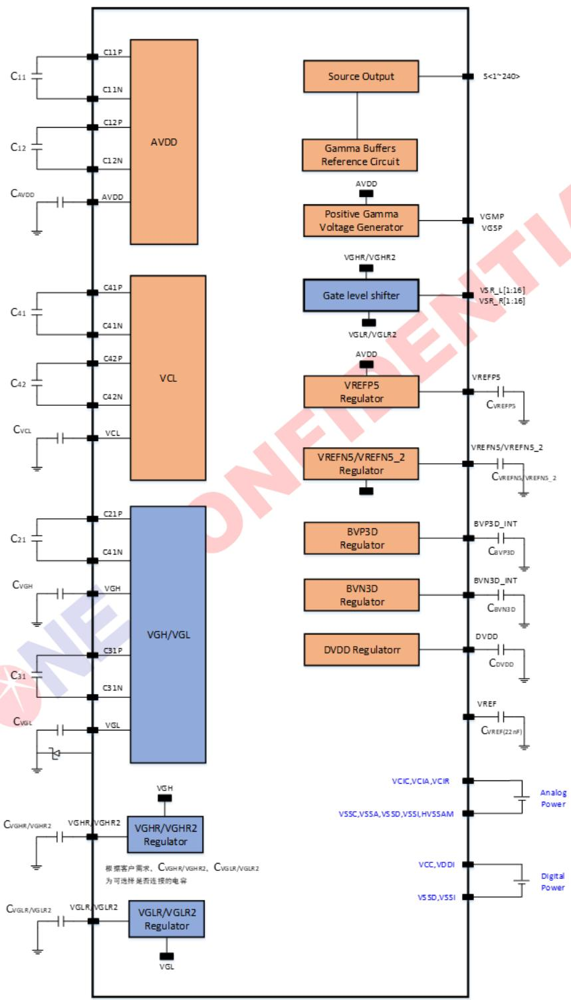

flowchart

```mermaid
graph LR
  Input["Input"] --> C11["C11"]
  Input --> C12["C12"]
  Input --> CAVDD["CAVDD"]
  C11 --> AVDD["AVDD"]
  C12 --> AVDD
  CAVDD --> AVDD
  AVDD --> SourceOutput["Source Output"]
  SourceOutput --> V5R_L["&quot;V5R_L[1:16"]"]
  SourceOutput --> V5R_R["&quot;V5R_R[1:16"]"]
  SourceOutput --> VGMP["VGMP\nVGSP"]
  SourceOutput --> VREFPS["VREFPS"]
  SourceOutput --> VREFN5["VREFN5/VREFN5_2\nCREFN5_VREFN5_2"]
  SourceOutput --> BVP3D["BVP3D\nBVP3D_INT\nCBVP3D"]
  SourceOutput --> BVN3D["BVN3D\nBVN3D_INT\nCBVN3D"]
  SourceOutput --> DVDD["DVDD\nCDVDD"]
  SourceOutput --> VREF["VREF\nCVREF(22nF)"]
  SourceOutput --> AnalogPower["Analog Power\nVCC,VCDA,VCIR\nVSSC,VSSA,VSSD,VSSI,HVSSAM"]
  SourceOutput --> DigitalPower["Digital Power\nVCC,VDDI\nVSSD,VSSI"]
```

# 8.2 EXTERNAL COMPONENTS CONNECTION

The Following components are necessary connected on the module to make sure the CO6300 can provided high performance and reliability.

<table><tr><td>Pad Name</td><td>Connection</td><td>Typical Value</td></tr><tr><td>VCI</td><td>Connect to Capacitor (Max 6.3V) : VCI ----||---- GND</td><td>2.2uF</td></tr><tr><td>VDDI</td><td>Connect to Capacitor (Max 6.3V) : VDDI ----||---- GND</td><td>2.2uF</td></tr><tr><td>VREF</td><td>Connect to Capacitor (Max 6.3V) : VREF ----||---- GND</td><td>22nF</td></tr><tr><td>VDD</td><td>Connect to Capacitor (Max 6.3V) : VDD ----||---- GND</td><td>1.0uF</td></tr><tr><td>VREFP</td><td>Connect to Capacitor (Max 10V) : VREFP ----||---- GND</td><td>1.0uF</td></tr><tr><td>VREFN5</td><td>Connect to Capacitor (Max 10V) : VREFN5 ----||---- GND</td><td>1.0uF</td></tr><tr><td>VREFN5_2</td><td>Connect to Capacitor (Max 10V) : VREFN5_2 ----||---- GND(非必须连接 cap,见下方 remark)</td><td>1.0uF</td></tr><tr><td>VGHR1</td><td>Connect to Capacitor (Max 16V) : VGHR1 ----||---- GND</td><td>2.2uF</td></tr><tr><td>VGHR2</td><td>Connect to Capacitor (Max 16V) : VGHR2 ----||---- GND(非必须连接 cap,见下方 remark)</td><td>2.2uF</td></tr><tr><td>VGLR1</td><td>Connect to Capacitor (Max 16V) : VGLR1 ----||---- GND</td><td>2.2uF</td></tr><tr><td>VGLR2</td><td>Connect to Capacitor (Max 16V) : VGLR2 ----||---- GND(非必须连接 cap,见下方 remark)</td><td>2.2uF</td></tr><tr><td>BVP3D</td><td>Connect to Capacitor (Max 10V) : ELVDD ----||---- GND</td><td>2.2uF</td></tr><tr><td>BVN3D</td><td>Connect to Capacitor (Max 10V) : ELVSS ----||---- GND</td><td>2.2uF</td></tr><tr><td>C11P/C11N</td><td>Connect to Capacitor (Max 6.3V) : C11P----||---- C11N</td><td>1.0uF</td></tr><tr><td>C12P/C12N</td><td>Connect to Capacitor (Max 6.3V) : C12P----||---- C12N</td><td>1.0uF</td></tr><tr><td>AVDD</td><td>Connect to Capacitor (Max 10V) : AVDD ----||----GND</td><td>2.2uF</td></tr><tr><td>C41P/C41N</td><td>Connect to Capacitor (Max 6.3V) : C41P ----||---- C41N</td><td>1.0uF</td></tr><tr><td>C42P/C42N</td><td>Connect to Capacitor (Max 6.3V) : C42P ----||---- C42N</td><td>1.0uF</td></tr><tr><td>VCL</td><td>Connect to Capacitor (Max 10V) : VCL ----||---- GND</td><td>2.2uF</td></tr><tr><td>C21P/C21N</td><td>Connect to Capacitor (Max 16V) : C21P ----||---- C21N</td><td>1.0uF</td></tr><tr><td>VGH</td><td>Connect to Capacitor (Max 16V) : VGH ----||---- GND</td><td>2.2uF</td></tr><tr><td>C31P/C31N</td><td>Connect to Capacitor (Max 16V) : C31P ----||---- C31N</td><td>1.0uF</td></tr><tr><td>VGL</td><td>Connect to Capacitor (Max 16V) : VGL ----||---- GND</td><td>2.2uF</td></tr><tr><td>VGL-GND</td><td>Connect to Schottky diode:VGL ----▶|----GND</td><td>D4(RB520G-30)</td></tr></table>

Necessary External Components Connection Table

Remark: 根据客户需求，C\_VGHR2, C\_VGLR2, C\_VREFN5\_2 为可选择的是否需要连接的电容；如果没有 VGHR2, VGLR2, VREFN5\_2 的需求，可以将 PAD 浮空，不连接电容 C\_VGHR2、C\_VGLR2、C\_VREFN\_5.

# 9. Important Notice

Chipone Technology (Beijing) Co., Ltd. (Chipone) reserves the right to make changes to their products or to discontinue any product or service without notice, and advise customers to obtain the latest version of relevant information to verify, before placing orders, that information being relied on is current and complete. All products are sold subject to the terms and conditions of sale supplied at the time of order acknowledgement, including those pertaining to warranty, patent infringement, and limitation of liability.

Chipone warrants performance of its semiconductor products to the specifications applicable at the time of sale in accordance with Chipone's standard warranty. Testing and other quality control techniques are utilized to the extent Chipone deems necessary to support this warranty. Specific testing of all parameters of each device is not necessarily performed, except those mandated by government requirements.

CERTAIN APPLICATIONS USING SEMICONDUCTOR PRODUCTS MAY INVOLVE POTENTIAL RISKS OF DEATH, PERSONAL INJURY, OR SEVERE PROPERTY OR ENVIRONMENTAL DAMAGE ("CRITICAL APPLICATIONS"). CHIPONE SEMICONDUCTOR PRODUCTS ARE NOT DESIGNED, AUTHORIZED, OR WARRANTED TO BE SUITABLE FOR USE IN LIFE-SUPPORT DEVICES OR SYSTEMS OR OTHER CRITICAL APPLICATIONS. INCLUSION OF CHIPONE PRODUCTS IN SUCH APPLICATIONS IS UNDERSTOOD TO BE FULLY AT THE CUSTOMER'S RISK.

In order to minimize risks associated with the customer's applications, adequate design and operating safeguards must be provided by the customer to minimize inherent or procedural hazards.

Chipone assumes no liability for applications assistance or customer product design. Chipone does not warrant or represent that any license, either express or implied, is granted under any patent right, copyright, mask work right, or other intellectual property right of Chipone covering or relating to any combination, machine, or process in which such semiconductor products or services might be or are used. Chipone's publication of information regarding any third party's products or services does not constitute Chipone's approval, warranty or endorsement thereof.

Copyright © 2021, Chipone Technology (Beijing) Co., Ltd.