# 1. 概要

CST3530 多点电容触控芯片，支持单层，多层模组及多种图案，采用多路 7V 以上高压驱动，实现高性能，高灵敏度真实多指触摸效果。相较传统的单路低压驱动可提供更高的信噪比和抗干扰能力。同时，芯片内部集成自互一体电容感应模块，结合智能扫描算法，在实现快速反应的同时，具有优异的抗噪、防水、低功耗表现。

# 2. 特性

■ 高性能电容检测电路及 DSP 模块

- 自互一体电容检测模块;  
- 多路高压同时驱动，实现高灵敏度，高信噪比采样；  
- 动态宽范围跳频技术，硬件滤波模块，更强的共模和液晶抗干扰能力；  
- 内置 32Bit MCU，最高 100MHz 时钟；  
- 内置 Flash 存储，支持在线编程；  
- 环境变化，自适应校准。

■ 性能指标

- 支持报点率到 $160\mathrm{Hz}$ ;  
- 最多支持真实 10 指触摸;  
- 动态模式下典型功耗：9mA;  
- 监控模式下典型功耗：2mA;  
- 睡眠模式下典型功耗：50uA;  
- 带水操作，大拇指识别及大手掌抑制。

■ 电容屏支持

- 支持 30 个驱动/感应通道,并支持灵活互换;  
- 通道悬空/下拉设计支持;  
- 支持传统的 DITO、SITO 以及触摸软硬板电路各种图形 Sensor;  
- 支持 Sensor 和排线的短路、开路、微短微断、一致性等工厂测试工具链；  
- 模组参数自动调校，最大支持阻抗达 40K;  
- Cover Lens 厚度支持，玻璃<=2mm，亚克力<=1mm。

■ 通讯接口

- IIC 主/从通讯接口，速率 10k\~400kbps 软件可配置；  
- GPIO 支持，多种工作模式可配，内置 2.5k 上拉电阻模式；  
- 内置 1.8V LDO, 兼容 1.8V/VDDA( $\leq$ 3.6V)
接口电平可配。

■ 电源供电

- 单电源供电 2.7\~5.5V，请参考电路设计；  
- 少量的外围器件。

■ 封装类型：QFN40 5mm\*5mm 0.4mm Pitch。

# 3. 应用

扫描笔、手机等。

# 4. 引脚排列

TOP VIEW  
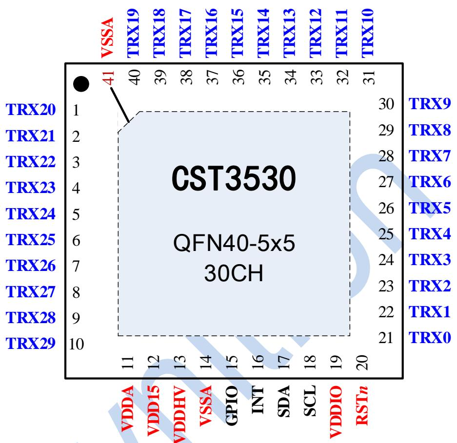

text_image

VSSA
TRX20
1
TRX21
2
TRX22
3
TRX23
4
TRX24
5
TRX25
6
TRX26
7
TRX27
8
TRX28
9
TRX29
10
11
12
13
14
GPIO
INT
SDA
SCL
VDDIO
RSTn
41
40
39
38
37
36
35
34
33
32
31
CST3530
QFN40-5x5
30CH
TRX0
TRX1
TRX2
TRX3
TRX4
TRX5
TRX6
TRX7
TRX8
TRX9
TRX10

# 5. 引脚描述

<table><tr><td>引脚</td><td>名称</td><td>类型</td><td>功能描述</td><td>引脚</td><td>名称</td><td>类型</td><td>功能描述</td></tr><tr><td>1</td><td>TRX20</td><td>I/O</td><td>感应/驱动通道</td><td>21</td><td>TRX0</td><td>I/O</td><td>感应/驱动通道</td></tr><tr><td>2</td><td>TRX21</td><td>I/O</td><td>感应/驱动通道</td><td>22</td><td>TRX1</td><td>I/O</td><td>感应/驱动通道</td></tr><tr><td>3</td><td>TRX22</td><td>I/O</td><td>感应/驱动通道</td><td>23</td><td>TRX2</td><td>I/O</td><td>感应/驱动通道</td></tr><tr><td>4</td><td>TRX23</td><td>I/O</td><td>感应/驱动通道</td><td>24</td><td>TRX3</td><td>I/O</td><td>感应/驱动通道</td></tr><tr><td>5</td><td>TRX24</td><td>I/O</td><td>感应/驱动通道</td><td>25</td><td>TRX4</td><td>I/O</td><td>感应/驱动通道</td></tr><tr><td>6</td><td>TRX25</td><td>I/O</td><td>感应/驱动通道</td><td>26</td><td>TRX5</td><td>I/O</td><td>感应/驱动通道</td></tr><tr><td>7</td><td>TRX26</td><td>I/O</td><td>感应/驱动通道</td><td>27</td><td>TRX6</td><td>I/O</td><td>感应/驱动通道</td></tr><tr><td>8</td><td>TRX27</td><td>I/O</td><td>感应/驱动通道</td><td>28</td><td>TRX7</td><td>I/O</td><td>感应/驱动通道</td></tr><tr><td>9</td><td>TRX28</td><td>I/O</td><td>感应/驱动通道</td><td>29</td><td>TRX8</td><td>I/O</td><td>感应/驱动通道</td></tr><tr><td>10</td><td>TRX29</td><td>I/O</td><td>感应/驱动通道</td><td>30</td><td>TRX9</td><td>I/O</td><td>感应/驱动通道</td></tr><tr><td>11</td><td>VDDA</td><td>PWR/I</td><td>2.7~5.5V, 2.2uF</td><td>31</td><td>TRX10</td><td>I/O</td><td>感应/驱动通道</td></tr><tr><td>12</td><td>VDD15</td><td>PWR/O</td><td>1.5V, 1uF</td><td>32</td><td>TRX11</td><td>I/O</td><td>感应/驱动通道</td></tr><tr><td>13</td><td>VDDHV</td><td>PWR/O</td><td>Max 8V, 1uF</td><td>33</td><td>TRX12</td><td>I/O</td><td>感应/驱动通道</td></tr><tr><td>14</td><td>VSSA</td><td>GND</td><td>模拟地</td><td>34</td><td>TRX13</td><td>I/O</td><td>感应/驱动通道</td></tr><tr><td>15</td><td>GPIO</td><td>I/O</td><td>GPIO</td><td>35</td><td>TRX14</td><td>I/O</td><td>感应/驱动通道</td></tr><tr><td>16</td><td>INT</td><td>I/O</td><td>GPIO/中断</td><td>36</td><td>TRX15</td><td>I/O</td><td>感应/驱动通道</td></tr><tr><td>17</td><td>SDA</td><td>I/O</td><td>I2C数据信号</td><td>37</td><td>TRX16</td><td>I/O</td><td>感应/驱动通道</td></tr><tr><td>18</td><td>SCL</td><td>I/O</td><td>I2C时钟信号</td><td>38</td><td>TRX17</td><td>I/O</td><td>感应/驱动通道</td></tr><tr><td>19</td><td>VDDIO</td><td>PWR/I</td><td>接VDDA/NC(≤3.6V)</td><td>39</td><td>TRX18</td><td>I/O</td><td>感应/驱动通道</td></tr><tr><td>20</td><td>RSTn</td><td>I</td><td>复位,低有效</td><td>40</td><td>TRX19</td><td>I/O</td><td>感应/驱动通道</td></tr><tr><td></td><td></td><td></td><td></td><td>41</td><td>VSSA</td><td>GND</td><td>模拟地</td></tr></table>

I Input Only 仅输入

O Output Only 仅输出

I/O Input And Output 输入和输出

# 6. 典型应用电路图

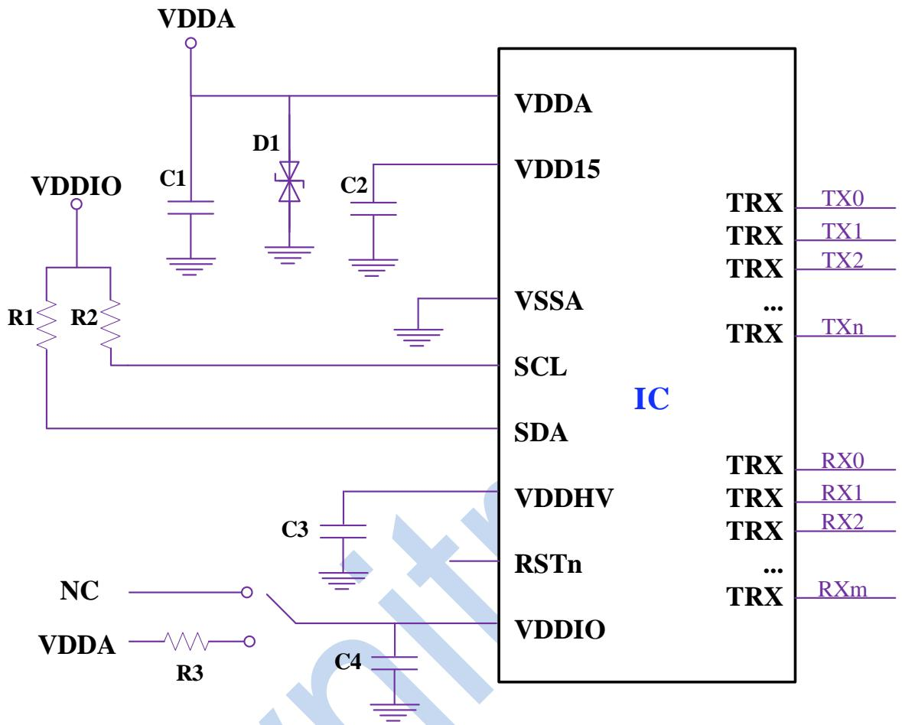

text_image

VDDA
VDDIO
R1 R2
C1
D1
C2
VDDA
VDD15
VSSA
SCL
SDA
IC
TRX TX0
TRX TX1
TRX TX2
...
TRX TXn
TRX RX0
TRX RX1
TRX RX2
...
TRX RXm
VDDHV
RSTn
VDDIO
C3
NC
VDDA R3
C4

C1: 2.2uF/6.3V  
C2: 1uF/6.3V  
C3: 1uF/10V  
C4: 1uF/6.3V  
R3: 560 ohm  
D1: 可选，TVS管（ESD5Z3.3/5.0V对应VDDA），增强ESD能力。  
R1/R2: 可选，IIC 总线上拉电阻，可配置芯片内部 2.5K 上拉代替。  
VDDIO: VDDA( $\leqslant$ 3.6V)或者悬空，悬空IIC总线电压默认1.8V。  
GPIO和INT：通用数字I/O，可作为INT，也可作为SensorID悬空或接GND。

# 7. 订购信息

<table><tr><td>料号</td><td>封装</td><td>包装</td><td>表面印字</td><td>包装</td></tr><tr><td>CST3530</td><td>QFN5*5 - 40L(P0.40 T0.55)</td><td>5000/盘编带出货</td><td></td><td>圆点:Pin1 MarkCST3530:型号字符XXXXX:生产追踪码</td></tr></table>

# 8. 电气特性

# 8.1 极限电气参数

<table><tr><td>参数</td><td>符号</td><td>最小值</td><td>最大值</td><td>单位</td><td>注释</td></tr><tr><td>供电电源 VDDA</td><td>Vdd</td><td>-0.3</td><td>6.5</td><td>V</td><td>相对 VSSA</td></tr><tr><td>模拟 I/O 承受电压</td><td>Vioa</td><td>-0.3</td><td>7.5</td><td>V</td><td></td></tr><tr><td>数字 I/O 承受电压</td><td>Viod</td><td>-0.3</td><td>3.6</td><td>V</td><td></td></tr><tr><td>I/O 承受最大电流</td><td>Iiom</td><td>-15</td><td>15</td><td>mA</td><td></td></tr><tr><td>存储温度范围</td><td>Tstg</td><td>-60</td><td>+125</td><td>°C</td><td></td></tr><tr><td>工作湿度</td><td>Hopr</td><td>-</td><td>95</td><td>%</td><td></td></tr><tr><td>ESD HBM</td><td>ESD</td><td>±3</td><td>-</td><td>kV</td><td>Human Body Model</td></tr><tr><td>ESD CDM</td><td>ESD</td><td>±2</td><td>-</td><td>kV</td><td>Charged Device Model</td></tr><tr><td>Latch-up Current</td><td>LU</td><td>±200</td><td>-</td><td>mA</td><td></td></tr></table>

# 8.2 推荐工作条件

<table><tr><td>参数</td><td>符号</td><td>最小值</td><td>典型值</td><td>最大值</td><td>单位</td><td>注释</td></tr><tr><td>供电电源 VDDA</td><td>Vdd</td><td>2.7</td><td>3.0</td><td>5.5</td><td>V</td><td>相对 VSSA</td></tr><tr><td>电源纹波</td><td>Vrip</td><td>-</td><td>-</td><td>100</td><td>mV</td><td>peak-to-peak</td></tr><tr><td>VDDIO</td><td>Vioa</td><td>1.65</td><td>1.8</td><td>3.6</td><td>V</td><td></td></tr><tr><td>工作温度范围</td><td>Topr</td><td>-20</td><td>+25</td><td>+85</td><td>°C</td><td></td></tr></table>

# 8.3 直流(DC)电气特性

环境温度 $25^{\circ}C$ ，VDDA=3.0V。

<table><tr><td>参数</td><td>符号</td><td>最小值</td><td>典型值</td><td>最大值</td><td>单位</td></tr><tr><td>低电平输出电压值</td><td>Vol</td><td>-</td><td>-</td><td>0.2*VDDIO</td><td>V</td></tr><tr><td>高电平输出电压值</td><td>Voh</td><td>0.8*VDDIO</td><td>-</td><td>-</td><td>V</td></tr><tr><td>输入低电平电压值</td><td>Vil</td><td>-0.3</td><td>-</td><td>0.3*VDDIO</td><td>V</td></tr><tr><td>输入高电平电压值</td><td>Vih</td><td>0.7*VDDIO</td><td>-</td><td>VDDIO</td><td>V</td></tr><tr><td>工作电流(动态模式)</td><td>Iopr</td><td>-</td><td>9</td><td>-</td><td>mA</td></tr><tr><td>工作电流(监控模式)</td><td>Imon</td><td>-</td><td>2</td><td>-</td><td>mA</td></tr><tr><td>工作电流(待机模式)</td><td>Ista</td><td>-</td><td>2</td><td>-</td><td>mA</td></tr><tr><td>工作电流(睡眠模式)</td><td>Islp</td><td>-</td><td>50</td><td>-</td><td>uA</td></tr></table>

# 8.4 交流(AC)电气特性

环境温度 $25^{\circ}C$ ，VDDA=3.0V。

<table><tr><td>参数</td><td>符号</td><td>最小值</td><td>典型值</td><td>最大值</td><td>单位</td></tr><tr><td>TX时钟频率</td><td>ftx</td><td>-</td><td>-</td><td>400</td><td>KHz</td></tr><tr><td>TX输出电压</td><td>Vtx</td><td>-</td><td>-</td><td>7.5</td><td>V</td></tr><tr><td>RX输入电压</td><td>Vrx</td><td>-</td><td>1.4</td><td>-</td><td>V</td></tr></table>

# 9. 功能描述

CST3530 系列多点电容触控芯片，采用 7V 高压多路驱动，相较传统的低压驱动可提供更高的信噪比和抗噪能力，实现超灵敏触摸。同时，芯片内部自互电容感应模块，结合智能扫描算法，在实现快速反应的同时，具有极其优异的抗噪、防水、低功耗表现。

整体系统框图如下:

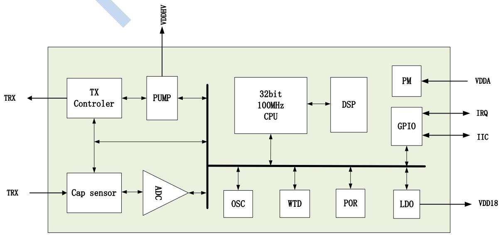

flowchart

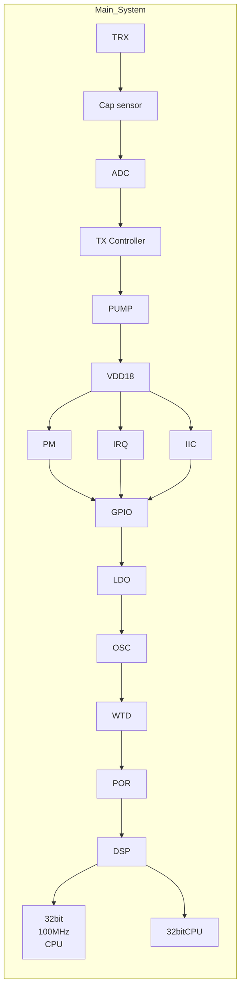

# 9.1 主机接口

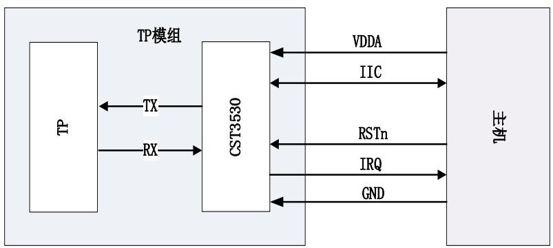

flowchart

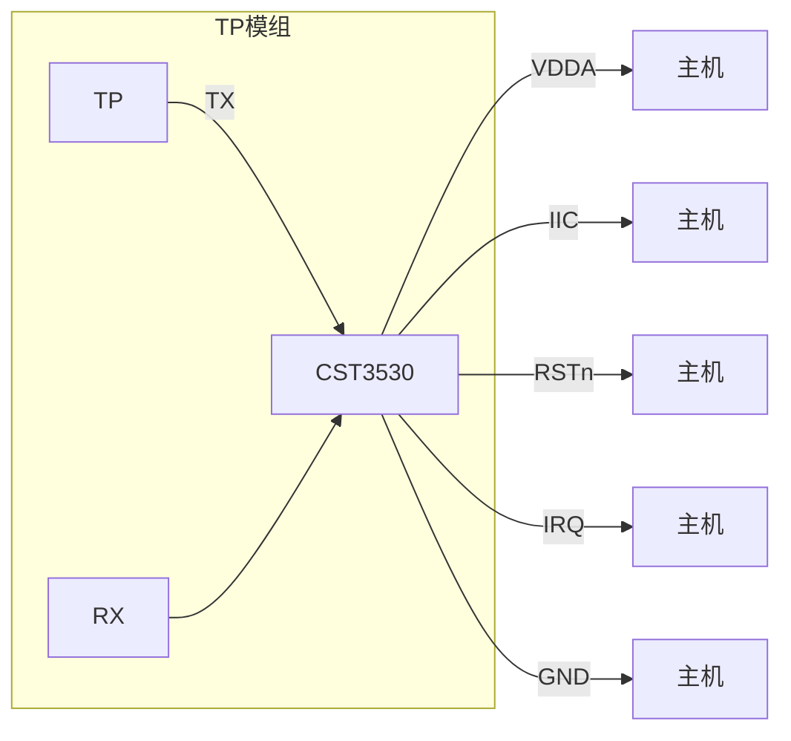

上图是主机和CST3530之间的接口关系，主机和CST3530之间包IIC、IRQ、RSTn以及VDDA信号，CST3530和TP之间包含TX和RX讯号。

VDDA: CST3530的工作电压。

SCL和SDA：串行通讯接口，主机为Master，CST3530为Slave。

IRQ: 中断信号, 这是通用的GPIO接口, 当CST3530准备好数据时, 用以通知主机数据过来读取, 比如: 触摸数据, 手势数据等。

# 9.2 工作模式

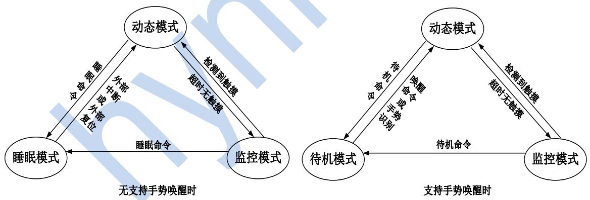

- 动态模式  
当频繁有触摸操作时，处于此模式。在此模式下，触控芯片快速对触摸屏进行智能扫描，以及时检测触摸并上报给主机。  
- 监控模式  
当触摸屏超时无触摸动作时，芯片自动切换到监控模式。在此模式下，触控芯片以较低频率，通过扫描检测可能到来的触摸动作，并迅速切换到动态模式。  
- 待机模式

当接收到待机命令后，处于此模式。在此模式下，触控芯片以较低频率对触摸屏进行扫描，匹配唤醒手势后进入动态模式，同时通过 IRQ 引脚唤醒主机，也可通过唤醒命令切换到动态模式。

# - 睡眠模式

当接收到睡眠命令后，处于此模式，在此模式下，触控芯片处于深度睡眠状态，以最大限度节省功耗，可通过外部中断或者外部复位唤醒。

# 9.3 通道/节点配置

CST3530 多点触控芯片最多可提供 30 个通道，且各通道在驱动/感应功能之间灵活可配，每个通道均支持自互电容扫描。

每节点可支持的互电容大小范围：0.5pF～20pF (假定驱动电压为7V)。

# 9.4 I2C 通讯

CST3530 支持标准的 I2C 通讯协议, 可实现 10k\~400kbps 的可配通信速率。两个 I2C 引脚 SCL 和 SDA, 除支持开漏模式外, 还支持内部上拉模式, 供灵活选择。

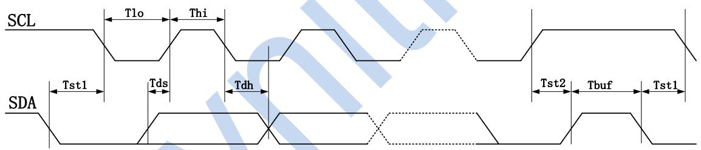

text_image

SCL
Tlo
Thi
Tst1
Tds
Tdh
SDA
Tst2
Tbuf
Tst1

<table><tr><td rowspan="2">Description</td><td rowspan="2">Symbol</td><td colspan="2">Fast Mode</td><td rowspan="2">Unit</td></tr><tr><td>Min</td><td>Max</td></tr><tr><td>SCL clock frequency</td><td>Fscl</td><td>-</td><td>400</td><td>Kbps</td></tr><tr><td>SCL hold time for START condition</td><td>Tst1</td><td>0.6</td><td>-</td><td>us</td></tr><tr><td>LOW period of SCL</td><td>Tlo</td><td>1.3</td><td>-</td><td>us</td></tr><tr><td>HIGH period of SCL</td><td>Thi</td><td>0.6</td><td>-</td><td>us</td></tr><tr><td>SDA setup time</td><td>Tds</td><td>0.1</td><td>-</td><td>us</td></tr><tr><td>SDA hold time</td><td>Tdh</td><td>0</td><td>-</td><td>us</td></tr><tr><td>SCL setup time for STOP condition</td><td>Tst2</td><td>0.6</td><td>-</td><td>us</td></tr><tr><td>Ready time between STOP and START</td><td>Tbuf</td><td>1.5</td><td>-</td><td>us</td></tr></table>

CST3530始终作为从机，启动都是由主机主动建立的。在时钟线SCL保持高电平期间，数据线SDA上的电平被拉低（即负跳变），定义为I2C总线总线的启动信号。

CST3530检测总线上起始信号之后所发送的8位地址（该地址可以在芯片中自定义，默认为0x34/0x35），在第9个时钟周期，将数据线SDA改为输出口并拉低，作为应答信号。数据线SDA会按9个时钟周期串行发送9位数据，8位有效数据加1位接收方发送的应答信号ACK或非应答信号NACK。

停止信号也是由主机在通讯结束后主动建立的。停止信号是时钟线SCL保持高电平期间，数据线SDA被释放，使得SDA返回高电平（即正跳变）。它标志着一次数据传输的终止。

a. 主机往CST3530中写数据。数据传输格式如图所示:

<table><tr><td>S</td><td>Slave Address[7bit]</td><td>W[1bit]</td><td>ACK</td><td>DATA[8bit]</td><td>ACK</td><td>...</td><td>DATA[8bit]</td><td>ACK/NACK</td><td>P</td></tr></table>

b. 主机从CST3530中读数据。数据传输格式如图所示:

<table><tr><td>S</td><td>Slave Address[7bit]</td><td>R[1bit]</td><td>ACK</td><td>DATA[8bit]</td><td>ACK</td><td>...</td><td>DATA[8bit]</td><td>NACK</td><td>P</td></tr></table>

c. 主机往CST3530中写数据，然后重启起始条件，紧接着从CST3530中读取数据；或者是主设备从CST3530中读数据，然后重启起始条件，紧接着主设备往CST3530中写数据。数据传输格式如图所示：

<table><tr><td>S</td><td>Slave Address[7bit]</td><td>W[1bit]</td><td>ACK</td><td>DATA[8bit]</td><td>ACK</td><td>...</td><td>DATA[8bit]</td><td>ACK/NACK</td><td></td></tr><tr><td>RS</td><td>Slave Address[7bit]</td><td>R[1bit]</td><td>ACK</td><td>DATA[8bit]</td><td>ACK</td><td>...</td><td>DATA[8bit]</td><td>NACK</td><td>P</td></tr></table>

# 9.5 上电/复位

内置上电复位模块将使芯片保持在复位状态直至电压正常，当电压低于某阈值时，芯片也会被复位，当外部复位引脚 RSTn 为低时将复位整个芯片，该引脚内置上拉电阻兼 RC 滤波，外部可将该引脚悬空，芯片内置看门狗确保在异常情况发生时，芯片仍能在规定时间内回到正常工作状态。

上电复位的时序如下图所示:

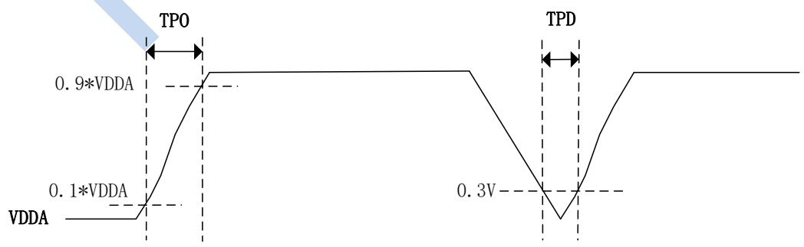

line

| Signal | State |
| --- | --- |
| VDDA | 0.1*VDDA |
| TPO | 0.9*VDDA |
| TPD | 0.3V |

上电时序

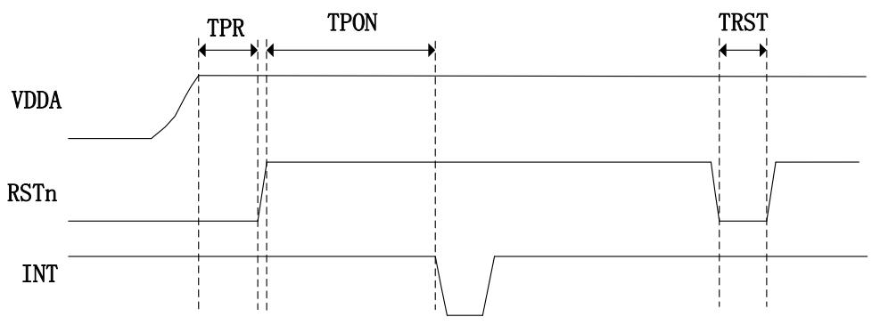

text_image

TPR
TPON
TRST
VDDA
RSTn
INT

复位时序

<table><tr><td>符号</td><td>描述</td><td>最小值</td><td>最大值</td><td>单位</td></tr><tr><td>TPO</td><td>供电上升时间</td><td>-</td><td>5</td><td>ms</td></tr><tr><td>TPD</td><td>供电保持 0.3V 以下的时间</td><td>5</td><td>-</td><td>ms</td></tr><tr><td>TPR</td><td>RSTn 引脚延迟拉高时间</td><td>1</td><td>-</td><td>ms</td></tr><tr><td>TPON</td><td>上电或复位后能够上报触摸的时间</td><td>-</td><td>200</td><td>ms</td></tr><tr><td>TRST</td><td>复位脉冲时间</td><td>0.1</td><td>-</td><td>ms</td></tr></table>

# 9.6 中断方式

触控芯片仅在检测到有效触摸，并需要上报给主机时，才会通过 INT 引脚通知主机读取有效数据，以提高效率，减轻 CPU 负担，中断边沿可根据需要配置为上升沿或者下降沿有效，当在待机模下匹配预定义手势时，INT 引脚还用作唤醒主机。

# 10. 产品封装

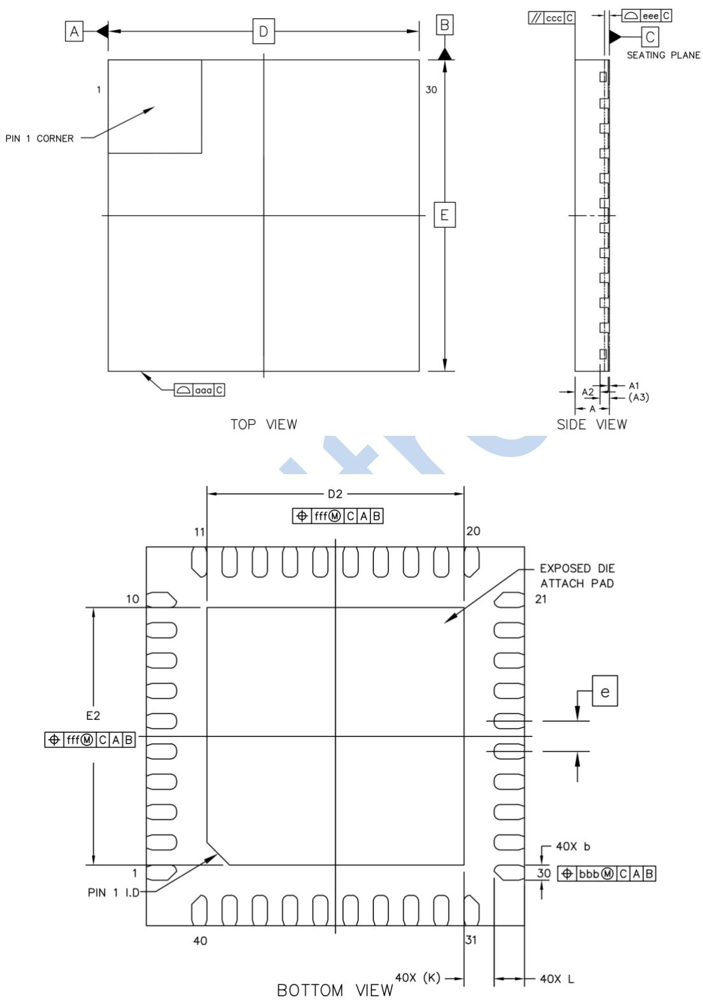

<table><tr><td rowspan="2" colspan="2">Item</td><td rowspan="2">Symbol</td><td colspan="3">Dimensions In Millimeters</td></tr><tr><td>Min</td><td>Nom</td><td>Max</td></tr><tr><td colspan="2">Total Thickness</td><td>A</td><td>0.5</td><td>0.55</td><td>0.6</td></tr><tr><td colspan="2">Stand Off</td><td>A1</td><td>0</td><td>0.02</td><td>0.05</td></tr><tr><td colspan="2">Mold Thickness</td><td>A2</td><td colspan="3">0.401</td></tr><tr><td colspan="2">L/F Thickness</td><td>A3</td><td colspan="3">0.152</td></tr><tr><td rowspan="2">Body Size</td><td>X</td><td>D</td><td colspan="3">5</td></tr><tr><td>Y</td><td>E</td><td colspan="3">5</td></tr><tr><td rowspan="2">Exposed Pad Size</td><td>X</td><td>D2</td><td>3.3</td><td>3.4</td><td>3.5</td></tr><tr><td>Y</td><td>E2</td><td>3.3</td><td>3.4</td><td>3.5</td></tr><tr><td colspan="2">Lead Width</td><td>b</td><td>0.15</td><td>0.2</td><td>0.25</td></tr><tr><td colspan="2">Lead Pitch</td><td>e</td><td colspan="3">0.4</td></tr><tr><td colspan="2">Lead Length</td><td>L</td><td>0.3</td><td>0.4</td><td>0.5</td></tr><tr><td colspan="2">Lead Tip To Exposed Pad Edge</td><td>K</td><td colspan="3">0.4</td></tr><tr><td colspan="2">Package Edge Tolerance</td><td>aaa</td><td colspan="3">0.1</td></tr><tr><td colspan="2">Lead Offset</td><td>bbb</td><td colspan="3">0.1</td></tr><tr><td colspan="2">Mold Flatness</td><td>ccc</td><td colspan="3">0.1</td></tr><tr><td colspan="2">Coplanarity</td><td>eee</td><td colspan="3">0.08</td></tr><tr><td colspan="2">Exposed Pad Offset</td><td>fff</td><td colspan="3">0.1</td></tr></table>

# 11. 版本记录

<table><tr><td>文件版本</td><td>修订</td><td>时间</td></tr><tr><td>V1.0</td><td>初始版本</td><td>2023-12-10</td></tr></table>

免责声明：本文件不存在以明示、暗示或任何其他方式授予任何知识产权许可或作出其他声明及担保，本产品应适用产品销售相关协议约定的条件及条款，包括但不限于知识产权、责任限制等。本产品非专门设计于用作生命维持系统中的关键组件，且其使用应由具备相应开发知识的熟练开发人员进行操作，您在使用过程中应按照技术规范及安全要求，避免因此遭受损害。为尽可能地保证准确性，本文件中所述的产品特性、应用信息及其他内容将可能由海栎创以更新之信息所替代。